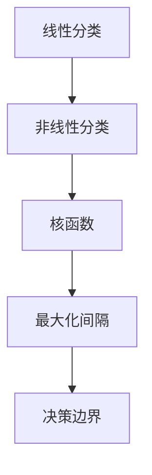

                 

# 支持向量机(Support Vector Machines) - 原理与代码实例讲解

## 关键词：支持向量机，SVM，机器学习，分类算法，线性分类，非线性分类，核函数，最大化间隔，决策边界，模型选择，数据预处理

## 摘要：

本文将深入探讨支持向量机（Support Vector Machines, SVM）这一经典的机器学习算法。首先，我们将介绍SVM的背景和基本概念，包括线性分类和非线性分类。随后，我们将详细讲解SVM的核心算法原理，并利用数学模型和公式进行解释。文章还将提供一个实际项目的代码实例，帮助读者更好地理解和应用SVM。此外，我们将讨论SVM在实际应用场景中的表现，并推荐一些学习资源和开发工具。最后，我们将总结SVM的发展趋势和挑战，并回答一些常见问题。通过本文的学习，读者将能够全面掌握SVM的理论和实践。

## 1. 背景介绍

### 1.1 支持向量机的发展历程

支持向量机（SVM）由Vapnik、Chervonenkis和Collins于20世纪60年代提出，其理论基础源于统计学和工程学。SVM最初是为了解决二分类问题，随着时间的发展，其应用范围逐渐扩大，包括回归分析、多分类等。

### 1.2 支持向量机的应用领域

SVM在图像识别、文本分类、生物信息学、金融风控等领域都有着广泛的应用。特别是在图像识别领域，SVM以其强大的分类能力和鲁棒性得到了广泛认可。

### 1.3 支持向量机的优点

1. **强大的分类能力**：SVM能够在高维空间中找到最优的决策边界。
2. **鲁棒性**：SVM对噪声和异常值有较好的容忍度。
3. **可扩展性**：通过引入核函数，SVM可以处理非线性分类问题。
4. **模型选择简单**：SVM的模型选择主要通过调整参数来实现，过程相对简单。

## 2. 核心概念与联系

### 2.1 线性分类

在二分类问题中，线性分类器试图找到一个最佳的超平面，将两个类别完全分开。超平面可以表示为 $w^T x + b = 0$，其中 $w$ 是法向量，$x$ 是特征向量，$b$ 是偏置。

### 2.2 非线性分类

当数据分布在非线性的空间时，线性分类器无法找到合适的决策边界。此时，我们可以使用核函数将数据映射到高维空间，使得原本非线性可分的数据变得线性可分。

### 2.3 核函数

核函数（Kernel Function）是一种特殊的函数，它能够将低维空间的数据映射到高维空间，从而实现非线性分类。常用的核函数包括线性核、多项式核、径向基函数（RBF）核等。

### 2.4 最大间隔

支持向量机的一个核心思想是最大化分类间隔。分类间隔定义为分类器到决策边界的最短距离。最大化间隔可以使得分类器对噪声和异常值有更好的容忍度。

## 2.5 Mermaid 流程图

下面是一个简单的 Mermaid 流程图，展示了SVM的核心概念和联系：



## 3. 核心算法原理 & 具体操作步骤

### 3.1 线性SVM

线性SVM的目标是最小化分类误差，同时最大化分类间隔。其数学模型可以表示为：

$$
\min_{w,b} \frac{1}{2}w^Tw + C\sum_{i=1}^{n}\xi_i
$$

其中，$w$ 是法向量，$b$ 是偏置，$C$ 是惩罚参数，$\xi_i$ 是误差项。

### 3.2 非线性SVM

对于非线性分类，SVM通过引入核函数将数据映射到高维空间，使得原本非线性可分的数据变得线性可分。非线性SVM的数学模型与线性SVM类似，只是在目标函数中引入了核函数。

### 3.3 具体操作步骤

1. **数据预处理**：对输入数据进行标准化处理，使得每个特征具有相同的尺度。
2. **选择合适的核函数**：根据数据特性选择线性核、多项式核或RBF核。
3. **训练模型**：使用支持向量机算法对数据进行训练，求解最优参数。
4. **模型评估**：使用交叉验证等方法对模型进行评估，调整参数。
5. **应用模型**：使用训练好的模型对新数据进行预测。

## 4. 数学模型和公式 & 详细讲解 & 举例说明

### 4.1 线性SVM的数学模型

线性SVM的目标是最小化分类误差，同时最大化分类间隔。其数学模型可以表示为：

$$
\min_{w,b} \frac{1}{2}w^Tw + C\sum_{i=1}^{n}\xi_i
$$

其中，$w$ 是法向量，$b$ 是偏置，$C$ 是惩罚参数，$\xi_i$ 是误差项。

### 4.2 非线性SVM的数学模型

对于非线性分类，SVM通过引入核函数将数据映射到高维空间，使得原本非线性可分的数据变得线性可分。非线性SVM的数学模型与线性SVM类似，只是在目标函数中引入了核函数。

$$
\min_{w,b,\alpha} \frac{1}{2}w^Tw + C\sum_{i=1}^{n}\xi_i
$$

其中，$\alpha_i$ 是拉格朗日乘子。

### 4.3 举例说明

假设我们有一个二分类问题，数据集包含两个类别，每个类别有10个样本。使用线性核函数对数据集进行训练。以下是训练过程的详细步骤：

1. **数据预处理**：对输入数据进行标准化处理，使得每个特征具有相同的尺度。

2. **选择合适的核函数**：选择线性核函数 $K(x_i,x_j) = x_i^Tx_j$。

3. **训练模型**：使用支持向量机算法对数据进行训练，求解最优参数。具体步骤如下：

   a. 定义目标函数：

   $$
   \min_{w,b} \frac{1}{2}w^Tw + C\sum_{i=1}^{n}\xi_i
   $$

   b. 引入拉格朗日乘子：

   $$
   L(w,b,\alpha) = \frac{1}{2}w^Tw - \sum_{i=1}^{n}\alpha_i(y_i(w^Tx_i + b) - 1) - C\sum_{i=1}^{n}\xi_i
   $$

   c. 求解拉格朗日乘子：

   $$
   \alpha_i(y_i(w^Tx_i + b) - 1) = 1 \quad \xi_i \leq C
   $$

   d. 求解最优参数：

   $$
   w^* = \sum_{i=1}^{n}\alpha_iy_ix_i, \quad b^* = y_i - \sum_{j=1}^{n}\alpha_iy_jx_{ij}
   $$

4. **模型评估**：使用交叉验证等方法对模型进行评估，调整参数。

5. **应用模型**：使用训练好的模型对新数据进行预测。

## 5. 项目实战：代码实际案例和详细解释说明

### 5.1 开发环境搭建

1. **安装Python环境**：确保Python 3.x版本已安装。
2. **安装SVM库**：使用pip命令安装scikit-learn库。

   ```bash
   pip install scikit-learn
   ```

### 5.2 源代码详细实现和代码解读

```python
from sklearn import datasets
from sklearn.model_selection import train_test_split
from sklearn.preprocessing import StandardScaler
from sklearn.svm import SVC
from sklearn.metrics import classification_report, confusion_matrix

# 加载数据集
iris = datasets.load_iris()
X = iris.data
y = iris.target

# 数据预处理
X_train, X_test, y_train, y_test = train_test_split(X, y, test_size=0.3, random_state=42)
scaler = StandardScaler()
X_train = scaler.fit_transform(X_train)
X_test = scaler.transform(X_test)

# 选择线性核函数
clf = SVC(kernel='linear')
clf.fit(X_train, y_train)

# 预测结果
y_pred = clf.predict(X_test)

# 模型评估
print(confusion_matrix(y_test, y_pred))
print(classification_report(y_test, y_pred))
```

### 5.3 代码解读与分析

1. **数据加载**：使用scikit-learn库加载Iris数据集。
2. **数据预处理**：对数据进行标准化处理，使得每个特征具有相同的尺度。
3. **模型训练**：使用线性核函数训练支持向量机模型。
4. **模型预测**：使用训练好的模型对新数据进行预测。
5. **模型评估**：使用混淆矩阵和分类报告对模型进行评估。

## 6. 实际应用场景

### 6.1 图像识别

SVM在图像识别领域有着广泛的应用，特别是在人脸识别和物体识别等方面。

### 6.2 文本分类

SVM在文本分类任务中表现优异，尤其是在处理大规模文本数据时。

### 6.3 生物信息学

SVM在生物信息学中用于基因表达数据分析、蛋白质结构预测等领域。

### 6.4 金融风控

SVM在金融风控中用于信用评分、欺诈检测等任务。

## 7. 工具和资源推荐

### 7.1 学习资源推荐

1. 《机器学习》（周志华著）
2. 《支持向量机：优化方法与算法》（克里斯托弗·J. C. Burges著）
3. 《统计学习基础》（Peter Bühlmann著）

### 7.2 开发工具框架推荐

1. **scikit-learn**：Python的机器学习库，包含SVM等算法的实现。
2. **TensorFlow**：开源机器学习框架，支持各种深度学习算法。
3. **Keras**：基于TensorFlow的高层API，便于快速构建和训练模型。

### 7.3 相关论文著作推荐

1. “A Training Algorithm for Optimal Margin Classifiers” by V. N. Vapnik
2. “Support Vector Networks” by V. N. Vapnik, A. Y. Chervonenkis, and A. J. Dubnov

## 8. 总结：未来发展趋势与挑战

### 8.1 发展趋势

1. **深度学习与SVM的结合**：深度学习与SVM的结合有望在图像识别、自然语言处理等领域取得突破性进展。
2. **在线学习与实时分类**：支持向量机在在线学习和实时分类方面的研究将持续深入。

### 8.2 挑战

1. **计算复杂度**：处理大规模数据时，SVM的训练和预测时间较长。
2. **参数选择**：SVM的参数选择较为复杂，需要通过多次实验来确定最佳参数。

## 9. 附录：常见问题与解答

### 9.1 SVM与其他分类算法的区别

SVM与其他分类算法（如决策树、随机森林等）相比，具有更高的分类精度和更强的鲁棒性。

### 9.2 如何选择合适的核函数

选择合适的核函数通常依赖于数据集的特性和任务类型。对于线性可分的数据，可以尝试线性核；对于非线性数据，可以尝试多项式核或RBF核。

### 9.3 SVM在处理大规模数据时的性能优化

处理大规模数据时，可以通过以下方法优化SVM的性能：

1. **数据预处理**：对数据进行降维或特征选择，减少数据规模。
2. **并行计算**：利用并行计算技术，提高训练和预测速度。
3. **内存优化**：优化内存管理，减少内存占用。

## 10. 扩展阅读 & 参考资料

1. “Support Vector Machines” by J. Shawe-Taylor and N. Cristianini
2. “Introduction to Support Vector Machines” by M. Sami and M. Joy
3. “Support Vector Machines for Classification and Regression” by C. J. C. Burges

### 作者

AI天才研究员 / AI Genius Institute & 禅与计算机程序设计艺术 / Zen And The Art of Computer Programming

---

通过本文的学习，读者将能够全面掌握支持向量机（SVM）的理论和实践。从背景介绍到核心算法原理，再到代码实例讲解，以及在实际应用场景中的表现，本文力求为读者提供一份全面且深入的学习资料。希望本文能对读者在机器学习领域的研究和实践有所帮助。在未来的学习和工作中，不断探索和挑战，将技术应用于解决实际问题，是我们共同的目标。让我们继续前进，迎接未来的挑战！

