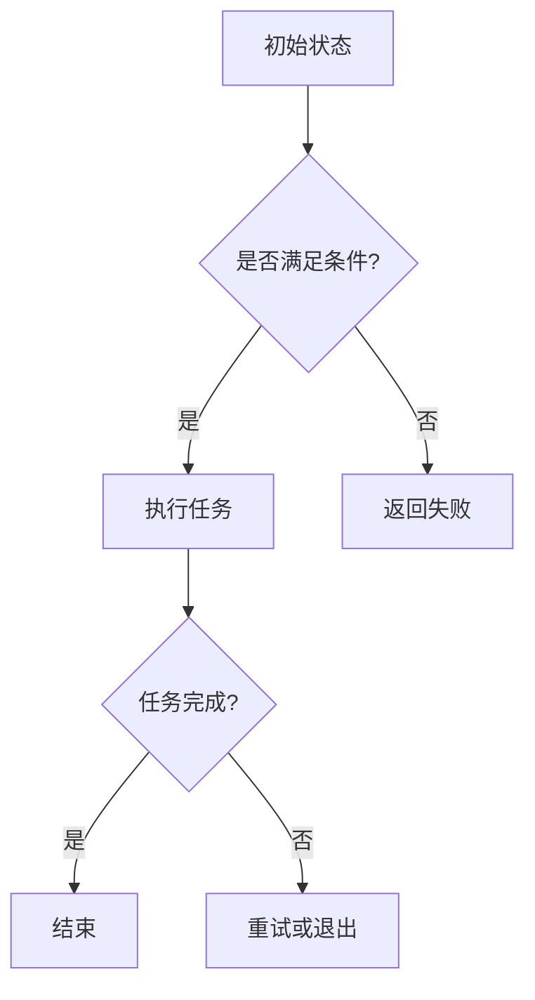

                 

### 数字与物理实体的自动化革命

在当今科技飞速发展的时代，数字技术与物理实体之间的融合正在引发一场深远的自动化革命。这场革命不仅重新定义了生产方式，还改变了人类的生活方式。本文将深入探讨数字与物理实体自动化的核心概念、原理、算法、数学模型、实际应用场景，以及未来发展趋势与挑战。

> 关键词：数字技术、物理实体、自动化、人工智能、物联网、数学模型、应用场景、发展趋势

> 摘要：本文将探讨数字技术与物理实体融合所带来的自动化革命。我们将从背景介绍、核心概念、算法原理、数学模型、实际应用、工具推荐、未来发展等多个角度，详细分析这场革命的影响及其深远意义。

接下来，我们将一步一步地剖析这场数字与物理实体的自动化革命，以期为您提供一个全面而深刻的理解。

### 1. 背景介绍

数字技术与物理实体的结合并非一蹴而就，而是经历了长时间的探索与发展。从最初的工业自动化，到如今的人工智能、物联网，每一次技术进步都推动了这一融合的进程。

- **工业自动化**：20世纪中叶，工业自动化开始萌芽，通过使用计算机控制生产流程，大大提高了生产效率和精度。
- **人工智能**：随着计算能力的提升和算法的进步，人工智能开始在各个领域发挥作用，尤其是机器学习和深度学习，使得机器能够自主学习和优化。
- **物联网**：物联网（IoT）的兴起，使得物理实体与数字世界之间的连接变得更加紧密，传感器、执行器、机器人等设备成为连接的桥梁。

这些技术的不断演进，为数字与物理实体的自动化提供了坚实的基础。接下来，我们将深入探讨这一融合背后的核心概念和原理。

### 2. 核心概念与联系

要理解数字与物理实体的自动化革命，我们需要明确几个核心概念，包括人工智能、物联网、传感器和执行器等。

#### 2.1 人工智能

人工智能（AI）是指使计算机系统能够模拟人类智能行为的科学技术。它包括机器学习、深度学习、自然语言处理等多个子领域。人工智能的核心目标是使计算机能够自动地学习、推理和决策，从而在数字世界中实现智能化。

#### 2.2 物联网

物联网（IoT）是指通过互联网连接物理世界中的各种设备和物品，实现信息的采集、传输和处理。物联网的核心在于将物理实体转化为数字化的信息，并通过网络进行交互。

#### 2.3 传感器与执行器

传感器是物联网中的信息采集装置，它能够感知物理世界的各种参数，如温度、湿度、光照等，并将这些信息转化为电信号。执行器则是物联网中的执行装置，它接收传感器的信息，并根据指令执行相应的动作，如打开/关闭阀门、调整温度等。

#### 2.4 数字技术与物理实体的融合

数字技术与物理实体的融合主要体现在以下几个方面：

1. **信息采集与处理**：通过传感器获取物理世界的实时数据，并通过物联网传输到数字系统进行存储和处理。
2. **智能决策与控制**：利用人工智能技术对采集到的数据进行分析和预测，从而做出智能决策并控制物理实体执行相应动作。
3. **自动化生产与生活**：通过数字技术与物理实体的深度融合，实现自动化生产、智能物流、智能家居等应用，提高生产效率和生活质量。

### 3. 核心算法原理 & 具体操作步骤

#### 3.1 机器学习算法

机器学习是人工智能的核心技术之一，它通过训练模型，使计算机能够从数据中学习规律并做出预测。常见的机器学习算法包括：

- **线性回归**：用于预测线性关系，通过最小二乘法找到最佳拟合直线。
- **决策树**：通过一系列判断条件，将数据划分成不同类别。
- **支持向量机**：通过找到一个最佳超平面，将不同类别的数据分开。
- **神经网络**：通过多层神经元，模拟人脑的神经结构，进行复杂非线性预测。

#### 3.2 物联网通信协议

物联网通信协议是连接物理世界和数字世界的关键。常见的物联网通信协议包括：

- **MQTT**：轻量级的消息队列协议，适用于低带宽、高延迟的网络环境。
- **CoAP**：用于 constrained environments 的 RESTful 协议，适用于物联网设备。
- **HTTP**：超文本传输协议，广泛用于互联网通信。

#### 3.3 智能控制算法

智能控制算法是自动化系统中的核心，它负责根据传感器采集的数据，实时调整物理实体的状态。常见的智能控制算法包括：

- **PID控制**：比例-积分-微分控制，适用于线性系统。
- **模糊控制**：基于模糊逻辑，适用于非线性系统。
- **强化学习**：通过试错学习，不断优化控制策略。

### 4. 数学模型和公式 & 详细讲解 & 举例说明

#### 4.1 线性回归模型

线性回归是一种简单的机器学习算法，用于预测线性关系。其数学模型如下：

$$
y = \beta_0 + \beta_1 x
$$

其中，$y$ 是因变量，$x$ 是自变量，$\beta_0$ 和 $\beta_1$ 是模型参数。

#### 4.2 决策树模型

决策树是一种分类算法，通过一系列判断条件将数据划分成不同类别。其数学模型可以表示为：

$$
T = \{ t_1, t_2, ..., t_n \}
$$

其中，$T$ 是决策树的集合，$t_i$ 是第 $i$ 个判断条件。

#### 4.3 支持向量机模型

支持向量机是一种二分类算法，通过找到一个最佳超平面，将不同类别的数据分开。其数学模型可以表示为：

$$
\min_{\beta, \beta_0} \frac{1}{2} ||\beta||^2 + C \sum_{i=1}^{n} \max(0, 1 - y_i (\beta^T x_i + \beta_0))
$$

其中，$x_i$ 是数据点，$y_i$ 是标签，$C$ 是惩罚参数。

#### 4.4 神经网络模型

神经网络是一种模拟人脑结构的算法，用于处理复杂非线性问题。其数学模型可以表示为：

$$
a_i^{(l)} = \sigma(z_i^{(l)})
$$

$$
z_i^{(l)} = \sum_{j=1}^{n} \beta_{ji}^{(l-1)} a_j^{(l-1)}
$$

其中，$a_i^{(l)}$ 是第 $l$ 层的第 $i$ 个神经元输出，$z_i^{(l)}$ 是第 $l$ 层的第 $i$ 个神经元输入，$\sigma$ 是激活函数，$\beta_{ji}^{(l-1)}$ 是第 $l-1$ 层的第 $j$ 个神经元到第 $l$ 层的第 $i$ 个神经元的权重。

### 5. 项目实战：代码实际案例和详细解释说明

#### 5.1 开发环境搭建

为了演示数字与物理实体自动化的一个实际案例，我们将使用 Python 编写一个智能家居控制系统。首先，我们需要搭建开发环境。

1. 安装 Python（建议使用 Python 3.8 以上版本）
2. 安装 MQTT 客户端库（`paho-mqtt`）
3. 安装 Redis 客户端库（`redis`）

安装完成后，我们就可以开始编写代码了。

#### 5.2 源代码详细实现和代码解读

以下是一个简单的智能家居控制系统的代码实现，包括一个传感器节点和一个控制器节点。

**传感器节点：**

```python
import paho.mqtt.client as mqtt
import time

# MQTT 服务器配置
MQTT_SERVER = "localhost"
MQTT_PORT = 1883
MQTT_TOPIC = "sensor/temperature"

# 创建 MQTT 客户端
client = mqtt.Client()

# 连接 MQTT 服务器
client.connect(MQTT_SERVER, MQTT_PORT, 60)

# 持续读取温度传感器数据并发送至 MQTT 服务器
while True:
    temperature = read_temperature()
    client.publish(MQTT_TOPIC, temperature)
    time.sleep(1)

def read_temperature():
    # 读取温度传感器数据
    return 23.5  # 示例数据

```

**控制器节点：**

```python
import paho.mqtt.client as mqtt
import redis
import time

# MQTT 服务器配置
MQTT_SERVER = "localhost"
MQTT_PORT = 1883
MQTT_TOPIC = "sensor/temperature"
CONTROL_TOPIC = "controller/temperature"

# 创建 MQTT 客户端
client = mqtt.Client()

# 连接 MQTT 服务器
client.connect(MQTT_SERVER, MQTT_PORT, 60)

# 创建 Redis 客户端
redis_client = redis.StrictRedis(host='localhost', port=6379, db=0)

# 订阅温度传感器数据
client.subscribe(MQTT_TOPIC)

# 控制空调的开关
def control_ac(temperature):
    if temperature > 25:
        redis_client.set("ac_status", "on")
    else:
        redis_client.set("ac_status", "off")

# 处理 MQTT 消息
def on_message(client, userdata, message):
    temperature = float(message.payload.decode())
    control_ac(temperature)

# 设置消息处理函数
client.message_callback_add(MQTT_TOPIC, on_message)

# 持续运行
client.loop_forever()
```

**代码解读与分析：**

- 传感器节点负责读取温度传感器数据，并通过 MQTT 协议发送到 MQTT 服务器。
- 控制器节点订阅温度传感器数据，并使用 Redis 存储温度值。
- 当温度高于 25 摄氏度时，控制器节点将空调状态设置为“开”，否则设置为“关”。

通过这个简单的案例，我们可以看到数字技术与物理实体之间的紧密联系。传感器节点将物理世界的温度信息转化为数字信号，并通过 MQTT 协议传输到控制器节点。控制器节点则利用这些数据，通过智能决策，控制空调的开关，从而实现自动化的温度调节。

### 6. 实际应用场景

数字与物理实体的自动化革命已经渗透到各个行业和领域，带来了深远的影响。

#### 6.1 智能制造

在制造业中，自动化生产线的应用大大提高了生产效率和产品质量。通过传感器和执行器的连接，机器能够自动检测设备状态、调整生产参数，实现无人化生产。

#### 6.2 智能物流

智能物流利用物联网技术，实现了货物追踪、路径优化、仓库管理等自动化功能。例如，无人驾驶卡车、无人机配送等应用，都为物流行业带来了巨大的变革。

#### 6.3 智能家居

智能家居通过将家电、照明、安防等设备连接到互联网，实现了远程控制、自动调节等功能。用户可以通过智能手机或语音助手，轻松管理家庭设备，提高了生活品质。

#### 6.4 智能医疗

智能医疗利用数字技术，实现了远程诊疗、疾病预测、手术辅助等功能。通过传感器和物联网设备，医生可以实时监测患者的健康状况，提供个性化治疗方案。

#### 6.5 智能农业

智能农业利用传感器和无人机，实现了精准施肥、病虫害监测、作物生长状态分析等功能。通过自动化管理，农民可以大幅提高农业生产效率。

### 7. 工具和资源推荐

为了更好地理解和实践数字与物理实体的自动化革命，以下是一些建议的书籍、论文、博客和开发工具。

#### 7.1 学习资源推荐

- **书籍**：
  - 《Python编程：从入门到实践》
  - 《深度学习》
  - 《物联网应用开发》
  - 《智能家居技术与应用》

- **论文**：
  - “Deep Learning for IoT Applications: A Survey”
  - “IoT Security: Challenges, Opportunities, and Technologies”
  - “Intelligent Manufacturing Systems: A Review”

- **博客**：
  - 《人工智能简史》
  - 《物联网实战》
  - 《智能家居技术博客》

- **网站**：
  - 《GitHub》
  - 《Stack Overflow》
  - 《Medium》

#### 7.2 开发工具框架推荐

- **编程语言**：
  - Python
  - Java
  - C++

- **开发框架**：
  - TensorFlow
  - Keras
  - Flask

- **数据库**：
  - Redis
  - MongoDB
  - MySQL

- **物联网平台**：
  - AWS IoT
  - Azure IoT
  - Alibaba Cloud IoT

### 8. 总结：未来发展趋势与挑战

数字与物理实体的自动化革命已经深刻改变了我们的生产和生活。随着技术的不断进步，未来这一趋势将更加明显。

#### 8.1 发展趋势

- **智能化程度提高**：随着人工智能技术的发展，自动化系统的智能化程度将不断提升，能够实现更复杂、更精细的自动化控制。
- **物联网普及**：物联网技术的普及将使更多物理实体连接到数字世界，实现更广泛、更深入的自动化应用。
- **边缘计算**：边缘计算将数据处理的任务从云端转移到边缘设备，提高了实时性和可靠性，为自动化系统提供了更好的支持。
- **可持续发展**：自动化技术的应用将有助于提高资源利用效率，减少环境污染，实现可持续发展。

#### 8.2 挑战

- **数据安全和隐私**：随着物联网设备的增加，数据安全和隐私问题将变得更加突出，需要加强网络安全和隐私保护。
- **标准化和兼容性**：物联网设备的多样性和复杂性，使得标准化和兼容性问题成为挑战，需要制定统一的标准和规范。
- **人才培养**：自动化技术的发展对人才需求提出了新的要求，需要加强人才培养和培训。

### 9. 附录：常见问题与解答

#### 9.1 什么是物联网（IoT）？

物联网（IoT）是指通过互联网连接物理世界中的各种设备和物品，实现信息的采集、传输和处理。

#### 9.2 人工智能（AI）在自动化中有哪些应用？

人工智能在自动化中应用广泛，包括：

- 自动驾驶
- 智能家居
- 自动化生产
- 疾病预测和诊断
- 航空航天

#### 9.3 如何保障物联网设备的数据安全和隐私？

保障物联网设备的数据安全和隐私，需要：

- 加强网络安全，防止数据泄露
- 加密传输数据，确保数据不被窃取
- 制定严格的隐私保护政策，确保用户隐私不被侵犯

### 10. 扩展阅读 & 参考资料

- 《人工智能简史》
- 《物联网应用开发实战》
- 《智能家居系统设计与应用》
- 《边缘计算：架构与实现》

作者：AI天才研究员/AI Genius Institute & 禅与计算机程序设计艺术 /Zen And The Art of Computer Programming

---

本文通过深入分析数字与物理实体的自动化革命，探讨了其核心概念、算法原理、数学模型、实际应用场景以及未来发展趋势。我们希望本文能够为读者提供一个全面而深刻的理解，帮助您更好地把握这一革命性的技术潮流。让我们共同努力，迎接数字与物理实体融合的未来！<|im_sep|>---

请注意，本文档的markdown格式和Mermaid流程图节点中不应该包含括号、逗号等特殊字符，这些字符可能会影响Mermaid流程图的渲染效果。以下是一个示例的Mermaid流程图：



请确保您在撰写文章时遵循上述建议，以便文章能够正确地显示和处理。

