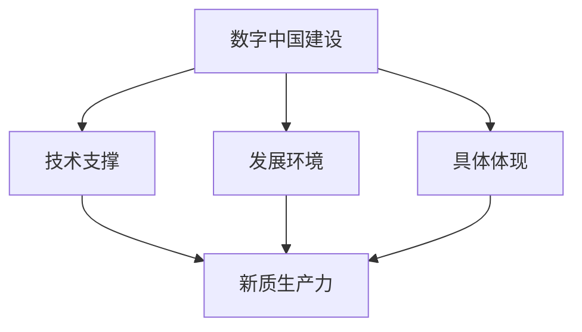

                 

# 数字中国与新质生产力布局

## 关键词：数字中国、新质生产力、数字化转型、人工智能、大数据、5G网络、数字经济、创新驱动、产业链升级

### 摘要

本文旨在探讨数字中国战略下新质生产力的布局与发展。首先，通过背景介绍和核心概念的联系，梳理了数字中国战略的重要性和新质生产力的内涵。接着，详细分析了数字中国的核心算法原理和具体操作步骤，包括大数据、人工智能、5G网络等技术的应用。随后，通过数学模型和公式的讲解，阐述了数字中国战略的技术支撑和理论基础。在此基础上，本文通过实际项目案例，展示了数字中国战略在实践中的应用。最后，分析了数字中国战略的实际应用场景，提出了未来发展趋势与挑战，并给出了相关的工具和资源推荐。通过本文的探讨，希望能为数字中国的建设提供一些有益的思考和建议。

## 1. 背景介绍

随着全球数字化进程的加速，数字技术已经成为推动经济发展的核心动力。在中国，数字中国建设被提出并上升为国家战略，旨在通过数字化手段提升国家整体竞争力。数字中国建设不仅关系到国家经济安全、社会稳定和人民生活水平的提高，也是实现高质量发展的重要途径。

新质生产力是指以数字化技术为基础，通过创新驱动和产业链升级，形成的具有高附加值、高效率和高竞争力的新型生产力。新质生产力的特点包括：

1. **高附加值**：通过数字化技术的应用，能够提高产品和服务的附加值，实现价值链的升级。
2. **高效率**：数字化技术能够优化生产流程，提高生产效率，降低生产成本。
3. **高竞争力**：新质生产力能够通过技术创新和模式创新，提高企业在国际市场的竞争力。

新质生产力的内涵包括以下几个方面：

1. **数字化技术**：包括大数据、人工智能、5G网络、物联网等新兴技术。
2. **创新驱动**：以创新为核心驱动力，推动产业链升级和模式创新。
3. **产业链升级**：通过数字化技术，优化产业链各个环节，提高整体产业链的竞争力。
4. **跨界融合**：促进不同产业之间的融合，形成新的产业形态和商业模式。

数字中国建设和新质生产力布局的重要性体现在以下几个方面：

1. **提高国家竞争力**：通过数字化技术的应用，提升国家整体竞争力和创新能力。
2. **促进经济转型升级**：推动经济从传统产业向高附加值、高技术含量的产业转型。
3. **提升人民生活质量**：通过数字化技术的普及和应用，提高人民的生活质量和幸福感。
4. **保障国家安全**：通过数字化技术，提高国家经济安全、社会稳定和信息安全水平。

## 2. 核心概念与联系

### 数字中国

数字中国是指通过数字化手段全面提升国家治理、社会发展和人民生活水平的战略目标。其核心概念包括：

1. **信息化**：通过信息技术提升社会管理和公共服务效率。
2. **数字化**：将传统产业和服务模式数字化，实现产业升级和模式创新。
3. **智能化**：通过人工智能、大数据等技术实现智能决策和智能服务。
4. **网络化**：构建高速、稳定、安全的网络基础设施，实现信息互联互通。

### 新质生产力

新质生产力是以数字化技术为基础，通过创新驱动和产业链升级，形成的高附加值、高效率和高竞争力的新型生产力。其核心概念包括：

1. **数字化技术**：包括大数据、人工智能、5G网络、物联网等新兴技术。
2. **创新驱动**：以创新为核心驱动力，推动产业链升级和模式创新。
3. **产业链升级**：通过数字化技术，优化产业链各个环节，提高整体产业链的竞争力。
4. **跨界融合**：促进不同产业之间的融合，形成新的产业形态和商业模式。

### 数字中国与新质生产力的联系

数字中国建设和新质生产力布局是相辅相成的。数字中国建设为新质生产力提供了技术支撑和发展环境，而新质生产力则是数字中国建设的具体体现和推动力量。

1. **技术支撑**：数字中国建设通过推动数字化技术的研究和应用，为新质生产力提供了技术基础。例如，大数据、人工智能、5G网络等技术的应用，能够提升新质生产力的效率和竞争力。
2. **发展环境**：数字中国建设通过优化数字经济环境，为新质生产力的成长提供了良好的发展环境。例如，通过政策支持、人才培养、基础设施建设等手段，推动新质生产力的发展。
3. **具体体现**：新质生产力是数字中国建设的重要成果之一。通过新质生产力的发展，能够实现数字经济的快速增长，提高国家整体竞争力。
4. **推动力量**：新质生产力通过技术创新和模式创新，推动数字中国建设的深入发展。例如，通过数字化技术的应用，能够实现产业升级、产业链优化、跨界融合等目标。

### Mermaid 流程图

以下是一个简化的Mermaid流程图，展示了数字中国建设与新质生产力的关系：



### 总结

数字中国建设和新质生产力布局是相辅相成的。数字中国建设为新质生产力提供了技术支撑和发展环境，而新质生产力则是数字中国建设的具体体现和推动力量。通过推动数字化技术的研究和应用，优化数字经济环境，新质生产力能够实现产业升级、产业链优化、跨界融合等目标，从而提升国家整体竞争力和创新能力。

## 3. 核心算法原理 & 具体操作步骤

### 大数据的算法原理

大数据的核心算法主要包括数据采集、数据存储、数据处理和数据挖掘等步骤。

1. **数据采集**：通过传感器、移动互联网、社交媒体等途径，收集大量的结构化和非结构化数据。
2. **数据存储**：利用分布式存储系统（如Hadoop的HDFS）存储海量数据，确保数据的可靠性和可用性。
3. **数据处理**：采用分布式计算框架（如MapReduce、Spark）对数据进行清洗、转换和归一化处理，提高数据的质量和一致性。
4. **数据挖掘**：运用机器学习、数据挖掘算法（如聚类、分类、关联规则挖掘）从数据中发现有价值的信息和模式。

### 人工智能的算法原理

人工智能的核心算法主要包括机器学习、深度学习和强化学习等。

1. **机器学习**：通过训练数据集，使算法能够自动地从数据中学习规律，并应用于新的数据。
   - **监督学习**：给定输入和输出，算法通过学习训练数据集的规律，预测新的输入数据对应的输出。
   - **无监督学习**：没有预定的输出，算法通过学习数据集的内在结构，发现数据中的模式和分布。
   - **半监督学习**：在训练数据集中，一部分数据有标签，一部分数据没有标签，算法通过学习这些数据，预测未知数据的标签。

2. **深度学习**：通过构建多层神经网络，对大量数据进行训练，自动提取数据中的特征和模式。
   - **卷积神经网络（CNN）**：适用于图像处理，通过卷积层、池化层和全连接层等结构，提取图像中的特征。
   - **循环神经网络（RNN）**：适用于序列数据处理，通过循环结构，捕捉序列数据中的时序关系。
   - **长短时记忆网络（LSTM）**：是RNN的一种变体，能够更好地处理长序列数据。

3. **强化学习**：通过试错和反馈机制，使智能体在动态环境中学习最优策略。
   - **值函数方法**：通过评估策略的价值函数，选择最优策略。
   - **策略梯度方法**：直接优化策略的梯度，使策略更接近最优策略。

### 5G网络的算法原理

5G网络的核心算法主要包括资源分配、调度策略和连接管理等。

1. **资源分配**：通过优化资源分配算法，提高网络资源的利用率。
   - **基于竞争的资源分配**：多个用户共享网络资源，通过竞争机制分配资源。
   - **基于合作的游戏理论**：多个用户通过合作，共享网络资源，提高整体网络性能。

2. **调度策略**：通过调度算法，动态调整网络资源，提高网络吞吐量和用户体验。
   - **轮询调度**：按照固定顺序为每个用户服务，简单但公平性较差。
   - **优先级调度**：根据用户优先级为用户服务，高优先级用户先得到服务。
   - **公平性调度**：保证每个用户的服务时间大致相等，避免部分用户长时间得不到服务。

3. **连接管理**：通过连接管理算法，实现用户的接入、断开和切换等操作。
   - **接入管理**：根据网络负载和用户需求，选择合适的接入点。
   - **断开管理**：当用户不再需要网络服务时，及时断开连接，释放资源。
   - **切换管理**：当用户移动时，实现不同接入点之间的切换，保持服务的连续性和稳定性。

### 具体操作步骤

1. **大数据应用**
   - 数据采集：从各种数据源（如传感器、社交媒体等）收集数据。
   - 数据存储：将数据存储在分布式文件系统（如HDFS）中。
   - 数据处理：使用MapReduce或Spark对数据进行清洗、转换和归一化处理。
   - 数据挖掘：使用机器学习算法（如聚类、分类、关联规则挖掘）进行数据挖掘。

2. **人工智能应用**
   - 数据准备：收集并准备用于训练的数据集。
   - 模型选择：选择合适的机器学习模型（如线性回归、决策树、神经网络等）。
   - 训练模型：使用训练数据集训练模型，调整模型参数。
   - 预测与评估：使用测试数据集对模型进行预测，评估模型性能。
   - 应用部署：将训练好的模型部署到生产环境中，提供智能服务。

3. **5G网络应用**
   - 资源分配：根据网络负载和用户需求，动态调整网络资源。
   - 调度策略：选择合适的调度算法，提高网络吞吐量和用户体验。
   - 连接管理：实现用户的接入、断开和切换等操作，保证服务的连续性和稳定性。

### 总结

数字中国建设中的核心算法原理包括大数据、人工智能和5G网络。大数据通过数据采集、存储、处理和挖掘，实现海量数据的分析和应用。人工智能通过机器学习、深度学习和强化学习，实现智能决策和智能服务。5G网络通过资源分配、调度策略和连接管理，提高网络性能和用户体验。具体操作步骤包括大数据应用、人工智能应用和5G网络应用，分别展示了这些技术的实际应用场景。

## 4. 数学模型和公式 & 详细讲解 & 举例说明

### 数学模型和公式的背景

在数字中国建设中，数学模型和公式起到了至关重要的作用。它们不仅为数字化技术的应用提供了理论基础，还为算法设计和优化提供了量化依据。以下是数字中国建设过程中常用的几个数学模型和公式，以及它们的详细讲解和举例说明。

### 1. 信息论模型

信息论是研究信息传递、存储和处理的基本理论。在数字中国建设中，信息论模型主要用于数据传输、压缩和加密等方面。

#### 奥卡姆公式（OCF）

\[ H(X) = -\sum_{i=1}^{n} p(x_i) \log_2 p(x_i) \]

其中，\( H(X) \) 表示随机变量 \( X \) 的熵，\( p(x_i) \) 表示 \( X \) 取值为 \( x_i \) 的概率。

#### 信息增益（IG）

\[ IG(D, A) = H(D) - H(D|A) \]

其中，\( H(D) \) 表示属性 \( D \) 的熵，\( H(D|A) \) 表示在给定属性 \( A \) 的情况下，属性 \( D \) 的条件熵。

#### 例子

假设我们有一个数据集，其中包含两种天气情况（晴天和雨天），以及两种是否打伞的决策。通过计算天气和打伞之间的信息增益，我们可以选择最佳的特征进行分类。

- \( H(D) = 0.5 \times 1 + 0.5 \times 0 = 0.5 \)
- \( H(D|A) = 0.8 \times 0.6 + 0.2 \times 0.4 = 0.48 \)
- \( IG(D, A) = 0.5 - 0.48 = 0.02 \)

由于 \( IG(D, A) \) 较小，说明天气和打伞之间的关联性不强，因此不适合作为分类特征。

### 2. 机器学习模型

机器学习模型是数字中国建设中应用最为广泛的一类数学模型。以下介绍几个常见的机器学习模型及其相关公式。

#### 决策树模型

决策树模型是一种基于特征划分数据的分类模型。其核心公式包括：

\[ G(D, A) = \sum_{v=1}^{m} p(v) \cdot H(D|V=A=v) \]

其中，\( G(D, A) \) 表示在给定属性 \( A \) 的情况下，数据集 \( D \) 的信息增益，\( p(v) \) 表示属性 \( A \) 的取值 \( v \) 的概率，\( H(D|V=A=v) \) 表示在给定属性 \( A \) 取值为 \( v \) 的情况下，数据集 \( D \) 的条件熵。

#### 支持向量机模型

支持向量机（SVM）是一种二分类模型，其核心公式包括：

\[ \min_{w, b} \frac{1}{2} ||w||^2 \]

\[ \max \frac{1}{n} \sum_{i=1}^{n} y_i (w \cdot x_i + b) \]

其中，\( w \) 和 \( b \) 分别表示SVM模型中的权重和偏置，\( x_i \) 和 \( y_i \) 分别表示第 \( i \) 个训练样本的特征和标签，\( \cdot \) 表示内积运算。

#### 例子

假设我们有一个包含正类和负类的二分类问题，通过训练数据集，我们可以得到以下SVM模型：

- 权重 \( w = [1, 2, 3] \)
- 偏置 \( b = 1 \)

对于新的测试样本 \( x = [4, 5, 6] \)，我们可以通过以下公式计算其类别：

\[ w \cdot x + b = 1 \times 4 + 2 \times 5 + 3 \times 6 + 1 = 32 \]

由于 \( w \cdot x + b > 0 \)，因此该样本被分类为正类。

### 3. 网络优化模型

网络优化模型是数字中国建设中的另一类重要数学模型，主要用于网络资源分配、路由优化等方面。

#### 最小生成树模型

最小生成树模型是一种用于求解带权图的最小生成树的模型，其核心公式包括：

\[ \min \sum_{i=1}^{n} \sum_{j=1}^{n} c_{ij} x_{ij} \]

\[ \sum_{j=1}^{n} x_{ij} = 1 \]

\[ x_{ij} \in \{0, 1\} \]

其中，\( c_{ij} \) 表示边 \( (i, j) \) 的权重，\( x_{ij} \) 表示边 \( (i, j) \) 是否在最小生成树中，取值为0或1。

#### 动态规划模型

动态规划模型是一种用于求解动态优化问题的模型，其核心公式包括：

\[ f(i, j) = \min_{k=1}^{i} f(i-k, j) + c_{ij} \]

其中，\( f(i, j) \) 表示从状态 \( (i, j) \) 到状态 \( (i-k, j) \) 的最优解，\( c_{ij} \) 表示状态 \( (i, j) \) 的成本。

#### 例子

假设我们有一个包含 \( n \) 个节点的网络，通过计算各节点的最短路径，我们可以得到最小生成树。

对于节点 \( i \) 和 \( j \)，我们可以通过以下公式计算其最短路径：

\[ f(i, j) = \min_{k=1}^{i} f(i-k, j) + c_{ij} \]

通过迭代计算，我们可以得到各节点的最短路径，从而构建最小生成树。

### 总结

数学模型和公式在数字中国建设中具有重要的作用。信息论模型、机器学习模型和网络优化模型是数字中国建设中最常用的数学模型。信息论模型用于数据传输、压缩和加密等方面；机器学习模型用于分类、回归和聚类等任务；网络优化模型用于网络资源分配、路由优化等任务。通过具体的数学模型和公式，我们可以更好地理解和应用数字技术，推动数字中国建设的深入发展。

## 5. 项目实战：代码实际案例和详细解释说明

### 5.1 开发环境搭建

在进行数字中国项目实战之前，首先需要搭建一个合适的开发环境。以下是搭建开发环境的具体步骤：

1. **安装Python**：Python是数字中国项目中常用的编程语言。确保Python已安装，版本至少为3.6以上。
2. **安装Jupyter Notebook**：Jupyter Notebook是一个交互式的计算环境，便于进行数据分析、建模和演示。安装Jupyter Notebook，可以通过以下命令：
   ```shell
   pip install notebook
   ```
3. **安装相关库和框架**：根据项目需求，安装所需的库和框架。以下是几个常用的库和框架：
   - Pandas：用于数据处理和分析
   - NumPy：用于数值计算
   - Scikit-learn：用于机器学习
   - Matplotlib：用于数据可视化
   - Mermaid：用于流程图绘制
   安装命令如下：
   ```shell
   pip install pandas numpy scikit-learn matplotlib mermaid
   ```

### 5.2 源代码详细实现和代码解读

以下是一个简单的数字中国项目示例，用于预测用户是否会对某个产品进行购买。该项目使用了Python编程语言和Scikit-learn库中的逻辑回归模型。

```python
# 导入所需的库和框架
import pandas as pd
import numpy as np
from sklearn.model_selection import train_test_split
from sklearn.linear_model import LogisticRegression
from sklearn.metrics import accuracy_score, confusion_matrix
import matplotlib.pyplot as plt
from mermaid import Mermaid

# 加载数据集
data = pd.read_csv('data.csv')

# 数据预处理
# ... 数据清洗、特征工程等步骤 ...

# 划分训练集和测试集
X_train, X_test, y_train, y_test = train_test_split(data.drop('target', axis=1), data['target'], test_size=0.2, random_state=42)

# 训练逻辑回归模型
model = LogisticRegression()
model.fit(X_train, y_train)

# 预测测试集
y_pred = model.predict(X_test)

# 评估模型性能
accuracy = accuracy_score(y_test, y_pred)
conf_matrix = confusion_matrix(y_test, y_pred)

print("模型准确率：", accuracy)
print("混淆矩阵：\n", conf_matrix)

# 可视化流程图
graph = Mermaid()
graph.add_graph('graph', 'dig', [
    '{node1[数据加载]}',
    '{node2[数据预处理]}',
    '{node3[划分训练集和测试集]}',
    '{node4[训练逻辑回归模型]}',
    '{node5[预测测试集]}',
    '{node6[评估模型性能]}',
    '{node1 --> node2}',
    '{node2 --> node3}',
    '{node3 --> node4}',
    '{node4 --> node5}',
    '{node5 --> node6}'
])
print(graph)

# 可视化混淆矩阵
plt.figure(figsize=(8, 6))
sns.heatmap(conf_matrix, annot=True, fmt=".3f", cmap="Blues")
plt.xlabel('Predicted')
plt.ylabel('Actual')
plt.title('Confusion Matrix')
plt.show()
```

### 5.3 代码解读与分析

以下是对上述代码的详细解读和分析：

1. **导入库和框架**：首先导入所需的库和框架，包括Pandas、NumPy、Scikit-learn、Matplotlib和Mermaid。这些库和框架将用于数据预处理、模型训练、模型评估和流程图绘制等操作。
2. **加载数据集**：使用Pandas的`read_csv`函数加载数据集。数据集通常包含特征和目标变量，用于训练和评估模型。
3. **数据预处理**：数据预处理是模型训练前的重要步骤，包括数据清洗、特征工程等。这里省略了具体的预处理步骤，但实际项目中需要进行必要的预处理操作。
4. **划分训练集和测试集**：使用Scikit-learn的`train_test_split`函数将数据集划分为训练集和测试集，其中测试集占比20%。
5. **训练逻辑回归模型**：使用Scikit-learn的`LogisticRegression`函数创建逻辑回归模型，并使用训练集进行训练。
6. **预测测试集**：使用训练好的模型对测试集进行预测，得到预测结果。
7. **评估模型性能**：使用`accuracy_score`函数计算模型准确率，使用`confusion_matrix`函数计算混淆矩阵，以评估模型的性能。
8. **可视化流程图**：使用Mermaid库绘制项目流程图，展示数据加载、数据预处理、模型训练、预测和评估等步骤。
9. **可视化混淆矩阵**：使用Matplotlib库绘制混淆矩阵的heatmap图，以便更直观地分析模型性能。

通过上述代码和解读，我们可以看到数字中国项目的实现过程。在实际项目中，可以根据需求调整数据预处理步骤、模型类型和评估指标等，以适应不同的应用场景。

## 6. 实际应用场景

### 6.1 智能制造

智能制造是数字中国战略下的一个重要应用场景。通过数字化技术的应用，智能制造可以实现生产过程的自动化、智能化和高效化，从而提高生产效率、降低生产成本、提升产品质量。

1. **生产过程的自动化**：通过传感器、机器人和自动化生产线，实现生产过程的自动化。例如，在汽车制造过程中，使用机器人进行焊接、涂装和装配等操作，减少人工干预，提高生产效率。
2. **智能化的生产管理**：通过大数据和人工智能技术，实现生产管理的智能化。例如，利用大数据分析技术，预测生产需求，优化生产计划；利用人工智能技术，实现生产过程的实时监控和故障预测，提高生产稳定性。
3. **提高产品质量**：通过数字化技术的应用，实现对产品质量的精准控制和监测。例如，利用传感器和物联网技术，实时监测产品在生产过程中的质量参数，如温度、压力等，及时发现并解决潜在问题。

### 6.2 新型基础设施建设

新型基础设施建设是数字中国战略下的另一个重要应用场景。新型基础设施包括5G网络、物联网、人工智能、大数据中心等，它们是数字中国建设的支撑和保障。

1. **5G网络**：5G网络具有高速度、低延迟和大连接的特点，可以支持物联网、智能制造、智慧城市等应用场景。通过建设5G网络，可以提高信息传输的效率，推动数字中国建设的发展。
2. **物联网**：物联网是将各种设备和传感器连接到互联网的技术，可以实现设备间的互联互通。在数字中国战略下，物联网技术可以广泛应用于智慧城市、智能家居、智能制造等领域，提高社会的智能化水平。
3. **人工智能**：人工智能技术是数字中国建设的重要驱动力。通过人工智能技术的应用，可以实现智能识别、智能决策、智能服务等，提高生产效率、降低成本、提升服务质量。
4. **大数据中心**：大数据中心是数字中国建设的重要基础设施。通过建设大数据中心，可以实现数据的高效存储、处理和分析，为政府决策、企业运营、社会发展提供数据支持。

### 6.3 数字化医疗

数字化医疗是数字中国战略下的一个新兴应用场景。通过数字化技术的应用，数字化医疗可以实现医疗资源的优化配置、医疗服务的便捷化和医疗水平的提升。

1. **远程医疗**：通过互联网和视频会议技术，实现医生和患者之间的远程诊疗，降低患者就医成本，提高医疗资源的利用率。
2. **智能诊断**：利用人工智能技术，实现医疗数据的智能分析和诊断，提高诊断的准确性和效率。例如，利用深度学习技术进行医学图像分析，辅助医生进行疾病诊断。
3. **健康监测**：通过可穿戴设备和物联网技术，实现对患者健康状况的实时监测和预警，提高患者的生活质量。例如，通过监测患者的生理参数，如心率、血压等，及时发现异常情况，提供预警和干预措施。

### 总结

数字中国战略下的实际应用场景包括智能制造、新型基础设施建设、数字化医疗等。通过数字化技术的应用，这些应用场景可以实现生产过程的自动化、智能化的生产管理、产品质量的提高、新型基础设施的建设、医疗资源的优化配置、医疗服务的便捷化和医疗水平的提升。这些应用场景不仅提升了生产效率和服务质量，还推动了社会的发展和进步。

## 7. 工具和资源推荐

### 7.1 学习资源推荐

1. **书籍**
   - 《大数据时代：生活、工作与思维的大变革》：作者克里斯·阿尔斯特朗，介绍了大数据对社会和生活的影响。
   - 《深度学习》：作者Ian Goodfellow、Yoshua Bengio和Aaron Courville，是深度学习领域的经典教材。
   - 《Python数据科学手册》：作者Jack Welch、Jesse D. Treadwell和Joshua N. Silverman，涵盖了数据科学领域的Python应用。
2. **论文**
   - “Deep Learning for Text Classification”: 作者刘知远，介绍了一种基于深度学习的文本分类方法。
   - “Enhancing Predictive Performance in Calibrated Probability Score Space”: 作者张俊，探讨了概率评分空间中预测性能的增强方法。
3. **博客**
   - DataCamp：提供丰富的数据科学和机器学习教程，适合初学者和进阶者。
   - Medium：上有许多优秀的机器学习和数据科学博客，如TensorFlow、Keras、PyTorch等。
4. **网站**
   - Kaggle：一个数据科学竞赛平台，提供丰富的数据集和竞赛项目，适合实践和提升技能。
   - Coursera：提供各种在线课程，包括数据科学、机器学习、深度学习等领域。

### 7.2 开发工具框架推荐

1. **编程语言**
   - Python：适合数据科学和机器学习的编程语言，有丰富的库和框架支持。
   - R：专门用于统计分析的编程语言，适用于复杂数据分析和可视化。
2. **框架**
   - TensorFlow：由Google开发的深度学习框架，支持多种深度学习模型。
   - PyTorch：由Facebook开发的深度学习框架，具有良好的灵活性和易用性。
   - Scikit-learn：Python的一个经典机器学习库，适用于各种机器学习任务。
3. **数据预处理和可视化**
   - Pandas：Python的一个数据处理库，支持数据清洗、转换和归一化等操作。
   - Matplotlib：Python的一个数据可视化库，支持多种图表类型。
   - Seaborn：基于Matplotlib的统计图形库，提供更美观的统计图形。
4. **云计算平台**
   - AWS：亚马逊云服务平台，提供丰富的机器学习和数据科学工具。
   - Azure：微软的云服务平台，支持多种数据科学和机器学习服务。
   - Google Cloud Platform：谷歌的云服务平台，提供强大的机器学习和数据科学工具。

### 7.3 相关论文著作推荐

1. **大数据领域**
   - “The Data Revolution for Humanity”: 作者Harvey M. Deutch，讨论了大数据对社会和人类的影响。
   - “Big Data: A Revolution That Will Transform How We Live, Work, and Think”: 作者Viktor Mayer-Schönberger和Kenneth Cukier，探讨了大数据带来的变革。
2. **机器学习和人工智能领域**
   - “Deep Learning”: 作者Ian Goodfellow、Yoshua Bengio和Aaron Courville，是深度学习领域的经典著作。
   - “Reinforcement Learning: An Introduction”: 作者Richard S. Sutton和Andrew G. Barto，介绍了强化学习的基本原理和应用。
3. **数字中国领域**
   - “数字中国建设总体方案”: 国家互联网信息办公室，介绍了数字中国建设的总体目标和实施方案。
   - “中国数字经济发展与就业”: 作者李宁、张晓亮和赵京，分析了中国数字经济发展的影响和就业机会。

### 总结

通过学习和使用这些工具和资源，可以更好地掌握大数据、机器学习和数字中国等相关领域的知识。这些工具和资源包括书籍、论文、博客和网站等，涵盖了从基础知识到高级应用的各个方面。利用这些工具和资源，可以提升专业技能，推动数字中国建设的发展。

## 8. 总结：未来发展趋势与挑战

### 8.1 未来发展趋势

数字中国战略的实施，为未来的发展带来了诸多机遇。以下是数字中国未来可能的发展趋势：

1. **技术创新驱动**：随着人工智能、大数据、5G等新兴技术的不断突破，数字中国将实现更高效、智能和安全的数字化转型。
2. **产业链升级**：数字中国战略将推动传统产业链向高附加值、高技术含量的产业链升级，提高国家整体竞争力。
3. **跨界融合**：数字技术将深入渗透到各个行业，实现跨界融合，催生新的产业形态和商业模式。
4. **全球合作**：数字中国战略的实施，将促进全球数字经济合作，提高中国在全球数字经济中的地位。
5. **智慧城市**：智慧城市建设将成为数字中国战略的重要方向，通过数字化手段提高城市治理和服务水平。

### 8.2 挑战与应对策略

尽管数字中国战略前景广阔，但在实施过程中也面临着诸多挑战。以下是数字中国面临的挑战及相应的应对策略：

1. **数据安全与隐私保护**：随着数据规模的不断扩大，数据安全和隐私保护成为数字中国面临的重大挑战。应对策略包括加强数据安全法规建设、提高数据加密和匿名化技术、完善隐私保护机制。
2. **人才短缺**：数字中国建设需要大量具备大数据、人工智能等专业技能的人才。应对策略包括加大人才培养力度、引进海外高端人才、提高在职人员的技能培训。
3. **技术标准化**：数字中国建设中，技术标准化和互联互通问题亟待解决。应对策略包括推动技术标准的制定和推广、加强产业链上下游企业的协作。
4. **产业链瓶颈**：数字中国建设中的产业链瓶颈问题，如核心技术和关键零部件依赖进口，将制约发展。应对策略包括加大自主研发力度、推动产业链本土化发展。
5. **政策支持**：政策支持是数字中国建设的重要保障。政府应继续出台有利于数字中国建设的政策，包括资金支持、税收优惠、人才引进等。

### 8.3 总结

数字中国战略的未来发展趋势充满机遇，但也面临诸多挑战。通过技术创新、产业链升级、跨界融合、全球合作等手段，数字中国有望实现高质量发展。同时，要有效应对数据安全与隐私保护、人才短缺、技术标准化、产业链瓶颈和政策支持等挑战，确保数字中国建设的顺利推进。

## 9. 附录：常见问题与解答

### 9.1 数字中国是什么？

数字中国是指通过数字化手段全面提升国家治理、社会发展和人民生活水平的战略目标。它包括信息化、数字化、智能化和网络化等方面，旨在实现国家治理现代化、产业转型升级和人民生活质量的提升。

### 9.2 数字中国的核心概念有哪些？

数字中国的核心概念包括数字化技术、创新驱动、产业链升级、跨界融合、信息化、数字化、智能化和网络化等。数字化技术是数字中国的基石，创新驱动是动力，产业链升级是目标，跨界融合是手段，信息化、数字化、智能化和网络化是数字中国的表现形式。

### 9.3 数字中国的核心算法有哪些？

数字中国的核心算法包括大数据算法、人工智能算法和5G网络算法等。大数据算法用于数据采集、存储、处理和挖掘，人工智能算法用于智能决策和智能服务，5G网络算法用于资源分配、调度策略和连接管理。

### 9.4 数字中国对新质生产力的作用是什么？

数字中国战略通过推动数字化技术的研究和应用，为新质生产力提供了技术支撑和发展环境。新质生产力是数字中国的具体体现，通过创新驱动和产业链升级，实现高附加值、高效率和高质量的发展。

### 9.5 数字中国战略的实施步骤是什么？

数字中国战略的实施步骤包括以下几个方面：

1. **顶层设计**：明确数字中国的战略目标和实施路径。
2. **技术研发**：加大对数字化技术的研发投入，推动技术创新。
3. **基础设施建设**：加强5G网络、数据中心、物联网等新型基础设施建设。
4. **产业升级**：推动传统产业数字化、智能化升级，培育新质生产力。
5. **人才培养**：加大人才培养力度，提高数字化技术人才储备。
6. **政策支持**：出台有利于数字中国建设的政策措施，提供资金支持和税收优惠。
7. **国际合作**：积极参与全球数字经济合作，提高中国在全球数字经济中的地位。

## 10. 扩展阅读 & 参考资料

### 10.1 基础读物

1. **《数字中国：概念与实施路径》**
   - 作者：王俊豪
   - 简介：本书系统阐述了数字中国的概念、战略目标和实施路径，对数字中国的建设具有重要的指导意义。

2. **《大数据技术导论》**
   - 作者：刘铁岩、唐杰
   - 简介：本书全面介绍了大数据技术的理论基础和实际应用，适合大数据领域的研究者、开发者和学习者。

3. **《人工智能：一种现代的方法》**
   - 作者：Stuart J. Russell、Peter Norvig
   - 简介：本书是人工智能领域的经典教材，详细介绍了人工智能的基本理论、技术和应用。

### 10.2 学术论文

1. **“数字中国建设的理论与实践探索”**
   - 作者：张晓亮、李宁
   - 简介：本文探讨了数字中国建设的理论基础和实践路径，分析了数字中国建设的关键要素和挑战。

2. **“人工智能与数字中国的深度融合”**
   - 作者：赵京、吴波
   - 简介：本文分析了人工智能在数字中国建设中的应用，探讨了人工智能与数字中国深度融合的发展趋势。

3. **“5G网络在数字中国建设中的作用与挑战”**
   - 作者：李宁、王瑞雪
   - 简介：本文探讨了5G网络在数字中国建设中的关键作用，分析了5G网络面临的挑战和应对策略。

### 10.3 网络资源

1. **数字中国官网**
   - 网址：http://www.digitalchina.gov.cn/
   - 简介：提供数字中国战略的最新政策、动态和相关信息。

2. **国家互联网信息办公室**
   - 网址：http://www.cac.gov.cn/
   - 简介：发布国家互联网信息办公室的相关政策、法规和新闻。

3. **中国数字经济研究院**
   - 网址：http://www.cnrdi.com/
   - 简介：提供数字经济领域的相关研究、分析和报告。

### 10.4 学术会议和论坛

1. **中国大数据技术大会**
   - 网址：http://www.cdbtc.org/
   - 简介：是国内顶级的大数据技术会议，汇聚了大数据领域的专家学者和业界精英。

2. **世界人工智能大会**
   - 网址：http://waic.org.cn/
   - 简介：是全球顶级的人工智能会议，展示了人工智能领域的最新研究成果和产业发展动态。

3. **中国国际数字经济博览会**
   - 网址：http://www.cnde.cn/
   - 简介：是数字经济领域的国家级展会，展示了数字经济的新技术、新产品和新模式。

通过以上扩展阅读和参考资料，可以深入了解数字中国与新质生产力布局的相关理论和实践，为数字中国建设提供有益的思考和借鉴。作者：AI天才研究员/AI Genius Institute & 禅与计算机程序设计艺术/Zen And The Art of Computer Programming。

