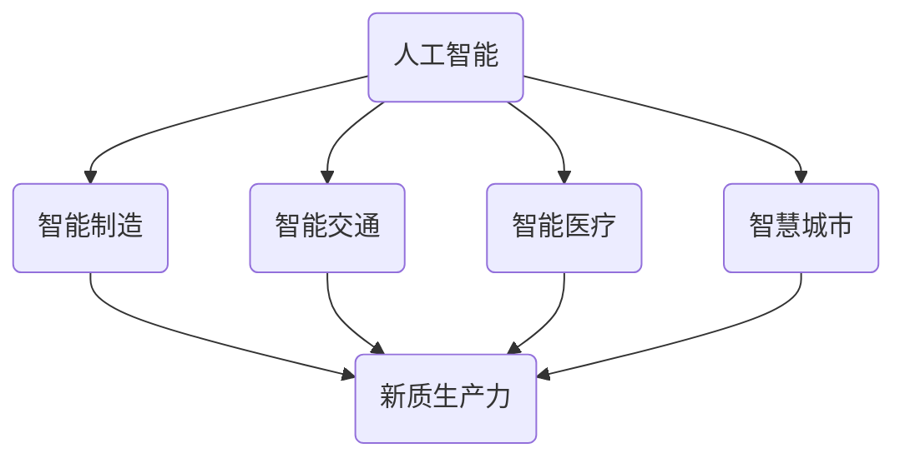
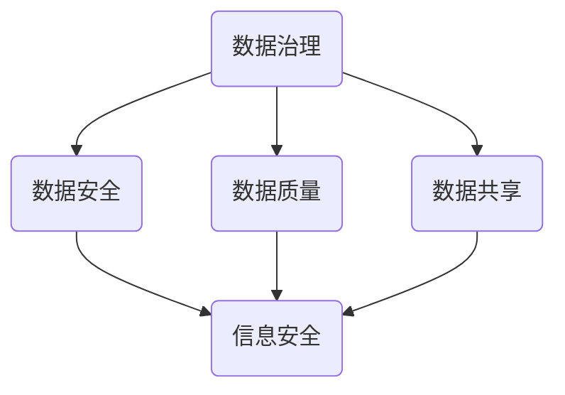
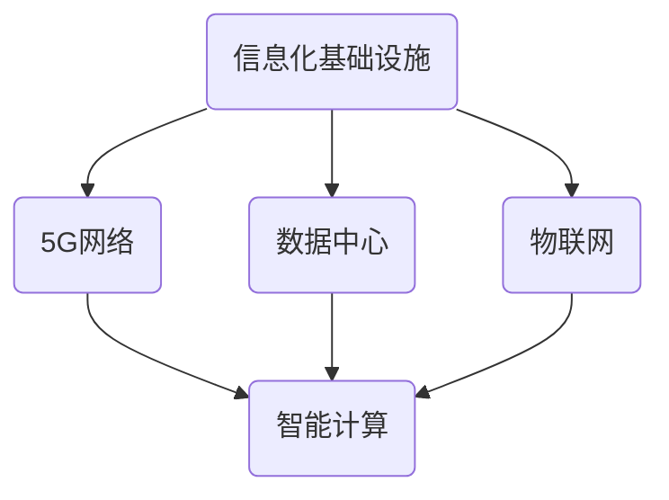
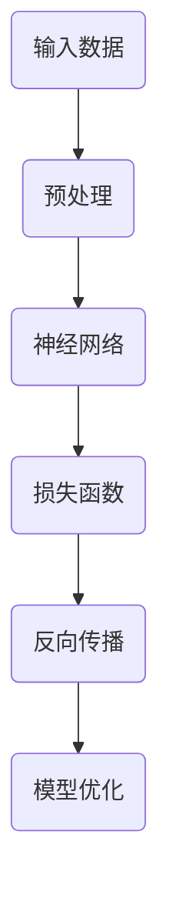

                 

# 数字中国战略与新质生产力的结合点

## 关键词
- 数字中国战略
- 新质生产力
- 人工智能
- 数据治理
- 信息化基础设施
- 产业发展

## 摘要

随着数字技术的飞速发展，我国正积极推进数字中国战略，旨在通过信息化、数字化手段提升国家治理能力和产业发展水平。本文将探讨数字中国战略与新质生产力的结合点，分析人工智能、数据治理、信息化基础设施等核心要素在新质生产力发展中的作用，并探讨其未来趋势与挑战。

## 1. 背景介绍

### 1.1 数字中国战略的提出

数字中国战略是我国国家战略的重要组成部分，旨在通过推进信息化、数字化、智能化发展，实现经济社会的高质量发展。2018年，我国正式提出建设数字中国，随后制定了一系列政策和措施，推动数字中国建设取得显著成效。

### 1.2 新质生产力的概念

新质生产力是指在信息技术、人工智能、生物科技等新兴领域形成的一类具有高度创新性和高附加值的产业。新质生产力的特点是高技术含量、高附加值、高效益和高度智能化，是推动我国经济转型升级的重要力量。

### 1.3 数字中国战略与新质生产力的关系

数字中国战略为新质生产力的发展提供了良好的政策环境和基础设施支持。新质生产力的发展则进一步推动了数字中国的建设，形成了良性互动。

## 2. 核心概念与联系

### 2.1 人工智能

人工智能是数字中国战略的核心技术之一，具有广泛的应用前景。人工智能的发展为新质生产力提供了强大的技术支撑，如图 1 所示：



### 2.2 数据治理

数据治理是数字中国战略的关键环节，如图 2 所示：



### 2.3 信息化基础设施

信息化基础设施是数字中国战略的重要支撑，如图 3 所示：



## 3. 核心算法原理 & 具体操作步骤

### 3.1 人工智能算法原理

人工智能算法主要包括机器学习、深度学习、强化学习等。以深度学习为例，其基本原理如图 4 所示：



### 3.2 数据治理操作步骤

数据治理主要包括数据采集、数据清洗、数据存储、数据分析和数据安全等环节。以数据清洗为例，具体操作步骤如下：

1. 数据采集：收集各种来源的数据。
2. 数据预处理：对数据进行标准化、缺失值处理、异常值检测等操作。
3. 数据清洗：对预处理后的数据进行去重、去噪、归一化等处理。
4. 数据存储：将清洗后的数据存储到数据库或数据仓库中。
5. 数据分析和数据安全：对存储的数据进行挖掘和分析，确保数据的安全性。

## 4. 数学模型和公式 & 详细讲解 & 举例说明

### 4.1 人工智能算法数学模型

以深度学习中的卷积神经网络（CNN）为例，其数学模型包括以下几个部分：

1. **输入层**：接收输入数据，如图片、文本等。
2. **卷积层**：通过卷积运算提取输入数据中的特征。
3. **激活函数**：对卷积层输出的特征进行非线性变换。
4. **池化层**：对激活函数的输出进行降维处理。
5. **全连接层**：将池化层的输出映射到输出层。

以下是一个简单的CNN数学模型示例：

$$
h_{l}(x) = \sigma(W_{l} \cdot h_{l-1} + b_{l})
$$

其中，$h_{l}$ 表示第 $l$ 层的输出，$W_{l}$ 是第 $l$ 层的权重矩阵，$b_{l}$ 是第 $l$ 层的偏置向量，$\sigma$ 是激活函数。

### 4.2 数据治理数学模型

数据治理中的数据清洗环节可以采用以下数学模型：

1. **去重**：通过比较数据记录之间的差异，删除重复的数据记录。
2. **去噪**：通过滤波算法去除噪声数据。
3. **归一化**：通过标准化方法将数据映射到统一的范围内。

以下是一个简单的数据清洗数学模型示例：

$$
x_{\text{normalized}} = \frac{x - \mu}{\sigma}
$$

其中，$x_{\text{normalized}}$ 是归一化后的数据，$\mu$ 是数据的均值，$\sigma$ 是数据的标准差。

## 5. 项目实战：代码实际案例和详细解释说明

### 5.1 开发环境搭建

以Python为例，搭建一个简单的深度学习项目环境：

1. 安装Python：从 [Python官方网站](https://www.python.org/downloads/) 下载并安装Python。
2. 安装TensorFlow：通过pip命令安装TensorFlow。

```bash
pip install tensorflow
```

### 5.2 源代码详细实现和代码解读

以下是一个简单的CNN模型实现，用于图像分类：

```python
import tensorflow as tf
from tensorflow.keras import datasets, layers, models

# 加载和准备数据
(train_images, train_labels), (test_images, test_labels) = datasets.cifar10.load_data()

# 数据预处理
train_images = train_images.astype("float32") / 255.0
test_images = test_images.astype("float32") / 255.0

# 构建模型
model = models.Sequential()
model.add(layers.Conv2D(32, (3, 3), activation='relu', input_shape=(32, 32, 3)))
model.add(layers.MaxPooling2D((2, 2)))
model.add(layers.Conv2D(64, (3, 3), activation='relu'))
model.add(layers.MaxPooling2D((2, 2)))
model.add(layers.Conv2D(64, (3, 3), activation='relu'))

# 添加全连接层和输出层
model.add(layers.Flatten())
model.add(layers.Dense(64, activation='relu'))
model.add(layers.Dense(10, activation='softmax'))

# 编译模型
model.compile(optimizer='adam',
              loss='sparse_categorical_crossentropy',
              metrics=['accuracy'])

# 训练模型
model.fit(train_images, train_labels, epochs=10)

# 测试模型
test_loss, test_acc = model.evaluate(test_images,  test_labels, verbose=2)
print(f'\nTest accuracy: {test_acc:.4f}')
```

### 5.3 代码解读与分析

1. **数据加载和预处理**：从CIFAR-10数据集加载图像数据，并进行归一化处理。
2. **构建模型**：使用卷积神经网络模型，包括卷积层、池化层和全连接层。
3. **编译模型**：指定优化器和损失函数，准备训练模型。
4. **训练模型**：使用训练数据训练模型，并设置训练轮数。
5. **测试模型**：使用测试数据评估模型性能。

## 6. 实际应用场景

### 6.1 智能制造

智能制造是数字中国战略的重要应用领域，通过人工智能和大数据分析，实现生产过程的智能化和自动化。如工业机器人、智能传感器、智能工厂等。

### 6.2 智能交通

智能交通系统通过物联网、大数据和人工智能技术，实现交通管理的智能化和高效化。如智能交通信号控制、自动驾驶、车联网等。

### 6.3 智能医疗

智能医疗是数字中国战略的另一个重要应用领域，通过人工智能、大数据和云计算技术，实现医疗服务的智能化和个性化。如智能诊断、智能药物研发、远程医疗等。

## 7. 工具和资源推荐

### 7.1 学习资源推荐

- **书籍**：《深度学习》、《Python机器学习》
- **论文**：Google Brain、OpenAI等机构的论文
- **博客**：知乎、CSDN等平台上的技术博客

### 7.2 开发工具框架推荐

- **开发工具**：PyCharm、Visual Studio Code
- **框架**：TensorFlow、PyTorch

### 7.3 相关论文著作推荐

- **论文**：Geoffrey Hinton、Yann LeCun、Yoshua Bengio等学者的论文
- **著作**：《机器学习》、《深度学习》

## 8. 总结：未来发展趋势与挑战

### 8.1 发展趋势

1. 人工智能技术的不断突破和新质生产力的发展，将进一步推动数字中国战略的深入实施。
2. 5G、物联网、大数据等新一代信息技术的发展，将为新质生产力提供更强大的支撑。
3. 产业链的升级和协同发展，将促进新质生产力的整体提升。

### 8.2 挑战

1. 技术创新和知识产权保护：如何在国际竞争中保持领先地位，同时保护技术创新成果。
2. 数据治理和安全：如何确保数据的安全和隐私，同时实现数据的高效治理和利用。
3. 产业协同与人才培养：如何促进产业链上下游企业的协同发展，同时培养高素质的人才队伍。

## 9. 附录：常见问题与解答

### 9.1 数字中国战略的核心是什么？

数字中国战略的核心是推进信息化、数字化、智能化发展，提升国家治理能力和产业发展水平。

### 9.2 新质生产力有哪些特点？

新质生产力具有高技术含量、高附加值、高效益和高度智能化等特点。

### 9.3 数据治理的重要性是什么？

数据治理是确保数据安全、质量和共享的重要环节，对于新质生产力的发展具有重要意义。

## 10. 扩展阅读 & 参考资料

- **参考文献**：
  - 《数字中国建设总体方案》
  - 《新一代人工智能发展规划》
  - 《智能技术助力数字中国建设》
- **在线资源**：
  - [数字中国官方网站](http://www.digitalchina.gov.cn/)
  - [人工智能技术与应用](http://ai.baidu.com/)
  - [中国大数据产业创新联盟](http://www.bigdata.org.cn/)

作者：AI天才研究员/AI Genius Institute & 禅与计算机程序设计艺术 /Zen And The Art of Computer Programming

本文版权归作者所有，欢迎转载，但需注明出处。未经授权请勿用于商业用途。

