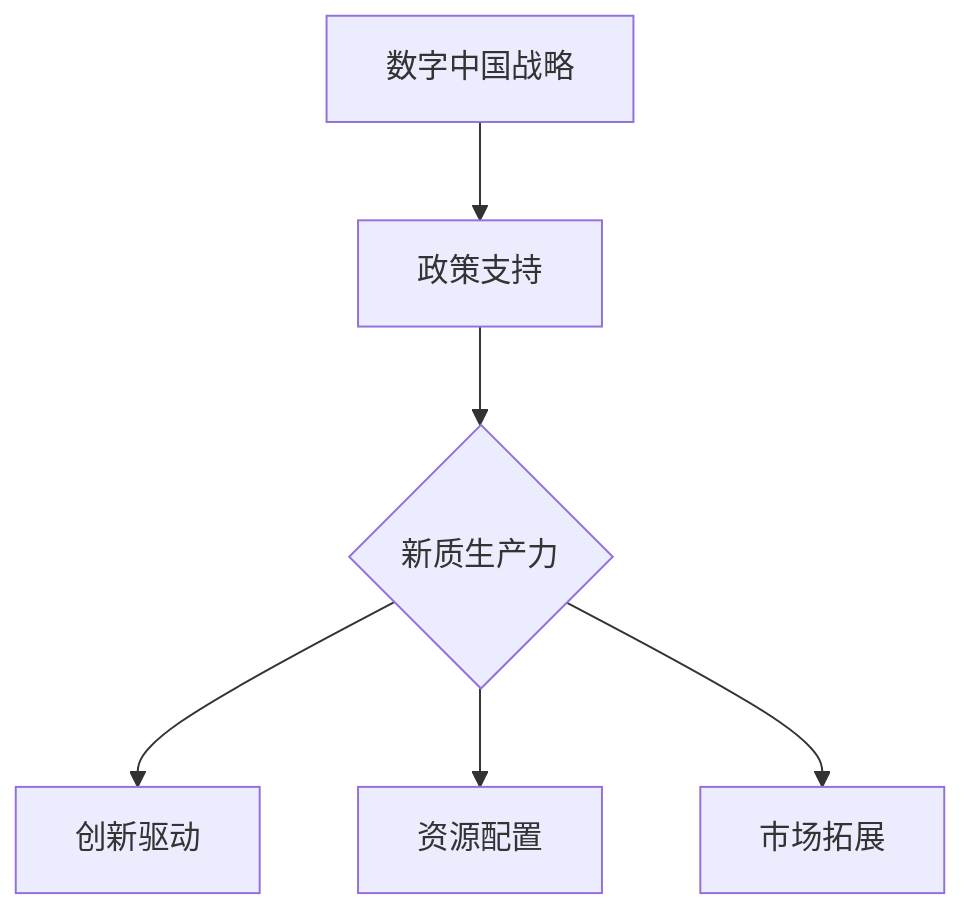

                 

# 数字中国战略与新质生产力的结合点

## 摘要

数字中国战略作为国家发展的新引擎，正在不断推动新质生产力的生成。本文将深入探讨数字中国战略的核心概念、实施路径、与新质生产力的关系，以及它们在我国经济发展中的重要地位。通过分析数字技术对传统产业的改造，以及新质生产力在创新驱动、资源配置、市场拓展等方面的表现，本文旨在为读者提供一个全面、系统的理解，并展望未来数字中国战略的发展趋势与面临的挑战。

## 1. 背景介绍

### 1.1 数字中国战略的提出

数字中国战略，是指以信息化、数字化、智能化为驱动，推动国家治理体系和治理能力现代化，构建数字经济新格局的一系列政策措施。这一战略的提出，源于我国对信息化、数字化技术日益重视，以及对全球数字化浪潮的敏锐洞察。

2016年，我国首次提出“数字中国”概念，旨在通过信息化建设，推动经济社会全面发展。此后，随着信息技术的不断突破和应用的深入，数字中国战略逐渐成为国家发展的重要支柱。

### 1.2 新质生产力的定义

新质生产力，是指基于数字技术，特别是人工智能、大数据、物联网等新一代信息技术，推动生产要素质量变革、效率提升、模式创新的能力。新质生产力不同于传统生产力，它更强调数据驱动的智能化、网络化、协同化发展。

新质生产力的核心是数字技术，通过数据的采集、存储、处理、应用，实现资源的优化配置和业务流程的自动化，从而提升生产效率、降低成本、提高服务质量。

## 2. 核心概念与联系

### 2.1 数字技术的基础概念

#### 2.1.1 人工智能

人工智能（AI）是数字技术的重要组成部分，它通过模拟人类智能的决策过程，实现自动化、智能化。人工智能技术包括机器学习、深度学习、自然语言处理等。

#### 2.1.2 大数据

大数据是指数据量巨大、类型繁多、价值密度低的数据集合。大数据技术通过数据的存储、处理、分析，挖掘数据中的价值，为决策提供支持。

#### 2.1.3 物联网

物联网（IoT）通过将物体连接到互联网，实现智能感知、监控和管理。物联网技术包括传感器、通信协议、数据处理等。

### 2.2 新质生产力的实现路径

#### 2.2.1 创新驱动

创新驱动是新质生产力的核心。通过技术创新，特别是数字技术的创新，实现生产要素的优化配置，提升生产力。

#### 2.2.2 资源配置

资源配置是新质生产力的关键。通过大数据、物联网等技术，实现资源的精确匹配和优化配置，提高资源利用效率。

#### 2.2.3 市场拓展

市场拓展是新质生产力的外延。通过数字化手段，打破地域、行业、市场的限制，实现市场的无限扩展。

### 2.3 数字中国战略与新质生产力的关系

数字中国战略与新质生产力之间存在着紧密的联系。数字中国战略为新质生产力的生成提供了政策支持和制度保障，而新质生产力则是数字中国战略实施的重要成果和动力源泉。

### 2.4 Mermaid 流程图



## 3. 核心算法原理 & 具体操作步骤

### 3.1 创新驱动的核心算法

创新驱动是新质生产力的核心。在创新驱动的核心算法中，机器学习算法扮演着重要角色。

#### 3.1.1 机器学习算法的基本原理

机器学习算法通过训练数据集，学习数据的特征和规律，从而实现对未知数据的预测和分类。

#### 3.1.2 机器学习算法的具体操作步骤

1. 数据采集：从各种来源收集数据，如互联网、数据库、传感器等。
2. 数据预处理：清洗、归一化、缺失值处理等，确保数据的质量和一致性。
3. 模型选择：根据业务需求，选择合适的机器学习模型，如线性回归、决策树、神经网络等。
4. 模型训练：使用训练数据集，对模型进行训练，调整模型的参数。
5. 模型评估：使用测试数据集，评估模型的性能，如准确率、召回率等。
6. 模型部署：将训练好的模型部署到生产环境中，对未知数据进行预测和分类。

### 3.2 资源配置的核心算法

资源配置是新质生产力的关键。在资源配置的核心算法中，优化算法扮演着重要角色。

#### 3.2.1 优化算法的基本原理

优化算法通过搜索和评估，找到最优的资源配置方案。

#### 3.2.2 优化算法的具体操作步骤

1. 目标函数定义：定义资源利用率和成本之间的目标函数。
2. 约束条件设置：根据实际情况，设置资源使用、时间、预算等约束条件。
3. 搜索算法选择：选择合适的搜索算法，如遗传算法、模拟退火算法等。
4. 算法迭代：通过迭代，不断优化资源配置方案，直到找到最优解。

## 4. 数学模型和公式 & 详细讲解 & 举例说明

### 4.1 创新驱动的数学模型

创新驱动的数学模型主要基于机器学习算法，以下是一个简单的线性回归模型。

#### 4.1.1 模型公式

$$y = \beta_0 + \beta_1 \cdot x + \epsilon$$

其中，$y$ 是目标变量，$x$ 是特征变量，$\beta_0$ 和 $\beta_1$ 是模型参数，$\epsilon$ 是误差项。

#### 4.1.2 模型解释

线性回归模型通过拟合一条直线，来描述目标变量和特征变量之间的关系。其中，$\beta_0$ 是直线的截距，$\beta_1$ 是直线的斜率。

#### 4.1.3 举例说明

假设我们有一个数据集，其中 $x$ 表示广告投放金额，$y$ 表示销售额。我们希望使用线性回归模型，预测给定广告投放金额时的销售额。

通过训练数据集，我们得到线性回归模型的参数 $\beta_0 = 1000$，$\beta_1 = 0.5$。那么，当广告投放金额为 $x = 5000$ 时，预测的销售额为：

$$y = 1000 + 0.5 \cdot 5000 = 3500$$

### 4.2 资源配置的数学模型

资源配置的数学模型主要基于优化算法，以下是一个简单的线性规划模型。

#### 4.2.1 模型公式

$$\min z = c_1 \cdot x_1 + c_2 \cdot x_2 + ... + c_n \cdot x_n$$

$$s.t.$$

$$a_1 \cdot x_1 + a_2 \cdot x_2 + ... + a_n \cdot x_n \leq b$$

$$x_1, x_2, ..., x_n \geq 0$$

其中，$z$ 是目标函数，$c_1, c_2, ..., c_n$ 是系数，$x_1, x_2, ..., x_n$ 是决策变量，$a_1, a_2, ..., a_n$ 是约束条件系数，$b$ 是约束条件常数。

#### 4.2.2 模型解释

线性规划模型通过优化目标函数，在满足约束条件的前提下，找到最优的资源配置方案。

#### 4.2.3 举例说明

假设我们有一个资源分配问题，需要将 $100$ 个资源分配到两个项目中，项目 $1$ 的收益为 $c_1 = 2$，项目 $2$ 的收益为 $c_2 = 3$。资源分配的约束条件是项目 $1$ 的资源不超过 $50$，项目 $2$ 的资源不超过 $50$。

通过线性规划模型，我们可以找到最优的资源分配方案。目标函数为 $z = 2 \cdot x_1 + 3 \cdot x_2$，约束条件为 $x_1 + x_2 = 100$，$x_1 \leq 50$，$x_2 \leq 50$。

通过求解线性规划模型，我们得到最优解为 $x_1 = 50$，$x_2 = 50$，此时目标函数 $z = 2 \cdot 50 + 3 \cdot 50 = 200$。

## 5. 项目实战：代码实际案例和详细解释说明

### 5.1 开发环境搭建

在开始项目实战之前，我们需要搭建一个适合开发的环境。以下是一个简单的开发环境搭建步骤：

1. 安装 Python 解释器：从 [Python 官网](https://www.python.org/downloads/) 下载并安装 Python 3.8 版本。
2. 安装 Python 包管理器：使用 Python 的包管理器 pip，安装必要的包，如 NumPy、Pandas、Scikit-learn 等。
3. 安装 Jupyter Notebook：使用 pip 安装 Jupyter Notebook，用于编写和运行代码。

### 5.2 源代码详细实现和代码解读

以下是一个简单的线性回归模型和线性规划模型的 Python 代码实现。

```python
# 线性回归模型
from sklearn.linear_model import LinearRegression
import numpy as np

# 数据准备
x = np.array([[1], [2], [3], [4], [5]])
y = np.array([1, 2, 2.5, 4, 5])

# 模型训练
model = LinearRegression()
model.fit(x, y)

# 模型评估
print("模型参数：", model.coef_, model.intercept_)

# 预测
x_new = np.array([[6]])
y_pred = model.predict(x_new)
print("预测结果：", y_pred)

# 线性规划模型
from scipy.optimize import linprog

# 数据准备
c = [-2, -3]  # 目标函数系数
A = [[1, 1], [1, 0]]  # 约束条件系数
b = [50, 100]  # 约束条件常数

# 模型求解
result = linprog(c, A_ub=A, b_ub=b, bounds=(0, None), method='highs')

# 模型结果
print("最优解：", result.x)
print("目标函数值：", -1 * result.fun)
```

### 5.3 代码解读与分析

以上代码实现了线性回归模型和线性规划模型的训练和预测。具体解析如下：

1. 线性回归模型：
   - 第 1-3 行：导入必要的库和模块。
   - 第 5-7 行：准备训练数据集，其中 $x$ 表示输入特征，$y$ 表示目标变量。
   - 第 10-12 行：使用 Scikit-learn 的 LinearRegression 类，创建线性回归模型，并进行训练。
   - 第 15-17 行：评估模型参数，即模型斜率和截距。
   - 第 20-21 行：使用训练好的模型，对新的输入特征进行预测。

2. 线性规划模型：
   - 第 1-2 行：导入必要的库和模块。
   - 第 4-6 行：定义目标函数系数 $c$，以及约束条件系数 $A$ 和常数 $b$。
   - 第 9-11 行：使用 SciPy 的 linprog 函数，求解线性规划模型，得到最优解。
   - 第 14-15 行：输出最优解和目标函数值。

通过以上代码，我们可以看到线性回归模型和线性规划模型的实现过程，以及它们在预测和资源配置中的应用。

## 6. 实际应用场景

### 6.1 创新驱动在金融领域的应用

创新驱动在金融领域有着广泛的应用。例如，通过机器学习算法，金融机构可以实现对客户行为的预测和风险的管理。具体应用场景包括：

- 客户行为预测：通过分析客户的历史交易数据，预测客户的消费习惯、信用风险等。
- 风险管理：通过建立风险模型，实时监测和评估金融市场的风险，为风险管理提供决策支持。
- 信用评估：通过分析客户的信用历史、收入水平、负债情况等，评估客户的信用风险。

### 6.2 资源配置在物流行业的应用

资源配置在物流行业同样具有重要意义。通过优化算法，物流企业可以实现对运输资源的最优配置，提高运输效率。具体应用场景包括：

- 货物调度：通过优化算法，确定最优的货物调度方案，实现运输资源的最大化利用。
- 车辆调度：通过优化算法，确定最优的车辆调度方案，实现运输成本的最小化。
- 装载优化：通过优化算法，确定最优的货物装载方案，提高运输车辆的装载率。

### 6.3 市场拓展在电商领域的应用

市场拓展在电商领域尤为重要。通过数字化手段，电商企业可以实现对市场的全面覆盖，提高销售额。具体应用场景包括：

- 用户画像：通过分析用户行为数据，构建用户画像，实现精准营销。
- 广告投放：通过分析用户画像，确定最优的广告投放策略，提高广告投放效果。
- 跨境电商：通过数字化手段，实现国内外市场的互联互通，拓展国际市场。

## 7. 工具和资源推荐

### 7.1 学习资源推荐

- 书籍推荐：
  - 《机器学习》（周志华著）：系统介绍了机器学习的基本概念、算法和应用。
  - 《深度学习》（Ian Goodfellow 著）：详细介绍了深度学习的基础知识和最新进展。
- 论文推荐：
  - "Learning to Represent Relationships Using Graph Neural Networks"（Kipf 等，2018）：介绍了图神经网络在关系表示中的应用。
  - "Efficient Graph Convolutional Networks for Semi-Supervised Learning"（Wang 等，2019）：介绍了图卷积网络在半监督学习中的应用。
- 博客推荐：
  - [机器学习博客](https://www机器学习.com/)：介绍机器学习的基本概念、算法和应用。
  - [深度学习博客](https://www深度学习.com/)：介绍深度学习的基础知识和最新进展。
- 网站推荐：
  - [Kaggle](https://www.kaggle.com/)：提供丰富的机器学习和深度学习竞赛数据集和项目。
  - [GitHub](https://github.com/)：提供丰富的机器学习和深度学习开源代码和项目。

### 7.2 开发工具框架推荐

- Python 是机器学习和深度学习的首选语言，具有丰富的库和工具。
- Scikit-learn 是 Python 中常用的机器学习库，提供了丰富的算法和工具。
- TensorFlow 和 PyTorch 是 Python 中常用的深度学习框架，提供了强大的模型构建和训练工具。
- Jupyter Notebook 是 Python 中常用的交互式编程环境，方便编写和运行代码。

### 7.3 相关论文著作推荐

- "Deep Learning"（Ian Goodfellow 著）：介绍了深度学习的基础知识和最新进展。
- "Reinforcement Learning: An Introduction"（Richard S. Sutton 和 Andrew G. Barto 著）：介绍了强化学习的基本概念和方法。
- "Probabilistic Graphical Models: Principles and Techniques"（Daphne Koller 和 Nir Pfeifer 著）：介绍了概率图模型的基本概念和应用。

## 8. 总结：未来发展趋势与挑战

数字中国战略和新质生产力在我国经济发展中具有重要地位。未来，随着信息技术的不断突破和应用的深入，数字中国战略将不断推动新质生产力的生成，为我国经济发展注入新的活力。

### 8.1 发展趋势

1. 数字技术的不断突破：人工智能、大数据、物联网等新一代信息技术将不断突破，为新质生产力的生成提供强大支撑。
2. 创新驱动的深化：创新驱动将成为新质生产力的核心，通过技术创新，实现生产要素的优化配置，提升生产力。
3. 资源配置的优化：资源配置将更加精细化、智能化，通过大数据、物联网等技术，实现资源的精确匹配和优化配置。
4. 市场的无限拓展：通过数字化手段，打破地域、行业、市场的限制，实现市场的无限拓展。

### 8.2 挑战

1. 技术挑战：数字技术不断发展，但技术水平和应用深度仍然存在差距，需要加强技术创新和人才培养。
2. 政策挑战：数字中国战略的实施需要完善的政策支持和制度保障，需要加强政策制定和执行力度。
3. 安全挑战：随着数字化进程的加快，网络安全和数据安全等问题日益突出，需要加强安全防护和监管。
4. 人才培养：新质生产力的生成需要大量的高素质人才，需要加强人才培养和引进。

## 9. 附录：常见问题与解答

### 9.1 数字中国战略是什么？

数字中国战略是指以信息化、数字化、智能化为驱动，推动国家治理体系和治理能力现代化，构建数字经济新格局的一系列政策措施。

### 9.2 新质生产力的特点是什么？

新质生产力具有数据驱动的智能化、网络化、协同化特点，通过数字技术，特别是人工智能、大数据、物联网等新一代信息技术，实现生产要素的优化配置和业务流程的自动化。

### 9.3 数字中国战略与新质生产力的关系是什么？

数字中国战略为新质生产力的生成提供了政策支持和制度保障，而新质生产力则是数字中国战略实施的重要成果和动力源泉。

### 9.4 机器学习算法有哪些？

机器学习算法包括线性回归、决策树、神经网络、支持向量机等。

### 9.5 线性规划模型如何求解？

线性规划模型可以通过优化算法，如单纯形法、遗传算法、模拟退火算法等求解。

## 10. 扩展阅读 & 参考资料

- 《数字中国战略研究报告》（2020）：详细分析了数字中国战略的发展现状和未来趋势。
- 《新质生产力发展报告》（2021）：全面介绍了新质生产力的概念、特点和实现路径。
- 《机器学习》（周志华著）：系统介绍了机器学习的基本概念、算法和应用。
- 《深度学习》（Ian Goodfellow 著）：详细介绍了深度学习的基础知识和最新进展。
- 《数字中国：从数字中国到数字强国》（李国杰 著）：探讨了数字中国战略的实施路径和未来发展方向。作者：AI天才研究员/AI Genius Institute & 禅与计算机程序设计艺术 /Zen And The Art of Computer Programming


