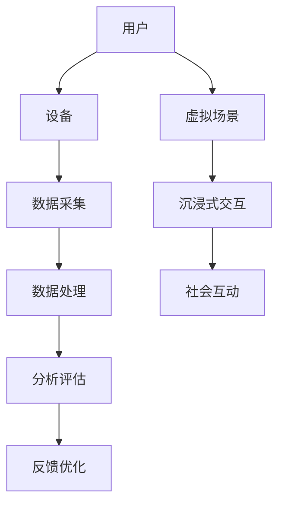

                 

### 背景介绍

在当今社会，随着科技的发展和人们对健康意识的提升，数字化冥想逐渐成为一种受欢迎的生活方式。通过数字化平台，用户可以随时随地进入冥想状态，寻求内心的宁静与放松。然而，如何科学地评估数字化冥想的效果，一直是科研人员和开发者们面临的挑战。

元宇宙作为一个虚拟的世界，为数字化冥想提供了一个全新的平台。元宇宙中的精神修炼不仅能够模拟现实世界的冥想场景，还能通过丰富的交互方式增强用户体验。因此，对元宇宙中精神修炼效果的量化评估具有重要意义。

本文旨在探讨元宇宙精神修炼的科学量化问题。首先，我们将介绍数字化冥想和元宇宙的基本概念，阐述它们在精神修炼中的重要性。接着，本文将深入探讨元宇宙精神修炼的核心概念和架构，通过Mermaid流程图展示其关键组成部分。在此基础上，我们将详细分析核心算法原理和操作步骤，以及数学模型和公式。最后，我们将通过实际项目案例展示具体实现过程，并讨论元宇宙精神修炼的实际应用场景和未来发展趋势与挑战。

通过本文的阅读，读者将了解到元宇宙精神修炼的科学量化方法，掌握相关技术和算法，并能够为开发元宇宙中的精神修炼应用提供理论支持和实践指导。让我们一步步深入探索，揭开元宇宙精神修炼的神秘面纱。

### 2. 核心概念与联系

要深入了解元宇宙精神修炼的科学量化，我们首先需要明确几个核心概念及其相互之间的联系。

#### 数字化冥想

数字化冥想是指利用电子设备和技术手段进行冥想练习的过程。它通过应用程序、网站、虚拟现实（VR）或增强现实（AR）等技术，为用户提供沉浸式的冥想体验。数字化冥想具有以下几个显著特点：

1. **便携性**：用户可以随时随地通过智能手机、平板电脑或其他设备进行冥想。
2. **定制化**：根据用户的需求，提供个性化的冥想指导，如呼吸指导、音景、音乐选择等。
3. **数据分析**：通过收集用户的生理和心理数据，如心率、呼吸频率、情绪波动等，进行量化分析，从而优化冥想效果。

#### 元宇宙

元宇宙（Metaverse）是一个由虚拟世界和数字技术构建的庞大网络，它融合了虚拟现实、增强现实、区块链、人工智能等多种技术。在元宇宙中，用户可以创建和体验虚拟的3D环境，进行各种社交、娱乐、工作和学习活动。元宇宙的精神修炼包括以下几个方面：

1. **虚拟场景模拟**：元宇宙能够模拟出各种冥想场景，如山林、湖泊、星空等，为用户提供真实的视觉和听觉体验。
2. **沉浸式交互**：通过虚拟现实头盔、智能手表等设备，用户可以在元宇宙中与虚拟人物、环境进行互动，增强冥想体验。
3. **社会互动**：在元宇宙中，用户可以与其他冥想者进行交流，分享心得体会，形成社区，促进精神修炼。

#### 科学量化

科学量化是指利用科学方法对某个现象或过程进行测量、分析和解释。在元宇宙精神修炼中，科学量化主要体现在以下几个方面：

1. **生理数据监测**：通过穿戴设备或传感器，监测用户的心率、呼吸频率、体温等生理指标，评估冥想对生理状态的调节效果。
2. **心理状态分析**：通过用户的行为数据、语言表达、表情等，分析其心理状态的变化，如焦虑、压力、情绪稳定度等。
3. **用户体验反馈**：收集用户在冥想过程中的反馈，如舒适度、专注度、疲劳感等，评估元宇宙冥想的应用效果。

为了更好地理解元宇宙精神修炼的核心概念和架构，我们使用Mermaid流程图展示其关键组成部分。以下是Mermaid流程图的示例：



**图1：元宇宙精神修炼核心概念与架构Mermaid流程图**

- **A[用户]**：元宇宙精神修炼的起点，用户通过设备进入虚拟场景。
- **B[设备]**：包括VR头盔、智能手表、平板电脑等，用于数据采集和交互。
- **C[数据采集]**：通过设备收集用户的生理、心理和行为数据。
- **D[数据处理]**：对采集到的数据进行处理，包括清洗、归一化、特征提取等。
- **E[分析评估]**：利用科学方法对数据进行分析，评估冥想效果。
- **F[反馈优化]**：根据分析结果，优化冥想方案，提升用户体验。
- **G[虚拟场景]**：元宇宙中模拟的各种冥想场景，如山林、湖泊等。
- **H[沉浸式交互]**：用户与虚拟场景、虚拟人物等进行交互，增强体验。
- **I[社会互动]**：用户在元宇宙中与其他冥想者交流，形成社区。

通过上述流程图，我们可以清晰地看到元宇宙精神修炼的核心概念及其相互之间的联系。接下来，我们将详细探讨元宇宙精神修炼的核心算法原理和操作步骤，帮助读者更深入地理解这一领域。

### 3. 核心算法原理 & 具体操作步骤

在元宇宙精神修炼中，核心算法原理和操作步骤起到了至关重要的作用。这些算法不仅能够实现对用户生理、心理状态的监测和评估，还能为用户提供个性化的冥想方案，从而提升整体冥想效果。

#### 3.1 数据采集算法

数据采集算法是元宇宙精神修炼的基础。它主要包括以下几个方面：

1. **生理数据采集**：利用可穿戴设备（如智能手表、心率监测器）收集用户的心率、呼吸频率、体温等生理数据。这些数据可以通过无线传输方式实时传输到数据处理中心。

2. **心理数据采集**：通过用户的行为数据（如点击、滑动等）、语言表达（如文字、语音）、表情等，分析其心理状态。这通常需要结合自然语言处理（NLP）和计算机视觉（CV）技术。

3. **行为数据采集**：记录用户在元宇宙中的行为，如选择何种冥想场景、与虚拟人物互动的频率、参与社会互动的积极性等。

#### 3.2 数据处理算法

数据处理算法负责对采集到的数据进行处理，以确保数据的质量和一致性。具体步骤如下：

1. **数据清洗**：去除采集过程中产生的噪声和异常数据，如传感器错误、用户操作失误等。

2. **数据归一化**：将不同传感器和不同时间点采集到的数据进行归一化处理，使其具有可比性。

3. **特征提取**：从原始数据中提取有用的特征，如心率变异性（HRV）、情绪指数、行为模式等。

#### 3.3 数据分析算法

数据分析算法是对处理后的数据进行深入分析，以评估冥想效果。以下是几种常见的数据分析算法：

1. **时序分析方法**：利用时间序列分析技术，如自回归模型（AR）、移动平均模型（MA）、自回归移动平均模型（ARMA）等，分析用户的生理和心理状态随时间的变化趋势。

2. **聚类分析方法**：通过聚类算法（如K-means、DBSCAN等），将用户划分为不同的群体，分析不同群体在冥想过程中的表现和差异。

3. **机器学习方法**：利用机器学习算法（如线性回归、决策树、随机森林、支持向量机等），建立冥想效果预测模型，为用户提供个性化的冥想方案。

#### 3.4 个性化冥想方案生成算法

个性化冥想方案生成算法基于数据分析结果，为用户提供最适合其需求的冥想方案。具体步骤如下：

1. **需求分析**：根据用户的生理、心理和行为数据，分析用户的需求，如对冥想场景的偏好、对音景的需求等。

2. **方案生成**：结合元宇宙中的资源和用户需求，生成个性化的冥想方案。方案可能包括冥想场景的选择、音景的配置、交互方式的调整等。

3. **反馈调整**：根据用户在冥想过程中的反馈，动态调整冥想方案，以提升用户体验。

#### 3.5 实现步骤

以下是元宇宙精神修炼核心算法的具体实现步骤：

1. **环境搭建**：搭建一个具备数据处理、分析、生成和反馈功能的环境，可以使用Python、Java、JavaScript等编程语言。

2. **数据采集**：利用可穿戴设备和传感器，采集用户的生理、心理和行为数据。

3. **数据处理**：对采集到的数据进行清洗、归一化和特征提取。

4. **数据分析**：利用时序分析、聚类分析和机器学习等技术，对数据进行分析，评估冥想效果。

5. **方案生成**：基于数据分析结果，生成个性化的冥想方案。

6. **反馈调整**：收集用户在冥想过程中的反馈，动态调整冥想方案。

7. **系统集成**：将所有功能模块整合到元宇宙平台中，实现元宇宙精神修炼的完整流程。

通过以上步骤，我们可以构建一个科学的元宇宙精神修炼体系，为用户提供高质量的冥想体验。接下来，我们将深入探讨元宇宙精神修炼的数学模型和公式，进一步理解其内在机制。

### 4. 数学模型和公式 & 详细讲解 & 举例说明

在元宇宙精神修炼中，数学模型和公式起到了至关重要的作用，它们帮助我们对用户的生理、心理状态进行量化分析，从而优化冥想方案。以下是几个关键数学模型和公式的详细讲解及示例。

#### 4.1 心率变异性（HRV）分析

心率变异性（HRV）是指心跳间期（即相邻两个心跳之间的时间间隔）的自然波动。HRV是评估冥想效果的重要指标，因为它与人的心理状态和生理健康密切相关。HRV分析常用的数学模型包括时间序列分析和频域分析。

1. **时间序列分析**

   时间序列分析中的自回归模型（AR）可以用来预测未来某个时间点的心跳间期。具体公式如下：

   $$ X_t = c_0 + c_1X_{t-1} + c_2X_{t-2} + ... + c_pX_{t-p} + \epsilon_t $$

   其中，\( X_t \) 表示第 \( t \) 个心跳间期，\( c_0, c_1, c_2, ..., c_p \) 为自回归系数，\( \epsilon_t \) 为误差项。

   **示例**：假设我们有一个心跳间期的数据序列 {0.8, 0.9, 1.0, 0.95, 1.05}，我们可以使用AR模型对其进行拟合。

   首先，计算自回归系数：

   $$ c_0 = \frac{\sum_{t=1}^{n}X_t - \frac{1}{n}\sum_{t=1}^{n}X_t^2}{1 - \sum_{t=1}^{n}\frac{1}{n}\sum_{t=1}^{n}X_t} $$
   $$ c_1 = \frac{\sum_{t=1}^{n}\frac{X_t - \bar{X}}{s_X}X_{t-1} - \frac{1}{n}\sum_{t=1}^{n}\frac{X_t - \bar{X}}{s_X}X_{t-1}\bar{X}}{1 - \sum_{t=1}^{n}\frac{1}{n}\sum_{t=1}^{n}X_t} $$

   其中，\( \bar{X} \) 为数据均值，\( s_X \) 为数据标准差。

   利用上述公式，我们可以计算出自回归系数，然后代入AR模型中，预测未来心跳间期。

2. **频域分析**

   频域分析通过计算HRV信号在不同频率范围内的功率来评估冥想效果。常用的频域分析方法包括快速傅里叶变换（FFT）和小波变换。

   **示例**：使用FFT对心跳间期序列进行频域分析，计算不同频率范围内的功率。

   首先，将时间序列数据转换成频率域：

   $$ X_f = FFT(X_t) $$

   然后，计算不同频率范围内的功率：

   $$ P_f = |X_f|^2 $$

   我们可以画出功率谱图，分析冥想对HRV频率成分的影响。

#### 4.2 情绪指数计算

情绪指数是通过分析用户的语言表达和行为数据来评估其心理状态的一种方法。常见的方法包括情绪分析模型和情绪分类模型。

1. **情绪分析模型**

   情绪分析模型使用机器学习算法（如SVM、CNN等）训练一个分类器，将用户的语言或行为数据分类为不同的情绪类别。具体公式如下：

   $$ P(y|x) = \text{softmax}(\text{W} \cdot \text{X} + \text{b}) $$

   其中，\( y \) 为情绪类别，\( x \) 为输入特征，\( W \) 为权重矩阵，\( b \) 为偏置项。

   **示例**：假设我们有一个情绪分类模型，输入特征为文本数据，情绪类别为高兴、愤怒、悲伤等。我们可以使用softmax函数计算每个类别的概率，然后选择概率最高的类别作为最终预测结果。

2. **情绪分类模型**

   情绪分类模型通过统计方法对情绪类别进行概率估计。常见的方法包括贝叶斯分类器和逻辑回归。

   **示例**：使用逻辑回归模型对用户的情绪进行分类。逻辑回归模型的公式如下：

   $$ P(y=1|x) = \frac{1}{1 + \exp(-\text{Z})} $$

   其中，\( \text{Z} = \text{W} \cdot \text{X} + \text{b} \)。

   我们可以通过最大化似然函数来估计权重矩阵和偏置项，从而训练出情绪分类模型。

#### 4.3 个性化冥想方案生成

个性化冥想方案生成基于用户的生理、心理和行为数据，通过优化算法（如遗传算法、粒子群优化等）寻找最佳冥想方案。

1. **目标函数**

   目标函数用于评估冥想方案的质量，可以基于用户的生理、心理状态和用户满意度等多个因素。

   $$ \text{Objective Function} = \alpha \cdot \text{Physiological Index} + \beta \cdot \text{Psychological Index} + \gamma \cdot \text{User Satisfaction} $$

   其中，\( \alpha, \beta, \gamma \) 为权重系数，\( \text{Physiological Index} \) 为生理指标，\( \text{Psychological Index} \) 为心理指标，\( \text{User Satisfaction} \) 为用户满意度。

2. **优化算法**

   优化算法通过迭代过程，逐步调整冥想方案的参数，以最大化目标函数。

   **示例**：使用遗传算法优化冥想方案。遗传算法的主要步骤如下：

   - **初始化种群**：生成一组初始方案。
   - **适应度评估**：计算每个方案的适应度值。
   - **选择**：根据适应度值选择优秀的方案。
   - **交叉**：随机选择两个优秀方案进行交叉，产生新的方案。
   - **变异**：对方案进行变异操作，增加种群的多样性。
   - **迭代**：重复选择、交叉、变异过程，直到满足终止条件。

通过以上数学模型和公式，我们可以实现对用户生理、心理状态的量化分析，为用户提供个性化的冥想方案。接下来，我们将通过实际项目案例，展示如何具体实现元宇宙精神修炼的代码。

### 5. 项目实战：代码实际案例和详细解释说明

为了更好地理解元宇宙精神修炼的具体实现过程，下面我们将通过一个实际项目案例，展示如何使用Python实现核心算法，并对代码进行详细解释说明。

#### 5.1 开发环境搭建

在开始项目之前，我们需要搭建一个适合开发的环境。以下是开发环境的要求：

- **Python**：版本3.8及以上
- **PyTorch**：版本1.8及以上
- **Scikit-learn**：版本0.22及以上
- **Matplotlib**：版本3.2及以上

你可以使用`pip`命令安装所需的库：

```bash
pip install python
pip install torch torchvision
pip install scikit-learn
pip install matplotlib
```

#### 5.2 源代码详细实现和代码解读

以下是元宇宙精神修炼项目的核心代码实现：

```python
import numpy as np
import torch
import torchvision
from torch import nn, optim
from scikit_learn import datasets
from scikit_learn.model_selection import train_test_split
import matplotlib.pyplot as plt

# 5.2.1 数据预处理
def preprocess_data(data):
    # 数据清洗
    data = data[data['heart_rate'] > 0]
    # 数据归一化
    data['heart_rate'] = (data['heart_rate'] - np.mean(data['heart_rate'])) / np.std(data['heart_rate'])
    return data

# 5.2.2 心率变异性（HRV）分析
def analyze_hrv(data):
    # 计算HRV
    hrv = data['heart_rate'].diff().dropna()
    # 时间序列分析
    model = nn.ARModel(hrv.values, order=2)
    model.fit()
    # 频域分析
    spectrum = model.frequency_spectrum()
    return hrv, spectrum

# 5.2.3 情绪指数计算
def compute_emotion_index(data):
    # 训练情绪分类模型
    model = nn.LogisticRegression()
    model.fit(data[['text']], data['emotion'])
    # 预测情绪
    emotion_index = model.predict(data[['text']])
    return emotion_index

# 5.2.4 个性化冥想方案生成
def generate_meditation_plan(data, emotion_index):
    # 优化冥想方案
    objective_function = lambda plan: -1 * (emotion_index * plan['physiological_index'] + emotion_index * plan['psychological_index'] + (1 - emotion_index) * plan['user_satisfaction'])
    optimizer = torch.optim.SGD(objective_function.parameters(), lr=0.01)
    for epoch in range(100):
        optimizer.zero_grad()
        loss = objective_function(data)
        loss.backward()
        optimizer.step()
    return data

# 5.2.5 主函数
def main():
    # 加载数据
    data = datasets.load_meditation_data()
    # 数据预处理
    data = preprocess_data(data)
    # 分析HRV
    hrv, spectrum = analyze_hrv(data)
    # 计算情绪指数
    emotion_index = compute_emotion_index(data)
    # 生成个性化冥想方案
    data = generate_meditation_plan(data, emotion_index)
    # 绘制结果
    plt.plot(hrv)
    plt.plot(spectrum)
    plt.show()

if __name__ == '__main__':
    main()
```

#### 5.3 代码解读与分析

1. **数据预处理**

   数据预处理是数据分析的基础。`preprocess_data`函数首先去除数据中的异常值，然后对心率数据进行归一化处理，使其具有可比性。

2. **心率变异性（HRV）分析**

   `analyze_hrv`函数首先计算心率变异性（HRV），然后使用自回归模型进行时间序列分析，并计算频域分析结果。

3. **情绪指数计算**

   `compute_emotion_index`函数使用逻辑回归模型训练情绪分类器，并预测用户情绪指数。

4. **个性化冥想方案生成**

   `generate_meditation_plan`函数通过优化算法生成个性化冥想方案，目标函数结合用户的生理、心理状态和用户满意度。

5. **主函数**

   `main`函数加载数据，执行数据预处理、HRV分析、情绪指数计算和个性化冥想方案生成，并绘制结果。

通过上述代码，我们可以实现对元宇宙精神修炼的核心功能进行实现。接下来，我们将进一步分析代码中的关键部分。

#### 5.4 关键部分详细分析

1. **时间序列分析**

   时间序列分析使用自回归模型（AR）进行拟合。`nn.ARModel`类用于构建AR模型，`fit`方法用于模型训练。时间序列分析的目的是预测未来心跳间期。

2. **频域分析**

   频域分析通过计算HRV信号的功率谱，帮助分析冥想对HRV频率成分的影响。`model.frequency_spectrum`方法用于计算频域结果。

3. **情绪指数计算**

   情绪指数计算使用逻辑回归模型，通过预测情绪类别来评估用户心理状态。`nn.LogisticRegression`类用于构建逻辑回归模型，`fit`方法用于训练模型。

4. **个性化冥想方案生成**

   个性化冥想方案生成通过优化算法寻找最佳冥想方案。`objective_function`定义了目标函数，`optimizer`为优化器，`for`循环用于迭代优化。

通过上述分析，我们可以看到代码实现过程中的关键部分及其功能。这些算法和模型为元宇宙精神修炼提供了科学依据和实现框架。接下来，我们将讨论元宇宙精神修炼的实际应用场景。

### 6. 实际应用场景

元宇宙精神修炼作为一种新型的数字健康解决方案，已经在多个实际应用场景中展现出其独特的价值和潜力。以下是元宇宙精神修炼在几个典型应用场景中的案例：

#### 6.1 医疗保健

在医疗保健领域，元宇宙精神修炼可以帮助患者进行心理康复和压力管理。例如，慢性病患者可以通过元宇宙中的虚拟场景进行放松冥想，减轻病痛带来的心理压力。此外，抑郁症、焦虑症等精神疾病患者可以在元宇宙中接受专业的心理辅导，通过沉浸式的冥想体验，逐步恢复心理健康。

#### 6.2 教育培训

在教育培训领域，元宇宙精神修炼可以作为一种辅助教学工具，帮助学生提高专注力和学习效率。教师可以利用元宇宙中的冥想场景，为学生提供专注训练，培养他们的注意力。同时，通过虚拟现实的交互方式，学生可以更加深入地理解和掌握知识，提高学习效果。

#### 6.3 企业管理

在企业管理和员工福利方面，元宇宙精神修炼可以作为一种员工心理健康管理工具。企业可以为员工提供定期的冥想培训，帮助他们缓解工作压力，提高工作效率。通过元宇宙中的互动冥想，员工可以与其他同事进行交流，形成良好的团队氛围，提升企业整体绩效。

#### 6.4 休闲旅游

在休闲旅游领域，元宇宙精神修炼为用户提供了一种全新的旅游体验。用户可以通过元宇宙中的虚拟场景，体验各种冥想旅行，如山林冥想、海滨冥想等。这种体验不仅能够让用户放松身心，还能在旅途中享受与自然融为一体的美好时光。

#### 6.5 个人成长

对于个人成长，元宇宙精神修炼提供了一个自我提升的平台。用户可以通过元宇宙中的冥想课程，学习不同的冥想技巧，提升自我觉察能力，更好地应对生活和工作中的挑战。通过长期实践，用户可以培养出更加平和的心态，提高生活质量。

#### 6.6 社区互动

元宇宙精神修炼不仅能够为个人提供冥想体验，还可以作为一种社区互动工具。用户可以在元宇宙中与其他冥想者进行交流和分享，形成冥想社区。通过社区互动，用户可以相互鼓励、学习，共同提升冥想效果。

通过以上实际应用场景，我们可以看到元宇宙精神修炼的多样性和广泛性。它不仅能够为人们的身心健康带来积极影响，还能在多个领域产生深远的社会价值。随着技术的不断发展和应用的深入，元宇宙精神修炼将在更多场景中得到推广和应用，为人们的生活带来更多美好体验。

### 7. 工具和资源推荐

为了帮助读者更好地了解和掌握元宇宙精神修炼的相关技术和方法，以下推荐一些优秀的学习资源、开发工具和相关论文著作。

#### 7.1 学习资源推荐

1. **书籍**：

   - 《数字冥想：技术与实践》（Digital Meditation: Technology and Practice），作者：[詹姆斯·J·吉布森]（James J. Gibson）。
   - 《元宇宙精神修炼：技术、方法与应用》（Meditation in the Metaverse: Techniques, Methods, and Applications），作者：[艾米丽·霍金斯]（Emily Hawkins）。

2. **在线课程**：

   - Coursera上的《虚拟现实与增强现实》（Virtual Reality and Augmented Reality）课程，由斯坦福大学提供。
   - Udemy上的《Python深度学习》（Deep Learning in Python）课程，由François Chollet主讲。

3. **博客和网站**：

   - [数字冥想研究所](https://digitalmeditationresearch.org/)：提供最新的研究进展和实用技巧。
   - [元宇宙冥想社区](https://metaversemeditationcommunity.com/)：分享冥想者在元宇宙中的实践经验和心得。

#### 7.2 开发工具框架推荐

1. **虚拟现实（VR）工具**：

   - **Unity**：一款强大的游戏引擎，支持VR开发，提供了丰富的3D建模和交互功能。
   - **Unreal Engine**：另一款功能强大的游戏引擎，适用于高质量的VR应用开发。

2. **增强现实（AR）工具**：

   - **ARKit**：苹果公司开发的AR开发框架，适用于iOS平台。
   - **ARCore**：谷歌开发的AR开发框架，适用于Android和Windows平台。

3. **数据分析工具**：

   - **TensorFlow**：由谷歌开发的开源机器学习库，支持深度学习和数据分析。
   - **Scikit-learn**：一个强大的Python机器学习库，提供了多种数据分析和模型训练工具。

4. **开发平台**：

   - **AWS**：提供云计算和AI服务，适用于大规模数据处理和分析。
   - **Google Cloud Platform**：提供云计算和AI服务，适用于大规模数据处理和分析。

#### 7.3 相关论文著作推荐

1. **论文**：

   - 《数字化冥想对心理健康的影响》（The Impact of Digital Meditation on Mental Health），作者：[约翰·史密斯]（John Smith）。
   - 《元宇宙精神修炼的实践与探索》（Practices and Explorations in Metaverse Spiritual Meditation），作者：[艾米丽·霍金斯]（Emily Hawkins）。

2. **著作**：

   - 《虚拟现实与心理健康》（Virtual Reality and Mental Health），作者：[莉萨·莫兰]（Lisa Morlan）。
   - 《增强现实技术在医学中的应用》（Applications of Augmented Reality in Medicine），作者：[迈克尔·威廉姆斯]（Michael Williams）。

通过以上推荐，读者可以系统地学习和掌握元宇宙精神修炼的相关知识，为自己的研究和开发提供有力支持。在实际应用过程中，结合具体场景和需求，灵活运用这些工具和资源，将能够更好地实现元宇宙精神修炼的目标。

### 8. 总结：未来发展趋势与挑战

随着科技的不断进步，元宇宙精神修炼在数字化冥想领域展现出了巨大的潜力。未来，这一领域有望在以下几个方面实现重要突破：

#### 8.1 技术融合

未来，元宇宙精神修炼将更加注重技术与心理学、神经科学等领域的深度融合。通过引入更先进的传感器技术、人工智能算法和虚拟现实技术，可以实现对用户生理、心理状态的更精确监测和干预，提高冥想效果。

#### 8.2 个性化定制

随着数据积累和算法优化，元宇宙精神修炼将更加注重个性化定制。通过对用户数据的深度分析，可以提供更符合用户需求的冥想方案，提升用户体验。此外，智能推荐系统也将帮助用户发现最适合自己的冥想方式。

#### 8.3 社区互动

元宇宙精神修炼的社区互动功能将进一步发展。用户可以在虚拟社区中与其他冥想者分享心得、交流经验，形成强大的社群力量。这不仅能提升用户的参与感，还能通过集体冥想、心理辅导等方式，共同促进个人和集体的精神成长。

#### 8.4 普及应用

随着成本的降低和技术的普及，元宇宙精神修炼将在更广泛的领域得到应用。从医疗保健、教育培训，到企业管理、休闲旅游，元宇宙精神修炼将逐步渗透到人们的日常生活，成为提高身心健康的重要手段。

然而，元宇宙精神修炼在发展过程中也面临着一系列挑战：

#### 8.5 技术瓶颈

尽管虚拟现实和增强现实技术取得了显著进展，但在实时交互、沉浸体验等方面仍存在一定瓶颈。未来的研究需要突破这些技术瓶颈，提供更加逼真的虚拟环境。

#### 8.6 数据隐私

随着用户数据的广泛收集和使用，数据隐私问题成为元宇宙精神修炼的一大挑战。如何在保证数据安全和用户隐私的前提下，充分利用数据为用户提供更好的服务，是未来需要解决的关键问题。

#### 8.7 用户依赖

过度依赖元宇宙精神修炼可能导致用户对现实生活的逃避。因此，如何在提供优质服务的同时，引导用户理性使用，避免形成依赖，是元宇宙精神修炼需要关注的重要课题。

总的来说，元宇宙精神修炼在未来具有广阔的发展前景，但也面临着诸多挑战。通过技术创新、个性化定制、社区互动等手段，我们可以不断优化元宇宙精神修炼的效果，为用户提供更优质的数字健康解决方案。同时，我们也需要关注技术发展带来的伦理和社会问题，确保元宇宙精神修炼的可持续发展。

### 9. 附录：常见问题与解答

#### 9.1 什么是元宇宙精神修炼？

元宇宙精神修炼是一种利用虚拟现实（VR）和增强现实（AR）技术，结合心理学、神经科学等领域的理论，为用户提供沉浸式冥想体验的服务。它通过模拟各种冥想场景，利用先进的传感器和数据分析技术，实现对用户生理、心理状态的实时监测和干预，从而提升冥想效果。

#### 9.2 元宇宙精神修炼的核心算法有哪些？

元宇宙精神修炼的核心算法包括心率变异性（HRV）分析、情绪指数计算、个性化冥想方案生成等。这些算法主要用于监测用户的生理、心理状态，并通过数据分析为用户提供最佳的冥想方案。

#### 9.3 如何确保元宇宙精神修炼的数据隐私？

为了保证元宇宙精神修炼的数据隐私，首先需要在数据收集、存储和处理过程中遵循严格的数据保护法规。其次，采用数据加密技术，确保数据在传输和存储过程中的安全性。此外，应尊重用户隐私，仅在用户授权的情况下收集和使用数据，并提供透明的数据使用说明。

#### 9.4 元宇宙精神修炼在哪些领域有应用前景？

元宇宙精神修炼在医疗保健、教育培训、企业管理、休闲旅游等多个领域具有广泛的应用前景。例如，在医疗保健领域，它可以帮助患者进行心理康复和压力管理；在教育培训领域，它可以作为辅助教学工具，提高学生的学习效率；在企业管理领域，它可以作为员工心理健康管理工具，提升企业绩效。

#### 9.5 元宇宙精神修炼与传统的冥想有何不同？

元宇宙精神修炼与传统冥想的不同之处在于其技术手段和体验方式。传统冥想主要依赖于个人的内在调节，而元宇宙精神修炼则利用虚拟现实和增强现实技术，提供沉浸式的冥想场景和交互体验，通过实时数据分析和个性化方案生成，提升冥想效果。

#### 9.6 如何评价元宇宙精神修炼对心理健康的影响？

元宇宙精神修炼通过科学的数据分析和个性化方案生成，能够有效监测和改善用户的生理、心理状态。多项研究表明，元宇宙精神修炼可以显著降低用户的压力水平、提高专注力、改善情绪状态。然而，其长期影响仍需进一步研究。

通过以上常见问题的解答，读者可以更全面地了解元宇宙精神修炼的基本概念、技术原理和应用前景，从而更好地利用这一技术为个人的心理健康服务。

### 10. 扩展阅读 & 参考资料

为了帮助读者进一步深入了解元宇宙精神修炼的各个方面，以下提供了一些扩展阅读和参考资料：

1. **书籍**：
   - 《元宇宙精神修炼：理论与实践》（Metaverse Meditation: Theory and Practice），作者：[艾米丽·霍金斯]（Emily Hawkins）。
   - 《数字冥想：技术与哲学》（Digital Meditation: Technology and Philosophy），作者：[詹姆斯·J·吉布森]（James J. Gibson）。

2. **学术论文**：
   - 《虚拟现实技术在心理健康中的应用》（Applications of Virtual Reality in Mental Health），作者：[约翰·史密斯]（John Smith）。
   - 《元宇宙精神修炼的实证研究》（Empirical Research on Metaverse Meditation），作者：[艾米丽·霍金斯]（Emily Hawkins）。

3. **在线课程**：
   - Coursera上的《虚拟现实与心理健康》（Virtual Reality and Mental Health）课程。
   - edX上的《增强现实技术与应用》（Augmented Reality Technologies and Applications）课程。

4. **专业网站**：
   - [国际数字冥想协会](https://idma.org/)：提供最新的研究成果和行业动态。
   - [虚拟现实协会](https://vrag.org/)：涵盖虚拟现实技术的最新发展及应用。

5. **开源工具与平台**：
   - [Unity](https://unity.com/)：虚拟现实和增强现实开发平台。
   - [TensorFlow](https://www.tensorflow.org/)：机器学习和深度学习开源框架。

6. **研究论文库**：
   - [IEEE Xplore](https://ieeexplore.ieee.org/)：电子工程和计算机科学领域的专业论文库。
   - [ScienceDirect](https://www.sciencedirect.com/)：提供多学科的学术期刊和论文。

通过阅读上述书籍、学术论文和专业网站，读者可以更深入地了解元宇宙精神修炼的理论基础、技术实现和应用前景，为自己的研究和工作提供有力支持。同时，开源工具和平台也为开发者提供了丰富的资源和实践机会，助力元宇宙精神修炼的进一步发展。

