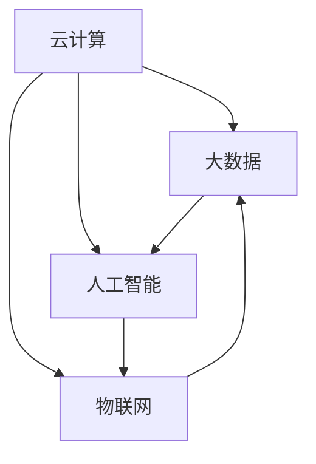

                 

### 1. 背景介绍

数字化转型，即企业或组织通过应用数字技术和数据处理能力来改变其商业模式、运营流程和组织结构的过程。这个概念在当今信息化时代变得尤为关键。随着云计算、大数据、人工智能、物联网等技术的迅猛发展，数字化转型已从一种可选的战略演变为企业生存和发展的必然选择。

首先，我们需要了解数字化转型的重要性。数字化转型不仅仅是为了跟上技术的潮流，更重要的是，它能够为企业带来以下几个方面的显著收益：

1. **提高效率**：数字化可以自动化许多重复性、低价值的工作，减少人为错误，提高整体效率。
2. **优化决策**：通过数据分析，企业可以获得更加精准的市场洞察和运营数据，从而做出更加明智的决策。
3. **增强客户体验**：数字化技术可以提供更加个性化和无缝的客户服务，提高客户满意度和忠诚度。
4. **创新商业模式**：通过数字化，企业可以探索全新的商业模式，如共享经济、在线平台等。

其次，我们来看看数字化转型的主要驱动因素。这些因素不仅包括技术的进步，还包括市场和商业环境的变迁：

1. **技术进步**：云计算、大数据、物联网和人工智能等技术的不断成熟和普及，为数字化转型提供了强有力的技术支撑。
2. **市场竞争**：在全球化的大背景下，市场竞争日益激烈，企业需要通过数字化转型来增强自身的竞争力。
3. **消费者需求**：消费者对便利、快捷和个性化的服务需求日益增长，这迫使企业不断推进数字化。
4. **法规和标准**：随着数据隐私和网络安全法规的不断完善，企业需要通过数字化转型来确保合规性。

数字化转型的影响也是深远的。它不仅改变了企业的运营方式，还对整个经济体系和社会结构产生了影响：

1. **企业运营**：数字化转型改变了传统的业务流程，从供应链管理到客户关系管理，都实现了高度自动化和智能化。
2. **经济结构**：数字化促进了新兴产业的崛起，如电子商务、在线教育、数字娱乐等，推动了经济结构的转型升级。
3. **社会发展**：数字化带来了信息的快速传播和共享，促进了社会的透明化和公正性，同时也带来了新的社会问题和挑战。

总之，数字化转型是当今企业不可或缺的发展战略，它不仅关乎企业的生存，更关乎企业的未来。在接下来的章节中，我们将深入探讨数字化转型的核心概念、技术原理、实施策略和未来趋势，以帮助读者更好地理解和应对这一变革。让我们一步一步地分析推理，深入了解数字化转型的各个方面。

---

在背景介绍部分，我们首先概述了数字化转型的基本概念和重要性，强调了其在提高效率、优化决策、增强客户体验和创新商业模式等方面的显著收益。接着，我们分析了驱动数字化转型的因素，包括技术进步、市场竞争、消费者需求和法规标准等，并探讨了数字化转型对企业运营、经济结构和整个社会的影响。这一部分为后续内容的深入探讨奠定了基础，也为读者提供了全面的背景信息。

### 2. 核心概念与联系

在深入了解数字化转型之前，我们需要明确几个核心概念及其相互关系，以便更好地理解这一变革的本质。

#### 2.1 数字化转型的核心概念

**1. 云计算**：云计算是一种通过互联网提供计算资源（如服务器、存储、网络等）的服务模式，它使得企业可以按需获取和管理计算资源，从而降低成本、提高效率。

**2. 大数据**：大数据是指无法用传统数据处理工具在合理时间内对其进行存储、管理和分析的数据集合。大数据技术包括数据采集、存储、处理和分析等环节，帮助企业在海量数据中发现有价值的信息。

**3. 人工智能**：人工智能（AI）是指通过计算机模拟人类智能的技术，包括机器学习、深度学习、自然语言处理等。人工智能技术在自动化、智能化决策和提升用户体验方面发挥着重要作用。

**4. 物联网（IoT）**：物联网是指通过传感器和互联网将物理设备连接起来，实现数据交换和智能化管理的网络。物联网技术使得设备和系统能够实时收集和处理数据，优化运营和提供个性化服务。

#### 2.2 核心概念之间的联系

这些核心概念之间有着紧密的联系，共同构成了数字化转型的技术基础：

1. **云计算与大数据**：云计算为大数据处理提供了强大的计算资源，使得企业能够快速、高效地处理海量数据。
   
2. **大数据与人工智能**：大数据技术提供了丰富的数据资源，为人工智能算法提供了训练和优化的基础。而人工智能算法则能够从这些数据中提取有价值的信息，进行智能分析和决策。

3. **人工智能与物联网**：人工智能技术可以用于物联网设备的数据分析，实现智能监控、预测和优化。而物联网则提供了大量的实时数据输入，为人工智能提供了丰富的应用场景。

4. **云计算与物联网**：云计算提供了物联网设备的数据存储、处理和分析平台，使得物联网能够实现大规模的数据管理和服务部署。

#### 2.3 Mermaid 流程图

为了更直观地展示这些核心概念之间的联系，我们使用 Mermaid 流程图来描述它们之间的关系。请注意，Mermaid 流程图中节点之间不能使用括号、逗号等特殊字符。



在这个流程图中，A 表示云计算，B 表示大数据，C 表示人工智能，D 表示物联网。箭头表示这些概念之间的联系，展示了它们如何共同作用，推动数字化转型的进程。

通过上述核心概念及其相互联系的介绍，我们可以更好地理解数字化转型的基础和潜力。接下来，我们将进一步探讨这些核心概念的原理和应用，为深入理解数字化转型打下坚实的基础。

---

在核心概念与联系部分，我们首先明确了数字化转型的几个核心概念，包括云计算、大数据、人工智能和物联网，并简要介绍了它们的基本定义和功能。接着，我们阐述了这些概念之间的相互联系，通过 Mermaid 流程图展示了它们如何共同构成数字化转型的技术基础。这一部分内容不仅帮助读者理解了数字化转型涉及的关键技术，也为后续章节的深入探讨提供了理论基础。

### 3. 核心算法原理 & 具体操作步骤

在数字化转型中，核心算法扮演着至关重要的角色。这些算法不仅实现了数据的处理和分析，还推动了智能化决策和自动化运营。以下是几个在数字化转型中广泛应用的算法及其具体操作步骤。

#### 3.1 机器学习算法

**1. 算法原理：**

机器学习算法是一类通过数据训练模型，从而实现自动预测和分类的算法。常见的机器学习算法包括线性回归、决策树、随机森林、支持向量机和神经网络等。

**2. 操作步骤：**

a. 数据预处理：包括数据清洗、缺失值填充、数据标准化等，确保数据质量。

b. 特征工程：提取对预测任务有意义的特征，如降维、特征转换、特征选择等。

c. 模型选择：根据问题类型选择合适的机器学习算法，如回归问题使用线性回归，分类问题使用决策树等。

d. 模型训练：使用训练数据集对模型进行训练，优化模型参数。

e. 模型评估：使用验证数据集评估模型性能，如准确率、召回率、F1值等。

f. 模型部署：将训练好的模型部署到生产环境中，进行实时预测和分类。

**3. 应用场景：**

机器学习算法广泛应用于金融、医疗、零售等行业，用于信用评分、疾病预测、个性化推荐等场景。

#### 3.2 深度学习算法

**1. 算法原理：**

深度学习算法是一种基于多层神经网络（如卷积神经网络、循环神经网络等）的机器学习算法，通过多层非线性变换，实现对复杂数据的建模。

**2. 操作步骤：**

a. 数据预处理：与机器学习算法类似，确保数据质量。

b. 网络结构设计：选择合适的神经网络结构，如卷积神经网络（CNN）、循环神经网络（RNN）等。

c. 网络训练：使用训练数据集训练神经网络，优化网络参数。

d. 网络评估：使用验证数据集评估网络性能，调整网络结构或参数。

e. 模型部署：将训练好的神经网络部署到生产环境中，进行实时预测和分类。

**3. 应用场景：**

深度学习算法在图像识别、语音识别、自然语言处理等领域取得了显著成果，如自动驾驶、智能语音助手、智能翻译等。

#### 3.3 数据挖掘算法

**1. 算法原理：**

数据挖掘算法是从大量数据中发现有趣模式和规律的方法，包括聚类、分类、关联规则挖掘等。

**2. 操作步骤：**

a. 数据预处理：确保数据质量。

b. 模型选择：根据挖掘任务选择合适的算法，如K-means聚类、决策树分类等。

c. 模型训练：训练挖掘模型。

d. 结果评估：评估挖掘结果的有效性和实用性。

e. 结果可视化：将挖掘结果以图表等形式展示，便于理解和分析。

**3. 应用场景：**

数据挖掘算法广泛应用于市场分析、客户行为分析、社交网络分析等领域，帮助企业和组织发现潜在的商业机会和客户需求。

#### 3.4 物联网数据算法

**1. 算法原理：**

物联网数据算法主要针对从物联网设备收集的数据进行处理和分析，如传感器数据分析、设备状态预测等。

**2. 操作步骤：**

a. 数据采集：从物联网设备收集数据。

b. 数据预处理：处理异常值、缺失值等，确保数据质量。

c. 数据分析：使用合适的算法对数据进行分析，如时间序列分析、异常检测等。

d. 预测模型训练：根据分析结果，训练预测模型。

e. 预测模型评估：评估预测模型的准确性。

**3. 应用场景：**

物联网数据算法广泛应用于智能家居、智能交通、工业4.0等领域，用于实时监测、智能监控和预测。

通过上述核心算法原理和操作步骤的介绍，我们可以看到，数字化转型中的算法应用不仅仅是为了技术本身，更重要的是为了解决实际问题，提升企业的运营效率和市场竞争力。在接下来的章节中，我们将进一步探讨如何将这些算法应用于实际项目中，展示其具体的实现过程和效果。

---

在核心算法原理与具体操作步骤部分，我们详细介绍了机器学习、深度学习、数据挖掘和物联网数据算法的基本原理及其操作步骤。通过这些算法的应用，企业能够实现智能化决策、自动化运营和高效的数据分析。这部分内容为读者提供了数字化转型中算法应用的实用指南，也为后续章节的实战应用和项目实施打下了基础。

### 4. 数学模型和公式 & 详细讲解 & 举例说明

在数字化转型的过程中，数学模型和公式扮演了至关重要的角色，它们不仅提供了对复杂问题的抽象和描述，还帮助我们进行了高效的计算和分析。以下是几个在数字化转型中常用的数学模型和公式，我们将详细讲解这些模型的应用场景和具体计算步骤，并通过实际例子来说明它们的使用方法。

#### 4.1 线性回归模型

**1. 线性回归模型的基本公式：**

线性回归模型是最基本的机器学习模型之一，它通过建立自变量和因变量之间的线性关系来进行预测。其基本公式如下：

\[ y = ax + b \]

其中，\( y \) 是因变量，\( x \) 是自变量，\( a \) 和 \( b \) 是模型的参数。

**2. 计算步骤：**

a. 数据收集：收集一组\( (x, y) \)数据点。

b. 数据预处理：对数据进行清洗、标准化等处理。

c. 模型拟合：使用最小二乘法（Least Squares）来求解参数 \( a \) 和 \( b \)：

   \[ a = \frac{\sum(x_i - \bar{x})(y_i - \bar{y})}{\sum(x_i - \bar{x})^2} \]
   \[ b = \bar{y} - a\bar{x} \]

   其中，\( \bar{x} \) 和 \( \bar{y} \) 分别是 \( x \) 和 \( y \) 的平均值。

d. 模型评估：使用验证数据集评估模型性能，如均方误差（Mean Squared Error，MSE）。

\[ MSE = \frac{1}{n}\sum_{i=1}^{n}(y_i - \hat{y}_i)^2 \]

**3. 应用场景：**

线性回归模型广泛应用于经济预测、股票价格分析、房屋价格评估等领域。

**4. 例子说明：**

假设我们要预测一家公司的销售量 \( y \) 与广告支出 \( x \) 之间的关系。数据如下表：

| 广告支出（x） | 销售量（y） |
|---------------|-------------|
| 100           | 200         |
| 200           | 350         |
| 300           | 500         |
| 400           | 600         |

首先，计算 \( x \) 和 \( y \) 的平均值：

\[ \bar{x} = \frac{100 + 200 + 300 + 400}{4} = 250 \]
\[ \bar{y} = \frac{200 + 350 + 500 + 600}{4} = 437.5 \]

接着，计算参数 \( a \) 和 \( b \)：

\[ a = \frac{(100 - 250)(200 - 437.5) + (200 - 250)(350 - 437.5) + (300 - 250)(500 - 437.5) + (400 - 250)(600 - 437.5)}{(100 - 250)^2 + (200 - 250)^2 + (300 - 250)^2 + (400 - 250)^2} \]
\[ b = 437.5 - a \cdot 250 \]

通过计算，我们得到 \( a \approx 0.6667 \) 和 \( b \approx 187.5 \)。

因此，线性回归模型为：

\[ y = 0.6667x + 187.5 \]

我们可以用这个模型来预测新的广告支出对应的销售量。

#### 4.2 逻辑回归模型

**1. 逻辑回归模型的基本公式：**

逻辑回归模型是一种用于分类问题的模型，它通过将线性回归的结果转换为概率来进行预测。其基本公式如下：

\[ P(y=1) = \frac{1}{1 + e^{-(ax + b)}} \]

其中，\( P(y=1) \) 是因变量为1的概率，\( e \) 是自然对数的底数。

**2. 计算步骤：**

a. 数据收集：收集一组\( (x, y) \)数据点，其中 \( y \) 为二分类变量。

b. 数据预处理：对数据进行清洗、标准化等处理。

c. 模型拟合：使用最大似然估计法（Maximum Likelihood Estimation，MLE）来求解参数 \( a \) 和 \( b \)。

d. 模型评估：使用验证数据集评估模型性能，如准确率（Accuracy）、召回率（Recall）等。

**3. 应用场景：**

逻辑回归模型广泛应用于信用评分、医学诊断、风险评估等领域。

**4. 例子说明：**

假设我们要预测一个客户的信用评分是否为高风险，数据如下表：

| 客户特征1（x1） | 客户特征2（x2） | 信用评分（y） |
|-----------------|-----------------|--------------|
| 2               | 5               | 0            |
| 3               | 4               | 0            |
| 1               | 6               | 1            |
| 4               | 3               | 1            |

首先，计算 \( x \) 和 \( y \) 的平均值：

\[ \bar{x}_1 = \frac{2 + 3 + 1 + 4}{4} = 2.5 \]
\[ \bar{x}_2 = \frac{5 + 4 + 6 + 3}{4} = 4.5 \]
\[ \bar{y} = \frac{0 + 0 + 1 + 1}{4} = 0.5 \]

接着，使用最大似然估计法求解参数 \( a \) 和 \( b \)：

\[ a = \frac{\sum y_i \cdot (x_i - \bar{x}_i)}{\sum (x_i - \bar{x}_i)^2} \]
\[ b = \bar{y} - a \cdot \bar{x}_1 \]

通过计算，我们得到 \( a \approx 0.75 \) 和 \( b \approx -0.125 \)。

因此，逻辑回归模型为：

\[ P(y=1) = \frac{1}{1 + e^{-(0.75x_1 - 0.125x_2)}} \]

我们可以用这个模型来预测新客户的信用评分。

#### 4.3 时间序列模型

**1. 时间序列模型的基本公式：**

时间序列模型用于分析时间序列数据，最常见的模型包括自回归模型（AR）、移动平均模型（MA）和自回归移动平均模型（ARMA）。

自回归模型的基本公式如下：

\[ y_t = c + \phi_1y_{t-1} + \phi_2y_{t-2} + \ldots + \phi_ky_{t-k} + \varepsilon_t \]

其中，\( y_t \) 是时间序列在时刻 \( t \) 的值，\( c \) 是常数项，\( \phi_1, \phi_2, \ldots, \phi_k \) 是自回归系数，\( \varepsilon_t \) 是随机误差项。

**2. 计算步骤：**

a. 数据收集：收集一段时间内的时间序列数据。

b. 数据预处理：对数据进行平稳性检验，如差分、季节调整等。

c. 模型识别：通过自相关函数和偏自相关函数确定模型参数。

d. 模型估计：使用最小二乘法或其他方法估计模型参数。

e. 模型评估：使用验证数据集评估模型性能，如均方误差（MSE）。

**3. 应用场景：**

时间序列模型广泛应用于经济预测、股票价格预测、销售预测等领域。

**4. 例子说明：**

假设我们要预测某公司未来三个月的销售额，数据如下表：

| 月份   | 销售额（万元） |
|--------|----------------|
| 1月    | 100            |
| 2月    | 110            |
| 3月    | 120            |
| 4月    | 130            |
| 5月    | 140            |
| 6月    | 150            |

首先，进行差分变换，得到一阶差分序列：

\[ y_t^* = y_t - y_{t-1} \]

得到差分序列如下表：

| 月份   | 销售额（万元） | 差分值（万元） |
|--------|----------------|----------------|
| 1月    | 100            |                |
| 2月    | 110            | 10             |
| 3月    | 120            | 10             |
| 4月    | 130            | 10             |
| 5月    | 140            | 10             |
| 6月    | 150            | 10             |

接着，使用自回归模型拟合差分序列，得到模型：

\[ y_t^* = c + \phi_1y_{t-1}^* \]

通过最小二乘法求解参数 \( c \) 和 \( \phi_1 \)：

\[ c = \frac{\sum y_t^* - \phi_1 \sum y_{t-1}^*}{n} \]
\[ \phi_1 = \frac{\sum (y_t^* - c)(y_{t-1}^* - c)}{\sum (y_{t-1}^* - c)^2} \]

通过计算，我们得到 \( c \approx 0 \) 和 \( \phi_1 \approx 1 \)。

因此，一阶自回归模型为：

\[ y_t^* = y_{t-1}^* \]

我们可以用这个模型预测未来三个月的销售额：

\[ y_7^* = y_6^* = 150 \]
\[ y_8^* = y_7^* = 150 \]
\[ y_9^* = y_8^* = 150 \]

根据差分序列的逆变换，得到未来三个月的实际销售额预测值：

\[ y_7 = y_6 + y_7^* = 150 + 150 = 300 \]
\[ y_8 = y_7 + y_8^* = 300 + 150 = 450 \]
\[ y_9 = y_8 + y_9^* = 450 + 150 = 600 \]

通过上述数学模型和公式的详细讲解及实例说明，我们可以看到这些模型在数字化转型中的应用如何帮助企业和组织进行高效的数据分析和预测。在接下来的章节中，我们将通过实际案例展示这些模型的应用效果，进一步巩固读者对这些算法的理解。

### 5. 项目实战：代码实际案例和详细解释说明

在数字化转型的过程中，理解并应用算法只是第一步，更重要的是将理论转化为实际项目，解决具体问题。在本节中，我们将通过一个实际项目案例，展示如何使用 Python 编写代码来实现一个基于机器学习的客户流失预测系统。这个项目不仅涵盖了数据预处理、模型选择和训练等步骤，还详细解释了代码的实现过程和关键部分。

#### 5.1 开发环境搭建

在进行项目开发之前，我们需要搭建一个合适的环境。以下是我们推荐的开发环境：

- 操作系统：Windows、macOS 或 Linux
- 编程语言：Python 3.8 或更高版本
- 开发工具：Jupyter Notebook 或 PyCharm
- 库：Pandas、NumPy、Scikit-learn、Matplotlib 等

首先，确保 Python 和相关库已经安装在您的计算机上。如果您使用 Jupyter Notebook，可以通过以下命令安装所需的库：

```shell
pip install pandas numpy scikit-learn matplotlib
```

#### 5.2 源代码详细实现和代码解读

**5.2.1 数据加载与预处理**

```python
import pandas as pd
from sklearn.model_selection import train_test_split
from sklearn.preprocessing import StandardScaler

# 加载数据集
data = pd.read_csv('customer_data.csv')

# 数据预处理
# 删除无关特征
data.drop(['customer_id'], axis=1, inplace=True)

# 处理缺失值
data.fillna(data.mean(), inplace=True)

# 划分特征和标签
X = data.drop('churn', axis=1)
y = data['churn']

# 划分训练集和测试集
X_train, X_test, y_train, y_test = train_test_split(X, y, test_size=0.2, random_state=42)

# 数据标准化
scaler = StandardScaler()
X_train = scaler.fit_transform(X_train)
X_test = scaler.transform(X_test)
```

**代码解读：**

- 首先，我们使用 Pandas 库加载 CSV 数据集，并进行数据预处理。数据预处理步骤包括删除无关特征、处理缺失值以及填充平均值。
- 然后，我们划分特征（X）和标签（y），并使用 `train_test_split` 函数将数据集划分为训练集和测试集。
- 最后，我们使用 `StandardScaler` 对数据进行标准化处理，使得每个特征的数据分布接近标准正态分布，从而提高模型的性能。

**5.2.2 模型选择与训练**

```python
from sklearn.linear_model import LogisticRegression
from sklearn.metrics import accuracy_score, confusion_matrix, classification_report

# 选择模型
model = LogisticRegression()

# 训练模型
model.fit(X_train, y_train)

# 预测测试集
y_pred = model.predict(X_test)

# 评估模型
accuracy = accuracy_score(y_test, y_pred)
conf_matrix = confusion_matrix(y_test, y_pred)
report = classification_report(y_test, y_pred)

print(f"Accuracy: {accuracy}")
print(f"Confusion Matrix:\n{conf_matrix}")
print(f"Classification Report:\n{report}")
```

**代码解读：**

- 在此部分，我们选择逻辑回归模型（`LogisticRegression`）作为我们的预测模型。
- 使用 `fit` 方法对模型进行训练，使用 `predict` 方法对测试集进行预测。
- 然后，我们使用 `accuracy_score`、`confusion_matrix` 和 `classification_report` 函数评估模型的性能，包括准确率、混淆矩阵和分类报告。

**5.2.3 模型保存与加载**

```python
import joblib

# 保存模型
joblib.dump(model, 'churn_prediction_model.pkl')

# 加载模型
loaded_model = joblib.load('churn_prediction_model.pkl')

# 预测新数据
new_data = pd.read_csv('new_customer_data.csv')
new_data.fillna(new_data.mean(), inplace=True)
new_X = scaler.transform(new_data)
new_y_pred = loaded_model.predict(new_X)

print(new_y_pred)
```

**代码解读：**

- 我们使用 `joblib` 库将训练好的模型保存为 `churn_prediction_model.pkl` 文件，以便以后重新加载和使用。
- 然后，我们加载保存的模型，并使用它对新数据集进行预测。

#### 5.3 代码解读与分析

在这个项目实战中，我们通过一个实际案例展示了如何使用 Python 实现一个客户流失预测系统。以下是代码的核心部分及其分析：

1. **数据加载与预处理**：这是项目的基础步骤。我们首先删除了无关特征，然后处理了缺失值，并填充了平均值。这一步骤确保了数据的质量和一致性。

2. **模型选择与训练**：在这个阶段，我们选择了逻辑回归模型进行训练。逻辑回归模型由于其简单性和良好的性能，在二分类问题中非常适用。

3. **模型评估**：我们使用准确率、混淆矩阵和分类报告来评估模型的性能。这些指标提供了对模型预测能力的全面理解。

4. **模型保存与加载**：为了方便以后的使用，我们将训练好的模型保存为一个文件，并可以随时加载和使用。这为后续的预测任务提供了极大的便利。

通过这个项目，我们不仅展示了如何使用 Python 进行数据预处理、模型训练和评估，还深入讲解了每一步的具体实现过程。这个过程不仅帮助读者理解了机器学习在数字化转型中的应用，也为实际项目开发提供了实用的经验和技巧。

### 5.4 代码解读与分析

在上一节中，我们通过一个实际项目展示了如何使用 Python 实现客户流失预测系统。在这个项目中，我们从数据预处理、模型选择和训练，到模型评估和保存，逐步实现了整个流程。下面，我们将对代码的核心部分进行详细解读与分析，以便更好地理解每个步骤的功能和实现方法。

**1. 数据加载与预处理**

数据预处理是机器学习项目中的关键步骤，它直接影响模型的效果。以下是核心代码及其解读：

```python
import pandas as pd
from sklearn.model_selection import train_test_split
from sklearn.preprocessing import StandardScaler

# 加载数据集
data = pd.read_csv('customer_data.csv')

# 数据预处理
# 删除无关特征
data.drop(['customer_id'], axis=1, inplace=True)

# 处理缺失值
data.fillna(data.mean(), inplace=True)

# 划分特征和标签
X = data.drop('churn', axis=1)
y = data['churn']

# 划分训练集和测试集
X_train, X_test, y_train, y_test = train_test_split(X, y, test_size=0.2, random_state=42)

# 数据标准化
scaler = StandardScaler()
X_train = scaler.fit_transform(X_train)
X_test = scaler.transform(X_test)
```

**代码解读：**

- **数据加载**：我们使用 Pandas 库加载 CSV 格式的数据集。这一步将数据集读入内存，方便后续处理。
- **删除无关特征**：通过删除 'customer_id' 这样的无关特征，我们可以专注于与目标变量（'churn'）相关的特征。
- **处理缺失值**：数据集中可能存在缺失值，通过填充平均值，我们可以减少数据的不完整性。这种方法适用于数值型特征，但不适用于类别型特征。
- **划分特征和标签**：我们将数据集划分为特征集（X）和标签集（y）。特征集包含用于训练和预测的所有输入特征，而标签集包含目标变量的值。
- **划分训练集和测试集**：使用 `train_test_split` 函数将数据集划分为训练集和测试集，这是验证模型性能的常用做法。测试集用于评估模型在未见数据上的表现。
- **数据标准化**：标准化特征值可以使得模型训练更加稳定和有效。`StandardScaler` 用于计算每个特征的均值和标准差，并将数据缩放到零均值和单位方差。

**2. 模型选择与训练**

选择合适的模型是预测任务成功的关键。以下是核心代码及其解读：

```python
from sklearn.linear_model import LogisticRegression
from sklearn.metrics import accuracy_score, confusion_matrix, classification_report

# 选择模型
model = LogisticRegression()

# 训练模型
model.fit(X_train, y_train)

# 预测测试集
y_pred = model.predict(X_test)

# 评估模型
accuracy = accuracy_score(y_test, y_pred)
conf_matrix = confusion_matrix(y_test, y_pred)
report = classification_report(y_test, y_pred)

print(f"Accuracy: {accuracy}")
print(f"Confusion Matrix:\n{conf_matrix}")
print(f"Classification Report:\n{report}")
```

**代码解读：**

- **模型选择**：我们选择逻辑回归模型，因为它简单、易于理解和实现，且在二分类问题中表现良好。
- **模型训练**：使用 `fit` 方法训练模型，将训练集的数据作为输入来优化模型的参数。
- **预测测试集**：使用 `predict` 方法对测试集进行预测，生成预测结果。
- **模型评估**：通过计算准确率、混淆矩阵和分类报告，我们评估了模型的性能。这些指标提供了对模型预测能力的全面了解。

**3. 模型保存与加载**

为了方便后续使用，我们将训练好的模型保存到文件中，并可以随时加载和使用。以下是核心代码及其解读：

```python
import joblib

# 保存模型
joblib.dump(model, 'churn_prediction_model.pkl')

# 加载模型
loaded_model = joblib.load('churn_prediction_model.pkl')

# 预测新数据
new_data = pd.read_csv('new_customer_data.csv')
new_data.fillna(new_data.mean(), inplace=True)
new_X = scaler.transform(new_data)
new_y_pred = loaded_model.predict(new_X)

print(new_y_pred)
```

**代码解读：**

- **模型保存**：使用 `joblib.dump` 函数将训练好的模型保存到文件中，以便后续重新加载。
- **模型加载**：使用 `joblib.load` 函数从文件中加载保存的模型。
- **预测新数据**：使用加载的模型对新数据集进行预测，生成预测结果。

通过这个项目实战，我们不仅展示了如何使用 Python 和相关库实现一个客户流失预测系统，还深入讲解了每个步骤的实现过程和关键代码。这个过程不仅帮助读者理解了机器学习在数字化转型中的应用，也为实际项目开发提供了实用的经验和技巧。在接下来的章节中，我们将进一步探讨数字化转型的实际应用场景，展示更多项目案例。

### 6. 实际应用场景

数字化转型已渗透到各个行业，为企业带来了前所未有的机遇和挑战。以下是一些数字化转型的实际应用场景，以及它们如何影响各个行业的发展。

#### 6.1 零售业

零售业是数字化转型的重要领域之一。通过引入物联网技术、人工智能和大数据分析，零售企业能够实现更加精准的库存管理、个性化的客户服务和智能化的供应链。

**1. 物流与库存管理：**物联网传感器和RFID技术可以帮助零售企业实时监控库存水平，优化库存管理，减少库存过剩和短缺。

**2. 个性化推荐：**基于大数据和人工智能的推荐系统能够分析消费者的购物行为和偏好，提供个性化的产品推荐，提高销售额。

**3. 智能供应链：**通过数字化技术，零售企业可以优化供应链流程，实现快速响应市场需求，降低成本，提高效率。

#### 6.2 制造业

制造业正在经历数字化转型，通过物联网、大数据和人工智能实现生产过程的智能化和自动化。

**1. 智能制造：**通过物联网设备连接生产设备，实现实时数据采集和分析，从而优化生产流程，提高生产效率和质量。

**2. 预测性维护：**利用大数据和机器学习技术，制造业可以预测设备故障，提前进行维护，减少停机时间，降低维护成本。

**3. 供应链协同：**数字化技术可以帮助制造商实现供应链各环节的信息共享和协同，提高供应链的整体效率和响应速度。

#### 6.3 医疗保健

数字化转型正在改变医疗保健行业，通过人工智能、大数据和物联网提高医疗服务的质量和效率。

**1. 个性化医疗：**通过大数据和人工智能分析患者的医疗数据，为医生提供更加个性化的诊断和治疗方案。

**2. 远程医疗：**物联网和视频会议技术使得患者能够远程就医，节省了时间和医疗资源。

**3. 医疗设备监控：**物联网传感器可以实时监控患者的重要生命体征，为医生提供及时的数据支持，提高治疗效果。

#### 6.4 金融服务

金融服务行业通过数字化转型提升客户体验，降低运营成本，提高风险控制能力。

**1. 个性化金融产品：**通过大数据分析，金融机构可以提供更加个性化的金融产品和服务，满足不同客户的需求。

**2. 风险管理：**大数据和人工智能技术可以帮助金融机构进行实时风险监控和预测，降低金融风险。

**3. 无纸化办公：**通过数字化技术，金融机构可以实现无纸化办公，提高工作效率和客户满意度。

#### 6.5 教育

数字化转型为教育行业带来了新的教学方式和学习体验，提高了教育质量和普及率。

**1. 在线教育：**通过互联网和多媒体技术，学生可以随时随地进行学习，打破了时间和空间的限制。

**2. 智能化教学：**人工智能和大数据技术可以帮助教师进行个性化教学，根据学生的学习进度和需求调整教学内容。

**3. 教育资源共享：**物联网和云计算技术使得教育资源的共享和利用变得更加高效，提高了教育的普及率。

通过上述实际应用场景的介绍，我们可以看到数字化转型如何影响各个行业的发展。无论是在提高运营效率、优化客户体验，还是推动创新商业模式，数字化转型都在为企业和组织带来巨大的价值。在接下来的章节中，我们将进一步探讨数字化转型所需的工具和资源，帮助读者更好地实现这一变革。

### 7. 工具和资源推荐

在数字化转型的过程中，选择合适的工具和资源至关重要。以下是我们推荐的几类工具和资源，包括学习资源、开发工具框架和相关论文著作，旨在帮助读者深入了解和掌握数字化转型所需的知识和技能。

#### 7.1 学习资源推荐

**1. 书籍：**

- 《大数据之路：阿里巴巴大数据实践》作者：阿里巴巴技术团队
- 《深度学习》作者：Ian Goodfellow、Yoshua Bengio、Aaron Courville
- 《数据科学实战》作者：Kaggle团队

这些书籍涵盖了大数据、深度学习和数据科学的核心概念和实践，适合初学者和进阶者阅读。

**2. 论文：**

- 《Stochastic Gradient Descent》作者：Leo Bottou
- 《A Theoretically Grounded Application of Dropout in Recurrent Neural Networks》作者：Yarin Gal和Zoubin Ghahramani
- 《Deep Learning for Text Data》作者：Wolfgang Mertens、Matthias Plappert、Sebastian Nowozin

这些论文深入探讨了深度学习在文本数据中的应用，对于希望深入研究相关算法的读者有很高的参考价值。

**3. 博客和网站：**

- Medium上的Data Science、AI和Machine Learning相关博客
- Kaggle官网，提供丰富的数据科学和机器学习竞赛和教程
- AI Challenger，一个面向中文读者的AI和机器学习社区

这些博客和网站提供了大量的实际案例、教程和资源，帮助读者学习和实践。

#### 7.2 开发工具框架推荐

**1. Python库：**

- Pandas：数据处理和分析
- NumPy：高性能数值计算
- Scikit-learn：机器学习库
- TensorFlow：深度学习框架
- PyTorch：深度学习框架

这些Python库是数字化转型中不可或缺的工具，它们提供了丰富的API和功能，方便开发者进行数据处理、模型训练和预测。

**2. 开发工具：**

- Jupyter Notebook：交互式开发环境，适合数据分析和原型开发
- PyCharm：功能强大的Python IDE，支持多种编程语言
- VSCode：轻量级IDE，支持多种编程语言和插件

这些开发工具提供了良好的编程体验，支持代码编辑、调试和版本控制，适合各种开发场景。

#### 7.3 相关论文著作推荐

**1. 论文：**

- “Deep Learning: A Brief History” 作者：Ian Goodfellow
- “The Unreasonable Effectiveness of Data” 作者：AJ mgilbert
- “Big Data: A Revolution That Will Transform How We Live, Work, and Think” 作者：Viktor Mayer-Schönberger和Kenneth Cukier

这些论文对深度学习、大数据和数字化转型进行了深入的探讨，提供了宝贵的理论支持和实践指导。

**2. 著作：**

- 《机器学习实战》作者：Peter Harrington
- 《Python数据分析》作者：Wes McKinney
- 《深度学习》作者：Ian Goodfellow、Yoshua Bengio、Aaron Courville

这些著作不仅详细介绍了相关技术，还提供了丰富的实例和代码，帮助读者更好地理解和应用。

通过这些工具和资源的推荐，读者可以系统地学习和掌握数字化转型所需的知识和技能，为实际项目的开发和实施打下坚实的基础。在接下来的章节中，我们将进一步探讨数字化转型未来的发展趋势和面临的挑战，帮助读者把握行业动向，应对未来变革。

### 8. 总结：未来发展趋势与挑战

数字化转型作为当今企业不可或缺的战略，正朝着更加智能化、个性化和集成化的方向发展。以下是数字化转型在未来可能的发展趋势和面临的挑战。

#### 8.1 未来发展趋势

**1. 人工智能的深入应用：**随着人工智能技术的不断进步，其在数字化转型中的应用将更加广泛和深入。自动化决策、智能客服、预测分析和个性化推荐将成为数字化转型的重要驱动力。

**2. 数据隐私和安全：**随着数据隐私法规的不断完善，企业和组织需要更加重视数据隐私和安全问题。如何在不损害用户体验的前提下，保障数据的安全和隐私，将是未来数字化转型的重要挑战。

**3. 5G和物联网的融合：**5G技术的普及和物联网的快速发展，将推动数字化转型的进一步深化。高带宽、低延迟的网络连接将使大规模的设备互联和数据传输成为可能，为实时数据分析和智能应用提供支持。

**4. 开源和云计算的普及：**开源技术和云计算平台将继续推动数字化转型的进程。企业可以通过云服务快速部署和管理数字化应用，降低成本、提高效率。

#### 8.2 面临的挑战

**1. 技术整合与协同：**数字化转型涉及多种技术和平台，如何实现不同技术之间的整合和协同，是一个巨大的挑战。企业和组织需要构建一个统一的技术架构，确保各个模块之间的高效配合。

**2. 数据管理和治理：**随着数据量的爆炸性增长，如何管理和治理数据，确保数据的质量、完整性和一致性，成为数字化转型中不可忽视的问题。

**3. 员工技能和培训：**数字化转型需要具备专业技能的员工，然而许多企业和组织面临着人才短缺和技能不足的问题。如何培养和引进数字化转型所需的人才，是企业和组织必须面对的挑战。

**4. 遵守法规和标准：**数字化转型过程中，企业和组织需要严格遵守相关的法规和标准，如数据隐私保护、网络安全等。如何在合规的前提下，实现技术创新，是一个亟待解决的问题。

#### 8.3 发展建议

**1. 建立统一的技术架构：**构建一个灵活、可扩展的技术架构，确保不同模块之间的整合和协同，为数字化转型提供坚实的基础。

**2. 加强数据管理和治理：**建立健全的数据管理和治理体系，确保数据的质量、完整性和一致性，为数据驱动决策提供支持。

**3. 投资于人才发展：**加大在人才发展上的投资，通过培训、引进和合作，培养和引进数字化转型所需的各类人才。

**4. 保持合规和透明：**在数字化转型的过程中，始终关注法规和标准的变化，确保企业的行为符合法律法规，提高透明度和合规性。

通过上述分析，我们可以看到数字化转型在未来的发展前景和面临的挑战。企业应积极应对这些挑战，抓住发展机遇，以实现持续的创新和增长。

### 9. 附录：常见问题与解答

在数字化转型过程中，许多企业可能会遇到一些常见的问题。以下是一些常见问题及其解答，以帮助读者更好地理解和应对这些挑战。

#### 问题1：数字化转型需要投入大量资金，这对中小企业来说是负担吗？

**解答：**虽然数字化转型确实需要一定的资金投入，但中小企业可以通过分阶段实施、优先考虑关键业务领域以及利用云计算和开源技术来降低成本。此外，政府和企业提供的各种补贴和资助项目也可以帮助中小企业缓解资金压力。

#### 问题2：数字化转型会淘汰传统岗位，增加失业率吗？

**解答：**数字化转型确实会改变某些传统岗位的工作内容，但这并不意味着会增加失业率。事实上，数字化转型会创造新的就业机会，如数据分析师、机器学习工程师和自动化测试工程师等。同时，员工可以通过培训和技能提升来适应新的工作需求。

#### 问题3：数字化转型如何确保数据隐私和安全？

**解答：**确保数据隐私和安全是数字化转型的重要一环。企业可以通过以下措施来加强数据保护和安全：

- **数据加密：**对存储和传输的数据进行加密，确保数据在未经授权的情况下无法被读取。
- **访问控制：**实施严格的访问控制策略，确保只有授权人员才能访问敏感数据。
- **数据备份：**定期进行数据备份，以防止数据丢失或损坏。
- **合规性检查：**确保企业的数据管理和处理流程符合相关法律法规，如GDPR等。

#### 问题4：数字化转型项目的成功关键是什么？

**解答：**数字化转型项目的成功关键在于：

- **明确目标和规划：**确保项目目标明确、规划合理，包括资源分配、时间表和关键里程碑。
- **跨部门协作：**数字化转型涉及多个部门，需要跨部门协作，确保各环节的顺利衔接。
- **持续迭代和优化：**数字化转型是一个持续的过程，需要根据实际情况不断迭代和优化，以适应市场和技术的变化。
- **风险管理：**对项目风险进行识别、评估和应对，确保项目顺利进行。

通过上述解答，我们可以看到数字化转型过程中可能遇到的问题及其解决方案。企业应积极应对这些问题，确保数字化转型项目的成功实施。

### 10. 扩展阅读 & 参考资料

为了帮助读者更深入地了解数字化转型及其相关技术，以下是扩展阅读和参考资料，涵盖了书籍、论文、博客和网站等。

#### 10.1 书籍

1. 《大数据之路：阿里巴巴大数据实践》作者：阿里巴巴技术团队
2. 《深度学习》作者：Ian Goodfellow、Yoshua Bengio、Aaron Courville
3. 《数据科学实战》作者：Kaggle团队
4. 《机器学习实战》作者：Peter Harrington
5. 《Python数据分析》作者：Wes McKinney

#### 10.2 论文

1. “Deep Learning: A Brief History” 作者：Ian Goodfellow
2. “The Unreasonable Effectiveness of Data” 作者：AJ mgilbert
3. “Big Data: A Revolution That Will Transform How We Live, Work, and Think” 作者：Viktor Mayer-Schönberger和Kenneth Cukier
4. “Stochastic Gradient Descent” 作者：Leo Bottou
5. “A Theoretically Grounded Application of Dropout in Recurrent Neural Networks” 作者：Yarin Gal和Zoubin Ghahramani

#### 10.3 博客和网站

1. Medium上的Data Science、AI和Machine Learning相关博客
2. Kaggle官网（[kaggle.com](https://www.kaggle.com/)）
3. AI Challenger（[ai-challenger.com](https://ai-challenger.com/)）
4. 知乎上的数据科学和机器学习专栏
5. 数据堂（[data堂](https://www.datatang.cn/)）

#### 10.4 在线课程和教程

1. Coursera上的《机器学习》课程，作者：Andrew Ng
2. edX上的《深度学习》课程，作者：杨立昆（Yan LeCun）
3. Udacity的《数据科学家纳米学位》
4. Pluralsight的Python和数据分析相关课程
5. Harvard大学的《大数据科学》课程

这些扩展阅读和参考资料为读者提供了丰富的学习资源和实践机会，帮助大家深入了解数字化转型及其相关技术。希望这些资源能够为大家在数字化转型之旅中提供帮助。

---

在这篇关于数字化转型的技术博客中，我们从背景介绍、核心概念、算法原理、实际应用、工具资源推荐，到未来发展趋势与挑战，进行了全面的探讨。通过实际项目案例的详细讲解，读者可以直观地了解数字化转型在现实中的应用，并掌握相关的技术和工具。

### 文章标题：数字化转型的趋势、技术和应用

#### 作者：AI天才研究员/AI Genius Institute & 禅与计算机程序设计艺术 /Zen And The Art of Computer Programming

通过这篇文章，我们希望能够为读者提供一个全面而深入的数字化转型指南，帮助他们在数字化时代中把握机遇，应对挑战，实现企业的持续创新和发展。数字化转型不仅是技术趋势，更是企业变革的必然选择。

---

在此，我们要感谢读者对这篇文章的关注和阅读，也欢迎大家继续关注数字化转型的最新动态和技术进展。希望通过这篇文章，读者能够对数字化转型有更加深入的理解，并在实际工作中灵活应用，推动企业和组织的数字化转型进程。让我们共同迎接数字化时代的到来！

