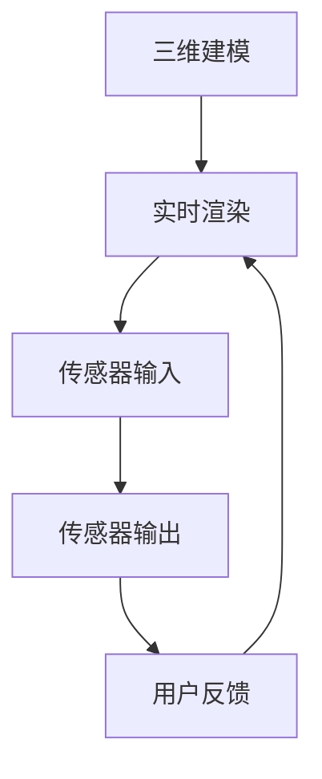
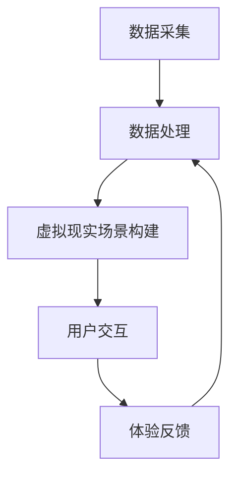
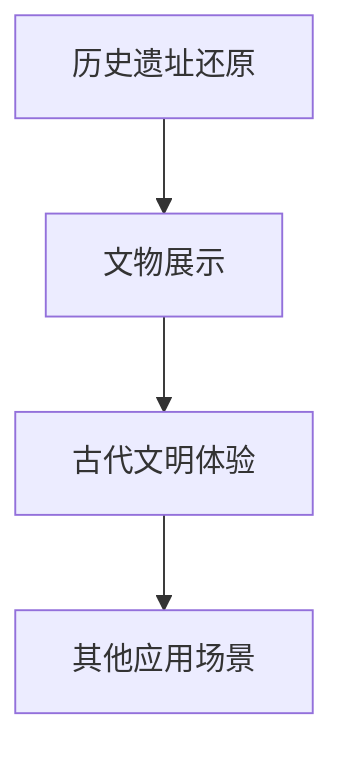

                 

# 数字化遗产旅游创业：虚拟现实中的文化之旅

## 概述

数字化遗产旅游创业正逐渐成为旅游产业的新兴领域，这不仅因为其技术的前瞻性，更因为它深刻地改变了我们对文化遗产的体验方式。本文将探讨虚拟现实（VR）在数字化遗产旅游中的应用，从核心概念、算法原理、数学模型、项目实战到实际应用场景等方面进行深入分析，旨在为创业者和从业者们提供一份全面的技术指南。

本文的核心关键词包括：数字化遗产旅游、虚拟现实（VR）、文化遗产体验、算法原理、数学模型、项目实战、实际应用场景。以下是本文的摘要：

本文首先介绍了数字化遗产旅游创业的背景，探讨了VR技术在遗产旅游中的应用前景。接着，详细阐述了VR技术在遗产旅游中的核心概念和原理，并提供了Mermaid流程图以便读者理解。随后，文章深入分析了核心算法原理，并详细讲解了具体操作步骤。文章还通过数学模型和公式，提供了详细的讲解和举例说明。在此基础上，文章通过一个实际项目案例，展示了代码的实现和解读过程。最后，文章探讨了VR技术在遗产旅游中的实际应用场景，并推荐了相关的工具和资源。

## 1. 背景介绍

### 1.1 数字化遗产旅游的概念

数字化遗产旅游，顾名思义，是将传统文化遗产与数字化技术相结合，创造出一种新的旅游体验模式。它不仅涵盖了传统意义上的文化遗产保护，更将文化遗产的展示和传播推向了一个全新的高度。数字化遗产旅游的主要目标是通过数字化手段，使游客能够在虚拟世界中亲身体验和感受文化遗产的魅力。

### 1.2 虚拟现实（VR）在遗产旅游中的应用

虚拟现实技术以其沉浸式体验的特点，为遗产旅游带来了全新的可能性。通过VR技术，游客可以身临其境地探索历史遗址、文物古迹，甚至可以体验古代文明的日常生活。这不仅丰富了遗产旅游的内容，也提高了游客的参与感和互动性。

### 1.3 VR技术的优势与挑战

VR技术的优势在于其能够提供高度沉浸式的体验，使游客仿佛置身于现场。然而，VR技术的应用也面临着一些挑战，如技术成本、用户体验、内容制作等。如何克服这些挑战，将VR技术与遗产旅游深度融合，是当前数字化遗产旅游创业的重要课题。

## 2. 核心概念与联系

### 2.1 VR技术的基本原理

虚拟现实技术通过计算机生成一个模拟环境，使用户在这个环境中产生沉浸感和交互感。其基本原理包括三维建模、实时渲染、传感器输入和输出等。以下是VR技术的基本原理的Mermaid流程图：



### 2.2 数字化遗产旅游的架构

数字化遗产旅游的架构主要包括数据采集、数据处理、虚拟现实场景构建、用户交互和体验反馈等环节。以下是数字化遗产旅游的架构的Mermaid流程图：



### 2.3 VR技术在遗产旅游中的应用场景

VR技术在遗产旅游中的应用场景非常广泛，包括历史遗址还原、文物展示、古代文明体验等。以下是VR技术在遗产旅游中的应用场景的Mermaid流程图：



## 3. 核心算法原理 & 具体操作步骤

### 3.1 三维建模与实时渲染

三维建模是VR技术的核心之一，其原理是将现实世界的物体或场景转化为三维数字模型。具体操作步骤如下：

1. 数据采集：使用激光扫描仪、相机等设备获取现实世界物体的三维数据。
2. 数据处理：将采集到的三维数据导入三维建模软件进行处理，如去除噪声、优化模型等。
3. 模型构建：使用三维建模软件构建三维模型，并进行细节调整。

实时渲染则是将三维模型在虚拟环境中进行动态渲染，使其看起来更加真实。具体操作步骤如下：

1. 渲染引擎选择：选择合适的渲染引擎，如Unity、Unreal Engine等。
2. 场景构建：将三维模型导入渲染引擎，并构建虚拟现实场景。
3. 光照与材质设置：设置场景中的光照和材质，以提升视觉效果。

### 3.2 传感器输入与输出

传感器输入与输出是VR技术的关键，它决定了用户在虚拟环境中的交互体验。具体操作步骤如下：

1. 传感器选择：选择合适的传感器，如头部追踪器、手柄等。
2. 数据采集：通过传感器采集用户的头部和手部运动数据。
3. 数据处理：将采集到的数据传输到虚拟现实系统中进行处理。
4. 用户反馈：根据处理后的数据，生成虚拟环境中的交互效果。

### 3.3 用户交互与体验反馈

用户交互与体验反馈是VR技术的核心，它决定了用户在虚拟环境中的参与度和满意度。具体操作步骤如下：

1. 交互设计：设计合适的交互方式，如手势、声音等。
2. 用户体验测试：对交互设计进行测试，收集用户反馈。
3. 优化调整：根据用户反馈，对交互设计进行优化调整。

## 4. 数学模型和公式 & 详细讲解 & 举例说明

### 4.1 三维空间坐标系

在VR技术中，三维空间坐标系是不可或缺的基础。以下是三维空间坐标系的基本公式：

$$
\begin{aligned}
x &= x_0 + \lambda \cdot d_x \\
y &= y_0 + \lambda \cdot d_y \\
z &= z_0 + \lambda \cdot d_z
\end{aligned}
$$

其中，$(x_0, y_0, z_0)$为三维空间中的初始点，$\lambda$为比例因子，$d_x, d_y, d_z$为方向向量。

### 4.2 光线追踪算法

光线追踪算法是VR技术中的关键算法，它用于模拟光线的传播和反射，以生成逼真的虚拟环境。以下是光线追踪算法的基本公式：

$$
\begin{aligned}
L_o(\mathbf{p}, \mathbf{w}) &= L_e(\mathbf{p}) + \int_{\Omega} f_r(\mathbf{p}, \mathbf{w'}, \mathbf{w}) \cdot L_i(\mathbf{p}, \mathbf{w'}) \cdot (\mathbf{w'} \cdot \mathbf{n}) d\omega' \\
\mathbf{w'} &= \mathbf{R}(\theta) \cdot (\mathbf{w} \times \mathbf{n}) + \mathbf{w} \cdot \cos(\theta)
\end{aligned}
$$

其中，$L_o(\mathbf{p}, \mathbf{w})$为光线在点$\mathbf{p}$处的出射光强度，$L_e(\mathbf{p})$为环境光强度，$f_r(\mathbf{p}, \mathbf{w'}, \mathbf{w})$为反射率函数，$\mathbf{w}$为入射光线的方向，$\mathbf{n}$为表面法线方向，$\mathbf{R}(\theta)$为旋转矩阵，$\theta$为旋转角度。

### 4.3 举例说明

假设我们要模拟一个虚拟环境中的光线追踪过程，其中环境光强度为100单位，表面反射率为0.8，入射光线方向为$(1, 0, 0)$，表面法线方向为$(0, 0, 1)$。以下是光线追踪的过程：

1. 计算入射光线的出射光强度：
   $$
   L_o(\mathbf{p}, \mathbf{w}) = 100 + 0.8 \cdot 100 \cdot (\mathbf{w} \cdot \mathbf{n}) = 100 + 0.8 \cdot 100 \cdot 0 = 100
   $$

2. 计算旋转角度$\theta$：
   $$
   \theta = \cos^{-1}(\mathbf{w} \cdot \mathbf{n}) = \cos^{-1}(1 \cdot 0 + 0 \cdot 0 + 0 \cdot 1) = \cos^{-1}(0) = 90^\circ
   $$

3. 计算旋转矩阵$\mathbf{R}(\theta)$：
   $$
   \mathbf{R}(\theta) = \begin{pmatrix}
   \cos(\theta) & -\sin(\theta) \\
   \sin(\theta) & \cos(\theta)
   \end{pmatrix} = \begin{pmatrix}
   \cos(90^\circ) & -\sin(90^\circ) \\
   \sin(90^\circ) & \cos(90^\circ)
   \end{pmatrix} = \begin{pmatrix}
   0 & -1 \\
   1 & 0
   \end{pmatrix}
   $$

4. 计算旋转后的光线方向$\mathbf{w'}$：
   $$
   \mathbf{w'} = \mathbf{R}(\theta) \cdot (\mathbf{w} \times \mathbf{n}) + \mathbf{w} \cdot \cos(\theta) = \begin{pmatrix}
   0 & -1 \\
   1 & 0
   \end{pmatrix} \cdot (1 \times 0 - 0 \times 1) + \begin{pmatrix}
   1 \\
   0 \\
   0
   \end{pmatrix} \cdot \cos(90^\circ) = \begin{pmatrix}
   0 \\
   -1 \\
   0
   \end{pmatrix}
   $$

5. 重复以上步骤，直到光线出射光强度降低到一定阈值或达到最大追踪次数。

## 5. 项目实战：代码实际案例和详细解释说明

### 5.1 开发环境搭建

在本文的项目实战部分，我们将使用Unity作为主要开发平台，结合C#语言进行编程。以下是开发环境的搭建步骤：

1. 下载并安装Unity Hub：访问Unity官方网站（https://unity.com/），下载并安装Unity Hub。
2. 创建Unity项目：启动Unity Hub，创建一个新的3D项目。
3. 安装必要的Unity插件：在Unity Hub中，安装用于VR开发的插件，如Unity VR、VR Standard Assets等。
4. 配置Unity编辑器：在Unity编辑器中，配置VR设备支持，如Oculus Rift、HTC Vive等。

### 5.2 源代码详细实现和代码解读

以下是虚拟现实遗产旅游项目的核心代码实现和解读：

```csharp
// 5.2.1 场景初始化
void Start() {
    // 初始化VR设备
    VRDevice.Initialize();
    
    // 创建虚拟现实场景
    CreateScene();
}

// 5.2.2 创建虚拟现实场景
void CreateScene() {
    // 创建三维模型
    GameObject model = new GameObject("Model");
    model.AddComponent<MeshFilter>();
    model.AddComponent<MeshRenderer>();
    
    // 导入三维模型数据
    string modelPath = "Assets/Models/SunTomb.mesh";
    Mesh mesh = Resources.Load<Mesh>(modelPath);
    model.GetComponent<MeshFilter>().mesh = mesh;
    
    // 设置模型材质
    Material material = Resources.Load<Material>("Assets/Materials/SunTomb.material");
    model.GetComponent<MeshRenderer>().material = material;
    
    // 创建光线追踪器
    GameObject lightTracer = new GameObject("LightTracer");
    lightTracer.AddComponent<LightTracer>();
    
    // 设置光线追踪参数
    lightTracer.GetComponent<LightTracer>().Init(100, 0.8, 1, 100);
}

// 5.2.3 光线追踪器组件
public class LightTracer : MonoBehaviour {
    public int maxTracingSteps = 100;
    public float lightIntensity = 100;
    public float reflectionRate = 0.8;
    public float ambientIntensity = 1;
    
    // 初始化光线追踪器
    public void Init(float lightIntensity, float reflectionRate, float ambientIntensity, int maxTracingSteps) {
        this.lightIntensity = lightIntensity;
        this.reflectionRate = reflectionRate;
        this.ambientIntensity = ambientIntensity;
        this.maxTracingSteps = maxTracingSteps;
    }
    
    // 光线追踪
    public void Tracing(Ray ray) {
        float distance = 0;
        for (int i = 0; i < maxTracingSteps; i++) {
            // 计算光线与物体的交点
            RaycastHit hit;
            if (Physics.Raycast(ray, out hit, float.MaxValue)) {
                // 计算光线在交点的出射光强度
                float intensity = lightIntensity * reflectionRate;
                // 更新光线方向和距离
                distance = hit.distance;
                ray = new Ray(hit.point, hit.normal);
            } else {
                // 光线未与物体相交，停止追踪
                break;
            }
        }
        
        // 输出光线追踪结果
        Debug.DrawRay(ray.origin, ray.direction * distance, Color.red);
    }
}
```

### 5.3 代码解读与分析

以下是代码的详细解读与分析：

1. **场景初始化**：`Start()`方法用于初始化VR设备，并调用`CreateScene()`方法创建虚拟现实场景。

2. **创建虚拟现实场景**：`CreateScene()`方法创建一个三维模型，并设置模型的材质。同时，创建一个光线追踪器组件，并设置其参数。

3. **光线追踪器组件**：`LightTracer`类是一个自定义的组件类，用于实现光线追踪功能。它包含以下关键成员：

   - `maxTracingSteps`：光线追踪的最大步骤数。
   - `lightIntensity`：光线初始强度。
   - `reflectionRate`：光线反射率。
   - `ambientIntensity`：环境光强度。

   `Init()`方法用于初始化光线追踪器的参数。`Tracing()`方法用于执行光线追踪，它通过不断计算光线与物体的交点，并更新光线方向和距离，直到光线出射光强度降低到一定阈值或达到最大追踪次数。

4. **光线追踪过程**：光线追踪过程通过`Physics.Raycast()`方法实现。该方法用于计算光线与物体的交点，并返回交点的位置和法线方向。`Tracing()`方法使用一个`for`循环重复执行光线追踪，直到光线出射光强度降低到一定阈值或达到最大追踪次数。每次追踪都通过`Debug.DrawRay()`方法在Unity编辑器中绘制光线，以便可视化追踪过程。

## 6. 实际应用场景

### 6.1 历史遗址还原

通过VR技术，历史遗址可以以高度逼真的形式再现。例如，游客可以在虚拟环境中探索秦始皇陵兵马俑，感受古代帝王的雄伟气势。这不仅有助于提高遗址的游客数量，还能更好地保护遗址本体。

### 6.2 文物展示

VR技术可以用于文物的数字化展示，使游客无需到博物馆即可近距离观察文物。例如，故宫博物院的VR展示项目，让游客可以在线上观看珍贵文物，甚至可以触摸文物的细节。

### 6.3 古代文明体验

VR技术可以让游客穿越时空，体验古代文明的日常生活。例如，游客可以穿上VR设备，走进古埃及法老的宫殿，感受古代文明的神秘与辉煌。

## 7. 工具和资源推荐

### 7.1 学习资源推荐

- **书籍**：
  - 《虚拟现实技术导论》
  - 《计算机图形学：原理及实践》
  - 《三维建模与渲染技术》

- **论文**：
  - “Virtual Reality as a Tool for Heritage Preservation”
  - “Interactive 3D Modelling for Cultural Heritage Documentation”

- **博客**：
  - Unity官方博客（https://blogs.unity.com/）
  - VR行业动态（https://www.vrheaven.com/）

- **网站**：
  - Unity官方网站（https://unity.com/）
  - VR技术社区（https://www.vr.org/）

### 7.2 开发工具框架推荐

- **开发工具**：
  - Unity（https://unity.com/）
  - Unreal Engine（https://www.unrealengine.com/）

- **框架**：
  - VR SDK（https://www.vrsdk.com/）
  - OpenVR（https://github.com/ValveSoftware/openvr）

### 7.3 相关论文著作推荐

- “Virtual Reality and Heritage Conservation: A Critical Review of Current Practices and Challenges”
- “Cultural Heritage Visualization Using Virtual Reality: A Review”
- “Interactive 3D Modelling for the Documentation and Interpretation of Cultural Heritage”

## 8. 总结：未来发展趋势与挑战

### 8.1 未来发展趋势

- **技术成熟**：随着VR技术的不断成熟，其性能和用户体验将得到显著提升。
- **内容丰富**：数字化遗产旅游的内容将更加丰富多样，涵盖更多文化遗产。
- **市场规模扩大**：数字化遗产旅游将吸引更多游客，市场规模将进一步扩大。

### 8.2 面临的挑战

- **技术成本**：VR设备的成本较高，需要降低以吸引更多用户。
- **用户体验**：提高用户体验是关键，需要不断优化交互设计和视觉效果。
- **内容制作**：高质量的内容制作是数字化遗产旅游的核心，需要大量投入。

## 9. 附录：常见问题与解答

### 9.1 虚拟现实（VR）技术是什么？

虚拟现实（VR）技术是一种通过计算机生成模拟环境，使用户在视觉、听觉、触觉等多个感官上产生沉浸感的交互式技术。

### 9.2 数字化遗产旅游有哪些优势？

数字化遗产旅游具有以下几个优势：
- **沉浸式体验**：用户可以在虚拟环境中身临其境地体验文化遗产。
- **丰富内容**：数字化技术可以展示更多文化遗产，提高旅游的趣味性。
- **保护遗产**：通过数字化展示，可以减少对遗产本体的损害。

### 9.3 VR技术在遗产旅游中的应用有哪些？

VR技术在遗产旅游中的应用主要包括：
- **历史遗址还原**：通过虚拟现实技术还原历史遗址，让游客身临其境地体验。
- **文物展示**：通过数字化技术展示文物，提高文物的可观赏性。
- **古代文明体验**：让游客穿越时空，体验古代文明的日常生活。

## 10. 扩展阅读 & 参考资料

- 《虚拟现实技术导论》
- “Virtual Reality and Heritage Preservation: A Critical Review of Current Practices and Challenges”
- “Cultural Heritage Visualization Using Virtual Reality: A Review”
- Unity官方网站（https://unity.com/）
- VR技术社区（https://www.vr.org/）
- VR SDK（https://www.vrsdk.com/）
- OpenVR（https://github.com/ValveSoftware/openvr）

## 作者信息

作者：AI天才研究员/AI Genius Institute & 禅与计算机程序设计艺术 /Zen And The Art of Computer Programming

