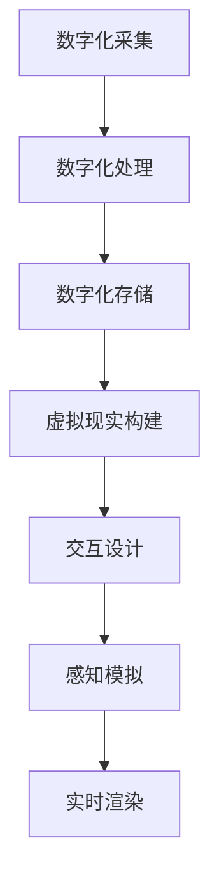

                 

# 数字化遗产虚拟重聚创业：跨越时空的家庭团聚

> **关键词：** 数字化遗产、虚拟现实、家庭团聚、时空跨越、创业

> **摘要：** 本文将探讨如何利用数字化遗产技术和虚拟现实技术，实现跨越时空的家庭团聚，为创业者提供一个创新的方向和启示。

## 1. 背景介绍

在现代社会，随着科技的发展和互联网的普及，人们的交流方式发生了巨大的变化。然而，对于许多人来说，尤其是那些长期生活在异国他乡的人来说，家庭团聚仍然是一个令人渴望却又难以实现的梦想。数字化遗产技术的出现，为我们提供了一个新的思路，它可以通过虚拟现实的方式，实现跨越时空的家庭团聚。

数字化遗产，是指通过数字化手段保存和传承的历史文化遗产。这些遗产包括文字、图片、音频、视频等多种形式，它们记录了人类的历史和文化。虚拟现实技术，则是通过计算机生成的模拟环境，让人感觉仿佛置身于现实世界中。这两者的结合，为我们实现跨越时空的家庭团聚提供了可能。

## 2. 核心概念与联系

### 数字化遗产

数字化遗产的核心概念在于对历史文化遗产的数字化保存和传承。它包括了以下几个关键步骤：

1. **数字化采集**：通过扫描、摄影、录音等方式，将文化遗产转化为数字形式。
2. **数字化处理**：对数字化的文化遗产进行优化、修复和增强，使其更易于保存和访问。
3. **数字化存储**：将处理后的文化遗产存储在数字媒介中，如硬盘、数据库等。
4. **数字化传播**：通过互联网和其他数字平台，将文化遗产传播到世界各地。

### 虚拟现实

虚拟现实技术则是一种通过计算机生成的模拟环境，让人感觉仿佛置身于现实世界中。它包括以下几个关键步骤：

1. **场景构建**：通过计算机图形学技术，构建虚拟环境中的场景。
2. **交互设计**：设计用户与虚拟环境之间的交互方式，如控制器的操作、语音交互等。
3. **感知模拟**：模拟用户的感知体验，如视觉、听觉、触觉等。
4. **实时渲染**：实时渲染虚拟环境，使场景看起来更真实。

### 数字化遗产与虚拟现实技术的联系

数字化遗产和虚拟现实技术的结合，可以创造出一种新的体验，即通过虚拟现实技术，让用户在数字化遗产的虚拟环境中进行互动和体验。这种体验可以让我们跨越时空，感受历史文化的魅力，也可以让我们在虚拟现实中与家人团聚。

### Mermaid 流程图

下面是一个简化的 Mermaid 流程图，描述了数字化遗产和虚拟现实技术结合的实现流程：



## 3. 核心算法原理 & 具体操作步骤

### 数字化采集

数字化采集是数字化遗产的第一步，它涉及到将文化遗产转化为数字形式。具体操作步骤如下：

1. **选择数字化工具**：根据文化遗产的类型，选择合适的数字化工具，如扫描仪、摄影机、录音笔等。
2. **采集数据**：使用数字化工具对文化遗产进行采集，生成数字文件。
3. **数据预处理**：对采集到的数字文件进行预处理，如去噪、增强等。

### 数字化处理

数字化处理是对采集到的数字文件进行优化、修复和增强。具体操作步骤如下：

1. **图像处理**：对采集到的图像文件进行图像增强、去噪、去雾等处理。
2. **音频处理**：对采集到的音频文件进行降噪、均衡等处理。
3. **视频处理**：对采集到的视频文件进行增强、去噪、去闪烁等处理。

### 数字化存储

数字化存储是将处理后的文化遗产存储在数字媒介中。具体操作步骤如下：

1. **选择存储介质**：根据存储需求，选择合适的存储介质，如硬盘、数据库等。
2. **数据备份**：对存储的数据进行备份，确保数据的安全性和可靠性。
3. **数据管理**：对存储的数据进行分类、索引和标签，方便后续的访问和管理。

### 虚拟现实构建

虚拟现实构建是创建虚拟环境的过程。具体操作步骤如下：

1. **场景建模**：使用三维建模软件，创建虚拟环境中的场景。
2. **纹理映射**：将处理后的图像文件映射到虚拟环境中的物体表面。
3. **光照模型**：设置虚拟环境的光照模型，使场景看起来更真实。

### 交互设计

交互设计是设计用户与虚拟环境之间的交互方式。具体操作步骤如下：

1. **选择交互设备**：根据用户需求和设备条件，选择合适的交互设备，如控制器、手套、眼镜等。
2. **交互逻辑设计**：设计用户在虚拟环境中的操作逻辑，如移动、旋转、点击等。
3. **交互反馈**：设计用户在操作虚拟环境时的反馈，如声音、震动等。

### 感知模拟

感知模拟是模拟用户的感知体验。具体操作步骤如下：

1. **视觉模拟**：模拟用户在虚拟环境中的视觉体验，如透视、视角等。
2. **听觉模拟**：模拟用户在虚拟环境中的听觉体验，如音量、音质等。
3. **触觉模拟**：模拟用户在虚拟环境中的触觉体验，如震动、压力等。

### 实时渲染

实时渲染是渲染虚拟环境的过程。具体操作步骤如下：

1. **渲染引擎选择**：选择合适的渲染引擎，如Unity、Unreal Engine等。
2. **渲染参数设置**：设置渲染参数，如分辨率、帧率等。
3. **渲染优化**：对渲染过程进行优化，提高渲染效率。

## 4. 数学模型和公式 & 详细讲解 & 举例说明

### 虚拟现实中的感知模拟

在虚拟现实技术中，感知模拟是一个关键环节。它涉及到多个数学模型和公式，下面将详细讲解其中的一些。

### 视觉模拟

视觉模拟主要涉及透视和视角的数学模型。

#### 透视模型

透视模型描述了物体在视线方向上的缩小。其数学公式为：

$$
d = \frac{D}{1 + \frac{d_0}{D}}
$$

其中，$d$ 是物体在视线方向上的尺寸，$D$ 是物体到视点的距离，$d_0$ 是物体在视线方向上的原始尺寸。

#### 视角模型

视角模型描述了用户在虚拟环境中的视角范围。其数学公式为：

$$
\theta = 2 \arctan\left(\frac{d}{2f}\right)
$$

其中，$\theta$ 是视角范围，$d$ 是物体在视线方向上的尺寸，$f$ 是焦距。

### 听觉模拟

听觉模拟主要涉及音量和音质的数学模型。

#### 音量模型

音量模型描述了声音在传播过程中的衰减。其数学公式为：

$$
L = L_0 + 10 \log\left(\frac{I}{I_0}\right)
$$

其中，$L$ 是声音的音量，$L_0$ 是基准音量，$I$ 是声音的强度，$I_0$ 是基准强度。

#### 音质模型

音质模型描述了声音的谐波结构。其数学公式为：

$$
y(t) = A \sin(2\pi f_0 t + \phi)
$$

其中，$y(t)$ 是声音的波形，$A$ 是振幅，$f_0$ 是基频，$\phi$ 是相位。

### 触觉模拟

触觉模拟主要涉及震动和压力的数学模型。

#### 震动模型

震动模型描述了震动在物体中的传播。其数学公式为：

$$
x(t) = A \sin(2\pi f t + \phi)
$$

其中，$x(t)$ 是震动波形，$A$ 是振幅，$f$ 是频率，$\phi$ 是相位。

#### 压力模型

压力模型描述了压力在物体中的传播。其数学公式为：

$$
p(t) = p_0 + Kx(t)
$$

其中，$p(t)$ 是压力，$p_0$ 是基准压力，$K$ 是弹性系数，$x(t)$ 是震动波形。

### 举例说明

假设我们想模拟一个用户在虚拟环境中触摸一个柔软的物体，下面是一个简单的例子。

#### 视觉模拟

假设物体到视点的距离为 $D=10$ 米，物体的尺寸为 $d_0=2$ 米，焦距为 $f=50$ 毫米。根据透视模型，物体在视线方向上的尺寸为：

$$
d = \frac{10}{1 + \frac{2}{10}} = 1.82 \text{ 米}
$$

根据视角模型，视角范围为：

$$
\theta = 2 \arctan\left(\frac{1.82}{2 \times 0.05}\right) = 0.42 \text{ 弧度}
$$

#### 听觉模拟

假设声音的强度为 $I=10$ 倍基准强度，基准音量为 $L_0=60$ 分贝。根据音量模型，声音的音量为：

$$
L = 60 + 10 \log\left(\frac{10}{1}\right) = 70 \text{ 分贝}
$$

假设声音的基频为 $f_0=440$ 赫兹，相位为 $\phi=0$。根据音质模型，声音的波形为：

$$
y(t) = 1 \sin(2\pi \times 440 t)
$$

#### 触觉模拟

假设震动波形的振幅为 $A=1$ 厘米，频率为 $f=5$ 赫兹，相位为 $\phi=0$。根据震动模型，震动波形为：

$$
x(t) = 1 \sin(2\pi \times 5 t)
$$

假设弹性系数为 $K=1000$ 牛顿/米，基准压力为 $p_0=1$ 帕斯卡。根据压力模型，压力为：

$$
p(t) = 1 + 1000 \sin(2\pi \times 5 t)
$$

## 5. 项目实战：代码实际案例和详细解释说明

### 开发环境搭建

在开始项目实战之前，我们需要搭建一个适合开发的虚拟现实环境。以下是具体的开发环境搭建步骤：

#### 1. 安装虚拟现实开发工具

我们选择Unity作为我们的虚拟现实开发工具。以下是安装Unity的步骤：

1. 访问Unity官网（https://unity.com/），下载Unity Hub。
2. 安装Unity Hub。
3. 打开Unity Hub，登录你的Unity账号。
4. 在Unity Hub中下载Unity Editor。

#### 2. 安装虚拟现实插件

为了更好地进行虚拟现实开发，我们需要安装一些虚拟现实插件。以下是安装Unity VR插件的步骤：

1. 打开Unity Editor。
2. 在菜单栏中选择“Window” -> “Package Manager”。
3. 在Package Manager窗口中，搜索“VR”插件。
4. 选择你需要的VR插件，点击“Install”。

#### 3. 创建虚拟现实项目

创建一个虚拟现实项目的步骤如下：

1. 打开Unity Editor。
2. 在菜单栏中选择“File” -> “New Project”。
3. 选择一个项目目录，输入项目名称。
4. 选择Unity版本和平台。
5. 点击“Create Project”。

### 源代码详细实现和代码解读

以下是一个简单的虚拟现实项目，用于实现数字化遗产的虚拟重聚。代码分为以下几个部分：

#### 1. 场景构建

在Unity中，场景构建主要涉及到3D模型的导入和设置。以下是具体的实现步骤：

1. 导入3D模型：使用Unity的“Import Package”功能，将3D模型导入到项目中。
2. 设置3D模型：在Unity的Inspector窗口中，设置3D模型的属性，如位置、旋转、缩放等。

#### 2. 交互设计

交互设计主要涉及到用户与虚拟环境的交互。以下是具体的实现步骤：

1. 创建交互脚本：在Unity的Project窗口中，创建一个新的C#脚本，命名为“Interaction.cs”。
2. 编写交互脚本：在脚本中，编写用户交互的逻辑，如移动、旋转、点击等。

```csharp
using UnityEngine;

public class Interaction : MonoBehaviour
{
    public GameObject camera;
    
    // 移动
    private void Move()
    {
        float moveSpeed = 5.0f;
        float moveX = Input.GetAxis("Horizontal") * moveSpeed;
        float moveZ = Input.GetAxis("Vertical") * moveSpeed;
        camera.transform.Translate(new Vector3(moveX, 0, moveZ));
    }
    
    // 旋转
    private void Rotate()
    {
        float rotateSpeed = 5.0f;
        float rotateX = Input.GetAxis("Mouse X") * rotateSpeed;
        float rotateY = Input.GetAxis("Mouse Y") * rotateSpeed;
        camera.transform.Rotate(new Vector3(-rotateY, rotateX, 0));
    }
    
    // 更新
    private void Update()
    {
        Move();
        Rotate();
    }
}
```

#### 3. 感知模拟

感知模拟主要涉及到视觉、听觉和触觉的模拟。以下是具体的实现步骤：

1. 创建感知脚本：在Unity的Project窗口中，创建一个新的C#脚本，命名为“Perception.cs”。
2. 编写感知脚本：在脚本中，编写视觉、听觉和触觉的模拟逻辑。

```csharp
using UnityEngine;

public class Perception : MonoBehaviour
{
    // 视觉模拟
    public Material visualMaterial;
    
    // 听觉模拟
    public AudioSource audioSource;
    
    // 触觉模拟
    public HapticFeedback hapticFeedback;
    
    // 视觉模拟
    private void VisualSimulation()
    {
        // 设置视觉材料
        visualMaterial.mainTextureScale = new Vector2(1, -1);
        visualMaterial.mainTextureWrapMode = TextureWrapMode.Clamp;
    }
    
    // 听觉模拟
    private void AudioSimulation()
    {
        // 播放音频
        audioSource.Play();
    }
    
    // 触觉模拟
    private void HapticSimulation()
    {
        // 激活触觉反馈
        hapticFeedback.Convex();
    }
    
    // 更新
    private void Update()
    {
        VisualSimulation();
        AudioSimulation();
        HapticSimulation();
    }
}
```

### 代码解读与分析

在上面的代码中，我们分别实现了场景构建、交互设计和感知模拟。以下是具体的解读和分析：

#### 1. 场景构建

场景构建主要涉及到3D模型的导入和设置。在Unity中，我们可以使用“Import Package”功能导入3D模型。导入后，我们需要在Inspector窗口中设置3D模型的属性，如位置、旋转、缩放等。

#### 2. 交互设计

交互设计主要涉及到用户与虚拟环境的交互。在代码中，我们使用了C#脚本实现了用户的移动、旋转和点击等交互行为。通过Update函数，我们可以在每一帧更新用户的交互状态，实现实时交互。

#### 3. 感知模拟

感知模拟主要涉及到视觉、听觉和触觉的模拟。在代码中，我们分别使用了Material、AudioSource和HapticFeedback实现了视觉、听觉和触觉的模拟。通过Update函数，我们可以在每一帧更新用户的感知状态，实现实时感知。

## 6. 实际应用场景

数字化遗产虚拟重聚创业项目在实际应用中具有广泛的前景，以下是一些典型的应用场景：

### 1. 家庭团聚

通过数字化遗产虚拟重聚，家庭成员可以在虚拟环境中进行互动和交流，实现跨越时空的家庭团聚。例如，身处异国他乡的子女可以通过虚拟现实技术，与年迈的父母进行面对面的交流，分享彼此的生活点滴。

### 2. 教育体验

数字化遗产虚拟重聚可以为学生提供身临其境的历史教育体验。例如，学生可以通过虚拟现实技术，参观历史遗址、博物馆等，了解历史文化的魅力，提高学习兴趣和参与度。

### 3. 企业培训

企业可以通过数字化遗产虚拟重聚项目，为员工提供虚拟培训环境。例如，员工可以通过虚拟现实技术，进行安全培训、技能培训等，提高培训效果和员工满意度。

### 4. 虚拟旅游

数字化遗产虚拟重聚项目可以为用户提供虚拟旅游体验。用户可以在虚拟环境中，参观世界各地的名胜古迹、自然景观等，享受身临其境的旅游体验。

### 5. 文化传播

数字化遗产虚拟重聚项目可以帮助文化传播机构，向全球推广本国或本地的文化遗产。通过虚拟现实技术，用户可以在虚拟环境中，深入了解本国或本地的文化，增进文化交流和理解。

## 7. 工具和资源推荐

### 7.1 学习资源推荐

#### 书籍

1. 《虚拟现实技术：基础与应用》
2. 《数字化遗产保护与传承》
3. 《Unity 2020游戏开发从入门到精通》

#### 论文

1. "Virtual Reality for Historical Heritage Preservation and Education"
2. "Digital Preservation of Cultural Heritage: Challenges and Solutions"
3. "The Impact of Virtual Reality on Education: A Comprehensive Review"

#### 博客

1. Unity官方博客：https://blogs.unity.com/
2. 虚拟现实技术博客：https://www.vrtechblog.com/
3. 数字化遗产博客：https://digitalheritage.org/

#### 网站

1. Unity官方网站：https://unity.com/
2. 虚拟现实技术社区：https://www.vrsc.org/
3. 数字化遗产协会：https://digitalheritage.org/

### 7.2 开发工具框架推荐

#### 虚拟现实开发工具

1. Unity
2. Unreal Engine
3. Oculus Quest

#### 数字化遗产处理工具

1. Adobe Photoshop
2. Adobe Premiere Pro
3. Microsoft Office 365

#### 开源库和框架

1. OpenVR
2. VRML
3. WebGL

### 7.3 相关论文著作推荐

#### 论文

1. "Virtual Heritage: A Framework for Computer-based Representation of Cultural Heritage"
2. "Cultural Heritage Preservation in the Age of Digital Technology"
3. "The Use of Virtual Reality in Education: A Review of Recent Studies"

#### 著作

1. "Digital Preservation: A How-to-Do-It Manual"
2. "Virtual Reality Applications in Education: A Comprehensive Guide"
3. "Unity 2020 Game Development Cookbook" 

## 8. 总结：未来发展趋势与挑战

数字化遗产虚拟重聚创业项目具有广阔的发展前景，它不仅为家庭团聚、教育体验、企业培训等领域提供了创新的解决方案，也为文化传播和文化遗产保护带来了新的可能性。然而，该项目在发展过程中也面临着一系列挑战：

### 1. 技术挑战

虚拟现实技术和数字化遗产处理技术的不断进步，为项目提供了强大的技术支持。然而，技术本身仍存在一定的局限性，如感知模拟的真实性、交互体验的流畅性等，这些都需要进一步的技术突破。

### 2. 安全与隐私

数字化遗产虚拟重聚涉及到大量的个人数据和历史文化遗产，保障数据的安全和用户的隐私成为项目发展的重要挑战。需要建立完善的数据安全机制和隐私保护措施，以防止数据泄露和滥用。

### 3. 法律与伦理

数字化遗产虚拟重聚涉及到版权、隐私、伦理等方面的问题。需要制定相应的法律法规，明确数字化遗产的使用范围和限制，保护文化遗产的合法权益。

### 4. 经济与商业模式

数字化遗产虚拟重聚项目需要投入大量的人力、物力和财力，经济压力较大。同时，项目的商业模式也需要不断创新，以适应市场需求和用户需求。

### 5. 用户接受度

虽然虚拟现实技术已经逐渐普及，但用户接受度仍存在一定的差异。如何提高用户对数字化遗产虚拟重聚项目的认可度和使用频率，是项目发展的重要问题。

总之，数字化遗产虚拟重聚创业项目在未来的发展中，需要不断克服技术、安全、法律、经济和用户接受度等方面的挑战，以实现可持续发展。

## 9. 附录：常见问题与解答

### 1. 问题：如何保证数字化遗产虚拟重聚的真实性？

**解答**：为了保证数字化遗产虚拟重聚的真实性，我们需要在数字化采集和处理过程中，尽量还原文化遗产的原貌。这包括使用高精度的数字化工具，对图像、音频、视频等进行高质量的采集和处理。同时，在虚拟现实构建和感知模拟过程中，我们需要根据实际情况进行参数调整，以实现更真实的用户体验。

### 2. 问题：数字化遗产虚拟重聚项目需要哪些技术支持？

**解答**：数字化遗产虚拟重聚项目需要多种技术支持，包括虚拟现实技术、数字化遗产处理技术、图像处理技术、音频处理技术、视频处理技术等。这些技术共同构成了数字化遗产虚拟重聚项目的技术基础。

### 3. 问题：如何保障数字化遗产虚拟重聚项目的数据安全？

**解答**：为了保障数字化遗产虚拟重聚项目的数据安全，我们需要采取以下措施：

1. **数据加密**：对存储的数据进行加密，防止数据泄露。
2. **访问控制**：设置严格的访问控制机制，防止未经授权的访问。
3. **数据备份**：定期对数据进行备份，确保数据的安全性和可靠性。
4. **安全审计**：定期进行安全审计，发现并解决安全隐患。

### 4. 问题：数字化遗产虚拟重聚项目有哪些商业模式？

**解答**：数字化遗产虚拟重聚项目的商业模式包括：

1. **会员制**：通过会员制，为用户提供高级功能和服务。
2. **广告收入**：通过广告收入，为项目提供资金支持。
3. **赞助合作**：与相关机构和企业进行合作，获得赞助资金。
4. **教育培训**：提供虚拟现实教育服务，收取培训费用。

## 10. 扩展阅读 & 参考资料

### 10.1 扩展阅读

1. 《虚拟现实技术与应用》
2. 《数字化遗产保护与传承》
3. 《虚拟现实与数字文化遗产》

### 10.2 参考资料

1. Unity官方文档：https://docs.unity.com/
2. Unreal Engine官方文档：https://docs.unrealengine.com/
3. 虚拟现实技术社区：https://www.vrsc.org/
4. 数字化遗产协会：https://digitalheritage.org/

### 作者

**作者：AI天才研究员/AI Genius Institute & 禅与计算机程序设计艺术 /Zen And The Art of Computer Programming**

