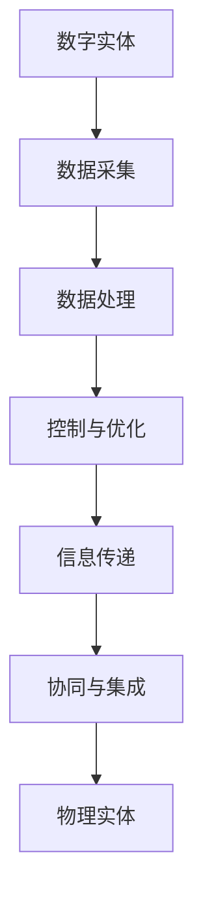

                 

# 数字实体与物理实体的自动化前景

## 关键词
- 数字实体
- 物理实体
- 自动化
- 未来趋势
- 技术挑战
- 应用场景

## 摘要

本文将探讨数字实体与物理实体的自动化前景。随着技术的飞速发展，数字实体与物理实体之间的界限日益模糊，两者的结合推动了自动化进程的加速。本文首先介绍了数字实体和物理实体的定义及其发展历程，然后分析了自动化技术的核心原理和关键环节。接下来，本文从应用场景、技术挑战和未来发展趋势三个方面阐述了数字实体与物理实体的自动化前景。最后，本文总结了相关工具和资源，为读者提供了进一步学习和实践的方向。通过本文的阅读，读者将了解到数字实体与物理实体自动化的重要性和潜在价值。

## 1. 背景介绍

### 数字实体的发展历程

数字实体是指以数字形式存在、传输和处理的实体。从最早的计算机硬件到软件程序，再到现代的互联网、大数据和人工智能，数字实体经历了漫长的发展历程。

20世纪50年代，计算机问世，标志着数字实体的发展开始。随着硬件技术的进步，计算机处理能力和存储容量迅速提升。70年代，软件行业兴起，程序员开始编写各种应用程序，数字实体的应用领域不断拓展。90年代，互联网的出现使得数字实体能够跨越地域界限进行传输和共享，形成了全球范围内的数字生态系统。

进入21世纪，大数据、云计算和人工智能等技术的出现，使得数字实体在数据处理和分析方面取得了突破性进展。大数据技术提供了海量数据的存储和处理能力，云计算技术实现了资源的弹性分配和高效利用，人工智能技术则赋予了数字实体自主学习和决策的能力。

### 物理实体的发展历程

物理实体是指我们日常生活中所接触到的有形物体，如机器、设备和基础设施。自古以来，人类就一直在利用物理实体进行生产和生活。从石器时代到工业革命，人类通过不断改进工具和技术，提高了物理实体的效率和性能。

工业革命时期，蒸汽机、机械和工厂的兴起，极大地推动了物理实体的发展。20世纪末，电子技术和信息技术的发展，使得物理实体逐渐具备了智能化和自动化能力。例如，自动化生产线、智能设备和物联网技术的应用，使得物理实体能够实现高效、精确和自适应的生产和运作。

进入21世纪，人工智能、物联网和大数据等技术的进一步发展，使得物理实体与数字实体之间的融合更加紧密。物理实体开始具备感知、决策和执行能力，实现了从传统的机械化生产向智能化生产的转变。

### 数字实体与物理实体的融合

数字实体与物理实体的融合，是当前技术发展的一个重要趋势。这种融合不仅体现在技术层面上，还体现在应用层面上。一方面，数字实体通过传感器、通信和控制系统，可以实时获取物理实体的状态信息，对其进行监控和优化。另一方面，物理实体通过数字化的方式，可以实现更高效、更智能的生产和运作。

例如，在智能制造领域，数字实体与物理实体的融合使得生产过程更加精准、高效。通过物联网技术和大数据分析，生产设备可以实时感知生产线的状态，对生产过程进行实时调整。同时，智能算法可以对生产数据进行分析，预测潜在的问题和瓶颈，为生产优化提供决策支持。

在智能交通领域，数字实体与物理实体的融合使得交通管理系统更加智能、高效。通过车辆传感器和通信系统，交通管理部门可以实时获取交通流量信息，对交通信号进行智能调整，优化交通运行效率。同时，智能交通系统还可以通过大数据分析，预测交通发展趋势，为交通规划和设计提供科学依据。

总之，数字实体与物理实体的融合，不仅提高了物理实体的效率和质量，还为新的应用场景和商业模式创造了可能性。随着技术的不断进步，数字实体与物理实体的融合将继续深化，推动自动化进程的加速。

## 2. 核心概念与联系

### 数字实体

数字实体是指在数字世界中以数字形式存在的实体，如数据、信息、算法等。数字实体具有以下核心特点：

1. **数字化表示**：数字实体以二进制形式存在，可以通过计算机进行处理和传输。
2. **可编程性**：数字实体可以按照一定的编程规则进行操作，具有自主学习和决策能力。
3. **灵活性**：数字实体可以通过编程和算法进行快速修改和优化，以适应不同的应用场景。
4. **高效性**：数字实体在处理和传输过程中具有极高的效率和速度。

### 物理实体

物理实体是指我们日常生活中所接触到的有形物体，如机器、设备和基础设施等。物理实体具有以下核心特点：

1. **实体性**：物理实体具有明显的物理形态，可以通过物理手段进行操作和控制。
2. **依赖性**：物理实体依赖于物理环境和外部条件，如温度、湿度、光照等。
3. **稳定性**：物理实体在特定条件下具有相对稳定的物理属性，如质量、体积、强度等。
4. **可测量性**：物理实体可以通过各种物理测量手段进行测量和监测。

### 数字实体与物理实体的联系

数字实体与物理实体之间存在着紧密的联系，二者相互依赖、相互促进。以下是数字实体与物理实体之间的联系和相互作用：

1. **数据采集与处理**：物理实体通过传感器和采集设备，将状态信息转换为数字信号，数字实体通过算法对采集到的数据进行处理和分析。
2. **控制与优化**：数字实体通过控制算法和执行机构，对物理实体进行实时监控和调整，实现物理实体的优化和自动化。
3. **信息传递与共享**：数字实体通过互联网和通信技术，将物理实体的状态信息和控制指令进行传递和共享，实现远程监控和协同工作。
4. **协同与集成**：数字实体与物理实体在应用层面实现协同工作，通过系统集成和平台化，实现更高效、更智能的生产和运作。

### Mermaid 流程图

以下是一个简化的 Mermaid 流程图，展示了数字实体与物理实体的联系和相互作用：



在该流程图中，数字实体通过数据采集、数据处理、控制与优化、信息传递和协同与集成等环节，与物理实体进行紧密的互动和融合。这种互动和融合不仅提高了物理实体的效率和性能，还为数字实体提供了更多的应用场景和可能性。

## 3. 核心算法原理 & 具体操作步骤

### 数据采集

数据采集是数字实体与物理实体自动化的重要环节。通过传感器和采集设备，物理实体的状态信息被转换为数字信号，为后续的数据处理和分析提供基础。

1. **传感器类型**：传感器是数据采集的核心部件，常见的传感器包括温度传感器、压力传感器、加速度传感器、光传感器等。每种传感器都具有特定的测量范围和精度。
2. **数据采集设备**：数据采集设备用于将传感器采集到的模拟信号转换为数字信号。常见的设备包括数据采集卡、数据采集模块、物联网网关等。
3. **采集频率与采样**：采集频率是指单位时间内采集数据的次数，采样是指将连续信号转换为离散信号的过程。适当的采集频率和采样方法可以确保数据采集的准确性和完整性。

### 数据处理

数据处理是对采集到的原始数据进行清洗、转换、分析和存储的过程。数据处理是数字实体与物理实体自动化的核心环节。

1. **数据清洗**：数据清洗是数据处理的第一步，用于去除重复、错误和异常的数据。常用的方法包括去重、缺失值填充、异常值检测等。
2. **数据转换**：数据转换是将不同类型、不同格式的数据转换为统一格式的过程。例如，将温度传感器的摄氏度数据转换为开氏度数据。
3. **数据分析**：数据分析是数据处理的核心，通过统计、机器学习等方法对数据进行挖掘和分析，提取有价值的信息。例如，通过回归分析预测物理实体的趋势和变化。
4. **数据存储**：数据存储是将处理后的数据存储到数据库或数据仓库中，以便后续查询和分析。常用的数据库技术包括关系型数据库（如MySQL、PostgreSQL）和NoSQL数据库（如MongoDB、Redis）。

### 控制与优化

控制与优化是数字实体通过算法对物理实体进行实时监控和调整的过程。控制与优化包括以下几个步骤：

1. **设定目标**：根据应用需求，设定物理实体的目标状态或性能指标，如温度、压力、速度等。
2. **状态监测**：通过传感器和采集设备，实时监测物理实体的状态信息，并将其发送到数字实体进行计算和处理。
3. **计算反馈**：数字实体通过算法对监测到的状态信息进行分析，计算并生成控制指令，如调整温度、压力或速度等。
4. **执行控制**：数字实体通过执行机构（如电机、阀门等）对物理实体进行控制，实现目标状态的调整。
5. **优化调整**：根据控制效果和反馈信息，对算法和参数进行调整和优化，提高控制精度和效果。

### 信息传递与共享

信息传递与共享是数字实体与物理实体之间实现协同工作的重要手段。通过互联网和通信技术，物理实体的状态信息和控制指令可以进行实时传递和共享。

1. **网络传输**：物理实体的状态信息和控制指令通过网络进行传输，常用的网络技术包括TCP/IP、HTTP、WebSocket等。
2. **通信协议**：通信协议是数据在网络中的传输规则和规范，常用的通信协议包括MQTT、CoAP、HTTP等。
3. **数据格式**：数据格式是数据在网络中的表示方式，常用的数据格式包括JSON、XML、Protocol Buffers等。
4. **数据安全**：数据安全是信息传递与共享的重要保障，常用的安全措施包括数据加密、身份验证、访问控制等。

### 协同与集成

协同与集成是数字实体与物理实体实现高效协同工作的重要环节。通过系统集成和平台化，实现数字实体与物理实体的无缝对接和高效运行。

1. **系统集成**：系统集成是将不同的数字实体和物理实体进行整合，构建一个统一的系统平台。常用的系统集成技术包括云计算、大数据、物联网等。
2. **平台化**：平台化是将系统集成技术应用于特定的应用场景，构建一个可扩展、可定制化的应用平台。例如，智能制造平台、智能交通平台等。
3. **API接口**：API接口是数字实体与物理实体之间进行数据交换和协同工作的桥梁，通过API接口，不同的系统和设备可以实现无缝对接和协同工作。
4. **数据共享与协作**：数据共享与协作是实现数字实体与物理实体协同工作的重要手段，通过数据共享和协作，不同的系统和人员可以共同参与物理实体的监控和优化。

## 4. 数学模型和公式 & 详细讲解 & 举例说明

### 数据处理数学模型

数据处理是数字实体与物理实体自动化的重要环节。在数据处理过程中，常见的数学模型包括以下几种：

1. **线性回归模型**：线性回归模型是一种用于预测连续值的数学模型，其公式如下：

   $$ y = wx + b $$

   其中，$y$ 是预测值，$x$ 是输入特征，$w$ 是权重，$b$ 是偏置。

2. **逻辑回归模型**：逻辑回归模型是一种用于预测离散值的数学模型，其公式如下：

   $$ P(y=1) = \frac{1}{1 + e^{-(wx + b)}} $$

   其中，$P(y=1)$ 是预测概率，$x$ 是输入特征，$w$ 是权重，$b$ 是偏置。

3. **决策树模型**：决策树模型是一种基于树结构的分类模型，其公式如下：

   $$ tree\_node = function(node\_data) $$
   
   其中，$tree\_node$ 是决策树的节点，$node\_data$ 是节点的数据。

### 控制与优化的数学模型

控制与优化是数字实体通过算法对物理实体进行实时监控和调整的过程。在控制与优化过程中，常见的数学模型包括以下几种：

1. **PID控制模型**：PID控制模型是一种用于控制系统稳定性和精度的控制算法，其公式如下：

   $$ u(t) = K_p \cdot e(t) + K_i \cdot \int_{0}^{t} e(\tau)d\tau + K_d \cdot \dot{e}(t) $$

   其中，$u(t)$ 是控制输出，$e(t)$ 是误差，$K_p$、$K_i$、$K_d$ 分别是比例、积分和微分系数。

2. **优化算法**：优化算法是一种用于寻找最优解的数学模型，常见的优化算法包括梯度下降、牛顿法、遗传算法等。

### 举例说明

假设我们有一个物理实体，如一辆汽车，数字实体通过传感器采集汽车的各项参数（如速度、加速度、油门开度等）。为了实现对汽车的优化控制，我们可以采用以下数学模型：

1. **速度预测**：使用线性回归模型预测汽车的未来速度，公式如下：

   $$ v_{predict} = w_1 \cdot v_1 + w_2 \cdot a_1 + b_1 $$

   其中，$v_{predict}$ 是预测速度，$v_1$ 是当前速度，$a_1$ 是当前加速度，$w_1$、$w_2$、$b_1$ 是模型参数。

2. **油门控制**：使用PID控制模型控制油门开度，公式如下：

   $$ u(t) = K_p \cdot e(t) + K_i \cdot \int_{0}^{t} e(\tau)d\tau + K_d \cdot \dot{e}(t) $$

   其中，$u(t)$ 是油门开度，$e(t)$ 是速度误差，$K_p$、$K_i$、$K_d$ 是PID系数。

通过上述数学模型，数字实体可以对汽车进行实时监控和优化控制，提高汽车的稳定性和性能。

## 5. 项目实战：代码实际案例和详细解释说明

### 5.1 开发环境搭建

为了进行数字实体与物理实体的自动化项目实战，我们需要搭建一个基本的开发环境。以下是所需的工具和软件：

1. **编程语言**：Python
2. **开发环境**：PyCharm
3. **数据库**：MySQL
4. **传感器**：DHT11（温度传感器）
5. **采集设备**：Arduino
6. **通信模块**：ESP8266

首先，我们需要在电脑上安装Python和PyCharm。Python可以通过其官方网站下载并安装，PyCharm可以从其官方网站购买专业版或使用免费版。接下来，我们需要安装MySQL数据库，并创建一个名为"auto\_sys"的数据库。然后，我们需要安装Arduino IDE，并将其与Arduino开发板连接。最后，我们将ESP8266模块连接到Arduino开发板，并确保其正常工作。

### 5.2 源代码详细实现和代码解读

以下是实现数字实体与物理实体自动化的源代码：

```python
import MySQLdb
import serial
import time

# 数据库连接配置
db_config = {
    'host': 'localhost',
    'user': 'root',
    'password': 'password',
    'database': 'auto_sys'
}

# 传感器连接配置
ser_config = {
    'port': '/dev/ttyUSB0',
    'baudrate': 9600
}

# 连接数据库
def connect_db(config):
    conn = MySQLdb.connect(**config)
    cursor = conn.cursor()
    return conn, cursor

# 关闭数据库连接
def close_db(conn, cursor):
    cursor.close()
    conn.close()

# 读取传感器数据
def read_sensor(ser):
    ser.flushInput()
    line = ser.readline()
    data = line.decode('utf-8').strip()
    return data

# 插入数据到数据库
def insert_data(cursor, sensor_data):
    sql = "INSERT INTO sensor_data (temperature, humidity) VALUES (%s, %s)"
    cursor.execute(sql, sensor_data)
    conn.commit()

# 主函数
def main():
    # 初始化传感器连接
    ser = serial.Serial(ser_config['port'], ser_config['baudrate'])

    # 初始化数据库连接
    conn, cursor = connect_db(db_config)

    try:
        while True:
            # 读取传感器数据
            sensor_data = read_sensor(ser)

            # 解析传感器数据
            data = sensor_data.split(',')

            # 插入数据到数据库
            insert_data(cursor, data)

            # 等待一段时间
            time.sleep(5)

    except KeyboardInterrupt:
        print("程序中断")

    finally:
        # 关闭传感器连接
        ser.close()

        # 关闭数据库连接
        close_db(conn, cursor)

# 运行主函数
if __name__ == '__main__':
    main()
```

### 5.3 代码解读与分析

上述代码实现了一个简单的数字实体与物理实体的自动化项目，其核心功能是读取传感器数据并将其插入到数据库中。以下是代码的详细解读：

1. **导入模块**：代码首先导入了MySQLdb、serial和time等模块，用于数据库连接、串口通信和定时操作。
2. **数据库连接配置**：定义了一个名为`db_config`的字典，用于配置数据库连接信息，如主机、用户名、密码和数据库名称。
3. **传感器连接配置**：定义了一个名为`ser_config`的字典，用于配置传感器连接信息，如串口名称和波特率。
4. **连接数据库**：定义了一个名为`connect_db`的函数，用于连接数据库并返回连接对象和游标对象。
5. **关闭数据库连接**：定义了一个名为`close_db`的函数，用于关闭数据库连接。
6. **读取传感器数据**：定义了一个名为`read_sensor`的函数，用于读取传感器数据并返回解析后的数据。
7. **插入数据到数据库**：定义了一个名为`insert_data`的函数，用于将传感器数据插入到数据库中。
8. **主函数**：定义了一个名为`main`的主函数，用于实现自动化项目的核心功能。

在主函数中，首先初始化传感器连接和数据库连接。然后，进入一个无限循环，不断读取传感器数据，解析数据并将其插入到数据库中。每次循环等待5秒钟，以便传感器有足够的时间进行数据采集。

通过上述代码，我们可以实现一个简单的数字实体与物理实体的自动化项目。在实际应用中，我们可以根据需求扩展代码功能，如添加控制算法、实现远程监控等。

## 6. 实际应用场景

### 智能制造

智能制造是数字实体与物理实体自动化最具代表性的应用场景之一。通过物联网技术、大数据分析和人工智能算法，智能制造可以实现生产过程的自动化、智能化和高效化。

1. **生产过程自动化**：在智能制造中，通过传感器和执行机构，实现对生产过程的实时监控和自动化控制。例如，在机器人制造过程中，机器人可以通过传感器实时感知工件的位置和姿态，并进行精确的加工操作。
2. **质量控制**：通过物联网技术和大数据分析，可以对生产过程中产生的数据进行分析和挖掘，发现潜在的质量问题。例如，通过对生产设备的传感器数据进行实时监控，可以发现设备的异常状态，从而提前预防故障。
3. **设备维护**：通过物联网技术和大数据分析，可以实现对生产设备的远程监控和故障诊断。例如，通过对设备的运行数据进行实时分析，可以发现设备的故障隐患，并提前进行维护，避免生产中断。

### 智能交通

智能交通是数字实体与物理实体自动化的另一个重要应用场景。通过传感器、通信和大数据分析，智能交通可以实现交通流量的实时监控和优化，提高交通运行效率。

1. **交通流量监测**：在智能交通中，通过传感器和摄像头，可以实时获取交通流量信息，如车辆数量、速度、密度等。通过大数据分析和人工智能算法，可以对交通流量进行预测和优化。
2. **信号控制优化**：智能交通系统可以根据实时交通流量信息，对交通信号进行动态调整。例如，在高峰时段，可以通过调整信号灯的时长和切换策略，优化交通流量，减少拥堵。
3. **智能导航**：通过大数据分析和人工智能算法，可以为用户提供个性化的导航建议，如最佳路线、最佳时间等。同时，智能交通系统还可以根据实时交通信息，为车辆提供实时导航和预警，提高行车安全。

### 智能家居

智能家居是数字实体与物理实体自动化的一个重要应用领域。通过物联网技术和人工智能算法，智能家居可以实现家庭设备的自动化控制和智能化服务。

1. **智能设备控制**：智能家居系统可以通过手机、平板等设备，实现对家庭设备的远程控制和监控。例如，用户可以通过手机控制家中的灯光、空调、电视等设备，实现智能家居的自动化控制。
2. **设备联动**：智能家居系统可以实现家庭设备的联动控制，提高生活的便利性和舒适度。例如，当用户回家时，智能家居系统可以自动打开灯光和空调，调整温度和湿度，为用户提供一个舒适的家居环境。
3. **场景设置**：智能家居系统可以根据用户的需求，设置不同的场景模式，如睡眠模式、娱乐模式、节能模式等。通过智能算法，可以自动调整家庭设备的设置，满足用户的个性化需求。

### 医疗保健

医疗保健是数字实体与物理实体自动化在公共健康领域的应用。通过物联网技术、大数据分析和人工智能算法，医疗保健可以实现健康数据的实时监控和个性化服务。

1. **健康数据监测**：医疗保健系统可以通过传感器和设备，实时获取用户的健康数据，如心率、血压、血糖等。通过大数据分析和人工智能算法，可以监测用户的健康状况，提供个性化的健康建议。
2. **疾病预测与预防**：通过大数据分析和人工智能算法，可以对用户的健康数据进行分析和挖掘，预测潜在的健康风险，提前采取预防措施。
3. **远程医疗服务**：医疗保健系统可以通过互联网和通信技术，为用户提供远程医疗服务。例如，用户可以通过手机或电脑，与医生进行在线咨询和诊断，提高医疗服务的便捷性和覆盖范围。

总之，数字实体与物理实体的自动化在智能制造、智能交通、智能家居、医疗保健等多个领域具有广泛的应用前景。通过物联网技术、大数据分析和人工智能算法，可以实现生产过程的自动化、交通流量的优化、家庭设备的智能化控制、健康数据的实时监控等，为人们的生活和工作带来便利和效益。

## 7. 工具和资源推荐

### 7.1 学习资源推荐

1. **书籍**：
   - 《深度学习》（Ian Goodfellow、Yoshua Bengio、Aaron Courville 著）：系统介绍了深度学习的基本原理、算法和应用。
   - 《人工智能：一种现代方法》（Stuart Russell、Peter Norvig 著）：全面介绍了人工智能的基本概念、算法和应用。
   - 《Python编程：从入门到实践》（埃里克·马瑟斯 著）：适合初学者学习Python编程语言的基础知识和实践应用。

2. **论文**：
   - “Deep Learning for Manufacturing: A Survey”（C. X. Wu、M. H. Yang 著）：介绍了深度学习在智能制造领域的应用和研究进展。
   - “AI in Transportation: A Survey”（T. J. P. Tyskow、R. N. Beume 著）：综述了人工智能在交通领域的应用和研究现状。
   - “The Impact of Internet of Things on Smart Homes”（A. P. Dastidar、P. P. Chatterjee 著）：探讨了物联网在智能家居领域的应用和影响。

3. **博客和网站**：
   - [机器之心](https://www.jiqizhixin.com/): 提供人工智能领域的最新新闻、论文和深度解读。
   - [CSDN](https://www.csdn.net/): 中国最大的IT社区和服务平台，涵盖编程、大数据、人工智能等多个领域。
   - [知乎](https://www.zhihu.com/): 一个知识分享平台，涵盖人工智能、物联网、智能制造等多个话题。

### 7.2 开发工具框架推荐

1. **编程语言**：
   - Python：适用于数据处理、人工智能和自动化应用开发。
   - Java：适用于大型系统和复杂应用程序的开发。
   - C++：适用于高性能和嵌入式系统开发。

2. **开发环境**：
   - PyCharm：适用于Python开发，提供丰富的功能和良好的用户体验。
   - Eclipse：适用于Java开发，支持多种编程语言和插件。
   - Visual Studio：适用于C++和.NET开发，提供强大的代码编辑和调试功能。

3. **数据库**：
   - MySQL：适用于关系型数据库存储和查询。
   - MongoDB：适用于文档型数据库存储和查询。
   - Redis：适用于高速缓存和数据存储。

4. **物联网平台**：
   - AWS IoT：适用于物联网设备的连接、数据和消息传递。
   - Azure IoT Hub：适用于物联网设备的连接、监控和数据存储。
   - IBM Watson IoT：适用于物联网设备和数据的分析和智能处理。

### 7.3 相关论文著作推荐

1. **《物联网：应用、挑战与未来》（IoT: Applications, Challenges, and Future Directions）**：详细介绍了物联网的基本概念、应用场景和未来发展趋势。
2. **《智能交通系统：技术、应用与挑战》（Smart Transportation Systems: Technology, Applications, and Challenges）**：综述了智能交通系统的发展现状、关键技术和应用场景。
3. **《智能家居：现状与未来》（Smart Homes: Current Status and Future Directions）**：探讨了智能家居的技术发展、应用模式和未来趋势。
4. **《人工智能在医疗保健中的应用》（Artificial Intelligence in Healthcare: Applications and Challenges）**：介绍了人工智能在医疗保健领域的应用、挑战和未来发展趋势。

## 8. 总结：未来发展趋势与挑战

### 未来发展趋势

1. **融合更加紧密**：随着物联网、大数据和人工智能等技术的不断发展，数字实体与物理实体的融合将越来越紧密，两者之间的界限将逐渐模糊。
2. **智能化程度提高**：数字实体与物理实体的自动化将向更高层次发展，实现真正的智能化和自主决策。通过深度学习和强化学习等技术，数字实体将具备更强的学习能力和适应能力。
3. **应用领域拓展**：数字实体与物理实体的自动化将在智能制造、智能交通、智能家居、医疗保健等领域得到更广泛的应用，推动各行各业的智能化升级。
4. **产业链整合**：数字实体与物理实体的自动化将推动产业链的整合和重构，形成新的商业模式和产业生态。

### 挑战

1. **数据安全和隐私保护**：随着数字实体与物理实体的融合，数据安全和隐私保护成为重要挑战。如何确保数据的安全性和隐私性，防止数据泄露和滥用，是一个亟待解决的问题。
2. **技术标准和法规**：数字实体与物理实体的自动化涉及多个领域和行业，需要制定统一的技术标准和法规，确保系统的互操作性和安全性。
3. **跨领域协作**：数字实体与物理实体的自动化需要跨领域协作，涉及计算机科学、电子工程、机械工程、医疗等多个领域。如何实现不同领域的协同工作，是一个重要挑战。
4. **技能和人才**：数字实体与物理实体的自动化需要大量具备跨领域知识和技能的专业人才。如何培养和吸引这些人才，是一个重要挑战。

总之，数字实体与物理实体的自动化具有广阔的发展前景，但也面临着诸多挑战。只有通过技术创新、政策支持和跨领域协作，才能实现数字实体与物理实体的深度融合，推动自动化进程的加速。

## 9. 附录：常见问题与解答

### 问题1：数字实体与物理实体自动化的核心技术是什么？

**解答**：数字实体与物理实体自动化的核心技术包括物联网技术、大数据分析、人工智能算法和自动化控制系统。物联网技术用于实现数字实体与物理实体的互联互通，大数据分析用于挖掘和处理物理实体产生的海量数据，人工智能算法用于实现物理实体的自主学习和决策，自动化控制系统用于实现物理实体的实时监控和优化。

### 问题2：数字实体与物理实体自动化在智能制造中的应用有哪些？

**解答**：数字实体与物理实体自动化在智能制造中的应用主要包括生产过程的自动化、质量控制、设备维护和预测性维护。通过物联网技术，实现对生产设备的实时监控和故障预测，提高生产效率和质量；通过大数据分析和人工智能算法，对生产数据进行挖掘和分析，优化生产过程和资源配置；通过自动化控制系统，实现生产设备的自动调整和优化。

### 问题3：数字实体与物理实体自动化对智能交通系统有哪些影响？

**解答**：数字实体与物理实体自动化对智能交通系统的影响主要体现在交通流量监测、信号控制优化和智能导航等方面。通过物联网技术和大数据分析，实时获取交通流量信息，优化交通信号控制，提高交通运行效率；通过人工智能算法，预测交通发展趋势，提供智能导航建议，提高出行安全性和便捷性。

### 问题4：数字实体与物理实体自动化在智能家居中的应用场景有哪些？

**解答**：数字实体与物理实体自动化在智能家居中的应用场景主要包括设备控制、设备联动和场景设置等。通过物联网技术，实现对家庭设备的远程控制和监控；通过设备联动，提高家庭设备的智能化水平和用户体验；通过场景设置，根据用户需求自动调整家庭设备，提高生活的便利性和舒适度。

### 问题5：数字实体与物理实体自动化的未来发展趋势是什么？

**解答**：数字实体与物理实体自动化的未来发展趋势包括更紧密的融合、更高的智能化程度、更广泛的应用领域和更完善的产业链。随着技术的不断进步，数字实体与物理实体的融合将越来越紧密，智能化程度将不断提高，应用领域将不断拓展，产业链将逐步完善。此外，数据安全和隐私保护、技术标准和法规、跨领域协作和技能人才等问题也将成为未来发展的关键挑战。

## 10. 扩展阅读 & 参考资料

为了更深入地了解数字实体与物理实体的自动化，以下推荐了一些扩展阅读和参考资料：

1. **书籍**：
   - 《智能制造业：技术、应用与未来》（Smart Manufacturing: Technology, Applications, and Future Directions）
   - 《智能交通系统：从理论到实践》（Smart Transportation Systems: From Theory to Practice）
   - 《智能家居技术与应用》（Smart Home Technology and Applications）

2. **论文**：
   - “Digital Twins: A Survey of Models, Architectures, and Applications”（2020）
   - “The Role of Artificial Intelligence in Smart Manufacturing”（2021）
   - “IoT-Based Smart Home Automation: A Comprehensive Survey”（2021）

3. **博客和网站**：
   - [IEEE IoT Initiative](https://www.ieee-iot.org/)
   - [Smart Manufacturing Leadership Coalition](https://smartmanufacturingcoalition.org/)
   - [Smart Home Community](https://www.smarthomecommunity.com/)

通过阅读这些扩展资料，读者可以深入了解数字实体与物理实体自动化的最新研究进展和应用实例，为自己的学习和实践提供更多参考。

