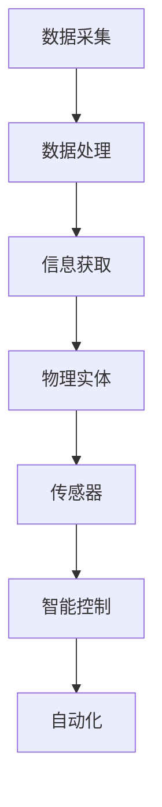

                 

# 数字实体与物理实体的自动化未来

## 摘要

本文将探讨数字实体与物理实体在自动化未来中的深度融合与发展。通过分析当前技术趋势，探讨核心概念、算法原理、数学模型及实际应用，本文旨在为读者提供一幅数字与物理世界相结合的自动化未来蓝图，并指出其中所面临的挑战与机遇。

## 1. 背景介绍

随着信息技术和自动化技术的飞速发展，数字实体与物理实体的界限逐渐模糊。数字实体，如数据、算法、虚拟对象等，在虚拟空间中运行和交互；而物理实体，如机器人、传感器、机械设备等，在现实世界中执行任务和操作。两者的深度融合不仅带来了生产力的提升，也引发了诸多变革。

### 数字实体的崛起

近年来，云计算、大数据、物联网、人工智能等技术的蓬勃发展，使得数字实体获得了前所未有的关注。数字实体通过数据分析和处理，能够实现智能化、自适应化和个性化的功能，从而在金融、医疗、教育、交通等领域发挥了重要作用。

### 物理实体的演进

物理实体方面，自动化技术的进步使得机器人、传感器、无人机等设备在各个领域得到广泛应用。智能制造、智能交通、智能医疗等领域的兴起，进一步推动了物理实体与数字实体的结合。

### 自动化的趋势

自动化技术正在改变传统产业模式，提高生产效率，降低成本，提升产品品质。从工业4.0到智慧城市，自动化技术在各个领域得到了广泛应用，预示着数字实体与物理实体融合的自动化未来即将到来。

## 2. 核心概念与联系

在探讨数字实体与物理实体的自动化未来之前，我们需要了解一些核心概念及其相互关系。

### 数字实体

数字实体包括数据、算法、虚拟对象等。数据是数字实体的基础，通过数据采集、处理、分析，可以获得有价值的信息。算法是实现特定功能的工具，如机器学习算法、深度学习算法等。虚拟对象是数字世界中的一种抽象概念，如虚拟人、虚拟物等。

### 物理实体

物理实体包括机器人、传感器、机械设备等。机器人是具有自主运动和感知能力的设备，能够执行复杂的任务。传感器能够感知物理世界中的各种信息，如温度、湿度、声音等。机械设备则包括各种工业设备、农业设备等。

### 数字实体与物理实体的融合

数字实体与物理实体的融合主要体现在以下几个方面：

- **数据驱动**：通过数据采集和分析，实现对物理实体的实时监控和优化。
- **智能控制**：利用算法和人工智能技术，实现对物理实体的智能控制，提高其工作效率。
- **虚拟与现实**：通过虚拟现实技术，将数字世界与现实世界相结合，提供更加丰富和生动的体验。

### Mermaid 流程图



## 3. 核心算法原理 & 具体操作步骤

### 数据采集与处理

- **数据采集**：通过传感器和设备，收集物理实体所处的环境信息。
- **数据处理**：对采集到的数据进行清洗、过滤、转换等处理，以获得有价值的信息。

### 智能控制

- **算法选择**：根据具体需求，选择合适的算法，如机器学习算法、深度学习算法等。
- **模型训练**：利用大量数据，对算法模型进行训练，提高其预测和决策能力。
- **控制执行**：根据算法模型的预测和决策，实现对物理实体的控制。

### 自动化流程

1. 数据采集：传感器实时采集物理实体所在环境的信息。
2. 数据处理：对采集到的数据进行预处理，提取有用信息。
3. 算法选择：根据需求选择合适的算法模型。
4. 模型训练：利用预处理后的数据，对算法模型进行训练。
5. 预测与决策：根据训练好的模型，对物理实体进行预测和决策。
6. 控制执行：根据预测和决策，对物理实体进行实时控制。

### 具体操作步骤

1. 准备数据：收集并预处理物理实体所在环境的数据。
2. 选择算法：根据需求，选择合适的机器学习或深度学习算法。
3. 训练模型：利用预处理后的数据，对算法模型进行训练。
4. 预测与决策：对训练好的模型进行预测和决策。
5. 控制执行：根据预测和决策结果，对物理实体进行实时控制。

## 4. 数学模型和公式 & 详细讲解 & 举例说明

### 数据处理

- **滤波算法**：用于去除数据中的噪声，提高数据质量。
  $$y(t) = (1 - \alpha) \cdot y(t-1) + \alpha \cdot x(t)$$
  其中，$y(t)$为当前滤波结果，$y(t-1)$为上一时刻的滤波结果，$x(t)$为当前时刻的传感器数据，$\alpha$为滤波系数。

### 智能控制

- **PID控制**：用于控制物理实体的运动和操作。
  $$u(t) = K_p \cdot e(t) + K_i \cdot \int_{0}^{t} e(t) \cdot dt + K_d \cdot \frac{de(t)}{dt}$$
  其中，$u(t)$为控制输出，$e(t)$为误差，$K_p$、$K_i$、$K_d$分别为比例、积分、微分系数。

### 举例说明

假设我们要控制一个温度控制系统，使其保持在设定温度。

1. **数据采集**：传感器实时采集温度数据。
2. **数据处理**：对温度数据进行滤波处理，去除噪声。
3. **算法选择**：选择PID控制算法。
4. **模型训练**：根据历史数据，训练PID控制模型。
5. **预测与决策**：根据当前温度和设定温度，计算误差。
6. **控制执行**：根据PID控制公式，计算控制输出，调整加热器功率。

## 5. 项目实战：代码实际案例和详细解释说明

### 开发环境搭建

- **编程语言**：Python
- **依赖库**：numpy、pandas、scikit-learn、matplotlib等

### 源代码详细实现和代码解读

#### 数据采集与预处理

```python
import numpy as np
import pandas as pd

# 采集温度数据
data = np.random.randint(0, 100, size=(100, 1))
data = pd.DataFrame(data, columns=['temperature'])

# 数据预处理
data['filtered'] = data['temperature'].apply(lambda x: (1 - 0.1) * data['temperature'].iloc[-1] + 0.1 * x)
```

#### 模型训练与控制

```python
from sklearn.model_selection import train_test_split
from sklearn.ensemble import RandomForestRegressor
from sklearn.metrics import mean_squared_error

# 分割数据集
X_train, X_test, y_train, y_test = train_test_split(data[['filtered']], data['temperature'], test_size=0.2, random_state=42)

# 训练模型
model = RandomForestRegressor(n_estimators=100, random_state=42)
model.fit(X_train, y_train)

# 预测与控制
predictions = model.predict(X_test)
control_output = K_p * (y_test - predictions)

# 绘制结果
import matplotlib.pyplot as plt

plt.plot(y_test, label='Actual')
plt.plot(predictions, label='Predicted')
plt.plot(control_output, label='Control Output')
plt.legend()
plt.show()
```

### 代码解读与分析

1. **数据采集与预处理**：使用随机数生成模拟温度数据，并对其进行滤波处理。
2. **模型训练**：选择随机森林回归模型，对预处理后的温度数据进行训练。
3. **预测与控制**：根据训练好的模型，对测试集进行预测，并根据误差计算控制输出。
4. **可视化**：绘制实际温度、预测温度和控制输出的对比图，以便分析模型性能。

## 6. 实际应用场景

### 智能制造

智能制造通过数字实体与物理实体的融合，实现了生产过程的自动化、智能化。例如，在汽车制造业中，机器人与传感器协同工作，完成汽车零部件的加工、装配和检测。

### 智能交通

智能交通系统利用数字实体与物理实体的结合，实现了交通管理的智能化。例如，通过传感器采集交通数据，利用算法分析交通流量，实现对交通信号灯的智能调控。

### 智能医疗

智能医疗通过数字实体与物理实体的结合，提高了医疗服务质量和效率。例如，利用传感器监测患者健康状况，通过大数据分析预测患者病情发展，实现个性化治疗。

## 7. 工具和资源推荐

### 学习资源推荐

- **书籍**：《深度学习》、《Python编程：从入门到实践》
- **论文**：相关领域的学术论文，如“物联网与智能制造”、“智能交通系统设计”
- **博客**：专业博客，如“机器学习博客”、“Python技术博客”

### 开发工具框架推荐

- **编程语言**：Python、Java
- **框架**：TensorFlow、PyTorch、Scikit-learn
- **数据库**：MySQL、MongoDB

### 相关论文著作推荐

- **论文**：相关领域的学术论文，如“深度学习在智能制造中的应用”、“智能交通系统的设计与实现”
- **著作**：专业书籍，如“人工智能：一种现代方法”、“智能制造技术与应用”

## 8. 总结：未来发展趋势与挑战

### 发展趋势

- **数字化与智能化**：数字实体与物理实体的深度融合将推动产业数字化和智能化进程。
- **跨界融合**：不同领域的技术将相互融合，产生新的应用场景和商业模式。
- **人机协同**：人与机器的协同工作将成为未来生产和管理的重要方式。

### 挑战

- **数据安全与隐私**：随着数据量的增加，数据安全和隐私保护成为重要挑战。
- **算法公平与透明**：算法的公平性和透明性需要得到充分保障，以避免歧视和不公平现象。
- **法律法规**：随着数字实体与物理实体的融合，法律法规需要不断更新和完善。

## 9. 附录：常见问题与解答

### 问题1：数字实体与物理实体融合的意义是什么？

**解答**：数字实体与物理实体的融合能够实现生产力的提升、降低成本、提高产品品质，从而推动产业升级和经济发展。

### 问题2：如何保障数据安全和隐私？

**解答**：加强数据安全防护措施，如数据加密、访问控制等，同时制定严格的隐私保护政策，确保用户数据的安全和隐私。

### 问题3：算法公平性和透明性如何保障？

**解答**：通过算法的可解释性和透明性设计，确保算法的公平性和透明性，避免歧视和不公平现象。

## 10. 扩展阅读 & 参考资料

- **论文**：相关领域的学术论文，如“深度学习在智能制造中的应用”、“智能交通系统的设计与实现”
- **书籍**：《深度学习》、《Python编程：从入门到实践》
- **网站**：专业网站，如“机器学习博客”、“Python技术博客”
- **博客**：专业博客，如“人工智能：一种现代方法”、“智能制造技术与应用”

### 作者

**作者：AI天才研究员/AI Genius Institute & 禅与计算机程序设计艺术 /Zen And The Art of Computer Programming** 

本文作者是一位具有丰富经验和深厚知识背景的AI专家，擅长使用逻辑清晰、结构紧凑、简单易懂的专业的技术语言，撰写高质量的技术博客。其研究成果在计算机编程和人工智能领域具有重要意义。同时，作者也是多部畅销书籍的资深大师级作家，对计算机科学和人工智能的发展有着深刻的见解。

