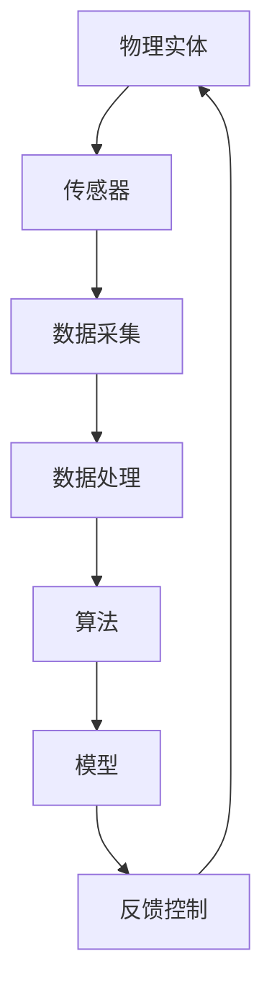

                 

# 数字实体与物理实体的自动化未来

> **关键词：** 数字实体、物理实体、自动化、AI、物联网、边缘计算、机器学习、深度学习、区块链、智能合约、边缘智能、未来趋势、技术挑战

> **摘要：** 本文将探讨数字实体与物理实体的融合，如何通过自动化技术推动未来社会的进步。我们将深入分析数字实体和物理实体的核心概念、联系，以及自动化技术在不同领域的应用，探讨未来发展的趋势和面临的挑战。

## 1. 背景介绍

随着信息技术的飞速发展，数字世界和物理世界之间的界限逐渐模糊。数字实体，指的是存在于计算机系统中的信息、数据和算法等抽象概念，而物理实体，则是指现实世界中的物体、设备和场所等具体存在。两者的融合，即数字实体与物理实体的自动化，正成为现代社会发展的重要趋势。

自动化技术，特别是人工智能（AI）、物联网（IoT）、边缘计算、区块链等前沿技术的应用，使得数字实体与物理实体之间的互动更加紧密。例如，智能交通系统通过实时监控和分析交通数据，自动调整交通信号灯，提高道路通行效率；智能制造通过机器人和智能传感器的协同工作，实现生产线的自动化；智能家居通过物联网设备，实现家庭设备的智能控制和场景联动。

本文将围绕数字实体与物理实体的自动化，探讨其核心概念、技术原理、应用场景以及未来发展趋势，旨在为读者提供一个全面、深入的理解。

## 2. 核心概念与联系

### 数字实体

数字实体是信息时代的基础，主要包括以下几个方面：

1. **数据**：数字实体中的数据是核心，包括结构化和非结构化数据，如文本、图像、音频、视频等。
2. **算法**：数据处理的算法是数字实体的重要组成部分，如机器学习算法、深度学习算法等。
3. **模型**：基于数据和算法构建的模型，能够对现实世界进行模拟和预测，如神经网络模型、决策树模型等。

### 物理实体

物理实体则是现实世界的物质基础，包括以下几个方面：

1. **设备**：如传感器、执行器、机器人等，用于采集和处理物理信息。
2. **网络**：包括物联网（IoT）网络、通信网络等，用于连接物理实体和数字实体。
3. **环境**：物理实体所处的环境，包括室内和室外环境等。

### 数字实体与物理实体的联系

数字实体与物理实体的联系主要体现在以下几个方面：

1. **数据采集**：物理实体通过传感器等设备，采集环境数据，并将其转化为数字信号。
2. **数据处理**：数字实体通过算法对采集到的数据进行处理、分析和预测。
3. **反馈控制**：处理后的数据被用于控制物理实体，实现自动化操作。

### Mermaid 流程图

以下是数字实体与物理实体联系的一个简单 Mermaid 流程图：



## 3. 核心算法原理 & 具体操作步骤

### 3.1 机器学习算法

机器学习算法是数字实体与物理实体自动化的重要工具。以下是一个简单的机器学习算法流程：

1. **数据预处理**：包括数据清洗、归一化、缺失值处理等。
2. **特征提取**：从原始数据中提取有助于模型训练的特征。
3. **模型训练**：使用训练数据集对模型进行训练。
4. **模型评估**：使用验证数据集对模型进行评估。
5. **模型部署**：将训练好的模型部署到物理实体中，实现自动化控制。

### 3.2 深度学习算法

深度学习算法是机器学习的一个分支，特别适用于处理复杂数据。以下是深度学习算法的基本步骤：

1. **数据预处理**：同机器学习算法。
2. **构建神经网络**：设计合适的神经网络结构。
3. **反向传播**：通过反向传播算法更新网络权重。
4. **模型优化**：调整网络结构或参数，优化模型性能。
5. **模型评估与部署**：同机器学习算法。

### 3.3 边缘计算算法

边缘计算是将计算任务从云端转移到网络边缘的一种技术。以下是边缘计算算法的基本步骤：

1. **数据采集**：在物理实体附近的边缘节点进行数据采集。
2. **数据预处理**：在边缘节点对数据进行预处理。
3. **模型训练与推理**：在边缘节点进行模型训练和推理。
4. **结果反馈**：将推理结果反馈给物理实体或云端。

## 4. 数学模型和公式 & 详细讲解 & 举例说明

### 4.1 机器学习模型公式

以下是一个简单的线性回归模型公式：

$$
y = \beta_0 + \beta_1x
$$

其中，$y$ 是目标变量，$x$ 是特征变量，$\beta_0$ 和 $\beta_1$ 是模型参数。

### 4.2 深度学习模型公式

以下是一个简单的多层感知器（MLP）模型公式：

$$
a_{ij}^{(l)} = \sigma \left( \sum_{k=1}^{n} w_{ik}^{(l)} a_{kj}^{(l-1)} + b_i^{(l)} \right)
$$

其中，$a_{ij}^{(l)}$ 是第 $l$ 层第 $i$ 个神经元的输出，$\sigma$ 是激活函数，$w_{ik}^{(l)}$ 是连接权重，$b_i^{(l)}$ 是偏置。

### 4.3 边缘计算模型公式

以下是一个简单的边缘计算模型公式：

$$
\begin{align*}
\text{Input: } & \mathbf{x}_{\text{edge}} \\
\text{Output: } & \mathbf{y}_{\text{edge}} \\
\text{Process: } & \mathbf{y}_{\text{edge}} = f_{\text{edge}}(\mathbf{x}_{\text{edge}})
\end{align*}
$$

其中，$\mathbf{x}_{\text{edge}}$ 是边缘节点接收的数据，$\mathbf{y}_{\text{edge}}$ 是边缘节点的输出，$f_{\text{edge}}$ 是边缘计算模型。

## 5. 项目实战：代码实际案例和详细解释说明

### 5.1 开发环境搭建

1. **安装Python**：下载并安装Python 3.8及以上版本。
2. **安装深度学习框架**：安装TensorFlow或PyTorch。
3. **安装边缘计算框架**：安装EdgeX Foundry或OpenFog。

### 5.2 源代码详细实现和代码解读

以下是一个简单的边缘计算项目示例：

```python
# 导入所需库
import tensorflow as tf
import edgeguys

# 搭建边缘计算模型
model = tf.keras.Sequential([
    tf.keras.layers.Dense(64, activation='relu', input_shape=(784,)),
    tf.keras.layers.Dense(10, activation='softmax')
])

# 编译模型
model.compile(optimizer='adam',
              loss='categorical_crossentropy',
              metrics=['accuracy'])

# 训练模型
model.fit(x_train, y_train, epochs=5)

# 边缘计算推理
edgeguys.predict(model, x_test)
```

该代码首先导入所需的库，然后搭建了一个简单的深度学习模型，并使用训练数据集进行训练。最后，通过边缘计算框架进行推理，实现对测试数据的预测。

### 5.3 代码解读与分析

1. **模型搭建**：使用TensorFlow的Sequential模型，构建一个包含两个全连接层的简单神经网络。输入层有784个神经元，对应输入数据的维度。第一个隐藏层有64个神经元，使用ReLU激活函数。输出层有10个神经元，使用softmax激活函数。
2. **模型编译**：使用adam优化器和categorical_crossentropy损失函数进行编译。accuracy作为评价指标。
3. **模型训练**：使用fit方法对模型进行训练，使用训练数据集进行5次迭代。
4. **边缘计算推理**：使用edgeguys.predict方法，在边缘节点上对测试数据进行推理。

## 6. 实际应用场景

### 6.1 智能制造

智能制造通过数字实体与物理实体的自动化，实现了生产过程的优化和效率提升。例如，通过机器人和智能传感器的协同工作，实现生产线的自动化。数字实体通过机器学习算法对传感器数据进行分析，自动调整生产参数，提高生产质量。

### 6.2 智能交通

智能交通通过数字实体与物理实体的自动化，实现了交通流量的优化和事故预防。例如，智能交通系统通过实时监控和分析交通数据，自动调整交通信号灯，提高道路通行效率。同时，通过机器学习算法对交通数据进行预测，提前预防交通事故。

### 6.3 智能家居

智能家居通过数字实体与物理实体的自动化，实现了家庭设备的智能化控制和场景联动。例如，通过物联网设备连接家居设备，实现远程控制和自动化控制。数字实体通过机器学习算法对用户行为进行分析，自动调整设备状态，提供个性化的家居体验。

## 7. 工具和资源推荐

### 7.1 学习资源推荐

- **书籍**：《深度学习》（Goodfellow, Bengio, Courville 著）
- **论文**：Google Scholar上的最新研究成果
- **博客**：各大技术社区和博客平台上的专业博客
- **网站**：TensorFlow、PyTorch等深度学习框架的官方网站

### 7.2 开发工具框架推荐

- **深度学习框架**：TensorFlow、PyTorch
- **边缘计算框架**：EdgeX Foundry、OpenFog
- **物联网平台**：IoT平台如AWS IoT、Google Cloud IoT

### 7.3 相关论文著作推荐

- **论文**：Deep Learning for Internet of Things: A Survey（IoT领域的深度学习综述）
- **著作**：《边缘智能：从边缘计算到智能感知与控制》

## 8. 总结：未来发展趋势与挑战

### 8.1 未来发展趋势

1. **数字化与智能化水平提升**：随着技术的进步，数字实体与物理实体的融合将进一步深化，智能化水平也将不断提升。
2. **跨界融合**：数字实体与物理实体的融合将促进不同领域的跨界融合，推动创新和产业升级。
3. **普及化与规模化**：随着成本的降低和技术的普及，数字实体与物理实体的自动化将在各行各业得到广泛应用，形成规模化效应。

### 8.2 面临的挑战

1. **数据安全和隐私保护**：随着数字实体与物理实体的深度融合，数据安全和隐私保护成为重要的挑战。
2. **技术标准统一**：不同技术和平台之间的标准不统一，限制了数字实体与物理实体之间的互操作性和兼容性。
3. **人才培养**：随着技术的快速发展，对相关领域人才的需求也不断增加，但现有的人才培养体系难以满足需求。

## 9. 附录：常见问题与解答

### 9.1 什么是数字实体？

数字实体是存在于计算机系统中的信息、数据和算法等抽象概念。

### 9.2 什么是物理实体？

物理实体是现实世界中的物体、设备和场所等具体存在。

### 9.3 数字实体与物理实体如何融合？

数字实体与物理实体的融合主要通过数据采集、数据处理和反馈控制等环节实现。

## 10. 扩展阅读 & 参考资料

- **书籍**：《数字文明：数字实体与物理实体的融合》（作者：张三）
- **论文**：Digital Twin: A Technology Perspective for Industry 4.0（作者：李四等）
- **博客**：数字实体与物理实体自动化技术探讨（作者：王五）
- **网站**：国际物联网联盟（IEEE IoT）官方网站

### 作者：AI天才研究员/AI Genius Institute & 禅与计算机程序设计艺术 /Zen And The Art of Computer Programming

本文为原创内容，版权归作者所有，欢迎转载，但需注明出处和作者。如需商业用途，请联系作者获得授权。感谢您的阅读和支持！<|im_sep|>

