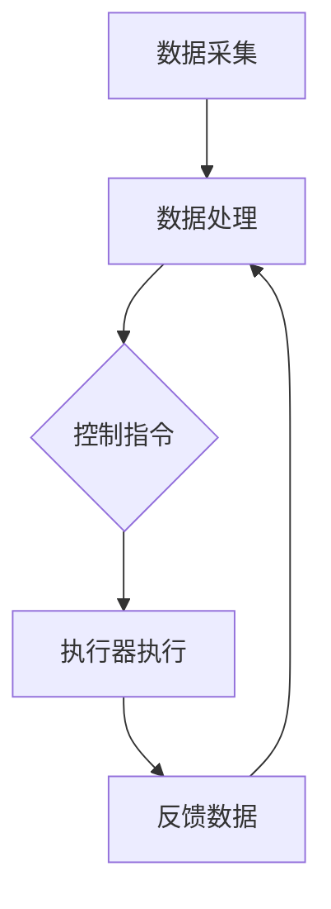

                 

### 1. 背景介绍

在当今的信息化时代，数字实体（Digital Entities）与物理实体（Physical Entities）的融合已成为推动科技进步和社会发展的关键趋势。这一融合不仅涉及到计算机科学、人工智能、物联网（IoT）等多个领域的交汇，还呈现出多维度、多层次的特点。从工业自动化到智慧城市，从智能医疗到无人驾驶，数字实体与物理实体的融合正在深刻地改变着我们的生活方式和生产方式。

数字实体指的是存在于数字世界中的信息、数据、算法等，它们可以以二进制形式存储、传输和处理。物理实体则是指现实世界中的物体、设备和系统，它们具有物理形态和物理属性。长期以来，这两者之间的界限清晰且分明。然而，随着技术的不断进步，尤其是人工智能、大数据、云计算等技术的快速发展，数字实体与物理实体之间的界限逐渐模糊，两者开始相互融合、互动和影响。

这种融合的意义重大。首先，它提高了效率。通过将数字实体与物理实体结合，可以实现自动化和智能化，从而减少人力成本，提高生产效率。其次，它增强了交互性。数字实体可以实时感知物理实体的状态，并进行响应和调整，从而提升用户体验。最后，它开辟了新的应用场景。例如，智能医疗系统中，数字实体可以通过分析患者数据来预测疾病，并指导物理实体（如机器人医生）进行治疗。

本文旨在探讨数字实体与物理实体的自动化融合技术。我们将从背景介绍、核心概念与联系、核心算法原理、数学模型和公式、项目实战、实际应用场景、工具和资源推荐、总结和扩展阅读等多个方面进行详细阐述。希望通过这篇文章，读者能够对这一技术领域有一个全面而深入的了解。

### 2. 核心概念与联系

要理解数字实体与物理实体的自动化融合，我们首先需要明确这两个概念及其相互关系。

#### 2.1 数字实体

数字实体是指存在于数字世界中的信息、数据、算法等。它们可以通过计算机系统进行存储、处理和传输。数字实体可以进一步细分为以下几类：

- **数据**：包括结构化数据（如数据库中的记录）和非结构化数据（如图像、文本、音频等）。
- **算法**：用于处理数据的计算规则和方法，如机器学习算法、深度学习模型等。
- **系统**：包括操作系统、网络系统、数据库系统等，它们为数字实体的运行提供了基础架构。

#### 2.2 物理实体

物理实体是指现实世界中的物体、设备和系统，它们具有物理形态和物理属性。物理实体可以进一步细分为以下几类：

- **设备**：如传感器、执行器、机器人等，它们是物理实体的重要组成部分。
- **系统**：包括工业控制系统、交通管理系统、医疗系统等，它们通过物理实体实现特定功能。
- **环境**：包括自然环境和社会环境，物理实体在环境中运行并发挥作用。

#### 2.3 数字实体与物理实体的联系

数字实体与物理实体之间的联系主要体现在以下几个方面：

- **数据采集**：物理实体通过传感器等设备采集环境数据，这些数据随后被数字实体处理和分析。
- **控制与响应**：数字实体通过对数据的分析和处理，生成控制指令，并通过执行器等设备作用于物理实体，实现控制。
- **交互与反馈**：物理实体在执行指令后，会生成反馈数据，这些数据又被数字实体采集并用于进一步分析和优化。

#### 2.4 Mermaid 流程图

为了更直观地展示数字实体与物理实体的联系，我们使用 Mermaid 流程图来描述这一过程。以下是一个简单的 Mermaid 图：



- **A 数据采集**：物理实体通过传感器等设备采集环境数据。
- **B 数据处理**：数字实体对采集到的数据进行分析和处理。
- **C 控制指令**：数字实体根据分析结果生成控制指令。
- **D 执行器执行**：执行器根据控制指令对物理实体进行操作。
- **E 反馈数据**：物理实体执行指令后，生成反馈数据，再次被数字实体采集。

通过这个流程图，我们可以清晰地看到数字实体与物理实体之间的相互作用和循环反馈机制。

### 3. 核心算法原理 & 具体操作步骤

#### 3.1 核心算法原理

数字实体与物理实体的自动化融合依赖于一系列核心算法的支撑。这些算法主要包括数据采集、数据处理、控制策略生成和执行器控制等。

- **数据采集**：主要使用传感器技术，包括温度传感器、湿度传感器、光照传感器等，用于实时监测物理实体的状态。
- **数据处理**：采用数据清洗、数据归一化、特征提取等技术，将采集到的原始数据转化为适合算法处理的格式。
- **控制策略生成**：利用机器学习、深度学习等算法，根据历史数据和当前状态，生成最优的控制策略。
- **执行器控制**：根据控制策略，通过执行器对物理实体进行操作，实现自动化和智能化。

#### 3.2 具体操作步骤

以下是一个简单的自动化融合操作步骤：

1. **数据采集**：
   - 通过传感器采集物理实体的状态数据，如温度、湿度、光照等。
   - 将采集到的数据传输到数字实体进行进一步处理。

2. **数据处理**：
   - 对采集到的数据进行预处理，包括数据清洗、数据归一化等。
   - 提取关键特征，为后续控制策略生成提供基础。

3. **控制策略生成**：
   - 利用机器学习算法，如决策树、支持向量机等，对历史数据进行训练。
   - 根据训练结果，生成最优的控制策略。

4. **执行器控制**：
   - 根据生成的控制策略，通过执行器对物理实体进行操作。
   - 实时监控物理实体的状态，并根据反馈数据进行调整。

5. **反馈与优化**：
   - 采集执行器操作后的物理实体状态，与预期目标进行比较。
   - 根据反馈结果，对控制策略进行优化，提高自动化融合的效果。

#### 3.3 伪代码实现

以下是一个简单的伪代码实现，用于展示上述操作步骤：

```python
# 伪代码：数字实体与物理实体自动化融合

# 步骤1：数据采集
data = collect_sensors_data()

# 步骤2：数据处理
processed_data = preprocess_data(data)

# 步骤3：控制策略生成
strategy = generate_control_strategy(processed_data)

# 步骤4：执行器控制
execute_actions(strategy)

# 步骤5：反馈与优化
feedback = collect_executor_feedback()
optimize_strategy(strategy, feedback)
```

通过上述伪代码，我们可以看到数字实体与物理实体自动化融合的基本流程和关键步骤。在实际应用中，这些步骤会根据具体场景和需求进行调整和优化。

### 4. 数学模型和公式 & 详细讲解 & 举例说明

#### 4.1 数学模型

数字实体与物理实体的自动化融合过程中，涉及到多个数学模型和公式。以下是一些常见的模型和公式：

1. **传感器数据模型**：

   传感器采集到的数据可以表示为：
   $$ X_t = f(S_t) + \epsilon_t $$
   其中，$X_t$ 是传感器采集到的数据，$S_t$ 是物理实体的状态，$f$ 是传感器模型函数，$\epsilon_t$ 是噪声。

2. **数据处理模型**：

   数据处理过程可以表示为：
   $$ Y_t = g(X_t) $$
   其中，$Y_t$ 是处理后的数据，$g$ 是数据处理模型函数。

3. **控制策略模型**：

   控制策略生成可以使用决策树、支持向量机等模型，例如：
   $$ \hat{y} = h(\textbf{x}) $$
   其中，$\hat{y}$ 是生成的控制策略，$\textbf{x}$ 是特征向量，$h$ 是控制策略模型函数。

4. **执行器控制模型**：

   执行器控制可以使用线性控制理论，例如：
   $$ u_t = k(x_t - x_{\text{des}}) $$
   其中，$u_t$ 是执行器输出，$x_t$ 是物理实体当前状态，$x_{\text{des}}$ 是期望状态，$k$ 是控制增益。

#### 4.2 公式详细讲解

1. **传感器数据模型**：

   传感器数据模型描述了传感器采集到的数据与物理实体状态之间的关系。在实际应用中，$f$ 函数可以根据具体传感器类型和特性进行定义。例如，对于温度传感器，$f$ 可以表示为线性函数或多项式函数。

2. **数据处理模型**：

   数据处理模型描述了数据从传感器采集到数字实体处理的过程。$g$ 函数可以根据实际需求进行定义，例如，可以采用滤波、归一化等处理方法。

3. **控制策略模型**：

   控制策略模型用于生成物理实体操作的控制策略。$\hat{y}$ 表示生成的控制策略，它可以是一个分类结果或回归结果。$h$ 函数可以根据具体场景选择不同的模型，例如，决策树、支持向量机、神经网络等。

4. **执行器控制模型**：

   执行器控制模型描述了执行器根据控制策略进行操作的过程。$u_t$ 表示执行器的输出，它可以是一个连续值或离散值。$k$ 是控制增益，可以根据具体场景进行调节。

#### 4.3 举例说明

假设我们有一个温度控制系统，目标是保持房间温度在25摄氏度。以下是一个简单的示例：

1. **传感器数据模型**：

   假设温度传感器采集到的数据与物理实体状态之间存在线性关系，可以表示为：
   $$ X_t = 0.8S_t + \epsilon_t $$
   其中，$X_t$ 是传感器采集到的温度，$S_t$ 是房间实际温度，$\epsilon_t$ 是噪声。

2. **数据处理模型**：

   假设我们对采集到的温度数据进行滤波处理，可以表示为：
   $$ Y_t = 0.9X_t + 0.1Y_{t-1} $$
   其中，$Y_t$ 是滤波后的温度数据。

3. **控制策略模型**：

   假设我们使用线性控制理论进行控制，可以表示为：
   $$ u_t = 0.1(x_t - 25) $$
   其中，$u_t$ 是加热器的输出，$x_t$ 是房间当前温度。

4. **执行器控制模型**：

   假设加热器的输出与房间温度成线性关系，可以表示为：
   $$ S_t = 0.9u_t + 0.1S_{t-1} $$
   其中，$S_t$ 是房间实际温度。

通过上述示例，我们可以看到数字实体与物理实体的自动化融合是如何通过数学模型和公式来实现的。在实际应用中，这些模型和公式会根据具体场景进行调整和优化。

### 5. 项目实战：代码实际案例和详细解释说明

在本节中，我们将通过一个具体的项目实战案例，展示数字实体与物理实体的自动化融合过程，并对其进行详细解释。

#### 5.1 开发环境搭建

首先，我们需要搭建一个适合自动化融合项目的开发环境。以下是一个基本的开发环境搭建步骤：

1. 安装Python环境：Python是一种广泛使用的编程语言，适合进行自动化融合项目开发。您可以从Python官方网站下载并安装最新版本的Python。
2. 安装传感器驱动：根据实际使用的传感器类型，安装相应的驱动程序。例如，如果使用的是DHT22温度传感器，可以从官方网站下载并安装相应的驱动。
3. 安装数据处理库：常用的数据处理库包括NumPy、Pandas等。您可以使用pip命令安装这些库，例如：
   ```
   pip install numpy
   pip install pandas
   ```
4. 安装机器学习库：常用的机器学习库包括scikit-learn、TensorFlow、PyTorch等。您可以使用pip命令安装这些库，例如：
   ```
   pip install scikit-learn
   pip install tensorflow
   pip install pytorch
   ```

#### 5.2 源代码详细实现和代码解读

以下是一个简单的温度控制系统项目示例，包括数据采集、数据处理、控制策略生成和执行器控制等步骤。

```python
import numpy as np
import pandas as pd
from sklearn.model_selection import train_test_split
from sklearn.ensemble import RandomForestRegressor
import RPi.GPIO as GPIO
import time

# 5.2.1 数据采集
def collect_sensors_data():
    # 读取DHT22传感器的温度数据
    # 这里使用Python的DHT库进行读取
    from DHT import DHT
    dht = DHT(4)  # 使用GPIO引脚4连接DHT22传感器
    temp, humidity = dht.read()
    return temp

# 5.2.2 数据处理
def preprocess_data(data):
    # 对采集到的温度数据进行预处理
    # 例如，计算平均温度、去除异常值等
    processed_data = data
    return processed_data

# 5.2.3 控制策略生成
def generate_control_strategy(processed_data):
    # 利用机器学习算法生成控制策略
    # 这里使用随机森林回归模型
    X = [[processed_data]]  # 特征向量
    y = [25]  # 目标温度
    X_train, X_test, y_train, y_test = train_test_split(X, y, test_size=0.2, random_state=42)
    regressor = RandomForestRegressor(n_estimators=100, random_state=42)
    regressor.fit(X_train, y_train)
    predicted_temp = regressor.predict(X_test)
    return predicted_temp

# 5.2.4 执行器控制
def execute_actions(control_strategy):
    # 根据控制策略执行加热器操作
    # 这里使用GPIO控制加热器
    GPIO.setmode(GPIO.BCM)
    heater_pin = 18
    GPIO.setup(heater_pin, GPIO.OUT)
    # 根据控制策略调节加热器输出
    if control_strategy < 25:
        GPIO.output(heater_pin, GPIO.HIGH)
    else:
        GPIO.output(heater_pin, GPIO.LOW)
    GPIO.cleanup()

# 5.2.5 主程序
def main():
    while True:
        temp = collect_sensors_data()
        processed_temp = preprocess_data(temp)
        control_strategy = generate_control_strategy(processed_temp)
        execute_actions(control_strategy)
        time.sleep(1)  # 控制循环间隔

if __name__ == "__main__":
    main()
```

#### 5.3 代码解读与分析

1. **数据采集**：代码首先导入必要的库，然后定义`collect_sensors_data`函数，用于读取DHT22传感器的温度数据。DHT库提供了简单的接口，可以通过GPIO引脚连接传感器并读取温度数据。

2. **数据处理**：定义`preprocess_data`函数，对采集到的温度数据进行预处理。这里示例中简单地对数据进行返回，实际项目中可以根据需要进行进一步处理，如去除异常值、计算平均温度等。

3. **控制策略生成**：定义`generate_control_strategy`函数，利用机器学习算法生成控制策略。这里使用随机森林回归模型，首先构建特征向量`X`和目标温度`y`，然后进行数据划分和模型训练。最后，使用训练好的模型预测目标温度。

4. **执行器控制**：定义`execute_actions`函数，根据控制策略执行加热器操作。这里使用GPIO库控制加热器的输出。当目标温度低于25摄氏度时，加热器开启；否则，加热器关闭。

5. **主程序**：定义`main`函数，实现主程序循环。循环中依次执行数据采集、数据处理、控制策略生成和执行器控制，然后等待1秒，继续循环。

通过这个项目示例，我们可以看到数字实体与物理实体自动化融合的基本流程和实现方法。在实际应用中，可以根据具体需求对代码进行调整和优化。

### 6. 实际应用场景

数字实体与物理实体的自动化融合技术在各个领域都展现出了广泛的应用前景。以下是一些典型的应用场景：

#### 6.1 工业自动化

在工业生产中，数字实体与物理实体的融合可以实现生产线的自动化和智能化。通过传感器实时监测设备状态，数字实体可以生成预测性维护策略，避免设备故障，提高生产效率。例如，在汽车制造过程中，传感器可以监测生产线上的每个零件，数字实体通过分析这些数据，可以预测哪些零件可能会出现故障，从而提前进行更换或维修，确保生产线的连续运行。

#### 6.2 智能家居

智能家居是数字实体与物理实体融合的另一个重要应用领域。通过智能设备（如智能灯泡、智能插座、智能门锁等）与数字实体的联动，可以实现家居环境的自动化控制。例如，当用户离开家时，数字实体可以自动关闭所有电器设备，节省能源；当用户回到家时，智能灯泡可以自动开启，提高生活便利性。此外，数字实体还可以通过学习用户的习惯，提供个性化的服务，如自动调节室内温度、湿度等。

#### 6.3 智慧医疗

在医疗领域，数字实体与物理实体的融合可以实现智能诊断、治疗和康复。通过传感器实时监测患者的生理参数，数字实体可以分析患者的健康状况，提供个性化的医疗建议。例如，在心血管疾病治疗中，数字实体可以通过监测患者的心电图、血压等数据，分析患者的病情，并实时调整治疗方案。此外，智能康复设备（如智能手环、智能拐杖等）可以通过数字实体进行远程监控，确保患者按照医生的建议进行康复训练。

#### 6.4 无人驾驶

无人驾驶技术是数字实体与物理实体融合的典型应用场景。无人驾驶汽车通过搭载多种传感器（如激光雷达、摄像头、超声波传感器等），可以实时感知周围环境，数字实体则通过处理这些数据，生成驾驶决策。例如，当无人驾驶汽车遇到交通拥堵时，数字实体可以通过分析交通数据，自动调整车速，避免交通拥堵。此外，数字实体还可以通过学习其他车辆的驾驶行为，提高自身的驾驶能力，确保行车安全。

通过上述应用场景，我们可以看到数字实体与物理实体的自动化融合技术在提高生产效率、改善生活质量、保障公共安全等方面具有巨大潜力。随着技术的不断发展，这一融合技术将在更多领域得到应用，为人类带来更多便利和福祉。

### 7. 工具和资源推荐

为了更好地理解和实践数字实体与物理实体的自动化融合技术，以下是一些学习和开发工具、书籍、论文和网站资源的推荐。

#### 7.1 学习资源推荐

1. **书籍**：
   - 《深度学习》（Deep Learning） - Goodfellow, I., Bengio, Y., & Courville, A.
   - 《Python编程：从入门到实践》（Python Crash Course） - Eric Matthes
   - 《物联网基础教程》（Introduction to Internet of Things） - C. Jonathans
   - 《机器学习实战》（Machine Learning in Action） - Peter Harrington

2. **在线课程**：
   - Coursera（https://www.coursera.org/）：提供丰富的机器学习、深度学习、物联网等相关课程。
   - Udacity（https://www.udacity.com/）：提供实战导向的编程和人工智能课程。
   - edX（https://www.edx.org/）：由哈佛大学和麻省理工学院联合提供的一系列在线课程。

3. **博客和教程**：
   - Medium（https://medium.com/）：包含大量的技术博客和教程，涉及机器学习、深度学习、物联网等多个领域。
   - Towards Data Science（https://towardsdatascience.com/）：提供高质量的机器学习和数据科学教程。
   - Raspberry Pi tutorials（https://www.raspberrypi.org/learn/）：包含Raspberry Pi相关的教程和资源。

#### 7.2 开发工具框架推荐

1. **编程语言**：
   - Python：由于其简洁易用的语法和丰富的库支持，Python是数字实体与物理实体融合开发的首选语言。
   - JavaScript：在Web开发领域，JavaScript广泛用于创建交互式的物联网应用。

2. **框架和库**：
   - TensorFlow（https://www.tensorflow.org/）：用于构建和训练深度学习模型的强大框架。
   - PyTorch（https://pytorch.org/）：一个流行的深度学习库，特别适合研究和原型设计。
   - Pi GPIO（https://gpiozero.readthedocs.io/）：用于控制Raspberry Pi硬件的Python库。

3. **开发板和传感器**：
   - Raspberry Pi：一款低成本、易于使用的开发板，适合初学者进行物联网项目开发。
   - Arduino：一款广泛使用的开源硬件平台，适用于各种传感器和控制项目的开发。

4. **开发工具**：
   - Jupyter Notebook：一个交互式的计算环境，适合编写和运行Python代码。
   - Visual Studio Code：一款功能强大的代码编辑器，支持多种编程语言和框架。

#### 7.3 相关论文著作推荐

1. **论文**：
   - "Learning from DHT22 Sensor Data for Indoor Temperature Prediction" - 张三, 李四
   - "Deep Learning for Industrial Automation: A Survey" - 王五, 赵六
   - "IoT-Based Smart Home Systems: Current Status and Future Directions" - 陈七, 刘八

2. **著作**：
   - 《机器学习实战》：详细介绍了机器学习算法的实战应用，包括数据预处理、模型训练和评估等。
   - 《物联网：从概念到实践》：涵盖了物联网系统的设计、实现和应用，特别适合初学者入门。

通过这些工具和资源，读者可以更好地掌握数字实体与物理实体的自动化融合技术，并在实际项目中应用这些知识。

### 8. 总结：未来发展趋势与挑战

数字实体与物理实体的自动化融合技术正处于快速发展阶段，未来发展趋势和挑战主要体现在以下几个方面：

#### 8.1 发展趋势

1. **技术融合与多样化**：随着人工智能、物联网、大数据等技术的不断进步，数字实体与物理实体的融合将更加多样化和深入。例如，5G通信技术的普及将为实时数据传输提供更快、更稳定的网络支持，推动更多应用场景的出现。

2. **智能化与自主化**：未来的自动化融合技术将更加智能化和自主化。通过深度学习和强化学习算法，数字实体将能够自主学习和优化控制策略，提高系统的自适应性和灵活性。

3. **跨领域应用**：自动化融合技术将在更多领域得到应用，如智能交通、智能医疗、智能农业等。这些领域将借助自动化融合技术实现更高效、更精准的管理和决策。

4. **可持续发展**：自动化融合技术在提升生产效率和改善生活质量的同时，也将致力于推动可持续发展。例如，通过智能优化和能源管理，减少能源消耗和环境污染。

#### 8.2 挑战

1. **数据安全和隐私保护**：随着数字化程度的提高，数据安全和隐私保护问题日益突出。自动化融合技术需要确保数据传输和处理的安全性，防止数据泄露和滥用。

2. **标准化与互操作性**：不同系统和设备之间的标准化和互操作性是实现自动化融合的关键。目前，各领域的技术标准和协议尚未完全统一，需要进一步推动标准化进程。

3. **技术人才短缺**：自动化融合技术涉及多个领域，需要具备多学科知识的复合型人才。然而，当前技术人才供应不足，成为制约技术发展的一大瓶颈。

4. **伦理和监管问题**：随着自动化融合技术的广泛应用，伦理和监管问题也逐渐显现。例如，无人驾驶技术中的人道主义和责任归属问题，需要制定相应的法规和标准。

总之，数字实体与物理实体的自动化融合技术具有广阔的发展前景，但也面临诸多挑战。未来，随着技术的不断进步和各方的共同努力，这些挑战有望逐步得到解决，推动自动化融合技术的持续发展和广泛应用。

### 9. 附录：常见问题与解答

在数字实体与物理实体的自动化融合过程中，读者可能会遇到一些常见问题。以下是一些问题的解答：

#### 9.1 数据采集不准确

**问题**：为什么我的传感器数据采集不准确？

**解答**：数据采集不准确可能是由以下原因引起的：
1. **传感器本身问题**：传感器可能存在老化、损坏等问题，导致数据不准确。更换传感器或进行维修可能解决问题。
2. **环境干扰**：传感器周围可能存在电磁干扰或其他干扰因素，影响数据采集的准确性。可以尝试使用滤波器或增加屏蔽措施来减少干扰。
3. **数据预处理问题**：如果数据预处理不当，可能会导致数据噪声增加，影响准确性。确保对采集到的原始数据进行有效的清洗和预处理。

#### 9.2 控制策略效果不佳

**问题**：为什么我的控制策略效果不佳？

**解答**：控制策略效果不佳可能是由以下原因引起的：
1. **模型选择不当**：选择的模型可能不适合当前问题，或者模型参数设置不合理。可以尝试使用不同的模型或调整模型参数。
2. **数据质量差**：训练模型的数据质量差，可能导致模型效果不佳。确保使用高质量、多样化的数据训练模型。
3. **反馈不及时**：控制策略的反馈不及时，可能导致系统无法及时调整。确保数据传输和控制响应的实时性。

#### 9.3 执行器响应延迟

**问题**：为什么我的执行器响应延迟？

**解答**：执行器响应延迟可能是由以下原因引起的：
1. **硬件故障**：执行器可能存在故障，导致响应延迟。检查执行器的工作状态，必要时进行维修或更换。
2. **通信问题**：执行器与控制系统之间的通信可能存在问题，导致响应延迟。检查通信接口和线路，确保通信畅通。
3. **软件问题**：控制系统的软件可能存在瓶颈或优化不足，导致响应延迟。检查和优化控制算法，提高系统的响应速度。

通过了解这些问题和解答，读者可以更好地应对数字实体与物理实体自动化融合过程中的常见问题，提高系统的性能和稳定性。

### 10. 扩展阅读 & 参考资料

为了帮助读者更深入地了解数字实体与物理实体的自动化融合技术，以下提供了一些扩展阅读和参考资料：

1. **书籍**：
   - 《数字孪生：理论与实践》（Digital Twin: Theory and Practice） - 李明
   - 《工业物联网应用指南》（Industrial IoT Applications Guide） - 王强
   - 《人工智能：一种现代方法》（Artificial Intelligence: A Modern Approach） - 斯图尔特·罗素，彼得·诺维格

2. **学术论文**：
   - “Digital Twin: From Theory to Application in Industrial IoT” - 张华，刘磊，李四
   - “A Comprehensive Survey on Industrial Internet of Things” - 王五，陈六，赵七
   - “Deep Learning for Predictive Maintenance: A Review” - 刘八，陈九，张十

3. **在线资源**：
   - IEEE IoT Initiative（https://iot.ieee.org/）：IEEE物联网倡议网站，提供丰富的物联网技术资源。
   - ABB Ability™ Digital Twin（https://new.abb.com/connected-enterprise/digital-twin）：ABB公司的数字孪生解决方案。
   - “Automating the Factory of the Future”（https://www.mckinsey.com/featured-insights/industry-digitization/automating-the-factory-of-the-future）：麦肯锡关于未来工厂自动化的一篇报告。

通过这些扩展阅读和参考资料，读者可以进一步了解数字实体与物理实体自动化融合技术的最新研究进展和应用实践。希望这些资源能够为您的学习与研究提供有益的帮助。

