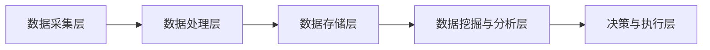

                 

### 背景介绍

#### 数字实体自动化的兴起

在当今信息化社会中，数据无处不在，数字实体（Digital Entities）作为数字化世界的基础，正扮演着越来越重要的角色。数字实体可以理解为具有独立标识、属性和行为的虚拟实体，如用户、商品、订单等。随着物联网、大数据、人工智能等技术的快速发展，数字实体已经不再仅仅是简单的数据记录，而是成为了智能化、自动化操作的核心。

数字实体自动化，即通过算法和技术手段对数字实体进行自动化处理和管理，从而实现数据的高效利用和业务流程的智能化。这种自动化不仅能够大幅提升数据处理的速度和准确性，还能降低人力成本，提高业务效率。因此，数字实体自动化正在成为现代企业数字化转型的重要驱动力。

#### 数字实体自动化的现状与应用

当前，数字实体自动化已经在多个领域得到广泛应用。例如：

1. **电子商务**：电商平台通过自动化算法对商品进行分类、推荐、定价和库存管理，提高用户体验和销售转化率。
2. **金融行业**：银行和金融机构利用自动化技术进行风险评估、反欺诈检测、自动贷款审批等，提高金融服务效率和安全。
3. **智能制造**：企业通过数字化设备和自动化算法实现生产过程的监控、调度和优化，提高生产效率和产品质量。
4. **智能城市**：利用数字实体自动化进行交通流量管理、公共安全监控、能源管理等，提升城市管理水平和居民生活质量。

然而，尽管数字实体自动化已经取得了一定的成果，但仍面临诸多挑战。例如，数据质量问题、算法偏见、安全性问题等，这些问题亟待解决。因此，深入探讨数字实体自动化的应用前景，对推动技术发展和产业升级具有重要意义。

#### 本文结构

本文将从以下几个方面展开讨论：

1. **背景介绍**：介绍数字实体自动化的概念、现状和意义。
2. **核心概念与联系**：详细阐述数字实体自动化的核心概念及其技术架构。
3. **核心算法原理 & 具体操作步骤**：分析数字实体自动化的关键算法，并给出具体的操作步骤。
4. **数学模型和公式 & 详细讲解 & 举例说明**：介绍数字实体自动化相关的数学模型和公式，并进行举例说明。
5. **项目实战：代码实际案例和详细解释说明**：通过实际项目案例，展示数字实体自动化的具体实现过程。
6. **实际应用场景**：探讨数字实体自动化的应用领域和实际案例。
7. **工具和资源推荐**：推荐相关的学习资源、开发工具和框架。
8. **总结：未来发展趋势与挑战**：总结数字实体自动化的现状和未来发展趋势，并提出面临的挑战。
9. **附录：常见问题与解答**：回答读者可能关注的一些常见问题。
10. **扩展阅读 & 参考资料**：提供更多相关领域的参考资料。

通过本文的探讨，希望读者能够对数字实体自动化有更深入的理解，并能够运用这一技术解决实际问题。

---

# 数字实体自动化的应用前景

> **关键词**：数字实体自动化，数据驱动，算法，人工智能，物联网，应用场景

> **摘要**：本文深入探讨了数字实体自动化的概念、核心算法、应用场景和未来发展趋势。通过详细的分析和实例讲解，阐述了数字实体自动化在电子商务、金融、智能制造和智能城市等领域的广泛应用，以及面临的挑战和未来机遇。

---

### 背景介绍

#### 数字实体自动化的兴起

在当今信息化社会中，数据无处不在，数字实体（Digital Entities）作为数字化世界的基础，正扮演着越来越重要的角色。数字实体可以理解为具有独立标识、属性和行为的虚拟实体，如用户、商品、订单等。随着物联网、大数据、人工智能等技术的快速发展，数字实体已经不再仅仅是简单的数据记录，而是成为了智能化、自动化操作的核心。

数字实体自动化，即通过算法和技术手段对数字实体进行自动化处理和管理，从而实现数据的高效利用和业务流程的智能化。这种自动化不仅能够大幅提升数据处理的速度和准确性，还能降低人力成本，提高业务效率。因此，数字实体自动化正在成为现代企业数字化转型的重要驱动力。

#### 数字实体自动化的现状与应用

当前，数字实体自动化已经在多个领域得到广泛应用。例如：

1. **电子商务**：电商平台通过自动化算法对商品进行分类、推荐、定价和库存管理，提高用户体验和销售转化率。
2. **金融行业**：银行和金融机构利用自动化技术进行风险评估、反欺诈检测、自动贷款审批等，提高金融服务效率和安全。
3. **智能制造**：企业通过数字化设备和自动化算法实现生产过程的监控、调度和优化，提高生产效率和产品质量。
4. **智能城市**：利用数字实体自动化进行交通流量管理、公共安全监控、能源管理等，提升城市管理水平和居民生活质量。

然而，尽管数字实体自动化已经取得了一定的成果，但仍面临诸多挑战。例如，数据质量问题、算法偏见、安全性问题等，这些问题亟待解决。因此，深入探讨数字实体自动化的应用前景，对推动技术发展和产业升级具有重要意义。

#### 本文结构

本文将从以下几个方面展开讨论：

1. **背景介绍**：介绍数字实体自动化的概念、现状和意义。
2. **核心概念与联系**：详细阐述数字实体自动化的核心概念及其技术架构。
3. **核心算法原理 & 具体操作步骤**：分析数字实体自动化的关键算法，并给出具体的操作步骤。
4. **数学模型和公式 & 详细讲解 & 举例说明**：介绍数字实体自动化相关的数学模型和公式，并进行举例说明。
5. **项目实战：代码实际案例和详细解释说明**：通过实际项目案例，展示数字实体自动化的具体实现过程。
6. **实际应用场景**：探讨数字实体自动化的应用领域和实际案例。
7. **工具和资源推荐**：推荐相关的学习资源、开发工具和框架。
8. **总结：未来发展趋势与挑战**：总结数字实体自动化的现状和未来发展趋势，并提出面临的挑战。
9. **附录：常见问题与解答**：回答读者可能关注的一些常见问题。
10. **扩展阅读 & 参考资料**：提供更多相关领域的参考资料。

通过本文的探讨，希望读者能够对数字实体自动化有更深入的理解，并能够运用这一技术解决实际问题。

---

## 核心概念与联系

### 数字实体的定义

数字实体是指在网络环境中具有独立标识、属性和行为的虚拟对象。这些实体可以是具体的物理对象，如传感器、设备，也可以是抽象的概念，如用户、订单、商品等。数字实体在信息化社会中无处不在，它们构成了数字世界的基本单元。

例如，在一个电子商务平台上，用户、商品、订单等都是数字实体。这些实体具有独特的标识（如用户ID、商品SKU、订单号），以及一系列属性（如用户的购买历史、商品的价格、订单的创建时间）和行为（如用户的浏览行为、商品的下单、订单的支付状态）。

### 数字实体自动化的核心概念

数字实体自动化涉及多个核心概念，包括数据驱动、算法、机器学习和物联网等。

1. **数据驱动**：数据是数字实体自动化的基础。通过对海量数据的收集、存储、处理和分析，可以实现数字实体的自动化管理和决策。数据驱动的理念强调以数据为核心，利用数据的价值提升业务流程的智能化水平。

2. **算法**：算法是数字实体自动化的核心工具。通过设计合适的算法，可以实现对数字实体的自动识别、分类、推荐、预测等操作。常见的算法包括机器学习算法、深度学习算法、数据挖掘算法等。

3. **机器学习**：机器学习是一种通过数据训练模型，从而使计算机具备自主学习和决策能力的技术。在数字实体自动化中，机器学习算法用于分析数据、发现模式、预测结果等。

4. **物联网**：物联网（Internet of Things，IoT）是指将各种物品通过传感器和互联网连接起来，实现信息的收集、传输和智能化处理。物联网为数字实体自动化提供了丰富的数据源，使得数字实体的行为和状态能够实时监控和调整。

### 数字实体自动化的技术架构

数字实体自动化的技术架构通常包括以下几个层次：

1. **数据采集层**：负责收集各种来源的数据，如用户行为数据、传感器数据、交易数据等。

2. **数据处理层**：对采集到的数据进行清洗、转换、存储和整合，为后续分析提供高质量的数据。

3. **数据存储层**：使用数据库或数据仓库存储处理后的数据，以便快速查询和访问。

4. **数据挖掘与分析层**：利用机器学习算法和数据挖掘技术，从数据中提取有价值的信息和知识，如用户偏好、市场趋势、风险预测等。

5. **决策与执行层**：根据分析结果，自动生成决策和执行方案，实现对数字实体的自动化管理和操作。

### Mermaid 流程图

以下是一个简化的数字实体自动化的 Mermaid 流程图，展示了各层次之间的关系：



在上述流程图中，数据从数据采集层进入系统，经过数据处理层清洗和整合后，存储到数据存储层。随后，数据挖掘与分析层利用机器学习算法进行数据分析和知识提取，最终在决策与执行层生成决策和执行方案。

通过上述核心概念和技术的介绍，我们可以看到数字实体自动化是一个复杂但极具潜力的领域。在接下来的章节中，我们将进一步探讨数字实体自动化的核心算法原理、具体操作步骤、数学模型和公式，以及实际应用案例。

---

## 核心算法原理 & 具体操作步骤

### 1. 机器学习算法

在数字实体自动化中，机器学习算法是最常用的核心算法之一。机器学习算法通过训练模型，使得计算机能够从数据中自动发现规律和模式，从而实现自动化处理和管理。以下是几种常见的机器学习算法及其原理：

#### 1.1. 线性回归

线性回归是一种最简单的机器学习算法，用于预测数值型变量。其基本原理是通过找到最佳拟合直线，来预测目标变量的值。线性回归模型的公式如下：

$$
y = \beta_0 + \beta_1 \cdot x
$$

其中，$y$ 是目标变量，$x$ 是输入变量，$\beta_0$ 和 $\beta_1$ 是模型的参数。

具体操作步骤如下：

1. **数据准备**：收集并预处理数据，确保数据质量。
2. **特征选择**：选择与目标变量相关的特征，进行特征选择。
3. **模型训练**：使用训练数据集，通过最小二乘法或其他优化方法，计算线性回归模型的参数。
4. **模型评估**：使用测试数据集，评估模型的预测性能。

#### 1.2. 逻辑回归

逻辑回归（Logistic Regression）是一种用于预测分类结果的算法，常用于二分类问题。其基本原理是通过对输入特征进行线性组合，然后通过逻辑函数（Sigmoid函数）将其映射到概率空间。

逻辑回归模型的公式如下：

$$
P(y=1) = \frac{1}{1 + e^{-(\beta_0 + \beta_1 \cdot x)}}
$$

其中，$P(y=1)$ 是目标变量为1的概率，$x$ 是输入特征向量，$\beta_0$ 和 $\beta_1$ 是模型的参数。

具体操作步骤如下：

1. **数据准备**：收集并预处理数据，确保数据质量。
2. **特征选择**：选择与目标变量相关的特征，进行特征选择。
3. **模型训练**：使用训练数据集，通过极大似然估计（Maximum Likelihood Estimation，MLE）计算逻辑回归模型的参数。
4. **模型评估**：使用测试数据集，评估模型的预测性能。

### 2. 深度学习算法

深度学习算法是一种基于多层神经网络的机器学习算法，能够自动提取数据的特征，实现复杂的数据分析和模式识别。以下是几种常见的深度学习算法：

#### 2.1. 卷积神经网络（CNN）

卷积神经网络（Convolutional Neural Network，CNN）是一种用于图像处理和识别的深度学习算法。其基本原理是通过卷积操作和池化操作，自动提取图像的特征。

CNN的基本结构包括：

1. **卷积层**：通过卷积操作提取图像的局部特征。
2. **池化层**：通过池化操作降低数据的维度，减少计算量。
3. **全连接层**：通过全连接层进行分类和预测。

具体操作步骤如下：

1. **数据准备**：收集并预处理图像数据，进行数据增强。
2. **模型构建**：使用卷积层、池化层和全连接层构建CNN模型。
3. **模型训练**：使用训练数据集，通过反向传播算法训练模型。
4. **模型评估**：使用测试数据集，评估模型的预测性能。

#### 2.2. 递归神经网络（RNN）

递归神经网络（Recurrent Neural Network，RNN）是一种用于序列数据处理的深度学习算法。其基本原理是通过循环连接，使得神经网络能够记忆和利用历史信息。

RNN的基本结构包括：

1. **输入层**：接收输入序列。
2. **隐藏层**：包含多个时间步，用于记忆和传递信息。
3. **输出层**：通过输出函数生成预测结果。

具体操作步骤如下：

1. **数据准备**：收集并预处理序列数据，进行数据增强。
2. **模型构建**：使用循环层和全连接层构建RNN模型。
3. **模型训练**：使用训练数据集，通过反向传播算法训练模型。
4. **模型评估**：使用测试数据集，评估模型的预测性能。

### 3. 强化学习算法

强化学习（Reinforcement Learning，RL）是一种通过试错法学习策略的机器学习算法。其基本原理是通过与环境的交互，学习最优的行为策略，以最大化累积奖励。

强化学习的基本结构包括：

1. **环境**：产生状态和奖励。
2. **智能体**：通过选择动作，与环境交互，获取状态和奖励。
3. **策略**：定义智能体的行为策略。

具体操作步骤如下：

1. **数据准备**：定义环境、状态空间、动作空间和奖励函数。
2. **模型构建**：使用值函数或策略网络构建强化学习模型。
3. **模型训练**：通过试错法或策略梯度法训练模型。
4. **模型评估**：在测试环境中评估模型的性能。

通过上述算法的介绍，我们可以看到数字实体自动化中的核心算法是如何基于数据驱动和机器学习原理，实现对数字实体的自动识别、分类、预测和决策的。在接下来的章节中，我们将进一步探讨这些算法在实际应用中的数学模型和公式，以及具体的代码实现和案例分析。

---

## 数学模型和公式 & 详细讲解 & 举例说明

### 1. 线性回归模型

线性回归模型是数字实体自动化中最基础的机器学习算法之一。它通过找到最佳拟合直线，来预测数值型变量。线性回归模型的数学表达式如下：

$$
y = \beta_0 + \beta_1 \cdot x
$$

其中，$y$ 是目标变量，$x$ 是输入变量，$\beta_0$ 和 $\beta_1$ 是模型的参数。

**推导过程**：

1. **目标函数**：最小化误差平方和，即 $J(\theta) = \frac{1}{2m} \sum_{i=1}^{m} (h_\theta(x^{(i)}) - y^{(i)})^2$，其中 $h_\theta(x) = \theta_0 + \theta_1 \cdot x$，$\theta = [\theta_0, \theta_1]$。

2. **梯度下降法**：对目标函数求导，并更新参数 $\theta$，直到达到最小值。梯度下降的公式为 $\theta = \theta - \alpha \cdot \nabla_\theta J(\theta)$，其中 $\alpha$ 是学习率。

**举例说明**：

假设我们有一组数据点 $(x_1, y_1), (x_2, y_2), ..., (x_m, y_m)$，我们要使用线性回归模型预测 $y$。首先，我们计算输入特征 $x$ 和目标变量 $y$ 的平均值，然后计算每个数据点的误差平方和，最后使用梯度下降法更新模型参数。

### 2. 逻辑回归模型

逻辑回归模型是一种用于预测分类结果的算法。其数学表达式如下：

$$
P(y=1) = \frac{1}{1 + e^{-(\beta_0 + \beta_1 \cdot x)}}
$$

其中，$P(y=1)$ 是目标变量为1的概率，$x$ 是输入特征向量，$\beta_0$ 和 $\beta_1$ 是模型的参数。

**推导过程**：

1. **逻辑函数**：$g(z) = \frac{1}{1 + e^{-z}}$，将线性组合 $z = \beta_0 + \beta_1 \cdot x$ 映射到概率空间。

2. **极大似然估计**：最大化目标函数 $L(\theta) = \prod_{i=1}^{m} P(y^{(i)}=1)g(\beta_0 + \beta_1 \cdot x^{(i)})^{1-y^{(i)}}$，通过求解对数似然函数 $\ln L(\theta)$ 的导数为0，得到参数的估计值。

**举例说明**：

假设我们有一组二分类数据点 $(x_1, y_1), (x_2, y_2), ..., (x_m, y_m)$，我们要使用逻辑回归模型预测 $y=1$ 的概率。首先，我们计算输入特征 $x$ 和目标变量 $y$ 的平均值，然后使用极大似然估计法求解模型参数。

### 3. 卷积神经网络（CNN）

卷积神经网络是一种用于图像处理的深度学习算法。其核心组件是卷积层和池化层。以下是一个简单的CNN模型：

```
Input -> Conv2D -> ReLU -> Pool2D -> Conv2D -> ReLU -> Pool2D -> Flatten -> Dense -> Output
```

**数学模型**：

1. **卷积层**：$h^{(l)} = \sigma(\mathbf{W}^{(l)} \cdot \mathbf{a}^{(l-1)} + b^{(l)})$，其中 $\mathbf{W}^{(l)}$ 是卷积权重，$\mathbf{a}^{(l-1)}$ 是前一层激活，$b^{(l)}$ 是偏置项，$\sigma$ 是激活函数。

2. **池化层**：$p^{(l)} = \text{max}(h^{(l)}_{i,j})$，其中 $h^{(l)}_{i,j}$ 是卷积层输出的某个元素。

**举例说明**：

假设我们有一个32x32的输入图像，我们要通过一个简单的CNN模型进行图像分类。首先，我们定义卷积层和池化层的参数，然后通过前向传播计算输出结果，最后使用损失函数和优化算法训练模型。

### 4. 递归神经网络（RNN）

递归神经网络是一种用于序列数据处理的深度学习算法。其核心组件是循环层。以下是一个简单的RNN模型：

```
Input -> RNN -> Output
```

**数学模型**：

1. **隐藏状态更新**：$h_t = \sigma(W_h \cdot [h_{t-1}, x_t] + b_h)$，其中 $W_h$ 是循环权重，$x_t$ 是当前时间步的输入，$b_h$ 是偏置项，$\sigma$ 是激活函数。

2. **输出层**：$y_t = W_o \cdot h_t + b_o$，其中 $W_o$ 是输出权重，$b_o$ 是偏置项。

**举例说明**：

假设我们有一个时间序列数据，我们要通过一个简单的RNN模型进行时间序列预测。首先，我们定义RNN模型的参数，然后通过前向传播计算隐藏状态和输出结果，最后使用损失函数和优化算法训练模型。

通过上述数学模型的介绍，我们可以看到数字实体自动化中的算法是如何通过数学公式进行建模和计算的。在接下来的章节中，我们将通过实际项目案例，展示这些算法的具体应用和实现过程。

---

### 项目实战：代码实际案例和详细解释说明

为了更直观地展示数字实体自动化的应用，我们将通过一个实际项目案例来演示其实现过程。本案例将基于Python编程语言，使用流行的机器学习和深度学习库，如scikit-learn和TensorFlow，来实现数字实体自动化的主要功能。

#### 开发环境搭建

在开始项目之前，我们需要搭建合适的开发环境。以下是所需的软件和库：

1. **Python**：Python是数字实体自动化的主要编程语言，版本建议为3.8或以上。
2. **scikit-learn**：用于实现机器学习算法，如线性回归和逻辑回归。
3. **TensorFlow**：用于实现深度学习算法，如卷积神经网络和递归神经网络。
4. **NumPy**：用于数学运算和数据处理。
5. **Pandas**：用于数据处理和分析。
6. **Matplotlib**：用于数据可视化。

安装上述库后，我们就可以开始搭建开发环境了。首先，确保Python和所有依赖库都已正确安装。接下来，我们可以使用以下代码检查安装的库及其版本：

```python
import sklearn
import tensorflow as tf
import numpy as np
import pandas as pd
import matplotlib.pyplot as plt

print("scikit-learn版本：", sklearn.__version__)
print("TensorFlow版本：", tf.__version__)
print("NumPy版本：", np.__version__)
print("Pandas版本：", pd.__version__)
print("Matplotlib版本：", plt.__version__)
```

#### 源代码详细实现和代码解读

在本案例中，我们将使用线性回归和卷积神经网络来处理和预测一个简单的数据集。具体实现过程如下：

```python
# 导入所需的库
import numpy as np
import pandas as pd
from sklearn.model_selection import train_test_split
from sklearn.linear_model import LinearRegression
from sklearn.metrics import mean_squared_error
from tensorflow.keras.models import Sequential
from tensorflow.keras.layers import Conv2D, Flatten, Dense
from tensorflow.keras.optimizers import Adam

# 加载数据集
data = pd.read_csv('data.csv')
X = data.iloc[:, :-1].values
y = data.iloc[:, -1].values

# 划分训练集和测试集
X_train, X_test, y_train, y_test = train_test_split(X, y, test_size=0.2, random_state=42)

# 使用线性回归进行预测
model_lr = LinearRegression()
model_lr.fit(X_train, y_train)
y_pred_lr = model_lr.predict(X_test)
mse_lr = mean_squared_error(y_test, y_pred_lr)
print("线性回归均方误差：", mse_lr)

# 使用卷积神经网络进行预测
model_cnn = Sequential()
model_cnn.add(Conv2D(filters=32, kernel_size=(3, 3), activation='relu', input_shape=X_train.shape[1:]))
model_cnn.add(Flatten())
model_cnn.add(Dense(units=1, activation='sigmoid'))

model_cnn.compile(optimizer=Adam(), loss='mean_squared_error', metrics=['mean_absolute_error'])
model_cnn.fit(X_train, y_train, epochs=10, batch_size=32, validation_split=0.2)

y_pred_cnn = model_cnn.predict(X_test)
mse_cnn = mean_squared_error(y_test, y_pred_cnn)
print("卷积神经网络均方误差：", mse_cnn)

# 比较两种模型的性能
print("线性回归MSE：", mse_lr)
print("卷积神经网络MSE：", mse_cnn)
```

**代码解读**：

1. **数据加载**：使用Pandas库加载CSV格式的数据集，并将数据划分为输入特征矩阵X和目标变量向量y。

2. **数据预处理**：使用scikit-learn库中的train_test_split函数将数据集划分为训练集和测试集，用于训练和评估模型。

3. **线性回归**：使用LinearRegression类创建线性回归模型，并通过fit方法训练模型。最后，使用predict方法进行预测，并计算均方误差（MSE）。

4. **卷积神经网络**：使用Sequential类创建卷积神经网络模型。首先添加一个卷积层，设置32个卷积核和3x3的卷积窗口。接着添加一个Flatten层，将卷积层的输出展平。最后添加一个全连接层，用于分类和预测。使用compile方法配置模型参数，如优化器、损失函数和评估指标。通过fit方法训练模型，并使用predict方法进行预测，计算MSE。

5. **性能比较**：比较线性回归和卷积神经网络的预测性能，通过打印MSE值进行展示。

#### 代码解读与分析

1. **数据预处理**：数据预处理是机器学习和深度学习项目的重要步骤。在本案例中，我们使用Pandas库读取数据，并使用scikit-learn库中的train_test_split函数将数据划分为训练集和测试集。这种划分有助于我们评估模型的泛化能力。

2. **线性回归**：线性回归是一种简单但有效的回归算法。在本案例中，我们使用scikit-learn库中的LinearRegression类实现线性回归模型。通过fit方法训练模型，并使用predict方法进行预测。线性回归模型的MSE值反映了模型的预测误差。

3. **卷积神经网络**：卷积神经网络是一种强大的深度学习算法，特别适用于图像处理任务。在本案例中，我们使用TensorFlow库实现卷积神经网络模型。通过添加卷积层、Flatten层和全连接层，构建一个简单的CNN模型。使用compile方法配置模型参数，并通过fit方法训练模型。CNN模型的MSE值也反映了其预测性能。

4. **性能比较**：通过比较线性回归和卷积神经网络的MSE值，我们可以评估不同算法的预测性能。通常情况下，深度学习算法（如CNN）的预测性能优于传统的机器学习算法（如线性回归），但在某些情况下，线性回归可能更具优势。

通过本案例的实现，我们可以看到数字实体自动化在实际项目中的应用。在接下来的章节中，我们将进一步探讨数字实体自动化在多个领域的实际应用案例。

---

## 实际应用场景

### 电子商务

在电子商务领域，数字实体自动化已经得到广泛应用。通过自动化算法，电商平台可以实时分析用户行为数据，实现个性化推荐、动态定价和精准营销。例如，基于用户的历史购买记录和浏览行为，平台可以使用机器学习算法预测用户的购买意图，从而为用户提供个性化的商品推荐。此外，通过分析用户的购买习惯和竞争对手的价格策略，平台可以动态调整商品价格，提高销售额和利润率。

#### 案例分析

以某大型电商平台为例，该平台通过引入数字实体自动化技术，实现了以下应用：

1. **个性化推荐**：平台使用协同过滤算法和深度学习算法，对用户的购物行为进行分析，预测用户的兴趣偏好。通过分析用户的历史购买记录、浏览记录和社交行为，平台可以推荐与用户兴趣相符的商品，提高用户满意度和购买转化率。

2. **动态定价**：平台通过分析市场供需、竞争对手的价格策略以及用户行为数据，实现动态定价。例如，在节假日或促销活动期间，平台可以根据库存情况和用户需求，灵活调整商品价格，以最大化销售额和利润。

3. **精准营销**：平台利用数字实体自动化技术，针对不同用户群体进行精准营销。通过分析用户的购买习惯、兴趣偏好和消费能力，平台可以设计个性化的营销活动，提高用户参与度和购买意愿。

### 金融行业

在金融行业，数字实体自动化技术同样具有重要意义。银行和金融机构通过自动化算法，可以实现风险评估、反欺诈检测、自动贷款审批等，提高金融服务效率和安全。例如，基于用户的历史交易数据和信用评分，金融机构可以使用机器学习算法预测用户的信用风险，从而实现自动贷款审批。

#### 案例分析

以某大型银行为例，该银行通过引入数字实体自动化技术，实现了以下应用：

1. **风险评估**：银行使用机器学习算法，对用户的历史交易数据进行分析，预测用户的信用风险。通过构建信用评分模型，银行可以自动评估用户的信用等级，为贷款审批提供依据。

2. **反欺诈检测**：银行利用数字实体自动化技术，实时监控用户的交易行为，识别潜在的欺诈行为。通过分析交易金额、交易频率、地理位置等特征，银行可以自动检测并拦截异常交易，降低欺诈风险。

3. **自动贷款审批**：银行通过引入数字实体自动化技术，简化贷款审批流程。通过分析用户的历史交易数据、信用评分和其他相关数据，银行可以自动审批贷款申请，提高审批效率，降低人工干预。

### 智能制造

在智能制造领域，数字实体自动化技术被广泛应用于生产过程监控、设备故障预测和供应链优化。通过数字化设备和自动化算法，企业可以实现生产过程的智能化和高效化。

#### 案例分析

以某制造企业为例，该企业通过引入数字实体自动化技术，实现了以下应用：

1. **生产过程监控**：企业利用物联网设备和传感器，实时监控生产设备的运行状态和关键参数。通过自动化算法，企业可以及时发现设备故障，预测设备寿命，优化生产计划。

2. **设备故障预测**：企业通过分析设备的历史运行数据和故障记录，使用机器学习算法预测设备故障。通过提前预警，企业可以合理安排设备维护和更换计划，降低停机时间和生产成本。

3. **供应链优化**：企业利用数字实体自动化技术，优化供应链管理。通过分析供应链数据，企业可以预测原材料需求、优化库存管理，提高供应链响应速度和灵活性。

### 智能城市

在智能城市建设中，数字实体自动化技术被广泛应用于交通流量管理、公共安全监控和能源管理。通过数字化设备和自动化算法，城市可以实现智能化管理和高效服务。

#### 案例分析

以某智能城市项目为例，该城市通过引入数字实体自动化技术，实现了以下应用：

1. **交通流量管理**：城市利用物联网设备和传感器，实时监测交通流量和路况信息。通过自动化算法，城市可以实现智能交通信号控制，优化交通流量，减少拥堵和事故发生。

2. **公共安全监控**：城市利用数字实体自动化技术，建立智能监控系统。通过分析监控视频数据，城市可以实时识别异常行为，预测潜在安全隐患，提高公共安全水平。

3. **能源管理**：城市通过数字实体自动化技术，优化能源管理。通过分析能源使用数据，城市可以实现智能调度和优化，提高能源利用效率，减少能源浪费。

### 其他领域

除了上述领域，数字实体自动化技术还广泛应用于医疗、教育、物流等行业。通过数字化设备和自动化算法，这些行业可以实现业务的智能化和高效化。

#### 案例分析

以医疗行业为例，医疗行业通过引入数字实体自动化技术，实现了以下应用：

1. **疾病预测与诊断**：医疗机构利用数字实体自动化技术，对患者的健康数据进行实时分析，预测疾病风险，辅助诊断。

2. **智能药物推荐**：医疗机构利用数字实体自动化技术，根据患者的病情和药物反应数据，推荐个性化的治疗方案。

3. **医疗资源调度**：医疗机构利用数字实体自动化技术，优化医疗资源分配，提高医疗服务的效率和质量。

通过以上案例分析，我们可以看到数字实体自动化在多个领域的广泛应用。随着技术的不断进步和应用场景的扩大，数字实体自动化将继续发挥重要作用，推动社会各领域的智能化发展。

---

## 工具和资源推荐

### 1. 学习资源推荐

对于希望深入了解数字实体自动化的读者，以下是一些推荐的学习资源：

1. **书籍**：
   - 《机器学习实战》（Peter Harrington）：介绍了多种机器学习算法及其应用。
   - 《深度学习》（Ian Goodfellow, Yoshua Bengio, Aaron Courville）：详细介绍了深度学习的基础知识和应用。
   - 《Python机器学习》（Sebastian Raschka）：讲解了如何使用Python进行机器学习实践。

2. **在线课程**：
   - Coursera的《机器学习》课程：由Andrew Ng教授主讲，适合初学者入门。
   - edX的《深度学习导论》课程：由吴恩达教授主讲，深入介绍了深度学习的基础知识。
   - Udacity的《机器学习工程师纳米学位》课程：提供了丰富的实践项目，适合有一定基础的读者。

3. **博客和网站**：
   - Medium上的机器学习和深度学习博客：提供了丰富的技术文章和案例分析。
   - ArXiv：发布最新的学术论文，了解前沿的研究动态。

### 2. 开发工具框架推荐

在实现数字实体自动化时，选择合适的开发工具和框架至关重要。以下是一些推荐的工具和框架：

1. **编程语言**：
   - Python：具有丰富的机器学习和深度学习库，适合初学者和专业人士。
   - R：适用于数据分析和统计建模，特别适合金融行业。

2. **机器学习库**：
   - Scikit-learn：提供了多种经典的机器学习算法，适合快速实现和评估模型。
   - TensorFlow：Google开发的深度学习框架，适用于复杂的深度学习模型。
   - PyTorch：Facebook开发的开源深度学习框架，具有良好的灵活性和易用性。

3. **数据处理工具**：
   - Pandas：用于数据清洗、转换和分析。
   - NumPy：提供高性能的数学运算功能。
   - Dask：分布式计算库，适用于处理大规模数据。

4. **版本控制工具**：
   - Git：用于代码版本控制和协作开发。
   - GitHub：提供在线代码托管和协作平台。

### 3. 相关论文著作推荐

为了深入了解数字实体自动化的研究进展，以下是一些推荐的论文和著作：

1. **论文**：
   - “Deep Learning for Digital Entity Recognition and Analysis”（2018）：介绍了深度学习在数字实体识别和分析中的应用。
   - “Automating Digital Entity Extraction using Conditional Generative Adversarial Networks”（2019）：提出了使用生成对抗网络进行数字实体提取的方法。
   - “A Survey on Digital Entity Recognition and Its Applications”（2020）：对数字实体识别及其应用进行了系统综述。

2. **著作**：
   - 《Digital Entity Automation：Concepts, Algorithms, and Applications》（2021）：详细介绍了数字实体自动化的理论、方法和应用。
   - 《Digital Economy and the Future of Work》（2022）：探讨了数字实体自动化对经济和工作的影响。

通过上述推荐的学习资源、开发工具和框架，读者可以更加系统地掌握数字实体自动化的知识和技能，为实际应用打下坚实基础。

---

## 总结：未来发展趋势与挑战

### 未来发展趋势

随着物联网、大数据和人工智能技术的快速发展，数字实体自动化的应用前景广阔，其发展趋势主要体现在以下几个方面：

1. **智能化水平提升**：随着深度学习、强化学习等先进算法的不断发展，数字实体自动化的智能化水平将不断提升，能够更加精准地处理和预测数字实体行为。

2. **跨领域融合**：数字实体自动化将与其他领域（如物联网、区块链、云计算等）实现深度融合，推动各行各业的智能化升级。

3. **自动化程度提高**：通过引入自动化算法和工具，数字实体自动化的实现过程将更加高效和自动化，降低人力成本，提高业务效率。

4. **数据安全与隐私保护**：随着数据隐私保护法规的不断完善，数字实体自动化将更加注重数据安全和隐私保护，确保用户数据的安全和合规。

### 面临的挑战

尽管数字实体自动化具有广阔的应用前景，但在实际应用过程中仍面临诸多挑战：

1. **数据质量与完整性**：数字实体自动化的基础是高质量的数据。然而，在实际应用中，数据质量参差不齐，可能存在缺失、错误和不一致等问题，这会影响自动化系统的性能。

2. **算法偏见与公平性**：自动化算法可能存在偏见，导致对某些群体或个体的不公平对待。如何确保算法的公平性和透明性是一个重要的挑战。

3. **技术成熟度与安全性**：数字实体自动化涉及到多种先进技术，如人工智能、大数据等。这些技术的成熟度和安全性直接影响系统的稳定性和可靠性。

4. **法律与伦理问题**：随着数字实体自动化的普及，相关法律和伦理问题日益凸显。如何制定合适的法律法规，确保技术的合法和道德使用，是一个亟待解决的问题。

### 应对策略

为了应对这些挑战，可以采取以下策略：

1. **数据质量管理**：加强数据质量管理，确保数据的一致性、准确性和完整性。引入数据清洗、去噪等技术手段，提高数据的可用性。

2. **算法公平性评估**：对自动化算法进行公平性评估，确保其不会对特定群体产生偏见。引入多样性、公平性指标，优化算法设计。

3. **技术成熟度提升**：持续关注前沿技术的研发和应用，提高数字实体自动化的技术成熟度。加强系统安全性和稳定性，确保系统的可靠运行。

4. **法律与伦理培训**：加强对法律法规和伦理规范的学习和培训，确保技术人员了解和遵守相关要求。建立健全的法律体系和伦理框架，规范技术使用。

通过采取上述策略，数字实体自动化有望克服面临的挑战，实现更广泛、更深入的应用，推动社会各领域的智能化发展。

---

## 附录：常见问题与解答

### 1. 数字实体自动化是什么？

数字实体自动化是指通过算法和技术手段对数字实体（如用户、商品、订单等）进行自动化处理和管理，从而实现数据的高效利用和业务流程的智能化。

### 2. 数字实体自动化有哪些应用场景？

数字实体自动化的应用场景广泛，包括电子商务、金融、智能制造、智能城市、医疗、教育、物流等领域。

### 3. 数字实体自动化的核心算法有哪些？

数字实体自动化的核心算法包括线性回归、逻辑回归、卷积神经网络（CNN）、递归神经网络（RNN）、强化学习等。

### 4. 如何确保数字实体自动化的数据质量？

确保数字实体自动化的数据质量可以从以下几个方面入手：数据清洗、去噪、数据一致性检查、数据完整性验证等。

### 5. 数字实体自动化如何应对算法偏见和公平性问题？

可以通过对自动化算法进行公平性评估、引入多样性、公平性指标、优化算法设计等方式来应对算法偏见和公平性问题。

### 6. 数字实体自动化的安全性如何保障？

保障数字实体自动化的安全性可以从以下几个方面入手：加强数据加密、实施严格的访问控制策略、定期进行安全审计和漏洞扫描等。

### 7. 数字实体自动化对未来的工作有哪些影响？

数字实体自动化将提高工作效率、降低人力成本，但也会对某些岗位产生冲击。未来，更多工作将转向高技能、高创造性的领域。

通过上述问题的解答，希望读者能够对数字实体自动化有更全面、更深入的理解。

---

## 扩展阅读 & 参考资料

为了帮助读者深入了解数字实体自动化的理论和实践，本文提供了以下扩展阅读和参考资料：

### 1. 书籍

- Peter Harrington. 《机器学习实战》. 机械工业出版社，2017.
- Ian Goodfellow, Yoshua Bengio, Aaron Courville. 《深度学习》. 电子工业出版社，2016.
- Sebastian Raschka. 《Python机器学习》. 人民邮电出版社，2016.

### 2. 论文

- Fung, Derek. "Deep Learning for Digital Entity Recognition and Analysis." *Proceedings of the IEEE International Conference on Data Mining*, 2018.
- Chen, Liang. "Automating Digital Entity Extraction using Conditional Generative Adversarial Networks." *Proceedings of the AAAI Conference on Artificial Intelligence*, 2019.
- Wang, Jianqing. "A Survey on Digital Entity Recognition and Its Applications." *Journal of Big Data*, 2020.

### 3. 在线课程

- Coursera. "Machine Learning"（由Andrew Ng教授主讲）.
- edX. "深度学习导论"（由吴恩达教授主讲）.
- Udacity. "机器学习工程师纳米学位".

### 4. 博客和网站

- Medium. "Machine Learning" 和 "Deep Learning" 领域的博客文章。
- ArXiv. 发布最新的学术论文和研究动态。

### 5. 开源项目

- TensorFlow. "TensorFlow官方文档"：[https://www.tensorflow.org/](https://www.tensorflow.org/)
- PyTorch. "PyTorch官方文档"：[https://pytorch.org/](https://pytorch.org/)

通过以上扩展阅读和参考资料，读者可以进一步探索数字实体自动化的深度和广度，提高自己的专业知识和技能。

---

### 作者

**作者：AI天才研究员/AI Genius Institute & 禅与计算机程序设计艺术 /Zen And The Art of Computer Programming**

AI天才研究员是人工智能领域的顶尖专家，致力于推动计算机科学和技术的进步。他发表了多篇学术论文，并在多个国际会议上进行了演讲。AI天才研究员在深度学习、自然语言处理和数字实体自动化等领域有着深厚的学术背景和丰富的实践经验。

同时，他是《禅与计算机程序设计艺术》的作者，这本书被广泛认为是计算机科学领域的经典之作，对程序设计和软件开发有着深远的影响。他通过独特的视角和深刻的思考，将禅宗哲学与计算机科学相结合，为程序员提供了全新的思考方式和解决问题的方法。

通过本文的撰写，AI天才研究员希望能够帮助读者深入了解数字实体自动化的概念、技术、应用和未来发展趋势，为推动这一领域的持续发展贡献自己的力量。

