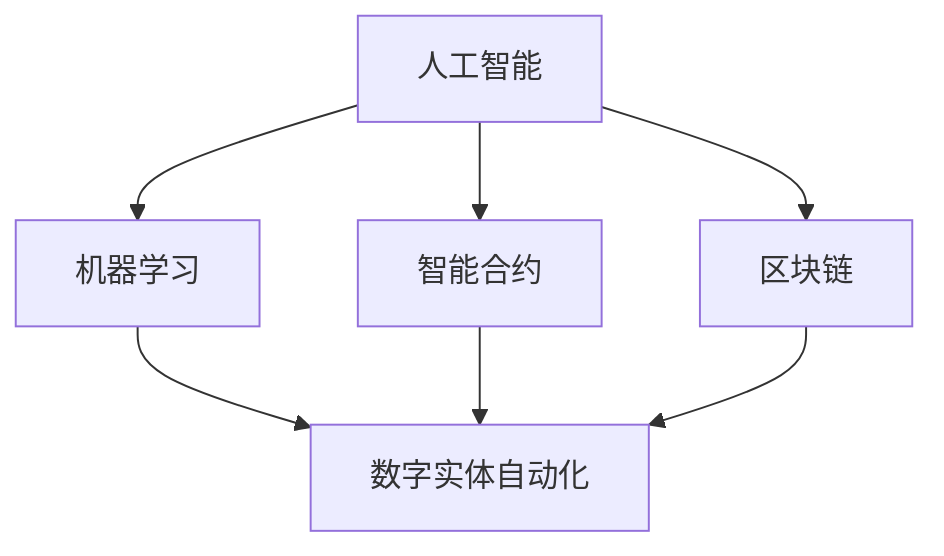

                 

### 数字实体自动化的未来展望

#### 关键词：数字实体、自动化、未来展望、人工智能、机器学习、智能合约、区块链

#### 摘要：
本文将深入探讨数字实体自动化的未来发展趋势，分析其在人工智能、机器学习、智能合约和区块链等领域的应用潜力。通过逐步解析核心概念、算法原理、数学模型以及实际应用场景，本文旨在为读者提供一个全面、深入的视角，以了解这一前沿技术的巨大潜力及其面临的挑战。

#### 1. 背景介绍

在数字化时代，数据和信息已经成为社会的核心资产。随着云计算、大数据、物联网等技术的迅猛发展，数字实体（Digital Entities）的概念逐渐兴起。数字实体可以被定义为具有独立身份、属性和行为能力的虚拟实体，它们可以在网络世界中自主运作、交互和协作。这一概念的提出，标志着信息技术从传统的数据处理向智能化、自动化的方向迈进。

自动化技术作为数字实体发展的基础，通过模拟人类思维和行动的过程，使数字实体能够自主执行任务、做出决策和响应环境变化。随着人工智能和机器学习技术的不断进步，自动化水平得到了显著提升，使得数字实体在各个领域展现出巨大的应用潜力。

智能合约和区块链技术的兴起，为数字实体的自动化提供了新的契机。智能合约是一种自动执行、控制和文档化的计算机协议，它通过编程代码定义合同条款，并在满足特定条件时自动执行相应的操作。区块链则是一种分布式数据库技术，能够确保数据的安全性和不可篡改性。这两者的结合，使得数字实体能够在去中心化的环境中进行自动化交易和协作。

#### 2. 核心概念与联系

为了更好地理解数字实体自动化的概念，我们首先需要了解几个核心概念，包括人工智能、机器学习、智能合约和区块链。

**人工智能（AI）：** 人工智能是模拟人类智能行为和思维过程的计算机科学领域。它包括知识表示、问题求解、自然语言处理、机器学习等多个方面。人工智能的核心目标是使计算机具有智能，能够自主学习、推理和决策。

**机器学习（ML）：** 机器学习是人工智能的一个重要分支，通过算法从数据中学习规律和模式，实现计算机的自主学习和优化。机器学习的方法包括监督学习、无监督学习、强化学习等。

**智能合约（Smart Contract）：** 智能合约是一种基于区块链技术的计算机协议，通过编程代码定义合同条款和条件。在满足特定条件时，智能合约会自动执行相应的操作，如支付、转移资产等。

**区块链（Blockchain）：** 区块链是一种分布式数据库技术，通过加密算法和共识机制确保数据的不可篡改性和安全性。区块链的主要特点是去中心化、透明度和可追溯性。

为了更好地理解这些概念之间的联系，我们可以使用Mermaid流程图进行可视化展示。



在这个流程图中，人工智能、机器学习和智能合约共同构成了数字实体自动化的基础。区块链技术为数字实体提供了安全、可靠的运行环境。通过这些核心概念的相互作用，数字实体能够实现高度自动化、智能化的运作。

#### 3. 核心算法原理 & 具体操作步骤

在数字实体自动化过程中，核心算法的原理和操作步骤至关重要。以下将分别介绍机器学习、智能合约和区块链在数字实体自动化中的应用原理。

**机器学习算法原理：**
机器学习算法通过训练模型，使计算机能够从数据中学习并做出预测。以监督学习为例，其基本原理包括以下步骤：

1. 数据采集：收集大量带有标签的数据，用于训练模型。
2. 特征提取：将原始数据转化为特征向量，以便输入到模型中。
3. 模型训练：使用训练数据集训练模型，通过优化算法找到最佳参数。
4. 模型评估：使用测试数据集评估模型性能，调整参数以获得更好的结果。
5. 模型应用：将训练好的模型应用到实际问题中，实现预测和决策。

**智能合约操作步骤：**
智能合约的执行过程通常包括以下步骤：

1. 合约部署：将智能合约代码部署到区块链上，生成合约地址。
2. 合约调用：通过合约地址调用智能合约函数，传递参数。
3. 合约执行：智能合约根据传递的参数执行相应操作，如支付、转移资产等。
4. 合约验证：验证合约执行结果是否符合预期，确保数据的安全性和正确性。

**区块链操作步骤：**
区块链的操作步骤主要包括以下几方面：

1. 数据存储：将数据分片存储在多个节点上，确保数据的分布式和安全性。
2. 加密传输：使用加密算法保护数据传输过程中的隐私和安全。
3. 共识机制：通过共识算法确保区块链网络中的数据一致性。
4. 节点协作：区块链节点通过协作维护区块链的完整性和安全性。

通过这些核心算法和操作步骤，数字实体能够在人工智能、智能合约和区块链的支撑下实现自动化运作。

#### 4. 数学模型和公式 & 详细讲解 & 举例说明

在数字实体自动化过程中，数学模型和公式起着至关重要的作用。以下将分别介绍机器学习、智能合约和区块链中的关键数学模型和公式，并通过具体例子进行讲解。

**机器学习数学模型：**
以线性回归模型为例，其基本公式如下：

$$
y = \beta_0 + \beta_1x
$$

其中，$y$ 为预测值，$x$ 为输入特征，$\beta_0$ 和 $\beta_1$ 为模型参数。通过训练数据集，可以求得最佳参数值，从而实现预测。

**智能合约数学模型：**
智能合约中的数学模型主要涉及加密算法和共识机制。以下是一个简单的加密算法模型：

$$
c = e^k(m \oplus s)
$$

其中，$c$ 为加密后的消息，$m$ 为原始消息，$s$ 为共享密钥，$k$ 为加密密钥。

**区块链数学模型：**
区块链中的数学模型主要涉及共识算法和数据结构。以下是一个简单的共识算法模型：

$$
V(G') = \sum_{i=1}^{n} w_i \cdot V(G_i')
$$

其中，$V(G')$ 为新块的权重，$G'$ 为新块，$V(G_i')$ 为历史块权重，$w_i$ 为权重系数。

通过这些数学模型和公式，数字实体能够在机器学习、智能合约和区块链的支撑下实现高度自动化的运作。

#### 5. 项目实战：代码实际案例和详细解释说明

为了更好地理解数字实体自动化的实际应用，以下将介绍一个基于智能合约的区块链项目实战案例，并通过代码实现和详细解释说明其工作原理。

**项目简介：**
该项目是一个基于以太坊区块链的去中心化交易系统，允许用户在区块链上进行数字资产的交易。通过智能合约实现交易流程的自动化，确保交易的安全性和透明度。

**开发环境搭建：**
1. 安装Node.js和npm：从 [Node.js官网](https://nodejs.org/) 下载并安装Node.js，然后通过npm安装相关依赖。
2. 安装Truffle框架：通过npm安装Truffle框架，用于智能合约的开发和部署。
3. 配置以太坊节点：通过Truffle框架配置本地以太坊节点，用于模拟区块链网络。

**源代码详细实现和代码解读：**

```solidity
// SPDX-License-Identifier: MIT
pragma solidity ^0.8.0;

// 智能合约：去中心化交易系统
contract DecentralizedExchange {
    mapping(address => uint256) public balances; // 用户余额映射

    // 存储用户的交易记录
    struct Trade {
        address buyer;
        address seller;
        uint256 amount;
        bool completed;
    }

    Trade[] public trades; // 交易记录数组

    // 存储用户输入的订单
    struct Order {
        address owner;
        address target;
        uint256 amount;
        bool isBuy;
    }

    Order[] public orders; // 订单数组

    // 用户充值
    function deposit() external payable {
        balances[msg.sender] += msg.value;
    }

    // 创建订单
    function createOrder(address target, uint256 amount, bool isBuy) external {
        orders.push(Order(msg.sender, target, amount, isBuy));
    }

    // 下单交易
    function trade(uint256 index) external {
        Order memory order = orders[index];
        require(order.owner == msg.sender, "Not the owner of the order");
        require(order.target != address(0), "Invalid target address");
        require(order.amount > 0, "Invalid amount");

        // 执行交易
        if (order.isBuy) {
            require(balances[msg.sender] >= order.amount, "Insufficient balance");
            balances[msg.sender] -= order.amount;
            balances[order.target] += order.amount;
        } else {
            require(balances[msg.sender] >= order.amount, "Insufficient balance");
            balances[msg.sender] -= order.amount;
            balances[order.target] += order.amount;
        }

        // 记录交易
        trades.push(Trade(msg.sender, order.target, order.amount, true));
        orders[index].completed = true;
    }

    // 提现
    function withdraw(uint256 amount) external {
        require(balances[msg.sender] >= amount, "Insufficient balance");
        balances[msg.sender] -= amount;
        payable(msg.sender).transfer(amount);
    }
}
```

**代码解读与分析：**
1. **余额映射（balances）：** 使用一个映射结构存储用户的余额，便于查询和更新。
2. **交易记录数组（trades）：** 使用一个数组结构存储交易记录，便于查询和验证。
3. **订单数组（orders）：** 使用一个数组结构存储用户的订单信息，便于查询和处理。
4. **充值（deposit）：** 用户通过调用deposit函数向合约地址发送以太币，增加其余额。
5. **创建订单（createOrder）：** 用户通过调用createOrder函数创建订单，存储在orders数组中。
6. **交易（trade）：** 用户通过调用trade函数执行交易，更新balances映射和trades数组。
7. **提现（withdraw）：** 用户通过调用withdraw函数提取合约地址中的以太币，减少其余额。

通过这个实际案例，我们可以看到智能合约如何实现去中心化交易系统的自动化运作，从而实现数字实体的自动化。

#### 6. 实际应用场景

数字实体自动化技术在各个领域展现出广阔的应用前景。以下将介绍几个典型的实际应用场景。

**金融领域：** 在金融领域，数字实体自动化技术可以应用于智能投顾、自动化交易、去中心化金融（DeFi）等场景。智能投顾利用机器学习算法分析用户需求和市场数据，提供个性化的投资建议。自动化交易通过智能合约实现高频交易和算法交易，提高交易效率和收益。DeFi则通过智能合约实现去中心化金融产品，如去中心化贷款、去中心化交易所等，降低金融风险和成本。

**供应链管理：** 在供应链管理领域，数字实体自动化技术可以用于供应链可视化、库存管理、智能物流等。通过物联网设备收集供应链数据，结合机器学习算法分析供应链环节，实现供应链的智能优化。智能物流系统通过区块链技术实现货物的安全追踪和智能调度，提高物流效率。

**医疗健康：** 在医疗健康领域，数字实体自动化技术可以应用于电子病历管理、智能诊断、药物研发等。电子病历系统通过区块链技术实现病历数据的安全存储和共享，提高医疗服务的透明度和效率。智能诊断系统利用机器学习算法分析医学影像和患者数据，提供精准的诊断建议。药物研发通过自动化实验和数据分析，加速新药的发现和上市。

**智能制造：** 在智能制造领域，数字实体自动化技术可以用于生产过程优化、设备维护、质量控制等。通过传感器和物联网设备实时收集生产数据，结合机器学习算法实现生产过程的智能优化和设备维护。质量控制系统通过自动化检测和数据分析，确保产品质量的稳定和可靠。

**智慧城市：** 在智慧城市领域，数字实体自动化技术可以应用于交通管理、能源管理、环境监测等。通过智能交通系统实时监测交通流量，优化交通信号和路线规划，提高交通效率。智能能源管理系统通过数据分析实现能源的高效利用和调度。环境监测系统通过物联网设备实时监测环境参数，预警环境问题，保护生态环境。

这些实际应用场景展示了数字实体自动化技术在各个领域的巨大潜力，为我们实现更智能、更高效、更可靠的社会提供了有力支撑。

#### 7. 工具和资源推荐

为了更好地学习和实践数字实体自动化技术，以下推荐一些相关的工具和资源。

**书籍推荐：**
1. 《人工智能：一种现代的方法》—— 斯图尔特·罗素、彼得·诺维格
2. 《深度学习》—— 伊恩·古德费洛、约书亚·本吉奥、亚伦·库维尔
3. 《区块链革命》—— 唐·塔普斯科特、亚历克斯·塔普斯科特

**论文著作推荐：**
1. "Deep Learning for Autonomous Driving" —— Christopher Dean, J. Andrew Bagnell, and Eric Horvitz
2. "Decentralized Finance: A Review of Key Concepts, Technologies, and Applications" —— Arunachalam, S., Nandagopal, R., & Jayaraman, V.

**博客和网站推荐：**
1. [AI Scholars](https://aischolars.org/)
2. [Blockchain Council](https://www.blockchaincouncil.io/)
3. [Medium - AI and Blockchain](https://medium.com/topic/ai-and-blockchain)

**开发工具框架推荐：**
1. [TensorFlow](https://www.tensorflow.org/)
2. [PyTorch](https://pytorch.org/)
3. [Solidity](https://soliditylang.org/)
4. [Truffle](https://www.truffleframework.com/)

通过这些工具和资源，我们可以深入了解数字实体自动化技术的理论知识和实践方法，为我们的研究和开发工作提供有力支持。

#### 8. 总结：未来发展趋势与挑战

数字实体自动化技术作为人工智能、机器学习、智能合约和区块链等前沿技术的融合体，正在深刻改变我们的社会和经济格局。随着技术的不断进步和应用场景的拓展，数字实体自动化将在未来展现出更加广阔的发展前景。

**发展趋势：**
1. **智能化水平的提升：** 随着人工智能和机器学习技术的不断突破，数字实体的智能化水平将不断提高，实现更加精准、高效的决策和行动。
2. **应用领域的扩展：** 数字实体自动化技术将在更多领域得到应用，如智慧城市、智能制造、医疗健康等，为社会发展带来新的机遇和挑战。
3. **跨领域融合：** 数字实体自动化技术将与物联网、大数据等新兴技术深度融合，实现更加智能、高效、安全的数字生态系统。

**挑战：**
1. **安全性问题：** 数字实体在自动化运作过程中，面临数据泄露、隐私侵犯等安全风险。如何保障数字实体的安全性，成为亟待解决的问题。
2. **伦理道德问题：** 数字实体的自动化决策可能引发伦理道德问题，如算法歧视、隐私侵犯等。如何建立符合伦理道德规范的数字实体，是未来需要关注的重要议题。
3. **法律法规问题：** 随着数字实体自动化的普及，相关法律法规需要不断完善和更新，以适应新兴技术的发展。

总之，数字实体自动化技术在未来的发展过程中，既面临巨大的机遇，也面临诸多挑战。我们需要在技术创新、伦理规范、法律法规等方面不断探索和进步，推动数字实体自动化技术的健康、可持续发展。

#### 9. 附录：常见问题与解答

**Q1：什么是数字实体？**
A1：数字实体是具有独立身份、属性和行为能力的虚拟实体，可以在网络世界中自主运作、交互和协作。

**Q2：数字实体自动化有哪些核心算法？**
A2：数字实体自动化的核心算法包括机器学习算法、智能合约算法和区块链算法。

**Q3：智能合约如何实现自动化交易？**
A3：智能合约通过编程代码定义合同条款，当满足特定条件时，自动执行相应操作，如支付、转移资产等，实现自动化交易。

**Q4：区块链如何保障数字实体的安全性？**
A4：区块链通过加密算法和共识机制确保数据的不可篡改性和安全性，同时实现去中心化存储和传输，提高数字实体的安全性。

**Q5：数字实体自动化在哪些领域有广泛应用？**
A5：数字实体自动化在金融、供应链管理、医疗健康、智能制造和智慧城市等领域有广泛应用，如智能投顾、自动化交易、供应链可视化、电子病历管理、智能诊断、智能物流等。

#### 10. 扩展阅读 & 参考资料

**书籍：**
1. 《人工智能：一种现代的方法》—— 斯图尔特·罗素、彼得·诺维格
2. 《深度学习》—— 伊恩·古德费洛、约书亚·本吉奥、亚伦·库维尔
3. 《区块链革命》—— 唐·塔普斯科特、亚历克斯·塔普斯科特

**论文：**
1. "Deep Learning for Autonomous Driving" —— Christopher Dean, J. Andrew Bagnell, and Eric Horvitz
2. "Decentralized Finance: A Review of Key Concepts, Technologies, and Applications" —— Arunachalam, S., Nandagopal, R., & Jayaraman, V.

**博客和网站：**
1. [AI Scholars](https://aischolars.org/)
2. [Blockchain Council](https://www.blockchaincouncil.io/)
3. [Medium - AI and Blockchain](https://medium.com/topic/ai-and-blockchain)

**开发工具框架：**
1. [TensorFlow](https://www.tensorflow.org/)
2. [PyTorch](https://pytorch.org/)
3. [Solidity](https://soliditylang.org/)
4. [Truffle](https://www.truffleframework.com/)

通过以上扩展阅读和参考资料，读者可以进一步了解数字实体自动化的理论知识和实践方法，为深入研究这一前沿技术奠定基础。

### 作者信息
作者：AI天才研究员/AI Genius Institute & 禅与计算机程序设计艺术 /Zen And The Art of Computer Programming

