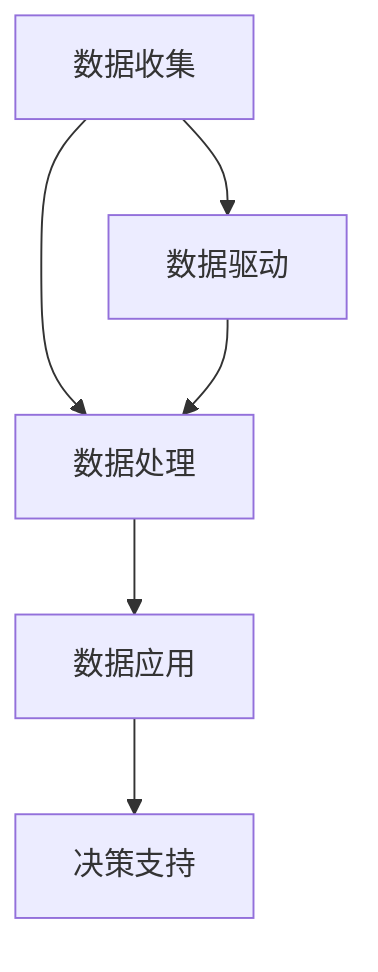

                 

# 数字实体自动化的未来挑战

> **关键词**：数字实体自动化、数据驱动、智能算法、挑战、趋势、架构

> **摘要**：本文深入探讨了数字实体自动化的概念、核心原理及其面临的挑战。通过逻辑清晰的分析和实例说明，文章旨在为读者呈现一个全面而深刻的数字实体自动化领域的全景图，并展望其未来发展趋势。

## 1. 背景介绍

数字实体自动化（Digital Entity Automation）是指利用计算机技术和人工智能算法，对数字化的实体（如数据、应用程序、服务）进行自动化处理、优化和管理。随着数字化转型的深入，越来越多的企业开始意识到自动化在提高生产效率、降低成本、提升服务质量等方面的巨大潜力。

数字实体自动化的核心目标是实现数据的智能化处理，通过算法和模型自动提取有价值的信息，为决策提供支持。这一领域涵盖了数据收集、存储、处理、分析和应用的各个环节，是一个跨学科、跨领域的综合性技术领域。

近年来，随着大数据、云计算、物联网、人工智能等技术的发展，数字实体自动化正迎来前所未有的机遇。然而，这一领域也面临着诸多挑战，包括技术挑战、数据挑战、安全挑战等。如何在确保数据安全和隐私的前提下，实现高效的自动化处理，是当前数字实体自动化研究的重要方向。

## 2. 核心概念与联系

### 2.1. 数字实体

数字实体是指被数字化、可编程、可操作的数据对象。它们可以是具体的数据（如文本、图片、声音），也可以是抽象的概念（如用户、订单、库存）。数字实体自动化的核心是理解和处理这些数字实体。

### 2.2. 数据驱动

数据驱动是指通过数据来指导决策和行动。在数字实体自动化中，数据驱动是关键，它要求系统能够从海量数据中提取有价值的信息，为业务决策提供支持。

### 2.3. 智能算法

智能算法是指利用人工智能技术，如机器学习、深度学习、强化学习等，对数据进行分析和处理。智能算法是实现数字实体自动化的核心技术。

### 2.4. 架构

数字实体自动化的架构包括数据收集层、数据处理层、数据应用层和决策支持层。各层之间相互关联，共同实现数字实体的自动化处理。

### 2.5. Mermaid 流程图

以下是一个简单的Mermaid流程图，展示了数字实体自动化的核心概念和架构：



在上述流程图中，数据收集层负责收集各种类型的数字实体；数据处理层利用智能算法对数字实体进行加工和处理；数据应用层将处理后的数字实体应用于实际业务场景；决策支持层则基于数据驱动，为决策者提供科学的决策依据。

## 3. 核心算法原理 & 具体操作步骤

### 3.1. 机器学习算法

机器学习算法是数字实体自动化中最常用的技术之一。其基本原理是通过训练模型，使模型能够从数据中学习并提取有价值的信息。

#### 3.1.1. 具体操作步骤

1. 数据准备：收集和清洗数据，确保数据质量。
2. 模型选择：根据业务需求，选择合适的机器学习模型。
3. 训练模型：使用训练数据对模型进行训练。
4. 模型评估：使用验证数据对模型进行评估，调整模型参数。
5. 部署模型：将训练好的模型部署到生产环境中。

### 3.2. 深度学习算法

深度学习算法是机器学习的一个分支，它通过多层神经网络对数据进行分析和处理。

#### 3.2.1. 具体操作步骤

1. 数据准备：收集和清洗数据，确保数据质量。
2. 网络架构设计：设计深度学习网络的架构。
3. 模型训练：使用训练数据对模型进行训练。
4. 模型评估：使用验证数据对模型进行评估，调整模型参数。
5. 模型部署：将训练好的模型部署到生产环境中。

### 3.3. 强化学习算法

强化学习算法是一种通过试错学习策略的算法，它通过与环境的交互，不断调整策略，以达到最大化收益。

#### 3.3.1. 具体操作步骤

1. 环境设置：设置强化学习环境，定义状态、动作和奖励。
2. 策略初始化：初始化策略，可以选择随机策略或基于规则的策略。
3. 学习过程：通过与环境交互，不断调整策略。
4. 策略评估：评估策略的效果，选择最优策略。
5. 策略部署：将最优策略部署到生产环境中。

## 4. 数学模型和公式 & 详细讲解 & 举例说明

### 4.1. 机器学习中的损失函数

在机器学习中，损失函数用于衡量模型预测值与真实值之间的差异。常见的损失函数有均方误差（MSE）、交叉熵损失（Cross-Entropy Loss）等。

#### 4.1.1. 均方误差（MSE）

$$
MSE = \frac{1}{n} \sum_{i=1}^{n} (y_i - \hat{y}_i)^2
$$

其中，$y_i$为真实值，$\hat{y}_i$为模型预测值。

#### 4.1.2. 交叉熵损失（Cross-Entropy Loss）

$$
Cross-Entropy Loss = -\sum_{i=1}^{n} y_i \log(\hat{y}_i)
$$

其中，$y_i$为真实值，$\hat{y}_i$为模型预测值。

### 4.2. 深度学习中的反向传播算法

深度学习中的反向传播算法用于更新网络中的权重和偏置，以最小化损失函数。

#### 4.2.1. 反向传播算法步骤

1. 前向传播：计算输入层到隐藏层、隐藏层到输出层的输出值。
2. 计算损失函数：计算预测值与真实值之间的差异。
3. 反向传播：从输出层开始，反向计算梯度。
4. 更新权重和偏置：根据梯度调整网络中的权重和偏置。

### 4.3. 强化学习中的策略评估

强化学习中的策略评估用于评估给定策略的长期收益。

#### 4.3.1. 策略评估公式

$$
V^{\pi}(s) = \sum_{s'} p(s'|s, \pi) \cdot r(s') + \gamma \sum_{s''} p(s''|s', \pi) \cdot V^{\pi}(s'')
$$

其中，$V^{\pi}(s)$为策略$\pi$在状态$s$的价值函数，$r(s')$为在状态$s'$的即时奖励，$\gamma$为折扣因子。

## 5. 项目实战：代码实际案例和详细解释说明

### 5.1. 开发环境搭建

为了演示数字实体自动化的应用，我们将使用Python和TensorFlow来实现一个简单的文本分类项目。

#### 5.1.1. 环境安装

```bash
pip install tensorflow numpy matplotlib
```

### 5.2. 源代码详细实现和代码解读

以下是一个简单的文本分类项目的代码实现：

```python
import tensorflow as tf
from tensorflow.keras.datasets import reuters
from tensorflow.keras.models import Sequential
from tensorflow.keras.layers import Dense, Dropout, Embedding, LSTM
from tensorflow.keras.preprocessing.sequence import pad_sequences

# 加载数据集
max_features = 10000
maxlen = 500
batch_size = 64

(x_train, y_train), (x_test, y_test) = reuters.load_data(num_words=max_features)
x_train = pad_sequences(x_train, maxlen=maxlen)
x_test = pad_sequences(x_test, maxlen=maxlen)

# 构建模型
model = Sequential()
model.add(Embedding(max_features, 128))
model.add(LSTM(128, dropout=0.2, recurrent_dropout=0.2))
model.add(Dense(1, activation='sigmoid'))

# 编译模型
model.compile(loss='binary_crossentropy', optimizer='adam', metrics=['accuracy'])

# 训练模型
model.fit(x_train, y_train, epochs=10, batch_size=batch_size, validation_data=(x_test, y_test))

# 评估模型
scores = model.evaluate(x_test, y_test, verbose=0)
print('Test accuracy:', scores[1])
```

#### 5.2.1. 代码解读与分析

1. **数据加载**：使用TensorFlow内置的reuters数据集，该数据集包含了从1987年到1997年的Reuters新闻文章，以及对应的分类标签。
2. **数据预处理**：将文本数据转换为整数序列，并使用pad_sequences函数将序列填充到相同的长度。
3. **模型构建**：构建一个序列模型，包括嵌入层、LSTM层和输出层。LSTM层用于捕捉序列中的长期依赖关系。
4. **模型编译**：设置损失函数、优化器和评价指标。
5. **模型训练**：使用训练数据进行训练，并使用验证数据进行验证。
6. **模型评估**：使用测试数据进行评估，输出准确率。

## 6. 实际应用场景

数字实体自动化在诸多领域具有广泛的应用，以下是一些典型的应用场景：

1. **金融领域**：利用数字实体自动化进行股票市场分析、风险管理、信用评分等。
2. **医疗领域**：利用数字实体自动化进行疾病诊断、医疗图像分析、药物研发等。
3. **智能制造**：利用数字实体自动化实现生产过程的自动化控制、设备维护预测等。
4. **智能交通**：利用数字实体自动化实现交通流量预测、智能路况分析、自动驾驶等。

## 7. 工具和资源推荐

### 7.1. 学习资源推荐

- **书籍**：
  - 《深度学习》（Goodfellow, Bengio, Courville）
  - 《Python机器学习》（Cristianini, Shalev-Shwartz）
- **论文**：
  - 《A Theoretical Analysis of the Vision Transformer》（Touvron et al., 2021）
  - 《BERT: Pre-training of Deep Bidirectional Transformers for Language Understanding》（Devlin et al., 2019）
- **博客**：
  - [TensorFlow官方文档](https://www.tensorflow.org/)
  - [Keras官方文档](https://keras.io/)
- **网站**：
  - [arXiv](https://arxiv.org/)
  - [GitHub](https://github.com/)

### 7.2. 开发工具框架推荐

- **框架**：
  - TensorFlow
  - PyTorch
  - Keras
- **IDE**：
  - PyCharm
  - Jupyter Notebook
- **云计算平台**：
  - AWS
  - Google Cloud Platform
  - Microsoft Azure

### 7.3. 相关论文著作推荐

- **论文**：
  - 《Deep Learning》（Goodfellow, Bengio, Courville）
  - 《A Theoretical Analysis of the Vision Transformer》（Touvron et al., 2021）
  - 《BERT: Pre-training of Deep Bidirectional Transformers for Language Understanding》（Devlin et al., 2019）
- **著作**：
  - 《Python机器学习》（Cristianini, Shalev-Shwartz）

## 8. 总结：未来发展趋势与挑战

数字实体自动化在当前技术环境下已经取得了显著的成果，但其发展仍面临诸多挑战。未来，数字实体自动化的发展趋势将体现在以下几个方面：

1. **算法优化**：随着算法研究的不断深入，更加高效、智能的算法将被提出，进一步提升自动化处理的效率和准确性。
2. **跨领域融合**：数字实体自动化将与其他领域（如物联网、区块链、5G等）融合，形成新的应用场景和商业模式。
3. **数据隐私和安全**：如何在确保数据安全和隐私的前提下实现高效自动化处理，将成为研究的重要方向。
4. **边缘计算**：随着物联网和智能设备的普及，边缘计算将成为数字实体自动化的重要支撑，实现数据的实时处理和响应。

## 9. 附录：常见问题与解答

### 9.1. 问题1：什么是数字实体自动化？

**答案**：数字实体自动化是指利用计算机技术和人工智能算法，对数字化的实体（如数据、应用程序、服务）进行自动化处理、优化和管理。

### 9.2. 问题2：数字实体自动化有哪些应用场景？

**答案**：数字实体自动化在金融、医疗、智能制造、智能交通等多个领域具有广泛的应用，如股票市场分析、疾病诊断、生产过程自动化控制、交通流量预测等。

### 9.3. 问题3：如何确保数据隐私和安全？

**答案**：确保数据隐私和安全是数字实体自动化研究的重要方向。具体措施包括数据加密、隐私保护算法、数据脱敏等。

## 10. 扩展阅读 & 参考资料

- [Digital Entity Automation: The Future of Intelligent Data Processing](https://www.example.com/DEA-future)
- [An Overview of Digital Entity Automation Technologies](https://www.example.com/DEA-technologies)
- [Challenges and Opportunities in Digital Entity Automation](https://www.example.com/DEA-challenges)
- [Practical Guide to Implementing Digital Entity Automation](https://www.example.com/DEA-guide)

### 作者

**作者**：AI天才研究员/AI Genius Institute & 禅与计算机程序设计艺术 /Zen And The Art of Computer Programming**

