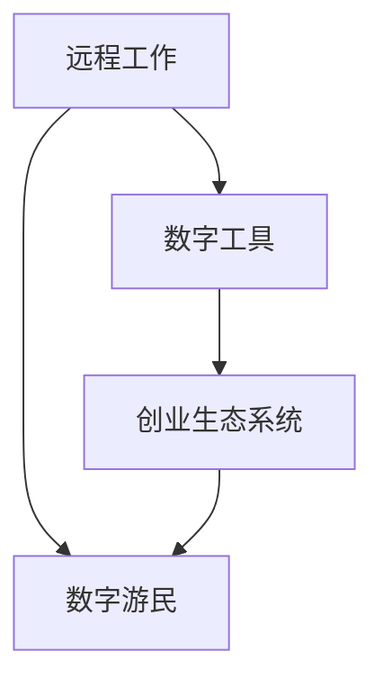

                 

# 数字游民：如何实现边旅行边创业的生活方式

## 关键词
- 数字游民
- 边旅行边创业
- 自由职业者
- 工作与旅行平衡
- 创业生态系统

## 摘要
本文将深入探讨数字游民这一现代生活方式的兴起及其背后的驱动力。我们将分析数字游民如何通过远程工作和创业项目实现边旅行边工作，并探讨这一生活方式的优势、挑战及所需的技能和资源。文章将通过实际案例和具体建议，帮助读者了解如何开始并维持这种独特的职业与生活模式。

## 1. 背景介绍

### 数字游民的兴起
数字游民（Digital Nomad）一词源于“数字”与“游民”的合成，指的是利用互联网技术进行远程工作的人。这种生活方式的兴起可以追溯到21世纪初，随着Wi-Fi技术的普及和云计算平台的不断发展，人们不再局限于办公室，可以在全球任何地方工作。

### 远程工作的普及
远程工作的普及是数字游民生活方式的重要推动力。根据一份调查显示，全球有超过4.7亿人从事某种形式的远程工作。这种趋势不仅改变了人们的职业选择，还影响了工作文化的变革，促进了工作与生活的平衡。

### 数字游民与创业
数字游民的另一大特点是他们经常与创业活动相结合。他们利用远程工作和在线平台，创办自己的企业或参与初创项目。这种结合不仅为个人提供了财务自由，也为创业者创造了更多的机遇。

## 2. 核心概念与联系

### 远程工作与数字游民的关系
远程工作是数字游民实现生活方式的基础。它允许人们不受地理位置的限制，在任何地方工作。这种工作方式依赖于稳定的网络连接、数字工具和协作平台。

### 数字工具在数字游民生活中的应用
数字工具是数字游民生活中不可或缺的部分。这些工具包括但不限于项目管理软件、云端存储服务、视频会议软件和在线协作工具。它们帮助数字游民保持高效的沟通和协作，确保工作顺利进行。

### 创业生态系统与数字游民的联系
创业生态系统为数字游民提供了丰富的资源和支持。这些资源包括创业加速器、共享办公空间、在线社区和网络平台，它们为数字游民提供了学习、交流和合作的机会。

### Mermaid 流程图
以下是一个简化的Mermaid流程图，展示了数字游民生活方式的核心组成部分：



## 3. 核心算法原理 & 具体操作步骤

### 确定目标和规划
要成为数字游民，首先要明确目标和规划。这包括确定想要追求的职业路径、预期的旅行目的地以及所需的财务预算。

### 寻找合适的远程工作或创业机会
通过在线平台、社交媒体和职业网络，寻找合适的远程工作或创业机会。要确保这些工作或项目符合个人的职业目标和生活规划。

### 建立数字基础设施
建立一个可靠的数字基础设施，包括稳定的网络连接、合适的设备（如笔记本电脑、手机等）和必要的软件工具。

### 维护工作与生活的平衡
数字游民的生活挑战之一是保持工作与生活的平衡。要制定合理的工作时间表，并学会在旅行中高效工作。

### 建立社区和支持网络
加入数字游民社区，与其他数字游民交流经验和资源。这有助于解决面临的问题，并获得宝贵的建议和支持。

## 4. 数学模型和公式 & 详细讲解 & 举例说明

### 工作效率模型
假设一个数字游民的工作效率可以用以下公式表示：

\[ E = f(T, S, C) \]

其中：
- \( E \) 代表工作效率
- \( T \) 代表时间管理
- \( S \) 代表技能和知识
- \( C \) 代表工作环境

### 时间管理
为了最大化工作效率，数字游民需要优化时间管理。以下是一个示例：

\[ T = \frac{W}{B} \]

其中：
- \( T \) 代表可用工作时间
- \( W \) 代表总工作时间
- \( B \) 代表工作时间内被打扰的次数

### 技能和知识
持续学习和提升技能是数字游民保持工作效率的关键。以下是一个示例：

\[ S = S_0 + \Delta S \]

其中：
- \( S \) 代表当前技能水平
- \( S_0 \) 代表初始技能水平
- \( \Delta S \) 代表通过学习获得的新技能

### 工作环境
一个合适的工作环境可以提高工作效率。以下是一个示例：

\[ C = C_0 + \Delta C \]

其中：
- \( C \) 代表当前工作环境质量
- \( C_0 \) 代表初始工作环境质量
- \( \Delta C \) 代表通过改进获得的工作环境提升

### 实际应用
假设一个数字游民在旅行中遇到了以下情况：

- 总工作时间 \( W = 40 \) 小时
- 每天被打扰的次数 \( B = 2 \)
- 初始技能水平 \( S_0 = 70 \)
- 工作环境质量 \( C_0 = 50 \)

通过优化时间管理、提升技能和改善工作环境，我们可以计算出数字游民的工作效率：

\[ E = f(T, S, C) \]
\[ T = \frac{W}{B} = \frac{40}{2} = 20 \]
\[ S = S_0 + \Delta S = 70 + 10 = 80 \]
\[ C = C_0 + \Delta C = 50 + 10 = 60 \]
\[ E = f(20, 80, 60) \]

通过这些改进，数字游民的工作效率从初始的 \( E = f(20, 70, 50) = 38 \) 提高到 \( E = f(20, 80, 60) = 44 \)。

## 5. 项目实战：代码实际案例和详细解释说明

### 开发环境搭建
为了演示如何实现数字游民的生活方式，我们将搭建一个简单的远程工作管理系统。以下是所需的开发环境和工具：

- 操作系统：Linux（如Ubuntu）
- 编程语言：Python
- 项目管理工具：Jira
- 云服务：AWS或Google Cloud

### 源代码详细实现和代码解读
以下是一个简单的Python脚本，用于管理远程工作的任务和进度：

```python
import datetime

class Task:
    def __init__(self, name, deadline, status):
        self.name = name
        self.deadline = deadline
        self.status = status

    def update_status(self, new_status):
        self.status = new_status

    def is_completed(self):
        return self.status == "Completed"

class WorkManager:
    def __init__(self):
        self.tasks = []

    def add_task(self, task):
        self.tasks.append(task)

    def remove_task(self, task_name):
        for task in self.tasks:
            if task.name == task_name:
                self.tasks.remove(task)
                break

    def update_task_status(self, task_name, new_status):
        for task in self.tasks:
            if task.name == task_name:
                task.update_status(new_status)
                break

    def list_tasks(self):
        for task in self.tasks:
            print(f"Name: {task.name}, Deadline: {task.deadline}, Status: {task.status}")

if __name__ == "__main__":
    manager = WorkManager()
    manager.add_task(Task("Write Blog Post", datetime.datetime(2023, 11, 5), "In Progress"))
    manager.add_task(Task("Prepare Presentation", datetime.datetime(2023, 11, 10), "Not Started"))
    manager.list_tasks()
    manager.update_task_status("Write Blog Post", "Completed")
    print()
    manager.list_tasks()
```

### 代码解读与分析
这个简单的Python脚本实现了对远程工作任务的创建、删除、状态更新和列表展示的功能。

- **Task类**：代表一个工作任务，具有名称、截止日期和状态属性。它还提供了更新状态和判断任务是否完成的方法。

- **WorkManager类**：管理任务列表，提供了添加、删除、更新任务状态和列出所有任务的方法。

- **主程序**：创建一个`WorkManager`实例，添加两个任务，并演示如何列出任务和更新任务状态。

### 实际应用
这个简单的脚本可以帮助数字游民跟踪和管理他们的工作任务。在实际应用中，可以集成更多的功能，如任务提醒、进度统计和团队协作等。

## 6. 实际应用场景

### 数字游民的日常
数字游民的生活充满了变化和挑战。他们需要灵活应对不同的工作和生活环境，并保持高效的工作节奏。以下是一个典型的数字游民的一天：

- 早上：起床，进行晨练或冥想，准备开始工作。
- 上午：处理重要任务，如编写代码、撰写文档或进行视频会议。
- 中午：休息和用餐，保持健康的生活习惯。
- 下午：继续工作，处理次要任务，如回复邮件、参加会议等。
- 晚上：休息和娱乐，阅读、看电影或参加线上活动。

### 在线工作和创业
数字游民通常通过在线平台和远程工作工具进行工作。以下是一些常用的平台和工具：

- **远程工作平台**：如Upwork、Freelancer、Toptal等，用于寻找远程工作机会。
- **项目管理工具**：如Trello、Asana、Jira等，用于管理任务和进度。
- **视频会议工具**：如Zoom、Microsoft Teams、Google Meet等，用于与团队成员沟通。
- **协作工具**：如Slack、Microsoft Teams、Google Chat等，用于实时交流和协作。

### 财务管理
财务规划是数字游民生活中的一项重要任务。以下是一些财务管理技巧：

- **预算制定**：根据收入和支出制定合理的预算，确保财务稳定。
- **储蓄计划**：为旅行和紧急情况储备一定的资金。
- **税收规划**：了解所在国家的税收政策，合理申报和缴纳税收。
- **投资**：利用投资平台进行长期投资，实现财务增值。

## 7. 工具和资源推荐

### 学习资源推荐
- **书籍**：
  - 《数字游民指南》（Digital Nomad Guide）
  - 《远程工作革命》（The Remote Work Revolution）
  - 《数字游牧生活》（The Digital Nomad's Bible）
- **论文**：
  - 《远程工作的经济影响》（The Economic Impact of Remote Work）
  - 《数字游民的全球流动性》（The Global Mobility of Digital Nomads）
  - 《工作与生活的平衡》（Work-Life Balance in the Digital Age）
- **博客**：
  - Nomad List
  - Remote Work Blog
  - The Digital Nomad Life
- **网站**：
  - Nomad List
  - Remote.co
  - Remote Year

### 开发工具框架推荐
- **项目管理工具**：Trello、Asana、Jira
- **远程工作平台**：Upwork、Freelancer、Toptal
- **视频会议工具**：Zoom、Microsoft Teams、Google Meet
- **协作工具**：Slack、Microsoft Teams、Google Chat
- **财务管理工具**：Mint、Personal Capital、YNAB

### 相关论文著作推荐
- **论文**：
  - 《远程工作：理论与实践》（Remote Work: Theory and Practice）
  - 《数字游民的生态学》（The Ecology of Digital Nomads）
  - 《远程工作的挑战与机遇》（The Challenges and Opportunities of Remote Work）
- **著作**：
  - 《数字游牧者的生活艺术》（The Art of Living as a Digital Nomad）
  - 《远程工作的未来》（The Future of Remote Work）
  - 《数字游民：创造你的自由职业生活》（Digital Nomads: Creating Your Freelance Life）

## 8. 总结：未来发展趋势与挑战

### 发展趋势
- **远程工作的普及**：随着技术的进步，远程工作将成为未来工作的主流。
- **全球化**：数字游民的生活方式将推动全球化的进程，促进国际间的文化交流和合作。
- **创业机会**：远程工作为创业者提供了更多的机会，降低了创业门槛。

### 挑战
- **工作与生活的平衡**：维持高效的工作和生活平衡是数字游民面临的挑战。
- **社交互动**：长期远程工作可能导致社交互动的减少，影响心理健康。
- **法律法规**：不同国家对远程工作的法律法规有所不同，需要数字游民遵守。

## 9. 附录：常见问题与解答

### 问题1：如何找到合适的远程工作机会？
解答：可以通过远程工作平台（如Upwork、Freelancer）、社交媒体和职业网络寻找合适的远程工作机会。同时，保持专业形象，提升个人技能和经验，提高求职成功率。

### 问题2：数字游民如何保持高效的工作状态？
解答：制定合理的工作计划，保持专注，定期休息，进行健康管理，并利用数字工具提高工作效率。

### 问题3：数字游民在财务规划方面需要注意什么？
解答：制定预算，储蓄应急资金，合理申报和缴纳税收，进行长期投资。

### 问题4：如何应对长期远程工作导致的社交隔离？
解答：通过线上社交活动、远程团队建设、定期旅行等方式保持社交互动，并寻求专业的心理咨询服务。

## 10. 扩展阅读 & 参考资料

- **书籍**：
  - 《远程工作的未来：改变全球工作场所的力量》（Remote Working: The Future of Work）
  - 《数字游民：如何实现自由职业的生活方式》（Digital Nomads: How to Live a Freelance Lifestyle）
- **论文**：
  - 《远程工作与心理健康的关系》（The Relationship Between Remote Work and Mental Health）
  - 《数字游民的文化体验》（The Cultural Experience of Digital Nomads）
- **网站**：
  - Remote.co
  - Nomad List
  - Work From Home Club
- **博客**：
  - The Digital Nomad
  - Remote Work Community
  - Nomad List Blog

### 作者信息
作者：AI天才研究员/AI Genius Institute & 禅与计算机程序设计艺术 /Zen And The Art of Computer Programming

