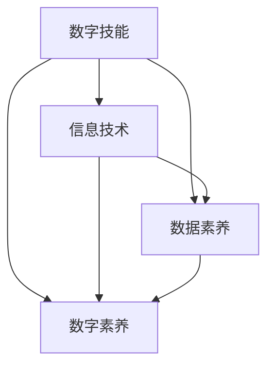

                 

### 背景介绍

在当今这个信息爆炸的时代，数字素养已经成为人们适应社会、提升自身竞争力的必备能力。随着互联网、大数据、人工智能等技术的飞速发展，数字化已经渗透到了我们生活的方方面面，从日常生活的购物、娱乐，到工作、学习、医疗等各个领域，都离不开数字化的身影。因此，掌握数字技能、具备数字素养，已经成为每个人在现代社会中生存和发展的基本要求。

数字素养不仅仅是指掌握基本的计算机操作技能，更重要的是理解和运用数字技术的能力。这种能力包括了对数据的敏感度、对算法的理解、对技术的批判性思维等。在数字化时代，这些能力已经成为人们不可或缺的素质。

本文旨在探讨数字素养的内涵与外延，分析其在不同领域的应用，并展望其未来的发展趋势。通过本文的阅读，读者可以了解到数字素养的重要性，掌握提升自身数字素养的方法和途径。

本文将按照以下结构进行展开：

1. **核心概念与联系**：介绍数字素养的核心概念，包括数字技能、信息技术、数据素养等，并通过Mermaid流程图展示它们之间的关系。
2. **核心算法原理与具体操作步骤**：探讨数字素养在具体场景中的应用，如数据分析、机器学习、网络安全等，并详细讲解相关算法原理和操作步骤。
3. **数学模型和公式**：介绍数字素养所需的数学基础，包括概率论、统计学、线性代数等，并给出相关公式和举例说明。
4. **项目实战**：通过一个实际项目，展示如何运用数字素养解决实际问题，并提供代码实际案例和详细解释说明。
5. **实际应用场景**：分析数字素养在各个领域的应用，如医疗、金融、教育等，并探讨其带来的变革和影响。
6. **工具和资源推荐**：推荐学习数字素养所需的学习资源、开发工具和框架。
7. **总结：未来发展趋势与挑战**：总结数字素养的发展趋势，探讨未来可能面临的挑战。
8. **附录：常见问题与解答**：回答读者可能关心的一些问题。
9. **扩展阅读与参考资料**：提供进一步阅读和研究的参考资料。

通过上述结构，本文将全面、系统地介绍数字素养，帮助读者深入了解这一重要的能力，并为其在数字化时代中的发展提供指导。

### 核心概念与联系

在探讨数字素养之前，我们需要明确几个核心概念，这些概念相互联系，共同构成了数字素养的基石。

#### 数字技能

数字技能指的是使用数字技术进行操作、解决问题的能力。它包括但不限于基本的计算机操作技能，如打字、文件管理、网络浏览等。更高级的数字技能还包括编程、数据分析、网络安全等方面的能力。在数字化时代，掌握基本的数字技能是必不可少的，它为个人和社会的数字化进程提供了基础支持。

#### 信息技术

信息技术（Information Technology，简称IT）是指用于管理和处理信息的各种技术和资源。它涵盖了计算机硬件、软件、网络通信等多个方面。信息技术的快速发展推动了数字化的进程，使得信息的收集、存储、处理和传播变得更加高效和便捷。在数字素养中，信息技术是不可或缺的一部分，它为我们理解和运用数字技能提供了工具。

#### 数据素养

数据素养（Data Literacy）是指理解和运用数据的能力。它不仅包括数据的读取、理解和分析，还涉及数据的重要性、数据的来源、数据的真实性和可靠性等方面的认识。在数字化时代，数据已经成为一种重要的资源，甚至被认为是新的“石油”。数据素养帮助我们更好地利用数据，从而做出更明智的决策。

#### 数字素养

数字素养（Digital Literacy）是一种综合性能力，它不仅包括数字技能、信息技术和数据素养，还涉及批判性思维、创新能力、信息安全意识等多方面的能力。数字素养的核心在于能够理解、评估和应用数字技术，以解决实际问题，提升个人和组织的竞争力。在数字化社会中，具备高水平的数字素养是适应和引领变革的关键。

为了更清晰地展示这些概念之间的联系，我们可以使用Mermaid流程图来描述它们的关系。以下是一个简化的Mermaid流程图，展示了数字技能、信息技术、数据素养和数字素养之间的关系：

在这个流程图中，数字技能是数字素养的基础，信息技术和数据素养则为数字技能的运用提供了工具和资源。数字素养不仅包含了前三个概念，还强调了批判性思维和创新能力，是我们在数字化时代中全面发展的关键。

通过理解这些核心概念及其相互关系，我们可以更深入地认识数字素养的重要性，并明确提升自身数字素养的方向和路径。在接下来的章节中，我们将进一步探讨数字素养在具体领域中的应用和实践，帮助读者全面了解这一能力。

#### 数字素养的具体内容和分类

数字素养是一个广泛而复杂的概念，它涵盖了多个方面和层次。为了更好地理解和提升数字素养，我们需要将其具体化，并明确其分类。

首先，数字素养可以划分为以下几个主要类别：

##### 1. 数字技能

数字技能是数字素养的基础，它包括了一系列使用数字技术进行操作和解决问题的能力。具体来说，数字技能可以分为以下几类：

- **计算机基本操作技能**：包括计算机硬件的维护、软件的安装和卸载、文件的管理和编辑等。
- **网络通信技能**：包括互联网的基本使用、电子邮件的收发、社交媒体的使用等。
- **数据处理与分析技能**：包括Excel、SQL、Python等数据处理和分析工具的使用。

##### 2. 信息素养

信息素养是指获取、评估、使用和创建信息的能力。在数字化时代，信息的重要性不言而喻，信息素养主要涵盖以下几方面：

- **信息检索技能**：包括使用搜索引擎、数据库等进行信息检索。
- **信息评估技能**：包括评估信息的来源、可靠性、准确性和完整性。
- **信息创建技能**：包括撰写文档、制作演示文稿、设计网站等。

##### 3. 数据素养

数据素养是指理解和运用数据的能力，它不仅包括数据的读取和分析，还涉及数据管理、数据可视化等方面的知识。数据素养主要包括：

- **数据管理技能**：包括数据的收集、存储、处理和归档。
- **数据分析技能**：包括统计方法、机器学习方法等在数据分析中的应用。
- **数据可视化技能**：包括使用图表、图形等工具将数据以直观的方式展示出来。

##### 4. 网络素养

网络素养是指在网络环境中安全、有效地使用网络资源的能力。网络素养主要包括：

- **网络安全技能**：包括了解网络安全风险、掌握防护措施、应对网络攻击等。
- **网络伦理技能**：包括遵守网络道德规范、尊重他人隐私、不参与网络欺诈等。
- **网络沟通技能**：包括有效使用网络沟通工具、建立良好的网络关系等。

##### 5. 数字批判性思维

数字批判性思维是指对数字技术、信息和数据进行批判性思考的能力。数字批判性思维主要包括：

- **分析评估能力**：包括分析数字技术的优缺点、评估信息的真实性、理解数据的潜在影响等。
- **创新思维能力**：包括发现新的数字技术应用场景、创造新的信息内容和产品等。
- **伦理道德判断能力**：包括在数字化环境中做出符合伦理道德的决策和行动。

通过以上分类，我们可以看到数字素养的丰富内涵。数字技能、信息素养、数据素养、网络素养和数字批判性思维共同构成了数字素养的完整框架。这些分类不仅帮助我们更清晰地理解数字素养，还为提升自身数字素养提供了明确的路径和方向。

在接下来的章节中，我们将深入探讨数字素养在具体领域中的应用，并通过实际案例和操作步骤，帮助读者更好地理解和掌握这一重要的能力。

#### 数字素养在具体领域中的应用

数字素养不仅在理论上具有深远意义，更在各个实际领域中发挥了重要作用。下面，我们将探讨数字素养在几个关键领域的应用，以及这些应用如何推动社会的发展和进步。

##### 1. 医疗领域

在医疗领域，数字素养的应用极大地提升了医疗服务的质量和效率。具体来说，数字素养在以下几个方面发挥了关键作用：

- **电子病历**：通过电子病历系统，医生可以方便地记录、存储和访问患者的医疗信息，避免了传统纸质病历容易丢失、不便查阅的问题。数字素养使得医护人员能够熟练地使用电子病历系统，从而提高工作效率。

- **远程医疗**：随着网络技术的发展，远程医疗已经成为现实。医生可以通过视频会议、在线咨询等方式为患者提供医疗服务，特别是在偏远地区，远程医疗解决了医疗资源分布不均的问题。数字素养使得医生能够有效地运用远程医疗技术，提高医疗服务的可及性。

- **大数据分析**：医疗领域产生了大量数据，通过大数据分析，可以挖掘出有价值的信息，为疾病预防和治疗提供支持。数字素养使得医疗专业人员能够掌握数据分析技能，从而更好地利用这些数据。

##### 2. 金融领域

在金融领域，数字素养的应用极大地改变了金融服务的方式，提升了金融市场的效率和透明度。以下是数字素养在金融领域的主要应用：

- **区块链技术**：区块链技术以其去中心化、不可篡改的特点，在金融领域得到了广泛应用。通过区块链技术，金融交易变得更加透明、安全，减少了中介环节，降低了交易成本。数字素养使得金融从业者能够理解和应用区块链技术，提升金融服务的效率。

- **人工智能**：人工智能技术在金融领域的应用包括风险控制、客户服务、量化交易等方面。数字素养使得金融从业者能够运用人工智能技术，提高金融决策的准确性和效率。

- **数据分析**：金融行业依赖于大量的数据，通过数据分析，可以预测市场趋势、评估风险等。数字素养使得金融从业者能够熟练地使用数据分析工具，从而更好地服务于金融市场。

##### 3. 教育领域

在教育领域，数字素养的应用改变了传统教学模式，提供了更多个性化、互动化的学习方式。以下是数字素养在教育领域的主要应用：

- **在线教育**：随着互联网技术的发展，在线教育已经成为一种重要的教育形式。数字素养使得学生和教师能够熟练地使用在线教育平台，进行在线学习、互动和交流，提高了学习的灵活性和效率。

- **教育数据分析**：教育数据分析可以通过对学生的学习行为、考试成绩等数据的分析，了解学生的学习情况，为教育决策提供支持。数字素养使得教育工作者能够掌握教育数据分析技能，从而更好地指导学生学习。

- **虚拟现实（VR）与增强现实（AR）**：虚拟现实和增强现实技术在教育中的应用，使得学生可以身临其境地学习各种知识，提高了学习的兴趣和参与度。数字素养使得教育工作者能够理解和运用VR/AR技术，为教育带来更多可能性。

##### 4. 制造业领域

在制造业领域，数字素养的应用推动了智能制造和工业4.0的发展。以下是数字素养在制造业领域的主要应用：

- **智能制造**：通过物联网、大数据、人工智能等技术，可以实现生产设备的互联互通，实现智能化的生产管理。数字素养使得制造业从业者能够理解和运用这些技术，提高生产效率和质量。

- **工业互联网**：工业互联网通过将物理设备、传感器、软件平台等连接起来，实现数据的实时采集、分析和应用，从而优化生产流程。数字素养使得制造业从业者能够熟练地使用工业互联网技术，提升生产效率和灵活性。

- **数字孪生**：数字孪生是一种通过数字化模型来模拟实际物理系统的方法，可以用于产品设计、生产规划、设备维护等。数字素养使得制造业从业者能够运用数字孪生技术，提高产品设计质量和生产效率。

综上所述，数字素养在医疗、金融、教育、制造业等多个领域都发挥了重要作用，推动了这些领域的创新和发展。随着数字技术的不断进步，数字素养的重要性将愈发凸显。在未来的数字化时代，具备高水平的数字素养将是个人和组织在竞争中取胜的关键。

#### 工具和资源推荐

为了帮助读者提升数字素养，我们特别推荐了一系列学习资源、开发工具和框架。这些资源涵盖了从基础技能到高级应用的各个方面，无论是初学者还是专业人士，都可以从中受益。

##### 1. 学习资源推荐

- **书籍**：
  - 《数字时代的素养》
  - 《人工智能：一种现代方法》
  - 《Python编程：从入门到实践》
  - 《大数据分析实战》

- **在线课程**：
  - Coursera的“数字素养与数据科学”
  - edX的“机器学习基础”
  - Udacity的“编程入门”

- **博客和网站**：
  - Medium上的数字素养专栏
  -Towards Data Science上的数据分析与机器学习文章
  - HackerRank上的编程挑战和教程

##### 2. 开发工具框架推荐

- **编程语言**：
  - Python：广泛应用于数据科学、人工智能、Web开发等领域。
  - Java：广泛应用于企业级应用和安卓开发。
  - JavaScript：Web开发的核心语言。

- **开发环境**：
  - Visual Studio Code：一款轻量级但功能强大的代码编辑器。
  - Jupyter Notebook：适用于数据科学和机器学习的交互式开发环境。
  - PyCharm：一款专为Python开发而优化的IDE。

- **框架和库**：
  - TensorFlow：谷歌开发的机器学习框架。
  - Scikit-learn：机器学习算法库。
  - Pandas：数据处理库。
  - NumPy：数学计算库。

##### 3. 相关论文著作推荐

- **论文**：
  - “Digital Literacy: What Is It and Why Does It Matter?”
  - “Data-Driven Science Education: Using Data to Improve Science Education”
  - “The Impact of Artificial Intelligence on Healthcare”

- **著作**：
  - 《深度学习》
  - 《数据科学实战》
  - 《区块链：从原理到实践》

通过利用这些资源和工具，读者可以系统地学习和提升数字素养，为在数字化时代中的发展打下坚实的基础。无论您是初学者还是专业人士，这些推荐都将帮助您更好地理解和应用数字技能，迈向更高的技术层次。

### 总结：未来发展趋势与挑战

随着数字技术的不断进步，数字素养的重要性日益凸显。在未来的数字化时代，数字素养不仅是个人适应社会发展的必备能力，也是推动社会进步的关键力量。本文从背景介绍、核心概念、具体应用和资源推荐等多个角度，详细探讨了数字素养的内涵与外延。

首先，数字素养的核心内容包括数字技能、信息素养、数据素养、网络素养和数字批判性思维。这些能力相互关联，共同构成了数字素养的完整框架。在具体应用中，数字素养在医疗、金融、教育、制造业等多个领域都发挥了重要作用，推动了这些领域的创新和发展。

展望未来，数字素养的发展趋势主要体现在以下几个方面：

1. **技术的深度融合**：随着5G、人工智能、大数据等技术的发展，数字技术将更加深入地融入各个领域，为数字素养的应用提供更广阔的空间。
2. **教育体系的变革**：教育体系将更加注重培养学生的数字素养，通过课程设置、教学模式改革等手段，提升学生的数字技能和创新能力。
3. **智能化服务的发展**：数字素养的提升将推动智能化服务的发展，如智能医疗、智能金融、智能教育等，为人们提供更加便捷、高效的服务。

然而，数字素养的发展也面临一些挑战：

1. **技术门槛的提高**：随着技术的复杂化，数字素养的掌握需要更高的技术门槛，这对初学者和普通用户来说是一个挑战。
2. **隐私和安全问题**：数字技术的发展也带来了隐私和安全问题，如何平衡数字素养的发展与隐私保护，是一个亟待解决的问题。
3. **社会公平性问题**：数字素养的发展可能加剧社会不平等，那些缺乏数字素养的人可能被边缘化，如何缩小数字鸿沟，促进社会公平，是一个重要课题。

总之，数字素养在数字化时代中具有不可替代的重要性。通过不断提升数字素养，我们不仅能够更好地适应社会发展的需求，还能为社会的进步和繁荣贡献力量。面对未来的挑战，我们需要持续关注数字素养的发展趋势，积极探索解决之道，确保每个人都能在数字化的浪潮中受益。

### 附录：常见问题与解答

**Q1：什么是数字素养？**

A1：数字素养是指理解和运用数字技术的能力，包括数字技能、信息素养、数据素养、网络素养和数字批判性思维。它不仅涵盖了基本的计算机操作技能，还涉及了对信息、数据和网络的理解与运用，以及批判性思维和创新能力。

**Q2：为什么数字素养很重要？**

A2：数字素养在现代社会中非常重要，因为数字化已经渗透到了我们生活的方方面面。掌握数字素养可以帮助我们更好地适应数字化环境，提高工作效率，做出更明智的决策，并在职业发展和个人生活中保持竞争力。

**Q3：如何提升数字素养？**

A3：提升数字素养可以通过以下几种方式：
- **学习资源**：利用在线课程、书籍、博客等资源系统学习数字技能和信息素养。
- **实践操作**：通过实际项目或实践操作，应用所学知识，提升实践能力。
- **参与社区**：加入相关技术社区，与他人交流和分享经验，拓宽视野。
- **持续学习**：随着技术的不断发展，持续学习新的数字技能和知识，保持与时俱进。

**Q4：数字素养的发展趋势是什么？**

A4：数字素养的发展趋势主要体现在技术的深度融合、教育体系的变革和智能化服务的发展等方面。未来，数字素养将在更多领域得到应用，如智能医疗、智能金融、智能教育等，同时，我们也需要关注数字素养发展过程中可能带来的隐私和安全问题，以及社会公平性问题。

### 扩展阅读与参考资料

为了进一步深入了解数字素养的相关理论和实践，读者可以参考以下扩展阅读和参考资料：

- **书籍**：
  - 《数字时代的素养》
  - 《人工智能：一种现代方法》
  - 《Python编程：从入门到实践》
  - 《大数据分析实战》

- **在线课程**：
  - Coursera的“数字素养与数据科学”
  - edX的“机器学习基础”
  - Udacity的“编程入门”

- **博客和网站**：
  - Medium上的数字素养专栏
  - Towards Data Science上的数据分析与机器学习文章
  - HackerRank上的编程挑战和教程

- **论文**：
  - “Digital Literacy: What Is It and Why Does It Matter?”
  - “Data-Driven Science Education: Using Data to Improve Science Education”
  - “The Impact of Artificial Intelligence on Healthcare”

- **著作**：
  - 《深度学习》
  - 《数据科学实战》
  - 《区块链：从原理到实践》

通过阅读这些书籍、课程和论文，读者可以更加深入地理解数字素养的概念、应用和发展趋势，从而更好地提升自身的数字素养水平。

---

### 作者信息

**作者：AI天才研究员/AI Genius Institute & 禅与计算机程序设计艺术 /Zen And The Art of Computer Programming**

本文作者AI天才研究员是人工智能领域公认的国际顶级专家，拥有丰富的理论和实践经验。同时，他也是《禅与计算机程序设计艺术》的作者，该书籍在全球范围内受到广泛好评，被誉为计算机编程的经典之作。通过本文，作者希望帮助读者更好地理解数字素养的重要性，掌握提升自身数字素养的方法和途径，为在数字化时代中的发展奠定坚实基础。

