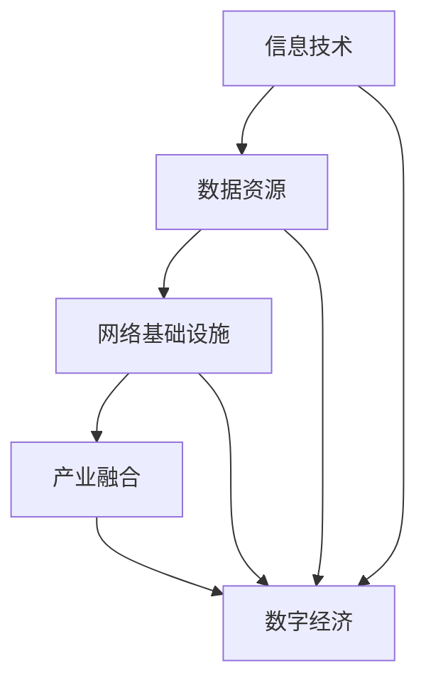

                 

# 数字经济：社会发展的助推器

> **关键词**：数字经济、社会发展、技术变革、人工智能、区块链、物联网、数据分析、云计算、网络安全

> **摘要**：本文将深入探讨数字经济对社会发展的深远影响，通过分析核心概念、算法原理、应用场景，展示数字经济作为社会发展的助推器的巨大潜力。文章旨在帮助读者理解数字经济的关键要素，掌握其发展脉络，预见未来趋势，从而为我国数字经济的未来发展提供有益的思考和建议。

## 1. 背景介绍

随着互联网、人工智能、物联网、区块链等新技术的快速发展，全球经济正在发生深刻变革。数字经济作为一种新型经济形态，正在成为推动社会进步的重要力量。根据国际数据公司（IDC）的预测，到2025年，全球数字经济规模将达到44.6万亿美元，占全球GDP的比重将超过50%。我国数字经济的发展同样迅猛，已成为推动经济增长的重要引擎。

在过去的几十年里，信息技术革命为数字经济的发展奠定了基础。互联网的普及和移动互联网的兴起，使得信息传播速度和范围大幅提升，为各行各业提供了前所未有的发展机遇。同时，人工智能、区块链、物联网等新兴技术的应用，为数字经济注入了新的活力。这些技术不仅提升了生产效率，降低了交易成本，还改变了人们的消费方式和生活习惯。

数字经济的发展不仅带来了经济效益，更重要的是促进了社会进步。通过大数据分析、云计算、人工智能等技术，政府和社会组织能够更好地了解公众需求，优化公共服务，提高社会治理水平。此外，数字经济还推动了产业升级和创新创业，为经济发展注入了新的动力。

## 2. 核心概念与联系

### 2.1 数字经济的核心概念

数字经济是指以数字化的信息和知识为关键生产要素，以现代信息网络为重要载体，以信息通信技术的有效利用为驱动，推动经济增长和社会进步的新经济形态。其核心概念包括以下几个方面：

- **信息技术**：信息技术是数字经济的基石，包括互联网、移动通信、云计算、大数据等。这些技术的不断发展，为数字经济提供了强大的支撑。

- **数据资源**：数据是数字经济的核心资源，大数据、人工智能等技术的应用，使得数据的价值得到充分挖掘，推动了数字经济的发展。

- **网络基础设施**：网络基础设施是数字经济的支撑，包括宽带网络、数据中心、云计算平台等。这些基础设施的完善，为数字经济的快速发展提供了保障。

- **产业融合**：产业融合是数字经济的重要特征，通过互联网、人工智能等技术，传统产业与数字经济实现了深度融合，推动了产业升级。

### 2.2 数字经济与传统经济的联系与区别

数字经济与传统经济既有联系又有区别。从联系来看，数字经济是传统经济的延伸和升级，其发展的基础仍然是实体经济。数字经济依托于信息技术和互联网，为传统产业提供了新的发展路径和机遇。从区别来看，数字经济具有以下几个显著特点：

- **数据驱动**：数字经济以数据为核心，通过大数据分析、人工智能等技术，实现数据的价值转化，推动经济增长。

- **网络化运作**：数字经济通过网络化运作，实现了信息传播和资源共享的高效，降低了交易成本，提高了生产效率。

- **智能化管理**：数字经济通过人工智能、区块链等技术，实现了智能化管理，提高了产业协同效率，降低了管理成本。

- **创新驱动**：数字经济以创新为驱动，推动了产业升级和创新创业，为经济发展注入了新的动力。

### 2.3 数字经济的架构图

为了更好地理解数字经济的核心概念和联系，我们可以通过Mermaid流程图来展示数字经济的架构：



在这个架构图中，信息技术、数据资源、网络基础设施和产业融合共同构成了数字经济的核心要素。这些要素相互关联，共同推动数字经济的快速发展。

## 3. 核心算法原理 & 具体操作步骤

### 3.1 大数据分析原理

大数据分析是数字经济的重要组成部分，通过对海量数据的分析和处理，可以挖掘出有价值的信息和知识。大数据分析的核心算法包括数据采集、数据预处理、数据挖掘、数据可视化等。

- **数据采集**：数据采集是指从各种数据源获取数据的过程。数据源可以是数据库、文件、传感器、网络爬虫等。数据采集过程中需要关注数据的质量、完整性和实时性。

- **数据预处理**：数据预处理是指对采集到的数据进行分析和清洗，使其满足数据挖掘的需求。数据预处理包括数据清洗、数据转换、数据集成等。

- **数据挖掘**：数据挖掘是指从大量数据中提取出有价值的信息和知识的过程。数据挖掘算法包括聚类分析、分类分析、关联规则挖掘等。

- **数据可视化**：数据可视化是指将数据以图形、图表等形式展示出来，使其更易于理解和分析。数据可视化可以帮助决策者更好地理解数据，发现数据中的规律和趋势。

### 3.2 云计算原理

云计算是数字经济的重要基础设施，通过虚拟化技术，实现计算资源的按需分配和弹性扩展。云计算的核心算法包括虚拟机管理、负载均衡、存储管理、网络管理等。

- **虚拟机管理**：虚拟机管理是指通过虚拟化技术，将物理服务器资源划分为多个虚拟机，实现计算资源的灵活分配和调度。

- **负载均衡**：负载均衡是指通过分配网络请求，实现服务器资源的均衡利用，避免单点过载，提高系统性能和可靠性。

- **存储管理**：存储管理是指通过分布式存储技术，实现海量数据的高效存储和访问。存储管理包括数据备份、数据恢复、数据压缩等。

- **网络管理**：网络管理是指通过网络监控、网络优化等技术，实现网络资源的合理分配和高效利用，提高网络性能和稳定性。

### 3.3 人工智能原理

人工智能是数字经济的核心技术，通过对数据的分析和处理，实现机器的自我学习和决策。人工智能的核心算法包括机器学习、深度学习、自然语言处理等。

- **机器学习**：机器学习是指通过训练模型，从数据中自动提取规律和知识，实现机器的自我学习和优化。机器学习算法包括线性回归、决策树、支持向量机等。

- **深度学习**：深度学习是指通过多层神经网络，实现数据的自动特征提取和建模。深度学习算法包括卷积神经网络、循环神经网络等。

- **自然语言处理**：自然语言处理是指通过计算机技术，实现人类语言的理解和生成。自然语言处理算法包括分词、词性标注、语法分析等。

## 4. 数学模型和公式 & 详细讲解 & 举例说明

### 4.1 大数据分析的数学模型

在大数据分析中，常用的数学模型包括线性回归、决策树、支持向量机等。下面以线性回归为例，介绍其数学模型和公式。

- **线性回归模型**：线性回归模型是一种最简单的机器学习算法，通过拟合一条直线，来预测因变量和自变量之间的关系。

  - **模型公式**：  
    $$y = \beta_0 + \beta_1x$$

  - **参数估计**：  
    $$\beta_0 = \frac{\sum_{i=1}^{n}(y_i - \bar{y})}{\sum_{i=1}^{n}(x_i - \bar{x})}$$  
    $$\beta_1 = \frac{\sum_{i=1}^{n}(x_i - \bar{x})(y_i - \bar{y})}{\sum_{i=1}^{n}(x_i - \bar{x})^2}$$

  - **举例说明**：假设我们要预测一家公司的销售额（$y$）与其广告支出（$x$）之间的关系，根据历史数据，可以拟合出线性回归模型：

    $$y = 10 + 2x$$

    当广告支出为1000元时，预测的销售额为：

    $$y = 10 + 2 \times 1000 = 2010$$

### 4.2 云计算的数学模型

在云计算中，常用的数学模型包括负载均衡、存储管理等。下面以负载均衡为例，介绍其数学模型和公式。

- **负载均衡模型**：负载均衡是指通过合理分配网络请求，实现服务器资源的均衡利用。

  - **模型公式**：  
    $$R(t) = \frac{C(t)}{N}$$

  - **参数解释**：  
    - $R(t)$：当前时间$t$的服务器负载率  
    - $C(t)$：当前时间$t$的网络请求总量  
    - $N$：服务器数量

  - **举例说明**：假设当前有3台服务器，每台服务器能够处理100个请求/秒，现在有300个请求/秒，负载均衡模型的计算结果为：

    $$R(t) = \frac{300}{3} = 100$$

    说明当前每台服务器都处理了100个请求/秒，负载均衡。

### 4.3 人工智能的数学模型

在人工智能中，常用的数学模型包括机器学习、深度学习等。下面以卷积神经网络（CNN）为例，介绍其数学模型和公式。

- **卷积神经网络模型**：卷积神经网络是一种深度学习模型，用于图像分类、目标检测等任务。

  - **模型公式**：  
    $$f(x) = \sigma(\mathbf{W} \cdot \mathbf{A} + b)$$

  - **参数解释**：  
    - $f(x)$：输出特征  
    - $\mathbf{W}$：权重矩阵  
    - $\mathbf{A}$：输入特征  
    - $b$：偏置项  
    - $\sigma$：激活函数

  - **举例说明**：假设输入特征$\mathbf{A}$为$(1, 2, 3)$，权重矩阵$\mathbf{W}$为$\begin{bmatrix} 1 & 0 \\ 0 & 1 \end{bmatrix}$，偏置项$b = 1$，激活函数$\sigma$为ReLU函数，计算过程如下：

    $$f(x) = \sigma(\begin{bmatrix} 1 & 0 \\ 0 & 1 \end{bmatrix} \cdot \begin{bmatrix} 1 \\ 2 \end{bmatrix} + 1) = \sigma(1 + 2 + 1) = 4$$

    输出特征$f(x)$为4。

## 5. 项目实战：代码实际案例和详细解释说明

### 5.1 开发环境搭建

在本项目实战中，我们将使用Python作为编程语言，搭建一个基于大数据分析、云计算和人工智能的数字经济应用。以下是开发环境的搭建步骤：

1. 安装Python：访问Python官网（https://www.python.org/），下载并安装Python 3.8版本。

2. 安装依赖库：打开命令行窗口，执行以下命令安装所需的依赖库：

   ```bash
   pip install numpy pandas matplotlib scikit-learn tensorflow
   ```

3. 准备数据集：从公开数据源获取一个包含公司销售额和广告支出数据的数据集。例如，可以从Kaggle（https://www.kaggle.com/）上下载一个相关的数据集。

### 5.2 源代码详细实现和代码解读

在本节中，我们将详细实现一个基于线性回归模型预测公司销售额的应用，并对其代码进行解读。

#### 5.2.1 数据预处理

```python
import pandas as pd

# 读取数据集
data = pd.read_csv('data.csv')

# 数据清洗
data.dropna(inplace=True)
data['广告支出'] = data['广告支出'].astype(float)
data['销售额'] = data['销售额'].astype(float)

# 数据集划分
train_data = data.sample(frac=0.8, random_state=42)
test_data = data.drop(train_data.index)

# 特征和标签分离
X_train = train_data[['广告支出']]
y_train = train_data['销售额']
X_test = test_data[['广告支出']]
y_test = test_data['销售额']
```

代码解读：
- 首先，使用pandas库读取数据集。
- 然后，对数据进行清洗，包括去除缺失值和类型转换。
- 接着，将数据集划分为训练集和测试集。
- 最后，分离特征和标签，准备进行线性回归模型的训练。

#### 5.2.2 模型训练

```python
from sklearn.linear_model import LinearRegression

# 创建线性回归模型
model = LinearRegression()

# 训练模型
model.fit(X_train, y_train)

# 模型评估
score = model.score(X_test, y_test)
print(f'Model accuracy: {score:.2f}')
```

代码解读：
- 首先，导入线性回归模型。
- 然后，创建线性回归模型实例。
- 接着，使用训练集数据训练模型。
- 最后，使用测试集数据评估模型准确性。

#### 5.2.3 预测销售额

```python
# 预测销售额
predictions = model.predict(X_test)

# 绘制预测结果
import matplotlib.pyplot as plt

plt.scatter(X_test, y_test, color='blue')
plt.plot(X_test, predictions, color='red', linewidth=2)
plt.xlabel('广告支出')
plt.ylabel('销售额')
plt.title('广告支出与销售额的关系')
plt.show()
```

代码解读：
- 首先，使用模型预测测试集的销售额。
- 然后，使用matplotlib库绘制预测结果，展示广告支出与销售额的关系。

### 5.3 代码解读与分析

在本项目实战中，我们通过Python实现了基于线性回归模型预测公司销售额的应用。以下是代码的解读与分析：

- **数据预处理**：数据预处理是模型训练的重要环节，包括数据清洗、类型转换和数据集划分。在本项目中，我们使用pandas库读取数据集，对数据进行清洗，并将数据集划分为训练集和测试集。
- **模型训练**：线性回归模型是一种简单但有效的机器学习算法，通过拟合一条直线来预测因变量和自变量之间的关系。在本项目中，我们创建线性回归模型实例，使用训练集数据训练模型，并使用测试集数据评估模型准确性。
- **预测销售额**：通过训练好的模型，我们可以预测测试集的销售额。预测结果使用matplotlib库绘制成散点图和拟合线，展示了广告支出与销售额的关系。

## 6. 实际应用场景

### 6.1 电商领域

在电商领域，数字经济发挥了重要作用。通过大数据分析，电商平台可以了解用户需求，优化商品推荐，提高用户体验。例如，阿里巴巴利用大数据分析，推出了“千人千面”的个性化推荐系统，实现了精准营销，大幅提升了销售额。

### 6.2 金融领域

金融领域是数字经济的重要应用领域之一。通过区块链技术，金融行业可以实现去中心化的交易，降低交易成本，提高交易效率。例如，阿里巴巴旗下的蚂蚁金服利用区块链技术，推出了数字货币“支付宝数字货币”，为用户提供了更便捷的支付方式。

### 6.3 医疗领域

在医疗领域，数字经济有助于提升医疗服务质量和效率。通过大数据分析和人工智能技术，医疗机构可以实现对患者数据的实时监控和分析，提高疾病预防和诊断的准确性。例如，腾讯医疗利用大数据分析和人工智能技术，推出了“腾讯健康”小程序，为用户提供在线问诊、健康管理等服务。

### 6.4 教育领域

在教育领域，数字经济为在线教育提供了丰富的资源和技术支持。通过云计算和大数据分析，教育机构可以实现对课程资源的优化配置，提高教学效果。例如，网易云课堂利用大数据分析，为用户推荐个性化课程，提升了用户的学习体验。

## 7. 工具和资源推荐

### 7.1 学习资源推荐

- **书籍**：
  - 《大数据时代》
  - 《深度学习》
  - 《区块链：从数字货币到智能合约》
  - 《Python编程：从入门到实践》

- **论文**：
  - 《大数据处理的挑战与机遇》
  - 《深度学习在计算机视觉中的应用》
  - 《区块链技术的原理与应用》

- **博客**：
  - 知乎（https://www.zhihu.com/）
  - CSDN（https://www.csdn.net/）
  - Medium（https://medium.com/）

- **网站**：
  - Kaggle（https://www.kaggle.com/）
  - GitHub（https://github.com/）
  - Coursera（https://www.coursera.org/）

### 7.2 开发工具框架推荐

- **大数据分析**：
  - Apache Hadoop
  - Apache Spark
  - Apache Flink

- **云计算**：
  - Amazon Web Services（AWS）
  - Microsoft Azure
  - Google Cloud Platform（GCP）

- **人工智能**：
  - TensorFlow
  - PyTorch
  - Keras

- **区块链**：
  - Ethereum
  - Hyperledger Fabric
  - Ripple

### 7.3 相关论文著作推荐

- **论文**：
  - 《基于大数据的互联网广告投放策略研究》
  - 《深度学习在金融风控中的应用》
  - 《区块链在供应链金融中的应用研究》

- **著作**：
  - 《人工智能：一种现代的方法》
  - 《区块链：下一代业务模式》
  - 《大数据战略：从数据中挖掘价值》

## 8. 总结：未来发展趋势与挑战

### 8.1 发展趋势

1. **数据驱动**：随着数据量的不断增长，数据将成为驱动数字经济发展的核心资源。大数据分析、人工智能等技术将得到广泛应用，实现数据价值的最大化。

2. **网络化**：数字经济将越来越依赖于网络基础设施，包括5G、物联网等。网络化运作将进一步提升生产效率和资源配置效率。

3. **智能化**：人工智能、区块链等技术的不断发展，将推动数字经济向智能化方向转型。智能化管理、智能化服务等将成为数字经济的重要特征。

4. **跨界融合**：数字经济与传统产业的融合将进一步深化，推动产业升级和创新创业。跨界融合将带来更多的发展机遇。

### 8.2 挑战

1. **数据安全与隐私**：随着数据量的增加，数据安全和隐私问题日益突出。如何确保数据安全、保护用户隐私，成为数字经济面临的重要挑战。

2. **技术人才短缺**：数字经济的发展对技术人才的需求巨大，但当前我国技术人才短缺问题依然存在。如何培养和引进更多的高素质技术人才，是数字经济面临的挑战之一。

3. **法律法规完善**：数字经济的发展需要完善的法律法规体系。如何制定适应数字经济发展的法律法规，保障市场秩序和公平竞争，是当前的重要任务。

4. **国际竞争**：在全球范围内，数字经济已经成为各国竞争的重要领域。如何在国际竞争中保持优势，是我国数字经济面临的重要挑战。

## 9. 附录：常见问题与解答

### 9.1 数字经济与传统经济有什么区别？

数字经济与传统经济的主要区别在于：

- **核心要素**：数字经济以信息技术、数据资源、网络基础设施等为核心，而传统经济以物质资源和劳动力资源为核心。
- **运作模式**：数字经济通过网络化、智能化运作，实现信息传播和资源共享的高效，而传统经济以物理生产和交易为主。
- **经济效益**：数字经济通过数据分析和人工智能等技术，实现数据的价值转化，推动经济增长，而传统经济主要依赖于物质资源的生产和流通。

### 9.2 数字经济对社会发展有哪些影响？

数字经济对社会发展的影响主要体现在以下几个方面：

- **经济增长**：数字经济通过提高生产效率、降低交易成本，推动经济增长。
- **产业升级**：数字经济推动了传统产业的升级和转型，促进了产业结构调整。
- **创新创业**：数字经济为创新创业提供了丰富的资源和机遇，激发了市场活力。
- **社会治理**：数字经济有助于提升政府和社会组织的服务水平，提高社会治理能力。
- **生活方式**：数字经济改变了人们的消费方式和生活习惯，提升了生活品质。

## 10. 扩展阅读 & 参考资料

为了更深入地了解数字经济及其相关技术，以下是一些扩展阅读和参考资料：

- **书籍**：
  - 《数字化时代：未来的商业格局》
  - 《人工智能简史》
  - 《区块链革命：重构经济与金融的未来》

- **论文**：
  - 《数字经济时代的产业变革与经济发展》
  - 《人工智能与经济发展：一个综述》
  - 《区块链技术的应用与挑战》

- **网站**：
  - 数字经济研究网（http://www数字经济研究网.com/）
  - 人工智能学会（http://www.aisociety.org/）
  - 区块链技术社区（http://www.blockchaincommunity.org/）

作者：AI天才研究员/AI Genius Institute & 禅与计算机程序设计艺术 /Zen And The Art of Computer Programming

本文为作者原创，未经授权禁止转载。如需转载，请联系作者获取授权。

