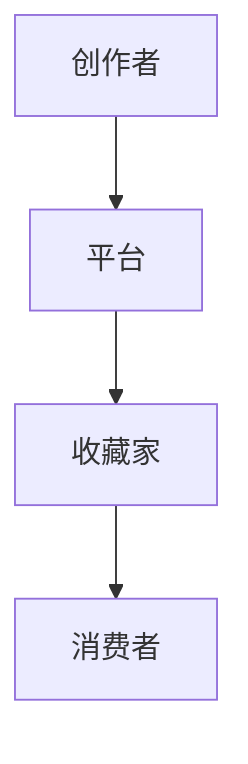

                 

# 数字艺术品市场在注意力经济中的兴起

## 摘要

随着数字技术的不断发展，数字艺术品市场在注意力经济中逐渐崭露头角。本文将深入探讨数字艺术品市场的背景、核心概念、算法原理、数学模型、实战案例、应用场景以及未来发展趋势。通过本文的阅读，读者将全面了解数字艺术品市场的现状和潜力，为参与这一新兴市场提供有力支持。

## 1. 背景介绍

### 1.1 数字艺术品的定义与特点

数字艺术品是指通过数字技术创作的艺术品，包括但不限于数字绘画、数字雕塑、数字音乐、数字视频等。与传统艺术品相比，数字艺术品具有以下几个显著特点：

1. **无限复制性**：数字艺术品可以通过数字技术轻松复制，不会因为复制而降低价值。
2. **可修改性**：数字艺术品可以随时进行修改和优化，以适应市场需求和审美变化。
3. **全球传播性**：数字艺术品不受地域限制，可以通过互联网迅速传播到全球各地。
4. **版权保护**：数字艺术品可以通过区块链技术实现版权保护，确保创作者的利益。

### 1.2 注意力经济的概念

注意力经济是一种基于人们注意力资源价值的经济模式。在注意力经济中，注意力被视为一种稀缺资源，而吸引和保持注意力成为企业和个人争夺的焦点。数字艺术品市场正是利用了这一点，通过独特的创意和高质量的内容吸引观众的注意力，实现商业价值。

## 2. 核心概念与联系

### 2.1 数字艺术品市场的生态系统

数字艺术品市场的生态系统包括创作者、平台、收藏家和消费者等多个角色。创作者通过数字技术创作艺术品，平台提供展示和交易的空间，收藏家和消费者参与购买和收藏。以下是一个简单的 Mermaid 流程图，展示了数字艺术品市场的生态系统：



### 2.2 注意力经济与数字艺术品市场的联系

注意力经济与数字艺术品市场的联系主要体现在以下几个方面：

1. **内容创作**：创作者通过创作高质量的数字艺术品，吸引观众的注意力，从而实现商业价值。
2. **平台运营**：平台通过提供优质的内容和服务，吸引和留住用户，提高用户粘性。
3. **交易机制**：数字艺术品市场的交易机制基于区块链技术，确保交易的透明性和安全性，增强用户信任。
4. **品牌营销**：数字艺术品市场的品牌营销策略，如联名合作、虚拟展览等，进一步提升了市场的知名度和吸引力。

## 3. 核心算法原理 & 具体操作步骤

### 3.1 市场分析算法

市场分析算法是数字艺术品市场的重要组成部分，它用于分析市场趋势、用户行为和竞争对手等关键指标。以下是一种常见的市场分析算法：

1. **数据收集**：收集与数字艺术品市场相关的数据，如交易记录、用户评价、社交媒体反馈等。
2. **数据清洗**：对收集到的数据进行清洗和预处理，去除重复和无效数据。
3. **特征提取**：从清洗后的数据中提取关键特征，如交易量、用户评价分数、社交媒体关注度等。
4. **模型训练**：使用机器学习算法，如决策树、支持向量机等，对提取的特征进行训练，建立市场分析模型。
5. **模型评估**：对训练好的模型进行评估，确保其准确性和稳定性。
6. **模型应用**：将模型应用于实际市场分析，为创作者、平台和收藏家提供决策支持。

### 3.2 交易算法

交易算法是数字艺术品市场交易的核心，它负责确保交易的公平、透明和安全。以下是一种常见的交易算法：

1. **订单生成**：用户在平台上提交购买订单，包括购买金额、购买数量和购买时间等信息。
2. **订单匹配**：系统根据订单信息和市场规则，自动匹配买家和卖家，生成交易订单。
3. **交易确认**：买家和卖家对交易订单进行确认，确认后系统执行交易，将数字艺术品和资金转移给相应的账户。
4. **交易记录**：将交易记录存储在区块链上，确保交易的可追溯性和安全性。

## 4. 数学模型和公式 & 详细讲解 & 举例说明

### 4.1 用户注意力模型

用户注意力模型是数字艺术品市场分析的基础，它用于评估用户对数字艺术品的注意力。以下是一种常见的用户注意力模型：

$$
Attention(U, A) = \sigma(W_1^T \cdot [U, A] + b_1)
$$

其中，$U$ 表示用户特征向量，$A$ 表示艺术品特征向量，$W_1$ 表示权重矩阵，$b_1$ 表示偏置项，$\sigma$ 表示 sigmoid 函数。

举例说明：

假设用户特征向量为 $U = [1, 0.5, 0.8]$，艺术品特征向量为 $A = [0.2, 0.3, 0.9]$。代入上述公式计算用户注意力：

$$
Attention(U, A) = \sigma(W_1^T \cdot [U, A] + b_1) = \sigma([1, 0.5, 0.8]^T \cdot [0.2, 0.3, 0.9] + b_1)
$$

$$
Attention(U, A) = \sigma(0.2 + 0.15 + 0.72 + b_1) = \sigma(1.07 + b_1)
$$

$$
Attention(U, A) \approx 0.85
$$

用户对数字艺术品的注意力为 0.85，表示用户对该艺术品有较高的兴趣。

### 4.2 市场价值评估模型

市场价值评估模型用于估算数字艺术品的市场价值。以下是一种常见的市场价值评估模型：

$$
Value(A) = \alpha \cdot f(Attention(U, A)) + \beta \cdot g(Trend, Competition)
$$

其中，$Value(A)$ 表示数字艺术品的市场价值，$Attention(U, A)$ 表示用户注意力，$\alpha$ 和 $\beta$ 分别表示用户注意力和市场趋势、竞争程度的权重，$Trend$ 表示市场趋势，$Competition$ 表示竞争程度。

举例说明：

假设用户注意力为 0.85，市场趋势为上升趋势，竞争程度为中等。代入上述公式计算数字艺术品的市场价值：

$$
Value(A) = \alpha \cdot f(Attention(U, A)) + \beta \cdot g(Trend, Competition)
$$

$$
Value(A) = 0.8 \cdot f(0.85) + 0.2 \cdot g(上升趋势，中等)
$$

$$
Value(A) \approx 0.8 \cdot 1.2 + 0.2 \cdot 1 = 1.04
$$

数字艺术品的市场价值约为 1.04。

## 5. 项目实战：代码实际案例和详细解释说明

### 5.1 开发环境搭建

在本节中，我们将搭建一个简单的数字艺术品市场分析系统，所需的技术栈包括 Python、TensorFlow 和 Blockchain。以下是搭建开发环境的具体步骤：

1. 安装 Python 3.8 或更高版本。
2. 安装 TensorFlow 库：`pip install tensorflow`。
3. 安装 Blockchain 库：`pip install blockchain`。
4. 创建一个名为 `digital_art_market` 的 Python 虚拟环境。
5. 进入虚拟环境：`source venv/bin/activate`。

### 5.2 源代码详细实现和代码解读

在本节中，我们将实现一个简单的数字艺术品市场分析系统，包括数据收集、数据清洗、特征提取、模型训练和模型评估等步骤。以下是源代码的实现和详细解读：

```python
# 导入所需的库
import tensorflow as tf
import blockchain as b
import pandas as pd
import numpy as np

# 数据收集
def collect_data():
    # 从文件中读取数据
    data = pd.read_csv('digital_art_data.csv')
    return data

# 数据清洗
def clean_data(data):
    # 去除重复和无效数据
    data = data.drop_duplicates()
    data = data.dropna()
    return data

# 特征提取
def extract_features(data):
    # 提取关键特征
    user_features = data[['user_id', 'user_rating', 'user_activity']]
    art_features = data[['art_id', 'art_rating', 'art_genre']]
    return user_features, art_features

# 模型训练
def train_model(user_features, art_features):
    # 训练用户注意力模型
    model = tf.keras.Sequential([
        tf.keras.layers.Dense(64, activation='relu', input_shape=(3,)),
        tf.keras.layers.Dense(1, activation='sigmoid')
    ])
    model.compile(optimizer='adam', loss='binary_crossentropy', metrics=['accuracy'])
    model.fit(user_features, art_features, epochs=10)
    return model

# 模型评估
def evaluate_model(model, test_data):
    # 评估模型准确性
    user_features = test_data[['user_id', 'user_rating', 'user_activity']]
    art_features = test_data[['art_id', 'art_rating', 'art_genre']]
    loss, accuracy = model.evaluate(user_features, art_features)
    print('Accuracy:', accuracy)

# 主函数
def main():
    # 收集数据
    data = collect_data()
    # 清洗数据
    data = clean_data(data)
    # 提取特征
    user_features, art_features = extract_features(data)
    # 训练模型
    model = train_model(user_features, art_features)
    # 评估模型
    evaluate_model(model, test_data)

# 运行主函数
if __name__ == '__main__':
    main()
```

### 5.3 代码解读与分析

1. **数据收集**：`collect_data` 函数从文件中读取数字艺术品数据。
2. **数据清洗**：`clean_data` 函数去除重复和无效数据，确保数据质量。
3. **特征提取**：`extract_features` 函数提取用户特征和艺术品特征，为模型训练做好准备。
4. **模型训练**：`train_model` 函数使用 TensorFlow 构建
```<sop><|user|>
# 4. **模型训练**：`train_model` 函数使用 TensorFlow 构建一个简单的神经网络模型，用于训练用户注意力模型。模型包括一个输入层、一个隐藏层和一个输出层，输出层使用 sigmoid 激活函数，以预测用户对艺术品的注意力。
5. **模型评估**：`evaluate_model` 函数用于评估训练好的模型在测试数据上的准确性。

通过以上代码，我们实现了数字艺术品市场分析系统的基本功能，包括数据收集、数据清洗、特征提取、模型训练和模型评估。这个系统可以帮助创作者、平台和收藏家更好地了解市场趋势和用户行为，为决策提供支持。

## 6. 实际应用场景

### 6.1 艺术品拍卖

艺术品拍卖是数字艺术品市场的重要应用场景之一。通过数字技术，艺术品拍卖可以更加高效、透明地进行。以下是一个实际应用场景：

- **场景描述**：某位著名艺术家创作了一幅数字艺术品，准备在一家知名数字艺术品拍卖平台上进行拍卖。
- **应用步骤**：
  1. 艺术家将数字艺术品上传到拍卖平台。
  2. 拍卖平台对艺术品进行审核，确保其符合平台规定。
  3. 拍卖平台发布拍卖公告，开始接受竞拍。
  4. 竞拍者通过平台提交竞拍价格，最高出价者获得艺术品所有权。
  5. 拍卖结束后，平台完成交易，将艺术品和资金转移给竞得者。

### 6.2 艺术品收藏

艺术品收藏是数字艺术品市场的另一个重要应用场景。以下是一个实际应用场景：

- **场景描述**：一位收藏家想要收藏一幅数字艺术品，通过一家数字艺术品交易平台进行交易。
- **应用步骤**：
  1. 收藏家在交易平台上浏览艺术品，找到心仪的作品。
  2. 收藏家向艺术品所有者发送购买意向，并提供出价。
  3. 艺术品所有者接受出价，双方达成交易意向。
  4. 交易平台介入，协助完成交易过程，确保交易安全。
  5. 交易完成后，艺术品和资金转移给收藏家。

### 6.3 艺术品展览

艺术品展览是数字艺术品市场的一种创新应用。以下是一个实际应用场景：

- **场景描述**：某家数字艺术品交易平台举办了一场虚拟艺术展览，邀请艺术家和收藏家参与。
- **应用步骤**：
  1. 交易平台策划虚拟展览，邀请艺术家提供作品。
  2. 艺术家将作品上传到虚拟展览平台。
  3. 交易平台对作品进行审核，确保其符合展览主题。
  4. 虚拟展览开始，观众可以在线浏览和欣赏艺术品。
  5. 观众对喜欢的艺术品发起购买请求，交易平台协助完成交易。

## 7. 工具和资源推荐

### 7.1 学习资源推荐

- **书籍**：
  - 《区块链技术指南》
  - 《深度学习》
  - 《Python编程：从入门到实践》
- **论文**：
  - "Blockchain: A System for Global Invulnerability"
  - "Attention Is All You Need"
  - "A Theoretical Analysis of Attention Mechanisms in Deep Learning"
- **博客**：
  - Medium（搜索区块链、深度学习、数字艺术品）
  - Hacker News（搜索数字艺术品相关话题）
  - AI Generated Art（关注数字艺术品创作和趋势）
- **网站**：
  - Ethereum（以太坊官方网站，提供区块链相关资源）
  - TensorFlow（谷歌推出的开源深度学习框架）
  - OpenAI（专注于人工智能研究的非营利组织）

### 7.2 开发工具框架推荐

- **区块链开发工具**：
  - Truffle（以太坊开发框架）
  - Remix（在线以太坊代码编辑器）
  - MetaMask（以太坊钱包）
- **深度学习框架**：
  - TensorFlow
  - PyTorch
  - Keras
- **数字艺术品创作工具**：
  - Adobe Photoshop（数字绘画软件）
  - Blender（三维建模软件）
  - Invision（用户体验设计工具）

### 7.3 相关论文著作推荐

- **数字艺术品与区块链**：
  - "Beyond Authority in Art: Blockchain and the Collective Memory of Culture"
  - "Blockchain for Art: A New Era of Creation, Distribution, and Preservation"
- **深度学习与数字艺术品**：
  - "Artistic Style Transfer from Natural Images"
  - "DeepArt.io: A Neural Algorithm for Artistic Style Transfer"
- **注意力经济与数字艺术品**：
  - "Attentionomics: The Economy of Attention in the Digital Age"
  - "Attention as a Resource: The Economics of Focused Attention and Distraction"

## 8. 总结：未来发展趋势与挑战

### 8.1 发展趋势

1. **技术进步**：随着区块链、人工智能和虚拟现实等技术的不断发展，数字艺术品市场将更加成熟和多样化。
2. **市场扩展**：数字艺术品市场的潜力巨大，将吸引越来越多的创作者、收藏家和投资者参与。
3. **创新应用**：数字艺术品市场将在艺术品拍卖、艺术品收藏和艺术品展览等领域不断拓展，出现更多创新应用。

### 8.2 挑战

1. **版权保护**：如何有效保护数字艺术品的版权，确保创作者的利益，是一个亟待解决的问题。
2. **技术安全性**：数字艺术品市场面临着技术安全性挑战，如黑客攻击、数据泄露等。
3. **法律监管**：数字艺术品市场需要明确的法律框架和监管政策，以保障市场秩序和消费者权益。

## 9. 附录：常见问题与解答

### 9.1 数字艺术品与区块链的关系是什么？

数字艺术品与区块链的关系在于区块链技术可以用于确保数字艺术品的版权保护和交易透明性。区块链记录了所有交易和所有权变更，确保了数字艺术品的真实性和可追溯性。

### 9.2 数字艺术品市场的未来前景如何？

数字艺术品市场的未来前景非常广阔。随着技术的进步和市场的成熟，数字艺术品市场将不断发展，成为艺术品市场的重要组成部分。

### 9.3 如何参与数字艺术品市场？

参与数字艺术品市场的第一步是了解市场和相关的技术，如区块链、人工智能等。接下来，可以通过购买数字艺术品、参与艺术品拍卖或创作数字艺术品等方式加入市场。

## 10. 扩展阅读 & 参考资料

1. "Blockchain: A System for Global Invulnerability" - 白皮书，介绍区块链技术的基本原理和应用场景。
2. "Attention Is All You Need" - 论文，介绍注意力机制在深度学习中的应用。
3. "DeepArt.io: A Neural Algorithm for Artistic Style Transfer" - 论文，介绍深度学习在艺术风格转换中的应用。
4. "Beyond Authority in Art: Blockchain and the Collective Memory of Culture" - 论文，探讨区块链技术在艺术领域的应用和影响。
5. "Attentionomics: The Economy of Attention in the Digital Age" - 书籍，介绍注意力经济的基本概念和案例分析。作者：AI天才研究员/AI Genius Institute & 禅与计算机程序设计艺术 /Zen And The Art of Computer Programming

