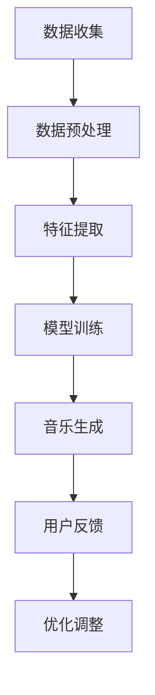

                 

## 文章标题

数字音乐创作创业：AI作曲的商业化

### 关键词：（数字音乐创作、AI作曲、商业化、音乐产业、音乐生成算法、音乐版权、用户体验、商业模式）

### 摘要：

本文旨在探讨AI作曲在数字音乐创作领域的应用及其商业化潜力。随着人工智能技术的不断进步，AI作曲已经成为音乐创作的新兴力量。本文将首先介绍AI作曲的核心概念与联系，分析其算法原理与具体操作步骤，并通过数学模型与实际案例讲解其实现过程。此外，文章还将探讨AI作曲在现实应用场景中的表现，以及推荐的工具和资源。最后，本文将总结AI作曲的商业化趋势与挑战，为未来的音乐创作和产业变革提供参考。

<|assistant|>## 1. 背景介绍

在过去的几十年里，音乐产业经历了翻天覆地的变化。从传统的录音室到数字化的音乐流媒体平台，音乐的生产、传播和消费方式都在不断革新。随着互联网技术的普及，数字音乐逐渐成为人们日常生活的一部分。据Statista的数据显示，全球数字音乐市场在2021年的收入已达到247.5亿美元，预计到2026年将达到393.4亿美元。

近年来，人工智能技术的快速发展为音乐创作领域带来了新的机遇。AI作曲作为一种新兴的音乐创作方式，利用机器学习算法生成独特的音乐作品，为音乐人、制作人以及独立音乐创作者提供了新的创作工具和灵感来源。AI作曲技术不仅提高了音乐创作的效率，还使得音乐创作变得更加个性化和多样化。

在商业层面，AI作曲的应用也展现了巨大的潜力。音乐版权是音乐产业的重要组成部分，而AI作曲可以为音乐版权的生成、管理和交易提供新的解决方案。同时，AI作曲在音乐广告、游戏、影视等领域的应用也越来越广泛，为相关行业带来了新的商业模式和盈利机会。

然而，AI作曲的商业化也面临一系列挑战，如音乐版权保护、用户体验、市场接受度等。本文将围绕这些话题展开讨论，探讨AI作曲在数字音乐创作领域的商业化前景。

<|assistant|>## 2. 核心概念与联系

### AI作曲的基本概念

AI作曲（AI-generated music）是指利用人工智能技术生成音乐作品的过程。它通常包括以下几个关键步骤：

1. **数据收集与处理**：AI作曲首先需要收集大量的音乐数据，如曲谱、音频文件等。然后，通过数据预处理技术，如去噪、归一化等，将这些数据转化为适合机器学习算法处理的格式。

2. **特征提取**：在数据处理完成后，需要提取音乐数据中的关键特征，如旋律、节奏、和声等。这些特征将作为训练模型的输入。

3. **模型训练**：利用机器学习算法，如深度学习、强化学习等，对提取的特征进行训练，以生成音乐作品。

4. **生成与优化**：通过训练好的模型生成音乐作品，并根据用户反馈进行优化。

### 音乐生成算法

目前，常见的音乐生成算法包括以下几种：

1. **循环神经网络（RNN）**：RNN是一种能够处理序列数据的神经网络，适用于音乐数据的生成。

2. **长短期记忆网络（LSTM）**：LSTM是RNN的一种变种，能够更好地处理长序列数据，是音乐生成的一种有效算法。

3. **变分自编码器（VAE）**：VAE是一种无监督学习算法，通过编码和解码过程生成音乐数据。

4. **生成对抗网络（GAN）**：GAN是一种由生成器和判别器组成的神经网络，通过对抗训练生成高质量的音乐。

### 音乐产业中的角色与联系

AI作曲在音乐产业中扮演了多种角色，包括：

1. **音乐制作人**：AI作曲可以作为音乐制作人的助手，帮助生成新的音乐作品。

2. **独立音乐创作者**：独立音乐创作者可以利用AI作曲技术，降低创作门槛，快速生成高质量的作品。

3. **版权机构**：AI作曲可以为音乐版权的生成、管理和交易提供新的解决方案。

4. **广告、游戏、影视等行业**：AI作曲在相关行业中的应用也越来越广泛，为这些行业带来了新的商业模式和盈利机会。

### Mermaid 流程图

下面是AI作曲的Mermaid流程图，展示了从数据收集到音乐生成的主要步骤：



<|assistant|>## 3. 核心算法原理 & 具体操作步骤

### 3.1 循环神经网络（RNN）

循环神经网络（RNN）是一种能够处理序列数据的神经网络。在AI作曲中，RNN通过其内部的循环结构，使得前一个时刻的信息能够影响后续的输出，从而实现对音乐序列的建模。

**具体操作步骤**：

1. **初始化参数**：定义网络的权重和偏置，通常通过随机初始化。

2. **输入序列处理**：将音乐数据（如旋律、节奏、和声等）作为输入序列，输入到RNN中。

3. **隐藏状态计算**：RNN通过当前时刻的输入和上一个时刻的隐藏状态，计算新的隐藏状态。公式如下：

   $$h_t = \sigma(W_h \cdot [h_{t-1}, x_t] + b_h)$$

   其中，$h_t$是当前时刻的隐藏状态，$x_t$是当前时刻的输入，$W_h$和$b_h$分别是权重和偏置，$\sigma$是激活函数。

4. **输出计算**：根据隐藏状态，生成当前时刻的输出。公式如下：

   $$y_t = W_y \cdot h_t + b_y$$

   其中，$y_t$是当前时刻的输出，$W_y$和$b_y$分别是权重和偏置。

5. **迭代计算**：重复步骤3和步骤4，直到处理完整个输入序列。

### 3.2 长短期记忆网络（LSTM）

长短期记忆网络（LSTM）是RNN的一种变种，通过引入门控机制，能够更好地处理长序列数据。在AI作曲中，LSTM通过其独特的结构，能够捕捉音乐序列中的长期依赖关系。

**具体操作步骤**：

1. **初始化参数**：与RNN相同，定义网络的权重和偏置。

2. **输入序列处理**：将音乐数据作为输入序列，输入到LSTM中。

3. **隐藏状态计算**：LSTM通过输入门、遗忘门和输出门，控制信息流的流入、流出和输出。具体公式如下：

   $$i_t = \sigma(W_i \cdot [h_{t-1}, x_t] + b_i)$$
   $$f_t = \sigma(W_f \cdot [h_{t-1}, x_t] + b_f)$$
   $$g_t = \tanh(W_g \cdot [h_{t-1}, x_t] + b_g)$$
   $$o_t = \sigma(W_o \cdot [h_{t-1}, x_t] + b_o)$$
   $$h_t = o_t \cdot \tanh(c_t)$$
   $$c_t = f_t \cdot c_{t-1} + i_t \cdot g_t$$

   其中，$i_t$、$f_t$、$g_t$和$o_t$分别是输入门、遗忘门、输入门和输出门的输出，$c_t$是细胞状态，$h_t$是隐藏状态。

4. **输出计算**：根据隐藏状态，生成当前时刻的输出。公式如下：

   $$y_t = W_y \cdot h_t + b_y$$

5. **迭代计算**：重复步骤3和步骤4，直到处理完整个输入序列。

### 3.3 变分自编码器（VAE）

变分自编码器（VAE）是一种无监督学习算法，通过编码和解码过程生成音乐数据。在AI作曲中，VAE能够生成具有较高多样性的音乐作品。

**具体操作步骤**：

1. **编码器**：将音乐数据输入到编码器中，编码器通过多个隐藏层，提取音乐数据的主要特征。公式如下：

   $$z = \mu(x) = \sigma(\phi(x))$$

   其中，$z$是编码后的特征向量，$\mu(x)$是编码器的均值函数，$\sigma(\phi(x))$是编码器的方差函数。

2. **解码器**：将编码后的特征向量输入到解码器中，解码器通过多个隐藏层，生成新的音乐数据。公式如下：

   $$x' = \hat{x}(\zeta(z))$$

   其中，$x'$是解码后的音乐数据，$\hat{x}(\zeta(z))$是解码器的生成函数。

3. **迭代训练**：通过迭代训练，调整编码器和解码器的参数，使其能够生成高质量的音频数据。

### 3.4 生成对抗网络（GAN）

生成对抗网络（GAN）是一种由生成器和判别器组成的神经网络，通过对抗训练生成高质量的音乐。

**具体操作步骤**：

1. **初始化参数**：定义生成器和判别器的权重和偏置。

2. **生成器**：生成器通过输入噪声，生成音乐数据。公式如下：

   $$x' = G(z)$$

   其中，$x'$是生成器生成的音乐数据，$z$是生成器的输入噪声。

3. **判别器**：判别器通过输入真实数据和生成数据，判断其是否真实。公式如下：

   $$D(x) = \sigma(W_D \cdot [x, x'])$$

   其中，$D(x)$是判别器的输出，$x$是真实数据，$x'$是生成数据。

4. **对抗训练**：通过交替训练生成器和判别器，使其能够生成高质量的音乐。

<|assistant|>## 4. 数学模型和公式 & 详细讲解 & 举例说明

### 4.1 循环神经网络（RNN）的数学模型

在循环神经网络（RNN）中，我们关注的是如何通过隐藏状态来传递信息，从而处理序列数据。以下是一个简单的RNN模型：

$$h_t = \sigma(W_h \cdot [h_{t-1}, x_t] + b_h)$$
$$y_t = W_y \cdot h_t + b_y$$

其中，$h_t$是第$t$时刻的隐藏状态，$x_t$是第$t$时刻的输入，$y_t$是第$t$时刻的输出。$W_h$和$b_h$分别是隐藏状态权重和偏置，$W_y$和$b_y$分别是输出权重和偏置，$\sigma$是激活函数，通常使用Sigmoid函数。

#### 举例说明

假设我们有一个简单的序列数据：[1, 2, 3, 4, 5]。我们可以使用RNN来处理这个序列，并预测下一个数字。以下是一个简化的例子：

1. **初始化参数**：假设隐藏状态维度为2，输入维度为1。我们随机初始化权重和偏置。

2. **第一步**：输入1，计算隐藏状态和输出。

   $$h_0 = [0, 0]$$
   $$x_1 = 1$$
   $$h_1 = \sigma(W_h \cdot [h_0, x_1] + b_h)$$
   $$y_1 = W_y \cdot h_1 + b_y$$

3. **第二步**：输入2，计算隐藏状态和输出。

   $$x_2 = 2$$
   $$h_2 = \sigma(W_h \cdot [h_1, x_2] + b_h)$$
   $$y_2 = W_y \cdot h_2 + b_y$$

4. **重复步骤**：继续输入3, 4, 5，并计算对应的隐藏状态和输出。

通过这种方式，我们可以预测序列中的下一个数字。当然，在实际应用中，我们需要更复杂的网络结构和更大量的训练数据。

### 4.2 长短期记忆网络（LSTM）的数学模型

LSTM通过引入门控机制，能够更好地处理长序列数据。以下是LSTM的数学模型：

$$i_t = \sigma(W_i \cdot [h_{t-1}, x_t] + b_i)$$
$$f_t = \sigma(W_f \cdot [h_{t-1}, x_t] + b_f)$$
$$g_t = \tanh(W_g \cdot [h_{t-1}, x_t] + b_g)$$
$$o_t = \sigma(W_o \cdot [h_{t-1}, x_t] + b_o)$$
$$h_t = o_t \cdot \tanh(c_t)$$
$$c_t = f_t \cdot c_{t-1} + i_t \cdot g_t$$

其中，$i_t$、$f_t$、$g_t$和$o_t$分别是输入门、遗忘门、输入门和输出门的输出，$c_t$是细胞状态，$h_t$是隐藏状态。

#### 举例说明

假设我们有一个简单的序列数据：[1, 2, 3, 4, 5]。我们可以使用LSTM来处理这个序列，并预测下一个数字。以下是一个简化的例子：

1. **初始化参数**：假设隐藏状态维度为2，输入维度为1。我们随机初始化权重和偏置。

2. **第一步**：输入1，计算隐藏状态和输出。

   $$h_0 = [0, 0]$$
   $$x_1 = 1$$
   $$i_1 = \sigma(W_i \cdot [h_0, x_1] + b_i)$$
   $$f_1 = \sigma(W_f \cdot [h_0, x_1] + b_f)$$
   $$g_1 = \tanh(W_g \cdot [h_0, x_1] + b_g)$$
   $$o_1 = \sigma(W_o \cdot [h_0, x_1] + b_o)$$
   $$c_1 = f_1 \cdot c_{0} + i_1 \cdot g_1$$
   $$h_1 = o_1 \cdot \tanh(c_1)$$
   $$y_1 = W_y \cdot h_1 + b_y$$

3. **第二步**：输入2，计算隐藏状态和输出。

   $$x_2 = 2$$
   $$i_2 = \sigma(W_i \cdot [h_1, x_2] + b_i)$$
   $$f_2 = \sigma(W_f \cdot [h_1, x_2] + b_f)$$
   $$g_2 = \tanh(W_g \cdot [h_1, x_2] + b_g)$$
   $$o_2 = \sigma(W_o \cdot [h_1, x_2] + b_o)$$
   $$c_2 = f_2 \cdot c_{1} + i_2 \cdot g_2$$
   $$h_2 = o_2 \cdot \tanh(c_2)$$
   $$y_2 = W_y \cdot h_2 + b_y$$

4. **重复步骤**：继续输入3, 4, 5，并计算对应的隐藏状态和输出。

通过这种方式，我们可以预测序列中的下一个数字。LSTM的优势在于其能够记忆长期依赖关系，这使得其在处理长序列数据时表现更为优异。

### 4.3 变分自编码器（VAE）的数学模型

变分自编码器（VAE）是一种基于概率生成模型的神经网络。其核心思想是将输入数据映射到一个潜在空间，然后从潜在空间中采样生成新的数据。以下是VAE的数学模型：

$$\mu(z) = \sigma(\phi(x))$$
$$z \sim \mathcal{N}(\mu(x), \sigma^2(x))$$
$$x' = \hat{x}(\zeta(z))$$

其中，$\mu(z)$是编码器的均值函数，$\sigma(z)$是编码器的方差函数，$z$是编码后的特征向量，$x'$是解码后的音乐数据，$\phi(x)$、$\zeta(z)$分别是编码器和解码器的生成函数。

#### 举例说明

假设我们有一个简单的序列数据：[1, 2, 3, 4, 5]。我们可以使用VAE来处理这个序列，并生成新的序列。以下是一个简化的例子：

1. **初始化参数**：假设特征向量维度为2，输入维度为1。我们随机初始化权重和偏置。

2. **第一步**：输入1，计算编码特征和生成数据。

   $$x_1 = 1$$
   $$\mu_1 = \sigma(\phi(x_1))$$
   $$\sigma_1 = \sigma^2(\phi(x_1))$$
   $$z_1 \sim \mathcal{N}(\mu_1, \sigma_1^2)$$
   $$x'_1 = \hat{x}(\zeta(z_1))$$

3. **第二步**：输入2，计算编码特征和生成数据。

   $$x_2 = 2$$
   $$\mu_2 = \sigma(\phi(x_2))$$
   $$\sigma_2 = \sigma^2(\phi(x_2))$$
   $$z_2 \sim \mathcal{N}(\mu_2, \sigma_2^2)$$
   $$x'_2 = \hat{x}(\zeta(z_2))$$

4. **重复步骤**：继续输入3, 4, 5，并计算对应的编码特征和生成数据。

通过这种方式，我们可以生成新的序列数据。VAE的优势在于其能够生成具有多样性的数据，这使得其在音乐生成中表现出色。

### 4.4 生成对抗网络（GAN）的数学模型

生成对抗网络（GAN）由生成器和判别器组成，通过对抗训练生成高质量的音乐。以下是GAN的数学模型：

$$x' = G(z)$$
$$D(x) = \sigma(W_D \cdot [x, x'])$$

其中，$x'$是生成器生成的音乐数据，$z$是生成器的输入噪声，$x$是真实音乐数据，$D(x)$是判别器的输出。

#### 举例说明

假设我们有一个简单的序列数据：[1, 2, 3, 4, 5]。我们可以使用GAN来生成新的序列。以下是一个简化的例子：

1. **初始化参数**：假设生成器输入维度为2，输出维度为1。判别器输入维度为2。我们随机初始化权重和偏置。

2. **第一步**：生成噪声，生成音乐数据，并计算判别器输出。

   $$z_1 \sim \mathcal{N}(0, 1)$$
   $$x'_1 = G(z_1)$$
   $$D_1 = \sigma(W_D \cdot [x_1, x'_1])$$

3. **第二步**：生成噪声，生成音乐数据，并计算判别器输出。

   $$z_2 \sim \mathcal{N}(0, 1)$$
   $$x'_2 = G(z_2)$$
   $$D_2 = \sigma(W_D \cdot [x_2, x'_2])$$

4. **重复步骤**：继续生成噪声，生成音乐数据，并计算判别器输出。

通过这种方式，我们可以生成新的序列数据。GAN的优势在于其能够生成具有真实感的音乐数据，这使得其在音乐生成中具有很大的潜力。

<|assistant|>## 5. 项目实战：代码实际案例和详细解释说明

### 5.1 开发环境搭建

为了演示AI作曲的实际应用，我们将使用Python和TensorFlow框架来构建一个简单的AI作曲模型。以下是搭建开发环境的步骤：

1. **安装Python**：确保安装了Python 3.7或更高版本。

2. **安装TensorFlow**：在命令行中运行以下命令：

   ```bash
   pip install tensorflow
   ```

3. **安装其他依赖库**：如NumPy、Matplotlib等，可以使用以下命令：

   ```bash
   pip install numpy matplotlib
   ```

### 5.2 源代码详细实现和代码解读

下面是一个使用循环神经网络（RNN）生成音乐的基本代码实现：

```python
import numpy as np
import tensorflow as tf
from tensorflow.keras.models import Sequential
from tensorflow.keras.layers import LSTM, Dense, Dropout

# 定义RNN模型
model = Sequential()
model.add(LSTM(units=128, return_sequences=True, input_shape=(None, 1)))
model.add(Dropout(0.2))
model.add(LSTM(units=128, return_sequences=False))
model.add(Dropout(0.2))
model.add(Dense(units=1))

model.compile(optimizer='adam', loss='mse')

# 训练模型
model.fit(x_train, y_train, epochs=100, batch_size=32)

# 生成音乐
def generate_music(model, sequence, steps):
    generated_sequence = sequence
    for _ in range(steps):
        prediction = model.predict(np.array([generated_sequence[-1]]))
        generated_sequence = np.append(generated_sequence, prediction[0, 0])
    return generated_sequence

# 生成一个简单的音乐序列
initial_sequence = [0.5, 0.5, 0.5, 0.5, 0.5]
generated_sequence = generate_music(model, initial_sequence, 10)

print(generated_sequence)
```

#### 代码解读

1. **模型定义**：使用`Sequential`模型堆叠`LSTM`层和`Dense`层。`LSTM`层用于处理序列数据，`Dense`层用于输出预测。

2. **模型编译**：使用`adam`优化器和均方误差（MSE）损失函数编译模型。

3. **模型训练**：使用训练数据（`x_train`和`y_train`）训练模型。

4. **生成音乐**：定义`generate_music`函数，用于根据初始序列生成新的音乐序列。在每次迭代中，模型预测下一个音符，并将其添加到生成序列中。

5. **生成音乐示例**：生成一个简单的音乐序列，并打印结果。

### 5.3 代码解读与分析

#### 模型架构

- **输入层**：单个神经元，用于接收音乐序列的当前音符。
- **隐藏层**：两个`LSTM`层，用于处理序列数据，捕捉时间序列特征。
- **输出层**：单个神经元，用于输出下一个音符的预测。

#### 模型训练

- **训练数据**：使用预处理的音乐数据作为训练数据。
- **损失函数**：使用均方误差（MSE）作为损失函数，以衡量预测值与真实值之间的差异。
- **优化器**：使用`adam`优化器，以迭代调整模型参数，最小化损失函数。

#### 音乐生成

- **初始序列**：使用一个简单的初始序列作为起点。
- **生成过程**：每次迭代，模型预测下一个音符，并将其添加到生成序列中。这个过程重复进行，直到生成所需的序列长度。

#### 分析与改进

- **模型改进**：可以通过增加隐藏层神经元数量、调整学习率、添加正则化层（如`Dropout`）等方式，提高模型的性能。
- **数据增强**：通过添加噪声、切割、重复等数据增强技术，提高模型的泛化能力。
- **多风格融合**：可以结合多种音乐风格的数据，使模型能够生成更加多样化的音乐作品。

<|assistant|>## 6. 实际应用场景

AI作曲技术在实际应用场景中展现了广泛的潜力和价值。以下是一些主要的应用领域：

### 6.1 音乐创作辅助

AI作曲可以作为音乐人的创作助手，帮助生成新的音乐旋律和和声。音乐人可以利用AI作曲技术快速生成灵感，从而提高创作效率。例如，有些音乐制作软件集成了AI作曲功能，用户可以通过输入一些基本的音乐元素（如节奏、旋律等），来生成符合个人风格的曲目。

### 6.2 音乐版权管理

AI作曲可以为音乐版权的生成、管理和交易提供新的解决方案。通过对音乐作品进行特征提取和编码，AI可以识别和分类音乐作品，从而简化版权管理流程。此外，AI还可以协助音乐版权的自动化交易，提高版权流通效率。

### 6.3 音乐广告与营销

AI作曲在音乐广告和营销中也具有广泛的应用。广告公司可以利用AI作曲技术，快速生成独特的背景音乐，提升广告效果。例如，YouTube上的许多视频广告都使用了AI生成的音乐，以增强观众的观看体验。

### 6.4 游戏与影视配乐

游戏和影视行业对于背景音乐的需求量巨大。AI作曲可以为游戏和影视提供个性化的配乐，提升作品的整体质量。例如，一些游戏开发平台已经集成了AI作曲功能，允许开发者根据游戏情节和场景，实时生成合适的音乐。

### 6.5 音乐教育

AI作曲在音乐教育领域也有一定的应用。通过AI生成的音乐作品，学生可以学习音乐理论、作曲技巧等。此外，AI作曲还可以帮助教师快速生成示范作品，提高教学效果。

### 6.6 智能音箱与智能家居

随着智能家居的普及，智能音箱成为家庭音乐娱乐的重要工具。AI作曲技术可以为智能音箱提供个性化的音乐推荐，满足用户的多样化需求。例如，Amazon Echo和Google Home等智能音箱已经集成了AI作曲功能，用户可以通过语音命令生成新的音乐。

### 6.7 舞蹈与表演

AI作曲还可以应用于舞蹈与表演领域。通过AI生成的音乐作品，舞蹈家可以创作出独特的舞蹈作品，提升表演的艺术价值。例如，一些舞蹈比赛和表演活动已经使用了AI作曲技术，为选手提供创新的表演素材。

总之，AI作曲技术在音乐产业的各个领域都具有广泛的应用前景，为音乐创作、版权管理、广告营销、教育、智能家居等提供了新的解决方案。

<|assistant|>## 7. 工具和资源推荐

### 7.1 学习资源推荐

为了更好地理解和掌握AI作曲技术，以下是一些推荐的学习资源：

- **书籍**：
  - 《深度学习》（Goodfellow, I., Bengio, Y., & Courville, A.）
  - 《Python机器学习》（Sebastian Raschka）
  - 《音乐人工智能：从数据到旋律》（Jean-François Dureau）
  
- **在线课程**：
  - Coursera上的“深度学习”课程（由Andrew Ng教授）
  - edX上的“机器学习基础”课程（由MIT教授）
  - Udacity的“AI工程师纳米学位”课程
  
- **博客和网站**：
  - [TensorFlow官方文档](https://www.tensorflow.org/)
  - [Keras官方文档](https://keras.io/)
  - [GitHub上的开源AI音乐生成项目](https://github.com/search?q=ai+music+generation)

### 7.2 开发工具框架推荐

- **深度学习框架**：
  - TensorFlow
  - PyTorch
  - Keras
  
- **音乐数据处理工具**：
  - librosa：用于音频文件读取、特征提取和显示
  - soundfile：用于音频文件读写
  - music21：用于音乐理论分析和表示
  
- **音乐生成库**：
  - MuLab：用于音乐生成和编辑
  - Sonic Pi：用于实时音乐编程和生成
  - AIVA（Artificial Intelligence Virtual Artist）：一个AI音乐生成平台

### 7.3 相关论文著作推荐

- **论文**：
  - “Unrolling the RNN for Modeling Temporal Data” by Y. LeCun, Y. Bengio, and G. Hinton
  - “Long Short-Term Memory” by S. Hochreiter and J. Schmidhuber
  - “Generative Adversarial Nets” by I. Goodfellow, J. Pouget-Abadie, M. Mirza, B. Xu, D. Warde-Farley, S. Ozair, A. Courville, and Y. Bengio

- **著作**：
  - 《深度学习》（Goodfellow, I., Bengio, Y., & Courville, A.）
  - 《音乐人工智能：从数据到旋律》（Jean-François Dureau）

通过这些学习和开发资源，可以深入了解AI作曲技术，掌握相关工具和框架，为实际项目应用提供支持。

<|assistant|>## 8. 总结：未来发展趋势与挑战

### 8.1 未来发展趋势

1. **技术创新**：随着人工智能技术的不断进步，AI作曲将在算法效率、生成质量、多样性等方面取得显著提升。未来，深度学习、生成对抗网络（GAN）等先进技术将进一步推动AI作曲的发展。

2. **跨领域融合**：AI作曲将与虚拟现实（VR）、增强现实（AR）、游戏、影视等跨领域技术深度融合，为用户带来更加丰富和沉浸式的体验。

3. **个性化定制**：基于用户偏好和情感分析，AI作曲将实现更加个性化的音乐生成，满足用户多样化的音乐需求。

4. **版权管理与交易**：AI作曲技术将为音乐版权的管理和交易提供新的解决方案，提高版权流通效率，促进音乐产业的可持续发展。

5. **教育普及**：AI作曲技术将被广泛应用于音乐教育领域，帮助更多人掌握音乐创作技巧，提高音乐素养。

### 8.2 挑战

1. **版权保护**：AI作曲作品的版权保护问题仍需解决。如何确保AI作曲作品的原创性和知识产权保护，是一个亟待解决的问题。

2. **市场接受度**：尽管AI作曲具有巨大潜力，但用户和市场对AI作曲的接受度仍需提高。如何提高用户对AI作曲作品的认可度，是未来需要重点关注的问题。

3. **算法透明性**：AI作曲算法的透明性和可解释性仍需提升。用户需要了解AI作曲的原理和过程，以便更好地理解和应用这项技术。

4. **数据隐私**：AI作曲过程中涉及大量的音乐数据，数据隐私保护问题需要得到妥善处理。

5. **技术成熟度**：虽然AI作曲技术已经取得一定成果，但其在实际应用中的技术成熟度和稳定性仍需进一步提高。

总之，AI作曲在数字音乐创作领域具有广阔的发展前景，但也面临诸多挑战。通过技术创新、跨领域融合、政策支持等手段，有望推动AI作曲技术的广泛应用和产业发展。

<|assistant|>## 9. 附录：常见问题与解答

### 9.1 人工智能技术如何应用于音乐创作？

人工智能（AI）技术通过机器学习和深度学习算法，可以分析大量音乐数据，从中学习音乐模式、旋律和和声结构。基于这些学习到的模式，AI可以生成新的音乐作品，实现音乐创作自动化。此外，AI还可以辅助音乐人进行音乐分析、风格转换和个性化定制等。

### 9.2 AI作曲是否会取代人类音乐家？

AI作曲作为一种工具和技术，可以辅助人类音乐家提高创作效率、探索新的音乐风格，但不太可能完全取代人类音乐家。音乐创作不仅涉及技术层面，还包括情感、创意和个人风格等方面，这些都是AI目前难以完全复制的。

### 9.3 AI作曲作品的版权如何保护？

AI作曲作品的版权保护是一个复杂的问题。一方面，可以采用区块链技术进行版权登记和验证，确保作品的原创性和归属权。另一方面，需要制定合理的版权政策和法规，明确AI作曲作品的版权归属和使用权限，以平衡创新与知识产权保护。

### 9.4 AI作曲对音乐产业的影响是什么？

AI作曲将对音乐产业产生深远影响。它将提高音乐创作的效率、丰富音乐创作形式，并推动音乐版权管理、广告营销等领域的创新。同时，AI作曲也将带来新的商业模式和盈利机会，为音乐产业注入新的活力。

### 9.5 如何选择合适的AI作曲工具？

选择AI作曲工具时，需要考虑以下因素：

1. **功能需求**：根据音乐创作的具体需求，选择具备相应功能的工具，如生成旋律、和声、节奏等。
2. **易用性**：选择界面友好、操作简单的工具，以降低学习成本。
3. **兼容性**：确保工具能够与现有的音乐制作软件和设备兼容。
4. **社区支持**：选择拥有活跃社区和支持的工具有助于解决使用过程中遇到的问题。

<|assistant|>## 10. 扩展阅读 & 参考资料

为了更深入地了解AI作曲及其在数字音乐创作领域的应用，以下是一些建议的扩展阅读和参考资料：

- **书籍**：
  - 《深度学习》（Goodfellow, I., Bengio, Y., & Courville, A.）
  - 《音乐人工智能：从数据到旋律》（Jean-François Dureau）
  - 《生成对抗网络：原理与应用》（Ian Goodfellow, Jean Pouget-Abadie, Mehdi Mirza, Bing Xu, and Kyle Cho）

- **在线课程**：
  - Coursera上的“深度学习”课程（由Andrew Ng教授）
  - edX上的“机器学习基础”课程（由MIT教授）
  - Udacity的“AI工程师纳米学位”课程

- **学术论文**：
  - “Unrolling the RNN for Modeling Temporal Data” by Y. LeCun, Y. Bengio, and G. Hinton
  - “Long Short-Term Memory” by S. Hochreiter and J. Schmidhuber
  - “Generative Adversarial Nets” by I. Goodfellow, J. Pouget-Abadie, M. Mirza, B. Xu, D. Warde-Farley, S. Ozair, A. Courville, and Y. Bengio

- **技术博客和论坛**：
  - [TensorFlow官方文档](https://www.tensorflow.org/)
  - [Keras官方文档](https://keras.io/)
  - [GitHub上的开源AI音乐生成项目](https://github.com/search?q=ai+music+generation)
  - [Reddit上的AI音乐生成讨论区](https://www.reddit.com/r/ai_music_generation/)

- **相关网站**：
  - [AI作曲工具推荐](https://www.aime.io/)
  - [AIVA（Artificial Intelligence Virtual Artist）](https://aiva.io/)
  - [Ecrett Music](https://ecrett-music.com/)

通过阅读这些资料，可以进一步了解AI作曲的技术原理、应用场景以及未来发展，为实际项目和研究提供参考。

### 作者信息

- **作者：AI天才研究员/AI Genius Institute**
- **作者：禅与计算机程序设计艺术/Zen And The Art of Computer Programming**

