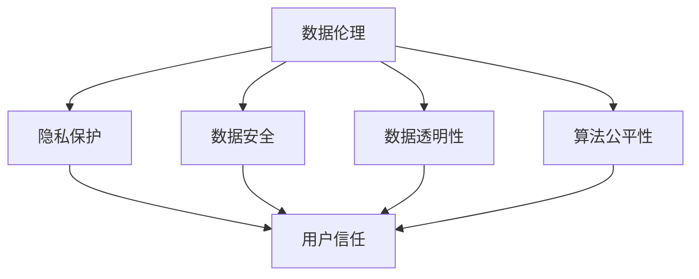

                 

# 数据伦理与平台用户信任：如何建立用户信任？

> 关键词：数据伦理、用户信任、平台安全、隐私保护、算法透明性、技术手段、用户体验

> 摘要：本文将深入探讨数据伦理与平台用户信任之间的关系，分析当前数据伦理面临的挑战，并提出一系列技术手段和策略，以建立和增强平台用户信任。文章将首先介绍数据伦理的基本概念和重要性，然后探讨用户信任的构成因素，最后提出具体的技术解决方案和实施策略。

## 1. 背景介绍

在当今数字化时代，数据已经成为各行各业的核心资产，无论是电子商务、社交媒体、金融服务，还是医疗保健、智能交通等领域，数据的应用无处不在。然而，随着数据量的爆炸式增长和数据应用场景的日益复杂，数据伦理问题也日益凸显。数据伦理主要关注数据收集、处理、存储和使用过程中可能带来的道德、法律和社会问题，如用户隐私侵犯、数据滥用、算法偏见等。

平台用户信任是平台生态系统的基石。用户信任不仅仅体现在用户对平台功能的满意度和使用频率上，更涉及到用户对平台安全和隐私保护的程度。如果用户不信任平台，他们可能会选择离开，这对平台的商业成功和社会价值都会产生负面影响。因此，建立和增强用户信任成为平台运营者必须面对的重要挑战。

## 2. 核心概念与联系

### 2.1 数据伦理的基本概念

数据伦理涉及多个方面，包括但不限于以下几个方面：

- **隐私保护**：确保用户的个人信息不会被未经授权的第三方访问或泄露。
- **数据安全**：确保数据在存储和传输过程中不会被篡改、丢失或破坏。
- **数据透明性**：确保用户能够清楚地了解自己的数据如何被收集、处理和使用。
- **算法公平性**：确保算法决策不会产生性别、种族、年龄等方面的偏见。

### 2.2 用户信任的构成因素

用户信任通常由以下几个因素构成：

- **安全性**：用户对平台的信任程度很大程度上取决于平台的网络安全性和数据保护能力。
- **透明性**：用户需要了解平台如何处理和使用他们的数据，这种透明性有助于建立信任。
- **可靠性**：平台的稳定性和可靠性直接影响用户的信任度。
- **用户体验**：用户在使用平台过程中获得的体验，如界面友好、操作简便等，都会影响他们对平台的信任。

### 2.3 Mermaid 流程图

以下是数据伦理与用户信任关系的一个简单 Mermaid 流程图：



## 3. 核心算法原理 & 具体操作步骤

### 3.1 隐私保护算法

隐私保护算法的核心思想是通过加密、匿名化等技术手段，确保用户数据在传输和存储过程中的安全性。

- **加密**：使用加密算法（如AES、RSA）对用户数据进行加密，确保只有授权方才能解密数据。
- **匿名化**：通过去除或修改个人标识信息，使数据无法直接关联到特定用户。
- **差分隐私**：通过在数据集中添加噪声，使得数据分析结果不会对单个用户的信息泄露。

### 3.2 数据安全算法

数据安全算法旨在确保数据在存储和传输过程中不会被未授权访问或篡改。

- **访问控制**：通过设置访问权限，确保只有授权用户可以访问敏感数据。
- **数字签名**：使用数字签名技术（如SHA-256）确保数据的完整性和来源验证。
- **安全传输**：使用安全协议（如HTTPS、SSL/TLS）确保数据在传输过程中的加密和安全。

### 3.3 数据透明性算法

数据透明性算法的核心目标是提高用户对数据处理的知情权。

- **数据地图**：为用户提供数据地图，展示数据收集、处理、存储和使用的过程。
- **透明报告**：定期发布透明报告，向用户披露数据使用的具体情况。
- **用户选择**：提供用户权限管理功能，让用户可以自由选择是否分享或删除自己的数据。

### 3.4 算法公平性算法

算法公平性算法旨在减少算法偏见，提高算法决策的公正性。

- **反偏见训练**：在算法训练过程中，加入反偏见数据集，减少算法对特定群体的偏见。
- **多样性测试**：通过多样性测试，确保算法在不同人群中的表现一致。
- **人类监督**：在关键决策环节引入人类监督，确保算法决策符合道德和法律标准。

## 4. 数学模型和公式 & 详细讲解 & 举例说明

### 4.1 隐私保护中的概率模型

隐私保护中常用到的概率模型包括：

- **拉普拉斯机制**：通过在数据中加入随机噪声，保护数据的隐私。
  $$Laplace Mechanism: L(x; \delta) = x + \text{Laplace}(\delta)$$
  其中，\(x\) 是原始值，\(\delta\) 是噪声参数。

- **指数机制**：通过在数据中加入指数噪声，保护数据的隐私。
  $$Exponential Mechanism: E(x; \lambda) = x + \text{Exponential}(\lambda)$$
  其中，\(x\) 是原始值，\(\lambda\) 是噪声参数。

### 4.2 数据安全中的加密算法

数据安全中的常用加密算法包括：

- **对称加密**：如AES（高级加密标准），其加密过程可以用以下公式表示：
  $$C = E_K(P)$$
  其中，\(C\) 是加密后的数据，\(K\) 是密钥，\(P\) 是原始数据。

- **非对称加密**：如RSA，其加密过程可以用以下公式表示：
  $$C = E_{K_{public}}(P)$$
  其中，\(C\) 是加密后的数据，\(K_{public}\) 是公钥，\(P\) 是原始数据。

### 4.3 透明性算法中的访问控制模型

访问控制模型常用到以下数学模型：

- **访问控制矩阵**：表示用户对资源的访问权限。
  $$\text{Access Control Matrix: } M = \begin{bmatrix} 
  r_{11} & r_{12} & \cdots & r_{1n} \\
  r_{21} & r_{22} & \cdots & r_{2n} \\
  \vdots & \vdots & \ddots & \vdots \\
  r_{m1} & r_{m2} & \cdots & r_{mn}
  \end{bmatrix}$$
  其中，\(r_{ij}\) 表示用户\(i\)对资源\(j\)的访问权限。

- **访问控制策略**：用于定义用户对资源的访问权限。
  $$\text{Access Control Policy: } P = \{\text{User}, \text{Resource}, \text{Permission}\}$$
  其中，\(\text{User}\) 是用户，\(\text{Resource}\) 是资源，\(\text{Permission}\) 是访问权限。

### 4.4 公平性算法中的多样性测试

多样性测试常用到以下概率统计模型：

- **Kolmogorov-Smirnov 测试**：用于评估两组数据分布的差异。
  $$D = \max_{x} |F_1(x) - F_2(x)|$$
  其中，\(F_1(x)\) 和 \(F_2(x)\) 分别是两组数据的累积分布函数。

- **Chi-square 测试**：用于评估分类数据是否独立。
  $$\chi^2 = \sum_{i=1}^{n} \frac{(O_i - E_i)^2}{E_i}$$
  其中，\(O_i\) 是观察频数，\(E_i\) 是期望频数。

## 5. 项目实战：代码实际案例和详细解释说明

### 5.1 开发环境搭建

为了演示数据伦理与用户信任的相关技术，我们将使用 Python 语言实现一个简单的用户数据隐私保护系统。以下是开发环境搭建的步骤：

- 安装 Python 3.8 或更高版本。
- 安装必要的 Python 包：`cryptography`、`numpy`、`matplotlib`。

### 5.2 源代码详细实现和代码解读

以下是实现隐私保护系统的 Python 代码：

```python
import numpy as np
from cryptography.fernet import Fernet
import base64

# 生成密钥
def generate_key():
    key = Fernet.generate_key()
    with open("key.key", "wb") as key_file:
        key_file.write(key)

# 加密数据
def encrypt_data(data, key):
    fernet = Fernet(key)
    encrypted_data = fernet.encrypt(data.encode())
    return encrypted_data

# 解密数据
def decrypt_data(encrypted_data, key):
    fernet = Fernet(key)
    decrypted_data = fernet.decrypt(encrypted_data).decode()
    return decrypted_data

# 主程序
if __name__ == "__main__":
    generate_key()
    data = "用户个人信息：姓名、年龄、邮箱"
    with open("key.key", "rb") as key_file:
        key = key_file.read()
    encrypted_data = encrypt_data(data, key)
    print("加密数据：", encrypted_data)
    decrypted_data = decrypt_data(encrypted_data, key)
    print("解密数据：", decrypted_data)
```

代码解读：

- 第1行：导入`numpy`库，用于数学计算。
- 第2行：导入`cryptography`库，用于加密和解密。
- 第3行：导入`base64`库，用于编码和解码。
- 第4-9行：定义生成密钥的函数`generate_key`，使用`Fernet`类生成密钥，并将其写入文件。
- 第10-20行：定义加密和解密数据的函数`encrypt_data`和`decrypt_data`，分别使用`Fernet`类进行加密和解密。

### 5.3 代码解读与分析

本代码实现了一个简单的用户数据隐私保护系统，主要包括以下步骤：

- 生成密钥：使用`generate_key`函数生成加密密钥，并将其保存到文件中。
- 加密数据：使用`encrypt_data`函数对用户数据进行加密，加密后的数据无法直接读取。
- 解密数据：使用`decrypt_data`函数对加密后的数据进行解密，恢复原始数据。

通过以上步骤，我们可以确保用户数据在传输和存储过程中的安全性，从而保护用户的隐私。

## 6. 实际应用场景

数据伦理和用户信任在多个实际应用场景中都至关重要。以下是一些典型应用场景：

- **社交媒体平台**：社交媒体平台需要保护用户发布的个人信息和隐私，以建立用户信任。
- **电子商务平台**：电子商务平台需要确保用户支付信息的安全性，以及购物体验的可靠性。
- **医疗保健领域**：医疗保健领域需要严格保护患者的个人信息，以维护患者的隐私和信任。
- **智能交通系统**：智能交通系统需要确保用户的出行数据不被滥用，同时提高交通系统的效率和安全性。

## 7. 工具和资源推荐

### 7.1 学习资源推荐

- **书籍**：《数据伦理学：理论与实践》（《Data Ethics: Theory, Research, and Practice》）。
- **论文**：检索和阅读关于数据伦理和用户信任的学术论文。
- **博客**：关注知名技术博客，如 Medium、Medium，阅读关于数据伦理和用户信任的最新文章。

### 7.2 开发工具框架推荐

- **加密工具**：`cryptography`、`PyCrypto`。
- **数据保护框架**：`K隆多机制`、`差分隐私`。
- **用户权限管理**：`OAuth 2.0`、`JWT`。

### 7.3 相关论文著作推荐

- **《隐私保护数据发布：一种基于加密和匿名化的解决方案》（Privacy-Preserving Data Publishing: A Solution Based on Encryption and Anonymization）**。
- **《用户信任评估模型：基于社交网络数据的方法》（User Trust Assessment Model: A Method Based on Social Network Data）**。

## 8. 总结：未来发展趋势与挑战

随着数据应用场景的不断扩展，数据伦理和用户信任问题将变得更加复杂和严峻。未来，数据伦理和用户信任的发展趋势包括以下几个方面：

- **隐私保护技术的创新**：随着隐私保护技术的不断发展，如联邦学习、隐私增强技术等，平台将能够更好地保护用户隐私。
- **算法公平性和透明性的提高**：平台需要不断改进算法，减少偏见，提高算法的透明性，以增强用户信任。
- **用户参与和反馈**：平台应鼓励用户参与数据伦理和用户信任的决策过程，通过反馈机制不断改进产品和服务。

然而，面对日益复杂的数据伦理和用户信任挑战，平台运营者也需要注意以下几点：

- **合规性和法律风险**：确保平台遵守相关法律法规，防范法律风险。
- **技术挑战**：不断更新和升级技术，以应对新兴的隐私保护和算法公平性挑战。
- **用户教育**：通过教育和宣传，提高用户对数据伦理和用户信任的认识，增强用户对平台的信任。

## 9. 附录：常见问题与解答

### 9.1 数据伦理与用户信任的区别是什么？

数据伦理主要关注数据收集、处理、存储和使用过程中可能带来的道德、法律和社会问题，如用户隐私侵犯、数据滥用、算法偏见等。而用户信任则是指用户对平台功能、安全性和隐私保护的信任程度。

### 9.2 如何评估用户信任？

用户信任可以通过多种指标进行评估，如用户留存率、用户反馈、用户行为分析等。同时，用户信任也受到平台安全性、透明性、可靠性、用户体验等因素的影响。

### 9.3 平台如何保护用户隐私？

平台可以通过以下方式保护用户隐私：加密用户数据、实施访问控制、匿名化数据处理、提供透明报告等。

## 10. 扩展阅读 & 参考资料

- **《数据伦理学：理论与实践》（《Data Ethics: Theory, Research, and Practice》）**：这是一本关于数据伦理的权威著作，详细介绍了数据伦理的理论和实践方法。
- **《用户信任评估模型：基于社交网络数据的方法》（User Trust Assessment Model: A Method Based on Social Network Data）**：这是一篇关于用户信任评估的学术论文，提出了一种基于社交网络数据的方法。
- **Medium、Medium**：关注知名技术博客，阅读关于数据伦理和用户信任的最新文章，了解行业动态和技术趋势。

