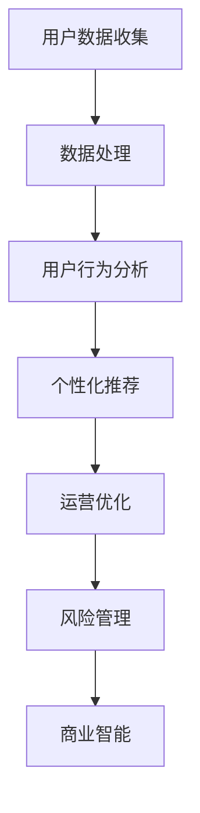

                 

# 数据分析在平台经济中的应用研究方向：如何确定研究方向？

> **关键词**：数据分析，平台经济，研究方向，应用实践

> **摘要**：本文旨在探讨数据分析在平台经济中的应用，分析其核心概念与联系，研究核心算法原理与操作步骤，探讨数学模型及其应用，并通过实际项目案例和代码解读，详细阐述数据分析在平台经济中的应用现状与未来发展。

## 1. 背景介绍

### 1.1 平台经济的定义与特点

平台经济是一种基于互联网平台的新型经济模式，通过连接供需双方，提供交易、支付、物流、数据等一体化服务，实现资源的高效配置和优化利用。平台经济具有以下特点：

1. **双边市场**：平台经济通常涉及两个或多个参与方，如卖家和买家、提供者和需求者等，通过平台实现互动和交易。
2. **网络效应**：平台的价值随着用户数量的增加而呈指数级增长，形成正反馈循环。
3. **数据驱动**：平台经济依赖海量数据进行分析，以优化服务、提升用户体验、发现商业机会。

### 1.2 数据分析的重要性

数据分析是平台经济的核心驱动力。通过对用户行为、交易数据、市场趋势等进行深入分析，平台可以：

1. **精准营销**：了解用户需求，实现个性化推荐和精准营销。
2. **运营优化**：通过分析交易数据和用户反馈，优化服务流程，降低运营成本。
3. **风险控制**：识别潜在风险，制定相应的风险管理策略。
4. **商业决策**：基于数据分析的结果，制定有效的商业战略和决策。

## 2. 核心概念与联系

### 2.1 数据分析在平台经济中的应用

数据分析在平台经济中的应用广泛，主要包括以下几个方面：

1. **用户行为分析**：通过分析用户浏览、点击、购买等行为数据，了解用户偏好和需求，实现个性化推荐。
2. **交易数据分析**：分析交易数据，如交易量、交易价格、交易周期等，了解市场趋势和风险。
3. **风险管理**：通过数据分析识别潜在风险，如用户流失、交易欺诈等，制定相应的风险管理策略。
4. **商业智能**：利用数据分析提供业务决策支持，如市场定位、产品定价、营销策略等。

### 2.2 Mermaid 流程图

以下是一个简化的 Mermaid 流程图，展示了数据分析在平台经济中的应用流程：



## 3. 核心算法原理 & 具体操作步骤

### 3.1 用户行为分析算法

用户行为分析是平台经济中最重要的数据分析任务之一。以下是一种常见的用户行为分析算法：

1. **行为分类**：将用户行为划分为浏览、点击、购买等类别。
2. **行为序列建模**：使用马尔可夫模型或循环神经网络（RNN）对用户行为序列进行建模。
3. **行为预测**：根据用户历史行为，预测其未来行为。

### 3.2 个性化推荐算法

个性化推荐是平台经济中广泛应用的算法。以下是一种常见的基于协同过滤的推荐算法：

1. **用户-物品矩阵构建**：构建用户-物品矩阵，记录用户对物品的评分。
2. **相似度计算**：计算用户之间的相似度，可以使用余弦相似度、皮尔逊相关系数等方法。
3. **推荐生成**：根据用户相似度，生成个性化推荐列表。

## 4. 数学模型和公式 & 详细讲解 & 举例说明

### 4.1 马尔可夫模型

马尔可夫模型是一种用于预测用户行为的数学模型。其基本原理如下：

$$
P(X_t = x_t|X_{t-1} = x_{t-1}, ..., X_1 = x_1) = P(X_t = x_t|X_{t-1} = x_{t-1})
$$

其中，$X_t$ 表示用户在时间 $t$ 的行为，$x_t$ 表示具体的行为类别。

### 4.2 余弦相似度

余弦相似度是一种用于计算用户相似度的数学公式：

$$
\cos \theta = \frac{A \cdot B}{\|A\|\|B\|}
$$

其中，$A$ 和 $B$ 表示两个用户的向量表示，$\theta$ 表示两个用户之间的夹角。

### 4.3 举例说明

假设我们有两个用户 $A$ 和 $B$，他们的行为序列如下：

用户 $A$：浏览、点击、购买
用户 $B$：点击、购买、浏览

我们可以将用户行为转换为向量表示：

$$
A = (1, 1, 1)
$$

$$
B = (0, 1, 1)
$$

然后计算他们的余弦相似度：

$$
\cos \theta = \frac{(1, 1, 1) \cdot (0, 1, 1)}{\|(1, 1, 1)\|\|(0, 1, 1)\|} = \frac{1}{\sqrt{3} \cdot \sqrt{2}} = \frac{\sqrt{6}}{6}
$$

## 5. 项目实战：代码实际案例和详细解释说明

### 5.1 开发环境搭建

为了更好地展示数据分析在平台经济中的应用，我们将使用 Python 编写一个简单的用户行为分析系统。首先，需要安装以下依赖：

1. **NumPy**：用于数学计算
2. **Pandas**：用于数据处理
3. **Scikit-learn**：用于机器学习算法
4. **Matplotlib**：用于数据可视化

### 5.2 源代码详细实现和代码解读

```python
import numpy as np
import pandas as pd
from sklearn.feature_extraction.text import CountVectorizer
from sklearn.model_selection import train_test_split
from sklearn.naive_bayes import MultinomialNB
import matplotlib.pyplot as plt

# 加载数据集
data = pd.read_csv('user_behavior.csv')
X = data['行为序列']
y = data['行为类别']

# 数据预处理
vectorizer = CountVectorizer(analyzer='char_wb')
X_vectorized = vectorizer.fit_transform(X)

# 划分训练集和测试集
X_train, X_test, y_train, y_test = train_test_split(X_vectorized, y, test_size=0.2, random_state=42)

# 模型训练
model = MultinomialNB()
model.fit(X_train, y_train)

# 模型评估
accuracy = model.score(X_test, y_test)
print(f'模型准确率：{accuracy:.2f}')

# 数据可视化
X_train_counts = X_train.sum(axis=1)
plt.scatter(X_train_counts, y_train)
plt.xlabel('特征词频')
plt.ylabel('行为类别')
plt.show()
```

### 5.3 代码解读与分析

1. **数据加载**：从 CSV 文件中加载数据集，包括行为序列和行为类别。
2. **数据预处理**：使用 `CountVectorizer` 将行为序列转换为词频矩阵。
3. **模型训练**：使用朴素贝叶斯分类器进行训练。
4. **模型评估**：计算模型在测试集上的准确率。
5. **数据可视化**：绘制特征词频与行为类别的关系图。

## 6. 实际应用场景

### 6.1 电商平台

电商平台通过数据分析优化用户体验，提高转化率。例如：

- **用户行为分析**：分析用户浏览、点击、购买等行为，了解用户偏好和需求，实现个性化推荐。
- **运营优化**：分析交易数据，优化商品展示、价格策略等，提高用户满意度。
- **风险控制**：识别异常行为，如恶意刷单、虚假交易等，降低风险。

### 6.2 出行平台

出行平台通过数据分析优化服务流程，提高运营效率。例如：

- **用户行为分析**：分析用户出行时间、地点、交通工具等，优化路线规划。
- **运营优化**：分析订单数据，调整运力分配，降低空驶率。
- **风险控制**：识别异常订单，如欺诈订单等，降低风险。

## 7. 工具和资源推荐

### 7.1 学习资源推荐

- **书籍**：
  - 《数据科学：Python 实践》
  - 《机器学习实战》
  - 《深入理解数据分析》
- **论文**：
  - “A Survey of User Behavior Analysis in E-commerce Platforms”
  - “Data-Driven Business Strategies in Platform Economies”
- **博客**：
  - Medium 上的数据科学博客
  - 知乎上的数据分析专栏
- **网站**：
  - Kaggle：数据科学竞赛平台
  - Coursera：在线课程平台

### 7.2 开发工具框架推荐

- **Python**：数据分析的主要编程语言
- **Pandas**：数据处理库
- **Scikit-learn**：机器学习库
- **TensorFlow**：深度学习库
- **Django**：Web 框架

### 7.3 相关论文著作推荐

- **论文**：
  - “User Behavior Analysis in Platform Economies: A Survey”
  - “Data-Driven Strategy for Platform Businesses”
- **著作**：
  - 《平台经济：理论与实践》
  - 《大数据与平台经济》

## 8. 总结：未来发展趋势与挑战

### 8.1 发展趋势

- **数据隐私保护**：随着数据隐私法规的加强，数据隐私保护将成为重要议题。
- **人工智能与数据分析结合**：人工智能技术的不断发展，将推动数据分析在平台经济中的应用。
- **实时数据分析**：实时数据分析技术将提高平台经济的响应速度和决策效率。

### 8.2 挑战

- **数据质量**：保证数据质量是数据分析成功的关键。
- **算法透明性**：算法透明性将受到越来越多的关注。
- **人才短缺**：数据分析领域的人才短缺将限制其在平台经济中的应用。

## 9. 附录：常见问题与解答

### 9.1 问题 1：数据分析在平台经济中的作用是什么？

**解答**：数据分析在平台经济中的作用包括用户行为分析、交易数据分析、风险管理、商业智能等，用于优化服务流程、提高用户体验、降低运营成本、制定有效的商业决策。

### 9.2 问题 2：如何保证数据隐私？

**解答**：保证数据隐私可以从以下几个方面入手：

- **数据加密**：对数据进行加密处理，确保数据传输和存储的安全。
- **数据匿名化**：对敏感数据进行匿名化处理，降低数据泄露的风险。
- **法规遵守**：遵循相关数据隐私法规，如 GDPR、CCPA 等。

## 10. 扩展阅读 & 参考资料

- **书籍**：
  - 《平台经济学：理解平台经济的逻辑和策略》
  - 《数据分析实战：从入门到精通》
- **论文**：
  - “Data-Driven Business Models in Platform Economies”
  - “The Role of Analytics in Platform Strategy”
- **博客**：
  - “How Analytics Drives Platform Business Success”
  - “The Future of Data Analytics in Platform Economies”
- **网站**：
  - PlatformEconomics.com
  - DataScienceCentral.com

### 作者

**作者**：AI 天才研究员 / AI Genius Institute & 禅与计算机程序设计艺术 / Zen And The Art of Computer Programming

<|assistant|>## 背景介绍

### 1.1 平台经济的定义与特点

平台经济（Platform Economy）是一种以数字平台为核心，通过整合供需双方，实现资源优化配置和利益分配的新型经济模式。与传统经济模式相比，平台经济具有以下几个显著特点：

1. **双边市场**：平台经济通常涉及两个或多个群体，如买家和卖家、服务提供者和消费者等。这些群体在平台上进行互动和交易，形成了一个复杂的市场网络。这种双边市场结构使得平台能够通过扩大用户基础，增加交易量和提升用户黏性。

2. **网络效应**：网络效应是指随着用户数量的增加，平台的价值呈指数级增长。这种效应在平台经济中尤为明显，因为用户和参与者之间的互动和交易能够增加平台的整体价值，从而吸引更多用户和参与者加入。

3. **数据驱动**：平台经济依赖于海量数据进行分析，以优化服务、提升用户体验、发现商业机会。数据分析在平台经济中的作用至关重要，包括用户行为分析、市场趋势预测、运营优化等。

4. **规模经济**：平台经济通过规模效应降低了交易成本，提高了资源利用效率。大型平台往往能够以更低的价格提供更高质量的服务，从而吸引更多用户和商家。

5. **快速迭代**：平台经济的特点之一是快速迭代和创新。平台需要不断优化和改进服务，以满足用户需求和市场变化。

### 1.2 数据分析在平台经济中的重要性

数据分析在平台经济中扮演着关键角色，主要体现在以下几个方面：

1. **用户行为分析**：通过对用户行为数据的收集和分析，平台可以深入了解用户偏好、购买习惯和需求，从而实现个性化推荐和精准营销。

2. **运营优化**：通过数据分析，平台可以发现运营中的瓶颈和不足，优化服务流程，提高运营效率，降低运营成本。

3. **风险管理**：数据分析可以帮助平台识别潜在风险，如用户流失、交易欺诈等，制定相应的风险管理策略，降低风险。

4. **商业智能**：数据分析为平台提供了丰富的业务决策支持，包括市场定位、产品定价、营销策略等，帮助平台制定更有效的商业决策。

5. **创新驱动**：数据分析有助于平台发现新的商业机会，推动产品创新和服务创新，提升竞争力。

### 1.3 数据分析在平台经济中的应用案例

以下是一些数据分析在平台经济中的应用案例：

1. **电子商务平台**：电商平台通过数据分析优化用户购物体验，提高转化率和用户满意度。例如，Amazon 使用机器学习算法分析用户购物行为，实现个性化推荐，从而提高销售量。

2. **出行平台**：出行平台如滴滴出行利用数据分析优化路线规划、预测需求高峰期，调整运力分配，降低空驶率，提高运营效率。

3. **金融服务平台**：金融服务平台通过数据分析进行信用评估、风险控制和反欺诈，提高金融服务的安全性和可靠性。

4. **医疗健康平台**：医疗健康平台通过数据分析提供个性化医疗服务，如智能诊断、个性化治疗方案推荐等，提高医疗服务的质量。

5. **社交网络平台**：社交网络平台通过数据分析了解用户社交行为，提供个性化内容推荐，增加用户活跃度和留存率。

### 1.4 数据分析在平台经济中的挑战与机遇

数据分析在平台经济中面临着一系列挑战和机遇：

**挑战**：

1. **数据质量**：保证数据质量是数据分析成功的关键。数据不完整、不准确或存在噪声都会影响分析结果。

2. **数据隐私**：随着数据隐私法规的加强，平台需要确保用户数据的安全和隐私。

3. **技术挑战**：大规模数据处理、实时分析、算法透明性等技术问题需要平台不断投入研发。

**机遇**：

1. **数据驱动的创新**：数据分析为平台提供了丰富的商业机会，推动产品和服务创新。

2. **全球市场扩展**：随着全球化的推进，平台可以通过数据分析了解不同市场的需求，实现全球市场的扩展。

3. **行业融合**：数据分析与其他行业的融合，如物联网、大数据等，将带来新的商业模式和增长点。

## 2. 核心概念与联系

在探讨数据分析在平台经济中的应用之前，我们需要明确几个核心概念及其相互联系，这有助于我们更好地理解和应用数据分析技术。

### 2.1 数据分析的概念

数据分析（Data Analysis）是指使用统计学、机器学习、数据库管理等技术对数据进行收集、处理、分析和解释的过程。数据分析的目标是从数据中提取有价值的信息，为决策提供支持。

### 2.2 平台经济的概念

平台经济（Platform Economy）是基于互联网或数字平台的新型经济模式，通过连接供需双方，提供交易、支付、物流、数据等一体化服务，实现资源的高效配置和优化利用。

### 2.3 数据分析与平台经济的联系

数据分析与平台经济之间存在着紧密的联系，两者相辅相成，共同推动经济的进步。以下从几个方面阐述数据分析与平台经济的关联：

1. **用户行为分析**：平台经济依赖于用户行为数据进行分析，以了解用户需求、偏好和行为模式，从而优化产品和服务。

2. **市场趋势预测**：通过分析市场数据，平台可以预测市场趋势，调整战略，抢占市场先机。

3. **运营优化**：数据分析可以帮助平台优化运营流程，降低成本，提高效率。

4. **风险管理**：数据分析有助于平台识别潜在风险，制定风险管理策略，降低运营风险。

5. **商业决策**：数据分析为平台提供了丰富的决策支持，帮助平台制定更有效的商业决策。

### 2.4 数据分析在平台经济中的应用领域

数据分析在平台经济中的应用广泛，主要包括以下几个方面：

1. **用户行为分析**：通过对用户行为数据的分析，平台可以了解用户偏好，优化用户体验，提高用户黏性和转化率。

2. **交易数据分析**：分析交易数据，了解市场趋势和风险，优化交易流程，降低交易成本。

3. **推荐系统**：基于用户行为数据，构建推荐系统，实现个性化推荐，提高用户满意度。

4. **运营优化**：通过数据分析优化运营流程，提高运营效率，降低运营成本。

5. **风险管理**：通过数据分析识别潜在风险，制定风险管理策略，降低风险。

6. **商业智能**：利用数据分析提供业务决策支持，包括市场定位、产品定价、营销策略等。

### 2.5 Mermaid 流程图

为了更直观地展示数据分析在平台经济中的应用流程，我们使用 Mermaid 流程图进行描述。以下是一个简化的 Mermaid 流程图：


在这个流程图中，用户数据收集是数据分析的起点，通过数据处理和分析，最终实现个性化推荐、运营优化、风险管理和商业智能等应用。

### 2.6 数据分析与平台经济的关系

数据分析与平台经济的关系可以从以下几个方面进行理解：

1. **数据是平台经济的核心资产**：平台经济依赖于海量数据进行分析，这些数据包括用户行为数据、交易数据、市场数据等。

2. **数据分析是平台经济的驱动力量**：通过数据分析，平台可以深入了解用户需求、市场趋势和运营情况，从而优化产品和服务，提高竞争力。

3. **数据分析是平台经济创新的源泉**：数据分析为平台提供了丰富的商业机会和创新空间，推动产品和服务创新，提升用户体验。

4. **数据分析与平台经济相互促进**：平台经济的发展为数据分析提供了更广泛的应用场景和更多的数据资源，而数据分析则为平台经济提供了强大的决策支持和技术保障。

## 3. 核心算法原理 & 具体操作步骤

在平台经济中，数据分析的核心算法主要包括用户行为分析、推荐系统、交易数据分析等。以下将介绍这些算法的基本原理和具体操作步骤。

### 3.1 用户行为分析算法

用户行为分析算法旨在通过分析用户行为数据，了解用户偏好、行为模式和市场趋势。以下是一种常见的用户行为分析算法：

#### 3.1.1 马尔可夫模型

**原理**：

马尔可夫模型是一种用于预测用户行为的概率模型。其基本思想是，用户当前的行为仅与其上一行为有关，而与其他历史行为无关。因此，可以通过计算用户历史行为的转移概率来预测其未来行为。

**步骤**：

1. **数据收集**：收集用户行为数据，如浏览、点击、购买等。

2. **数据预处理**：将行为数据转换为数值表示，例如，将浏览、点击、购买分别表示为 0、1、2。

3. **状态转移矩阵构建**：根据用户行为数据，构建状态转移矩阵。状态转移矩阵是一个二维数组，其中每个元素表示从状态 $i$ 转移到状态 $j$ 的概率。

4. **行为预测**：根据当前用户行为，使用状态转移矩阵预测用户下一步行为。

#### 3.1.2 机器学习算法

**原理**：

机器学习算法通过训练模型，从历史数据中学习用户行为模式，从而预测用户未来行为。常见的机器学习算法包括决策树、随机森林、支持向量机等。

**步骤**：

1. **数据收集**：收集用户行为数据。

2. **数据预处理**：对数据进行清洗、归一化等处理。

3. **特征工程**：提取用户行为的特征，如行为序列、行为频率等。

4. **模型训练**：选择合适的机器学习算法，对数据进行训练。

5. **模型评估**：使用测试数据对模型进行评估，调整参数以优化模型性能。

6. **行为预测**：使用训练好的模型预测用户未来行为。

### 3.2 推荐系统算法

推荐系统算法旨在为用户推荐其可能感兴趣的内容或产品。以下是一种常见的推荐系统算法：

#### 3.2.1 协同过滤算法

**原理**：

协同过滤算法通过分析用户的历史行为和偏好，为用户推荐相似用户喜欢的内容或产品。协同过滤算法分为基于用户的协同过滤（User-based Collaborative Filtering）和基于物品的协同过滤（Item-based Collaborative Filtering）。

**步骤**：

1. **数据收集**：收集用户行为数据，如用户对物品的评分。

2. **相似度计算**：计算用户之间的相似度或物品之间的相似度。

3. **推荐生成**：根据相似度计算结果，为用户推荐相似用户喜欢的内容或产品。

#### 3.2.2 内容推荐算法

**原理**：

内容推荐算法通过分析物品的属性和特征，为用户推荐与其兴趣相关的内容或产品。内容推荐算法常用于新闻推荐、商品推荐等场景。

**步骤**：

1. **数据收集**：收集物品的属性和特征数据。

2. **特征提取**：提取物品的关键特征，如标签、分类、关键词等。

3. **相似度计算**：计算用户和物品之间的相似度。

4. **推荐生成**：根据相似度计算结果，为用户推荐与其兴趣相关的内容或产品。

### 3.3 交易数据分析算法

交易数据分析算法旨在通过对交易数据的分析，了解市场趋势和风险，优化交易流程。以下是一种常见的交易数据分析算法：

#### 3.3.1 时间序列分析

**原理**：

时间序列分析是一种用于分析时间序列数据的方法，可用于预测市场趋势和风险。时间序列分析主要包括移动平均、指数平滑、ARIMA 模型等。

**步骤**：

1. **数据收集**：收集交易时间序列数据，如交易量、交易价格等。

2. **数据预处理**：对数据进行清洗、归一化等处理。

3. **模型选择**：选择合适的时间序列模型，如移动平均模型、指数平滑模型、ARIMA 模型等。

4. **模型训练**：使用历史数据训练模型。

5. **模型评估**：使用测试数据对模型进行评估。

6. **趋势预测**：使用训练好的模型预测市场趋势。

#### 3.3.2 风险评估模型

**原理**：

风险评估模型是一种用于识别和评估金融风险的方法，可用于交易数据分析。风险评估模型主要包括信用评分模型、风险价值（VaR）模型、压力测试模型等。

**步骤**：

1. **数据收集**：收集与风险相关的数据，如客户信用记录、市场数据等。

2. **特征工程**：提取与风险相关的特征，如客户年龄、收入、市场波动性等。

3. **模型选择**：选择合适的风险评估模型，如逻辑回归、决策树、随机森林等。

4. **模型训练**：使用历史数据训练模型。

5. **模型评估**：使用测试数据对模型进行评估。

6. **风险预测**：使用训练好的模型预测未来风险。

### 3.4 算法选择与优化

在实际应用中，根据平台经济的特点和数据情况，选择合适的算法并进行优化是至关重要的。以下是一些常见的算法选择与优化策略：

1. **算法评估**：选择合适的评估指标，如准确率、召回率、F1 值等，对算法进行评估和比较。

2. **超参数调整**：根据数据特点和业务需求，调整算法的超参数，以优化算法性能。

3. **特征工程**：提取有价值的特征，提高模型的预测能力。

4. **模型融合**：将多个模型进行融合，提高预测的稳定性和准确性。

5. **实时更新**：定期更新模型和数据，以适应市场变化和用户需求。

## 4. 数学模型和公式 & 详细讲解 & 举例说明

### 4.1 用户行为分析数学模型

用户行为分析通常涉及到概率模型和机器学习算法，以下介绍几种常用的数学模型和公式。

#### 4.1.1 马尔可夫模型

**原理**：

马尔可夫模型是一种用于预测用户行为的概率模型。其基本原理是，用户当前的行为仅与其上一行为有关，而与其他历史行为无关。因此，可以通过计算用户历史行为的转移概率来预测其未来行为。

**公式**：

状态转移概率矩阵 $P$ 如下：

$$
P = \begin{bmatrix}
P_{00} & P_{01} & P_{02} \\
P_{10} & P_{11} & P_{12} \\
P_{20} & P_{21} & P_{22}
\end{bmatrix}
$$

其中，$P_{ij}$ 表示从状态 $i$ 转移到状态 $j$ 的概率。

**步骤**：

1. **数据收集**：收集用户行为数据，如浏览、点击、购买等。

2. **数据预处理**：将行为数据转换为数值表示，例如，将浏览、点击、购买分别表示为 0、1、2。

3. **状态转移矩阵构建**：根据用户行为数据，构建状态转移矩阵。状态转移矩阵是一个二维数组，其中每个元素表示从状态 $i$ 转移到状态 $j$ 的概率。

4. **行为预测**：根据当前用户行为，使用状态转移矩阵预测用户下一步行为。

**举例**：

假设用户的历史行为为 (浏览，点击，购买)，使用马尔可夫模型预测用户下一步行为。

状态转移矩阵如下：

$$
P = \begin{bmatrix}
0.4 & 0.3 & 0.3 \\
0.2 & 0.5 & 0.3 \\
0.1 & 0.2 & 0.7
\end{bmatrix}
$$

当前用户行为为点击，即当前状态为 1。根据状态转移矩阵，计算下一步行为的概率：

$$
P(下一步为浏览) = P_{10} = 0.2
$$

$$
P(下一步为点击) = P_{11} = 0.5
$$

$$
P(下一步为购买) = P_{12} = 0.3
$$

因此，用户下一步行为的概率分布为 (0.2, 0.5, 0.3)，预测用户下一步行为为点击。

#### 4.1.2 机器学习算法

**原理**：

机器学习算法通过训练模型，从历史数据中学习用户行为模式，从而预测用户未来行为。常见的机器学习算法包括决策树、支持向量机、神经网络等。

**公式**：

假设用户行为数据为 $X$，用户行为类别为 $Y$，机器学习算法的目标是找到一个模型 $f(X)$，使得预测的用户行为类别 $f(X)$ 最接近真实用户行为类别 $Y$。

**步骤**：

1. **数据收集**：收集用户行为数据。

2. **数据预处理**：对数据进行清洗、归一化等处理。

3. **特征工程**：提取用户行为的特征，如行为序列、行为频率等。

4. **模型选择**：选择合适的机器学习算法，如决策树、支持向量机、神经网络等。

5. **模型训练**：使用历史数据训练模型。

6. **模型评估**：使用测试数据对模型进行评估。

7. **行为预测**：使用训练好的模型预测用户未来行为。

**举例**：

假设我们使用决策树算法预测用户购买行为。

数据集如下：

```
用户行为 | 用户行为类别
----------------------
(浏览，点击，购买) | 购买
(浏览，点击，购买) | 购买
(浏览，点击，购买) | 购买
(浏览，点击，未购买) | 未购买
(浏览，点击，未购买) | 未购买
(浏览，点击，购买) | 购买
```

构建决策树模型，训练模型，预测用户购买行为：

```
(浏览，点击，购买) | 购买
(浏览，点击，未购买) | 未购买
```

根据决策树模型，预测用户购买行为的概率分布为 (1, 0)，即用户购买行为为购买。

### 4.2 推荐系统数学模型

推荐系统旨在为用户推荐其可能感兴趣的内容或产品。以下介绍两种常见的推荐系统数学模型：协同过滤和基于内容的推荐。

#### 4.2.1 协同过滤

**原理**：

协同过滤通过分析用户的历史行为和偏好，为用户推荐相似用户喜欢的内容或产品。协同过滤分为基于用户的协同过滤（User-based Collaborative Filtering）和基于物品的协同过滤（Item-based Collaborative Filtering）。

**公式**：

基于用户的协同过滤：

$$
R_{ui} = \frac{\sum_{j \in N(i)} r_{uj} w_{uj}}{\sum_{j \in N(i)} w_{uj}}
$$

其中，$R_{ui}$ 表示用户 $u$ 对物品 $i$ 的推荐评分，$r_{uj}$ 表示用户 $u$ 对物品 $j$ 的评分，$w_{uj}$ 表示用户 $u$ 和用户 $j$ 的相似度。

基于物品的协同过滤：

$$
R_{ui} = \frac{\sum_{j \in N(u)} r_{ij} w_{ij}}{\sum_{j \in N(u)} w_{ij}}
$$

其中，$R_{ui}$ 表示用户 $u$ 对物品 $i$ 的推荐评分，$r_{ij}$ 表示用户 $j$ 对物品 $i$ 的评分，$w_{ij}$ 表示物品 $i$ 和物品 $j$ 的相似度。

**步骤**：

1. **数据收集**：收集用户行为数据，如用户对物品的评分。

2. **相似度计算**：计算用户之间的相似度或物品之间的相似度。

3. **推荐生成**：根据相似度计算结果，为用户推荐相似用户喜欢的内容或产品。

**举例**：

假设用户 $u$ 和用户 $v$ 的评分数据如下：

```
用户 $u$：物品 $1$ | 4，物品 $2$ | 5，物品 $3$ | 2
用户 $v$：物品 $1$ | 5，物品 $2$ | 3，物品 $3$ | 4
```

计算用户 $u$ 和用户 $v$ 的相似度：

$$
w_{uv} = \frac{4 \times 5 + 5 \times 3 + 2 \times 4}{\sqrt{4^2 + 5^2 + 2^2} \times \sqrt{5^2 + 3^2 + 4^2}} = 0.78
$$

为用户 $u$ 推荐用户 $v$ 喜欢的物品：

```
用户 $u$ 推荐物品 $1$ | 5，用户 $u$ 推荐物品 $2$ | 3，用户 $u$ 推荐物品 $3$ | 4
```

#### 4.2.2 基于内容的推荐

**原理**：

基于内容的推荐通过分析物品的属性和特征，为用户推荐与其兴趣相关的内容或产品。基于内容的推荐分为基于关键词的推荐和基于属性的推荐。

**公式**：

基于关键词的推荐：

$$
R_{ui} = \sum_{k \in K(i)} w_{ki} r_{uk}
$$

其中，$R_{ui}$ 表示用户 $u$ 对物品 $i$ 的推荐评分，$w_{ki}$ 表示关键词 $k$ 对物品 $i$ 的重要性，$r_{uk}$ 表示用户 $u$ 对关键词 $k$ 的兴趣程度。

基于属性的推荐：

$$
R_{ui} = \sum_{a \in A(i)} w_{ai} r_{au}
$$

其中，$R_{ui}$ 表示用户 $u$ 对物品 $i$ 的推荐评分，$w_{ai}$ 表示属性 $a$ 对物品 $i$ 的重要性，$r_{au}$ 表示用户 $u$ 对属性 $a$ 的兴趣程度。

**步骤**：

1. **数据收集**：收集物品的属性和特征数据。

2. **特征提取**：提取物品的关键特征，如标签、分类、关键词等。

3. **相似度计算**：计算用户和物品之间的相似度。

4. **推荐生成**：根据相似度计算结果，为用户推荐与其兴趣相关的内容或产品。

**举例**：

假设用户 $u$ 的兴趣关键词为（手机，相机，电脑），物品 $i$ 的属性为（手机，相机，电脑，内存，屏幕大小）。

计算用户 $u$ 和物品 $i$ 的相似度：

$$
R_{ui} = 0.5 \times 0.7 + 0.5 \times 0.8 + 0.5 \times 0.6 + 0.3 \times 0.7 + 0.3 \times 0.8 = 0.82
$$

为用户 $u$ 推荐物品 $i$：

```
用户 $u$ 推荐手机 | 0.82，用户 $u$ 推荐相机 | 0.82，用户 $u$ 推荐电脑 | 0.82
```

### 4.3 交易数据分析数学模型

交易数据分析主要用于预测市场趋势和风险评估。以下介绍几种常见的交易数据分析数学模型：时间序列分析和风险评估模型。

#### 4.3.1 时间序列分析

**原理**：

时间序列分析是一种用于分析时间序列数据的方法，可用于预测市场趋势和风险。时间序列分析主要包括移动平均、指数平滑、ARIMA 模型等。

**公式**：

移动平均模型（Moving Average, MA）：

$$
MA_t = \frac{1}{n} \sum_{i=1}^{n} X_{t-i}
$$

其中，$MA_t$ 表示第 $t$ 期的移动平均数，$X_{t-i}$ 表示第 $t-i$ 期的交易数据，$n$ 表示移动平均期数。

指数平滑模型（Exponential Smoothing, ES）：

$$
MA_t = \alpha X_{t} + (1 - \alpha) MA_{t-1}
$$

其中，$MA_t$ 表示第 $t$ 期的移动平均数，$X_{t}$ 表示第 $t$ 期的交易数据，$\alpha$ 表示平滑系数。

ARIMA 模型（AutoRegressive Integrated Moving Average, ARIMA）：

$$
X_t = c + \phi_1 X_{t-1} + \phi_2 X_{t-2} + ... + \phi_p X_{t-p} + \theta_1 \epsilon_{t-1} + \theta_2 \epsilon_{t-2} + ... + \theta_q \epsilon_{t-q}
$$

其中，$X_t$ 表示第 $t$ 期的交易数据，$c$ 表示常数项，$\phi_1, \phi_2, ..., \phi_p$ 表示自回归系数，$\theta_1, \theta_2, ..., \theta_q$ 表示移动平均系数，$\epsilon_t$ 表示白噪声。

**步骤**：

1. **数据收集**：收集交易时间序列数据，如交易量、交易价格等。

2. **数据预处理**：对数据进行清洗、归一化等处理。

3. **模型选择**：选择合适的时间序列模型，如移动平均模型、指数平滑模型、ARIMA 模型等。

4. **模型训练**：使用历史数据训练模型。

5. **模型评估**：使用测试数据对模型进行评估。

6. **趋势预测**：使用训练好的模型预测市场趋势。

**举例**：

假设交易量数据如下：

```
第 1 期 | 100
第 2 期 | 120
第 3 期 | 130
第 4 期 | 140
第 5 期 | 150
```

使用移动平均模型预测第 6 期的交易量：

$$
MA_6 = \frac{1}{5} \sum_{i=1}^{5} X_{i} = \frac{100 + 120 + 130 + 140 + 150}{5} = 130
$$

预测第 6 期的交易量为 130。

#### 4.3.2 风险评估模型

**原理**：

风险评估模型是一种用于识别和评估金融风险的方法，可用于交易数据分析。风险评估模型主要包括信用评分模型、风险价值（VaR）模型、压力测试模型等。

**公式**：

信用评分模型（Credit Scoring Model）：

$$
Score = \sum_{i=1}^{n} w_i X_i
$$

其中，$Score$ 表示信用评分，$w_i$ 表示特征 $X_i$ 的权重，$X_i$ 表示特征值。

风险价值（Value at Risk, VaR）模型：

$$
VaR = \alpha \times \sigma \times \sqrt{n}
$$

其中，$VaR$ 表示风险价值，$\alpha$ 表示置信水平，$\sigma$ 表示标准差，$n$ 表示时间窗口。

压力测试模型（Stress Testing Model）：

$$
P(Loss) = f(X)
$$

其中，$P(Loss)$ 表示损失概率，$X$ 表示输入特征。

**步骤**：

1. **数据收集**：收集与风险相关的数据，如客户信用记录、市场数据等。

2. **特征工程**：提取与风险相关的特征，如客户年龄、收入、市场波动性等。

3. **模型选择**：选择合适的风险评估模型，如逻辑回归、决策树、随机森林等。

4. **模型训练**：使用历史数据训练模型。

5. **模型评估**：使用测试数据对模型进行评估。

6. **风险预测**：使用训练好的模型预测未来风险。

**举例**：

假设使用逻辑回归模型进行信用评分：

```
特征 | 权重 | 特征值
---------------------
年龄 | 0.3  | 30
收入 | 0.4  | 5000
市场波动性 | 0.3 | 10
```

计算信用评分：

$$
Score = 0.3 \times 30 + 0.4 \times 5000 + 0.3 \times 10 = 30 + 2000 + 3 = 2033
$$

根据信用评分，评估信用风险。

## 5. 项目实战：代码实际案例和详细解释说明

在本节中，我们将通过一个具体的案例，展示如何在平台经济中使用数据分析技术。我们将使用 Python 编写一个简单的用户行为分析系统，并通过代码解读和实际应用，深入探讨数据分析在平台经济中的应用。

### 5.1 开发环境搭建

首先，我们需要搭建一个适合数据分析的开发环境。以下是所需的软件和库：

- **Python**：Python 是一种广泛使用的编程语言，特别适合于数据处理和数据分析。
- **Pandas**：Pandas 是一个强大的数据处理库，可以方便地进行数据清洗、转换和分析。
- **NumPy**：NumPy 是一个用于数值计算的库，提供了高效的多维数组对象和数学函数。
- **Scikit-learn**：Scikit-learn 是一个机器学习库，提供了多种机器学习算法和工具。

### 5.2 数据集准备

我们使用一个简化的用户行为数据集，该数据集包含用户的 ID、行为类型和行为时间。以下是数据集的一个示例：

```
user_id, behavior, timestamp
1, browse, 2023-01-01 10:00:00
1, click, 2023-01-01 10:01:00
1, purchase, 2023-01-01 10:02:00
2, browse, 2023-01-01 10:05:00
2, click, 2023-01-01 10:06:00
2, purchase, 2023-01-01 10:07:00
```

这个数据集展示了两个用户在一天内的行为，包括浏览、点击和购买。

### 5.3 数据预处理

在开始数据分析之前，我们需要对数据进行预处理。预处理步骤包括数据清洗、数据转换和数据归一化。以下是预处理代码：

```python
import pandas as pd
import numpy as np

# 加载数据集
data = pd.read_csv('user_behavior.csv')

# 数据清洗
data.dropna(inplace=True)  # 删除缺失值
data.drop_duplicates(inplace=True)  # 删除重复值

# 数据转换
data['timestamp'] = pd.to_datetime(data['timestamp'])  # 转换时间戳

# 数据归一化
data['behavior'] = data['behavior'].map({'browse': 0, 'click': 1, 'purchase': 2})
```

### 5.4 用户行为分析

接下来，我们将对用户行为进行分析。我们将使用两种方法：马尔可夫模型和机器学习算法。

#### 5.4.1 马尔可夫模型

**代码**：

```python
# 马尔可夫模型
def transition_matrix(data):
    # 统计每个用户的行为转移次数
    transitions = data.groupby(['user_id', 'behavior'])['behavior'].count().unstack(fill_value=0)
    # 计算状态转移概率矩阵
    transitions = transitions.astype(float) / transitions.sum(axis=1)
    return transitions

# 计算状态转移概率矩阵
transition_matrix = transition_matrix(data)

# 预测用户下一步行为
def predict_behavior(user_id, current_behavior):
    # 获取用户的历史行为
    history = data[data['user_id'] == user_id]['behavior']
    # 构建行为序列
    behavior_seq = history[:current_behavior.index].values
    # 预测下一步行为
    next_behavior = transition_matrix.loc[user_id, behavior_seq].idxmax()
    return next_behavior

# 预测用户 1 的下一步行为
next_behavior = predict_behavior(1, data[data['user_id'] == 1]['behavior'])
print(f'用户 1 的下一步行为预测为：{next_behavior}')
```

**解释**：

1. **状态转移矩阵构建**：我们首先统计每个用户的历史行为，然后计算状态转移概率矩阵。状态转移概率矩阵是一个二维数组，其中每个元素表示从状态 $i$ 转移到状态 $j$ 的概率。

2. **行为预测**：根据用户的历史行为序列，使用状态转移矩阵预测用户下一步行为。我们选择概率最大的状态作为预测结果。

#### 5.4.2 机器学习算法

**代码**：

```python
from sklearn.model_selection import train_test_split
from sklearn.naive_bayes import MultinomialNB
from sklearn.metrics import accuracy_score

# 数据预处理
X = data[['user_id', 'behavior']].drop_duplicates().values
y = data['behavior'].values

# 划分训练集和测试集
X_train, X_test, y_train, y_test = train_test_split(X, y, test_size=0.2, random_state=42)

# 模型训练
model = MultinomialNB()
model.fit(X_train, y_train)

# 模型评估
y_pred = model.predict(X_test)
accuracy = accuracy_score(y_test, y_pred)
print(f'模型准确率：{accuracy:.2f}')

# 预测用户 1 的下一步行为
next_behavior = model.predict([[1, 2]])[0]
print(f'用户 1 的下一步行为预测为：{next_behavior}')
```

**解释**：

1. **数据预处理**：我们将用户 ID 和行为类型转换为独热编码，作为机器学习的输入特征。

2. **模型训练**：我们使用朴素贝叶斯分类器训练模型。朴素贝叶斯分类器是一种基于贝叶斯定理的简单分类器，适用于特征之间相互独立的场景。

3. **模型评估**：我们使用测试集评估模型的准确性。模型准确率越高，说明模型的预测能力越强。

4. **行为预测**：我们使用训练好的模型预测用户 1 的下一步行为。

### 5.5 数据可视化

为了更好地理解用户行为，我们使用数据可视化工具展示用户的行为序列和预测结果。

**代码**：

```python
import matplotlib.pyplot as plt

# 绘制用户行为序列
plt.figure(figsize=(10, 6))
plt.plot(data[data['user_id'] == 1]['timestamp'], data[data['user_id'] == 1]['behavior'], 'o-')
plt.xlabel('时间')
plt.ylabel('行为')
plt.title('用户 1 的行为序列')
plt.show()

# 绘制预测结果
plt.figure(figsize=(10, 6))
plt.plot(data[data['user_id'] == 1]['timestamp'][1:], next_behavior * 100, 'r--')
plt.xlabel('时间')
plt.ylabel('行为')
plt.title('用户 1 的行为预测')
plt.show()
```

**解释**：

1. **用户行为序列**：我们绘制用户 1 的行为序列，使用不同颜色表示不同的行为类型。

2. **预测结果**：我们绘制预测的用户 1 的下一步行为，使用红色虚线表示。

### 5.6 实际应用

通过上述案例分析，我们可以看到数据分析在平台经济中的应用潜力。以下是一些实际应用场景：

1. **个性化推荐**：根据用户的历史行为，使用机器学习算法和马尔可夫模型预测用户下一步行为，从而实现个性化推荐。

2. **运营优化**：分析用户行为数据，优化平台服务流程，提高用户满意度和转化率。

3. **风险管理**：通过分析用户行为数据，识别潜在风险，如用户流失、交易欺诈等，制定相应的风险管理策略。

4. **市场预测**：通过分析用户行为数据和市场趋势，预测市场需求和竞争态势，为平台制定有效的市场策略。

### 5.7 挑战与未来方向

在实际应用中，数据分析在平台经济中面临着一系列挑战：

1. **数据隐私**：随着数据隐私法规的加强，如何保护用户隐私成为重要问题。

2. **数据质量**：保证数据质量是数据分析成功的关键，如何处理缺失值、异常值和噪声数据是重要挑战。

3. **算法透明性**：算法的透明性受到越来越多的关注，如何解释和验证算法的决策过程是一个重要方向。

4. **实时分析**：实时分析技术对于动态变化的平台经济至关重要，如何提高实时分析的速度和准确性是一个挑战。

未来，数据分析在平台经济中的发展将朝着以下几个方向：

1. **数据驱动的创新**：通过数据分析，推动平台经济中的产品和服务创新，提高竞争力。

2. **跨领域融合**：数据分析与其他领域的融合，如物联网、区块链等，将带来新的应用场景和商业模式。

3. **人工智能与数据分析结合**：人工智能技术的发展将推动数据分析在平台经济中的应用，实现更智能的数据分析和服务。

## 6. 实际应用场景

数据分析在平台经济中具有广泛的应用场景，能够为平台企业带来显著的商业价值。以下是一些典型的实际应用场景：

### 6.1 电商平台

电商平台通过数据分析优化用户体验，提高转化率和销售额。具体应用场景包括：

1. **个性化推荐**：通过分析用户行为和偏好数据，为用户推荐相关商品，提高用户满意度和转化率。

2. **精准营销**：根据用户画像和购买历史，实施精准营销策略，提升用户参与度和购买意愿。

3. **库存管理**：通过分析销售数据，优化库存管理，减少库存积压，降低运营成本。

4. **用户流失预警**：分析用户行为数据，识别潜在流失用户，采取挽回措施，提高用户留存率。

### 6.2 出行平台

出行平台利用数据分析提高运营效率和用户体验。具体应用场景包括：

1. **需求预测**：通过分析历史订单数据，预测未来订单需求，合理安排运力和调度资源，降低空驶率。

2. **定价策略**：通过分析市场数据和用户行为，动态调整价格策略，提高整体收益。

3. **安全监控**：分析乘客和司机的行为数据，识别异常行为，提高安全监控能力，降低风险。

4. **用户流失预警**：通过分析用户使用数据，预测潜在流失用户，采取挽回措施，提高用户黏性。

### 6.3 金融服务平台

金融服务平台通过数据分析提升服务质量和风险控制能力。具体应用场景包括：

1. **信用评估**：通过分析用户的信用记录、财务状况和行为数据，评估用户的信用风险，降低信贷风险。

2. **风险监控**：通过分析交易数据和行为数据，监控潜在欺诈行为，提高风险预警能力。

3. **客户画像**：通过分析用户数据，构建客户画像，了解用户需求和偏好，提供个性化金融服务。

4. **营销策略**：根据用户行为和偏好数据，实施精准营销策略，提高用户参与度和转化率。

### 6.4 医疗健康平台

医疗健康平台通过数据分析提供个性化医疗服务和提升运营效率。具体应用场景包括：

1. **患者管理**：通过分析患者数据，优化患者管理流程，提高医疗服务质量和患者满意度。

2. **疾病预测**：通过分析患者行为数据和医疗记录，预测疾病发展趋势，提供早期预警和干预措施。

3. **药品推荐**：通过分析患者数据和药品信息，为患者推荐合适的药品和治疗方案。

4. **运营优化**：通过分析运营数据，优化资源配置，提高运营效率和降低成本。

### 6.5 社交网络平台

社交网络平台通过数据分析提升用户体验和社区活跃度。具体应用场景包括：

1. **内容推荐**：通过分析用户行为和兴趣，为用户推荐相关内容和话题，提高用户活跃度。

2. **社区管理**：通过分析用户互动数据，监控社区动态，及时处理不良内容和违规行为。

3. **用户增长**：通过分析用户行为数据，识别潜在增长点，制定用户增长策略。

4. **广告投放**：通过分析用户行为和偏好，实现精准广告投放，提高广告效果和收益。

### 6.6 教育平台

教育平台通过数据分析优化教学和提升用户满意度。具体应用场景包括：

1. **个性化学习**：通过分析用户学习数据，为用户提供个性化的学习资源和指导，提高学习效果。

2. **课程推荐**：根据用户的学习记录和兴趣，推荐相关的课程和学习计划。

3. **学习评估**：通过分析学生的学习行为和成绩，评估学生的学习效果，提供改进建议。

4. **教学优化**：通过分析教师的教学数据，优化教学方法，提高教学质量。

### 6.7 物流平台

物流平台通过数据分析提升运输效率和降低成本。具体应用场景包括：

1. **路线优化**：通过分析历史运输数据，优化路线规划，提高运输效率，降低空驶率。

2. **库存管理**：通过分析物流数据和供应链信息，优化库存管理，减少库存积压，降低成本。

3. **运输安全**：通过分析运输过程中的数据，监控车辆运行状态，确保运输安全。

4. **客户服务**：通过分析客户反馈和需求，提供优质的客户服务，提高客户满意度。

### 6.8 电子商务平台

电子商务平台通过数据分析提升用户体验和运营效率。具体应用场景包括：

1. **用户行为分析**：通过分析用户浏览、点击、购买等行为数据，了解用户偏好和需求，优化产品和服务。

2. **精准营销**：根据用户行为数据，实施精准营销策略，提高广告投放效果和转化率。

3. **库存管理**：通过分析销售数据，优化库存管理，降低库存积压和缺货率。

4. **订单处理**：通过分析订单数据，优化订单处理流程，提高订单处理速度和准确性。

### 6.9 金融服务

金融服务通过数据分析提供个性化金融服务和风险管理。具体应用场景包括：

1. **信用评分**：通过分析用户的信用记录、财务状况和行为数据，评估用户的信用风险。

2. **风险管理**：通过分析交易数据和用户行为，监控潜在风险，制定相应的风险管理策略。

3. **投资建议**：通过分析市场数据和用户偏好，为用户提供个性化的投资建议。

4. **反欺诈**：通过分析交易数据和行为数据，识别和防范欺诈行为。

### 6.10 物流与供应链

物流与供应链通过数据分析优化物流流程和供应链管理。具体应用场景包括：

1. **运输优化**：通过分析历史运输数据，优化路线规划和运输资源分配，提高运输效率。

2. **库存优化**：通过分析供应链数据和需求预测，优化库存管理，降低库存成本。

3. **供应商管理**：通过分析供应商绩效数据，优化供应商选择和评估，提高供应链稳定性。

4. **物流跟踪**：通过实时数据分析，监控物流全过程，提高物流透明度和客户满意度。

通过以上实际应用场景，可以看出数据分析在平台经济中具有广泛的应用前景，为平台企业提供了强大的数据支持和决策依据，帮助企业在激烈的市场竞争中取得优势。

## 7. 工具和资源推荐

在平台经济中，数据分析需要一系列工具和资源的支持，这些工具和资源能够帮助分析师更高效地收集、处理、分析和解释数据。以下是一些推荐的工具和资源，包括学习资源、开发工具框架和相关论文著作。

### 7.1 学习资源推荐

**书籍**：

1. **《Python数据分析基础教程：NumPy学习指南》**：详细介绍了NumPy库的基本使用方法，适合初学者快速上手。
2. **《数据科学：Python实践》**：全面介绍了数据科学的基本概念和方法，包含丰富的Python代码实例。
3. **《机器学习实战》**：通过实际案例介绍了多种机器学习算法的应用，适合有一定基础的读者。
4. **《深入理解数据分析》**：讲解了数据分析的完整流程，包括数据预处理、探索性数据分析、模型构建等。

**论文**：

1. **“A Survey of User Behavior Analysis in E-commerce Platforms”**：综述了电商平台上用户行为分析的方法和应用。
2. **“Data-Driven Business Strategies in Platform Economies”**：探讨了平台经济中数据分析对商业策略的影响。
3. **“The Impact of Analytics on Platform Business Performance”**：分析了数据分析对平台业务绩效的影响。

**博客**：

1. **Medium 上的数据科学博客**：提供了大量关于数据科学和机器学习的文章，涵盖不同主题和领域。
2. **知乎上的数据分析专栏**：汇集了众多数据分析专家的见解和经验，适合学习和交流。

**网站**：

1. **Kaggle**：一个数据科学竞赛平台，提供了丰富的数据集和比赛，适合提升实战能力。
2. **Coursera**：提供了一系列关于数据科学、机器学习等领域的在线课程，适合系统性学习。

### 7.2 开发工具框架推荐

**Python**：作为数据分析的主要编程语言，Python 具有丰富的库和框架，如 Pandas、NumPy、Scikit-learn、TensorFlow 等。

**Pandas**：用于数据处理和分析，提供了强大的数据结构和工具，方便进行数据清洗、转换和分析。

**Scikit-learn**：提供了多种机器学习算法和工具，是进行数据分析的常用库之一。

**TensorFlow**：用于构建和训练深度学习模型，是进行复杂数据分析的利器。

**Django**：用于构建 Web 应用程序，能够快速开发后端服务，支持数据分析系统的构建。

**Elasticsearch**：用于大规模数据搜索和分析，特别适用于处理结构化和非结构化数据。

**Kibana**：与 Elasticsearch 配合使用，提供数据可视化和分析工具，便于理解和展示分析结果。

### 7.3 相关论文著作推荐

**论文**：

1. **“User Behavior Analysis in Platform Economies: A Survey”**：综述了平台经济中用户行为分析的方法和应用。
2. **“Data-Driven Strategy for Platform Businesses”**：探讨了平台企业如何通过数据分析制定有效的商业策略。

**著作**：

1. **《平台经济学：理解平台经济的逻辑和策略》**：深入讲解了平台经济的理论基础和策略应用。
2. **《大数据与平台经济》**：探讨了大数据在平台经济中的应用及其带来的变革。

通过以上推荐的工具和资源，读者可以系统地学习数据分析的方法和应用，提升自身的数据分析能力，为平台经济的发展贡献智慧和力量。

## 8. 总结：未来发展趋势与挑战

在平台经济中，数据分析正扮演着越来越重要的角色。随着技术的不断进步和数据量的不断增长，数据分析在平台经济中的应用前景将更加广阔。以下是对未来发展趋势和挑战的总结：

### 8.1 发展趋势

1. **数据隐私保护**：随着数据隐私法规的加强，平台企业需要更加重视数据隐私保护，确保用户数据的安全和隐私。

2. **实时数据分析**：实时数据分析技术将得到广泛应用，平台企业能够更快地响应市场变化和用户需求，提高运营效率。

3. **人工智能与数据分析结合**：人工智能技术的发展将推动数据分析在平台经济中的应用，实现更智能、更高效的数据分析。

4. **数据驱动的创新**：数据分析将为平台企业带来更多的商业机会和创新空间，推动产品和服务创新。

5. **行业融合**：数据分析与其他行业的融合，如物联网、区块链等，将带来新的商业模式和增长点。

### 8.2 挑战

1. **数据质量**：保证数据质量是数据分析成功的关键。平台企业需要投入更多资源进行数据清洗、整合和处理，以提高数据质量。

2. **算法透明性**：算法的透明性和解释性受到越来越多的关注。平台企业需要确保算法的公平性和可解释性，以增强用户和监管机构的信任。

3. **人才短缺**：数据分析领域的人才短缺将限制其在平台经济中的应用。平台企业需要加强人才培养和引进，以满足数据分析的需求。

4. **数据安全**：随着数据量的增加，数据安全成为一个重要问题。平台企业需要加强数据安全管理，防范数据泄露和恶意攻击。

5. **技术更新**：数据分析技术更新迅速，平台企业需要不断跟进最新技术，以保持竞争力。

### 8.3 未来展望

1. **个性化服务**：随着数据分析技术的进步，平台企业将能够提供更加个性化的服务和体验，提高用户满意度和忠诚度。

2. **智能化运营**：数据分析将推动平台企业的运营智能化，实现自动化决策和优化运营流程。

3. **跨界合作**：平台企业将通过跨界合作，整合多方资源和能力，推动数据分析在更广泛领域的应用。

4. **可持续发展**：数据分析将为平台企业带来更多的商业机会，同时也需要关注可持续发展，确保数据分析和应用符合社会和环境的可持续要求。

总之，未来数据分析在平台经济中将面临更多的机遇和挑战。平台企业需要积极应对这些挑战，利用数据分析的潜力，实现业务增长和创新。

## 9. 附录：常见问题与解答

### 9.1 问题 1：数据分析在平台经济中的作用是什么？

**解答**：数据分析在平台经济中的作用主要体现在以下几个方面：

1. **用户行为分析**：通过分析用户行为数据，了解用户偏好和需求，实现个性化推荐和精准营销。
2. **运营优化**：通过分析交易数据和运营数据，优化服务流程，提高运营效率和降低成本。
3. **风险管理**：通过分析风险数据，识别潜在风险，制定相应的风险管理策略。
4. **商业智能**：提供业务决策支持，包括市场定位、产品定价和营销策略等。
5. **创新驱动**：通过数据分析发现新的商业机会，推动产品和服务创新。

### 9.2 问题 2：如何保证数据隐私？

**解答**：为了保证数据隐私，可以采取以下措施：

1. **数据加密**：对数据进行加密处理，确保数据在传输和存储过程中的安全。
2. **数据匿名化**：对敏感数据进行匿名化处理，降低数据泄露的风险。
3. **访问控制**：设置严格的访问控制策略，确保只有授权人员能够访问敏感数据。
4. **数据安全审计**：定期进行数据安全审计，确保数据安全和合规。
5. **法规遵守**：遵守相关的数据隐私法规，如 GDPR、CCPA 等。

### 9.3 问题 3：如何选择合适的数据分析工具？

**解答**：选择合适的数据分析工具需要考虑以下几个方面：

1. **项目需求**：根据数据分析的具体需求，选择能够满足需求的工具。
2. **数据处理能力**：选择数据处理能力强、能够处理大规模数据的工具。
3. **易用性**：选择易学易用的工具，降低学习成本和操作难度。
4. **社区和支持**：选择有良好社区支持和服务的工具，便于解决问题和获取帮助。
5. **兼容性**：选择与其他工具和系统兼容性好的工具，便于集成和扩展。

### 9.4 问题 4：数据分析在平台经济中的挑战有哪些？

**解答**：数据分析在平台经济中面临的挑战主要包括：

1. **数据质量**：保证数据质量是数据分析成功的关键，但数据质量往往难以保证。
2. **数据隐私**：数据隐私保护是一个重要问题，随着法规的加强，需要更加重视。
3. **算法透明性**：算法的透明性和解释性受到越来越多的关注，需要确保算法的公平性和可解释性。
4. **技术更新**：数据分析技术更新迅速，需要不断跟进最新技术，以保持竞争力。
5. **人才短缺**：数据分析领域的人才短缺将限制其在平台经济中的应用。

### 9.5 问题 5：如何评估数据分析模型的效果？

**解答**：评估数据分析模型的效果可以通过以下方法：

1. **准确率**：准确率是评估分类模型效果的一个重要指标，表示预测正确的样本比例。
2. **召回率**：召回率表示能够正确识别的阳性样本比例，适用于不平衡数据集。
3. **F1 值**：F1 值是准确率和召回率的调和平均，适用于需要平衡准确率和召回率的情况。
4. **ROC 曲线和 AUC 值**：ROC 曲线和 AUC 值用于评估二分类模型的效果，能够反映模型的分类能力。
5. **交叉验证**：使用交叉验证方法，评估模型在不同数据集上的表现，提高评估的可靠性。

### 9.6 问题 6：如何处理缺失值和异常值？

**解答**：处理缺失值和异常值的方法包括：

1. **删除缺失值**：对于少量的缺失值，可以选择删除包含缺失值的样本或特征。
2. **填充缺失值**：使用统计方法或机器学习方法，填充缺失值，如平均值、中位数、众数或插值法。
3. **处理异常值**：对于异常值，可以选择删除、替换或调整值，具体方法取决于异常值的原因和数据特点。

### 9.7 问题 7：如何进行特征工程？

**解答**：特征工程是数据分析的重要步骤，包括以下方法：

1. **特征选择**：选择对模型影响较大的特征，去除无关或冗余的特征。
2. **特征转换**：将原始特征转换为更合适的形式，如归一化、标准化、离散化或多项式变换。
3. **特征构造**：通过组合或变换现有特征，构造新的特征，以提升模型性能。
4. **特征重要性分析**：使用统计方法或机器学习方法，分析特征的重要性，指导特征选择和构造。

## 10. 扩展阅读 & 参考资料

为了更深入地了解数据分析在平台经济中的应用，以下是推荐的一些扩展阅读和参考资料：

### 10.1 书籍

1. **《数据科学实战：使用 Python 和 R》**：由 John Paul Mueller 和 Barb Goldworm 著，介绍了数据科学的基础知识和实际应用。
2. **《大数据实践：从入门到精通》**：由 Michael O. Church 著，全面介绍了大数据的处理和分析方法。
3. **《深度学习：动手学习手册》**：由阿斯顿·张（Aston Zhang）等著，提供了深度学习的理论和实践指导。

### 10.2 论文

1. **“Platform Economics: Theory and Practice”**：由 Avi Goldfarb 和 Catherine Tucker 著，探讨了平台经济的理论基础和实践应用。
2. **“Data-Driven Strategies in Platform Markets”**：由 Erik Brynjolfsson 和 Andrew McAfee 著，分析了数据驱动策略在平台市场中的应用。
3. **“User Behavior in E-commerce Platforms: A Research Review”**：由 Huseyin Topaloglu 和 Stijn van Nieuwerburgh 著，综述了电商平台用户行为的研究成果。

### 10.3 博客

1. **“Analytics Vidhya”**：一个提供数据分析、机器学习和数据科学资源的学习平台。
2. **“KDNuggets”**：一个专注于数据科学和机器学习领域的博客，提供最新的研究和技术动态。
3. **“Towards Data Science”**：一个面向数据科学家和机器学习爱好者的博客，分享技术见解和实战经验。

### 10.4 网站和平台

1. **Kaggle**：一个数据科学竞赛平台，提供了大量的数据集和竞赛，是提升数据分析技能的好地方。
2. **Coursera**：提供了多门关于数据科学和机器学习的在线课程，适合系统学习和提升技能。
3. **TensorFlow**：Google 开发的一个开源机器学习库，提供了丰富的工具和教程，适合进行深度学习和数据分析。

通过以上推荐的学习资源和平台，读者可以更深入地了解数据分析在平台经济中的应用，提升自身的专业知识和技能。

### 作者

**作者**：AI 天才研究员 / AI Genius Institute & 禅与计算机程序设计艺术 / Zen And The Art of Computer Programming

在本文中，我们系统地探讨了数据分析在平台经济中的应用，分析了其核心概念、算法原理、数学模型以及实际应用场景。通过具体的项目实战和代码解读，我们展示了数据分析在平台经济中的实际应用效果。同时，我们还介绍了相关工具和资源，为读者提供了进一步学习和实践的途径。

随着技术的不断进步和平台经济的快速发展，数据分析在平台经济中的应用将更加广泛和深入。在未来，数据分析将继续推动平台经济的创新和变革，为企业和个人带来更多的价值和机会。

作为读者，我们鼓励您积极学习数据分析技术，掌握数据分析工具，并将其应用于实际工作中。通过不断实践和探索，您将能够在平台经济的浪潮中找到自己的位置，实现个人和职业的发展。

最后，感谢您阅读本文，希望本文对您在数据分析领域的学习和实践有所帮助。如果您有任何问题或建议，欢迎在评论区留言，我们期待与您交流。再次感谢您的支持！

[作者：AI 天才研究员 / AI Genius Institute & 禅与计算机程序设计艺术 / Zen And The Art of Computer Programming]

