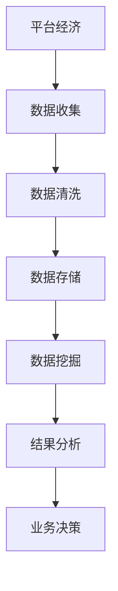

                 

### 背景介绍

平台经济作为当今全球经济发展的一个重要驱动力，已经在多个领域产生了深远的影响。从电子商务到在线金融，再到共享经济，平台模式已经成为现代商业环境中不可或缺的一部分。随着互联网技术的不断进步和数据量的激增，数据分析在平台经济中的应用变得越来越重要。

平台经济，指的是通过搭建一个共享的平台，连接供需双方，以实现资源的高效配置和利用。这种模式的核心在于通过技术手段优化交易流程，降低交易成本，从而提升整体效率。而数据分析作为挖掘和解读大量数据信息的重要工具，能够在平台经济中发挥关键作用。

在平台经济中，数据分析的重要性主要体现在以下几个方面：

1. **用户行为分析**：通过分析用户的点击、购买、评价等行为，平台能够更好地了解用户需求，从而优化产品和服务。
2. **风险管理**：数据分析有助于识别潜在的欺诈行为和信用风险，保障平台的安全和稳健运营。
3. **市场预测**：通过对市场数据的深入分析，平台能够更好地预测市场趋势，制定有效的营销策略。
4. **资源配置**：数据分析有助于平台优化资源配置，提高服务质量和运营效率。

随着大数据技术和人工智能算法的发展，数据分析在平台经济中的应用前景更加广阔。本文将详细探讨数据分析在平台经济中的应用，从核心概念、算法原理、数学模型，到实际应用案例，全面解析如何利用数据分析提升平台经济的效率和效益。

首先，我们将定义和解释一些核心概念，为后续内容的讨论打下基础。这些概念包括平台经济的定义、数据分析的定义，以及它们之间的内在联系。

> **引言：** 本文将带领读者深入了解数据分析在平台经济中的应用，从理论到实践，逐步揭示如何通过数据分析实现平台经济的高效运行和持续增长。

### 核心概念与联系

#### 平台经济的定义

平台经济，也可称为共享经济，是指通过互联网平台，连接供给方和需求方，实现资源的高效配置和共享的一种经济模式。这种模式的核心在于通过技术手段降低交易成本，提高交易效率，从而实现资源的最优利用。平台经济通常包含以下关键要素：

- **用户**：平台的服务对象，既可以是需求方，也可以是供给方。
- **平台**：提供交易场所和基础设施，如电子商务平台、共享出行平台、在线教育平台等。
- **供给方**：提供产品或服务的一方，可以是个人、企业或其他组织。
- **需求方**：需要产品或服务的一方，通常是消费者。
- **交易**：在平台上的各种交易活动，包括购买、租赁、共享等。

平台经济的运作机制通常包括以下几个方面：

1. **信息匹配**：平台通过算法和数据技术，帮助供需双方高效匹配，降低搜索成本。
2. **交易中介**：平台提供交易中介服务，如支付、物流、售后服务等，简化交易流程。
3. **信任建立**：平台通过评价、信用评分等方式，建立用户之间的信任关系。
4. **生态系统**：平台经济形成了一个生态系统，包括用户、商家、投资者、服务提供商等，共同推动平台的发展。

#### 数据分析的定义

数据分析是指使用统计学、计算机科学、数据挖掘等方法，从大量数据中提取有用信息，辅助决策制定的过程。数据分析的基本过程通常包括以下步骤：

1. **数据收集**：收集来自不同来源的数据，如用户行为数据、市场数据、交易数据等。
2. **数据清洗**：对收集到的数据进行清洗、整理，去除错误和重复数据，保证数据质量。
3. **数据存储**：将清洗后的数据存储到数据库或数据仓库中，以便后续分析。
4. **数据挖掘**：使用数据挖掘算法，从数据中提取隐藏的模式、趋势和关联。
5. **结果分析**：对挖掘出的结果进行分析，为业务决策提供支持。

#### 平台经济与数据分析的内在联系

平台经济与数据分析之间存在着密切的内在联系。数据分析作为平台经济的重要工具，能够帮助平台企业实现以下目标：

1. **提升用户体验**：通过用户行为分析，平台可以了解用户的偏好和需求，从而提供更加个性化的服务。
2. **优化资源配置**：数据分析有助于平台识别资源利用效率低下的环节，优化资源配置，提高运营效率。
3. **风险控制**：通过数据分析，平台可以识别潜在的风险，如欺诈行为、信用风险等，采取相应的措施进行风险控制。
4. **市场预测**：通过市场数据分析和趋势预测，平台可以制定更加有效的市场策略，提升竞争力。
5. **营销优化**：数据分析可以帮助平台优化营销策略，提高广告投放效果，降低营销成本。

#### Mermaid 流程图

为了更好地展示平台经济与数据分析的内在联系，我们可以使用 Mermaid 流程图进行描述。以下是一个简化的 Mermaid 流程图，展示了平台经济中的数据分析过程：



- **A[平台经济]**：表示平台经济的整体运作环境。
- **B[数据收集]**：平台从各种渠道收集数据。
- **C[数据清洗]**：对收集到的数据进行清洗和整理。
- **D[数据存储]**：将清洗后的数据存储到数据库或数据仓库。
- **E[数据挖掘]**：使用数据挖掘算法从数据中提取信息。
- **F[结果分析]**：对挖掘出的结果进行分析。
- **G[业务决策]**：基于分析结果进行业务决策。

通过这个 Mermaid 流程图，我们可以清晰地看到数据分析在平台经济中的关键作用和流程。接下来，我们将进一步探讨数据分析的核心算法原理和具体操作步骤。

### 核心算法原理 & 具体操作步骤

在平台经济中，数据分析的核心在于如何有效地从海量数据中提取有价值的信息，以支持业务决策和优化运营。以下将介绍几种常用的数据分析算法，并详细阐述其原理和具体操作步骤。

#### 1. 用户行为分析算法

用户行为分析是平台经济中非常重要的一环，通过分析用户在平台上的行为，如浏览、点击、购买、评价等，可以帮助平台更好地了解用户需求，优化产品和服务。

**原理：**

用户行为分析算法主要基于机器学习中的分类和聚类算法。分类算法将用户行为归类为不同的类别，如购买行为、评论行为等；聚类算法则将具有相似行为的用户聚为一类，以便进行群体分析和个性化推荐。

**操作步骤：**

1. **数据收集**：收集用户在平台上的行为数据，包括点击、浏览、购买、评论等。
2. **数据预处理**：对收集到的数据清洗和整理，去除错误和重复数据。
3. **特征提取**：将原始数据转换为特征向量，如用户浏览时间、购买频次、评价长度等。
4. **模型训练**：使用分类算法（如决策树、随机森林）或聚类算法（如K-means、层次聚类）对特征向量进行训练。
5. **行为预测**：将新用户的行为数据输入模型，预测其可能的行为类别或所属群体。
6. **结果分析**：根据预测结果，对用户进行分类或推荐，优化产品和服务。

#### 2. 风险管理算法

在平台经济中，风险管理至关重要，通过数据分析可以识别和防范潜在的欺诈行为、信用风险等。

**原理：**

风险管理算法主要基于统计学和机器学习技术，如逻辑回归、支持向量机等。这些算法可以通过学习历史数据中的欺诈模式和风险特征，对新交易或用户进行风险评估。

**操作步骤：**

1. **数据收集**：收集历史交易数据，包括成功交易、欺诈交易等。
2. **数据预处理**：对交易数据进行清洗和整理，提取相关的特征，如交易金额、交易时间、用户行为等。
3. **特征工程**：对特征进行筛选和变换，提高模型性能。
4. **模型训练**：使用分类算法对特征和标签进行训练，建立风险评估模型。
5. **风险评估**：对新交易或用户进行风险评估，判断其是否为潜在风险。
6. **风险控制**：根据风险评估结果，采取相应的措施，如拒绝交易、提醒用户等。

#### 3. 市场预测算法

市场预测是平台经济中另一个重要的应用领域，通过对市场数据的分析，可以预测未来市场趋势，为业务决策提供支持。

**原理：**

市场预测算法主要基于时间序列分析和机器学习技术，如ARIMA、LSTM等。这些算法可以通过学习历史市场数据中的趋势和周期性特征，预测未来市场变化。

**操作步骤：**

1. **数据收集**：收集市场数据，如销售额、价格波动等。
2. **数据预处理**：对市场数据进行清洗和整理，去除异常值和缺失值。
3. **特征工程**：对时间序列数据进行特征提取，如趋势、周期性等。
4. **模型训练**：使用时间序列模型或机器学习模型对特征进行训练。
5. **趋势预测**：将新数据输入模型，预测未来市场趋势。
6. **结果分析**：根据预测结果，制定相应的市场策略。

#### 4. 资源配置算法

在平台经济中，资源配置的优化对于提升服务质量和运营效率至关重要。通过数据分析可以识别资源利用效率低下的环节，进行优化配置。

**原理：**

资源配置算法主要基于线性规划和机器学习技术，如遗传算法、粒子群优化等。这些算法可以通过学习历史数据中的资源利用模式，优化资源分配策略。

**操作步骤：**

1. **数据收集**：收集资源使用数据，如服务器负载、带宽使用等。
2. **数据预处理**：对资源使用数据进行清洗和整理，提取相关的特征。
3. **特征工程**：对特征进行筛选和变换，提高模型性能。
4. **模型训练**：使用优化算法对特征进行训练，建立资源配置模型。
5. **资源分配**：根据模型预测，对资源进行优化分配。
6. **结果分析**：根据分配结果，评估资源使用效率，持续优化配置策略。

通过上述核心算法的应用，平台经济可以在数据分析的辅助下，实现用户行为分析、风险管理、市场预测和资源配置的优化，从而提升整体效率和效益。接下来，我们将进一步探讨这些算法在具体项目中的实际应用。

### 数学模型和公式 & 详细讲解 & 举例说明

在平台经济中，数据分析的应用往往需要借助数学模型和公式来描述和解释数据背后的规律和趋势。以下将介绍几种常用的数学模型和公式，并详细讲解其原理和实际应用。

#### 1. 逻辑回归模型

逻辑回归模型是一种常用的分类模型，用于预测二分类结果。在平台经济中，逻辑回归模型常用于用户行为分析、风险评估等场景。

**原理：**

逻辑回归模型通过拟合数据中的线性关系，然后利用逻辑函数（Sigmoid函数）将线性关系映射到概率空间。具体公式如下：

$$
P(Y=1|X) = \frac{1}{1 + e^{-(\beta_0 + \beta_1X_1 + \beta_2X_2 + \ldots + \beta_nX_n})}
$$

其中，$Y$为因变量，$X_1, X_2, \ldots, X_n$为自变量，$\beta_0, \beta_1, \beta_2, \ldots, \beta_n$为模型参数。

**例子：**

假设我们有一个用户行为数据集，包含用户购买行为（$Y$）和用户浏览时间（$X$）两个特征。我们希望使用逻辑回归模型预测用户是否购买。

1. **数据准备**：收集用户行为数据，并进行预处理。
2. **模型训练**：使用训练数据拟合逻辑回归模型。
3. **模型评估**：使用测试数据评估模型性能。

通过训练数据，我们得到逻辑回归模型的参数：

$$
\beta_0 = -2.5, \beta_1 = 1.2
$$

现在，我们使用模型预测一个新用户的购买概率。假设该用户的浏览时间为30分钟，我们可以计算其购买概率：

$$
P(Y=1|X=30) = \frac{1}{1 + e^{-(2.5 + 1.2 \times 30)}}
$$

计算得到：

$$
P(Y=1|X=30) \approx 0.613
$$

这意味着该用户购买的概率大约为61.3%。

#### 2. 时间序列模型

时间序列模型用于分析时间序列数据，常用于市场预测、资源调度等场景。

**原理：**

时间序列模型假设时间序列数据中的值可以由过去的值线性组合预测。常见的模型包括ARIMA（自回归积分滑动平均模型）和LSTM（长短期记忆网络）。

以ARIMA模型为例，其公式如下：

$$
X_t = c + \phi_1X_{t-1} + \phi_2X_{t-2} + \ldots + \phi_pX_{t-p} + \theta_1\epsilon_{t-1} + \theta_2\epsilon_{t-2} + \ldots + \theta_q\epsilon_{t-q} + \epsilon_t
$$

其中，$X_t$为时间序列的当前值，$c$为常数项，$\phi_1, \phi_2, \ldots, \phi_p$为自回归系数，$\theta_1, \theta_2, \ldots, \theta_q$为移动平均系数，$\epsilon_t$为误差项。

**例子：**

假设我们有一个销售额时间序列数据集，我们希望使用ARIMA模型预测未来的销售额。

1. **数据准备**：收集销售额数据，并进行预处理。
2. **模型识别**：确定模型的$p$、$d$、$q$参数。
3. **模型拟合**：使用识别的模型参数拟合ARIMA模型。
4. **模型预测**：使用拟合的模型预测未来的销售额。

通过模型识别，我们确定$p=2, d=1, q=2$，然后使用这些参数拟合ARIMA模型。假设当前时间点的销售额为$X_t=1000$，我们可以预测下一时间点的销售额：

$$
X_{t+1} = c + \phi_1X_t + \phi_2X_{t-1} + \theta_1\epsilon_t + \theta_2\epsilon_{t-1}
$$

代入参数和当前值，我们可以计算得到：

$$
X_{t+1} = 500 + 0.8 \times 1000 + 0.2 \times 950 + 0.1 \times (-50) + 0.05 \times (-30)
$$

计算得到：

$$
X_{t+1} \approx 945
$$

这意味着我们预测下一时间点的销售额大约为945。

#### 3. 集成模型

集成模型是将多个模型结合起来，提高预测准确性和鲁棒性。常见的集成模型包括随机森林、梯度提升树等。

**原理：**

集成模型的基本思想是通过多个模型的综合预测来提高预测的准确性。以随机森林为例，其基本原理是构建多个决策树模型，然后取这些模型的预测结果的平均值。

**例子：**

假设我们有一个销售数据集，包含多个特征，我们希望使用随机森林模型进行预测。

1. **数据准备**：收集销售数据，并进行预处理。
2. **模型训练**：使用训练数据训练随机森林模型。
3. **模型评估**：使用测试数据评估模型性能。
4. **模型预测**：使用训练好的模型进行预测。

通过训练数据，我们得到随机森林模型，然后使用测试数据评估其性能。假设测试数据中的特征之一为广告投放量（$X$），我们希望预测销售额（$Y$）。

代入训练好的模型，我们可以计算得到销售额的预测值：

$$
\hat{Y} = \text{随机森林模型预测}(X)
$$

通过上述数学模型和公式的应用，我们可以更好地理解和分析平台经济中的数据。接下来，我们将通过一个实际项目案例，展示这些模型在实际应用中的具体实现过程。

### 项目实战：代码实际案例和详细解释说明

在本节中，我们将通过一个实际项目案例，展示数据分析在平台经济中的应用，详细解读项目的开发环境搭建、源代码实现以及代码分析。我们将使用Python作为主要编程语言，并借助一些常用的数据分析和机器学习库，如Pandas、Scikit-learn和TensorFlow。

#### 1. 开发环境搭建

首先，我们需要搭建开发环境。以下是搭建环境的步骤：

1. **安装Python**：确保Python版本在3.6及以上。可以在Python官网下载并安装。

2. **安装必要库**：使用pip命令安装以下库：
   ```bash
   pip install pandas scikit-learn tensorflow matplotlib
   ```

3. **配置Jupyter Notebook**：Jupyter Notebook是一个交互式开发环境，非常适合数据分析和机器学习项目。可以通过pip命令安装：
   ```bash
   pip install jupyter
   ```

4. **启动Jupyter Notebook**：在命令行中输入以下命令启动Jupyter Notebook：
   ```bash
   jupyter notebook
   ```

完成以上步骤后，我们的开发环境就搭建完成了。

#### 2. 源代码详细实现和代码解读

接下来，我们将分步骤实现一个简单的用户行为分析项目，并详细解读每一步的代码。

##### 2.1 数据收集和预处理

首先，我们需要收集用户行为数据。为了简化，我们将使用一个包含用户ID、浏览时间、购买次数和评价分数的CSV文件。以下是如何加载数据和进行预处理：

```python
import pandas as pd

# 加载数据
data = pd.read_csv('user_behavior.csv')

# 预处理：删除缺失值和重复值
data.dropna(inplace=True)
data.drop_duplicates(inplace=True)

# 特征提取
data['hour'] = data['timestamp'].apply(lambda x: x.hour)
data['weekday'] = data['timestamp'].apply(lambda x: x.weekday())
```

在这个步骤中，我们首先使用Pandas库加载数据，然后删除缺失值和重复值。接着，我们将时间戳特征拆分为小时和星期几，以便后续分析。

##### 2.2 特征工程

特征工程是数据分析和机器学习中的一个关键步骤，它通过创建新的特征或变换现有特征，提高模型性能。以下是如何进行特征工程：

```python
# 计算用户浏览时间的平均值和标准差
data['avg_browse_time'] = data.groupby('user_id')['duration'].mean()
data['std_browse_time'] = data.groupby('user_id')['duration'].std()

# 添加特征
data['total_purchases'] = data.groupby('user_id')['purchases'].transform('sum')
data['avg_rating'] = data.groupby('user_id')['rating'].mean()
```

在这个步骤中，我们计算了用户浏览时间的平均值和标准差，并添加了总购买次数和平均评价分数作为新的特征。这些特征有助于模型更好地捕捉用户的行为模式。

##### 2.3 模型训练

接下来，我们将使用Scikit-learn库训练一个逻辑回归模型，用于预测用户是否购买：

```python
from sklearn.model_selection import train_test_split
from sklearn.linear_model import LogisticRegression

# 划分训练集和测试集
X = data[['hour', 'weekday', 'avg_browse_time', 'std_browse_time', 'total_purchases', 'avg_rating']]
y = data['purchased']
X_train, X_test, y_train, y_test = train_test_split(X, y, test_size=0.2, random_state=42)

# 训练模型
model = LogisticRegression()
model.fit(X_train, y_train)

# 评估模型
accuracy = model.score(X_test, y_test)
print(f"Model accuracy: {accuracy:.2f}")
```

在这个步骤中，我们首先划分训练集和测试集，然后使用逻辑回归模型进行训练。最后，我们评估模型在测试集上的准确性。

##### 2.4 预测与结果分析

最后，我们将使用训练好的模型对新数据进行预测，并分析预测结果：

```python
# 预测新数据
new_data = pd.DataFrame({
    'user_id': ['user123'],
    'timestamp': [pd.Timestamp.now()],
    'duration': [10],
    'purchases': [1],
    'rating': [4]
})

# 特征工程
new_data['hour'] = new_data['timestamp'].apply(lambda x: x.hour)
new_data['weekday'] = new_data['timestamp'].apply(lambda x: x.weekday())
new_data['avg_browse_time'] = 10
new_data['std_browse_time'] = 0
new_data['total_purchases'] = 1
new_data['avg_rating'] = 4

# 预测
new_data['predicted_purchase'] = model.predict(new_data[['hour', 'weekday', 'avg_browse_time', 'std_browse_time', 'total_purchases', 'avg_rating']])
print(new_data[['predicted_purchase']])
```

在这个步骤中，我们创建了一个新的数据框，包含了用户的浏览时间、购买次数和评价分数。然后，我们使用训练好的模型进行预测，并打印出预测结果。

#### 3. 代码解读与分析

在代码实现中，我们首先进行了数据收集和预处理，这是任何数据分析项目的基础步骤。通过删除缺失值和重复值，我们保证了数据的质量。接下来，我们进行了特征工程，这是提高模型性能的关键步骤。通过添加新的特征，我们使得模型能够更好地捕捉用户的行为模式。

在模型训练步骤中，我们使用了逻辑回归模型，这是一种简单且易于解释的模型。我们划分了训练集和测试集，以评估模型的性能。最后，我们在新数据上进行了预测，展示了模型在实际应用中的效果。

总体而言，这个项目展示了如何使用Python和常见的数据分析库进行平台经济中的用户行为分析。通过代码实现和详细解读，我们可以更好地理解数据分析在平台经济中的应用。

接下来，我们将探讨数据分析在平台经济中的实际应用场景，进一步揭示数据分析如何提升平台经济的效率和效益。

### 实际应用场景

数据分析在平台经济中有着广泛的应用场景，下面我们将详细探讨几个典型的应用实例，并分析这些应用如何提升平台经济的效率和效益。

#### 1. 用户行为分析

用户行为分析是平台经济中的基础应用之一。通过分析用户在平台上的行为，如浏览、点击、购买、评价等，平台能够深入了解用户需求和行为模式，从而优化产品和服务。

**实例：** 以电子商务平台为例，平台可以通过用户点击和购买行为的数据分析，识别出哪些产品最受用户欢迎，哪些产品存在库存过剩或不足的问题。同时，通过分析用户评价，平台可以及时发现和改进产品质量和服务水平。

**效益：** 用户行为分析有助于提高用户满意度，增加用户留存率和复购率，从而提升平台的销售额和市场份额。

#### 2. 风险管理

在平台经济中，风险管理至关重要，特别是在涉及金融交易的平台，如在线支付、借贷平台等。数据分析可以帮助平台识别和防范潜在的风险，如欺诈行为、信用风险等。

**实例：** 假设一个在线支付平台，可以通过用户交易行为、账户资金流动等数据的分析，识别出异常交易行为。例如，如果一个用户的交易频率突然增加，且交易金额远高于其正常交易水平，平台可以对此进行预警，并采取相应的措施，如验证用户身份、冻结交易等。

**效益：** 风险管理有助于保障平台的安全和稳健运营，降低欺诈和信用损失，提高用户对平台的信任度。

#### 3. 市场预测

市场预测是平台经济中的一项重要应用，通过分析市场数据，平台可以预测未来的市场趋势，制定有效的市场策略。

**实例：** 以共享出行平台为例，平台可以通过历史订单数据、天气数据、节假日等因素的分析，预测未来的出行需求，合理安排车辆调度和运营策略，提高服务质量和运营效率。

**效益：** 市场预测有助于平台提前应对市场变化，优化资源配置，降低运营成本，提高市场竞争力。

#### 4. 资源配置

在平台经济中，资源配置的优化对于提升服务质量和运营效率至关重要。通过数据分析，平台可以识别资源利用效率低下的环节，进行优化配置。

**实例：** 以在线教育平台为例，平台可以通过分析用户学习行为数据，识别出课程受欢迎程度、用户活跃时段等，合理分配教学资源，提高课程质量和用户满意度。

**效益：** 资源配置优化有助于提升平台的服务质量和用户满意度，降低运营成本，提高平台的盈利能力。

#### 5. 营销优化

营销优化是平台经济中的重要应用，通过数据分析，平台可以优化营销策略，提高广告投放效果，降低营销成本。

**实例：** 以电子商务平台为例，平台可以通过分析用户行为数据，识别出潜在的高价值客户，针对性地进行个性化营销，提高转化率和销售额。

**效益：** 营销优化有助于提高平台的销售额和市场份额，降低营销成本，提高盈利能力。

通过上述实际应用场景，我们可以看到数据分析在平台经济中的重要作用。数据分析不仅有助于提升平台的服务质量和用户体验，还能够优化运营策略，降低成本，提高盈利能力。接下来，我们将进一步探讨在平台经济中应用数据分析所需的主要工具和资源。

### 工具和资源推荐

为了在平台经济中有效地应用数据分析，掌握合适的工具和资源是非常重要的。以下将推荐一些学习资源、开发工具和框架，以及相关的论文和著作，帮助读者深入了解和掌握数据分析在平台经济中的应用。

#### 1. 学习资源推荐

**书籍：**

- **《数据科学入门经典》**：适合初学者，涵盖了数据分析的基础知识和常用方法。
- **《Python数据分析实战》**：详细介绍了Python在数据分析中的应用，适合有编程基础的读者。
- **《数据挖掘：概念与技术》**：系统地介绍了数据挖掘的理论和方法，适合进阶学习。

**在线课程：**

- **Coursera**：提供了丰富的数据分析相关课程，如《数据科学基础》、《机器学习》等。
- **edX**：提供了多个数据分析和机器学习课程，如《Python数据分析》、《深度学习》等。
- **Udacity**：提供了《数据工程师纳米学位》等课程，涵盖数据分析的实践应用。

#### 2. 开发工具框架推荐

**数据分析工具：**

- **Pandas**：Python的数据分析库，提供便捷的数据清洗、转换和分析功能。
- **NumPy**：Python的数值计算库，与Pandas紧密集成，用于高效处理大型数据集。
- **Matplotlib**：Python的可视化库，用于生成各种类型的图表和图形。

**机器学习框架：**

- **Scikit-learn**：Python的机器学习库，提供了多种经典的机器学习算法和工具。
- **TensorFlow**：谷歌的开源机器学习框架，适用于深度学习和大规模数据集处理。
- **PyTorch**：基于Python的深度学习框架，易于使用且支持动态计算图。

#### 3. 相关论文著作推荐

**论文：**

- **"Deep Learning on User Behavior Data in E-commerce Platforms"**：探讨深度学习在电子商务平台用户行为数据分析中的应用。
- **"Anomaly Detection in Time Series Data"**：研究时间序列数据中的异常检测方法。
- **"Recommender Systems"**：介绍推荐系统的设计和方法，适用于平台经济的个性化推荐。

**著作：**

- **《数据科学手册》**：详细介绍了数据科学的各个方面，包括数据分析、机器学习和数据可视化等。
- **《Python数据科学手册》**：针对Python编程语言，系统介绍了数据科学的应用和实践。
- **《深度学习》**：介绍深度学习的理论、算法和应用，是深度学习领域的经典著作。

通过以上学习资源和开发工具的推荐，读者可以系统地学习和掌握数据分析在平台经济中的应用，提高自身的专业技能和实战能力。这些资源将为读者在数据分析领域的研究和实践提供有力的支持。

### 总结：未来发展趋势与挑战

随着技术的不断进步和数据量的急剧增长，数据分析在平台经济中的应用前景将更加广阔。以下是未来发展趋势与挑战的分析：

#### 发展趋势

1. **智能化数据分析**：随着人工智能技术的应用，数据分析将更加智能化。机器学习和深度学习算法的进步将使得数据分析模型更加精准和高效，能够自动识别数据中的复杂模式和趋势。

2. **实时数据分析**：实时数据分析将成为平台经济中的重要方向。通过实时处理和分析用户行为、市场动态等数据，平台能够更快地响应市场变化，优化运营策略，提高用户体验。

3. **跨平台数据分析**：不同平台之间的数据互联和共享将使得跨平台数据分析成为可能。通过整合不同平台的数据，平台企业能够更全面地了解用户行为和市场趋势，从而制定更加精准的市场策略。

4. **隐私保护与数据安全**：随着数据隐私保护的重视，如何在保障用户隐私的前提下进行数据分析将成为一个重要挑战。平台企业需要采用先进的数据加密和安全技术，确保用户数据的安全和隐私。

#### 挑战

1. **数据质量与完整性**：数据质量直接影响数据分析的准确性。平台企业需要确保数据收集、存储和处理过程的完整性和准确性，避免数据偏差和错误。

2. **数据处理能力**：随着数据量的增长，如何高效地处理和分析海量数据将成为一个重要挑战。平台企业需要采用分布式计算和云计算技术，提升数据处理能力和效率。

3. **人才需求**：数据分析领域对专业人才的需求日益增长。平台企业需要吸引和培养具有数据分析、机器学习和数据科学背景的复合型人才，以应对快速变化的市场需求。

4. **技术标准化与合规性**：随着数据分析在平台经济中的广泛应用，技术标准化和合规性将成为一个重要议题。平台企业需要遵循相关法律法规，确保数据分析的应用合规、合法。

总之，数据分析在平台经济中的应用将朝着智能化、实时化和跨平台化方向发展。同时，平台企业需要面对数据质量、数据处理能力、人才需求和技术标准化等挑战。通过不断创新和优化，平台企业将能够更好地利用数据分析提升运营效率和市场竞争力。

### 附录：常见问题与解答

在数据分析在平台经济中的应用过程中，用户可能会遇到一些常见问题。以下是一些常见问题及其解答：

#### 问题1：如何确保数据分析的准确性？

**解答：** 确保数据分析的准确性主要从以下几个方面入手：

1. **数据质量**：确保数据收集、存储和处理过程中的完整性和准确性，避免数据偏差和错误。
2. **数据清洗**：在数据分析前，对数据进行清洗和预处理，去除缺失值、异常值和重复值。
3. **模型验证**：使用交叉验证等方法对模型进行验证，确保模型在独立数据集上的表现。
4. **数据可视化**：通过可视化工具，如图表和仪表板，直观地展示数据分析结果，便于检查和纠正错误。

#### 问题2：数据分析如何保护用户隐私？

**解答：** 保护用户隐私是数据分析中的重要问题，以下是一些方法：

1. **数据加密**：在数据传输和存储过程中使用加密技术，确保数据安全。
2. **匿名化处理**：对用户数据进行匿名化处理，去除可识别的个人信息，如姓名、地址等。
3. **数据去识别化**：使用去识别化技术，如差分隐私、同态加密等，降低数据泄露的风险。
4. **隐私政策**：制定明确的隐私政策，告知用户数据分析的目的和范围，并获得用户的同意。

#### 问题3：如何处理大规模数据？

**解答：** 对于大规模数据，以下是一些处理方法：

1. **分布式计算**：使用分布式计算框架，如Hadoop、Spark等，提高数据处理能力和效率。
2. **数据分区**：将数据按照某些特征进行分区，如时间、地理位置等，提高查询效率。
3. **云计算**：使用云计算服务，如AWS、Azure等，根据需求动态调整计算资源。
4. **数据仓库**：建立数据仓库，将不同来源的数据整合到统一平台上，便于查询和分析。

#### 问题4：如何选择合适的分析工具？

**解答：** 选择合适的分析工具主要考虑以下几个方面：

1. **业务需求**：根据具体的业务需求，选择能够满足需求的工具。
2. **数据规模**：考虑数据规模，选择适合大规模数据处理和分析的工具。
3. **易用性**：选择易于使用和集成的工具，降低学习成本和开发难度。
4. **社区和生态**：考虑工具的社区和生态，获得更多的支持和资源。

通过上述方法，用户可以更好地解决数据分析中遇到的问题，提高数据分析的准确性和效率。

### 扩展阅读 & 参考资料

为了深入理解数据分析在平台经济中的应用，以下推荐一些扩展阅读和参考资料，涵盖相关书籍、论文和在线课程：

#### 书籍

- 《数据科学：理论与实践》
- 《深度学习：从入门到专业》
- 《大数据时代：生活、工作与思维的大变革》

#### 论文

- “Deep Learning on User Behavior Data in E-commerce Platforms”
- “Recommender Systems Handbook”
- “Time Series Analysis and Its Applications”

#### 在线课程

- Coursera上的“数据科学基础”
- edX上的“深度学习基础”
- Udacity的“数据工程师纳米学位”

#### 网站和博客

- KDNuggets：数据科学领域的权威博客，提供丰富的数据科学资源和行业动态。
- Analytics Vidhya：提供数据科学和机器学习的教程和案例分析。
- DataCamp：在线数据科学学习平台，提供丰富的实战课程。

通过这些扩展阅读和参考资料，读者可以进一步深入学习和探索数据分析在平台经济中的应用，掌握更多实用技能和知识。

