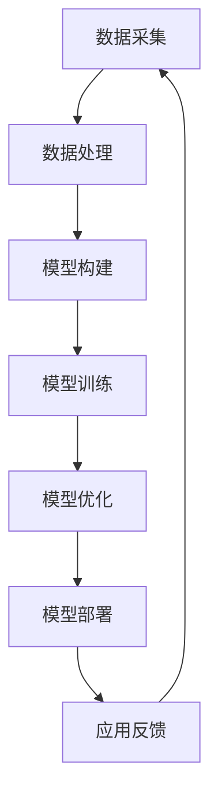

                 

# 数据即模型：软件2.0颠覆传统软件方法论

## 关键词：数据驱动，模型即数据，软件2.0，编程范式，AI，机器学习，深度学习

## 摘要：
本文旨在探讨“数据即模型”这一新兴理念如何颠覆传统软件方法论，并引领软件2.0时代的到来。通过对数据驱动编程、模型即数据的哲学思考，以及机器学习和深度学习的算法原理的深入剖析，本文揭示了软件开发的未来趋势和挑战。

## 1. 背景介绍

随着信息技术的迅猛发展，数据已经成为了新时代的“石油”。大数据、云计算、物联网等技术的广泛应用，使得数据采集、存储和处理的能力得到了极大提升。与此同时，人工智能和机器学习技术的进步，使得数据从“信息”到“知识”的转化成为可能。

传统软件方法论主要依赖于明确的业务规则和预设的算法，而软件2.0时代则更加注重数据驱动的编程方式，以及模型即数据的哲学思考。这意味着，软件的开发过程将更加灵活、自适应，能够更好地应对复杂多变的应用场景。

## 2. 核心概念与联系

### 2.1 数据驱动编程

数据驱动编程（Data-Driven Programming）是一种编程范式，其核心思想是将数据作为程序的驱动因素。在这种范式中，程序的行为和结果取决于输入数据的状态和特征。相比于传统的命令式编程，数据驱动编程具有更强的灵活性和可扩展性。

### 2.2 模型即数据

模型即数据（Model-as-Data）是一种哲学思考，其核心思想是将模型视为数据的一种形式。在这种思想下，模型的构建、训练和优化过程被视为一种数据处理过程。这不仅使得机器学习算法能够更好地适应复杂问题，也推动了软件方法论的创新。

### 2.3 Mermaid 流程图

以下是数据驱动编程和模型即数据哲学思考的Mermaid流程图：



## 3. 核心算法原理 & 具体操作步骤

### 3.1 数据采集

数据采集是数据驱动编程的第一步，其核心任务是收集与问题相关的数据。数据来源可以包括传感器数据、社交媒体数据、网络日志等。为了提高数据质量，通常需要对数据进行清洗、去噪和归一化处理。

### 3.2 数据处理

数据处理包括数据预处理、特征提取和特征选择等步骤。数据预处理旨在去除噪声和异常值，提高数据质量。特征提取和特征选择则旨在提取最有用的特征，减少数据维度，提高模型性能。

### 3.3 模型构建

模型构建是指选择合适的算法和架构来构建模型。常见的机器学习算法包括线性回归、决策树、支持向量机等。深度学习算法则包括卷积神经网络（CNN）、循环神经网络（RNN）等。

### 3.4 模型训练

模型训练是指使用训练数据来调整模型参数，使其能够更好地预测或分类。训练过程通常包括损失函数、优化算法和迭代次数等参数的调整。

### 3.5 模型优化

模型优化是指在模型训练完成后，通过调整模型结构、超参数等方式来提高模型性能。常见的优化方法包括交叉验证、网格搜索和贝叶斯优化等。

### 3.6 模型部署

模型部署是指将训练好的模型应用到实际场景中。部署过程通常包括模型导出、部署平台选择和性能优化等步骤。

## 4. 数学模型和公式 & 详细讲解 & 举例说明

### 4.1 线性回归模型

线性回归模型是最简单的机器学习模型之一，其数学公式如下：

$$y = \beta_0 + \beta_1 \cdot x$$

其中，$y$ 是因变量，$x$ 是自变量，$\beta_0$ 和 $\beta_1$ 是模型参数。

### 4.2 决策树模型

决策树模型通过一系列的判断条件来对数据进行分类或回归。其基本结构如下：

```
[根节点]
|
- [判断条件1]
|         |
[左子树] [右子树]
```

### 4.3 卷积神经网络（CNN）

卷积神经网络是一种用于图像识别的深度学习模型，其基本结构如下：

```
[输入层] --> [卷积层] --> [池化层] --> [卷积层] --> [池化层] --> [全连接层] --> [输出层]
```

## 5. 项目实战：代码实际案例和详细解释说明

### 5.1 开发环境搭建

在本文中，我们将使用Python编程语言和TensorFlow框架来实现一个简单的线性回归模型。首先，需要安装Python和TensorFlow：

```bash
pip install python tensorflow
```

### 5.2 源代码详细实现和代码解读

以下是一个简单的线性回归模型实现：

```python
import tensorflow as tf

# 定义模型参数
beta0 = tf.Variable(0.0)
beta1 = tf.Variable(1.0)

# 定义输入和输出
x = tf.placeholder(tf.float32)
y = tf.placeholder(tf.float32)

# 定义损失函数
loss = tf.reduce_mean(tf.square(y - (beta0 + beta1 * x)))

# 定义优化器
optimizer = tf.train.GradientDescentOptimizer(learning_rate=0.01)
train_op = optimizer.minimize(loss)

# 初始化变量
init = tf.global_variables_initializer()

# 训练模型
with tf.Session() as sess:
  sess.run(init)
  for i in range(1000):
    sess.run(train_op, feed_dict={x: [1, 2, 3, 4], y: [2, 4, 6, 8]})
    if i % 100 == 0:
      print("Step:", i, "Loss:", sess.run(loss, feed_dict={x: [1, 2, 3, 4], y: [2, 4, 6, 8]}))
  
  # 输出模型参数
  print("Final model parameters:", sess.run([beta0, beta1]))
```

### 5.3 代码解读与分析

- 第1-3行：导入所需的TensorFlow模块。
- 第4-5行：定义模型参数。
- 第6-7行：定义输入和输出。
- 第8行：定义损失函数，即均方误差。
- 第9-10行：定义优化器，使用梯度下降算法。
- 第11-12行：初始化变量。
- 第14-23行：训练模型，每次迭代更新模型参数，并打印损失值。

## 6. 实际应用场景

数据驱动编程和模型即数据的理念在各个领域都有广泛的应用，例如：

- **金融领域**：利用数据驱动编程和模型即数据的方法，可以实现对金融市场的预测和分析，为投资决策提供支持。
- **医疗领域**：通过数据驱动编程和模型即数据的方法，可以开发智能诊断系统，提高疾病识别的准确率。
- **自动驾驶**：自动驾驶系统依赖于大量的数据采集和处理，数据驱动编程和模型即数据的方法可以使其更好地应对复杂路况。

## 7. 工具和资源推荐

### 7.1 学习资源推荐

- **书籍**：《机器学习》（周志华）、《深度学习》（Ian Goodfellow）、《Python机器学习》（Sebastian Raschka）
- **论文**：《大数据时代的数据挖掘：概念与技术》（陈宝权）、《深度学习》（Geoffrey H. L. Matthew）
- **博客**：机器学习社区、Kaggle、TensorFlow官方博客
- **网站**：arXiv.org、Google Research、Microsoft Research

### 7.2 开发工具框架推荐

- **编程语言**：Python、R、Julia
- **机器学习框架**：TensorFlow、PyTorch、Scikit-learn
- **深度学习框架**：TensorFlow、PyTorch、Theano
- **数据可视化工具**：Matplotlib、Seaborn、Plotly

### 7.3 相关论文著作推荐

- 《大规模机器学习》（Christopher Re）、
- 《深度学习的未来》（Ian Goodfellow）、
- 《数据驱动：机器学习的革命》（Zachary Lipton）

## 8. 总结：未来发展趋势与挑战

软件2.0时代，数据驱动编程和模型即数据的理念将引领软件开发的新潮流。然而，这也带来了新的挑战，如数据隐私、模型解释性、计算资源等。未来，我们需要在技术创新、政策法规、伦理道德等方面进行深入探讨，以确保数据驱动编程和模型即数据的理念能够造福人类。

## 9. 附录：常见问题与解答

### 9.1 数据驱动编程与传统编程的区别？

数据驱动编程与传统编程的主要区别在于，数据驱动编程更加强调数据在程序中的核心地位，程序的行为和结果取决于输入数据的状态和特征。而传统编程则主要依赖于预设的算法和业务规则。

### 9.2 模型即数据如何实现？

模型即数据通常通过将模型的结构、参数和训练过程视为数据的形式来实现。在实际应用中，可以使用各种机器学习和深度学习框架，如TensorFlow、PyTorch等，来构建、训练和部署模型。

## 10. 扩展阅读 & 参考资料

- [深度学习教程](https://www.deeplearning.net/tutorial/)
- [Python机器学习教程](https://python-machine-learning-book.blogspot.com/)
- [机器学习算法详解](https://www MACHINELEARNINGMastery.com/机器学习算法详解/)
- [Kaggle竞赛平台](https://www.kaggle.com/)
- [arXiv.org](https://arxiv.org/)

