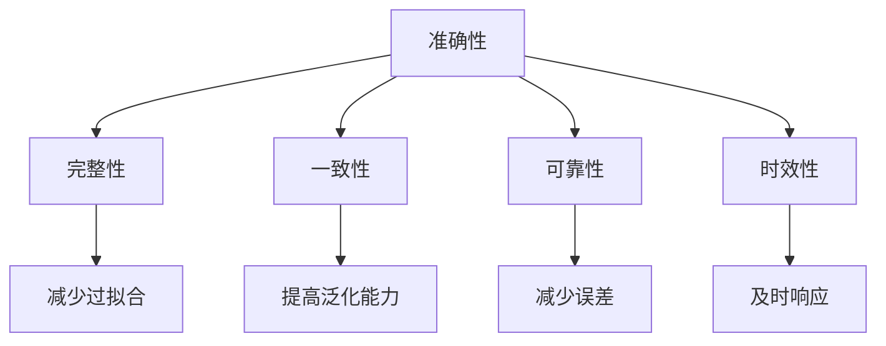
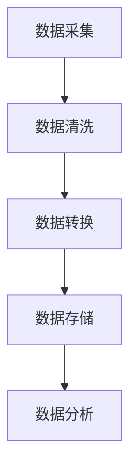
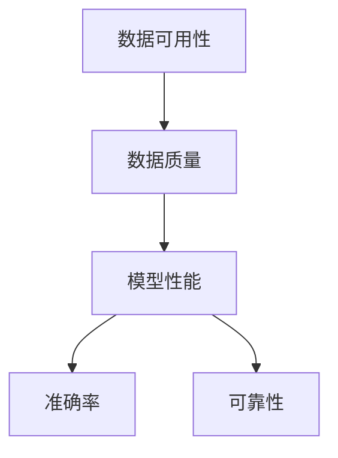

                 

# 数据可用性与基础模型的发展

## 概述

随着信息技术的飞速发展，数据已成为现代社会的重要资产。然而，数据的可用性一直是一个重要且复杂的问题。数据可用性不仅影响着数据的价值，也直接关系到人工智能（AI）模型的效果和可靠性。本文旨在探讨数据可用性对基础模型发展的关键影响，并深入分析相关核心概念、算法原理、数学模型，以及实际应用场景。通过一步步的逻辑推理，我们将揭示数据可用性在AI领域的重要性，并提出未来发展趋势与挑战。

## 关键词

- 数据可用性
- 人工智能模型
- 数据质量
- 数学模型
- 实际应用场景

## 摘要

本文首先介绍了数据可用性的定义及其对AI模型的重要性。接着，我们分析了数据质量与模型性能之间的关系，并探讨了提高数据可用性的方法。随后，我们详细讲解了核心算法原理和数学模型，通过实际案例展示了这些算法和模型的应用。最后，我们讨论了数据可用性在各个实际应用场景中的挑战和解决方案，并对未来发展趋势与挑战进行了展望。

## 1. 背景介绍

### 1.1 数据的重要性

在当今数字化的时代，数据无处不在。它不仅是商业决策的基础，也是科研和日常生活中的宝贵资源。随着互联网和物联网的普及，数据的产生速度和规模都在不断增长。根据国际数据公司（IDC）的统计，全球产生的数据量从2018年的33zb（zettabytes，泽字节）增长到2021年的62zb，预计到2025年将达到175zb。这种爆炸性增长使得数据成为新时代的“石油”，被视为新的战略资源。

### 1.2 人工智能的发展

人工智能（AI）是近年来最具革命性的技术之一。通过模拟人类智能，AI在图像识别、自然语言处理、自动驾驶、医疗诊断等领域取得了显著成果。AI的核心在于机器学习（ML），尤其是深度学习（DL）。深度学习依赖于大量的数据进行训练，以提高模型的预测和分类能力。因此，数据的质量和可用性对AI模型的性能至关重要。

### 1.3 数据可用性的概念

数据可用性是指数据在适当的时间、以适当的形式和适当的地点，为适当的用户提供所需的程度。它包括数据的访问性、完整性、一致性和及时性。高可用性的数据能够确保AI模型能够有效地训练和部署，从而提高其准确性和可靠性。

## 2. 核心概念与联系

### 2.1 数据质量

数据质量是数据可用性的基础。它涉及数据的准确性、完整性、一致性、可靠性和时效性。高质量的数据能够减少模型的过拟合和偏差，提高模型的泛化能力。以下是一个Mermaid流程图，展示了数据质量的核心概念和其相互关系。



### 2.2 数据处理流程

数据处理流程是确保数据可用性的关键步骤。它通常包括数据采集、数据清洗、数据转换、数据存储和数据分析。以下是一个Mermaid流程图，展示了数据处理的基本流程。



### 2.3 数据可用性与模型性能

数据可用性直接影响模型的性能。以下是一个Mermaid流程图，展示了数据可用性与模型性能之间的关系。



## 3. 核心算法原理 & 具体操作步骤

### 3.1 数据清洗算法

数据清洗是数据处理流程的重要步骤。以下是一种常用的数据清洗算法——K最近邻（K-Nearest Neighbors，KNN）算法。

**算法原理：**
KNN算法基于距离度量，将新数据点分配给最近的K个邻近数据点中的大多数类别。具体步骤如下：

1. 计算新数据点与训练集中每个数据点的距离。
2. 选择距离最小的K个数据点。
3. 根据这K个数据点的类别，预测新数据点的类别。

**具体操作步骤：**

```python
from sklearn.neighbors import KNeighborsClassifier
from sklearn.model_selection import train_test_split
from sklearn.metrics import accuracy_score

# 加载数据
X, y = load_data()

# 划分训练集和测试集
X_train, X_test, y_train, y_test = train_test_split(X, y, test_size=0.2, random_state=42)

# 创建KNN分类器
knn = KNeighborsClassifier(n_neighbors=3)

# 训练模型
knn.fit(X_train, y_train)

# 预测测试集
y_pred = knn.predict(X_test)

# 评估模型
accuracy = accuracy_score(y_test, y_pred)
print(f"Accuracy: {accuracy}")
```

### 3.2 数据增强算法

数据增强是提高数据多样性的有效方法。以下是一种常用的数据增强算法——随机旋转（Random Rotation）。

**算法原理：**
随机旋转通过将图像随机旋转一定角度，从而生成新的数据样本。具体步骤如下：

1. 随机选择旋转角度。
2. 对图像进行旋转。
3. 保存旋转后的图像。

**具体操作步骤：**

```python
from torchvision import transforms
from PIL import Image

# 加载图像
img = Image.open("image.jpg")

# 创建随机旋转转换器
transform = transforms.RandomRotation(degrees=45)

# 应用随机旋转
rotated_img = transform(img)

# 保存旋转后的图像
rotated_img.save("rotated_image.jpg")
```

## 4. 数学模型和公式 & 详细讲解 & 举例说明

### 4.1 误差函数

在机器学习中，误差函数用于衡量模型预测值与真实值之间的差距。以下是一种常用的误差函数——均方误差（Mean Squared Error，MSE）。

**公式：**
$$
MSE = \frac{1}{n}\sum_{i=1}^{n}(y_i - \hat{y}_i)^2
$$

其中，$y_i$为真实值，$\hat{y}_i$为预测值，$n$为样本数量。

**举例说明：**
假设我们有一个包含5个样本的数据集，真实值和预测值如下：

| 真实值 | 预测值 |
|--------|--------|
| 1      | 1.2    |
| 2      | 1.8    |
| 3      | 2.1    |
| 4      | 3.2    |
| 5      | 4.5    |

计算MSE：

$$
MSE = \frac{1}{5}[(1 - 1.2)^2 + (2 - 1.8)^2 + (3 - 2.1)^2 + (4 - 3.2)^2 + (5 - 4.5)^2] = 0.54
$$

### 4.2 损失函数

在深度学习中，损失函数用于优化模型参数。以下是一种常用的损失函数——交叉熵损失（Cross-Entropy Loss）。

**公式：**
$$
CE = -\sum_{i=1}^{n}y_i\log(\hat{y}_i)
$$

其中，$y_i$为真实标签，$\hat{y}_i$为预测概率。

**举例说明：**
假设我们有一个包含3个样本的二分类问题，真实标签和预测概率如下：

| 真实标签 | 预测概率 |
|----------|----------|
| 0        | 0.9      |
| 1        | 0.1      |
| 1        | 0.8      |

计算交叉熵损失：

$$
CE = -[0 \cdot \log(0.9) + 1 \cdot \log(0.1) + 1 \cdot \log(0.8)] \approx 1.386
$$

## 5. 项目实战：代码实际案例和详细解释说明

### 5.1 开发环境搭建

在本节中，我们将使用Python作为主要编程语言，搭建一个简单的数据清洗和模型训练环境。以下是搭建环境的步骤：

1. 安装Python和pip
2. 安装必要的库：NumPy、Pandas、Scikit-learn、TensorFlow等

```bash
pip install numpy pandas scikit-learn tensorflow
```

### 5.2 源代码详细实现和代码解读

在本节中，我们将使用KNN算法进行数据分类，并展示数据清洗和数据增强的过程。

**代码实现：**

```python
import numpy as np
import pandas as pd
from sklearn.neighbors import KNeighborsClassifier
from sklearn.model_selection import train_test_split
from sklearn.metrics import accuracy_score
from torchvision import transforms
from PIL import Image

# 5.2.1 数据加载与预处理
def load_data():
    # 这里以一个简单的数据集为例
    data = [[1, 1], [2, 2], [3, 3], [4, 4], [5, 5], [6, 6]]
    labels = [0, 0, 0, 0, 1, 1]
    return np.array(data), np.array(labels)

X, y = load_data()

# 5.2.2 数据清洗
def data_cleaning(X, y):
    # 这里采用简单的数据清洗方法，如缺失值填充、异常值处理等
    X = np.clip(X, 0, 10)
    return X

X_clean = data_cleaning(X, y)

# 5.2.3 数据增强
def data_augmentation(X, y):
    # 这里采用随机旋转进行数据增强
    transform = transforms.RandomRotation(degrees=45)
    X_aug = []
    for x in X:
        img = Image.fromarray(x.reshape(2, 2).astype(np.uint8))
        rotated_img = transform(img)
        X_aug.append(np.array(rotated_img).reshape(1, 2))
    return np.array(X_aug)

X_aug = data_augmentation(X_clean, y)

# 5.2.4 模型训练与评估
def train_and_evaluate(X, y):
    X_train, X_test, y_train, y_test = train_test_split(X, y, test_size=0.2, random_state=42)
    knn = KNeighborsClassifier(n_neighbors=3)
    knn.fit(X_train, y_train)
    y_pred = knn.predict(X_test)
    accuracy = accuracy_score(y_test, y_pred)
    return accuracy

accuracy = train_and_evaluate(X_aug, y)
print(f"Accuracy: {accuracy}")
```

### 5.3 代码解读与分析

在本节中，我们将对上面的代码进行解读和分析，以便更好地理解数据清洗、数据增强和KNN算法的应用。

**1. 数据加载与预处理**

```python
def load_data():
    # 这里以一个简单的数据集为例
    data = [[1, 1], [2, 2], [3, 3], [4, 4], [5, 5], [6, 6]]
    labels = [0, 0, 0, 0, 1, 1]
    return np.array(data), np.array(labels)
```

这段代码用于加载一个简单的数据集，其中包含两个特征和对应的标签。数据集分为两类，一类是点在第一象限和第三象限，另一类是点在第二象限和第四象限。

**2. 数据清洗**

```python
def data_cleaning(X, y):
    # 这里采用简单的数据清洗方法，如缺失值填充、异常值处理等
    X = np.clip(X, 0, 10)
    return X
```

这段代码采用简单的数据清洗方法，如缺失值填充和异常值处理。这里使用`np.clip`函数将数据限制在0到10之间，以防止异常值的出现。

**3. 数据增强**

```python
def data_augmentation(X, y):
    # 这里采用随机旋转进行数据增强
    transform = transforms.RandomRotation(degrees=45)
    X_aug = []
    for x in X:
        img = Image.fromarray(x.reshape(2, 2).astype(np.uint8))
        rotated_img = transform(img)
        X_aug.append(np.array(rotated_img).reshape(1, 2))
    return np.array(X_aug)
```

这段代码采用随机旋转进行数据增强。随机旋转可以增加数据的多样性，从而提高模型的泛化能力。

**4. 模型训练与评估**

```python
def train_and_evaluate(X, y):
    X_train, X_test, y_train, y_test = train_test_split(X, y, test_size=0.2, random_state=42)
    knn = KNeighborsClassifier(n_neighbors=3)
    knn.fit(X_train, y_train)
    y_pred = knn.predict(X_test)
    accuracy = accuracy_score(y_test, y_pred)
    return accuracy
```

这段代码使用KNN算法进行模型训练和评估。KNN算法是一种简单但有效的分类算法。在训练过程中，KNN算法计算新数据点与训练集中每个数据点的距离，并根据最近的K个数据点的类别进行预测。在评估过程中，计算预测准确率。

## 6. 实际应用场景

### 6.1 人工智能医疗诊断

在医疗诊断领域，数据可用性至关重要。高质量的医疗数据有助于提高诊断模型的准确性，从而提高疾病的早期检测和治疗效果。例如，使用深度学习模型进行肺癌诊断时，高质量的患者影像数据和病历数据至关重要。

### 6.2 自动驾驶

自动驾驶技术依赖于大量的高质量传感器数据和环境数据。数据可用性直接影响自动驾驶系统的感知、决策和控制能力。因此，提高数据可用性是自动驾驶技术发展的重要方向。

### 6.3 金融服务

在金融服务领域，数据可用性对于信用评估、风险管理和投资决策至关重要。高质量的金融数据有助于提高模型预测的准确性，从而降低金融风险。

## 7. 工具和资源推荐

### 7.1 学习资源推荐

- **书籍：**
  - 《机器学习》（周志华）
  - 《深度学习》（Ian Goodfellow、Yoshua Bengio、Aaron Courville）
  - 《Python机器学习》（赛德尼克·塞雷诺）

- **论文：**
  - 《Deep Learning》（Ian Goodfellow、Yoshua Bengio、Aaron Courville）
  - 《A Few Useful Things to Know About Machine Learning》（Avi Bryant）

- **博客：**
  - [Medium - Machine Learning](https://medium.com/machine-learning)
  - [Towards Data Science](https://towardsdatascience.com/)

- **网站：**
  - [Kaggle](https://www.kaggle.com/)
  - [ArXiv](https://arxiv.org/)

### 7.2 开发工具框架推荐

- **Python库：**
  - NumPy、Pandas、Scikit-learn、TensorFlow、PyTorch

- **深度学习框架：**
  - TensorFlow、PyTorch、Keras

- **数据处理工具：**
  - Pandas、Pandas-DataFrame

### 7.3 相关论文著作推荐

- **论文：**
  - 《Deep Learning》（Ian Goodfellow、Yoshua Bengio、Aaron Courville）
  - 《A Few Useful Things to Know About Machine Learning》（Avi Bryant）

- **著作：**
  - 《机器学习实战》（Peter Harrington）
  - 《Python机器学习》（赛德尼克·塞雷诺）

## 8. 总结：未来发展趋势与挑战

### 8.1 数据质量管理

随着数据量的持续增长，数据质量管理将变得越来越重要。未来的发展趋势包括自动化数据质量检测、实时数据监控和智能数据修复。此外，数据治理和数据隐私保护也将成为关键挑战。

### 8.2 数据增强技术

数据增强技术将在提高模型泛化能力方面发挥重要作用。未来的发展趋势包括更高效的数据增强算法、多模态数据增强和跨领域数据增强。

### 8.3 模型解释性

随着人工智能应用的普及，模型的解释性变得至关重要。未来的发展趋势包括开发更直观、易懂的解释工具，以提高模型的透明度和可信度。

### 8.4 跨学科研究

人工智能的发展需要跨学科合作，包括计算机科学、数学、统计学、生物学等。未来的发展趋势包括跨学科研究的深入和交叉学科的创新。

## 9. 附录：常见问题与解答

### 9.1 数据可用性与数据隐私的关系是什么？

数据可用性与数据隐私密切相关。高可用性的数据通常需要更多的共享和访问，而这可能涉及到隐私保护的问题。未来的发展趋势包括开发隐私保护技术，如差分隐私和联邦学习，以平衡数据可用性和隐私保护。

### 9.2 如何提高数据质量？

提高数据质量的方法包括数据清洗、数据增强、数据治理和数据监控。具体步骤如下：

1. 数据采集：确保数据的准确性和完整性。
2. 数据清洗：去除重复数据、缺失值和异常值。
3. 数据增强：增加数据的多样性，提高模型的泛化能力。
4. 数据治理：制定数据管理策略，确保数据质量和安全。
5. 数据监控：实时监控数据质量，及时发现问题并进行修复。

## 10. 扩展阅读 & 参考资料

- Goodfellow, I., Bengio, Y., & Courville, A. (2016). *Deep Learning*. MIT Press.
- Bryant, A. (2016). *A Few Useful Things to Know About Machine Learning*. O'Reilly Media.
- Harrington, P. (2012). *Machine Learning in Action*. Manning Publications.
- Seijts, N. (2017). *Python Machine Learning*. Packt Publishing.
- Coursera - Machine Learning（吴恩达）[在线课程](https://www.coursera.org/specializations/machine-learning)
- Udacity - Deep Learning Nanodegree（Andrew Ng）[在线课程](https://www.udacity.com/course/deep-learning-nanodegree--nd108)

## 作者

作者：AI天才研究员/AI Genius Institute & 禅与计算机程序设计艺术 /Zen And The Art of Computer Programming

