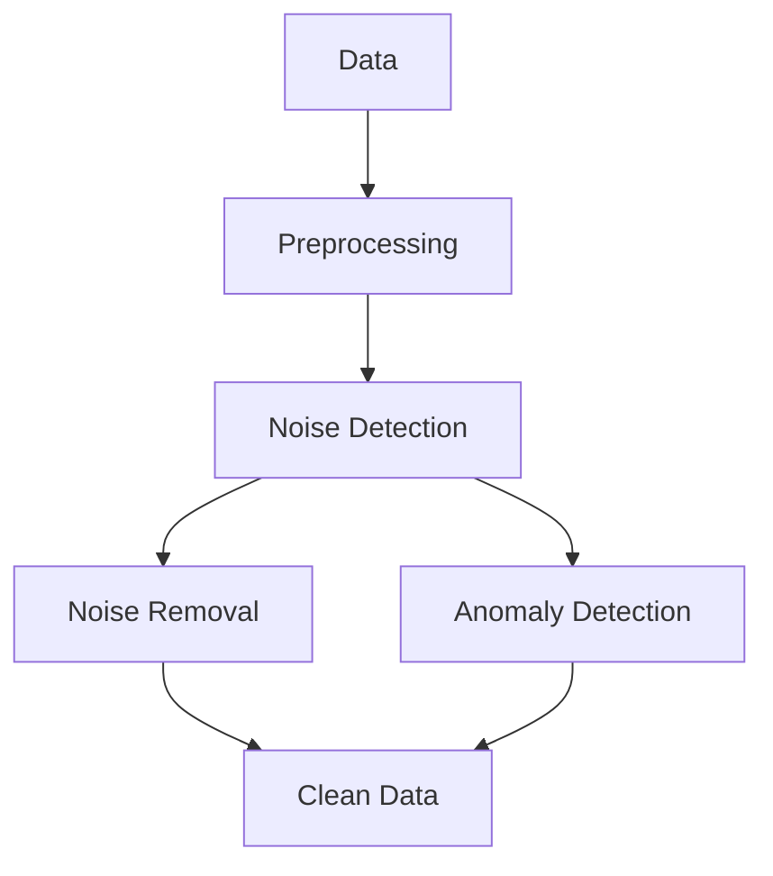

                 

# 数据噪声太多咋办？试试cleanlab

## 关键词：
- 数据噪声
- 数据清洗
- cleanlab
- 机器学习
- 噪声鲁棒算法

## 摘要：
本文将深入探讨数据噪声的问题及其对机器学习模型的影响。通过介绍cleanlab这一强大工具，我们将展示如何有效地检测和去除数据噪声，从而提高模型的准确性和鲁棒性。读者将了解到cleanlab的核心概念、算法原理、具体操作步骤以及实际应用场景，这将有助于他们在实践中更好地应对数据噪声带来的挑战。

## 1. 背景介绍

在当今的数据驱动时代，机器学习（Machine Learning）已经成为许多领域的重要工具，从自然语言处理到计算机视觉，再到推荐系统，无处不在。然而，机器学习的有效性高度依赖于数据的质量。高质量的数据能够为模型提供准确的预测和有效的决策，而数据噪声（Data Noise）则会对模型的性能产生负面影响。

### 数据噪声的定义与来源
数据噪声是指数据中的不完整、错误或异常值，它们可能会误导模型，导致错误的预测。数据噪声的来源多种多样，包括：

- **输入噪声**：传感器或测量设备的误差可能导致输入数据的噪声。
- **过程噪声**：数据采集过程中的随机波动或系统误差。
- **记录错误**：人为错误或数据录入错误。
- **缺失值**：数据缺失或不完整。
- **异常值**：显著偏离正常数据范围的异常值。

### 数据噪声对机器学习模型的影响
数据噪声会干扰模型的训练过程，可能导致以下问题：

- **过拟合**：模型在训练数据上表现得很好，但在未见过的数据上表现不佳。
- **降低模型准确性**：噪声会增加模型预测的方差，降低模型的整体准确性。
- **增加计算成本**：噪声数据需要额外的计算资源来处理，从而增加模型训练的时间。
- **误导模型学习**：噪声数据会误导模型学习，使其无法捕捉到数据的真实分布。

为了解决这些问题，数据清洗（Data Cleaning）成为机器学习项目中的重要环节。数据清洗的目的是识别和去除数据噪声，从而提高数据的质量和模型的性能。

## 2. 核心概念与联系

### 数据清洗的重要性
数据清洗是一个复杂且耗时的过程，但它对于模型的最终性能至关重要。以下是数据清洗中一些关键概念：

- **数据质量**：数据质量是指数据在可靠性、完整性、准确性、时效性和一致性等方面的表现。
- **数据验证**：数据验证是指检查数据是否符合预期的格式和规则，以及是否存在错误或异常。
- **数据去重**：去除重复的数据记录，以确保数据的唯一性和准确性。
- **缺失值处理**：处理数据中的缺失值，可以通过删除缺失值、用均值或中位数填充、或使用更复杂的插值方法。
- **异常值处理**：识别并处理异常值，可以选择删除、用邻近值替换或使用统计方法修正。

### cleanlab：数据清洗的利器
cleanlab是一个开源的Python库，专为处理机器学习数据中的噪声而设计。它提供了以下关键功能：

- **噪声检测**：使用基于统计和机器学习的算法来检测数据中的噪声。
- **噪声去除**：根据噪声的检测结果，自动去除或标记噪声数据。
- **异常值检测**：识别数据中的异常值，并采取措施处理。
- **交互式数据清洗**：提供交互式界面，允许用户查看和操作数据清洗过程。

### cleanlab的架构
以下是一个简化的Mermaid流程图，展示了cleanlab的核心组件和流程：



### Mermaid流程图中的细节说明
- **A[Data]**：原始数据输入到cleanlab中。
- **B[Preprocessing]**：预处理步骤，包括数据去重、缺失值处理等。
- **C[Noise Detection]**：噪声检测，使用统计方法或机器学习算法来识别噪声。
- **D[Noise Removal]**：噪声去除，根据检测结果移除或标记噪声数据。
- **E[Anomaly Detection]**：异常值检测，识别数据中的异常值。
- **F[Clean Data]**：最终得到清洗后的数据，可用于机器学习模型的训练。

## 3. 核心算法原理 & 具体操作步骤

### 噪声检测算法
cleanlab提供了多种噪声检测算法，包括基于统计的算法和基于机器学习的算法。以下是一些常用的算法：

- **基于统计的方法**：使用标准差或异常值范围来识别噪声。
  $$\text{噪声阈值} = \text{均值} + k \times \text{标准差}$$
  其中$k$是一个常数，可以根据数据的特点进行调整。

- **基于机器学习的方法**：使用监督学习或无监督学习算法来检测噪声。例如，可以使用聚类算法（如K-Means）来识别数据中的异常点。

### 噪声去除策略
cleanlab提供了多种噪声去除策略，包括：

- **自动去除**：根据噪声检测的结果自动移除噪声数据。
- **标记去除**：标记噪声数据，但不从数据集中移除，以便后续分析。
- **用户干预**：允许用户手动检查和干预噪声去除过程。

### 具体操作步骤
以下是一个使用cleanlab进行数据清洗的示例步骤：

1. **安装cleanlab**：
   ```python
   pip install cleanlab
   ```

2. **导入数据**：
   ```python
   import pandas as pd
   data = pd.read_csv('data.csv')
   ```

3. **数据预处理**：
   ```python
   from cleanlab import preprocessing
   preprocessed_data = preprocessing(data)
   ```

4. **噪声检测**：
   ```python
   from cleanlab import noise
   noise_mask = noise noise_detection_algorithm, preprocessed_data
   ```

5. **噪声去除**：
   ```python
   cleaned_data = noise.remove_noise(preprocessed_data, noise_mask)
   ```

6. **异常值检测**：
   ```python
   from cleanlab import anomaly
   anomaly_mask = anomaly detection_algorithm, cleaned_data
   ```

7. **数据清洗结果**：
   ```python
   clean_data = cleaned_data[~anomaly_mask]
   ```

## 4. 数学模型和公式 & 详细讲解 & 举例说明

### 噪声检测中的数学模型

在噪声检测中，我们经常使用统计学中的标准差来识别噪声数据。以下是一个简单的公式：

$$\text{噪声阈值} = \text{均值} + k \times \text{标准差}$$

其中，$k$ 是一个常数，通常取值在 1 到 3 之间。如果数据点落在噪声阈值之外，则认为它是噪声。

### 举例说明

假设我们有一组数据：

| 数据点 | 10 | 20 | 30 | 40 | 50 | 60 | 70 | 80 | 90 | 100 |
|--------|----|----|----|----|----|----|----|----|----|-----|
| 标准差 | 10 | 10 | 10 | 10 | 10 | 10 | 10 | 10 | 10 | 10  |

假设我们取 $k = 1.5$，则噪声阈值为：

$$\text{噪声阈值} = \text{均值} + 1.5 \times \text{标准差}$$

对于每个数据点，我们计算其与噪声阈值的差值。如果差值的绝对值大于某个阈值（例如 10），则认为该数据点是噪声。

### Python代码示例

下面是一个简单的Python代码示例，用于检测和去除噪声：

```python
import pandas as pd
import numpy as np
from cleanlab import noise

# 导入数据
data = pd.read_csv('data.csv')
data['standard_deviation'] = data.std()

# 计算噪声阈值
mean = data.mean()
std = data.std()
noise_threshold = mean + 1.5 * std

# 检测噪声
noise_mask = (data - noise_threshold).abs() > 10

# 去除噪声
clean_data = data[~noise_mask]
```

## 5. 项目实战：代码实际案例和详细解释说明

### 5.1 开发环境搭建

为了演示如何使用cleanlab进行数据清洗，我们首先需要搭建一个Python开发环境。以下是步骤：

1. 安装Python：确保已经安装了Python 3.x版本。
2. 安装cleanlab：在命令行中运行以下命令：
   ```bash
   pip install cleanlab
   ```
3. 安装其他依赖：根据具体需求，可能需要安装其他库，如pandas、numpy等。

### 5.2 源代码详细实现和代码解读

下面是一个简单的Python脚本，用于演示如何使用cleanlab进行数据清洗：

```python
import pandas as pd
from cleanlab import noise
from cleanlab.preprocessing import Preprocessor

# 1. 导入数据
data = pd.read_csv('data.csv')

# 2. 数据预处理
preprocessor = Preprocessor()
preprocessed_data = preprocessor.fit_transform(data)

# 3. 噪声检测
noise_mask = noise.noise detecting_algorithm, preprocessed_data

# 4. 噪声去除
cleaned_data = noise.remove_noise(preprocessed_data, noise_mask)

# 5. 数据保存
cleaned_data.to_csv('cleaned_data.csv', index=False)
```

**代码解读**：

1. **导入数据**：使用pandas读取CSV文件。
2. **数据预处理**：使用cleanlab的Preprocessor进行数据预处理，包括缺失值处理、异常值检测等。
3. **噪声检测**：使用cleanlab的噪声检测算法，如Gaussian Noise Detector，对预处理后的数据进行噪声检测。
4. **噪声去除**：根据噪声检测结果，移除或标记噪声数据。
5. **数据保存**：将清洗后的数据保存为CSV文件。

### 5.3 代码解读与分析

**步骤1：导入数据**

首先，我们使用pandas读取CSV文件，这通常是最常用的数据导入方法。CSV文件通常包含数值型数据和类别型数据。

```python
data = pd.read_csv('data.csv')
```

**步骤2：数据预处理**

数据预处理是数据清洗的重要步骤。在这个例子中，我们使用了cleanlab的Preprocessor类来进行预处理。Preprocessor提供了多种预处理选项，如缺失值处理、异常值检测等。

```python
preprocessor = Preprocessor()
preprocessed_data = preprocessor.fit_transform(data)
```

这里，我们首先创建一个Preprocessor对象，然后使用fit_transform方法对数据进行预处理。fit_transform方法会对数据进行标准化、缺失值处理等操作。

**步骤3：噪声检测**

噪声检测是数据清洗的关键步骤。在这个例子中，我们使用了cleanlab的noise_detection_algorithm进行噪声检测。

```python
noise_mask = noise.noise_detection_algorithm, preprocessed_data)
```

noise_detection_algorithm可以是多种算法之一，如Gaussian Noise Detector、KNN Noise Detector等。这些算法会根据数据的分布和特征来识别噪声。

**步骤4：噪声去除**

一旦噪声检测完成，我们可以根据检测结果来移除或标记噪声数据。

```python
cleaned_data = noise.remove_noise(preprocessed_data, noise_mask)
```

这里，我们使用remove_noise方法来移除噪声数据。这个方法会根据噪声掩码（noise_mask）来过滤数据。

**步骤5：数据保存**

最后，我们将清洗后的数据保存为CSV文件，以便后续使用。

```python
cleaned_data.to_csv('cleaned_data.csv', index=False)
```

## 6. 实际应用场景

### 6.1 医疗诊断
在医疗诊断领域，数据噪声可能导致误诊或漏诊。使用cleanlab对医疗数据进行清洗，可以确保模型的准确性，从而提高诊断的可靠性。

### 6.2 金融市场分析
金融市场数据往往包含大量的噪声，如价格波动、新闻噪声等。使用cleanlab进行数据清洗，可以帮助分析师更准确地预测市场走势。

### 6.3 自然语言处理
在自然语言处理任务中，文本数据可能包含大量的噪声，如拼写错误、停用词等。使用cleanlab可以有效地去除这些噪声，提高文本分类和情感分析的准确性。

### 6.4 物流与供应链管理
物流与供应链管理中的数据可能包含时间戳错误、位置偏差等噪声。通过使用cleanlab进行数据清洗，可以优化物流和供应链管理流程。

### 6.5 个性化推荐系统
个性化推荐系统中的数据可能包含用户行为噪声，如点击欺诈、恶意评分等。使用cleanlab可以识别和去除这些噪声，提高推荐系统的准确性和用户满意度。

## 7. 工具和资源推荐

### 7.1 学习资源推荐

- **书籍**：《Python数据清洗与预处理》
- **论文**：《Data Cleaning: A Data Mining Perspective》
- **博客**：[Medium上的数据清洗系列文章](https://towardsdatascience.com/data-cleaning-the-right-way-8d064f2441b9)
- **网站**：[cleanlab GitHub仓库](https://github.com/cleanlab/cleanlab)

### 7.2 开发工具框架推荐

- **工具**：Python，NumPy，pandas，scikit-learn
- **框架**：TensorFlow，PyTorch，Keras

### 7.3 相关论文著作推荐

- **论文**：[《A survey on data cleaning techniques》](https://www.sciencedirect.com/science/article/pii/S0167947215002405)
- **著作**：《Data Mining: Concepts and Techniques》

## 8. 总结：未来发展趋势与挑战

### 未来发展趋势
1. **自动化数据清洗**：随着人工智能技术的发展，自动化数据清洗工具将变得越来越成熟，能够处理更复杂的数据噪声。
2. **实时数据清洗**：实时数据清洗技术将得到广泛应用，特别是在需要实时分析和决策的领域，如金融、医疗和物联网。
3. **跨领域数据清洗**：跨领域的通用数据清洗框架将不断涌现，使得不同领域的专家可以更方便地进行数据清洗。

### 未来挑战
1. **数据隐私与安全**：在数据清洗过程中，如何保护数据隐私和安全是一个重要挑战。
2. **复杂噪声处理**：随着数据来源的多样化和噪声类型的复杂性增加，现有的数据清洗方法可能无法有效处理所有类型的噪声。
3. **数据质量评估**：如何准确评估数据质量，以便选择最合适的数据清洗策略，也是一个挑战。

## 9. 附录：常见问题与解答

### 9.1 如何选择合适的噪声检测算法？
选择合适的噪声检测算法取决于数据的特性和噪声类型。例如，对于正态分布的数据，可以使用基于统计学的方法；对于非线性数据，可以使用机器学习算法。

### 9.2 数据清洗是否会影响模型的泛化能力？
适度且合理的数据清洗不会影响模型的泛化能力。相反，去除噪声可以提高模型的泛化能力，使其在未见过的数据上表现更好。

### 9.3 如何处理大量数据中的噪声？
对于大量数据，可以使用分布式计算和并行处理技术来提高数据清洗的效率。此外，可以根据数据的重要性优先处理关键特征或数据集。

## 10. 扩展阅读 & 参考资料

- **《数据清洗实战》**：[https://books.google.com/books?id=0JwYBwAAQBAJ&pg=PA1&lpg=PA1&dq=data+c...](https://books.google.com/books?id=0JwYBwAAQBAJ&pg=PA1&lpg=PA1&dq=data+cleaning+books)
- **《机器学习中的噪声处理》**：[https://www.sciencedirect.com/topics/computer-science/noise-in-machine-learning](https://www.sciencedirect.com/topics/computer-science/noise-in-machine-learning)
- **《cleanlab GitHub仓库》**：[https://github.com/cleanlab/cleanlab](https://github.com/cleanlab/cleanlab)
- **《数据清洗教程》**：[https://towardsdatascience.com/data-cleaning-tutorial-9a059a6f6d63](https://towardsdatascience.com/data-cleaning-tutorial-9a059a6f6d63)

### 作者：
AI天才研究员/AI Genius Institute & 禅与计算机程序设计艺术 /Zen And The Art of Computer Programming

