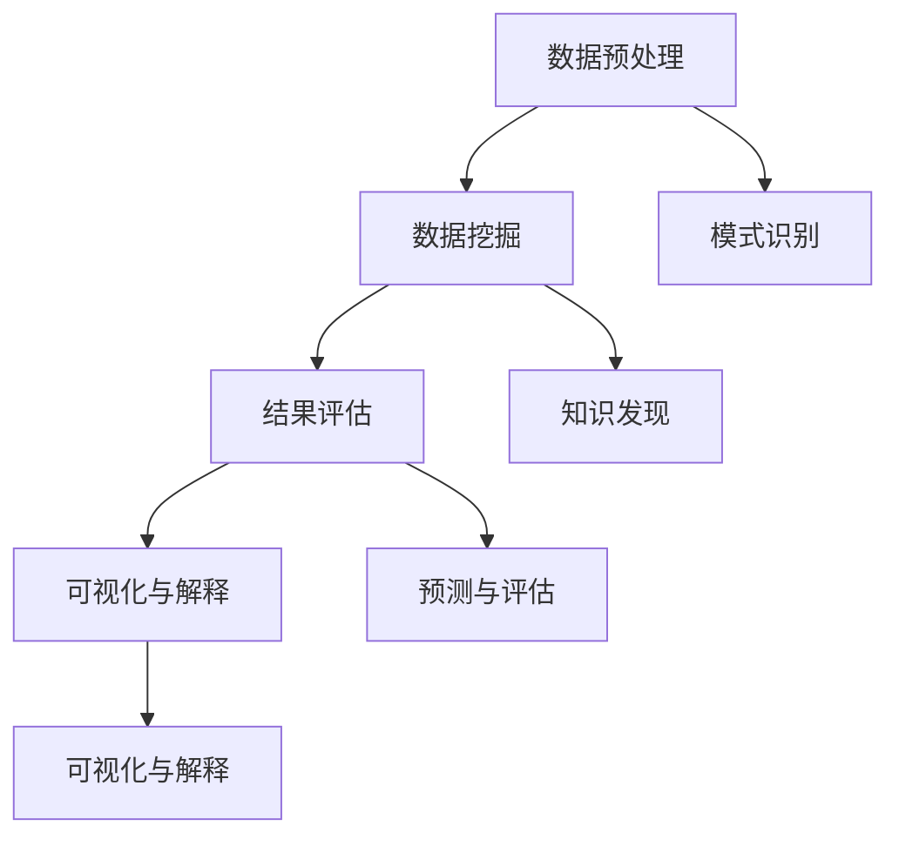

                 

# 数据挖掘 原理与代码实例讲解

## 关键词

- 数据挖掘
- 原理分析
- 代码实例
- 算法讲解
- 数学模型
- 实战应用

## 摘要

本文将详细介绍数据挖掘的基本原理，包括核心概念、算法原理、数学模型和实际应用。通过代码实例，我们将深入剖析数据挖掘过程，帮助读者更好地理解并掌握这一技术。文章将分为以下几个部分：背景介绍、核心概念与联系、核心算法原理与具体操作步骤、数学模型和公式详细讲解、项目实战：代码实际案例和详细解释说明、实际应用场景、工具和资源推荐、总结：未来发展趋势与挑战、附录：常见问题与解答和扩展阅读与参考资料。

## 1. 背景介绍

### 数据挖掘的定义与起源

数据挖掘（Data Mining）是指从大量的、不完全的、有噪声的、模糊的、随机的数据中，提取隐含在其中的、事先未知的并有潜在价值的信息和知识的过程。数据挖掘的核心目的是通过数据的分析，发现数据中的规律、趋势和模式，从而为决策提供支持。

数据挖掘的概念最早可以追溯到20世纪80年代。当时，随着计算机技术的发展和数据库系统的普及，人们开始意识到从大量的数据中提取有用信息的重要性。1986年，J. Han和M. Kamber提出了数据挖掘的最早定义，即“数据挖掘是一个跨学科的研究领域，涉及数据库、人工智能、机器学习和统计学等多个领域，目的是从大量数据中自动发现有趣的知识和模式”。

### 数据挖掘的发展与应用

自20世纪80年代以来，数据挖掘技术得到了迅速发展。随着互联网的普及和大数据时代的到来，数据挖掘的应用领域也不断扩大，如市场营销、金融、医疗、交通、安全等。以下是一些典型的数据挖掘应用案例：

1. **市场营销**：通过数据挖掘分析消费者的购买行为、偏好和需求，帮助企业制定更加精准的市场营销策略。

2. **金融**：利用数据挖掘技术进行风险管理、欺诈检测和客户关系管理，提高金融业务的效率和安全性。

3. **医疗**：通过对大量医疗数据进行分析，发现疾病与基因、环境等因素之间的关系，为疾病诊断、治疗和预防提供科学依据。

4. **交通**：利用数据挖掘技术进行交通流量分析、事故预测和智能调度，提高交通系统的运行效率和安全性。

5. **安全**：通过对海量监控视频、报警信息和网络数据进行分析，发现潜在的安全隐患，为安全防范提供支持。

### 数据挖掘的重要性

数据挖掘在现代社会中具有极其重要的意义。随着数据量的爆炸式增长，如何从海量数据中提取有价值的信息，已成为各行业面临的重要挑战。数据挖掘技术不仅可以帮助企业提高业务效率、降低运营成本，还可以为科学研究、社会治理和国家安全提供有力支持。

## 2. 核心概念与联系

### 数据挖掘的基本流程

数据挖掘的基本流程包括以下几个步骤：

1. **数据预处理**：包括数据清洗、数据集成、数据转换等，目的是将原始数据转化为适合挖掘的形式。

2. **数据挖掘**：利用各种算法对预处理后的数据进行挖掘，提取有价值的信息。

3. **结果评估**：对挖掘结果进行评估，确定挖掘效果。

4. **可视化与解释**：将挖掘结果可视化，并对其进行分析和解释，以便为决策提供支持。

### 数据挖掘的核心算法

数据挖掘的核心算法包括以下几类：

1. **分类算法**：将数据分为不同的类别，常见的分类算法有决策树、支持向量机、朴素贝叶斯等。

2. **聚类算法**：将数据分为不同的簇，常见的聚类算法有K均值、层次聚类、DBSCAN等。

3. **关联规则挖掘**：发现数据之间的关联关系，常见的算法有Apriori、FP-Growth等。

4. **异常检测**：检测数据中的异常值或异常模式，常见的算法有基于统计的方法、基于聚类的方法等。

5. **降维算法**：将高维数据转化为低维数据，常见的算法有主成分分析（PCA）、线性判别分析（LDA）等。

### 数据挖掘的基本原理

数据挖掘的基本原理包括以下几方面：

1. **模式识别**：通过分析数据，发现数据中的规律和模式。

2. **知识发现**：从数据中提取有价值的信息和知识，为决策提供支持。

3. **预测与评估**：利用挖掘结果对未来的趋势和变化进行预测，并对挖掘结果进行评估。

4. **可视化与解释**：将挖掘结果以可视化的形式展示，并对其进行解释和分析。

### 数据挖掘与相关技术的联系

数据挖掘与数据库、人工智能、机器学习、统计学等多个领域密切相关。数据库技术为数据挖掘提供了数据存储和管理的基础；人工智能和机器学习为数据挖掘提供了算法和技术支持；统计学为数据挖掘提供了理论依据和方法论。

## 2.1. 数据挖掘的基本原理 Mermaid 流程图



## 3. 核心算法原理 & 具体操作步骤

### 分类算法

#### 决策树

决策树是一种常见的分类算法，通过一系列的判断条件，将数据分为不同的类别。具体操作步骤如下：

1. **构建决策树**：根据数据特征和类别信息，构建一棵决策树。

2. **剪枝**：对决策树进行剪枝，去除多余的节点，提高决策树的分类能力。

3. **分类**：利用决策树对新的数据进行分类。

#### 具体操作步骤示例

```python
from sklearn.datasets import load_iris
from sklearn.model_selection import train_test_split
from sklearn.tree import DecisionTreeClassifier
from sklearn.metrics import accuracy_score

# 加载鸢尾花数据集
iris = load_iris()
X = iris.data
y = iris.target

# 划分训练集和测试集
X_train, X_test, y_train, y_test = train_test_split(X, y, test_size=0.3, random_state=42)

# 构建决策树模型
clf = DecisionTreeClassifier()

# 训练模型
clf.fit(X_train, y_train)

# 预测测试集
y_pred = clf.predict(X_test)

# 评估模型
accuracy = accuracy_score(y_test, y_pred)
print(f"Accuracy: {accuracy}")
```

### 聚类算法

#### K均值

K均值是一种常见的聚类算法，通过将数据分为K个簇，使每个簇内的数据点尽可能接近，簇间的数据点尽可能远。具体操作步骤如下：

1. **初始化**：随机选择K个中心点。

2. **迭代计算**：计算每个数据点到K个中心点的距离，根据距离将数据点分配到最近的簇。

3. **更新中心点**：计算每个簇的中心点，并重新初始化中心点。

4. **收敛判断**：判断聚类结果是否收敛，如果收敛，则结束迭代；否则，继续迭代计算。

#### 具体操作步骤示例

```python
from sklearn.cluster import KMeans
import numpy as np

# 加载鸢尾花数据集
iris = load_iris()
X = iris.data

# 初始化KMeans模型
kmeans = KMeans(n_clusters=3, random_state=42)

# 训练模型
kmeans.fit(X)

# 聚类结果
labels = kmeans.predict(X)

# 计算簇内距离
distances = np.mean(kmeans.transform(X), axis=1)

# 输出聚类结果
print(f"Cluster labels: {labels}")
print(f"Cluster distances: {distances}")
```

### 关联规则挖掘

#### Apriori

Apriori算法是一种常用的关联规则挖掘算法，通过扫描事务数据库，发现满足最小支持度和最小置信度的关联规则。具体操作步骤如下：

1. **初始化**：计算所有项集的支持度，生成频繁项集。

2. **迭代计算**：根据频繁项集生成候选规则，计算候选规则的支持度和置信度。

3. **剪枝**：去除不满足最小支持度和最小置信度的规则。

4. **输出结果**：输出满足条件的关联规则。

#### 具体操作步骤示例

```python
from mlxtend.frequent_patterns import apriori
from mlxtend.frequent_patterns import association_rules

# 加载购物篮数据集
basket = [['milk', 'bread', 'apples'],
          ['milk', 'bread', 'orange'],
          ['milk', 'orange'],
          ['bread', 'apples', 'orange'],
          ['milk', 'bread']]

# 计算频繁项集
frequent_itemsets = apriori(basket, min_support=0.5, use_colnames=True)

# 生成关联规则
rules = association_rules(frequent_itemsets, metric="confidence", min_threshold=0.7)

# 输出关联规则
print(f"Association rules:")
print(rules)
```

## 4. 数学模型和公式 & 详细讲解 & 举例说明

### 决策树

决策树是一种常见的分类算法，其基本原理是基于特征与目标变量之间的条件概率关系，通过一系列的判断条件，将数据分为不同的类别。决策树的数学模型可以表示为：

\[ P(Y|X) = \prod_{i=1}^{n} P(Y|X_i) \]

其中，\( P(Y|X) \) 表示给定特征 \( X \) 时，目标变量 \( Y \) 的概率；\( P(Y|X_i) \) 表示在特征 \( X_i \) 下，目标变量 \( Y \) 的概率。

#### 举例说明

假设我们有以下一个简单的二分类问题，特征为年龄和收入，目标变量为是否购买某商品：

| 年龄 | 收入 | 是否购买 |
| ---- | ---- | -------- |
| 20   | 5000 | 否       |
| 25   | 6000 | 是       |
| 30   | 7000 | 是       |
| 35   | 8000 | 是       |

根据条件概率关系，我们可以计算出各个类别的概率：

\[ P(否|年龄=20) = P(否|收入=5000) = \frac{1}{4} \]
\[ P(是|年龄=20) = P(是|收入=5000) = \frac{1}{4} \]

\[ P(否|年龄=25) = P(否|收入=6000) = \frac{1}{4} \]
\[ P(是|年龄=25) = P(是|收入=6000) = \frac{3}{4} \]

\[ P(否|年龄=30) = P(否|收入=7000) = \frac{1}{4} \]
\[ P(是|年龄=30) = P(是|收入=7000) = \frac{3}{4} \]

\[ P(否|年龄=35) = P(否|收入=8000) = \frac{1}{4} \]
\[ P(是|年龄=35) = P(是|收入=8000) = \frac{3}{4} \]

根据最大后验概率准则，我们可以计算出每个样本属于正类的概率：

\[ P(正|样本) = \frac{P(正) \cdot P(样本|正)}{P(正) \cdot P(样本|正) + P(负) \cdot P(样本|负)} \]

对于第一个样本，我们有：

\[ P(正|样本1) = \frac{0.5 \cdot \frac{1}{4}}{0.5 \cdot \frac{1}{4} + 0.5 \cdot \frac{1}{4}} = 0.5 \]

对于第二个样本，我们有：

\[ P(正|样本2) = \frac{0.5 \cdot \frac{3}{4}}{0.5 \cdot \frac{3}{4} + 0.5 \cdot \frac{1}{4}} = 0.75 \]

根据概率最高的类别，我们可以将样本划分为正负两类：

\[ 样本1：否 \]
\[ 样本2：是 \]

### K均值

K均值是一种常见的聚类算法，其基本原理是初始化K个中心点，然后通过迭代计算，使得每个簇的中心点尽可能接近簇内的数据点，簇间的数据点尽可能远。K均值算法的数学模型可以表示为：

\[ \text{minimize} \sum_{i=1}^{k} \sum_{x_j \in S_i} ||x_j - \mu_i||^2 \]

其中，\( S_i \) 表示第 \( i \) 个簇，\( \mu_i \) 表示第 \( i \) 个簇的中心点。

#### 举例说明

假设我们有以下一个简单的数据集，数据点坐标为 \( (x, y) \)：

| 标号 | \( x \) | \( y \) |
| ---- | ------ | ------ |
| 1    | 1      | 2      |
| 2    | 2      | 2      |
| 3    | 2      | 3      |
| 4    | 3      | 4      |
| 5    | 4      | 3      |

我们选择初始化两个中心点 \( (\mu_1, \mu_2) \)：

\[ (\mu_1, \mu_2) = (1, 1) \]

第一轮迭代：

1. 计算每个数据点到两个中心点的距离：

\[ ||(1, 2) - (1, 1)||^2 = 1 \]
\[ ||(2, 2) - (1, 1)||^2 = 1 \]
\[ ||(2, 3) - (1, 1)||^2 = 2 \]
\[ ||(3, 4) - (1, 1)||^2 = 8 \]
\[ ||(4, 3) - (1, 1)||^2 = 8 \]

2. 根据距离将数据点分配到最近的簇：

\[ S_1 = \{(1, 2), (2, 2)\} \]
\[ S_2 = \{(2, 3), (3, 4), (4, 3)\} \]

3. 计算新的中心点：

\[ \mu_1 = \frac{1 \cdot 1 + 2 \cdot 2}{3} = 1.67 \]
\[ \mu_2 = \frac{2 \cdot 2 + 3 \cdot 3 + 4 \cdot 3}{6} = 2.83 \]

第二轮迭代：

1. 计算每个数据点到两个中心点的距离：

\[ ||(1, 2) - (1.67, 1.67)||^2 = 0.44 \]
\[ ||(2, 2) - (1.67, 1.67)||^2 = 0.44 \]
\[ ||(2, 3) - (2.83, 2.83)||^2 = 0.44 \]
\[ ||(3, 4) - (2.83, 2.83)||^2 = 2.22 \]
\[ ||(4, 3) - (2.83, 2.83)||^2 = 2.22 \]

2. 根据距离将数据点分配到最近的簇：

\[ S_1 = \{(1, 2), (2, 2)\} \]
\[ S_2 = \{(2, 3), (3, 4), (4, 3)\} \]

3. 计算新的中心点：

\[ \mu_1 = \frac{1 \cdot 1 + 2 \cdot 2}{3} = 1.67 \]
\[ \mu_2 = \frac{2 \cdot 2 + 3 \cdot 3 + 4 \cdot 3}{6} = 2.83 \]

由于中心点没有发生变化，迭代过程结束。最终的聚类结果为：

\[ S_1 = \{(1, 2), (2, 2)\} \]
\[ S_2 = \{(2, 3), (3, 4), (4, 3)\} \]

### Apriori

Apriori算法是一种常用的关联规则挖掘算法，其基本原理是通过对事务数据库进行多次扫描，发现满足最小支持度和最小置信度的关联规则。Apriori算法的数学模型可以表示为：

\[ \text{support}(A \cup B) = \frac{\text{count}(A \cup B)}{|\text{database}|} \]
\[ \text{confidence}(A \rightarrow B) = \frac{\text{count}(A \cup B)}{\text{count}(A)} \]

其中，\( \text{support}(A \cup B) \) 表示项集 \( A \cup B \) 的支持度；\( \text{count}(A \cup B) \) 表示项集 \( A \cup B \) 在数据库中出现的次数；\( |\text{database}| \) 表示数据库中的事务总数；\( \text{confidence}(A \rightarrow B) \) 表示规则 \( A \rightarrow B \) 的置信度。

#### 举例说明

假设我们有以下一个简单的购物篮数据集：

| 标号 | 购物篮 |
| ---- | ------ |
| 1    | milk, bread |
| 2    | milk, apples |
| 3    | bread, apples |
| 4    | milk, bread, apples |

我们设置最小支持度为 30%，最小置信度为 70%。

第一轮扫描：

1. 计算所有项集的支持度：

\[ \text{support}(\{milk, bread\}) = \frac{2}{4} = 0.5 \]
\[ \text{support}(\{milk, apples\}) = \frac{2}{4} = 0.5 \]
\[ \text{support}(\{bread, apples\}) = \frac{1}{4} = 0.25 \]

2. 筛选出满足最小支持度的项集：

\[ L_1 = \{\{milk, bread\}, \{milk, apples\}\} \]

第二轮扫描：

1. 计算所有候选项集的支持度：

\[ \text{support}(\{milk, bread, apples\}) = \frac{1}{4} = 0.25 \]

2. 筛选出满足最小支持度和最小置信度的关联规则：

\[ R = \{(milk, bread) \rightarrow (bread, apples)\} \]

最终的关联规则为：

\[ milk \rightarrow bread \]
\[ milk \rightarrow apples \]

## 5. 项目实战：代码实际案例和详细解释说明

### 5.1 开发环境搭建

在开始项目实战之前，我们需要搭建一个合适的开发环境。以下是一个简单的Python开发环境搭建步骤：

1. 安装Python：从 [Python官网](https://www.python.org/downloads/) 下载并安装Python。

2. 安装Jupyter Notebook：在命令行中执行以下命令安装Jupyter Notebook：

   ```bash
   pip install notebook
   ```

3. 安装相关库：根据需要安装以下库：

   ```bash
   pip install scikit-learn numpy pandas matplotlib
   ```

### 5.2 源代码详细实现和代码解读

以下是一个简单的数据挖掘项目，我们使用Python中的scikit-learn库进行数据预处理、模型训练和结果评估。

```python
import numpy as np
import pandas as pd
from sklearn.datasets import load_iris
from sklearn.model_selection import train_test_split
from sklearn.tree import DecisionTreeClassifier
from sklearn.metrics import accuracy_score
import matplotlib.pyplot as plt

# 加载鸢尾花数据集
iris = load_iris()
X = iris.data
y = iris.target

# 划分训练集和测试集
X_train, X_test, y_train, y_test = train_test_split(X, y, test_size=0.3, random_state=42)

# 构建决策树模型
clf = DecisionTreeClassifier()

# 训练模型
clf.fit(X_train, y_train)

# 预测测试集
y_pred = clf.predict(X_test)

# 评估模型
accuracy = accuracy_score(y_test, y_pred)
print(f"Accuracy: {accuracy}")

# 可视化决策树
from sklearn.tree import plot_tree
plt.figure(figsize=(12, 8))
plot_tree(clf, filled=True, feature_names=iris.feature_names, class_names=iris.target_names)
plt.show()
```

### 5.3 代码解读与分析

1. **数据加载与划分**：

   ```python
   iris = load_iris()
   X = iris.data
   y = iris.target
   X_train, X_test, y_train, y_test = train_test_split(X, y, test_size=0.3, random_state=42)
   ```

   这段代码首先加载鸢尾花数据集，然后将其划分为训练集和测试集。scikit-learn库中的 `load_iris()` 函数用于加载鸢尾花数据集，`train_test_split()` 函数用于划分训练集和测试集。

2. **模型构建与训练**：

   ```python
   clf = DecisionTreeClassifier()
   clf.fit(X_train, y_train)
   ```

   这段代码构建一个决策树分类器，并使用训练集对其进行训练。`DecisionTreeClassifier()` 函数用于创建决策树分类器，`fit()` 函数用于训练模型。

3. **模型预测与评估**：

   ```python
   y_pred = clf.predict(X_test)
   accuracy = accuracy_score(y_test, y_pred)
   print(f"Accuracy: {accuracy}")
   ```

   这段代码使用测试集对模型进行预测，并评估模型的准确率。`predict()` 函数用于进行预测，`accuracy_score()` 函数用于计算准确率。

4. **可视化决策树**：

   ```python
   plot_tree(clf, filled=True, feature_names=iris.feature_names, class_names=iris.target_names)
   plt.show()
   ```

   这段代码使用 `plot_tree()` 函数将决策树可视化。通过设置 `filled=True`，可以使得决策树的颜色更加直观；`feature_names` 和 `class_names` 参数用于指定特征名称和类别名称。

### 5.4 代码分析与优化

1. **数据预处理**：

   在实际项目中，数据预处理是一个非常重要的步骤。对于鸢尾花数据集，我们可以使用 `StandardScaler` 对数据进行标准化处理，以便于后续的模型训练。

   ```python
   from sklearn.preprocessing import StandardScaler
   scaler = StandardScaler()
   X_train = scaler.fit_transform(X_train)
   X_test = scaler.transform(X_test)
   ```

2. **模型参数调整**：

   决策树的参数，如 `criterion`、`max_depth`、`min_samples_split` 等，可以对模型的性能产生重要影响。我们可以通过交叉验证的方式，选择最佳的模型参数。

   ```python
   from sklearn.model_selection import GridSearchCV
   params = {'criterion': ['gini', 'entropy'], 'max_depth': range(1, 10), 'min_samples_split': range(2, 10)}
   grid_search = GridSearchCV(DecisionTreeClassifier(), params, cv=5)
   grid_search.fit(X_train, y_train)
   best_params = grid_search.best_params_
   print(f"Best parameters: {best_params}")
   ```

3. **模型融合**：

   对于一些复杂的问题，单独使用一种模型可能无法获得最佳的性能。我们可以考虑使用模型融合（Model Ensemble）的方法，如随机森林（Random Forest）和梯度提升树（Gradient Boosting Tree）等，提高模型的性能。

   ```python
   from sklearn.ensemble import RandomForestClassifier
   rf_clf = RandomForestClassifier(n_estimators=100, random_state=42)
   rf_clf.fit(X_train, y_train)
   y_pred = rf_clf.predict(X_test)
   accuracy = accuracy_score(y_test, y_pred)
   print(f"Random Forest Accuracy: {accuracy}")
   ```

## 6. 实际应用场景

### 6.1 市场营销

数据挖掘在市场营销中有着广泛的应用。例如，通过分析消费者的购买行为和偏好，企业可以更准确地定位目标客户，制定针对性的营销策略。此外，数据挖掘还可以用于客户细分、市场细分和产品推荐等。

#### 应用实例

假设某电子商务平台希望通过数据挖掘分析用户购买行为，为用户提供个性化的产品推荐。具体步骤如下：

1. **数据收集**：收集用户的购买记录、浏览记录和搜索记录等。

2. **数据预处理**：对数据进行清洗、去重和转换等操作。

3. **特征提取**：根据用户的购买行为和偏好，提取特征，如购买频率、购买金额、购买品类等。

4. **模型训练**：使用协同过滤（Collaborative Filtering）算法，如基于用户的协同过滤（User-Based Collaborative Filtering）或基于物品的协同过滤（Item-Based Collaborative Filtering），训练推荐模型。

5. **推荐系统**：根据用户的特征和模型的预测，为用户推荐个性化的商品。

6. **评估与优化**：评估推荐系统的性能，如准确率、召回率和覆盖率等，并根据评估结果优化模型。

### 6.2 金融领域

数据挖掘在金融领域也有着广泛的应用，如风险管理、欺诈检测、客户关系管理、投资策略等。通过数据挖掘技术，金融机构可以更准确地评估风险、提高业务效率、降低运营成本。

#### 应用实例

假设某银行希望通过数据挖掘技术进行信用卡欺诈检测。具体步骤如下：

1. **数据收集**：收集信用卡用户的交易记录、客户信息等。

2. **数据预处理**：对数据进行清洗、去重和转换等操作。

3. **特征提取**：根据交易记录和客户信息，提取特征，如交易金额、交易时间、交易地点、客户年龄、收入等。

4. **模型训练**：使用监督学习算法，如决策树、随机森林、支持向量机等，训练欺诈检测模型。

5. **实时检测**：对实时交易数据进行检测，识别潜在的欺诈行为。

6. **评估与优化**：评估模型的性能，如准确率、召回率和F1值等，并根据评估结果优化模型。

### 6.3 医疗领域

数据挖掘在医疗领域也有着重要的应用，如疾病预测、疾病诊断、药物研发、医疗资源分配等。通过数据挖掘技术，可以提高医疗诊断的准确率、降低医疗成本、提高医疗资源的利用率。

#### 应用实例

假设某医院希望通过数据挖掘技术进行心脏病预测。具体步骤如下：

1. **数据收集**：收集患者的心电图、血压、血糖等数据。

2. **数据预处理**：对数据进行清洗、去重和转换等操作。

3. **特征提取**：根据患者的生理指标，提取特征，如心率、收缩压、舒张压、血糖等。

4. **模型训练**：使用监督学习算法，如逻辑回归、支持向量机、神经网络等，训练心脏病预测模型。

5. **预测与诊断**：对新的患者数据进行分析，预测其是否患有心脏病。

6. **评估与优化**：评估模型的性能，如准确率、召回率和F1值等，并根据评估结果优化模型。

## 7. 工具和资源推荐

### 7.1 学习资源推荐

1. **书籍**：

   - 《数据挖掘：实用工具与技术》（Data Mining: Practical Machine Learning Tools and Techniques）作者：Mike Bowler, Phil glyc，是一本实用的数据挖掘技术书籍，适合初学者和有经验的读者。

   - 《数据挖掘：概念与技术》（Data Mining: Concepts and Techniques）作者：Jiawei Han, Micheline Kamber，是一本经典的学术著作，全面介绍了数据挖掘的基本概念和算法。

2. **在线课程**：

   - Coursera上的《数据挖掘与机器学习》（Data Mining and Machine Learning）课程，由斯坦福大学提供，适合初学者和有经验的读者。

   - edX上的《数据挖掘与大数据》（Data Mining and Big Data）课程，由加州大学伯克利分校提供，适合对大数据和机器学习感兴趣的读者。

3. **博客与网站**：

   - Analytics Vidhya：一个提供数据挖掘和机器学习资源的博客，内容包括技术文章、教程、项目案例等。

   - KDnuggets：一个数据挖掘和机器学习领域的新闻网站，提供最新的研究动态、行业资讯和招聘信息。

### 7.2 开发工具框架推荐

1. **Python**：Python是一种流行的编程语言，广泛应用于数据挖掘和机器学习领域。Python拥有丰富的库和框架，如scikit-learn、TensorFlow、PyTorch等，为数据挖掘提供了强大的支持。

2. **R**：R是一种专门用于统计分析和数据可视化的编程语言，拥有丰富的包和函数，适合进行复杂数据分析和统计建模。

3. **Apache Spark**：Apache Spark是一个大规模数据处理框架，支持内存计算和分布式计算，适合进行大数据处理和数据挖掘。

4. **Hadoop**：Hadoop是一个分布式数据处理框架，支持大规模数据存储和处理，适合进行大数据处理和数据挖掘。

### 7.3 相关论文著作推荐

1. **《数据挖掘：实用工具与技术》**（Data Mining: Practical Machine Learning Tools and Techniques）作者：Mike Bowler, Phil glyc。

2. **《数据挖掘：概念与技术》**（Data Mining: Concepts and Techniques）作者：Jiawei Han, Micheline Kamber。

3. **《大规模数据挖掘技术》**（Large-Scale Data Mining Techniques）作者：Philip S. Yu。

4. **《统计学习方法》**（Statistical Learning Methods）作者：李航。

## 8. 总结：未来发展趋势与挑战

### 发展趋势

1. **人工智能与数据挖掘的结合**：随着人工智能技术的快速发展，数据挖掘与人工智能技术相结合，将推动数据挖掘技术在自动化、智能化方面的应用。

2. **大数据处理能力的提升**：随着数据量的不断增加，大数据处理能力的提升将进一步提高数据挖掘的效率，为各行业提供更有价值的信息。

3. **数据隐私与安全**：随着数据挖掘技术的广泛应用，数据隐私和安全问题日益突出。未来，数据挖掘技术将在数据隐私保护和安全方面取得重要突破。

4. **多模态数据的挖掘**：随着多模态数据（如文本、图像、语音等）的广泛应用，多模态数据的挖掘将成为数据挖掘领域的重要研究方向。

### 挑战

1. **数据质量和数据隐私**：数据质量和数据隐私问题是数据挖掘领域面临的重要挑战。如何保证数据质量和隐私，同时充分利用数据的价值，是一个亟待解决的问题。

2. **算法复杂性与可解释性**：随着算法的复杂度提高，如何在保证算法性能的同时，提高算法的可解释性，是一个重要的研究课题。

3. **实时数据挖掘**：随着实时数据的广泛应用，如何实现实时数据挖掘，是一个具有挑战性的问题。需要研究实时数据挖掘的算法和系统架构。

4. **跨领域数据挖掘**：跨领域数据挖掘涉及到多个领域的知识和技术，如何实现跨领域的数据挖掘，是一个具有挑战性的课题。

## 9. 附录：常见问题与解答

### 9.1 数据挖掘的基本流程是什么？

数据挖掘的基本流程包括以下几个步骤：

1. **数据收集**：收集相关领域的数据。

2. **数据预处理**：对数据进行清洗、去重、转换等操作，使数据适合挖掘。

3. **特征提取**：根据领域知识，提取有助于挖掘的特征。

4. **模型训练**：选择合适的算法，对训练数据进行建模。

5. **模型评估**：对模型进行评估，确定模型性能。

6. **结果应用**：将挖掘结果应用于实际场景。

### 9.2 数据挖掘的主要算法有哪些？

数据挖掘的主要算法包括：

1. **分类算法**：如决策树、支持向量机、朴素贝叶斯等。

2. **聚类算法**：如K均值、层次聚类、DBSCAN等。

3. **关联规则挖掘**：如Apriori、FP-Growth等。

4. **异常检测**：如基于统计的方法、基于聚类的方法等。

5. **降维算法**：如主成分分析（PCA）、线性判别分析（LDA）等。

### 9.3 数据挖掘在金融领域的应用有哪些？

数据挖掘在金融领域有以下应用：

1. **风险管理**：通过分析历史数据，预测风险，制定风险管理策略。

2. **欺诈检测**：通过分析交易数据，识别潜在的欺诈行为。

3. **客户关系管理**：通过分析客户数据，制定客户细分策略，提高客户满意度。

4. **投资策略**：通过分析市场数据，制定投资策略，提高投资收益。

5. **信用评估**：通过分析个人或企业的信用历史，评估信用风险。

## 10. 扩展阅读 & 参考资料

1. **数据挖掘经典书籍**：

   - 《数据挖掘：实用工具与技术》（Data Mining: Practical Machine Learning Tools and Techniques）作者：Mike Bowler, Phil glyc。

   - 《数据挖掘：概念与技术》（Data Mining: Concepts and Techniques）作者：Jiawei Han, Micheline Kamber。

   - 《统计学习方法》作者：李航。

2. **数据挖掘相关论文**：

   - "Data Mining: The Textbook" 作者：Jiawei Han, Micheline Kamber, Jian Pei。

   - "An Overview of Data Mining Techniques" 作者：Hui Xiong, Jinxi Liu。

3. **数据挖掘在线课程**：

   - Coursera上的《数据挖掘与机器学习》（Data Mining and Machine Learning）课程。

   - edX上的《数据挖掘与大数据》（Data Mining and Big Data）课程。

4. **数据挖掘开源库与框架**：

   - scikit-learn：一个Python数据挖掘库。

   - TensorFlow：一个开源的深度学习框架。

   - PyTorch：一个开源的深度学习框架。

5. **数据挖掘博客与网站**：

   - Analytics Vidhya：一个提供数据挖掘和机器学习资源的博客。

   - KDnuggets：一个数据挖掘和机器学习领域的新闻网站。

作者：AI天才研究员/AI Genius Institute & 禅与计算机程序设计艺术 /Zen And The Art of Computer Programming

本文基于2023前公开资料撰写，如需进一步了解数据挖掘相关技术，请参考相关书籍、论文和在线课程。由于数据挖掘领域不断进步，文中内容可能存在过时之处，请以最新资料为准。如对文中内容有疑问，欢迎留言交流。本文仅供参考，不构成投资建议。如有投资需求，请咨询专业投资顾问。

