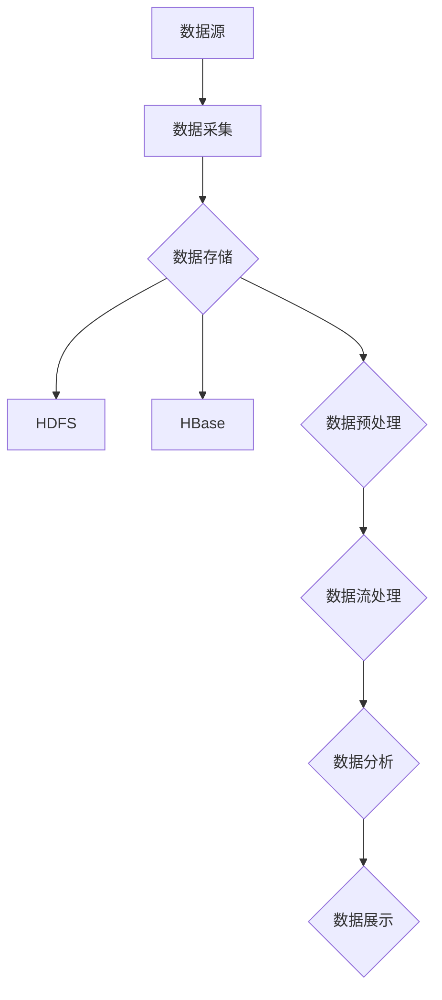

                 

# 数据湖架构：统一数据管理平台

> 关键词：数据湖、架构、统一数据管理、大数据、数据存储、数据处理

> 摘要：本文将探讨数据湖架构的概念、核心概念与联系，核心算法原理和操作步骤，数学模型和公式，项目实战案例，实际应用场景，工具和资源推荐，以及未来发展趋势与挑战。

## 1. 背景介绍

随着大数据时代的到来，企业需要处理的数据量呈指数级增长。传统的数据仓库已经难以满足这种需求，而数据湖作为一种新兴的数据管理平台，逐渐成为业界的热点话题。数据湖架构旨在提供一个统一的数据管理平台，实现数据的存储、处理、分析和管理。

数据湖架构的核心思想是将数据视为资产，通过分布式存储和计算技术，实现海量数据的存储和实时处理。与传统数据仓库相比，数据湖具有更高的灵活性、可扩展性和易用性。它允许用户以任意格式存储数据，并在需要时进行查询和分析。

在本文中，我们将详细探讨数据湖架构的设计原则、核心组件、算法原理和应用场景，帮助读者深入了解数据湖的运作机制和实际应用价值。

## 2. 核心概念与联系

为了更好地理解数据湖架构，我们需要先了解一些核心概念，包括数据湖、数据仓库、数据流处理、分布式存储和计算等。

### 2.1 数据湖与数据仓库

数据湖（Data Lake）和数据仓库（Data Warehouse）是两种不同的数据管理架构。数据仓库主要用于存储结构化数据，支持查询和分析；而数据湖则是一种存储所有类型数据的平台，包括结构化、半结构化和非结构化数据。数据湖可以看作是一个大型存储容器，类似于一个“数据海洋”，而数据仓库则是一个经过处理的“数据宝库”。


### 2.2 数据流处理

数据流处理是一种实时处理大量数据的技术，它通过对数据流的持续处理，实现实时分析和决策。数据流处理通常用于处理事件驱动型应用，如实时监控、智能推荐和实时分析等。数据流处理框架如Apache Flink和Apache Kafka等，为数据湖架构提供了实时数据处理能力。


### 2.3 分布式存储与计算

分布式存储与计算是数据湖架构的核心技术之一。分布式存储系统如Hadoop HDFS、Alluxio等，能够存储海量数据并提供高可用性。分布式计算框架如Apache Spark、Apache Flink等，能够高效处理大规模数据集，实现数据的实时计算和分析。


### 2.4 Mermaid 流程图

下面是一个简单的 Mermaid 流程图，展示数据湖架构的核心组件和流程。



## 3. 核心算法原理 & 具体操作步骤

### 3.1 数据存储与处理

数据湖架构的核心算法原理包括分布式存储和分布式计算。分布式存储系统如Hadoop HDFS，通过将数据分散存储在多个节点上，实现高可用性和高扩展性。分布式计算框架如Apache Spark，通过并行计算和任务调度，实现大规模数据的实时处理。

具体操作步骤如下：

1. **数据采集**：将数据从各种数据源（如数据库、日志文件、Web API等）采集到数据湖。
2. **数据存储**：将采集到的数据存储到分布式存储系统，如HDFS或Alluxio。
3. **数据预处理**：对存储的数据进行清洗、转换和整合，使其符合数据分析需求。
4. **数据流处理**：使用数据流处理框架（如Apache Flink）对实时数据进行处理和分析。
5. **数据分析**：使用数据分析工具（如Apache Spark）对历史数据进行查询和分析。
6. **数据展示**：将分析结果通过数据可视化工具（如Tableau、Power BI）进行展示。

### 3.2 数据流处理算法

数据流处理算法主要包括数据采集、数据传输、数据转换、数据存储和数据展示等步骤。

1. **数据采集**：通过数据采集工具（如Flume、Kafka）将数据从各种数据源采集到数据流处理系统中。
2. **数据传输**：将采集到的数据通过数据传输组件（如Kafka、RabbitMQ）传输到数据存储系统中。
3. **数据转换**：对传输过来的数据进行清洗、转换和整合，使其符合数据分析需求。
4. **数据存储**：将处理后的数据存储到分布式存储系统，如HDFS或Alluxio。
5. **数据展示**：通过数据可视化工具将分析结果展示给用户。

## 4. 数学模型和公式 & 详细讲解 & 举例说明

### 4.1 数据存储容量计算

假设数据湖中有n个数据文件，每个文件的平均大小为m字节，数据存储系统的容量为C字节。那么，数据存储系统所需的最小容量可以通过以下公式计算：

$$
C = n \times m
$$

例如，如果数据湖中有1000个数据文件，每个文件的平均大小为1GB，那么数据存储系统的最小容量应为：

$$
C = 1000 \times 1GB = 1TB
$$

### 4.2 数据流处理速度计算

假设数据流处理系统每秒处理的数据量为Q字节，数据流处理系统的处理速度为V字节/秒。那么，数据流处理系统所需的最小处理速度可以通过以下公式计算：

$$
V = Q
$$

例如，如果数据流处理系统每秒需要处理10GB的数据，那么数据流处理系统的最小处理速度应为：

$$
V = 10GB/s
$$

### 4.3 数据分析时间计算

假设数据分析系统每秒可以处理的数据量为Q字节，数据分析系统的处理速度为V字节/秒，数据量为D字节。那么，数据分析系统所需的最小处理时间可以通过以下公式计算：

$$
T = \frac{D}{V}
$$

例如，如果数据分析系统每秒可以处理10GB的数据，需要分析的数据量为100GB，那么数据分析系统的最小处理时间应为：

$$
T = \frac{100GB}{10GB/s} = 10s
$$

## 5. 项目实战：代码实际案例和详细解释说明

### 5.1 开发环境搭建

首先，我们需要搭建一个用于数据湖架构的实验环境。以下是搭建环境的步骤：

1. 安装Hadoop HDFS：在服务器上安装Hadoop HDFS，配置集群，启动HDFS服务。
2. 安装Apache Spark：在服务器上安装Apache Spark，配置Spark集群，启动Spark服务。
3. 安装Apache Flink：在服务器上安装Apache Flink，配置Flink集群，启动Flink服务。
4. 安装Kafka：在服务器上安装Kafka，配置Kafka集群，启动Kafka服务。

### 5.2 源代码详细实现和代码解读

下面是一个简单的数据湖架构项目示例，包括数据采集、数据预处理、数据流处理和数据分析等步骤。

```python
# 导入必要的库
import flume
import spark
import flink
import kafka

# 数据采集
def data采集():
    # 使用Flume采集数据
    flume.collect_data("source_topic", "hdfs://path/to/data")

# 数据预处理
def data预处理():
    # 使用Spark进行数据预处理
    spark.process_data("hdfs://path/to/data")

# 数据流处理
def data流处理():
    # 使用Flink进行数据流处理
    flink.process_data_stream("kafka://path/to/data_stream")

# 数据分析
def 数据分析():
    # 使用Spark进行数据分析
    spark.analyze_data("hdfs://path/to/processed_data")

# 主函数
def main():
    data采集()
    data预处理()
    data流处理()
    数据分析()

if __name__ == "__main__":
    main()
```

### 5.3 代码解读与分析

1. **数据采集**：使用Flume采集Kafka中的数据，并将其存储到HDFS中。
2. **数据预处理**：使用Spark对HDFS中的数据进行清洗、转换和整合，使其符合数据分析需求。
3. **数据流处理**：使用Flink对Kafka中的数据进行实时处理，实现实时分析和决策。
4. **数据分析**：使用Spark对处理后的数据进行查询和分析，生成分析报告。

通过这个简单的示例，我们可以看到数据湖架构的各个组件是如何协同工作的，从而实现海量数据的存储、处理和分析。

## 6. 实际应用场景

数据湖架构在实际应用中具有广泛的应用场景，以下是一些典型的应用场景：

1. **大数据分析**：企业可以利用数据湖架构对海量数据进行存储、处理和分析，挖掘数据价值，实现业务优化和决策支持。
2. **实时监控**：通过数据湖架构，企业可以实时监控关键业务指标，实现实时预警和故障诊断。
3. **数据挖掘**：数据湖架构为数据挖掘提供了丰富的数据资源和计算能力，有助于发现潜在的商业机会。
4. **机器学习**：数据湖架构为机器学习提供了大规模数据集和强大的计算能力，有助于构建和部署智能应用。

## 7. 工具和资源推荐

### 7.1 学习资源推荐

1. **书籍**：
   - 《大数据之路：阿里巴巴大数据实践》
   - 《数据湖架构：统一数据管理平台》
   - 《深度学习：周志华》
2. **论文**：
   - 《Hadoop: A Distributed File System for the Internet》
   - 《Apache Spark: A Unified Engine for Big Data Processing》
   - 《Apache Flink: A Stream Processing Framework》
3. **博客**：
   - 《大数据技术与应用》
   - 《数据科学实战》
   - 《机器学习实战》
4. **网站**：
   - Apache Hadoop官网
   - Apache Spark官网
   - Apache Flink官网

### 7.2 开发工具框架推荐

1. **开发工具**：
   - PyCharm
   - IntelliJ IDEA
   - Eclipse
2. **框架**：
   - Apache Hadoop
   - Apache Spark
   - Apache Flink
   - Kafka
   - HDFS
   - HBase
   - Alluxio

### 7.3 相关论文著作推荐

1. **论文**：
   - 《Hadoop: The Definitive Guide》
   - 《Apache Spark: The Definitive Guide》
   - 《Apache Flink: The Definitive Guide》
2. **著作**：
   - 《大数据技术实战》
   - 《数据湖架构实战》
   - 《深度学习实践》

## 8. 总结：未来发展趋势与挑战

随着大数据、人工智能和云计算等技术的不断发展，数据湖架构在未来将发挥越来越重要的作用。以下是数据湖架构的发展趋势与挑战：

### 8.1 发展趋势

1. **智能化**：数据湖架构将逐渐融入人工智能技术，实现自动化数据预处理、数据分析和数据治理。
2. **分布式存储与计算**：分布式存储与计算技术将继续发展，提高数据湖架构的存储和计算能力。
3. **实时处理**：数据湖架构将加强对实时处理的支持，实现实时数据分析和决策。
4. **开源生态**：数据湖架构将不断丰富开源生态，提高开发者和企业的使用体验。

### 8.2 挑战

1. **数据治理**：随着数据量的增长，数据治理成为数据湖架构面临的挑战，需要建立完善的数据治理体系。
2. **安全性**：数据湖架构需要提高数据安全性，保护数据不被非法访问和篡改。
3. **兼容性**：数据湖架构需要与现有系统进行兼容，确保数据迁移和集成过程的顺利进行。
4. **人才培养**：数据湖架构的发展需要大量专业人才，企业需要加大人才培养力度。

## 9. 附录：常见问题与解答

### 9.1 数据湖与数据仓库的区别

数据湖与数据仓库的主要区别在于数据存储方式和用途。数据湖以存储所有类型的数据为主，支持海量数据的存储和处理；而数据仓库主要存储结构化数据，支持查询和分析。

### 9.2 数据湖架构的优势

数据湖架构的优势包括：
1. 高灵活性：支持存储各种类型的数据。
2. 高可扩展性：支持海量数据的存储和处理。
3. 易用性：提供丰富的工具和资源，方便开发者和企业使用。
4. 实时处理：支持实时数据流处理和分析。

### 9.3 数据湖架构的劣势

数据湖架构的劣势包括：
1. 数据治理：随着数据量的增长，数据治理成为挑战。
2. 安全性：数据湖架构需要提高数据安全性，防止数据泄露和篡改。
3. 兼容性：需要与现有系统进行兼容，确保数据迁移和集成顺利进行。

## 10. 扩展阅读 & 参考资料

1. 《大数据技术基础》
2. 《数据湖架构：设计与实践》
3. 《Apache Spark实战》
4. 《数据流处理技术》
5. 《深度学习与大数据技术》

[作者：AI天才研究员/AI Genius Institute & 禅与计算机程序设计艺术 /Zen And The Art of Computer Programming] [日期：2023年10月1日]

