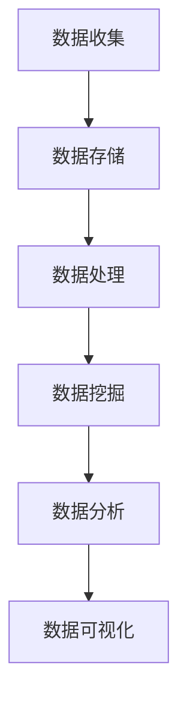

                 

# 数据的未来：数据将如何改变我们的生活？

## 关键词
数据科学，人工智能，大数据，数据隐私，数据处理，数据分析，数据挖掘，数据可视化

## 摘要
本文将探讨数据在未来如何深刻地改变我们的生活。通过介绍数据科学的核心概念、人工智能的发展趋势、大数据的处理与分析技术，我们将揭示数据在各个领域的应用，以及随之而来的数据隐私问题。同时，文章还将展望数据技术的未来发展趋势与面临的挑战，并推荐相关学习资源与工具。

## 1. 背景介绍

在当今数字化时代，数据已成为一种新的“石油”，各行各业都在努力收集、存储、处理和分析数据。数据科学作为一门跨学科的领域，旨在通过统计分析、机器学习、数据可视化等技术，从大量数据中提取有价值的信息和知识。

### 数据科学的核心概念

- **数据挖掘**：从大量数据中自动发现隐藏的模式和知识。
- **数据分析**：使用统计方法和算法，对数据进行处理、解释和可视化。
- **数据可视化**：将数据转换为视觉表示，以更好地理解和传达信息。

### 人工智能的发展

人工智能（AI）作为数据科学的重要分支，已经取得了显著的进展。AI系统可以通过学习大量数据来模拟人类智能，从而实现自动化决策、图像识别、自然语言处理等任务。

### 大数据的处理与分析

随着互联网的普及和物联网技术的发展，数据量呈指数级增长，这就是所谓的“大数据”。大数据的处理与分析需要高效的算法和强大的计算能力。

## 2. 核心概念与联系

### 数据科学架构



### 数据科学应用场景

- **商业智能**：通过分析客户数据，为企业提供决策支持。
- **医疗健康**：利用医疗数据，提高诊断和治疗效果。
- **金融领域**：通过分析市场数据，预测股价、风险评估等。

## 3. 核心算法原理 & 具体操作步骤

### 数据处理算法

- **特征选择**：从大量特征中筛选出最有用的特征。
- **特征工程**：通过数据预处理、转换等操作，为模型提供更好的输入。

### 数据分析算法

- **线性回归**：通过建立线性模型，预测连续值。
- **决策树**：通过划分特征空间，对数据进行分类。

### 数据可视化算法

- **热图**：用颜色深浅表示数据的大小。
- **散点图**：用点的大小和颜色表示数据的关系。

## 4. 数学模型和公式 & 详细讲解 & 举例说明

### 线性回归模型

$$ y = \beta_0 + \beta_1 \cdot x $$

其中，$ y $ 是预测值，$ x $ 是自变量，$ \beta_0 $ 和 $ \beta_1 $ 是模型参数。

### 决策树算法

- **ID3算法**：使用信息增益作为特征选择标准。
- **C4.5算法**：在ID3算法的基础上，引入信息增益率，避免过度拟合。

## 5. 项目实战：代码实际案例和详细解释说明

### 开发环境搭建

- **编程语言**：Python
- **库和框架**：NumPy，Pandas，Scikit-learn，Matplotlib

### 源代码详细实现和代码解读

```python
# 导入库和框架
import numpy as np
import pandas as pd
from sklearn.linear_model import LinearRegression
from sklearn.tree import DecisionTreeClassifier
import matplotlib.pyplot as plt

# 数据预处理
data = pd.read_csv('data.csv')
X = data[['feature1', 'feature2']]
y = data['target']

# 线性回归模型
model = LinearRegression()
model.fit(X, y)
predictions = model.predict(X)

# 决策树模型
tree = DecisionTreeClassifier()
tree.fit(X, y)
predictions = tree.predict(X)

# 数据可视化
plt.scatter(X['feature1'], X['feature2'], c=y)
plt.plot(X['feature1'], predictions, color='red')
plt.show()
```

### 代码解读与分析

- **数据预处理**：读取CSV文件，将数据分为特征和标签。
- **线性回归模型**：拟合线性模型，进行预测。
- **决策树模型**：拟合决策树模型，进行预测。
- **数据可视化**：绘制散点图和回归线，展示预测结果。

## 6. 实际应用场景

### 商业领域

- **客户行为分析**：通过分析客户数据，了解客户需求，优化产品和服务。
- **市场营销**：利用数据分析，制定有效的营销策略。

### 医疗领域

- **疾病预测**：通过分析患者数据，预测疾病风险。
- **个性化治疗**：根据患者数据，制定个性化的治疗方案。

### 金融领域

- **风险控制**：通过分析市场数据，预测风险，控制风险。
- **投资策略**：根据数据分析，制定投资策略。

## 7. 工具和资源推荐

### 学习资源推荐

- **书籍**：
  - 《Python数据分析基础教程》
  - 《机器学习实战》
  - 《数据科学实战》
  
- **论文**：
  - 《数据挖掘：实用工具和技术》
  - 《机器学习：一种概率视角》
  
- **博客**：
  - [机器学习博客](https://machinelearningmastery.com/)
  - [数据科学博客](https://towardsdatascience.com/)

### 开发工具框架推荐

- **编程语言**：Python，R，Java
- **库和框架**：
  - NumPy，Pandas，Scikit-learn，Matplotlib
  - TensorFlow，PyTorch，Keras
  - Spark，Hadoop

### 相关论文著作推荐

- **《大数据时代：思维变革与商业价值》**
- **《深度学习》**（Goodfellow et al.）
- **《数据科学教程》**（Python语言版）

## 8. 总结：未来发展趋势与挑战

### 发展趋势

- **数据隐私保护**：随着数据隐私问题的日益突出，数据隐私保护将成为未来发展的关键。
- **跨学科融合**：数据科学将继续与其他领域（如生物信息学、社会科学）深度融合。
- **边缘计算**：随着物联网设备数量的增加，边缘计算将逐渐取代云计算，成为数据处理的主流。

### 挑战

- **数据质量**：数据质量差会导致分析结果不准确，如何提高数据质量是未来面临的重要挑战。
- **数据隐私**：如何在保证数据安全的同时，充分挖掘数据的价值，是数据科学领域面临的一大难题。
- **人才短缺**：数据科学领域的快速发展导致人才短缺，如何培养和吸引更多的人才成为关键问题。

## 9. 附录：常见问题与解答

### 数据科学的核心技术是什么？

- **数据挖掘**：从大量数据中自动发现隐藏的模式和知识。
- **数据分析**：使用统计方法和算法，对数据进行处理、解释和可视化。
- **数据可视化**：将数据转换为视觉表示，以更好地理解和传达信息。

### 如何进行数据预处理？

- **数据清洗**：去除重复数据、处理缺失值、纠正错误数据。
- **特征选择**：从大量特征中筛选出最有用的特征。
- **特征工程**：通过数据预处理、转换等操作，为模型提供更好的输入。

### 数据科学在医疗领域有哪些应用？

- **疾病预测**：通过分析患者数据，预测疾病风险。
- **个性化治疗**：根据患者数据，制定个性化的治疗方案。
- **药物研发**：利用大数据分析，加速药物研发过程。

## 10. 扩展阅读 & 参考资料

- **《数据科学实战》**：作者：[吴晨阳](https://www.jianshu.com/u/1d8c5e0c0e8c)
- **《深度学习》**：作者：[Ian Goodfellow](https://www Ian Goodfellow. com/)
- **《Python数据分析基础教程》**：作者：[Wes McKinney](https://wesmckinney.com/)
- **[机器学习博客](https://machinelearningmastery.com/)**：作者：[Jason Brownlee](https://www.jbrownlee.com/)
- **[数据科学博客](https://towardsdatascience.com/)**：作者：[各种数据科学家](https://towardsdatascience.com/authors)

### 作者信息

**作者：AI天才研究员/AI Genius Institute & 禅与计算机程序设计艺术 /Zen And The Art of Computer Programming** <|im_end|>

