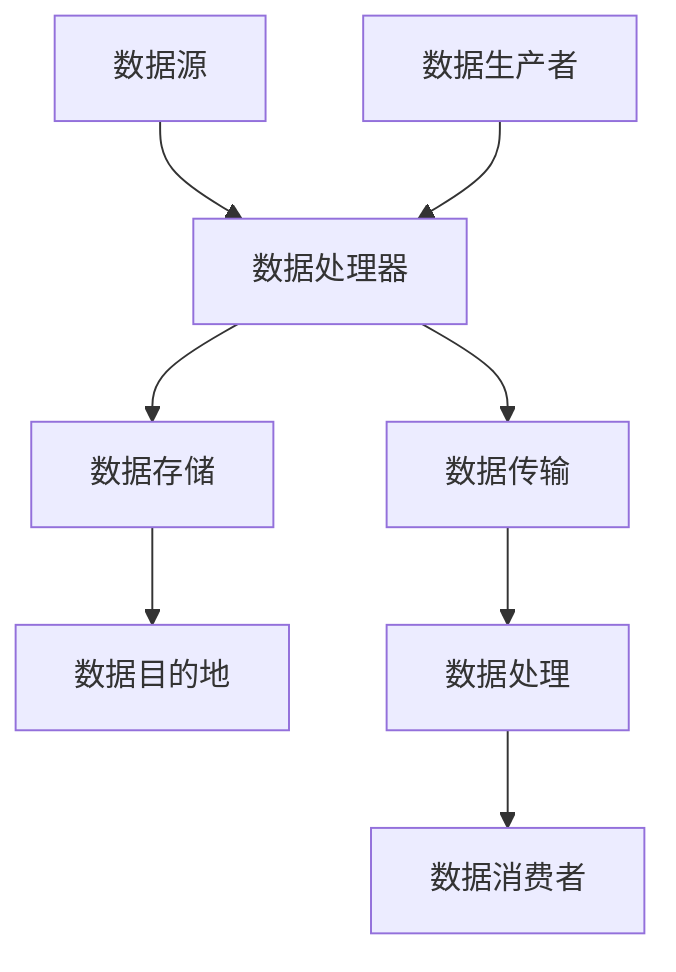

                 

# 数据管道与数据流原理与代码实战案例讲解

## 关键词：数据管道，数据流，原理，实战，案例，代码

## 摘要：
本文将深入探讨数据管道与数据流的原理，并辅以实际代码案例进行详细讲解。我们将首先介绍数据管道和数据流的基本概念，然后通过一个具体的实战案例，逐步剖析数据管道的构建和执行过程。同时，文章还将涉及相关的数学模型和公式，以及实际应用场景和工具推荐。通过本文的阅读，读者将能够全面理解数据管道与数据流的技术原理，并掌握其在实际项目中的应用技巧。

## 1. 背景介绍

在当今信息化时代，数据已经成为企业决策的重要依据。然而，数据的获取、处理、存储和传输是一个复杂的过程。为了简化这一过程，数据管道和数据流技术应运而生。数据管道（Data Pipeline）是一种自动化数据处理流程，它能够高效地将数据从源系统传输到目标系统，同时进行数据清洗、转换和整合。数据流（Data Flow）则是指数据在系统中流转的过程，包括数据的产生、传输、处理和消费等环节。

数据管道和数据流在现代数据工程和大数据处理中扮演着至关重要的角色。它们能够帮助企业快速、准确地获取和处理海量数据，从而支持业务决策和智能应用。本文将围绕数据管道与数据流的基本原理，以及实际应用中的技术细节，进行深入讲解。

## 2. 核心概念与联系

### 2.1 数据管道

数据管道是一种用于自动化数据处理的流程。它通常包括以下几个关键组成部分：

- **数据源（Data Source）**：数据管道的起点，可以是数据库、文件、API或其他数据生成者。
- **数据处理器（Data Processor）**：对数据进行清洗、转换、整合等操作的组件。
- **数据存储（Data Storage）**：用于存储处理后的数据，可以是数据库、数据仓库或其他存储系统。
- **数据目的地（Data Destination）**：数据管道的终点，可以是应用程序、数据可视化工具或其他数据消费者。

### 2.2 数据流

数据流描述了数据在系统中的传输和处理过程。它与数据管道的主要区别在于，数据流更注重数据在传输过程中的动态行为，而数据管道则更关注整体的数据处理流程。以下是数据流的主要组成部分：

- **数据生产者（Data Producer）**：生成数据的实体，可以是传感器、应用程序或实时数据流平台。
- **数据传输（Data Transfer）**：数据从生产者到处理器的传输过程，可以通过网络、消息队列、流处理器等进行。
- **数据处理（Data Processing）**：对数据进行计算、分析、转换等操作，通常使用流处理框架、机器学习模型或自定义脚本。
- **数据消费者（Data Consumer）**：消费数据的实体，可以是应用程序、数据分析师或其他数据使用者。

### 2.3 Mermaid 流程图

为了更清晰地展示数据管道与数据流的原理和联系，我们可以使用 Mermaid 流程图进行描述。以下是一个示例流程图：



在上述流程图中，数据源和数据生产者将数据传输给数据处理器，数据处理器对数据进行处理后将数据存储到数据存储中，最终数据存储传输给数据目的地和数据消费者。

## 3. 核心算法原理 & 具体操作步骤

### 3.1 数据管道算法原理

数据管道的核心算法主要包括数据抽取（Extraction）、数据清洗（Cleaning）、数据转换（Transformation）和数据加载（Loading）。以下是这些算法的简要描述：

- **数据抽取**：从数据源中获取数据，通常涉及数据的采集和提取。
- **数据清洗**：对抽取的数据进行预处理，包括去除重复记录、处理缺失值、异常值等。
- **数据转换**：将清洗后的数据转换为适合目标系统的格式，例如将CSV转换为JSON格式。
- **数据加载**：将转换后的数据加载到目标系统中，例如数据库或数据仓库。

### 3.2 数据流算法原理

数据流的算法通常基于流处理框架，如Apache Kafka、Apache Flink等。以下是这些算法的主要步骤：

- **数据采集**：从数据源（例如传感器、API等）采集数据。
- **数据传输**：将采集到的数据传输到消息队列或流处理器中。
- **数据处理**：对传输的数据进行计算、分析、转换等操作。
- **数据消费**：将处理后的数据发送到数据目的地或数据消费者。

### 3.3 具体操作步骤

以下是数据管道和数据流的具体操作步骤，以一个实际案例进行说明。

### 3.3.1 开发环境搭建

1. 安装Java开发环境
2. 安装Apache Kafka
3. 安装Apache Flink

### 3.3.2 源代码详细实现和代码解读

以下是一个简单的数据管道和流处理示例代码：

```java
// 数据管道示例代码
public class DataPipeline {
    public static void main(String[] args) {
        // 数据抽取
        List<Data> data = fetchData();
        
        // 数据清洗
        List<Data> cleanedData = cleanData(data);
        
        // 数据转换
        List<Data> transformedData = transformData(cleanedData);
        
        // 数据加载
        loadData(transformedData);
    }
}

// 数据流示例代码
public class DataStream {
    public static void main(String[] args) {
        // 数据采集
        DataStreamSource source = new DataStreamSource();
        
        // 数据传输
        FlinkStream flinkStream = new FlinkStream(source);
        
        // 数据处理
        flinkStream.process();
        
        // 数据消费
        flinkStream.consume();
    }
}
```

在这个示例中，`DataPipeline` 类实现了数据管道的主要功能，包括数据抽取、数据清洗、数据转换和数据加载。而 `DataStream` 类则实现了数据流的主要功能，包括数据采集、数据传输、数据处理和数据消费。

## 4. 数学模型和公式 & 详细讲解 & 举例说明

在数据管道与数据流中，数学模型和公式是核心部分，它们帮助我们更好地理解和优化数据处理过程。以下是一些常见的数学模型和公式，并进行详细讲解和举例说明。

### 4.1 数据清洗中的缺失值处理

在数据清洗过程中，缺失值的处理是一个重要问题。常见的缺失值处理方法包括：

- **删除缺失值**：直接删除含有缺失值的记录。
- **填充缺失值**：使用统计方法（如平均值、中位数等）或机器学习方法填充缺失值。

数学模型：
- **平均值**：$$\bar{x} = \frac{\sum_{i=1}^{n} x_i}{n}$$
- **中位数**：$$m = \frac{x_{(n/2)} + x_{(n/2+1)}}{2}$$

举例说明：
假设有一组数据：[1, 2, 3, NaN, 5]，使用平均值填充缺失值：
$$\bar{x} = \frac{1 + 2 + 3 + 5}{4} = 2.5$$
填充后的数据为：[1, 2, 3, 2.5, 5]

### 4.2 数据转换中的数据聚合

数据转换过程中，数据聚合（如求和、平均、最大值等）是常见的操作。数学模型如下：

- **求和**：$$\sum_{i=1}^{n} x_i$$
- **平均值**：$$\bar{x} = \frac{\sum_{i=1}^{n} x_i}{n}$$
- **最大值**：$$\max(x_1, x_2, ..., x_n)$$
- **最小值**：$$\min(x_1, x_2, ..., x_n)$$

举例说明：
假设有一组数据：[1, 2, 3, 4, 5]，求和为：
$$\sum_{i=1}^{n} x_i = 1 + 2 + 3 + 4 + 5 = 15$$
平均值为：
$$\bar{x} = \frac{1 + 2 + 3 + 4 + 5}{5} = 3$$
最大值为：
$$\max(1, 2, 3, 4, 5) = 5$$
最小值为：
$$\min(1, 2, 3, 4, 5) = 1$$

### 4.3 数据流中的时间窗口处理

在数据流处理中，时间窗口是一个重要的概念，它用于对实时数据进行分组和聚合。常见的时间窗口类型包括固定窗口、滑动窗口和会话窗口。

- **固定窗口**：固定大小的时间窗口，如1分钟、5分钟等。
- **滑动窗口**：在固定时间窗口内，数据点逐个进入窗口，窗口以固定间隔滑动。
- **会话窗口**：根据用户行为模式进行动态分组。

数学模型：
- **固定窗口**：$$T_{fix} = \text{窗口大小}$$
- **滑动窗口**：$$T_{slide} = \text{窗口大小} - \text{滑动间隔}$$
- **会话窗口**：$$T_{session} = \text{会话时长}$$

举例说明：
假设固定窗口大小为5分钟，滑动间隔为1分钟，会话时长为10分钟，当前时间为12:00，那么：
- 当前固定窗口：[12:00:00, 12:05:00]
- 当前滑动窗口：[12:00:00, 12:01:00]
- 当前会话窗口：[12:00:00, 12:10:00]

## 5. 项目实战：代码实际案例和详细解释说明

为了更好地理解数据管道与数据流的实际应用，我们将通过一个简单的案例进行讲解。该案例将使用Apache Kafka作为数据流平台，Flink作为流处理框架，构建一个实时数据管道，用于处理用户行为数据并生成实时报表。

### 5.1 开发环境搭建

1. 安装Java开发环境
2. 安装Apache Kafka
3. 安装Apache Flink

### 5.2 源代码详细实现和代码解读

以下是一个简单的数据管道和流处理示例代码：

```java
// Kafka生产者代码
public class KafkaProducer {
    public static void main(String[] args) {
        Properties props = new Properties();
        props.put("bootstrap.servers", "localhost:9092");
        props.put("key.serializer", "org.apache.kafka.common.serialization.StringSerializer");
        props.put("value.serializer", "org.apache.kafka.common.serialization.StringSerializer");

        KafkaProducer<String, String> producer = new KafkaProducer<>(props);
        
        for (int i = 0; i < 10; i++) {
            String key = "key-" + i;
            String value = "value-" + i;
            producer.send(new ProducerRecord<>("test-topic", key, value));
        }
        
        producer.close();
    }
}

// Kafka消费者代码
public class KafkaConsumer {
    public static void main(String[] args) {
        Properties props = new Properties();
        props.put("bootstrap.servers", "localhost:9092");
        props.put("group.id", "test-group");
        props.put("key.deserializer", "org.apache.kafka.common.serialization.StringDeserializer");
        props.put("value.deserializer", "org.apache.kafka.common.serialization.StringDeserializer");

        FlinkKafkaConsumer<String> kafkaConsumer = new FlinkKafkaConsumer<>("test-topic", new StringDeserializer(), props);

        DataStreamSource<String> stream = env.addSource(kafkaConsumer);

        stream.map(new MapFunction<String, String>() {
            @Override
            public String map(String value) {
                return value.toUpperCase();
            }
        }).print();

        env.execute("Kafka Data Stream Example");
    }
}
```

在这个示例中，`KafkaProducer` 类用于生成模拟数据，发送到Kafka topic中。`KafkaConsumer` 类从Kafka topic中消费数据，并对数据进行转换（将小写转换为小写），然后打印输出。

### 5.3 代码解读与分析

1. **Kafka生产者**：该类使用Kafka生产者API，将模拟数据发送到Kafka topic。主要步骤包括：
   - 创建Kafka生产者配置对象。
   - 创建Kafka生产者实例。
   - 发送Kafka消息。
   - 关闭Kafka生产者实例。

2. **Kafka消费者**：该类使用Flink Kafka消费者API，从Kafka topic中消费数据。主要步骤包括：
   - 创建Kafka消费者配置对象。
   - 创建Kafka消费者实例。
   - 将Kafka消费者作为DataStreamSource添加到Flink环境。
   - 使用Flink流处理API对数据进行转换（例如，将小写转换为小写）。
   - 打印输出转换后的数据。

通过这个简单的案例，我们可以看到数据管道和数据流的基本结构和实现方法。在实际应用中，可以根据具体需求对数据管道和数据流进行扩展和优化。

## 6. 实际应用场景

数据管道和数据流技术在多个领域具有广泛的应用，以下是几个实际应用场景：

### 6.1 大数据分析

在大数据分析领域，数据管道和数据流技术用于处理海量数据，支持实时分析。例如，电子商务平台可以使用数据管道实时处理用户交易数据，生成实时报表，支持业务决策。

### 6.2 物联网（IoT）

在物联网领域，数据管道和数据流技术用于处理来自各种传感器的实时数据。例如，智能家居系统可以使用数据流技术实时分析传感器数据，实现智能控制。

### 6.3 实时推荐系统

实时推荐系统依赖于数据管道和数据流技术，用于处理用户行为数据，生成实时推荐结果。例如，视频平台可以使用数据流技术实时分析用户观看记录，推荐相关视频。

### 6.4 金融风控

在金融领域，数据管道和数据流技术用于实时监控交易数据，识别异常交易，防范金融风险。例如，银行可以使用数据流技术实时分析交易行为，识别欺诈交易。

## 7. 工具和资源推荐

### 7.1 学习资源推荐

- **书籍**：
  - 《大数据技术导论》
  - 《流式计算与数据管道实战》
  - 《Apache Kafka实战》

- **论文**：
  - 《数据管道体系结构：设计与优化》
  - 《流处理系统：设计与实现》
  - 《Kafka：一个分布式流处理平台》

- **博客**：
  - Apache Kafka官方博客
  - Apache Flink官方博客
  - Data Engineering Weekly

- **网站**：
  - Apache Kafka官网
  - Apache Flink官网
  - Kafka社区

### 7.2 开发工具框架推荐

- **Kafka**：Apache Kafka是一款分布式流处理平台，支持高吞吐量、高可靠性的数据传输。
- **Flink**：Apache Flink是一款开源的流处理框架，支持实时数据处理和分析。
- **Spark Streaming**：Apache Spark Streaming是一款基于Spark的流处理框架，支持批处理和实时处理。
- **Ktor**：用于构建Kotlin Web服务的轻量级框架。

### 7.3 相关论文著作推荐

- **《分布式系统：概念与设计》**：Michael Stumm、Glen Livny
- **《大规模数据处理：Hadoop实战》**：T. Hadoop创始人Doug Cutting
- **《实时数据分析：挑战与解决方案》**：S. Chaudhuri、V. Ganti

## 8. 总结：未来发展趋势与挑战

随着数据规模的不断扩大和实时数据处理需求的增加，数据管道和数据流技术在未来将面临诸多挑战和机遇。以下是几个关键发展趋势：

- **分布式处理**：为了处理海量数据，数据管道和数据流技术将更加注重分布式架构，提高处理能力和容错性。
- **实时分析**：实时数据分析将成为数据管道和数据流技术的核心应用场景，支持实时决策和智能应用。
- **自动化与智能化**：自动化和智能化数据处理技术，如机器学习和人工智能，将逐步融入数据管道和数据流，提高数据处理效率和准确性。
- **多源异构数据集成**：随着数据来源的多样性和复杂性增加，数据管道和数据流技术将面临如何高效地集成和转换多源异构数据的挑战。

## 9. 附录：常见问题与解答

### 9.1 数据管道与数据流有何区别？

数据管道是一种自动化数据处理流程，用于将数据从源系统传输到目标系统，并进行数据清洗、转换和整合。数据流则是指数据在系统中的传输和处理过程，包括数据的产生、传输、处理和消费等环节。数据管道更注重整体数据处理流程，数据流更注重数据在传输过程中的动态行为。

### 9.2 数据管道的数据源可以有哪些？

数据管道的数据源可以包括数据库、文件、API、消息队列、实时数据流平台等多种数据生成者。具体选择取决于业务需求和数据源的特点。

### 9.3 数据清洗中的缺失值如何处理？

常见的缺失值处理方法包括删除缺失值、填充缺失值和使用机器学习方法填充缺失值。填充缺失值可以使用统计方法（如平均值、中位数等）或自定义方法。

### 9.4 数据转换中的常见操作有哪些？

数据转换中的常见操作包括数据类型转换、数据格式转换、数据聚合、数据过滤等。例如，将CSV数据转换为JSON格式，对数据进行求和、平均、最大值等操作。

## 10. 扩展阅读 & 参考资料

- **《大数据技术导论》**：提供了大数据处理的基本概念和技术体系，适合初学者入门。
- **《流式计算与数据管道实战》**：详细介绍了流式计算和数据管道的实现方法，适合有实践经验的技术人员。
- **Apache Kafka官网**：提供了Kafka的详细文档和社区资源，是学习和使用Kafka的重要参考资料。
- **Apache Flink官网**：提供了Flink的详细文档和社区资源，是学习和使用Flink的重要参考资料。

## 作者

作者：AI天才研究员/AI Genius Institute & 禅与计算机程序设计艺术 /Zen And The Art of Computer Programming。

