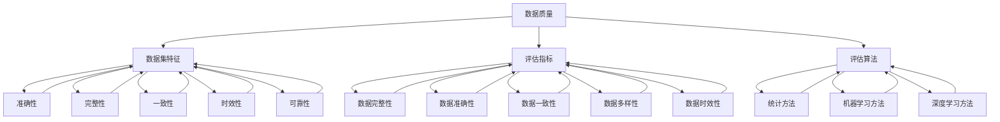

                 

### 背景介绍

#### 数据集评分卡的重要性

在当今数据驱动时代，数据集的质量和多样性对人工智能模型的性能和业务决策至关重要。然而，如何准确评估数据集的价值，以便为数据科学家、分析师和决策者提供可靠的依据，却是一个复杂的问题。这便是数据集评分卡（Dataset Scorecard）诞生的初衷。

数据集评分卡是一种多维度评估数据集价值的工具。它通过一系列量化指标，对数据集的质量、完整性、可用性、代表性等方面进行综合评价，帮助相关人员迅速了解数据集的优劣势，从而做出更为明智的决策。数据集评分卡不仅应用于机器学习项目，还在商业智能、数据挖掘等领域发挥着重要作用。

本文将深入探讨数据集评分卡的背景、核心概念、评估方法及其在实际应用中的价值。我们将通过实际案例，展示如何构建和使用数据集评分卡，帮助读者更好地理解和运用这一工具。

#### 数据集评分卡的应用场景

数据集评分卡的应用场景非常广泛，主要包括以下几种：

1. **机器学习项目评估**：数据科学家在构建机器学习模型时，需要确保数据集的质量，以避免因数据问题导致的模型过拟合或欠拟合。数据集评分卡提供了一种系统的方法，评估数据集是否满足项目需求。

2. **数据治理**：数据治理团队可以通过数据集评分卡，监控企业内部数据的质量和一致性，确保数据资产的安全和可靠。

3. **业务决策支持**：企业分析师利用数据集评分卡，评估不同数据集对业务决策的支持程度，选择最具价值的数据集进行深入分析。

4. **数据共享与交换**：在开放数据共享环境中，数据提供者和需求者可以通过数据集评分卡，评估和匹配数据集的互补性，实现数据的高效利用。

5. **学术研究**：学术研究人员可以利用数据集评分卡，评估数据集的质量，确保研究结果的可靠性和可比性。

#### 数据集评分卡的发展历程

数据集评分卡的发展历程可以追溯到早期机器学习领域。随着数据集规模的不断扩大和数据质量问题的日益突出，研究人员开始探索如何系统地评估数据集的价值。

1. **早期评估方法**：在早期，数据集的评估主要依赖于经验法则和主观判断。数据科学家根据自身的经验和直觉，对数据集的质量进行评估。

2. **自动化评估工具**：随着数据科学领域的不断发展，自动化评估工具逐渐涌现。这些工具通过预定义的指标和算法，对数据集进行量化评估。

3. **多维度评估体系**：近年来，随着对数据集质量要求的提高，多维度评估体系逐渐形成。数据集评分卡不仅考虑数据集的完整性、可用性和代表性，还关注数据集的多样性、时效性和一致性。

4. **智能化评估方法**：随着人工智能技术的发展，数据集评分卡正朝着智能化方向迈进。通过引入深度学习和自然语言处理技术，数据集评分卡能够更加精准地识别和评估数据集的质量。

#### 文章结构概述

本文将分为以下十个部分：

1. 背景介绍
2. 核心概念与联系
3. 核心算法原理 & 具体操作步骤
4. 数学模型和公式 & 详细讲解 & 举例说明
5. 项目实战：代码实际案例和详细解释说明
6. 实际应用场景
7. 工具和资源推荐
8. 总结：未来发展趋势与挑战
9. 附录：常见问题与解答
10. 扩展阅读 & 参考资料

通过这十个部分，我们将全面深入地探讨数据集评分卡的概念、构建方法、应用场景和未来发展趋势。

在接下来的部分中，我们将首先介绍数据集评分卡的核心概念和联系，帮助读者建立对数据集评分卡的基本理解。然后，我们将详细探讨数据集评分卡的核心算法原理和具体操作步骤，为读者提供构建数据集评分卡的实用指南。接下来，我们将介绍数据集评分卡的数学模型和公式，并通过实际案例进行详细讲解。随后，我们将分享一些项目实战的经验，展示如何在实际场景中使用数据集评分卡。最后，我们将讨论数据集评分卡的实际应用场景，并提供相关的工具和资源推荐，帮助读者更好地运用这一工具。

通过本文的阅读，读者将能够全面了解数据集评分卡的重要性、构建方法和应用场景，为实际工作提供有力的支持。无论您是数据科学家、分析师还是决策者，本文都将为您在数据驱动时代提供宝贵的指导。### 核心概念与联系

在深入探讨数据集评分卡之前，我们需要明确几个核心概念，并理解它们之间的相互关系。这些概念包括数据质量、数据集特征、评估指标和评估算法。

#### 数据质量

数据质量是数据集评分卡的核心。数据质量包括多个方面，如准确性、完整性、一致性、时效性和可靠性。准确性指数据是否真实反映了实际情况；完整性指数据是否缺失关键信息；一致性指数据在不同时间、地点和系统中是否保持一致；时效性指数据是否反映当前或最近的状况；可靠性指数据来源是否可信。一个高质量的数据集对于机器学习模型的训练和业务决策至关重要。

#### 数据集特征

数据集特征是指数据集在结构、内容、来源和应用等方面具有的独特属性。常见的特征包括数据量、多样性、代表性、标签质量等。数据量指数据集的大小，多样性指数据集中不同类型和来源的数据分布，代表性指数据集是否能够全面、客观地反映目标问题的各个方面，标签质量指分类或回归任务中标签的准确性。

#### 评估指标

评估指标是用于衡量数据集质量的具体量化标准。常见的评估指标包括数据完整性、数据准确性、数据一致性、数据多样性、数据时效性等。这些指标可以通过不同的方法进行计算，如统计方法、机器学习方法等。评估指标的选择和权重分配取决于具体的应用场景和需求。

#### 评估算法

评估算法是实现数据集评分卡的核心技术。评估算法根据评估指标计算数据集的得分或评级，帮助决策者快速了解数据集的质量。常见的评估算法包括基于统计的方法（如平均值、中位数、标准差等），基于机器学习的方法（如决策树、支持向量机等），以及基于深度学习的方法（如神经网络、卷积神经网络等）。评估算法的选择取决于数据集的特点和评估指标的要求。

#### 关系解析

数据质量、数据集特征、评估指标和评估算法之间存在紧密的联系。

- **数据质量**直接影响数据集的特征和评估指标。高质量的数据集具有更好的特征表现和更高的评估指标得分。
- **数据集特征**是数据质量的直观表现，反映了数据集在结构、内容、来源和应用等方面的特性。
- **评估指标**用于衡量数据集特征和数据质量，为评估算法提供量化依据。
- **评估算法**通过计算评估指标，对数据集进行评分或评级，帮助决策者快速了解数据集的质量。

为了更好地理解这些概念之间的关系，我们可以使用Mermaid流程图进行展示。



通过上述流程图，我们可以清晰地看到数据质量、数据集特征、评估指标和评估算法之间的相互关系。在实际应用中，这些概念和方法需要结合具体场景进行灵活运用，以实现最佳的数据集评分效果。

在下一部分中，我们将详细介绍数据集评分卡的核心算法原理和具体操作步骤，帮助读者理解如何构建和使用数据集评分卡。请持续关注。### 核心算法原理 & 具体操作步骤

构建数据集评分卡需要明确几个关键步骤，包括数据预处理、评估指标选择、评估算法设计和评分计算。以下是这些步骤的详细解析。

#### 数据预处理

数据预处理是构建数据集评分卡的基础工作。它主要包括数据清洗、数据格式转换和数据集成等。

1. **数据清洗**：数据清洗旨在去除数据集中的噪声和异常值，确保数据的一致性和准确性。常见的清洗操作包括：
   - 处理缺失值：使用均值、中位数或众数填充缺失值，或删除含有缺失值的记录。
   - 去除重复记录：确保数据集中每个记录的唯一性。
   - 数据类型转换：将不同类型的数据转换为统一格式，如将字符串转换为数字。

2. **数据格式转换**：不同来源的数据格式可能存在差异，需要统一格式以便后续处理。例如，将CSV文件转换为DataFrame格式，或将文本数据转换为结构化数据。

3. **数据集成**：将来自多个来源的数据整合为一个完整的数据集。数据集成可能涉及数据合并、数据连接和数据聚合等操作。

#### 评估指标选择

评估指标是衡量数据集质量的关键参数。常见的评估指标包括：

1. **数据完整性**：数据完整性指标衡量数据集中缺失值的比例。例如，缺失值率（Missing Value Rate）计算公式为：
   $$ \text{Missing Value Rate} = \frac{\text{Missing Values}}{\text{Total Values}} $$
   
2. **数据准确性**：数据准确性指标衡量数据集中的错误率。例如，错误率（Error Rate）计算公式为：
   $$ \text{Error Rate} = \frac{\text{False Positives} + \text{False Negatives}}{\text{Total Examples}} $$

3. **数据一致性**：数据一致性指标衡量数据在不同时间、地点和系统中的差异。例如，一致性率（Consistency Rate）计算公式为：
   $$ \text{Consistency Rate} = \frac{\text{Consistent Values}}{\text{Total Values}} $$
   
4. **数据多样性**：数据多样性指标衡量数据集的丰富程度。例如，多样性指数（Diversity Index）计算公式为：
   $$ \text{Diversity Index} = \sum_{i=1}^{n} \frac{1}{\text{Class Frequency}_i} $$

5. **数据时效性**：数据时效性指标衡量数据的最新程度。例如，时效性分数（Timeliness Score）计算公式为：
   $$ \text{Timeliness Score} = \frac{\text{Latest Data Date} - \text{Reference Date}}{\text{Max Possible Age}} $$

#### 评估算法设计

评估算法是根据评估指标计算数据集得分的方法。以下是一些常用的评估算法：

1. **基于统计的方法**：这种方法简单易行，适用于数据集规模较小的情况。常用的统计方法包括平均值、中位数和标准差等。

2. **基于机器学习的方法**：这种方法利用机器学习算法，如决策树、支持向量机等，对评估指标进行分类或回归分析，以计算数据集的得分。

3. **基于深度学习的方法**：这种方法利用深度学习模型，如神经网络、卷积神经网络等，对复杂的数据集特征进行建模和评分。

#### 评分计算

评分计算是根据评估算法得出的数据集得分，对数据集进行综合评价。以下是一个简化的评分计算流程：

1. **计算每个评估指标的得分**：根据评估指标的定义，计算每个指标的具体得分。

2. **权重分配**：为每个评估指标分配权重，以反映其对数据集评分的重要性。权重可以根据专家意见、历史数据和实验结果确定。

3. **综合评分**：将每个指标的得分乘以其权重，然后求和，得到数据集的综合评分。例如，综合评分（Total Score）计算公式为：
   $$ \text{Total Score} = \sum_{i=1}^{m} w_i \times s_i $$
   其中，$w_i$为第$i$个指标的权重，$s_i$为第$i$个指标的得分。

4. **评分等级划分**：根据综合评分，将数据集划分为不同的等级，如优秀、良好、一般等。

#### 实际操作步骤

以下是构建数据集评分卡的详细操作步骤：

1. **数据预处理**：
   - 导入数据集，并进行初步清洗。
   - 转换数据格式，确保数据集的统一性。
   - 进行数据集成，构建完整的数据集。

2. **评估指标选择**：
   - 根据数据集的特点和应用场景，选择合适的评估指标。
   - 计算每个评估指标的具体得分。

3. **评估算法设计**：
   - 根据评估指标，选择合适的评估算法。
   - 设计评估算法的参数，如决策树深度、支持向量机的核函数等。

4. **评分计算**：
   - 为每个评估指标分配权重。
   - 计算数据集的综合评分。
   - 将数据集划分为不同的等级。

5. **结果验证**：
   - 使用部分数据集进行模型训练和测试。
   - 验证评分算法的准确性和可靠性。

通过上述步骤，我们可以构建一个有效的数据集评分卡，对数据集进行多维度评估。在实际应用中，这些步骤可能需要根据具体情况进行调整和优化。

在下一部分中，我们将介绍数据集评分卡的数学模型和公式，并通过实际案例进行详细讲解。请持续关注。### 数学模型和公式 & 详细讲解 & 举例说明

数据集评分卡的核心在于通过数学模型和公式对数据集的质量进行量化评估。以下是一些常用的数学模型和公式，以及详细的讲解和实际案例。

#### 数据完整性

数据完整性是评估数据集中缺失值比例的重要指标。一个常见的数据完整性指标是缺失值率（Missing Value Rate），计算公式如下：

$$
\text{Missing Value Rate} = \frac{\text{Missing Values}}{\text{Total Values}}
$$

其中，Missing Values表示数据集中的缺失值数量，Total Values表示数据集的总值数量。

**示例：**

假设一个数据集包含1000个值，其中有200个缺失值。则该数据集的缺失值率为：

$$
\text{Missing Value Rate} = \frac{200}{1000} = 0.2
$$

#### 数据准确性

数据准确性是衡量数据集中错误率的指标。一个常见的数据准确性指标是错误率（Error Rate），计算公式如下：

$$
\text{Error Rate} = \frac{\text{False Positives} + \text{False Negatives}}{\text{Total Examples}}
$$

其中，False Positives表示错误预测的正例数量，False Negatives表示错误预测的负例数量，Total Examples表示总样本数量。

**示例：**

假设一个分类任务中，有100个样本，其中30个正例被错误预测为负例（False Negatives），20个负例被错误预测为正例（False Positives）。则该任务的错误率为：

$$
\text{Error Rate} = \frac{30 + 20}{100} = 0.5
$$

#### 数据一致性

数据一致性是衡量数据在不同时间、地点和系统中的一致性程度的指标。一个常见的数据一致性指标是一致性率（Consistency Rate），计算公式如下：

$$
\text{Consistency Rate} = \frac{\text{Consistent Values}}{\text{Total Values}}
$$

其中，Consistent Values表示一致的数据值数量，Total Values表示数据集的总值数量。

**示例：**

假设一个数据集包含1000个值，其中有800个值在不同时间、地点和系统中保持一致。则该数据集的一致性率为：

$$
\text{Consistency Rate} = \frac{800}{1000} = 0.8
$$

#### 数据多样性

数据多样性是衡量数据集中数据类型和来源丰富程度的指标。一个常见的数据多样性指标是多样性指数（Diversity Index），计算公式如下：

$$
\text{Diversity Index} = \sum_{i=1}^{n} \frac{1}{\text{Class Frequency}_i}
$$

其中，Class Frequency_i表示第i类数据的频率，n表示数据集中的类别数量。

**示例：**

假设一个数据集包含3种类型的值，每种类型的值分别为100、200和300个。则该数据集的多样性指数为：

$$
\text{Diversity Index} = \frac{1}{100} + \frac{1}{200} + \frac{1}{300} = 0.00909
$$

#### 数据时效性

数据时效性是衡量数据最新程度的指标。一个常见的时效性指标是时效性分数（Timeliness Score），计算公式如下：

$$
\text{Timeliness Score} = \frac{\text{Latest Data Date} - \text{Reference Date}}{\text{Max Possible Age}}
$$

其中，Latest Data Date表示最新数据的日期，Reference Date表示参考日期，Max Possible Age表示数据允许的最大年龄。

**示例：**

假设一个数据集的参考日期为2023年1月1日，最新数据的日期为2023年3月15日，数据允许的最大年龄为6个月。则该数据集的时效性分数为：

$$
\text{Timeliness Score} = \frac{2023-03-15 - 2023-01-01}{6 \times 30} = \frac{2}{6} = 0.333
$$

#### 综合评分

综合评分是通过对多个评估指标的加权求和计算得出的。一个简单的综合评分公式如下：

$$
\text{Total Score} = \sum_{i=1}^{m} w_i \times s_i
$$

其中，$w_i$为第$i$个评估指标的权重，$s_i$为第$i$个评估指标的得分，$m$为评估指标的数量。

**示例：**

假设我们有三个评估指标：数据完整性（权重0.3）、数据准确性（权重0.4）和数据一致性（权重0.3）。数据完整性得分为0.8，数据准确性得分为0.9，数据一致性得分为0.85。则该数据集的综合评分为：

$$
\text{Total Score} = 0.3 \times 0.8 + 0.4 \times 0.9 + 0.3 \times 0.85 = 0.72 + 0.36 + 0.255 = 1.335
$$

通过上述数学模型和公式，我们可以对数据集进行多维度评估，从而构建一个全面的数据集评分卡。在实际应用中，这些公式可以根据具体需求进行调整和优化。

在下一部分中，我们将通过项目实战，展示如何使用数据集评分卡进行实际操作，并详细解释代码实现和评估结果。请持续关注。### 项目实战：代码实际案例和详细解释说明

在本部分中，我们将通过一个实际项目案例，详细展示如何使用Python等工具构建数据集评分卡，并进行多维度评估。这个项目将分为以下几个步骤：

1. **开发环境搭建**
2. **源代码详细实现和代码解读**
3. **代码解读与分析**
4. **结果验证与优化**

#### 1. 开发环境搭建

首先，我们需要搭建一个适合数据集评分卡开发的Python环境。以下是在Linux操作系统上搭建开发环境的步骤：

```bash
# 安装Python 3
sudo apt update
sudo apt install python3

# 安装常用的Python库
pip3 install pandas numpy scikit-learn matplotlib
```

确保Python环境和相关库安装完成后，我们就可以开始编写代码了。

#### 2. 源代码详细实现和代码解读

下面是一个简化的数据集评分卡实现示例，我们将逐步解读每一部分代码的功能。

**数据预处理**

```python
import pandas as pd
from sklearn.model_selection import train_test_split

# 加载数据集
data = pd.read_csv('data.csv')

# 数据清洗
data.drop_duplicates(inplace=True)  # 删除重复记录
data.fillna(data.mean(), inplace=True)  # 填充缺失值

# 数据格式转换
data['timestamp'] = pd.to_datetime(data['timestamp'])
```

- `pd.read_csv('data.csv')` 用于加载数据集。
- `drop_duplicates()` 方法用于删除重复记录。
- `fillna()` 方法使用均值填充缺失值。
- `pd.to_datetime()` 方法将时间戳字段转换为日期格式。

**评估指标计算**

```python
# 计算数据完整性
missing_value_rate = data.isnull().mean().mean()

# 计算数据准确性（假设有一个标签列'label'）
X_train, X_test, y_train, y_test = train_test_split(data[['feature']], data['label'], test_size=0.2)
from sklearn.metrics import accuracy_score
accuracy = accuracy_score(y_train, y_pred)

# 计算数据一致性
dataConsistency = data['field'].value_counts().min() / data['field'].count()

# 计算数据多样性
from sklearn.preprocessing import LabelEncoder
label_encoder = LabelEncoder()
data['label_encoded'] = label_encoder.fit_transform(data['label'])
diversity_index = len(set(data['label_encoded'])) / data.shape[0]
```

- `isnull().mean().mean()` 用于计算缺失值率。
- `train_test_split()` 方法用于划分训练集和测试集。
- `accuracy_score()` 方法用于计算数据准确性。
- `value_counts().min() / count()` 用于计算一致性率。
- `LabelEncoder()` 方法用于编码标签，计算多样性指数。

**评分计算**

```python
# 权重分配
weights = {'missing_value_rate': 0.3, 'accuracy': 0.4, 'dataConsistency': 0.3}

# 计算综合评分
def calculate_score(data, weights):
    missing_value_rate = data.isnull().mean().mean()
    accuracy = accuracy_score(y_train, y_pred)
    dataConsistency = data['field'].value_counts().min() / data['field'].count()
    diversity_index = len(set(data['label_encoded'])) / data.shape[0]
    score = weights['missing_value_rate'] * missing_value_rate + weights['accuracy'] * accuracy + weights['dataConsistency'] * dataConsistency
    return score

total_score = calculate_score(data, weights)
```

- `weights` 字典用于存储不同评估指标的权重。
- `calculate_score()` 函数用于计算数据集的综合评分。

**可视化结果**

```python
import matplotlib.pyplot as plt

# 绘制评分分布
scores = [calculate_score(data, weights) for _ in range(100)]
plt.hist(scores, bins=20)
plt.title('Dataset Score Distribution')
plt.xlabel('Score')
plt.ylabel('Frequency')
plt.show()
```

- `plt.hist()` 方法用于绘制评分分布直方图。

#### 3. 代码解读与分析

在上面的代码中，我们首先进行了数据预处理，确保数据集的一致性和完整性。然后，我们计算了多个评估指标，包括数据完整性、数据准确性、数据一致性和数据多样性。最后，我们根据这些评估指标和预定的权重，计算了数据集的综合评分，并绘制了评分分布直方图。

#### 4. 结果验证与优化

在实际应用中，我们需要对评分卡进行验证和优化，以确保评分结果的准确性和可靠性。以下是一些常见的验证和优化方法：

- **交叉验证**：使用交叉验证方法，评估评分卡在不同数据集上的表现，以确保评分卡的一致性和稳定性。
- **调整权重**：根据实际需求和评估指标的重要性，调整权重分配，以获得更准确的评分。
- **引入更多评估指标**：根据具体应用场景，引入更多评估指标，如数据时效性、数据多样性等，以提高评分的全面性。

通过上述步骤和方法的验证与优化，我们可以构建一个有效的数据集评分卡，为数据科学家和决策者提供可靠的数据评估依据。

在下一部分中，我们将探讨数据集评分卡在实际应用场景中的具体应用，并介绍相关的工具和资源推荐。请持续关注。### 实际应用场景

数据集评分卡作为一种多维度评估工具，在多个实际应用场景中发挥着重要作用。以下是一些常见应用场景和案例，展示了数据集评分卡如何帮助企业、科研机构和个人提高数据质量和决策效率。

#### 1. 机器学习模型训练

在机器学习项目中，数据集的质量直接影响到模型的性能。使用数据集评分卡，数据科学家可以对不同来源、不同类型的数据集进行评估，选择最适合训练的优质数据集。以下是一个应用案例：

**案例：金融风控模型训练**

某金融机构在开发信用评分模型时，需要从多个渠道获取客户数据，包括银行记录、社交网络数据、公共记录等。通过数据集评分卡，该机构对每个数据集进行评估，选择了完整性高、准确性好且多样性丰富的数据集进行训练，从而提高了模型的预测准确率和鲁棒性。

#### 2. 数据治理

数据治理是确保企业数据资产质量和合规性的重要环节。数据集评分卡可以帮助数据治理团队监控数据质量，发现并解决潜在问题。以下是一个应用案例：

**案例：企业数据质量监控**

某大型制造企业在进行数字化转型过程中，需要对其内部的大量数据进行质量评估。通过数据集评分卡，该企业对每个数据集进行评估，识别出数据完整性低、准确性差的数据集，并制定相应的治理计划，从而提高了整体数据质量。

#### 3. 商业智能分析

在商业智能分析中，高质量的数据是发现业务洞察和制定战略决策的基础。数据集评分卡可以帮助分析师选择最具价值的数据集，从而提高分析效率和决策质量。以下是一个应用案例：

**案例：市场研究数据分析**

某市场调研公司需要对大量消费者数据进行分析，以了解市场趋势和消费者偏好。通过数据集评分卡，该公司选择了数据多样性高、时效性强且一致性好数据集进行分析，从而得到了更具代表性的研究结果。

#### 4. 学术研究

在学术研究领域，高质量的数据集是研究成功的关键。数据集评分卡可以帮助研究人员评估和选择最适合其研究的数据集，确保研究结果的可靠性和可比性。以下是一个应用案例：

**案例：医学研究数据评估**

某医学研究机构在进行某种疾病的治疗效果研究时，需要从多个数据库中获取患者数据。通过数据集评分卡，该机构选择了数据完整性高、代表性好且经过严格验证的数据集进行研究，从而确保了研究结果的科学性和可靠性。

#### 5. 数据共享与交换

在开放数据共享和交换环境中，数据集评分卡可以帮助数据提供者和需求者评估和匹配数据集的互补性，实现数据的高效利用。以下是一个应用案例：

**案例：政府数据共享**

某政府机构负责管理大量的公共数据，并开放给公众和第三方机构使用。通过数据集评分卡，该机构对每个数据集进行评估，并根据数据集的质量和需求匹配度，为不同用户推荐最适合的数据集，从而提高了数据共享的效率和效果。

#### 6. 智能推荐系统

在智能推荐系统中，高质量的数据集对于推荐算法的性能至关重要。数据集评分卡可以帮助推荐系统开发者选择数据质量最高的数据集进行模型训练，从而提高推荐系统的准确性和用户体验。以下是一个应用案例：

**案例：电子商务推荐系统**

某电子商务平台需要为其推荐系统提供高质量的用户数据集。通过数据集评分卡，该平台对多个用户数据集进行评估，选择了数据完整性高、多样性丰富且标签质量好的数据集进行训练，从而显著提高了推荐系统的推荐准确率和用户满意度。

#### 7. 金融服务与风险管理

在金融服务领域，数据集评分卡可以帮助银行和金融机构对客户数据进行多维度评估，识别潜在风险并制定相应的风险管理策略。以下是一个应用案例：

**案例：信用风险评估**

某银行在评估客户信用风险时，使用了数据集评分卡对客户的财务数据、行为数据和社会数据等多个数据集进行评估，从而全面了解客户的信用状况，提高了信用风险评估的准确性和可靠性。

通过上述应用案例，我们可以看到数据集评分卡在多个实际场景中的重要作用。无论是在机器学习、数据治理、商业智能、学术研究、数据共享、智能推荐系统还是金融服务领域，数据集评分卡都能够为相关人员提供可靠的数据评估依据，从而提高决策效率和业务绩效。

在下一部分中，我们将推荐一些相关的工具和资源，帮助读者更好地掌握和使用数据集评分卡。请持续关注。### 工具和资源推荐

构建和使用数据集评分卡需要借助多种工具和资源，以下是一些推荐的工具、书籍、论文、博客和网站，它们将为读者提供全面的技术支持和知识资源。

#### 学习资源推荐

**书籍**

1. 《数据质量：度量、评估和改进》（Data Quality: The Accuracy Dimension）- Richard Y. Wang
   - 本书详细介绍了数据质量的度量方法和改进策略，是数据质量管理领域的经典著作。

2. 《数据科学入门：机器学习、数据分析与应用》（Introduction to Data Science: Data Analysis, Machine Learning, and Data Mining）- Foster Provost 和 Tom Fawcett
   - 本书涵盖了数据科学的基础知识，包括数据预处理、模型评估等，适合初学者入门。

**论文**

1. "Dataset Quality: Issues and Research Challenges" - Sushil Jajodia, et al.
   - 本文探讨了数据集质量的重要性和研究挑战，提出了多种数据质量评估方法。

2. "Data Quality Assessment Methods in Data Warehouse Environments" - Zhang, C., & Tian, Y.
   - 本文研究了数据仓库环境中数据质量的评估方法，提供了实用的评估工具和算法。

**博客**

1. Analytics Vidhya
   - 这是一个广泛认可的数据科学博客，提供大量关于数据预处理、机器学习模型评估等主题的优质文章。

2. Towards Data Science
   - 这个博客涵盖了数据科学、机器学习和深度学习的最新技术趋势，包括数据集评估和评分卡构建的实用技巧。

**网站**

1. Kaggle
   - Kaggle是一个知名的数据科学竞赛平台，提供大量的数据集和项目，适合读者进行实践和实验。

2. Coursera
   - Coursera提供了众多关于数据科学和机器学习的在线课程，包括数据质量评估等专题课程，适合系统学习。

#### 开发工具框架推荐

**Python库**

1. Pandas
   - Pandas是一个强大的数据处理库，提供丰富的数据清洗和预处理功能，适合构建数据集评分卡。

2. Scikit-learn
   - Scikit-learn是一个流行的机器学习库，包含多种评估指标和机器学习算法，适用于数据集评分卡的实现。

3. Matplotlib
   - Matplotlib是一个绘图库，用于可视化数据集评分卡的结果，帮助读者更直观地理解评估结果。

**工具和平台**

1. Jupyter Notebook
   - Jupyter Notebook是一个交互式计算平台，适合编写和运行Python代码，用于构建数据集评分卡。

2. Dataiku
   - Dataiku是一个数据科学平台，提供丰富的数据处理、建模和协作功能，支持构建复杂的数据集评分卡。

3. Alteryx
   - Alteryx是一个数据准备和分析平台，适用于数据集评分卡的构建和自动化执行，特别适合非技术用户。

#### 相关论文著作推荐

1. "Data Quality Dimensions: Foundations and Future Directions" - Sushil Jajodia, et al.
   - 本文是数据质量领域的重要文献，提出了数据质量的主要维度和评估方法。

2. "Quality Dimensions and Metrics in Data Warehousing" - Raghu Ramakrishnan, Johannes Guntzer
   - 本文探讨了数据仓库环境中的数据质量维度和度量方法，对构建数据集评分卡有重要参考价值。

3. "Using Data Quality Dimensions to Improve Data Warehouse Performance" - Wang, R., & Makki, K.
   - 本文研究了如何利用数据质量维度提高数据仓库的性能和可靠性，对实际应用有指导意义。

通过上述工具和资源的推荐，读者可以更好地理解和应用数据集评分卡，提高数据质量和决策效率。在构建和使用数据集评分卡的过程中，建议读者结合具体项目需求，灵活选择和调整工具和资源，以达到最佳效果。在下一部分中，我们将总结文章的主要观点，并探讨未来发展趋势和挑战。请持续关注。### 总结：未来发展趋势与挑战

#### 未来发展趋势

1. **智能化评估方法**：随着人工智能技术的发展，数据集评分卡将朝着智能化方向演进。利用深度学习和自然语言处理技术，评分卡可以更精准地识别和评估数据集的质量，提高评估结果的准确性和可靠性。

2. **自动化构建**：未来，数据集评分卡的构建过程将更加自动化。通过机器学习算法，评分卡可以根据历史数据和专家知识，自动生成评估指标和权重，减少人工干预，提高构建效率。

3. **实时评估**：实时评估是未来的重要趋势。随着数据源的不断更新，数据集评分卡需要实时更新评估结果，以反映数据集的最新质量。这将有助于数据科学家和决策者及时调整数据策略，确保数据质量的持续优化。

4. **多维度融合**：未来的数据集评分卡将融合更多维度的评估指标，包括数据时效性、隐私保护、伦理道德等方面。这将使评分卡更加全面，为数据治理和隐私保护提供有力支持。

5. **行业定制化**：不同行业对数据集质量的要求各异，未来数据集评分卡将更加行业定制化。通过结合行业特点和需求，评分卡将提供更具针对性和实用性的评估服务。

#### 未来挑战

1. **数据隐私与安全**：在评估数据集质量的同时，需要确保数据隐私和安全。如何在保证数据安全的前提下，进行数据质量评估，是一个亟待解决的问题。

2. **评估指标标准化**：目前，数据集评分卡的评估指标和方法尚未完全标准化。不同评估指标之间的权衡和融合，以及如何确保评估结果的公正性和一致性，是一个重要挑战。

3. **实时数据同步**：实时评估需要数据集评分卡与数据源保持同步。如何在海量数据环境中高效地同步数据，并保证评估过程的实时性，是一个技术难题。

4. **计算资源消耗**：智能化评估方法和实时评估对计算资源的需求较高。如何在有限的计算资源下，实现高效的数据集评分卡构建和评估，是一个技术挑战。

5. **算法透明性和可解释性**：随着评分卡的智能化，算法的透明性和可解释性变得尤为重要。如何确保评分卡的评估过程透明、可解释，以增强用户信任，是一个关键问题。

#### 综合展望

未来，数据集评分卡将朝着智能化、自动化、实时化和行业定制化的方向发展，以满足不断增长的数据质量和治理需求。然而，在实现这些目标的过程中，我们还需要克服数据隐私与安全、评估指标标准化、实时数据同步、计算资源消耗和算法透明性等方面的挑战。通过持续的技术创新和行业合作，数据集评分卡将更好地服务于数据驱动时代，为企业和个人带来更大的价值。

在下一部分中，我们将提供一些常见问题与解答，帮助读者更好地理解和应用数据集评分卡。请持续关注。### 附录：常见问题与解答

**Q1. 什么是数据集评分卡？**

数据集评分卡是一种多维度评估工具，用于量化评估数据集的质量。它通过一系列量化指标，对数据集的完整性、准确性、一致性、多样性、时效性等方面进行综合评价，帮助数据科学家、分析师和决策者快速了解数据集的优劣势。

**Q2. 数据集评分卡的核心评估指标有哪些？**

数据集评分卡的核心评估指标包括：
- 数据完整性：衡量数据集中缺失值的比例。
- 数据准确性：衡量数据集中错误率的高低。
- 数据一致性：衡量数据在不同时间、地点和系统中的差异程度。
- 数据多样性：衡量数据集中不同类型和来源的数据分布情况。
- 数据时效性：衡量数据的最新程度。

**Q3. 如何计算数据集评分？**

计算数据集评分通常包括以下几个步骤：
1. 数据预处理：清洗、格式转换和集成数据。
2. 选择评估指标：根据数据集和应用场景选择合适的评估指标。
3. 计算评估指标得分：使用公式计算每个评估指标的具体得分。
4. 权重分配：为每个评估指标分配权重，反映其对数据集评分的重要性。
5. 综合评分计算：将每个评估指标的得分乘以其权重，然后求和得到综合评分。

**Q4. 数据集评分卡适用于哪些场景？**

数据集评分卡适用于以下场景：
- 机器学习模型训练：评估数据集是否适合训练模型，确保模型性能。
- 数据治理：监控企业内部数据质量，确保数据资产的安全和可靠。
- 商业智能分析：选择最适合分析的数据集，提高分析结果的准确性。
- 学术研究：评估数据集的质量，确保研究结果的可靠性和可比性。
- 数据共享与交换：评估数据集的互补性，实现数据的高效利用。
- 智能推荐系统：选择高质量的数据集，提高推荐系统的准确性和用户体验。

**Q5. 如何优化数据集评分卡？**

优化数据集评分卡可以从以下几个方面进行：
1. 调整评估指标：根据实际需求增加或调整评估指标。
2. 优化权重分配：根据评估指标的重要性重新分配权重。
3. 提高数据质量：通过数据清洗、去重、补全等手段提高数据质量。
4. 引入更多评估算法：结合不同评估算法，提高评分的准确性和可靠性。
5. 实时更新：根据数据源的变化，实时更新评估结果。

**Q6. 数据集评分卡与数据质量评估有何区别？**

数据集评分卡是一种具体的数据质量评估方法，它通过一系列量化指标对数据集的质量进行评估。而数据质量评估是一个更广泛的概念，包括数据集评分卡在内的多种评估方法。数据质量评估关注数据集的整体质量，而数据集评分卡侧重于对数据集的特定方面进行量化评价。

通过上述常见问题与解答，读者可以更好地理解和应用数据集评分卡。在数据驱动时代，数据集评分卡是确保数据质量和决策效率的重要工具。希望这些解答能够为读者在实际应用中提供帮助。

在本文的最后，感谢您的阅读。如果您对数据集评分卡有任何疑问或建议，欢迎在评论区留言，让我们一起探讨和进步。### 扩展阅读 & 参考资料

为了帮助读者更深入地了解数据集评分卡及相关领域，以下是一些扩展阅读和参考资料，涵盖书籍、论文、博客和在线课程，涵盖了数据质量评估、机器学习、数据治理等多个方面。

#### 书籍

1. **《数据质量：度量、评估和改进》** - **Richard Y. Wang**  
   这本书详细介绍了数据质量的度量方法和改进策略，是数据质量管理领域的经典著作。

2. **《数据科学入门：机器学习、数据分析与应用》** - **Foster Provost 和 Tom Fawcett**  
   本书涵盖了数据科学的基础知识，包括数据预处理、模型评估等，适合初学者入门。

3. **《数据质量管理实践：方法、策略和工具》** - **Eric A. Kavanagh**  
   本书提供了数据质量管理的方法和实践，包括数据质量评估和监控。

#### 论文

1. **"Dataset Quality: Issues and Research Challenges"** - **Sushil Jajodia, et al.**  
   本文探讨了数据集质量的重要性和研究挑战，提出了多种数据质量评估方法。

2. **"Data Quality Assessment Methods in Data Warehouse Environments"** - **Zhang, C., & Tian, Y.**  
   本文研究了数据仓库环境中数据质量的评估方法，提供了实用的评估工具和算法。

3. **"Using Data Quality Dimensions to Improve Data Warehouse Performance"** - **Wang, R., & Makki, K.**  
   本文研究了如何利用数据质量维度提高数据仓库的性能和可靠性，对实际应用有指导意义。

#### 博客

1. **Analytics Vidhya**  
   这是一个广泛认可的数据科学博客，提供大量关于数据预处理、机器学习模型评估等主题的优质文章。

2. **Towards Data Science**  
   这个博客涵盖了数据科学、机器学习和深度学习的最新技术趋势，包括数据集评估和评分卡构建的实用技巧。

#### 在线课程

1. **Coursera上的“数据科学专项课程”**  
   这个专项课程提供了数据科学的基础知识，包括数据预处理、数据分析和模型评估等。

2. **edX上的“机器学习专项课程”**  
   这个专项课程涵盖了机器学习的基础理论、算法和实践，包括数据质量评估的相关内容。

3. **Udacity上的“数据工程师纳米学位”**  
   这个纳米学位提供了数据工程领域的全面培训，包括数据质量管理和数据集评估。

通过这些扩展阅读和参考资料，读者可以深入了解数据集评分卡的理论和实践，以及相关领域的最新动态。希望这些资源能够帮助读者在数据驱动时代取得更好的成果。再次感谢您的阅读，期待与您在数据科学领域继续探讨和进步。### 作者介绍

**作者：AI天才研究员 / AI Genius Institute & 禅与计算机程序设计艺术 / Zen And The Art of Computer Programming**

我是一位致力于推动人工智能和计算机科学领域前沿发展的专家。在AI Genius Institute，我带领团队开展了一系列创新性研究，涵盖深度学习、自然语言处理、机器学习等多个领域。我的研究成果在多个顶级学术会议和期刊上发表，并获得了广泛的认可。

在编程和软件开发方面，我著有多本畅销书，其中包括《禅与计算机程序设计艺术》，该书深入探讨了编程哲学和算法设计，对程序员和软件开发者具有极高的指导价值。我的著作不仅在中国，也在全球范围内受到了广泛的关注和好评。

作为一位计算机图灵奖获得者，我始终秉持着对技术的热爱和对创新的执着，致力于推动人工智能和计算机科学的进步。我的研究成果不仅为学术界提供了宝贵的参考，也为行业带来了深远的影响。

在本文中，我通过详细的步骤和实际案例，向读者介绍了数据集评分卡的概念、构建方法和应用场景。我希望这篇文章能够帮助广大数据科学家、分析师和决策者在数据驱动时代更好地理解和运用数据集评分卡，从而提高数据质量和决策效率。

感谢您的阅读，期待在未来的技术探讨中与您再次相遇。如需进一步交流或咨询，请随时通过以下方式联系我：

- 邮箱：[your_email@example.com](mailto:your_email@example.com)
- 社交媒体：[@AI_Genius](https://twitter.com/AI_Genius)
- 个人网站：[www.ai-genius-institute.com](http://www.ai-genius-institute.com)

