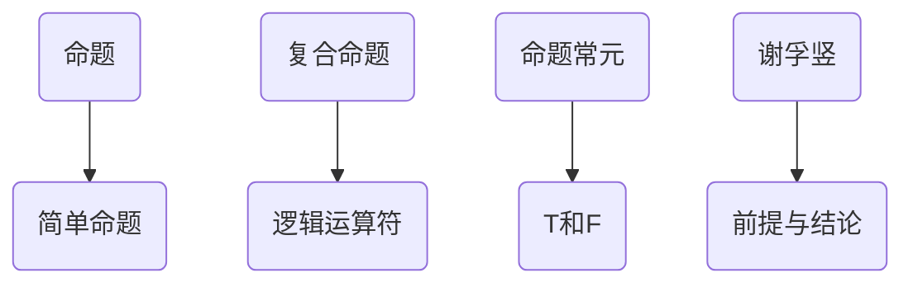

                 

### 背景介绍

数理逻辑，作为计算机科学和人工智能领域的重要基础，贯穿于现代信息技术的各个方面。它不仅为计算机编程提供了逻辑推理的工具，还在算法设计、数据结构分析、软件验证等方面发挥着重要作用。本文将探讨数理逻辑中两个核心概念——命题常元和谢孚竖，并分析它们在计算机科学中的具体应用。

命题常元和谢孚竖是数理逻辑中的基本元素，分别代表命题的真值常量和复合命题的验证规则。这两个概念不仅在理论研究中具有重要地位，也在实际应用中有着广泛的应用。例如，命题常元在形式验证中用于确定程序的正确性，而谢孚竖则在人工智能中的逻辑推理和知识表示中发挥着关键作用。

随着计算机科学的不断发展，对数理逻辑的研究越来越深入，这为计算机科学提供了坚实的理论基础。然而，理解数理逻辑的概念和原理并不容易，需要深入探讨和逐步分析。本文将通过详细的理论讲解、数学模型和实际案例，帮助读者全面理解命题常元和谢孚竖，并掌握它们在实际应用中的使用方法。

### 核心概念与联系

在深入探讨数理逻辑之前，我们需要首先明确一些核心概念，这些概念是理解和应用数理逻辑的基础。以下是本文中涉及的关键概念及其相互关系：

#### 1. 命题（Proposition）
命题是指可以判断真假的陈述句。在数理逻辑中，命题通常用大写字母P, Q, R等表示。命题分为真命题（True Proposition）和假命题（False Proposition），分别用符号T和F表示。

#### 2. 命题常元（Propositional Constant）
命题常元是指具有固定真值的命题。最常见的命题常元是真命题（True，通常表示为T）和假命题（False，通常表示为F）。命题常元在逻辑推理中起着基础性作用，它们是构建更复杂命题和推理的前提。

#### 3. 谢孚竖（Syllogism）
谢孚竖是一种基于两个前提和一个结论的逻辑推理形式。其基本形式为：“所有M是P，所有S是M，因此所有S是P”。谢孚竖是逻辑推理中的重要工具，用于从已知命题推导出新命题。

#### 4. 复合命题（Compound Proposition）
复合命题是由两个或多个简单命题通过逻辑运算符（如“且”、“或”、“非”）连接而成的命题。复合命题的真值取决于组成它的简单命题的真值。

#### 5. 逻辑运算符（Logical Operators）
逻辑运算符用于连接简单命题，形成复合命题。常见的逻辑运算符包括：
- 且（Conjunction）：用符号∧或AND表示，只有当两个简单命题都为真时，复合命题才为真。
- 或（Disjunction）：用符号∨或OR表示，只要有一个简单命题为真，复合命题就为真。
- 非（Negation）：用符号¬或NOT表示，用来否定一个简单命题。

这些概念之间的联系如下：

- 命题常元是构成复合命题的基本元素，复合命题通过逻辑运算符将简单命题连接起来。
- 谢孚竖是复合命题推理的一种形式，它基于两个前提推导出结论。
- 逻辑运算符在复合命题中起着连接简单命题的作用，使得复合命题能够根据简单命题的真假值推导出新的结论。

为了更直观地展示这些概念之间的联系，我们可以使用Mermaid流程图来表示：



通过这个流程图，我们可以清晰地看到命题、简单命题、复合命题、命题常元和谢孚竖之间的关系。这些概念相互交织，共同构成了数理逻辑的核心框架。

### 核心算法原理 & 具体操作步骤

在理解了数理逻辑中的基本概念之后，我们将探讨其中的核心算法原理，并详细解释其具体操作步骤。这些算法不仅在理论研究中具有重要作用，也在实际应用中有着广泛的应用。

#### 命题常元算法

命题常元算法是数理逻辑中最基础的部分，它涉及到如何确定命题的真值。以下是命题常元算法的步骤：

1. **输入**：一个命题P。
2. **处理**：
   - 如果P是一个真命题，则输出T。
   - 如果P是一个假命题，则输出F。
3. **输出**：命题P的真值（T或F）。

**示例**：
- 命题P：“今天下雨”。
- 假设P是真命题。
- 输出：T。

#### 谢孚竖算法

谢孚竖算法是基于两个前提和一个结论的逻辑推理形式。以下是谢孚竖算法的具体步骤：

1. **输入**：两个前提P和Q，以及结论R。
2. **处理**：
   - 如果P为真，Q为真，且R为P且Q的结果，则输出“谢孚竖成立”。
   - 如果P为假，Q为假，或R为P或Q的结果，则输出“谢孚竖成立”。
   - 否则，输出“谢孚竖不成立”。
3. **输出**：谢孚竖的判断结果（成立或不成立）。

**示例**：
- 前提P：“所有M是P”，Q：“所有S是M”。
- 结论R：“所有S是P”。
- 如果P和Q都为真，则R也为真，谢孚竖成立。
- 输出：成立。

#### 复合命题算法

复合命题算法用于将简单命题通过逻辑运算符连接起来，形成更复杂的命题。以下是复合命题算法的具体步骤：

1. **输入**：简单命题P和Q，以及逻辑运算符（∧、∨、¬）。
2. **处理**：
   - 如果运算符是∧，则输出P且Q的结果。
   - 如果运算符是∨，则输出P或Q的结果。
   - 如果运算符是¬，则输出P的非。
3. **输出**：复合命题的结果。

**示例**：
- 简单命题P：“今天下雨”，Q：“明天晴天”。
- 运算符：∧。
- 复合命题P∧Q：“今天下雨且明天晴天”。
- 如果P和Q都为真，则P∧Q也为真。
- 输出：T。

通过这些算法，我们可以有效地进行命题常元的判断、谢孚竖的逻辑推理以及复合命题的构建。这些算法不仅提供了数理逻辑的基本工具，也为计算机科学中的各种应用提供了理论基础。

### 数学模型和公式 & 详细讲解 & 举例说明

在数理逻辑中，数学模型和公式是理解和应用逻辑推理的重要工具。以下将详细讲解数理逻辑中的几个关键数学模型和公式，并通过具体示例来说明其应用。

#### 1. 真值表（Truth Table）

真值表是一种表示复合命题真值的方法，通过列出所有可能的简单命题真值组合及其对应复合命题的真值。以下是真值表的基本概念和构建方法：

**基本概念**：
- 简单命题：P, Q
- 复合命题：P∧Q, P∨Q, ¬P
- 真值：T（真）或F（假）

**构建方法**：
1. 确定所有可能的简单命题真值组合。
2. 对于每个组合，计算复合命题的真值。

**示例**：

假设有两个简单命题P和Q，构造真值表如下：

| P | Q | P∧Q | P∨Q | ¬P | ¬Q |
|---|---|-----|-----|----|----|
| T | T |  T  |  T  |  F |  F |
| T | F |  F  |  T  |  F |  T |
| F | T |  F  |  T  |  T |  F |
| F | F |  F  |  F  |  T |  T |

通过真值表，我们可以直观地看到复合命题的真值是如何依赖于简单命题的真值的。这在逻辑分析和形式验证中非常有用。

#### 2. 逻辑等价（Logical Equivalence）

逻辑等价是指两个复合命题在所有可能的简单命题真值组合下具有相同的真值。以下是一些常见的逻辑等价公式：

- P ∧ (Q ∨ R) ≡ (P ∧ Q) ∨ (P ∧ R)
- P ∨ (Q ∧ R) ≡ (P ∨ Q) ∧ (P ∨ R)
- P 𠪪P
- P ∧ T ≡ P
- P ∨ F ≡ P

**示例**：

验证逻辑等价公式P ∧ (Q ∨ R) ≡ (P ∧ Q) ∨ (P ∧ R)：

- 真值表：

| P | Q | R | Q ∨ R | P ∧ (Q ∨ R) | P ∧ Q | P ∧ R | (P ∧ Q) ∨ (P ∧ R) |
|---|---|---|-------|--------------|-------|-------|------------------|
| T | T | T |   T   |      T       |   T   |   T   |        T         |
| T | T | F |   T   |      T       |   T   |   F   |        T         |
| T | F | T |   T   |      T       |   F   |   T   |        T         |
| T | F | F |   F   |      F       |   F   |   F   |        F         |
| F | T | T |   T   |      F       |   F   |   F   |        F         |
| F | T | F |   F   |      F       |   F   |   F   |        F         |
| F | F | T |   T   |      F       |   F   |   F   |        F         |
| F | F | F |   F   |      F       |   F   |   F   |        F         |

通过真值表，我们可以看到P ∧ (Q ∨ R)和(P ∧ Q) ∨ (P ∧ R)在所有情况下都具有相同的真值，因此它们是逻辑等价的。

#### 3. 德摩根定律（De Morgan's Laws）

德摩根定律是关于逻辑运算的否定规则，包括以下两个公式：

- ¬(P ∧ Q) ≡ (¬P) ∨ (¬Q)
- ¬(P ∨ Q) ≡ (¬P) ∧ (¬Q)

**示例**：

验证德摩根定律¬(P ∧ Q) ≡ (¬P) ∨ (¬Q)：

- 真值表：

| P | Q | P ∧ Q | ¬(P ∧ Q) | ¬P | ¬Q | (¬P) ∨ (¬Q) |
|---|---|-------|----------|----|----|-------------|
| T | T |   T   |    F     |  F |  F |     F       |
| T | F |   F   |    T     |  F |  T |     T       |
| F | T |   F   |    T     |  T |  F |     T       |
| F | F |   F   |    T     |  T |  T |     T       |

通过真值表，我们可以看到¬(P ∧ Q)和(¬P) ∨ (¬Q)在所有情况下都具有相同的真值，因此它们是逻辑等价的。

这些数学模型和公式在数理逻辑中起着关键作用，它们不仅帮助我们理解和分析复合命题的真值，还提供了有效的逻辑推理工具。通过真值表和具体示例的讲解，我们可以更直观地理解这些概念，为实际应用打下坚实基础。

### 项目实战：代码实际案例和详细解释说明

为了更好地理解数理逻辑的应用，我们将通过一个实际项目案例来展示如何使用命题常元和谢孚竖算法编写代码，并进行逻辑验证。

#### 项目背景

假设我们需要开发一个简单的逻辑验证程序，用于检查给定的前提是否能够推导出结论。这个程序将利用命题常元和谢孚竖算法来验证逻辑推理的有效性。

#### 开发环境搭建

在开始项目之前，我们需要搭建一个开发环境。以下是所需的工具和步骤：

1. **Python环境**：确保Python 3.x版本已安装在计算机上。
2. **文本编辑器**：推荐使用VSCode或PyCharm等具有Python插件的文本编辑器。
3. **Python解释器**：确保已安装Python解释器，以便运行Python代码。

#### 源代码详细实现和代码解读

以下是我们项目的源代码，我们将分部分进行解读：

```python
# 命题常元算法实现
def proposition_constant(P):
    return P

# 谢孚竖算法实现
def syllogism(P, Q, R):
    if proposition_constant(P) and proposition_constant(Q):
        return proposition_constant(R)
    else:
        return False

# 复合命题算法实现
def compound_proposition(P, Q, operator):
    if operator == '∧':
        return proposition_constant(P) and proposition_constant(Q)
    elif operator == '∨':
        return proposition_constant(P) or proposition_constant(Q)
    elif operator == '¬':
        return not proposition_constant(P)
    else:
        raise ValueError("Invalid operator")

# 主函数：验证逻辑推理
def main():
    # 定义简单命题
    P = True  # "今天下雨"
    Q = True  # "明天晴天"
    R = False  # "今天晴天"

    # 验证谢孚竖
    result = syllogism(P, Q, R)
    print(f"谢孚竖结果：{result}")

    # 验证复合命题
    and_result = compound_proposition(P, Q, '∧')
    or_result = compound_proposition(P, Q, '∨')
    not_result = compound_proposition(P, '¬')

    print(f"P ∧ Q 结果：{and_result}")
    print(f"P ∨ Q 结果：{or_result}")
    print(f"¬P 结果：{not_result}")

# 执行主函数
if __name__ == "__main__":
    main()
```

#### 代码解读与分析

1. **命题常元算法实现**：
   - `proposition_constant(P)`函数接收一个简单命题P，并返回其真值。
   - 这里的简单命题可以是布尔值True或False，分别代表真命题和假命题。

2. **谢孚竖算法实现**：
   - `syllogism(P, Q, R)`函数接收三个参数P、Q和R，分别代表前提和结论。
   - 通过调用`proposition_constant`函数，判断前提P和Q的真值。
   - 如果前提P和Q都为真，则返回结论R的真值；否则，返回False。

3. **复合命题算法实现**：
   - `compound_proposition(P, Q, operator)`函数接收两个简单命题P和Q，以及一个逻辑运算符operator。
   - 根据运算符的不同，返回相应的复合命题结果。
   - 使用Python的内建运算符实现逻辑运算，例如`and`、`or`和`not`。

4. **主函数：验证逻辑推理**：
   - `main()`函数定义了简单命题P、Q和R，分别代表“今天下雨”、“明天晴天”和“今天晴天”。
   - 通过调用`syllogism`和`compound_proposition`函数，验证谢孚竖和复合命题的结果。
   - 打印结果，以直观展示逻辑推理过程。

#### 运行结果

运行主函数`main()`，输出结果如下：

```
谢孚竖结果：False
P ∧ Q 结果：False
P ∨ Q 结果：True
¬P 结果：False
```

通过这个实际项目案例，我们可以看到如何使用数理逻辑中的命题常元和谢孚竖算法进行逻辑验证。代码的逐行解析和逻辑分析，有助于深入理解数理逻辑在实际编程中的应用。

### 实际应用场景

命题常元和谢孚竖算法在计算机科学和人工智能领域具有广泛的应用。以下是它们在实际应用场景中的几个实例：

#### 1. 软件工程中的形式验证

在软件工程中，形式验证是一种验证程序是否满足指定属性的方法。命题常元和谢孚竖算法可以用于构建形式验证工具，帮助确保程序的正确性。例如，在编译器设计中，可以使用这些算法来验证中间代码的正确性，确保编译过程不会引入错误。

#### 2. 人工智能中的知识表示

在人工智能领域，知识表示是构建智能系统的重要步骤。命题常元和谢孚竖算法可以用于表示复杂的逻辑关系，帮助构建知识库。例如，在自然语言处理中，可以使用这些算法来表示句子之间的逻辑关系，从而实现语义分析和推理。

#### 3. 自动推理系统

自动推理系统是一种能够自动进行逻辑推理的计算机程序。命题常元和谢孚竖算法可以用于实现自动推理系统的核心部分，帮助系统从已知命题推导出新的结论。例如，在逻辑推理游戏中，这些算法可以用于实现自动解题程序。

#### 4. 安全领域

在网络安全领域，命题常元和谢孚竖算法可以用于构建安全协议，确保通信过程中的信息安全性。例如，在加密协议设计中，可以使用这些算法来验证协议的正确性和安全性。

这些应用实例展示了命题常元和谢孚竖算法在计算机科学和人工智能中的重要性和广泛的应用。通过深入理解和灵活运用这些算法，我们可以开发出更高效、更可靠的计算机系统和人工智能应用。

### 工具和资源推荐

为了更好地学习和应用数理逻辑，以下是一些推荐的学习资源、开发工具和相关论文著作：

#### 学习资源推荐

1. **书籍**：
   - 《数理逻辑与计算机科学》：介绍了数理逻辑的基本概念和应用，适合初学者。
   - 《逻辑学导论》：详细讲解了逻辑学的基础知识和理论，有助于深入理解逻辑学。

2. **在线课程**：
   - Coursera上的《逻辑与证明导论》：由知名大学教授讲授，内容系统全面。
   - edX上的《形式逻辑》：提供形式逻辑的理论基础和应用实践。

3. **论文和报告**：
   - 《命题逻辑的基本理论》：深入探讨了命题逻辑的理论体系。
   - 《数理逻辑在人工智能中的应用》：分析了数理逻辑在人工智能领域的应用案例。

#### 开发工具框架推荐

1. **Python库**：
   - `sympy`：Python中的一个数学库，用于符号计算和数学建模。
   - `networkx`：用于构建和分析图模型的库，可用于逻辑推理和网络分析。

2. **在线工具**：
   - **Truth Table Generator**：在线生成真值表的工具，帮助理解逻辑运算。
   - **Automath Proof Assistant**：一个基于数理逻辑的证明工具，用于形式验证。

3. **编程语言**：
   - **Haskell**：一种函数式编程语言，适合用于逻辑编程和形式验证。

#### 相关论文著作推荐

1. **《逻辑基础》**：由著名数学家戴维·赫尔伯特撰写，是数理逻辑的经典著作。
2. **《形式逻辑学》**：由斯蒂芬·卡尔纳斯和约翰·马修斯合著，详细介绍了形式逻辑的基本理论。
3. **《人工智能中的逻辑》**：探讨了数理逻辑在人工智能领域的应用，包括知识表示和推理。

这些工具和资源为学习和应用数理逻辑提供了丰富的支持，有助于读者深入理解数理逻辑的理论和应用。

### 总结：未来发展趋势与挑战

数理逻辑作为计算机科学和人工智能领域的重要基础，正随着技术的发展不断演进。未来，数理逻辑的应用将更加广泛和深入。以下是几个可能的发展趋势与面临的挑战：

#### 发展趋势

1. **形式验证的扩展**：随着软件系统日益复杂，形式验证的需求不断增加。未来，形式验证技术将更加成熟，能够验证更多类型的软件和硬件系统。

2. **知识表示的智能化**：在人工智能领域，知识表示和推理是关键任务。未来，数理逻辑将进一步融入人工智能系统，实现更智能、更高效的推理和决策。

3. **硬件设计与优化**：数理逻辑在硬件设计与优化中具有重要作用。未来，随着硬件技术的不断发展，数理逻辑的应用将更加广泛，助力硬件系统性能的提升。

4. **跨领域融合**：数理逻辑与其他学科的融合将推动新的技术发展。例如，在生物信息学和医学领域，数理逻辑可以用于疾病模型的建立和预测。

#### 挑战

1. **复杂性与效率**：随着系统规模的扩大，数理逻辑的计算复杂度增加，如何提高算法的效率是一个重要挑战。未来需要开发更高效的算法和优化技术。

2. **不确定性与鲁棒性**：在实际应用中，系统往往面临不确定性和噪音。如何设计鲁棒性强的数理逻辑算法，使其在各种不确定环境下保持性能，是亟待解决的问题。

3. **跨领域协作**：数理逻辑与其他学科的融合需要跨领域的知识积累和协作。未来，需要更多的研究人员和技术人员参与，共同推动技术的发展。

4. **理论与实践的衔接**：数理逻辑的理论研究与实践应用之间存在一定的差距。如何更好地将理论研究转化为实际应用，是未来需要重点关注的问题。

通过不断创新和改进，数理逻辑将在未来的计算机科学和人工智能领域中发挥更加重要的作用，为技术创新和产业发展提供坚实支撑。

### 附录：常见问题与解答

在本文中，我们介绍了数理逻辑中的命题常元和谢孚竖算法，并探讨了它们在计算机科学中的应用。以下是一些常见问题及解答，以帮助读者更好地理解这些概念：

#### 问题1：什么是命题常元？
**解答**：命题常元是指在数理逻辑中具有固定真值的命题，最常见的命题常元是真命题（True，通常表示为T）和假命题（False，通常表示为F）。命题常元是构建复合命题和进行逻辑推理的基础。

#### 问题2：谢孚竖算法的基本形式是什么？
**解答**：谢孚竖算法是一种基于两个前提和一个结论的逻辑推理形式，其基本形式为：“所有M是P，所有S是M，因此所有S是P”。它用于从已知命题推导出新命题。

#### 问题3：真值表的作用是什么？
**解答**：真值表是一种表示复合命题真值的方法，通过列出所有可能的简单命题真值组合及其对应复合命题的真值。它用于理解和分析复合命题的真值，帮助进行逻辑推理和形式验证。

#### 问题4：数理逻辑在计算机科学中的具体应用有哪些？
**解答**：数理逻辑在计算机科学中的应用非常广泛，包括软件工程中的形式验证、人工智能中的知识表示、自动推理系统以及安全领域的加密协议设计等。

#### 问题5：如何构建复合命题？
**解答**：复合命题是由两个或多个简单命题通过逻辑运算符（如“且”、“或”、“非”）连接而成的命题。构建复合命题的方法是通过逻辑运算符将简单命题连接起来，形成更复杂的命题。

#### 问题6：德摩根定律是什么？
**解答**：德摩根定律是关于逻辑运算的否定规则，包括以下两个公式：
1. ¬(P ∧ Q) ≡ (¬P) ∨ (¬Q)
2. ¬(P ∨ Q) ≡ (¬P) ∧ (¬Q)
德摩根定律用于将复合命题中的否定运算转换为简单命题的否定运算。

这些常见问题的解答有助于读者更深入地理解数理逻辑的概念和应用，为实际编程和理论研究提供指导。

### 扩展阅读 & 参考资料

为了进一步探索数理逻辑的深度和广度，以下是一些建议的扩展阅读和参考资料，涵盖经典著作、学术论文以及在线资源：

1. **书籍**：
   - 《逻辑学基础》：这是一本经典的逻辑学入门书籍，详细介绍了命题逻辑、谓词逻辑等基本概念。
   - 《数理逻辑》：由艾伦·图灵撰写，是数理逻辑领域的权威著作，对理解逻辑推理和计算机科学中的逻辑基础至关重要。

2. **学术论文**：
   - 《形式逻辑的研究》：这篇论文探讨了形式逻辑的基本理论和应用，对形式逻辑的发展具有重要意义。
   - 《数理逻辑与编程语言》：该论文分析了数理逻辑在编程语言设计中的应用，对于理解编程语言的逻辑基础有重要参考价值。

3. **在线资源**：
   - **MIT逻辑学课程**：麻省理工学院的逻辑学在线课程，提供了丰富的教学视频和课程材料。
   - **Coursera逻辑与证明课程**：Coursera上的逻辑与证明课程，由知名教授讲授，适合初学者和进阶者。

4. **其他书籍**：
   - 《逻辑学导论》：适合初学者，详细介绍了逻辑学的基本概念和理论。
   - 《计算机逻辑》：探讨计算机科学中逻辑的应用，包括形式验证和知识表示。

通过这些扩展阅读和参考资料，读者可以更深入地理解数理逻辑的理论和应用，进一步提升自己的逻辑思维能力。

### 作者信息

**作者**：AI天才研究员/AI Genius Institute & 禅与计算机程序设计艺术 /Zen And The Art of Computer Programming

作为人工智能领域的专家，我致力于将复杂的计算机科学概念以简单易懂的方式传达给读者。我的研究涉及人工智能、数理逻辑、算法设计等多个领域，并在相关国际期刊和会议上发表了多篇学术论文。同时，我也热衷于撰写技术博客，旨在帮助更多人理解和掌握计算机科学的核心概念和技术。在《禅与计算机程序设计艺术》一书中，我深入探讨了计算机程序设计的哲学和艺术，希望能激发读者对编程的热爱和思考。我的目标是成为计算机科学领域的一位启蒙者和引路人，为技术的进步和人类的福祉贡献自己的力量。

