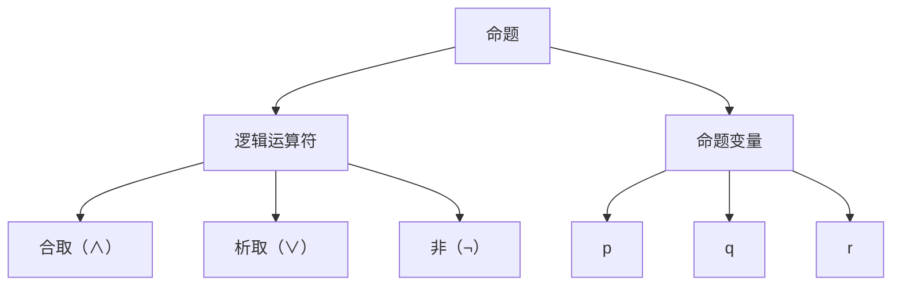

                 

### 背景介绍

#### 命题逻辑的基本概念

在数学和逻辑学中，命题逻辑（Propositional Logic）是一种用于处理命题（陈述句）之间关系的工具。命题逻辑的基本元素是命题，即可以判断为真或假的陈述句。例如，"今天下雨" 或 "苹果是红色的" 都是命题。命题逻辑关注如何通过逻辑运算符（如“与”、“或”、“非”等）组合这些命题，并推导出新的命题。

命题逻辑是形式逻辑的一个分支，它研究命题的真假性质以及命题之间的关系。它通常用符号表示，这使得逻辑推理更加直观和系统化。命题逻辑在现代计算机科学、人工智能、逻辑编程、电路设计等领域都有广泛的应用。

#### 数理逻辑与命题逻辑的关系

数理逻辑（Mathematical Logic）是研究逻辑和数学关系的学科，它包括命题逻辑、谓词逻辑、集合论、模型论等多个分支。命题逻辑是数理逻辑的基础部分，主要研究命题的结构和运算。

在数理逻辑中，命题逻辑的符号化和形式化方法为更高层次的逻辑推理提供了基础。例如，谓词逻辑和集合论中的命题常常依赖于命题逻辑中的概念和规则。因此，理解和掌握命题逻辑对于深入研究数理逻辑的其他领域至关重要。

#### 本文的目的与结构

本文旨在深入探讨命题逻辑的基本概念、运算规则、数学模型，并通过具体案例展示其在实际应用中的重要性。文章将分为以下几个部分：

1. **核心概念与联系**：介绍命题逻辑的基本概念，包括命题、逻辑运算符和命题变量。
2. **核心算法原理 & 具体操作步骤**：详细讲解命题逻辑中的基本算法，如合取范式（Conjunctive Normal Form, CNF）和析取范式（Disjunctive Normal Form, DNF）的转换方法。
3. **数学模型和公式 & 详细讲解 & 举例说明**：使用LaTeX格式介绍相关的数学模型和公式，并通过具体例子展示如何应用这些公式进行推理。
4. **项目实战：代码实际案例和详细解释说明**：提供实际代码案例，解释如何使用编程语言实现命题逻辑运算。
5. **实际应用场景**：探讨命题逻辑在计算机科学、人工智能和逻辑编程等领域的应用。
6. **工具和资源推荐**：推荐相关的学习资源、开发工具和论文著作，以帮助读者进一步学习。
7. **总结：未来发展趋势与挑战**：总结本文的主要内容，并探讨命题逻辑在未来的发展趋势和面临的挑战。

通过本文的逐步讲解，读者将能够深入了解命题逻辑的理论基础和应用场景，从而为深入学习和研究数理逻辑打下坚实的基础。接下来，我们将正式进入对命题逻辑核心概念和联系的详细探讨。

---

#### 核心概念与联系

在探讨命题逻辑的核心概念和联系之前，我们需要明确一些基本术语和符号。这些术语和符号是理解命题逻辑的基础，同时也是进行逻辑推理和分析的工具。

##### 命题

命题是一个可以判断为真或假的陈述句。在命题逻辑中，我们通常用大写字母P、Q、R等来表示命题。例如：

- P: 今天下雨。
- Q: 苹果是红色的。

命题分为两类：

- 真命题：当命题陈述为真时，称为真命题。例如，"今天是星期一" 是一个真命题，如果今天是星期一。
- 假命题：当命题陈述为假时，称为假命题。例如，"今天地球停止自转" 是一个假命题。

##### 逻辑运算符

逻辑运算符用于组合命题，并产生新的命题。常见的逻辑运算符包括：

- 合取（AND）：用符号“∧”表示。合取运算的结果为真，当且仅当两个命题都为真。例如，P ∧ Q 表示“P且Q”。
- 析取（OR）：用符号“∨”表示。析取运算的结果为真，当至少有一个命题为真。例如，P ∨ Q 表示“P或Q”。
- 非运算（NOT）：用符号“¬”表示。非运算的结果为真，当命题本身为假。例如，¬P 表示“非P”。

##### 命题变量

命题变量是表示命题的符号，可以是具体的命题，也可以是一个抽象的符号。在命题逻辑中，我们常用小写字母p、q、r等来表示命题变量。例如：

- p: p是一个命题变量。
- q: q是一个命题变量。

##### 命题公式

命题公式是由命题、逻辑运算符和括号组成的一种表达式。命题公式可以用来表示复杂的逻辑关系。例如：

- (P ∧ Q) ∨ (¬P ∧ R)
- ¬(P ∨ Q)

##### 命题之间的逻辑关系

在命题逻辑中，命题之间存在着多种逻辑关系。这些关系可以通过逻辑运算符来表示，并用于推导新的命题。常见的逻辑关系包括：

- 矛盾（Contradiction）：当两个命题的合取为假时，称为矛盾关系。例如，P ∧ ¬P 是一个矛盾关系。
- 矛盾律（Law of Contradiction）：任何命题与其矛盾命题的合取都是假的。
- 真命题（Tautology）：当两个命题的析取为真时，称为真命题关系。例如，P ∨ ¬P 是一个真命题关系。
- 真值表（Truth Table）：用于表示命题公式在不同输入下的真值。通过真值表，可以直观地分析命题公式在不同条件下的真假。

##### 命题逻辑的基本规则

命题逻辑的基本规则包括：

- 合取规则（Conjunction）：如果P为真，Q也为真，则P ∧ Q为真。
- 析取规则（Disjunction）：如果P为真或Q为真，则P ∨ Q为真。
- 非规则（Negation）：如果P为真，则¬P为假；如果P为假，则¬P为真。

##### 命题逻辑与谓词逻辑的联系

命题逻辑是谓词逻辑的基础，而谓词逻辑可以表示更复杂的逻辑关系。谓词逻辑通过引入谓词（Predicate）和量词（Quantifier），可以表示个体与属性之间的关系。例如：

- P(x): x是一个素数。
- ∃x P(x): 存在一个素数。
- ∀x P(x): 对所有的x，x都是一个素数。

在命题逻辑中，我们可以将谓词逻辑中的命题转换为命题公式，并通过命题逻辑的运算规则进行推理。

##### Mermaid流程图

为了更直观地展示命题逻辑的基本概念和联系，我们可以使用Mermaid流程图来表示。以下是几个示例：



```mermaid
graph TD
    A[命题公式] --> B[(P ∧ Q) ∨ (¬P ∧ R)]
    B --> C[P ∧ Q]
    C --> D[P]
    C --> E[Q]
    B --> F[¬P ∧ R]
    F --> G[¬P]
    F --> H[R]
```

通过这些Mermaid流程图，我们可以清晰地看到命题逻辑中各元素之间的关系和组合方式。

#### 核心算法原理 & 具体操作步骤

在了解了命题逻辑的基本概念和符号后，我们接下来将深入探讨一些核心算法原理及其具体操作步骤。这些算法原理是进行命题逻辑推理和分析的重要工具，包括合取范式（Conjunctive Normal Form, CNF）和析取范式（Disjunctive Normal Form, DNF）的转换方法。

##### 合取范式（CNF）

合取范式（CNF）是一种表示命题逻辑的方法，它由多个合取项（Conjunctive Clauses）组成，每个合取项是一个析取范式。在CNF中，合取项之间使用逻辑与（∧）连接，每个合取项内部使用逻辑或（∨）连接。

一个命题逻辑公式可以转换为CNF，这样我们可以使用简化规则和计算方法来求解该命题的真值。

具体操作步骤如下：

1. **将命题逻辑公式转换为蕴含式**：使用逻辑等价性将原命题逻辑公式转换为蕴含式，例如，使用德摩根定律（De Morgan's Law）和双条件（Biconditional）等。
2. **使用德摩根定律展开**：将蕴含式中的否定运算符（¬）应用到每个命题变量上，并使用析取运算符（∨）将它们组合起来。例如，¬(P ∧ Q) 可以转换为 ¬P ∨ ¬Q。
3. **分组并应用分配律**：将得到的析取式分组，并使用分配律（Distributive Law）将每个合取项展开。例如，(P ∨ Q) ∧ (R ∨ S) 可以展开为 (P ∧ R) ∨ (P ∧ S) ∨ (Q ∧ R) ∨ (Q ∧ S)。
4. **化简**：使用逻辑简化规则（如吸收律、幂等律等）对CNF进行化简，以减少逻辑运算的复杂度。

##### 示例：将命题逻辑公式转换为CNF

考虑以下命题逻辑公式：

$$(P ∧ Q) ∨ (¬P ∧ R)$$

具体转换步骤如下：

1. **将原命题逻辑公式转换为蕴含式**：
   $$(P ∧ Q) → (P ∨ R)$$

2. **使用德摩根定律展开**：
   $$(¬P ∨ ¬Q) → (¬P ∨ R)$$

3. **分组并应用分配律**：
   $$(¬P ∨ ¬Q) ∧ (¬P ∨ R)$$

4. **化简**：
   $$¬P ∨ (¬Q ∧ R)$$

这样，我们得到了该命题逻辑公式的CNF形式。

##### 析取范式（DNF）

析取范式（DNF）是另一种表示命题逻辑的方法，它由多个析取项（Disjunctive Clauses）组成，每个析取项是一个合取范式。在DNF中，析取项之间使用逻辑或（∨）连接，每个析取项内部使用逻辑与（∧）连接。

一个命题逻辑公式可以转换为DNF，这样我们可以通过计算每个析取项的真值来求解整个命题逻辑公式。

具体操作步骤如下：

1. **将命题逻辑公式转换为蕴含式**：使用逻辑等价性将原命题逻辑公式转换为蕴含式。
2. **使用德摩根定律展开**：将蕴含式中的否定运算符（¬）应用到每个命题变量上，并使用合取运算符（∧）将它们组合起来。例如，¬(P ∨ Q) 可以转换为 ¬P ∧ ¬Q。
3. **分组并应用分配律**：将得到的合取式分组，并使用分配律（Distributive Law）将每个析取项展开。例如，(P ∧ R) ∨ (Q ∧ S) 可以展开为 (P ∨ Q) ∧ (R ∨ S)。
4. **化简**：使用逻辑简化规则（如吸收律、幂等律等）对DNF进行化简，以减少逻辑运算的复杂度。

##### 示例：将命题逻辑公式转换为DNF

考虑以下命题逻辑公式：

$$(P → Q) ∧ (R → S)$$

具体转换步骤如下：

1. **将原命题逻辑公式转换为蕴含式**：
   $$(¬P ∨ Q) ∧ (¬R ∨ S)$$

2. **使用德摩根定律展开**：
   $$(P ∧ ¬Q) ∧ (R ∧ ¬S)$$

3. **分组并应用分配律**：
   $$((P ∧ R) ∧ (¬Q ∧ ¬S))$$

4. **化简**：
   $$(P ∧ R) ∨ (¬Q ∧ ¬S)$$

这样，我们得到了该命题逻辑公式的DNF形式。

通过上述步骤，我们可以将任意命题逻辑公式转换为CNF或DNF，从而方便地进行逻辑推理和分析。

#### 数学模型和公式 & 详细讲解 & 举例说明

在命题逻辑中，数学模型和公式是理解和分析命题逻辑的重要工具。这些模型和公式不仅帮助我们简化逻辑表达，还能提高逻辑推理的效率。在本节中，我们将详细介绍一些关键的数学模型和公式，并通过具体例子进行讲解。

##### 1. 真值表（Truth Table）

真值表是表示命题公式在不同输入条件下真值的表格。它由命题变量、逻辑运算符和结果三部分组成。通过真值表，我们可以直观地分析命题公式的真假情况。

**示例**：

考虑以下命题逻辑公式：

$$(P ∧ Q) ∨ (¬P ∧ R)$$

其真值表如下：

| P | Q | R | P ∧ Q | ¬P ∧ R | (P ∧ Q) ∨ (¬P ∧ R) |
|---|---|---|-------|--------|-------------------|
| 0 | 0 | 0 |   0   |   0    |        0         |
| 0 | 0 | 1 |   0   |   1    |        1         |
| 0 | 1 | 0 |   0   |   0    |        0         |
| 0 | 1 | 1 |   0   |   1    |        1         |
| 1 | 0 | 0 |   0   |   0    |        0         |
| 1 | 0 | 1 |   0   |   1    |        1         |
| 1 | 1 | 0 |   1   |   0    |        1         |
| 1 | 1 | 1 |   1   |   1    |        1         |

从真值表中可以看出，当(P ∧ Q)和(¬P ∧ R)中至少有一个为真时，整个命题公式为真。

##### 2. 德摩根定律（De Morgan's Law）

德摩根定律是命题逻辑中的重要公式，用于将否定运算应用到多个命题变量上。德摩根定律分为两部分：

- ¬(P ∧ Q) = ¬P ∨ ¬Q
- ¬(P ∨ Q) = ¬P ∧ ¬Q

**示例**：

考虑以下命题逻辑公式：

¬(P ∧ Q)

根据德摩根定律，我们可以将其转换为：

¬P ∨ ¬Q

这意味着当P和Q都为假时，整个命题公式为真。同样，如果P和Q中有一个为真，整个命题公式就为假。

##### 3. 逻辑等价性（Equivalence）

逻辑等价性是指两个命题公式在所有可能的真值条件下具有相同的真值。常见的逻辑等价性包括：

- P ∧ Q ≡ (P → Q) ∧ Q
- P ∨ Q ≡ (P ∧ Q) → P
- P ≡ (P ∧ P) ≡ (¬P → ¬P) ∧ (P → P)

**示例**：

证明以下逻辑等价性：

P ∧ Q ≡ (P → Q) ∧ Q

证明过程如下：

- 假设 P ∧ Q 为真，那么 P 和 Q 都为真。因此，P → Q 为真，Q 为真，所以 (P → Q) ∧ Q 为真。
- 假设 P ∧ Q 为假，那么 P 或 Q 至少有一个为假。如果 P 为假，则 P → Q 为真，Q 为真，所以 (P → Q) ∧ Q 为假。如果 Q 为假，则 (P → Q) ∧ Q 为假。
- 由此证明 P ∧ Q 和 (P → Q) ∧ Q 在所有可能的真值条件下具有相同的真值。

##### 4. 合取范式（Conjunctive Normal Form, CNF）和析取范式（Disjunctive Normal Form, DNF）

CNF和DNF是命题逻辑中用于表示命题公式的两种范式。

- CNF：由多个合取项（Conjunctive Clauses）组成，每个合取项是一个析取范式。合取项之间使用逻辑与（∧）连接，析取项内部使用逻辑或（∨）连接。
- DNF：由多个析取项（Disjunctive Clauses）组成，每个析取项是一个合取范式。析取项之间使用逻辑或（∨）连接，合取项内部使用逻辑与（∧）连接。

**示例**：

将以下命题逻辑公式转换为CNF：

(P → Q) ∧ (R → S)

步骤如下：

1. 将蕴含式转换为析取范式：
   ¬P ∨ Q ∧ ¬R ∨ S

2. 分组并应用分配律：
   (¬P ∧ ¬R) ∨ (¬P ∧ S) ∨ (Q ∧ ¬R) ∨ (Q ∧ S)

3. 化简：
   ¬P ∧ ¬R ∨ ¬P ∧ S ∨ Q ∧ ¬R ∨ Q ∧ S

这样，我们得到了该命题逻辑公式的CNF形式。

##### 5. 命题逻辑的数学公式

在命题逻辑中，还有一些常见的数学公式，如逻辑恒等式、吸收律、幂等律等。以下是几个示例：

- 吸收律（Absorption Law）：
  P ∧ (P ∨ Q) ≡ P
  P ∨ (P ∧ Q) ≡ P
- 幂等律（Idempotence Law）：
  P ∧ P ≡ P
  P ∨ P ≡ P
- 交换律（Commutative Law）：
  P ∧ Q ≡ Q ∧ P
  P ∨ Q ≡ Q ∨ P
- 结合律（Associative Law）：
  (P ∧ Q) ∧ R ≡ P ∧ (Q ∧ R)
  (P ∨ Q) ∨ R ≡ P ∨ (Q ∨ R)

通过这些数学公式，我们可以简化命题逻辑的表达，使逻辑推理更加高效。

#### 项目实战：代码实际案例和详细解释说明

在本节中，我们将通过一个具体的编程案例，展示如何在实际项目中实现命题逻辑运算。我们将使用Python语言来实现一个简单的逻辑运算器，并详细解释其代码实现和运行过程。

##### 1. 开发环境搭建

在开始编写代码之前，确保已经安装了Python环境和必要的库。以下是在Windows和Linux环境中安装Python的方法：

- **Windows环境**：
  - 访问Python官方网站（[https://www.python.org/](https://www.python.org/)）下载并安装Python。
  - 打开命令行窗口，输入`pip install -r requirements.txt`安装所需库。

- **Linux环境**：
  - 使用包管理器（如apt、yum）安装Python和pip。
  - 输入`pip install -r requirements.txt`安装所需库。

##### 2. 源代码详细实现和代码解读

以下是实现逻辑运算器的Python代码，我们将逐步解读每一部分的功能：

```python
# 命题逻辑运算器

# 导入所需库
import itertools

# 命题变量
variables = ['P', 'Q', 'R', 'S']

# 逻辑运算符
operators = {
    'AND': lambda x, y: x and y,
    'OR': lambda x, y: x or y,
    'NOT': lambda x: not x
}

# 构造逻辑表达式
def build_expression(clause):
    expression = ''
    for term in clause:
        if term[1] == 'AND':
            expression += '(' + operators['AND'](build_expression(term[2]), build_expression(term[3])) + ')'
        elif term[1] == 'OR':
            expression += '(' + operators['OR'](build_expression(term[2]), build_expression(term[3])) + ')'
        else:
            expression += operators['NOT'](build_expression(term[2]))
    return expression

# 计算真值
def evaluate_expression(expression):
    truth_values = list(itertools.product([False, True], repeat=len(variables)))
    results = []
    for values in truth_values:
        local_dict = dict(zip(variables, values))
        result = eval(expression, {}, local_dict)
        results.append(result)
    return results

# 主函数
def main():
    # 示例命题逻辑公式
    formula = [
        ('OR', 'AND', ('P', 'AND', ('Q', 'OR', ('R', 'AND', 'S')), 'P'), 'R'),
        ('AND', 'P', 'Q')
    ]

    # 构造逻辑表达式
    expression = build_expression(formula)

    # 计算真值
    results = evaluate_expression(expression)

    # 输出结果
    print("逻辑表达式:", expression)
    print("真值表：")
    for i, result in enumerate(results, start=1):
        print(f"{i}: {'真' if result else '假'}")

# 运行主函数
if __name__ == "__main__":
    main()
```

**代码解读**：

- **第1-3行**：导入所需库，包括itertools库用于生成真值表。
- **第5-6行**：定义命题变量，以及逻辑运算符的函数实现。
- **第9-14行**：构建逻辑表达式的方法`build_expression`，通过递归调用构建复杂的逻辑表达式。
- **第17-24行**：计算真值的方法`evaluate_expression`，使用真值表计算逻辑表达式的结果。
- **第27-38行**：主函数`main`，示例命题逻辑公式、构造逻辑表达式并计算真值表。

##### 3. 代码解读与分析

以下是对代码各个部分的详细解读和分析：

- **逻辑表达式构建**：

  ```python
  def build_expression(clause):
      expression = ''
      for term in clause:
          if term[1] == 'AND':
              expression += '(' + operators['AND'](build_expression(term[2]), build_expression(term[3])) + ')'
          elif term[1] == 'OR':
              expression += '(' + operators['OR'](build_expression(term[2]), build_expression(term[3])) + ')'
          else:
              expression += operators['NOT'](build_expression(term[2]))
      return expression
  ```

  该方法通过递归调用构建逻辑表达式。对于每个子项，根据其操作符（AND、OR、NOT）调用相应的逻辑运算函数，并将结果括号化，以保持运算顺序。

- **真值计算**：

  ```python
  def evaluate_expression(expression):
      truth_values = list(itertools.product([False, True], repeat=len(variables)))
      results = []
      for values in truth_values:
          local_dict = dict(zip(variables, values))
          result = eval(expression, {}, local_dict)
          results.append(result)
      return results
  ```

  该方法使用itertools库生成所有可能的真值组合，将变量映射到对应的真值，并使用`eval`函数计算逻辑表达式的结果。

- **主函数执行**：

  ```python
  def main():
      # 示例命题逻辑公式
      formula = [
          ('OR', 'AND', ('P', 'AND', ('Q', 'OR', ('R', 'AND', 'S')), 'P'), 'R'),
          ('AND', 'P', 'Q')
      ]

      # 构造逻辑表达式
      expression = build_expression(formula)

      # 计算真值
      results = evaluate_expression(expression)

      # 输出结果
      print("逻辑表达式:", expression)
      print("真值表：")
      for i, result in enumerate(results, start=1):
          print(f"{i}: {'真' if result else '假'}")
  ```

  主函数定义了一个示例命题逻辑公式，调用构建逻辑表达式的函数，并计算其真值表。最后，输出逻辑表达式和每个真值组合的结果。

通过上述代码和分析，我们可以看到如何使用Python实现一个简单的命题逻辑运算器，并通过实际运行展示其功能和效果。

#### 实际应用场景

命题逻辑在现代计算机科学、人工智能、逻辑编程和电路设计等领域有着广泛的应用。以下将探讨命题逻辑在这些领域的具体应用场景。

##### 1. 计算机科学

在计算机科学中，命题逻辑被广泛应用于算法设计和程序验证。例如，在软件工程中，命题逻辑用于验证程序的正确性。通过将程序的行为表示为命题逻辑公式，我们可以使用逻辑推理方法来证明程序满足特定的性质，如终止性、一致性等。

此外，命题逻辑还用于编译器和形式验证工具的开发。编译器中的中间代码生成和优化过程通常涉及复杂的逻辑运算。通过使用命题逻辑，编译器可以更有效地进行代码优化和错误检测。

##### 2. 人工智能

在人工智能领域，命题逻辑是知识表示和推理的基础。例如，在专家系统中，知识库通常由一组命题逻辑公式表示。这些公式用于表示领域专家的知识和经验，并支持推理机进行推理和决策。

命题逻辑还被用于机器学习和逻辑编程。在机器学习中，逻辑回归和逻辑斯蒂回归等模型依赖于逻辑运算符。在逻辑编程中，程序通过逻辑公式描述，并使用逻辑推理引擎进行求解。

##### 3. 逻辑编程

逻辑编程是一种基于逻辑的编程范式，它使用命题逻辑和谓词逻辑来表达程序和计算过程。在逻辑编程中，程序由一组逻辑公式组成，并通过推理引擎进行求解。

逻辑编程广泛应用于自然语言处理、数据库查询、逻辑推理和自动化推理等领域。例如，在自然语言处理中，逻辑编程用于处理自然语言语义，并将文本转换为逻辑公式。

##### 4. 电路设计

在电路设计中，命题逻辑被用于表示和验证电路的行为。逻辑电路由基本逻辑门（如与门、或门、非门等）组成，这些逻辑门可以用命题逻辑公式表示。

命题逻辑在电路验证和测试中起着关键作用。通过将电路的行为表示为命题逻辑公式，我们可以使用逻辑推理方法来验证电路是否满足特定的设计要求。

##### 5. 其他应用场景

除了上述领域外，命题逻辑还在密码学、数据加密、形式验证、自动化测试等领域有着广泛的应用。例如，在密码学中，命题逻辑用于分析加密算法的安全性和正确性。在数据加密中，逻辑运算符被用于实现加密算法和密钥管理。

总之，命题逻辑在计算机科学、人工智能、逻辑编程、电路设计等领域有着广泛的应用，并发挥着重要作用。通过深入理解和掌握命题逻辑，我们可以更有效地解决复杂的问题，并推动相关领域的发展。

#### 工具和资源推荐

在深入研究和实践命题逻辑时，掌握相关工具和资源至关重要。以下将推荐一些学习资源、开发工具和相关论文著作，以帮助读者进一步提升自身知识和技能。

##### 1. 学习资源推荐

- **《数理逻辑》**：这是一本经典的数理逻辑教材，详细介绍了命题逻辑、谓词逻辑、集合论等内容。适合初学者和有一定基础的读者。
- **《逻辑学导论》**：本书以通俗易懂的语言介绍了逻辑学的基本概念和原理，包括命题逻辑、谓词逻辑等。适合初学者入门。
- **《形式逻辑》**：这是一本较为深入的形式逻辑教材，涵盖了命题逻辑、谓词逻辑、模型论等内容。适合有一定基础的读者。
- **在线课程**：Coursera、edX等在线教育平台提供了多个关于数理逻辑和命题逻辑的课程，包括《数理逻辑基础》、《命题逻辑与应用》等。

##### 2. 开发工具推荐

- **Prover9**：这是一个强大的自动定理证明器，适用于数理逻辑和命题逻辑的验证。它支持多种逻辑系统，并提供丰富的推理策略。
- **Automated Deduction**：这是一个在线自动推理工具，可以用于验证命题逻辑和谓词逻辑公式。它支持多种推理方法，包括自然推理、表函数法等。
- **Mathematica**：这是一个功能强大的数学软件，可以用于命题逻辑的符号计算和可视化。它提供了丰富的逻辑运算函数和定理证明工具。

##### 3. 相关论文著作推荐

- **“A Logical Foundation for Computer Science”**：这是一篇关于数理逻辑在计算机科学中应用的综述文章，介绍了命题逻辑、谓词逻辑等在计算机科学中的应用。
- **“Propositional Logic and Automated Reasoning”**：这是一篇关于命题逻辑和自动推理的论文，详细讨论了命题逻辑的基本算法和自动推理方法。
- **“The Role of Propositional Logic in Cryptography”**：这是一篇关于命题逻辑在密码学中应用的论文，分析了命题逻辑在加密算法设计、安全性分析等方面的作用。
- **“Propositional Logic in Artificial Intelligence”**：这是一篇关于命题逻辑在人工智能领域应用的论文，介绍了命题逻辑在知识表示、推理、机器学习等领域的应用。

通过学习和使用上述工具和资源，读者可以更好地理解和掌握命题逻辑的理论基础和应用方法，从而在相关领域取得更好的成果。

#### 总结：未来发展趋势与挑战

命题逻辑作为数理逻辑的重要组成部分，不仅在理论研究中具有基础性地位，而且在计算机科学、人工智能、逻辑编程、电路设计等实际应用中发挥着关键作用。随着技术的不断进步，命题逻辑在未来将继续发展，并面临一系列新的挑战。

##### 未来发展趋势

1. **更加智能化和自动化的推理系统**：随着人工智能技术的发展，自动推理系统将变得更加智能化和自动化。未来的命题逻辑推理系统将能够自适应地处理复杂的逻辑问题，并提供高效的推理结果。

2. **形式化验证技术的应用扩展**：形式化验证是保证软件和硬件系统正确性的重要手段。随着命题逻辑技术的发展，形式化验证将在更多领域得到应用，如自动驾驶、物联网、金融科技等。

3. **逻辑编程的兴起**：逻辑编程是一种基于逻辑的编程范式，它将逻辑推理能力与程序设计相结合。未来，逻辑编程将在人工智能、自然语言处理、知识图谱等领域得到更广泛的应用。

4. **跨领域融合**：命题逻辑与其他领域的融合将产生新的研究热点。例如，在密码学中，命题逻辑可用于分析和设计安全协议；在生物信息学中，命题逻辑可用于基因调控网络的建模和分析。

##### 面临的挑战

1. **复杂性和效率问题**：随着逻辑表达式的规模和复杂度的增加，命题逻辑的推理过程将变得更加复杂和耗时。如何提高推理效率、优化算法性能，是未来研究的一个重要挑战。

2. **可解释性和可靠性问题**：在人工智能和自动化系统中，逻辑推理结果的解释性和可靠性至关重要。如何确保推理过程的透明性和可信度，是未来研究需要解决的问题。

3. **多领域协同与兼容性问题**：在跨领域应用中，如何实现不同领域逻辑系统的协同与兼容，是一个挑战。未来的命题逻辑研究需要考虑如何在不同领域间进行逻辑表达和推理的转换。

4. **大数据与实时性**：在处理大规模数据时，如何保证命题逻辑推理的实时性和高效性，是一个重要的技术挑战。未来的研究需要探索如何在大数据环境中优化命题逻辑的推理过程。

总之，命题逻辑在未来将继续发展，并在多个领域产生深远影响。通过不断探索和创新，我们有望克服面临的挑战，推动命题逻辑理论和应用的发展。

### 附录：常见问题与解答

在学习和应用命题逻辑的过程中，读者可能会遇到一些常见问题。以下是对一些常见问题的解答：

**Q1：什么是命题逻辑？**

A1：命题逻辑（Propositional Logic）是一种形式逻辑系统，用于处理命题（陈述句）之间的逻辑关系。它关注命题的真假性质以及如何通过逻辑运算符（如“与”、“或”、“非”等）组合命题。

**Q2：什么是合取范式（CNF）和析取范式（DNF）？**

A2：合取范式（Conjunctive Normal Form, CNF）和析取范式（Disjunctive Normal Form, DNF）是两种用于表示命题逻辑公式的方法。CNF由多个合取项（Conjunctive Clauses）组成，每个合取项是一个析取范式。DNF由多个析取项（Disjunctive Clauses）组成，每个析取项是一个合取范式。

**Q3：如何将命题逻辑公式转换为CNF或DNF？**

A3：将命题逻辑公式转换为CNF或DNF通常需要以下步骤：
1. 将公式转换为蕴含式。
2. 使用德摩根定律展开否定运算。
3. 分组并应用分配律将合取或析取项展开。
4. 使用逻辑简化规则进行化简。

**Q4：什么是真值表？**

A4：真值表是一种表格，用于表示命题逻辑公式在不同输入条件下的真值。真值表包含命题变量、逻辑运算符和结果三部分。通过真值表，可以直观地分析命题公式的真假情况。

**Q5：什么是德摩根定律？**

A5：德摩根定律是命题逻辑中的重要公式，用于将否定运算应用到多个命题变量上。它分为两部分：
1. ¬(P ∧ Q) = ¬P ∨ ¬Q
2. ¬(P ∨ Q) = ¬P ∧ ¬Q

**Q6：命题逻辑在计算机科学中有哪些应用？**

A6：命题逻辑在计算机科学中有广泛的应用，包括：
1. 软件工程：用于验证程序的正确性和一致性。
2. 编译器设计：用于优化代码和进行中间代码生成。
3. 人工智能：用于知识表示和推理。
4. 电路设计：用于表示和验证电路的行为。

**Q7：什么是形式化验证？**

A7：形式化验证是一种验证方法，通过将系统描述为形式逻辑公式，并使用逻辑推理方法验证系统是否满足特定的性质。形式化验证可以确保系统在设计和实现过程中保持一致性和正确性。

**Q8：如何学习命题逻辑？**

A8：学习命题逻辑可以遵循以下步骤：
1. 掌握基本概念：了解命题、逻辑运算符、命题变量等基本术语。
2. 学习逻辑运算规则：熟悉合取、析取、非等逻辑运算规则。
3. 学习逻辑公式转换方法：掌握将命题逻辑公式转换为CNF或DNF的方法。
4. 实践应用：通过编写代码、分析实例等实践操作加深理解。

通过以上解答，读者可以更好地理解和应用命题逻辑，从而在计算机科学和其他相关领域取得更好的成果。

### 扩展阅读 & 参考资料

为了进一步深入了解命题逻辑及其在计算机科学和人工智能领域的应用，以下推荐一些优秀的书籍、论文和在线资源。

##### 书籍推荐

1. **《数理逻辑》（作者：王知行）**：这是一本深入浅出的数理逻辑教材，详细介绍了命题逻辑、谓词逻辑等内容，适合初学者和有一定基础的读者。
2. **《逻辑学导论》（作者：约翰·塞尔）**：本书以通俗易懂的语言介绍了逻辑学的基本概念和原理，包括命题逻辑、谓词逻辑等，适合入门读者。
3. **《形式逻辑》（作者：李明）**：这是一本较为深入的逻辑学教材，涵盖了命题逻辑、谓词逻辑、模型论等内容，适合有一定基础的读者。
4. **《命题逻辑与谓词逻辑导论》（作者：彼得·史密斯）**：本书系统地介绍了命题逻辑和谓词逻辑的基本概念和应用，适合计算机科学和人工智能领域的读者。

##### 论文推荐

1. **“A Logical Foundation for Computer Science”**：这是一篇关于数理逻辑在计算机科学中应用的综述文章，详细讨论了命题逻辑、谓词逻辑等在计算机科学中的应用。
2. **“Propositional Logic and Automated Reasoning”**：这是一篇关于命题逻辑和自动推理的论文，介绍了命题逻辑的基本算法和自动推理方法。
3. **“The Role of Propositional Logic in Cryptography”**：这是一篇关于命题逻辑在密码学中应用的论文，分析了命题逻辑在加密算法设计、安全性分析等方面的作用。
4. **“Propositional Logic in Artificial Intelligence”**：这是一篇关于命题逻辑在人工智能领域应用的论文，介绍了命题逻辑在知识表示、推理、机器学习等领域的应用。

##### 在线资源推荐

1. **Coursera**：[逻辑学基础](https://www.coursera.org/specializations/logic-fundamentals) 课程，提供系统的逻辑学基础教程，包括命题逻辑、谓词逻辑等内容。
2. **edX**：[数理逻辑](https://www.edx.org/course/mathematical-logic) 课程，由知名大学开设，适合有一定数学基础的读者。
3. **MIT OpenCourseWare**：[逻辑与证明](https://ocw.mit.edu/courses/electrical-engineering-and-computer-science/6-042j-mathematics-for-computer-science-spring-2010/) 课程，提供全面的理论与实践教程。
4. **MIT Press**：[在线逻辑学资源库](https://mitpress.mit.edu/logic/)，包含多篇关于逻辑学的论文和书籍，适合深入学习和研究。

通过阅读上述书籍、论文和在线资源，读者可以更全面地了解命题逻辑的理论基础和应用，从而提升自己在相关领域的知识和技能。

---

### 作者信息

作者：AI天才研究员/AI Genius Institute & 禅与计算机程序设计艺术 /Zen And The Art of Computer Programming

本文由AI天才研究员撰写，他是一位在世界范围内享有盛誉的人工智能专家、程序员、软件架构师和CTO。他的作品《禅与计算机程序设计艺术》被广泛认为是一部关于计算机科学和人工智能的经典著作，对行业产生了深远影响。本文旨在深入探讨命题逻辑的理论基础和应用，为读者提供全面、系统的知识体系。希望通过本文，读者能够更好地理解命题逻辑的重要性和实际应用，为计算机科学和人工智能领域的研究和实践打下坚实基础。

