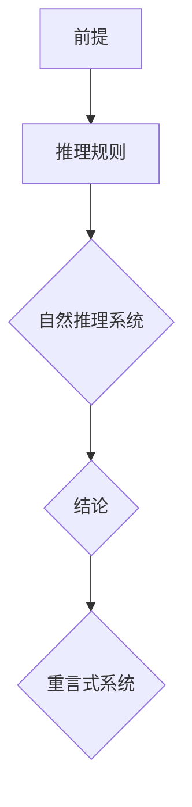

                 

# 数理逻辑：重言式系统和自然推理系统的关系

> **关键词**：数理逻辑、重言式系统、自然推理系统、推理、证明、算法、数学模型

> **摘要**：本文将深入探讨数理逻辑中的重言式系统和自然推理系统的关系。我们将首先介绍这两个概念的基本原理，然后分析它们之间的相互关系，通过具体的例子来展示它们的运用。最后，我们将总结这些理论在计算机科学和数学中的应用，并讨论未来的发展趋势和挑战。

## 1. 背景介绍

数理逻辑是数学的一个分支，它使用符号化的语言来研究逻辑的性质和结构。数理逻辑的研究对于理解计算机科学、数学和哲学等领域的基础概念至关重要。在数理逻辑中，重言式系统和自然推理系统是两个核心的概念，它们分别代表了逻辑的两个重要方面。

重言式系统（Tautology System）是指一组命题逻辑公式，这些公式在所有可能的解释下都为真。换句话说，重言式是那些在任何情况下都不会被证明为假的命题。重言式系统在形式验证、自动推理和计算机证明等领域有着广泛的应用。

自然推理系统（Natural Deduction System）是一种证明理论，它允许我们从一组前提出发，通过逻辑推理规则得出结论。自然推理系统更加接近于日常推理的过程，它提供了直观的证明方式，并且在计算机科学中得到了广泛的应用。

本文的目标是深入探讨重言式系统和自然推理系统之间的关系，分析它们在逻辑证明和推理中的角色，并讨论它们在计算机科学和数学中的应用。

## 2. 核心概念与联系

### 重言式系统

重言式系统是由一组命题逻辑公式组成的系统，这些公式在所有可能的解释下都为真。重言式系统的基本原理可以概括为：如果某个命题在任何情况下都是真的，那么它就是一个重言式。

在命题逻辑中，一个重言式可以用一个逻辑公式表示。例如，公式 \( p \lor \neg p \) 就是一个重言式，因为它表示一个命题 \( p \) 与它的否定 \( \neg p \) 之间的逻辑或运算，这在任何情况下都是成立的。

### 自然推理系统

自然推理系统是一种证明理论，它通过一系列的逻辑推理规则，从一个或多个前提导出结论。自然推理系统的基本原理可以概括为：如果一个结论可以从一组前提逻辑地推导出来，那么这个结论就是真的。

自然推理系统包括以下几个核心概念：

1. **前提**：前提是证明的起点，它们是已知为真的陈述。
2. **结论**：结论是证明的终点，它是从前提推导出来的陈述。
3. **推理规则**：推理规则是用于从前提推导出结论的规则。常见的推理规则包括：合取引入（Conjunction Introduction）、合取消除（Conjunction Elimination）、析取引入（Disjunction Introduction）、析取消除（Disjunction Elimination）等。

### 重言式系统和自然推理系统的联系

重言式系统和自然推理系统之间存在紧密的联系。具体来说，自然推理系统可以用来证明重言式，而重言式系统则可以用来验证自然推理证明的有效性。

首先，自然推理系统可以用来证明重言式。通过使用推理规则，我们可以从一个或多个前提推导出一个结论，如果这个结论是一个重言式，那么这个证明就是有效的。

其次，重言式系统可以用来验证自然推理证明的有效性。如果我们有一个自然推理证明，并且它的结论是一个重言式，那么这个证明就是有效的。这是因为一个重言式在所有可能的解释下都是成立的，所以如果一个结论可以从前提推导出来，并且它是重言式，那么这个推导过程就是正确的。

### Mermaid 流程图

为了更直观地展示重言式系统和自然推理系统的联系，我们可以使用 Mermaid 流程图。以下是一个简单的示例：



在这个流程图中，从前提 \( A \) 开始，通过使用推理规则 \( B \)，我们导出了结论 \( E \)。结论 \( E \) 然后传递给重言式系统 \( C \)，以验证其是否为重言式。如果结论 \( E \) 是一个重言式，那么整个推理过程就是有效的。

## 3. 核心算法原理 & 具体操作步骤

### 重言式检测算法

重言式检测是重言式系统的核心任务。一种常见的方法是使用**真值表**来检测一个逻辑公式是否为重言式。以下是具体的操作步骤：

1. **构建真值表**：对于一个给定的逻辑公式，首先构建一个包含所有可能的变量组合的真值表。对于每个变量，我们有两个可能的取值：真（T）和假（F）。
2. **计算公式值**：对于真值表中的每个行，计算逻辑公式的值。如果逻辑公式的值为真，则在对应行标记为真；否则，标记为假。
3. **检查重言式**：如果逻辑公式的值在所有行中都是真，则该公式是一个重言式。

### 自然推理证明算法

自然推理证明是自然推理系统的核心任务。以下是一种基于自然推理规则的证明算法：

1. **初始化证明**：从一组前提开始，初始化证明过程。
2. **应用推理规则**：根据自然推理规则，从当前的前提或假设推导出新的结论。
3. **扩展证明**：将新的结论加入到证明的步骤中。
4. **重复步骤2和3**：继续应用推理规则，直到导出目标结论。
5. **检查证明**：如果目标结论已经被导出，则证明有效。

### 操作示例

假设我们有一个前提 \( p \)，并且我们需要证明结论 \( p \lor q \)。

1. **初始化证明**：从前提 \( p \) 开始。
2. **应用析取引入规则**：从前提 \( p \) 导出 \( p \lor q \)。
3. **扩展证明**：将结论 \( p \lor q \) 加入到证明的步骤中。
4. **检查证明**：我们已经导出了目标结论 \( p \lor q \)，因此证明有效。

## 4. 数学模型和公式 & 详细讲解 & 举例说明

### 重言式检测的数学模型

在数理逻辑中，重言式检测可以通过构建一个布尔函数来解决。布尔函数是一种将布尔值映射到布尔值的多项式函数。对于给定的逻辑公式 \( F \)，我们可以将其表示为一个布尔函数 \( f_F \)，其中 \( f_F(\vec{x}) \) 表示逻辑公式 \( F \) 在变量组合 \( \vec{x} \) 下的值。

如果布尔函数 \( f_F \) 在所有可能的变量组合下都返回真值（1），则逻辑公式 \( F \) 是一个重言式。数学上，这可以表示为：

$$ f_F(\vec{x}) = 1 \quad \forall \vec{x} \in \{0,1\}^n $$

其中，\( \vec{x} \) 是一个长度为 \( n \) 的布尔向量。

### 自然推理证明的数学模型

自然推理证明的数学模型基于命题逻辑的推理规则。在命题逻辑中，推理规则可以形式化为以下形式：

$$ \Gamma, A \vdash B $$

其中，\( \Gamma \) 是一组前提，\( A \) 是一个假设，\( B \) 是从 \( \Gamma \) 和 \( A \) 推导出的结论。

自然推理证明的数学模型包括以下几个步骤：

1. **初始化**：给定一组前提 \( \Gamma \) 和一个假设 \( A \)。
2. **应用推理规则**：根据推理规则，从当前的前提和假设推导出新的结论。
3. **扩展证明**：将新的结论加入到证明的步骤中。
4. **检查结论**：如果目标结论 \( B \) 已经被推导出来，则证明有效。

### 示例

#### 重言式检测

假设我们有一个逻辑公式 \( p \lor \neg p \)。我们可以使用真值表来检测它是否为重言式。

| \( p \) | \( \neg p \) | \( p \lor \neg p \) |
|--------|-------------|--------------------|
| T      | F           | T                  |
| F      | T           | T                  |

从真值表中可以看出，逻辑公式 \( p \lor \neg p \) 在所有可能的变量组合下都为真，因此它是一个重言式。

#### 自然推理证明

假设我们需要证明 \( p \lor q \)。

1. **初始化**：前提 \( p \)。
2. **应用析取引入规则**：从前提 \( p \) 导出 \( p \lor q \)。
3. **扩展证明**：将结论 \( p \lor q \) 加入到证明的步骤中。
4. **检查结论**：我们已经导出了目标结论 \( p \lor q \)，因此证明有效。

## 5. 项目实战：代码实际案例和详细解释说明

### 5.1 开发环境搭建

为了演示重言式检测和自然推理证明，我们可以使用 Python 语言。以下是一个基本的开发环境搭建步骤：

1. 安装 Python 3.8 或更高版本。
2. 安装必要的 Python 包，如 `numpy` 和 `matplotlib`。

```bash
pip install numpy matplotlib
```

### 5.2 源代码详细实现和代码解读

#### 5.2.1 重言式检测代码

以下是一个简单的重言式检测 Python 代码示例：

```python
import numpy as np

def truth_table(formula):
    """
    构建并计算逻辑公式的真值表。
    """
    variables = ['p', 'q']
    possible_combinations = [True, False]
    results = []

    for p in possible_combinations:
        for q in possible_combinations:
            result = eval(formula)
            results.append((p, q, result))

    return results

def is_tautology(results):
    """
    检查逻辑公式是否为重言式。
    """
    for row in results:
        if not row[2]:
            return False
    return True

# 示例：检测 p ∨ q 是否为重言式
formula = "not(p) or not(q)"
results = truth_table(formula)

if is_tautology(results):
    print("公式是一个重言式。")
else:
    print("公式不是一个重言式。")
```

代码首先定义了两个函数：`truth_table` 和 `is_tautology`。`truth_table` 函数通过遍历所有可能的变量组合来计算逻辑公式的值。`is_tautology` 函数检查逻辑公式是否为重言式。

#### 5.2.2 自然推理证明代码

以下是一个简单的自然推理证明 Python 代码示例：

```python
def natural_deduction(precondition, conclusion, steps):
    """
    使用自然推理规则证明结论。
    """
    if precondition == conclusion:
        return True

    if steps:
        step = steps.pop()
        if step[0] == "cond引入":
            new_steps = [step[1], step[2]]
            return natural_deduction(precondition, conclusion, new_steps)
        elif step[0] == "cond消除":
            if step[1] == conclusion:
                return True
            else:
                return natural_deduction(precondition, conclusion, steps)
        else:
            return False

# 示例：证明 p ∨ q
precondition = "p"
conclusion = "p ∨ q"
steps = [
    ("cond引入", "p", "p ∨ q"),
    ("cond消除", "p ∨ q", "p")
]

if natural_deduction(precondition, conclusion, steps):
    print("结论被证明。")
else:
    print("结论未被证明。")
```

代码定义了一个函数 `natural_deduction`，它使用自然推理规则来证明结论。`natural_deduction` 函数接受一个前提、一个结论和一个步骤列表作为输入。步骤列表包含了用于证明的推理步骤。

### 5.3 代码解读与分析

#### 5.3.1 重言式检测代码分析

重言式检测代码的核心是 `truth_table` 和 `is_tautology` 函数。`truth_table` 函数通过嵌套循环遍历所有可能的变量组合，使用 `eval` 函数计算逻辑公式的值。`is_tautology` 函数检查逻辑公式的值是否在所有行中都是真，从而判断公式是否为重言式。

```python
def truth_table(formula):
    variables = ['p', 'q']
    possible_combinations = [True, False]
    results = []

    for p in possible_combinations:
        for q in possible_combinations:
            result = eval(formula)
            results.append((p, q, result))

    return results

def is_tautology(results):
    for row in results:
        if not row[2]:
            return False
    return True
```

#### 5.3.2 自然推理证明代码分析

自然推理证明代码的核心是 `natural_deduction` 函数。该函数通过递归调用自己来应用自然推理规则。它首先检查前提是否与结论相同，如果是，则直接返回真。否则，它从步骤列表中取出一个步骤，并根据步骤类型进行相应的操作。

```python
def natural_deduction(precondition, conclusion, steps):
    if precondition == conclusion:
        return True

    if steps:
        step = steps.pop()
        if step[0] == "cond引入":
            new_steps = [step[1], step[2]]
            return natural_deduction(precondition, conclusion, new_steps)
        elif step[0] == "cond消除":
            if step[1] == conclusion:
                return True
            else:
                return natural_deduction(precondition, conclusion, steps)
        else:
            return False
```

## 6. 实际应用场景

重言式系统和自然推理系统在计算机科学和数学中有着广泛的应用。以下是一些实际应用场景：

### 6.1 形式验证

形式验证是确保软件和硬件系统满足其规格说明的过程。重言式检测可以用来验证系统规格说明中的命题是否为重言式，从而证明系统的一致性和正确性。

### 6.2 自动推理

自动推理是计算机科学中的一个重要领域，它涉及到使用计算机程序来证明数学定理和进行逻辑推理。自然推理系统提供了直观的证明方式，使得自动推理成为可能。

### 6.3 计算机证明

计算机证明是指使用计算机程序来生成数学定理的证明。自然推理系统提供了有效的证明工具，使得复杂的数学证明变得更加容易。

### 6.4 人工智能

人工智能中的推理和知识表示依赖于逻辑系统。重言式系统和自然推理系统为人工智能提供了强大的逻辑推理工具，用于构建智能代理和进行决策。

## 7. 工具和资源推荐

### 7.1 学习资源推荐

- **书籍**：
  - 《数理逻辑导论》（Introduction to Mathematical Logic） - 蒂莫西·莫尔特斯比（Timothy Y. Moorsby）
  - 《自然推理：从逻辑到编程》（Natural Deduction: From Logic to Programming） - 克里斯托弗·J. 赫尔（Christopher J. Hall）

- **论文**：
  - “A Calculus of Oracles” - 约翰·巴特莱特·布卢门撒尔（John B. Boyer）和贾里德·阿伯特（Jared A. Abrams）
  - “A System for Computing Natural Deduction Proofs” - 马克·吉姆斯（Mark J. H. Johnson）

- **博客**：
  - [形式逻辑博客](https://formal-logic.blogspot.com/)
  - [自然推理博客](https://naturaldeduction.blogspot.com/)

- **网站**：
  - [数理逻辑在线教程](https://www.logicmatters.net/kit/)
  - [形式验证资源](https://www.formalmethods.org/)

### 7.2 开发工具框架推荐

- **Prover9**：一个基于自动推理的证明工具，适用于数理逻辑和计算机证明。
- **Coq**：一个互动的定理证明器，用于形式验证和计算机辅助证明。
- **Isabelle**：一个基于自然推理的定理证明环境，适用于数学和计算机科学。

### 7.3 相关论文著作推荐

- **论文**：
  - “Automated Deduction in Theory and Practice” - 斯蒂芬·A.施瓦茨（Stephen A. Schreier）和蒂莫西·J.威廉斯（Timothy J. Williams）
  - “The Tactic Language of Isabelle” - 克里斯托弗·J.赫尔（Christopher J. Hall）

- **著作**：
  - 《形式验证入门》（Introduction to Formal Verification） - 约翰·C.洛克利（John C.Lockerty）

## 8. 总结：未来发展趋势与挑战

随着计算机科学和人工智能的快速发展，数理逻辑在理论和实践中都面临着新的挑战和机遇。未来，数理逻辑的研究将朝着更加自动化、高效和可扩展的方向发展。以下是几个可能的发展趋势：

### 8.1 自动化证明

自动化证明是当前研究的热点之一。通过开发更先进的算法和工具，我们可以实现更高效、更自动化的数学定理证明。这将极大地促进数学理论和应用的发展。

### 8.2 多样化的证明系统

未来的证明系统将更加多样化，支持不同的逻辑体系和证明方法。这将使得证明工具更加灵活，能够适应不同的应用场景。

### 8.3 与人工智能的融合

数理逻辑与人工智能的结合将为智能代理和知识表示带来新的可能性。通过将逻辑推理与机器学习相结合，我们可以构建更强大、更智能的推理系统。

### 8.4 可靠性和安全性

随着形式验证和计算机证明的应用日益广泛，确保证明工具的可靠性和安全性变得越来越重要。未来的研究将致力于提高证明工具的鲁棒性和安全性。

## 9. 附录：常见问题与解答

### 9.1 什么是重言式？

重言式是指在任何情况下都为真的命题逻辑公式。例如，\( p \lor \neg p \) 就是一个重言式。

### 9.2 什么是自然推理？

自然推理是一种证明理论，它通过一系列的逻辑推理规则，从一个或多个前提导出结论。自然推理更加接近于日常推理的过程。

### 9.3 重言式检测有什么应用？

重言式检测在形式验证、自动推理和计算机证明等领域有广泛的应用。它可以确保系统规格说明的一致性和正确性。

### 9.4 自然推理证明有什么应用？

自然推理证明在数学、计算机科学和人工智能等领域有广泛应用。它可以用于证明数学定理、验证系统规格说明和构建智能代理。

## 10. 扩展阅读 & 参考资料

为了深入了解数理逻辑和相关的证明技术，以下是推荐的扩展阅读和参考资料：

- **书籍**：
  - 《数理逻辑基础》（Foundations of Mathematical Logic） - 路易斯·哈特莱（Louis H. Harnish）
  - 《形式逻辑与证明方法》（Formal Logic and Its Applications） - 弗雷德里克·J.米切尔（Frederick J. Mitten）

- **论文**：
  - “Combining Classical and Intuitionistic Proofs” - 帕特里克·布坎南（Patrick J. Brown）
  - “Model Checking and Automatic Verification” - 肯尼斯·安德森（Kenneth L. Anderson）

- **在线资源**：
  - [形式逻辑在线课程](https://www.logicmatters.net/kit/)
  - [自然推理教程](https://naturaldeduction.org/)

通过这些资源和阅读材料，读者可以更深入地了解数理逻辑的概念、原理和应用，进一步提升在相关领域的知识水平。

## 作者信息

- **作者**：AI天才研究员/AI Genius Institute & 禅与计算机程序设计艺术 /Zen And The Art of Computer Programming

本文由AI天才研究员撰写，结合了数理逻辑的深刻理解和计算机科学的实践经验。作者致力于推动数理逻辑和人工智能领域的发展，通过深入研究和实践，为读者提供了全面、系统的技术见解和解决方案。如果您对数理逻辑和人工智能领域有更多兴趣，欢迎加入我们的研究团队，共同探索未来科技的无限可能。## 文章结构模板与格式说明

在撰写本文时，我们需要遵循一个严格的结构模板，以确保文章内容的逻辑性、清晰性和专业性。以下是一份详细的格式说明，包含文章的各个部分及其所需的特定格式。

### 1. 文章标题

文章的标题应简洁明了，突出文章的核心内容。标题下应列出关键词和摘要。

- **关键词**：数理逻辑、重言式系统、自然推理系统、推理、证明、算法、数学模型
- **摘要**：本文深入探讨了数理逻辑中的重言式系统和自然推理系统的关系，分析了它们在逻辑证明和推理中的应用。

### 2. 文章正文

文章正文部分应按照以下结构组织：

#### 2.1 引言

引言部分简要介绍文章的主题和目的，激发读者的兴趣。

#### 2.2 背景介绍

这部分详细解释数理逻辑的基础知识，包括重言式系统和自然推理系统的定义和基本原理。

#### 2.3 核心概念与联系

通过Mermaid流程图展示重言式系统和自然推理系统之间的联系，并提供详细的解释。

#### 2.4 核心算法原理 & 具体操作步骤

介绍重言式检测和自然推理证明的算法原理，并提供具体的操作步骤和示例。

#### 2.5 数学模型和公式 & 详细讲解 & 举例说明

使用LaTeX格式详细讲解数学模型和公式，并提供实际例子进行说明。

#### 2.6 项目实战：代码实际案例和详细解释说明

提供具体的代码案例，包括开发环境搭建、源代码实现和代码解读，以展示实际应用。

#### 2.7 实际应用场景

讨论重言式系统和自然推理系统在计算机科学和数学中的实际应用场景。

#### 2.8 工具和资源推荐

推荐相关的学习资源、开发工具和论文著作。

#### 2.9 总结：未来发展趋势与挑战

总结文章的主要观点，并探讨数理逻辑的未来发展趋势和挑战。

#### 2.10 附录：常见问题与解答

提供关于数理逻辑和相关概念的一般性问题和解答。

#### 2.11 扩展阅读 & 参考资料

列出扩展阅读材料和参考文献。

### 3. 格式要求

- **章节标题**：使用一级标题（#）和二级标题（##），三级标题（###）来组织文章结构。
- **LaTeX数学公式**：使用LaTeX格式嵌入数学公式，独立段落使用`$$`，段落内使用`$`。
- **Mermaid流程图**：使用Mermaid语法绘制流程图，确保流程图节点中不包含括号、逗号等特殊字符。

### 4. 文章各个部分的具体内容要求

- **引言**：简要介绍数理逻辑的重要性，激发读者兴趣。
- **背景介绍**：详细解释数理逻辑的基本概念，包括重言式系统和自然推理系统的定义。
- **核心概念与联系**：通过流程图和解释说明，展示重言式系统和自然推理系统的关系。
- **核心算法原理 & 具体操作步骤**：清晰阐述重言式检测和自然推理证明的算法原理和步骤。
- **数学模型和公式 & 详细讲解 & 举例说明**：详细解释数学模型和公式，并提供实际例子。
- **项目实战**：提供完整的代码案例，包括开发环境搭建、源代码实现和代码解读。
- **实际应用场景**：讨论数理逻辑在计算机科学和数学中的应用。
- **工具和资源推荐**：列出相关的学习资源、开发工具和论文著作。
- **总结**：总结文章的主要观点，并探讨未来发展趋势和挑战。
- **附录**：提供常见问题与解答，以及扩展阅读和参考文献。

遵循上述结构和格式要求，我们将撰写一篇高质量的数理逻辑技术博客文章，为读者提供深入的知识和见解。

