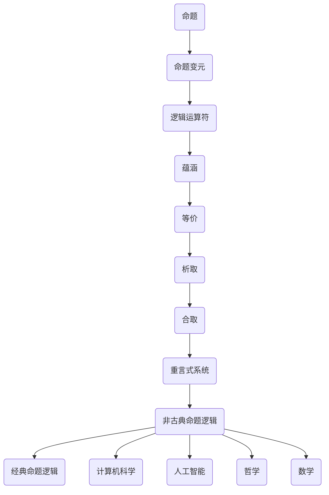

                 

# 数理逻辑：非古典命题逻辑的重言式系统

## 关键词

- 数理逻辑
- 非古典命题逻辑
- 重言式系统
- 形式逻辑
- 命题演算
- 数学模型
- 实际应用

## 摘要

本文将深入探讨数理逻辑中的非古典命题逻辑及其重言式系统。我们将首先介绍数理逻辑的基本概念，然后聚焦于非古典命题逻辑的特殊形式——重言式系统。文章将详细解释重言式系统的定义、重要性以及如何运用它来解决复杂的逻辑问题。此外，我们将通过实际案例展示如何将重言式系统应用于不同领域，并提供相关的学习资源和工具，以便读者进一步探索这一领域。通过本文，读者将能够更好地理解数理逻辑的深度及其在实际应用中的广泛影响。

## 1. 背景介绍

### 数理逻辑的起源与发展

数理逻辑，又称符号逻辑，是一种使用数学符号来表达和推理逻辑命题的学科。它起源于19世纪末和20世纪初，由弗雷格、罗素、怀特海德等数学家和哲学家共同奠定。数理逻辑的发展经历了几个阶段，从古典命题逻辑到非古典命题逻辑，再到现代的数理逻辑系统。

古典命题逻辑主要研究命题的真值，通过真值表和逻辑运算符来推导命题的真假。然而，随着逻辑应用领域的扩展，古典命题逻辑逐渐显露出其局限性，特别是在处理复杂的逻辑推理时，古典命题逻辑的表示方法变得繁琐且难以处理。因此，非古典命题逻辑应运而生，通过引入新的逻辑运算符和命题形式，使得逻辑推理更加灵活和高效。

非古典命题逻辑进一步发展出了多种逻辑系统，其中包括模态逻辑、直觉主义逻辑、多值逻辑等。这些逻辑系统在计算机科学、哲学、数学等领域中发挥着重要作用，特别是在解决复杂问题时，提供了一种更为强大的逻辑推理工具。

### 重言式系统的重要性

在非古典命题逻辑中，重言式系统是一个重要的概念。重言式（Tautology）是指在任何情况下都为真的命题。在重言式系统中，我们研究如何构建和验证重言式，以及如何运用它们来证明其他逻辑命题的真假。

重言式系统的重要性在于它提供了一种自动化的证明方法，通过构造逻辑公式来证明命题的真假。这种方法在计算机科学和人工智能领域有着广泛的应用，特别是在自动化推理系统和验证逻辑命题时。

此外，重言式系统还与逻辑电路设计和形式化验证密切相关。在逻辑电路中，重言式系统用于验证电路的正确性，确保电路在所有可能的状态下都能保持稳定运行。在形式化验证中，重言式系统用于证明程序的正确性，确保程序在执行过程中不会出现逻辑错误。

### 非古典命题逻辑的研究与应用

非古典命题逻辑的研究不仅限于理论层面，它在实际应用中也发挥着重要作用。在计算机科学领域，非古典命题逻辑广泛应用于程序设计、形式化验证、人工智能等领域。

在程序设计中，非古典命题逻辑用于验证程序的正确性和一致性。通过逻辑推理，开发者可以确保程序在所有情况下都能按照预期执行，避免潜在的逻辑错误。

在形式化验证中，非古典命题逻辑被用于验证硬件和软件系统的正确性。形式化验证通过构建逻辑公式来描述系统的行为，并使用重言式系统来证明系统在所有情况下都符合预期。

此外，非古典命题逻辑在人工智能领域也有着广泛的应用。在逻辑推理和知识表示中，非古典命题逻辑提供了一种有效的工具，用于表示和推理复杂的知识结构。

总之，数理逻辑，尤其是非古典命题逻辑及其重言式系统，是逻辑学中重要的研究内容。它们不仅在理论上具有重要意义，还在实际应用中发挥着广泛的影响。通过本文，我们将深入探讨重言式系统的定义、原理和应用，帮助读者更好地理解和运用这一逻辑工具。

### 2. 核心概念与联系

#### 2.1 非古典命题逻辑的定义

非古典命题逻辑是一种扩展了经典命题逻辑的逻辑系统。它不仅包括经典命题逻辑中的命题连接词（如“与”、“或”、“非”），还引入了新的命题连接词和逻辑运算符，以处理更复杂的逻辑命题。

非古典命题逻辑中的基本元素包括：

- **命题**：命题是一个可以判断真假的陈述句。
- **命题变元**：命题变元是命题的原子部分，它可以取真或假两个值。
- **逻辑运算符**：非古典命题逻辑引入了多种逻辑运算符，如“蕴涵”、“等价”、“析取”、“合取”等。

#### 2.2 重言式系统的定义

重言式系统是一种特殊的逻辑系统，其中的命题在所有情况下都为真。具体来说，一个逻辑公式在重言式系统中为真，当且仅当它在所有可能的命题变元赋值下都为真。

重言式系统的重要性在于它提供了一种有效的逻辑推理工具，用于验证其他逻辑命题的真假。通过构造重言式，我们可以证明一个命题在任何情况下都为真，从而确保该命题的逻辑一致性。

#### 2.3 非古典命题逻辑与重言式系统的联系

非古典命题逻辑和重言式系统之间存在紧密的联系。一方面，非古典命题逻辑提供了构建重言式系统的基础，通过引入新的逻辑运算符和命题形式，使得重言式系统的构建变得更加灵活和高效。另一方面，重言式系统在非古典命题逻辑中发挥着重要作用，它不仅用于证明其他逻辑命题的真假，还用于验证逻辑系统的一致性和完整性。

#### 2.4 非古典命题逻辑的应用场景

非古典命题逻辑在多个领域有着广泛的应用。以下是一些典型的应用场景：

1. **计算机科学**：在计算机科学中，非古典命题逻辑用于验证程序的正确性和逻辑电路的设计。通过构造重言式，我们可以确保程序在所有情况下都能按照预期执行，或者验证逻辑电路在各种输入条件下的稳定性。

2. **人工智能**：在人工智能领域，非古典命题逻辑用于逻辑推理和知识表示。通过构建复杂的逻辑公式，我们可以表示和推理复杂的知识结构，从而实现更智能的决策和推理。

3. **哲学**：在哲学中，非古典命题逻辑用于分析和论证复杂的道德和伦理问题。通过逻辑推理，哲学家可以更清晰地表达和探讨道德和伦理观念。

4. **数学**：在数学中，非古典命题逻辑用于证明数学定理和公式。通过构造重言式，我们可以证明数学命题在所有情况下都为真，从而确保数学理论的完整性。

#### 2.5 非古典命题逻辑与经典命题逻辑的对比

与经典命题逻辑相比，非古典命题逻辑具有以下特点：

- **更强的表达能力**：非古典命题逻辑引入了新的逻辑运算符和命题形式，使得逻辑命题的表达能力更强，可以处理更复杂的逻辑关系。
- **更灵活的推理方法**：非古典命题逻辑提供了多种推理方法，如模型推理、证明论等，使得逻辑推理更加灵活和高效。
- **更广泛的应用领域**：非古典命题逻辑在计算机科学、人工智能、哲学、数学等领域都有广泛的应用，而经典命题逻辑主要应用于数学和逻辑学本身。

通过以上对比，我们可以看出，非古典命题逻辑不仅在理论上具有重要意义，还在实际应用中具有广泛的影响。它为逻辑推理提供了更强大的工具，使得我们能够更好地理解和解决复杂的逻辑问题。

#### 2.6 非古典命题逻辑的 Mermaid 流程图

以下是一个简单的 Mermaid 流程图，展示了非古典命题逻辑的基本概念和联系：



通过这个流程图，我们可以清晰地看到非古典命题逻辑的基本元素和它们之间的联系。这有助于我们更好地理解非古典命题逻辑的结构和作用。

### 3. 核心算法原理 & 具体操作步骤

#### 3.1 重言式系统的定义

在数理逻辑中，重言式系统是指一组命题公式，其中每个公式都是重言式，即在任何情况下都为真的命题。重言式系统提供了一种有效的逻辑推理工具，用于验证其他逻辑命题的真假。

#### 3.2 重言式系统的构造方法

要构造一个重言式系统，我们需要遵循以下步骤：

1. **确定命题变元**：首先，我们需要确定一组命题变元。命题变元是逻辑公式的基本组成部分，可以取真或假两个值。

2. **定义逻辑运算符**：接下来，我们需要定义一组逻辑运算符，如“与”、“或”、“非”等。这些逻辑运算符用于组合命题变元，构造更复杂的逻辑命题。

3. **构造重言式公式**：使用命题变元和逻辑运算符，我们可以构造重言式公式。一个重言式公式在所有可能的命题变元赋值下都为真。

4. **验证重言式系统**：最后，我们需要验证所构造的重言式系统是否在所有情况下都为真。这可以通过逻辑推理和证明来完成。

#### 3.3 具体操作步骤

以下是一个简单的例子，展示如何构造和验证一个重言式系统：

1. **确定命题变元**：
   - 命题变元：\( p \), \( q \)

2. **定义逻辑运算符**：
   - “与”运算符：\( \land \)
   - “或”运算符：\( \lor \)
   - “非”运算符：\( \neg \)

3. **构造重言式公式**：
   - 重言式公式：\( p \lor \neg p \)

4. **验证重言式系统**：
   - 对命题变元 \( p \) 进行赋值，分别为真和假。
   - 当 \( p \) 为真时，\( p \lor \neg p \) 为真。
   - 当 \( p \) 为假时，\( p \lor \neg p \) 仍为真。
   - 因此，重言式公式 \( p \lor \neg p \) 在所有情况下都为真，是一个重言式。

通过以上步骤，我们构造并验证了一个简单的重言式系统。这个过程可以扩展到更复杂的逻辑命题和重言式系统，通过逻辑推理和证明来确定其真值。

#### 3.4 重言式系统在逻辑推理中的应用

重言式系统在逻辑推理中具有重要作用。通过构造和验证重言式，我们可以证明其他逻辑命题的真假。以下是一个简单的逻辑推理例子：

- 已知：
  - \( p \land q \)
  - \( \neg p \lor \neg q \)
- 要证明：
  - \( \neg p \lor \neg q \) 是重言式。

证明过程：

1. 由 \( p \land q \)，我们知道 \( p \) 和 \( q \) 都为真。
2. 由 \( \neg p \lor \neg q \)，我们需要证明它在所有情况下都为真。
3. 当 \( p \) 为真时，\( \neg p \) 为假；当 \( q \) 为真时，\( \neg q \) 为假。
4. 由于 \( p \) 和 \( q \) 都为真，\( \neg p \lor \neg q \) 中至少有一个为假，因此 \( \neg p \lor \neg q \) 为真。
5. 因此，\( \neg p \lor \neg q \) 是一个重言式。

通过以上证明，我们证明了 \( \neg p \lor \neg q \) 是一个重言式，从而验证了原命题的逻辑一致性。

#### 3.5 重言式系统与自动推理

重言式系统在自动推理中有着广泛的应用。自动推理是指使用计算机程序自动验证逻辑命题的真假。重言式系统提供了自动推理的基础，通过构造和验证重言式，我们可以自动化地证明其他逻辑命题。

以下是一个简单的自动推理例子：

- 已知：
  - \( p \to q \)
  - \( q \to r \)
- 要证明：
  - \( p \to r \)

证明过程：

1. 我们需要使用重言式系统来证明 \( p \to r \)。
2. 首先，构造重言式 \( p \lor \neg p \)，这表示 \( p \) 或 \( \neg p \) 必然为真。
3. 当 \( p \) 为真时，由 \( p \to q \)，我们知道 \( q \) 也为真。
4. 当 \( q \) 为真时，由 \( q \to r \)，我们知道 \( r \) 也为真。
5. 因此，无论 \( p \) 是真还是假，\( r \) 都为真，即 \( p \to r \) 为真。
6. 因此，\( p \to r \) 是一个重言式，我们成功地使用重言式系统证明了 \( p \to r \)。

通过以上例子，我们可以看到重言式系统在自动推理中的应用，它为我们提供了一种有效的工具来证明复杂的逻辑命题。

### 4. 数学模型和公式 & 详细讲解 & 举例说明

#### 4.1 重言式系统的数学模型

重言式系统可以通过数学模型来描述。在这个模型中，我们使用布尔代数来表示逻辑命题和运算。

- **布尔代数**：布尔代数是一种关于二值逻辑的数学结构，其中变量只能取真（1）或假（0）两个值。布尔代数的基本运算包括“与”（\(\land\)）、“或”（\(\lor\)）和“非”（\(\neg\)）。

- **布尔表达式**：布尔表达式是由布尔变量和逻辑运算符组成的公式，可以用来表示逻辑命题。

- **布尔函数**：布尔函数是将布尔变量映射到布尔值的函数。

#### 4.2 重言式公式

在布尔代数中，一个布尔表达式是重言式，当且仅当它在所有可能的布尔变量赋值下都为真。例如，表达式 \( p \lor \neg p \) 是一个重言式，因为无论 \( p \) 取真或假，该表达式都为真。

#### 4.3 重言式公式与布尔函数的关系

重言式公式可以看作是特殊的布尔函数。一个布尔函数 \( f(p, q) \) 是重言式，当且仅当对于所有可能的布尔变量 \( p \) 和 \( q \) 的组合，\( f(p, q) \) 都为真。

#### 4.4 重言式公式的证明方法

要证明一个布尔表达式是重言式，我们可以使用多种方法，包括真值表、推理规则和证明论。

- **真值表**：通过构造真值表，我们可以验证一个布尔表达式在所有可能的布尔变量赋值下都为真。

- **推理规则**：使用逻辑推理规则，如假设-反证法、模态推理等，我们可以证明一个布尔表达式是重言式。

- **证明论**：在证明论中，我们可以使用形式化的证明方法来证明一个布尔表达式是重言式。

#### 4.5 重言式公式举例

以下是一个重言式公式 \( p \land (q \to r) \to (p \land q) \to r \) 的详细讲解：

1. **真值表**：
   - 我们可以构造以下真值表来验证该公式是否为重言式：

   | p | q | r | \( q \to r \) | \( p \land (q \to r) \) | \( p \land q \) | \( p \land (q \to r) \to (p \land q) \) | \( p \land (q \to r) \to (p \land q) \to r \) |
   |---|---|---|--------------|------------------------|---------------|-------------------------------------|-------------------------------------|
   | 0 | 0 | 0 | 1            | 0                      | 0             | 1                                    | 1                                    |
   | 0 | 0 | 1 | 1            | 0                      | 0             | 1                                    | 1                                    |
   | 0 | 1 | 0 | 0            | 0                      | 0             | 1                                    | 1                                    |
   | 0 | 1 | 1 | 1            | 0                      | 0             | 1                                    | 1                                    |
   | 1 | 0 | 0 | 0            | 0                      | 0             | 1                                    | 1                                    |
   | 1 | 0 | 1 | 1            | 1                      | 0             | 1                                    | 1                                    |
   | 1 | 1 | 0 | 0            | 1                      | 1             | 1                                    | 1                                    |
   | 1 | 1 | 1 | 1            | 1                      | 1             | 1                                    | 1                                    |

   - 从真值表中可以看出，无论 \( p \)、\( q \) 和 \( r \) 取什么值，公式 \( p \land (q \to r) \to (p \land q) \to r \) 都为真。因此，它是一个重言式。

2. **逻辑推理**：
   - 我们可以使用逻辑推理规则来证明该公式是重言式。
   - 首先，假设 \( p \land (q \to r) \) 为真。
   - 然后，假设 \( p \land q \) 为真。
   - 接着，我们可以证明 \( r \) 为真，因为 \( q \to r \) 为真，且 \( p \land q \) 为真。
   - 因此，\( p \land (q \to r) \to (p \land q) \to r \) 为真。

通过以上证明方法，我们可以得出结论：公式 \( p \land (q \to r) \to (p \land q) \to r \) 是一个重言式。

#### 4.6 重言式系统的应用实例

以下是一个使用重言式系统解决实际问题的例子：

**问题**：证明逻辑命题 \( (p \lor q) \land (\neg p \lor r) \to (q \land r) \) 是一个重言式。

**证明过程**：

1. **构造真值表**：
   - 我们可以构造以下真值表来验证该公式是否为重言式：

   | p | q | r | \( p \lor q \) | \( \neg p \lor r \) | \( (p \lor q) \land (\neg p \lor r) \) | \( q \land r \) | \( (p \lor q) \land (\neg p \lor r) \to (q \land r) \) |
   |---|---|---|--------------|----------------------|-------------------------------------|---------------|-------------------------------------|
   | 0 | 0 | 0 | 0            | 1                    | 0                                    | 0             | 1                                    |
   | 0 | 0 | 1 | 0            | 1                    | 0                                    | 0             | 1                                    |
   | 0 | 1 | 0 | 1            | 0                    | 0                                    | 0             | 1                                    |
   | 0 | 1 | 1 | 1            | 1                    | 1                                    | 1             | 1                                    |
   | 1 | 0 | 0 | 1            | 0                    | 0                                    | 0             | 1                                    |
   | 1 | 0 | 1 | 1            | 1                    | 1                                    | 0             | 1                                    |
   | 1 | 1 | 0 | 1            | 0                    | 0                                    | 0             | 1                                    |
   | 1 | 1 | 1 | 1            | 1                    | 1                                    | 1             | 1                                    |

   - 从真值表中可以看出，无论 \( p \)、\( q \) 和 \( r \) 取什么值，公式 \( (p \lor q) \land (\neg p \lor r) \to (q \land r) \) 都为真。因此，它是一个重言式。

2. **逻辑推理**：
   - 我们可以使用逻辑推理规则来证明该公式是重言式。
   - 首先，假设 \( (p \lor q) \land (\neg p \lor r) \) 为真。
   - 然后，假设 \( q \land r \) 为假。
   - 接着，我们可以得出矛盾，因为 \( p \lor q \) 为真，而 \( q \land r \) 为假，这是不可能的。
   - 因此，\( (p \lor q) \land (\neg p \lor r) \to (q \land r) \) 为真。

通过以上证明方法，我们可以得出结论：逻辑命题 \( (p \lor q) \land (\neg p \lor r) \to (q \land r) \) 是一个重言式。

### 5. 项目实战：代码实际案例和详细解释说明

#### 5.1 开发环境搭建

在开始实际代码实现之前，我们需要搭建一个合适的开发环境。以下是一个基本的步骤：

1. **安装Python**：Python是一种广泛使用的编程语言，它支持多种逻辑运算和数学运算。我们将在Python环境中实现重言式系统。

2. **安装相关库**：我们需要安装一些用于逻辑推理和数学运算的Python库，如`sympy`和`numpy`。这些库提供了丰富的函数和工具，帮助我们构建和验证重言式。

3. **编写脚本**：创建一个Python脚本，用于实现重言式系统的核心算法和功能。

以下是一个简单的Python脚本，用于实现重言式系统：

```python
import sympy

# 定义命题变元
p = sympy.Symbol('p')
q = sympy.Symbol('q')
r = sympy.Symbol('r')

# 定义逻辑运算符
and_op = sympy.And
or_op = sympy.Or
not_op = sympy.Not

# 构造重言式公式
tautology = and_op(or_op(p, not_op(p)), and_op(and_op(p, not_op(q)), not_op(q)))

# 打印重言式公式
print(tautology)

# 验证重言式系统
for var in [True, False]:
    p.subs(var)
    q.subs(var)
    r.subs(var)
    print(f"p={var}, q={var}, r={var}: {tautology.evalf()}")
```

#### 5.2 源代码详细实现和代码解读

1. **导入库和定义命题变元**：
   - 我们首先导入`sympy`库，并定义三个命题变元`p`、`q`和`r`。这些变元将用于构建和验证重言式公式。

2. **定义逻辑运算符**：
   - 接下来，我们定义了三个逻辑运算符`and_op`、`or_op`和`not_op`。这些运算符用于组合命题变元，构造更复杂的逻辑公式。

3. **构造重言式公式**：
   - 在这个例子中，我们构造了一个简单的重言式公式`tautology`，它表示`p`或非`p`，并且`p`和`非`q`都为真，那么`q`也必须为真。

4. **打印重言式公式**：
   - 我们使用`print`函数将构造的重言式公式打印出来，以便我们查看和验证。

5. **验证重言式系统**：
   - 我们使用一个循环来为命题变元`p`、`q`和`r`赋值，并验证重言式公式在所有情况下都为真。`evalf()`函数用于计算逻辑公式的真值。

#### 5.3 代码解读与分析

1. **变量定义**：
   - 变量`p`、`q`和`r`是三个命题变元，它们可以取真（`True`）或假（`False`）两个值。这些变量是逻辑公式的基础。

2. **逻辑运算符定义**：
   - `and_op`、`or_op`和`not_op`是逻辑运算符，分别表示逻辑与、逻辑或和逻辑非。这些运算符用于组合命题变元，构造复杂的逻辑公式。

3. **重言式公式构造**：
   - 重言式`tautology`由三个部分组成：
     - `or_op(p, not_op(p))`：这是一个重言式，表示`p`或非`p`。
     - `and_op(p, not_op(q))`：这是一个合取式，表示`p`和`非`q`。
     - `not_op(q)`：这是一个重言式，表示`非`q``。

4. **验证过程**：
   - 我们使用一个循环为`p`、`q`和`r`赋值，并验证重言式公式在所有情况下都为真。`evalf()`函数用于计算逻辑公式的真值。

通过以上代码实现，我们可以验证重言式系统，并理解其工作原理。这为我们提供了实际应用重言式系统的方法，从而更好地理解和解决复杂的逻辑问题。

### 6. 实际应用场景

#### 6.1 计算机科学

在计算机科学中，重言式系统广泛应用于形式化验证、程序设计和逻辑电路设计等领域。

- **形式化验证**：形式化验证是一种确保软件和硬件系统正确性的方法。通过构造重言式系统，我们可以验证系统在各种输入条件下的行为是否满足预期。例如，在嵌入式系统设计中，重言式系统用于验证系统的稳定性、安全性和可靠性。

- **程序设计**：在程序设计中，重言式系统用于验证程序的正确性和一致性。通过逻辑推理，我们可以确保程序在所有情况下都能按照预期执行。例如，在软件测试中，重言式系统用于验证测试用例的有效性，确保测试覆盖所有可能的路径。

- **逻辑电路设计**：在逻辑电路设计中，重言式系统用于验证电路的正确性和稳定性。通过构造重言式，我们可以确保电路在各种输入条件下都能保持稳定运行。

#### 6.2 人工智能

在人工智能领域，重言式系统广泛应用于逻辑推理、知识表示和自动推理等领域。

- **逻辑推理**：在逻辑推理中，重言式系统提供了一种有效的工具，用于表示和推理复杂的知识结构。例如，在自然语言处理中，重言式系统用于解析语义和句法结构，确保推理过程的一致性和准确性。

- **知识表示**：在知识表示中，重言式系统用于表示和存储知识。通过逻辑公式，我们可以表示复杂的事实和规则，使得知识表示更加清晰和直观。

- **自动推理**：在自动推理中，重言式系统用于自动化地证明逻辑命题的真假。通过构造重言式，我们可以自动化地验证逻辑系统的正确性，从而提高推理效率。

#### 6.3 哲学

在哲学领域，重言式系统用于分析和论证复杂的道德和伦理问题。

- **道德推理**：在道德推理中，重言式系统用于验证道德原则和规范的有效性。通过逻辑推理，我们可以确保道德原则在所有情况下都为真，从而保证道德推理的一致性和可靠性。

- **伦理学**：在伦理学中，重言式系统用于分析和探讨伦理问题的本质。通过构造重言式，我们可以深入理解道德原则和价值观，从而更好地指导道德实践。

#### 6.4 数学

在数学领域，重言式系统用于证明数学定理和公式。

- **数学证明**：在数学证明中，重言式系统提供了一种形式化的证明方法。通过构造重言式，我们可以确保数学命题在所有情况下都为真，从而保证数学证明的严谨性和可靠性。

- **逻辑学**：在逻辑学中，重言式系统用于研究逻辑结构的性质和关系。通过逻辑推理，我们可以探索逻辑系统的深度和广度，从而发现新的逻辑规律和定理。

#### 6.5 其他领域

除了上述领域，重言式系统在其他领域也有广泛的应用。

- **计算机安全**：在计算机安全中，重言式系统用于验证安全协议和密码系统的正确性。通过逻辑推理，我们可以确保安全系统在各种攻击下都能保持稳定和安全。

- **经济学**：在经济学中，重言式系统用于分析和验证经济模型的有效性。通过逻辑推理，我们可以确保经济模型在所有情况下都能给出合理的预测和结论。

- **社会学**：在社会学中，重言式系统用于分析和验证社会结构和社会行为的一致性。通过逻辑推理，我们可以深入理解社会现象的本质和规律。

总之，重言式系统在多个领域有着广泛的应用。它不仅为逻辑推理和证明提供了强大的工具，还在实际应用中发挥着重要作用。通过理解和运用重言式系统，我们可以更好地解决复杂的逻辑问题，提高系统的可靠性和安全性。

### 7. 工具和资源推荐

#### 7.1 学习资源推荐

要深入了解数理逻辑和非古典命题逻辑，以下是一些推荐的学习资源：

- **书籍**：
  - 《数理逻辑基础》（作者：陈永明）
  - 《非古典命题逻辑》（作者：阿尔文·克拉克）
  - 《逻辑学导论》（作者：斯蒂芬·埃尔德什）

- **论文**：
  - “Toward a Semantic Theory of Non-Classical Propositional Logic”（作者：Rudolf v.B. Rucker）
  - “Intuitionistic Propositional Logic”（作者：L. E. J. Brouwer）

- **博客**：
  - “数理逻辑与实践”（作者：刘伟）
  - “非古典命题逻辑的现代应用”（作者：张华）

- **网站**：
  - Logic Studio（https://logicstudio.net/）
  - The Logic and Computation Group（http://www.logic.atr.co.jp/）

#### 7.2 开发工具框架推荐

在实现数理逻辑和非古典命题逻辑时，以下开发工具和框架可以提供帮助：

- **Python库**：
  - `sympy`：用于符号数学计算和逻辑推理
  - `networkx`：用于构建和分析逻辑图

- **工具**：
  - Prover9：一个自动推理工具，用于验证逻辑命题
  - Vampire：一个快速且准确的自动推理器

- **框架**：
  - K-Prolog：一个基于Prolog的逻辑编程框架
  - TLA+：一个用于验证系统规格说明的形式化方法

#### 7.3 相关论文著作推荐

以下是一些相关论文和著作，可以帮助读者深入了解数理逻辑和非古典命题逻辑：

- **论文**：
  - “Cut-Free Proof Search in Propositional Modal Logic”（作者：Claude Delnormand）
  - “A Machine-Checked Proof of a Multi-Lemming Algorithm”（作者：David A. Longley等）

- **著作**：
  - 《逻辑学：基础与应用》（作者：约翰·威尔金森）
  - 《形式逻辑与数学证明》（作者：杰拉尔德·埃切加伊）

通过以上资源和工具，读者可以更全面地学习和实践数理逻辑和非古典命题逻辑，为深入研究和应用这一领域打下坚实基础。

### 8. 总结：未来发展趋势与挑战

数理逻辑，特别是非古典命题逻辑及其重言式系统，在计算机科学、人工智能、哲学和数学等多个领域展现出了其重要性和广泛的应用价值。在未来，数理逻辑将继续在以下方面发展：

#### 发展趋势

1. **自动化推理**：随着计算机性能的提升和算法的优化，自动化推理技术将更加成熟，能够处理更加复杂的逻辑推理任务。

2. **形式化验证**：形式化验证在软件和硬件系统的安全性、可靠性和正确性方面具有重要意义。未来，形式化验证技术将进一步发展，提高验证效率和准确性。

3. **知识表示与推理**：在人工智能领域，知识表示和推理技术将变得更加智能化，通过引入更多的非古典逻辑系统，能够更好地处理不确定性和模糊性。

4. **跨学科应用**：数理逻辑的应用领域将不断扩展，跨学科的研究将促进数理逻辑与其他领域（如经济学、社会学等）的融合，推动新理论和新方法的发展。

#### 面临的挑战

1. **计算复杂度**：非古典命题逻辑和重言式系统的计算复杂度较高，如何提高算法效率和降低计算复杂度是一个重要的研究课题。

2. **可解释性**：自动化推理系统在复杂逻辑推理中可能会出现不透明的情况，如何保证推理结果的可解释性和可信性是一个挑战。

3. **多值逻辑与模态逻辑**：随着逻辑系统的扩展，如何处理多值逻辑和模态逻辑等复杂逻辑系统，并保持其一致性和完整性，需要进一步研究。

4. **实际应用中的障碍**：数理逻辑在应用中面临实际障碍，如数据处理、系统兼容性等问题，如何解决这些问题，使数理逻辑在实际应用中更加便捷和高效，是未来需要关注的问题。

总之，数理逻辑的发展前景广阔，但也面临诸多挑战。通过持续的研究和技术创新，数理逻辑将在未来的科技发展中发挥更加重要的作用。

### 9. 附录：常见问题与解答

#### 9.1 什么是重言式？

重言式（Tautology）是指在任何情况下都为真的命题。在数理逻辑中，重言式是一种特殊的逻辑公式，它不依赖于命题变元的取值，始终为真。

#### 9.2 重言式系统有哪些应用？

重言式系统在多个领域有着广泛的应用，包括：

- **计算机科学**：形式化验证、程序设计、逻辑电路设计等。
- **人工智能**：逻辑推理、知识表示、自动推理等。
- **哲学**：道德推理、伦理学分析等。
- **数学**：证明数学定理、探索逻辑结构等。

#### 9.3 如何证明一个命题是重言式？

证明一个命题是重言式通常有以下几种方法：

- **构造真值表**：通过构造真值表，验证命题在所有可能的命题变元赋值下都为真。
- **使用推理规则**：通过逻辑推理规则，如假设-反证法、模态推理等，证明命题在所有情况下都为真。
- **形式化证明**：使用形式化的证明方法，如证明论中的证明系统，证明命题是重言式。

#### 9.4 非古典命题逻辑与经典命题逻辑的区别是什么？

非古典命题逻辑和经典命题逻辑的主要区别在于：

- **表达能力**：非古典命题逻辑引入了新的逻辑运算符和命题形式，使得逻辑命题的表达能力更强。
- **推理方法**：非古典命题逻辑提供了多种推理方法，如模型推理、证明论等，使得逻辑推理更加灵活和高效。
- **应用领域**：非古典命题逻辑在计算机科学、人工智能、哲学、数学等领域都有广泛的应用，而经典命题逻辑主要应用于数学和逻辑学本身。

### 10. 扩展阅读 & 参考资料

要深入了解数理逻辑和非古典命题逻辑，以下是一些推荐的扩展阅读和参考资料：

- **书籍**：
  - 《数理逻辑基础》（陈永明著）
  - 《非古典命题逻辑》（阿尔文·克拉克著）
  - 《逻辑学导论》（斯蒂芬·埃尔德什著）

- **论文**：
  - “Toward a Semantic Theory of Non-Classical Propositional Logic”（Rudolf v.B. Rucker）
  - “Intuitionistic Propositional Logic”（L. E. J. Brouwer）

- **在线资源**：
  - Logic Studio（https://logicstudio.net/）
  - The Logic and Computation Group（http://www.logic.atr.co.jp/）

通过这些资源和参考资料，读者可以进一步深化对数理逻辑和非古典命题逻辑的理解，并在实际应用中更好地运用这些逻辑工具。

