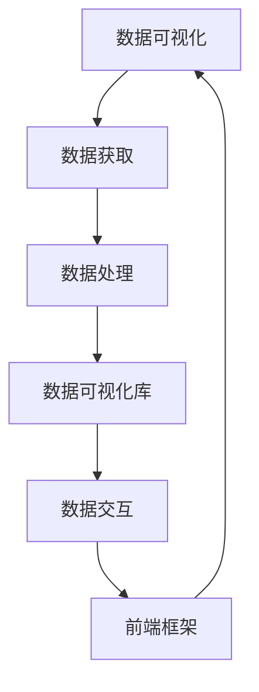

                 

### 背景介绍

随着互联网的快速发展，数据量呈现出爆炸式增长。如何有效地处理和展示这些海量数据，成为了企业和研究机构关注的焦点。数据可视化作为一种将复杂的数据转化为易于理解的可视化图表和图形的技术，正逐渐成为数据分析和决策支持的重要组成部分。

新浪财经作为国内领先的网络财经平台，其数据可视化功能不仅吸引了大量的用户，还为企业提供了重要的数据洞察。本文将围绕新浪2025财经数据可视化社交前端开发面试题集，深入探讨数据可视化前端开发的核心技术和实现方法。

新浪2025财经数据可视化社交前端开发面试题集包含了以下核心主题：

1. **前端技术基础**：包括HTML、CSS、JavaScript等基本知识，以及Vue、React等前端框架的使用。
2. **数据可视化库**：如D3.js、Echarts等常见数据可视化库的功能和特点。
3. **交互设计**：用户交互和交互式图表的实现。
4. **性能优化**：前端性能监控和优化策略。
5. **安全性**：前端安全性考虑和实现。
6. **实际项目开发**：基于实际项目案例的前端开发过程和经验分享。

本文将逐步解析这些主题，并通过具体的代码案例和原理讲解，帮助读者全面了解数据可视化前端开发的各个方面。在阅读本文之后，读者应该能够掌握前端开发的基本技能，理解数据可视化库的使用，以及如何在实际项目中实现高效、安全、美观的数据可视化。

接下来，我们将从前端技术基础开始，逐步深入探讨数据可视化前端开发的各个重要方面。

### 前端技术基础

在数据可视化前端开发中，HTML、CSS、JavaScript是三大基本技术，它们共同构建了网页的基础框架。下面，我们将分别介绍这些技术的核心概念和重要性。

#### HTML

HTML（HyperText Markup Language）是超文本标记语言，用于构建网页结构。HTML标签定义了网页内容的结构和语义。常见的HTML标签包括`<div>`、`<p>`、`<span>`、`<ul>`、`<ol>`等。每个标签对应一个特定的功能，例如`<div>`用于定义一个独立的布局单元，`<p>`用于定义一个段落，`<ul>`和`<ol>`用于定义无序列表和有序列表。

在数据可视化前端开发中，HTML用于布局和数据呈现。通过合理使用HTML标签，我们可以将数据以结构化的形式呈现出来。例如，使用表格`<table>`标签和行`<tr>`、列`<td>`标签可以构建一个数据表格，使用地图`<map>`和区域`<area>`标签可以创建交互式的地图。

#### CSS

CSS（Cascading Style Sheets）用于定义网页的样式。通过CSS，我们可以控制文本的样式（如颜色、字体、大小）、布局（如宽度、高度、对齐）、背景等。CSS样式可以通过内嵌样式、内部样式表和外链样式表等方式应用到HTML文档中。

在数据可视化前端开发中，CSS非常重要，它决定了图表和图形的外观和布局。例如，使用CSS可以设置图表的颜色、字体、大小等样式属性，从而创建出美观的图表。CSS还可以用于实现响应式布局，使图表在不同设备和屏幕尺寸上都能良好显示。

#### JavaScript

JavaScript是一种客户端脚本语言，它可以动态地改变网页的内容和样式。JavaScript可以处理用户交互、数据操作、动态内容加载等任务。JavaScript通过DOM（Document Object Model）与HTML和CSS交互，实现对网页的动态操作。

在数据可视化前端开发中，JavaScript用于实现数据获取、数据处理和可视化渲染。例如，使用JavaScript可以实时从后端获取数据，处理数据并将其渲染成图表。JavaScript还可以用于实现交互式功能，如图表的拖拽、缩放、过滤等。

#### 前端框架

除了HTML、CSS、JavaScript，前端框架如Vue、React也在数据可视化前端开发中发挥着重要作用。这些框架提供了更高效的开发方式和更丰富的组件库，使开发者可以更轻松地实现复杂的数据可视化功能。

Vue是一种渐进式JavaScript框架，用于构建用户界面。Vue提供了数据绑定、组件系统、路由、状态管理等功能。Vue的数据绑定机制使得数据的更新可以实时反映到界面中，非常适合用于数据可视化。

React是由Facebook开发的一款用于构建用户界面的JavaScript库。React采用了组件化开发思想，通过虚拟DOM（Virtual DOM）实现了高效的渲染和更新。React的组件库非常丰富，包括各种图表和可视化组件，如Recharts、D3.js组件等。

#### 综合应用

在数据可视化前端开发中，HTML、CSS、JavaScript和前端框架的综合应用可以构建出功能强大、交互丰富的数据可视化界面。例如，使用Vue和Echarts结合，可以创建一个实时更新的股市走势图；使用React和D3.js结合，可以创建一个动态交互的地理分布图。

总之，前端技术基础是数据可视化前端开发的核心，掌握HTML、CSS、JavaScript以及前端框架的基本原理和实际应用，将有助于开发者更高效地实现数据可视化项目。

### 核心概念与联系

在数据可视化前端开发中，了解核心概念及其相互联系是至关重要的。以下是几个关键概念及其关系：

#### 数据可视化

数据可视化是一种通过图表、图形和动画等方式，将复杂的数据转换为易于理解的信息的方法。数据可视化不仅帮助用户快速捕捉数据的主要特征和趋势，还能揭示隐藏在数据背后的关系和模式。

#### 数据获取

数据获取是数据可视化的重要环节，涉及到从不同来源（如数据库、API、文件等）获取数据。常用的数据获取方法包括Ajax请求、Fetch API、WebSockets等。

#### 数据处理

数据处理是对获取到的数据进行清洗、转换和计算的过程。数据清洗包括处理缺失值、异常值、重复值等。数据处理后的数据通常更干净、格式一致，便于可视化。

#### 数据可视化库

数据可视化库是一系列预构建的工具和组件，用于简化数据可视化开发。常见的可视化库包括D3.js、Echarts、Chart.js等。这些库提供了丰富的图表类型、自定义选项和交互功能，使得开发者可以快速创建高质量的图表。

#### 数据交互

数据交互指的是用户与可视化图表之间的互动。用户可以通过点击、拖动、缩放等操作与图表进行交互，获取更多信息或改变图表的显示方式。数据交互增强了数据可视化的互动性和用户体验。

#### 前端框架

前端框架如Vue、React等提供了强大的开发工具和组件库，使得数据可视化前端开发更加高效。这些框架支持组件化开发、状态管理、路由等，使得开发者可以轻松构建复杂的数据可视化应用。

#### 核心概念关联图

以下是核心概念及其关联的Mermaid流程图：



在上述流程图中，数据可视化作为核心，通过数据获取、数据处理、数据可视化库和前端框架等环节相互关联，共同实现最终的数据可视化效果。

### 核心算法原理 & 具体操作步骤

在数据可视化前端开发中，核心算法是实现数据可视化的关键技术之一。本文将介绍几种常见的数据可视化算法原理，并给出具体的操作步骤。

#### 1. D3.js

D3.js是一个基于JavaScript的库，用于生成高度交互性的数据可视化图表。D3.js的核心在于其数据驱动文档（Data-Driven Documents, D3）的原理，即通过数据来驱动DOM操作，从而生成图表。

**原理：** D3.js利用数据绑定（data binding）将数据与DOM元素关联起来，通过更新DOM元素的属性和样式来实现图表的绘制。它支持多种类型的图表，如折线图、柱状图、散点图、饼图等。

**具体操作步骤：**

1. **数据准备：** 首先需要准备数据。数据可以是JSON、CSV等格式，通常通过Ajax或Fetch API从服务器获取。
2. **选择元素：** 使用D3.js选择要绘制图表的DOM元素，例如`<svg>`元素。
3. **数据绑定：** 将数据绑定到DOM元素上。D3.js会自动处理数据的映射和更新。
4. **添加元素：** 根据数据创建SVG元素，如点、线、矩形等。
5. **设置样式：** 使用CSS或D3.js内置的样式设置图表的外观。
6. **交互处理：** 添加交互功能，如点击、拖动等。

以下是一个简单的柱状图示例：

```javascript
// 数据
const data = [
  {name: "苹果", quantity: 10},
  {name: "香蕉", quantity: 15},
  {name: "橙子", quantity: 5}
];

// 选择SVG容器
const svg = d3.select("svg");

// 设置图表尺寸
const width = 600, height = 300;
svg.attr("width", width).attr("height", height);

// 添加柱状图
const bar = svg.selectAll("rect").data(data).enter().append("rect");

// 设置柱状图位置和大小
bar
  .attr("x", (d, i) => i * 50)
  .attr("y", d => height - d.quantity * 10)
  .attr("width", 50)
  .attr("height", d => d.quantity * 10);

// 设置柱状图样式
bar.style("fill", "blue");
```

#### 2. Echarts

Echarts是由百度开源的一个使用JavaScript实现的数据可视化库，它提供了丰富的图表类型和交互功能。

**原理：** Echarts通过配置数据和行为来生成图表。配置数据包括图表类型、数据集、配置项等，行为包括交互事件、动画等。

**具体操作步骤：**

1. **引入Echarts库：** 在HTML页面中引入Echarts.js库。
2. **准备数据：** 准备数据集，可以是JSON格式。
3. **初始化图表：** 使用`echarts.init`方法初始化图表实例。
4. **设置图表配置：** 通过设置配置项来定义图表的类型、数据、样式等。
5. **渲染图表：** 使用`setOption`方法渲染图表。

以下是一个简单的折线图示例：

```javascript
// 引入Echarts库
const echarts = require("echarts");

// 准备数据
const data = {
  xAxis: {
    type: "category",
    data: ["一月", "二月", "三月", "四月", "五月"]
  },
  yAxis: {
    type: "value"
  },
  series: [
    {
      data: [820, 932, 901, 934, 1290],
      type: "line"
    }
  ]
};

// 初始化图表实例
const myChart = echarts.init(document.getElementById("main"));

// 设置图表配置
myChart.setOption(data);
```

#### 3. Three.js

Three.js是一个基于WebGL的3D图形库，可以用于创建各种3D数据可视化图表。

**原理：** Three.js使用JavaScript创建3D场景，通过三维坐标系、网格、材质等来表示数据。

**具体操作步骤：**

1. **引入Three.js库：** 在HTML页面中引入Three.js库。
2. **创建场景：** 使用`THREE.Scene`创建一个三维场景。
3. **添加相机：** 使用`THREE.PerspectiveCamera`或`THREE.OrthographicCamera`添加相机。
4. **添加光源：** 使用`THREE.PointLight`或`THREE.SpotLight`添加光源。
5. **创建模型：** 使用`THREE.Mesh`或`THREE.Geometry`创建模型。
6. **渲染：** 使用`THREE.WebGLRenderer`渲染场景。

以下是一个简单的3D柱状图示例：

```javascript
// 引入Three.js库
const THREE = require("three");

// 创建场景
const scene = new THREE.Scene();

// 创建相机
const camera = new THREE.PerspectiveCamera(75, window.innerWidth / window.innerHeight, 0.1, 1000);
camera.position.z = 5;

// 创建渲染器
const renderer = new THREE.WebGLRenderer();
renderer.setSize(window.innerWidth, window.innerHeight);
document.body.appendChild(renderer.domElement);

// 创建网格材质和颜色
const geometry = new THREE.BoxGeometry();
const material = new THREE.MeshBasicMaterial({ color: 0x00ff00 });
const cube = new THREE.Mesh(geometry, material);
scene.add(cube);

// 添加相机到场景
scene.add(camera);

// 渲染循环
function animate() {
  requestAnimationFrame(animate);

  // 更新场景和相机
  renderer.render(scene, camera);
}
animate();
```

通过上述示例，可以看到不同数据可视化库的算法原理和具体实现步骤。开发者可以根据项目需求选择合适的算法和库来实现数据可视化。

### 数学模型和公式 & 详细讲解 & 举例说明

在数据可视化前端开发中，数学模型和公式是理解和实现数据可视化图表的基础。以下将介绍几种常见的数学模型和公式，并通过具体的例子进行详细讲解。

#### 1. 线性回归模型

线性回归模型是用于预测和拟合数据点之间线性关系的数学模型。其公式如下：

\[ y = w_1 \cdot x_1 + w_0 \]

其中，\( y \) 是目标变量，\( x_1 \) 是输入变量，\( w_1 \) 是权重，\( w_0 \) 是偏置。

**例子：** 假设我们有一组数据点：(2, 5), (4, 7), (6, 9)。我们想要通过线性回归模型拟合这些点。

1. **计算平均值：**

\[ \bar{x} = \frac{2 + 4 + 6}{3} = 4 \]
\[ \bar{y} = \frac{5 + 7 + 9}{3} = 7 \]

2. **计算斜率 \( w_1 \)：**

\[ w_1 = \frac{\sum{(x_i - \bar{x})(y_i - \bar{y})}}{\sum{(x_i - \bar{x})^2}} \]
\[ w_1 = \frac{(2-4)(5-7) + (4-4)(7-7) + (6-4)(9-7)}{(2-4)^2 + (4-4)^2 + (6-4)^2} \]
\[ w_1 = \frac{(-2)(-2) + (0)(0) + (2)(2)}{(-2)^2 + (0)^2 + (2)^2} \]
\[ w_1 = \frac{4 + 0 + 4}{4 + 0 + 4} = 1 \]

3. **计算截距 \( w_0 \)：**

\[ w_0 = \bar{y} - w_1 \cdot \bar{x} \]
\[ w_0 = 7 - 1 \cdot 4 = 3 \]

4. **线性回归模型：**

\[ y = x + 3 \]

使用这个模型，我们可以预测新的数据点，例如当 \( x = 8 \) 时，预测的 \( y \) 值为 \( 8 + 3 = 11 \)。

#### 2. 梯度下降算法

梯度下降算法是用于优化线性回归模型参数的一种优化算法。其公式如下：

\[ w_1 = w_1 - \alpha \cdot \frac{\partial J}{\partial w_1} \]
\[ w_0 = w_0 - \alpha \cdot \frac{\partial J}{\partial w_0} \]

其中，\( J \) 是损失函数，\( \alpha \) 是学习率。

**例子：** 使用梯度下降算法优化线性回归模型 \( y = w_1 \cdot x + w_0 \)。

1. **损失函数（均方误差）：**

\[ J = \frac{1}{2} \sum{(y_i - (w_1 \cdot x_i + w_0))^2} \]

2. **计算梯度：**

\[ \frac{\partial J}{\partial w_1} = \sum{(y_i - (w_1 \cdot x_i + w_0)) \cdot (-x_i)} \]
\[ \frac{\partial J}{\partial w_0} = \sum{(y_i - (w_1 \cdot x_i + w_0)) \cdot (-1)} \]

3. **更新参数：**

\[ w_1 = w_1 - \alpha \cdot \frac{\partial J}{\partial w_1} \]
\[ w_0 = w_0 - \alpha \cdot \frac{\partial J}{\partial w_0} \]

例如，假设初始参数 \( w_1 = 1 \)，\( w_0 = 0 \)，学习率 \( \alpha = 0.01 \)。对于数据点 (2, 5)，(4, 7)，(6, 9)：

- **第一步：**
  \[ J = \frac{1}{2} \sum{(5 - (1 \cdot 2 + 0))^2 + (7 - (1 \cdot 4 + 0))^2 + (9 - (1 \cdot 6 + 0))^2} \]
  \[ J = \frac{1}{2} \cdot (3^2 + 3^2 + 3^2) = 9 \]
  \[ \frac{\partial J}{\partial w_1} = \sum{(5 - (1 \cdot 2 + 0)) \cdot (-2) + (7 - (1 \cdot 4 + 0)) \cdot (-4) + (9 - (1 \cdot 6 + 0)) \cdot (-6)} \]
  \[ \frac{\partial J}{\partial w_1} = -2 \cdot 3 - 4 \cdot 3 - 6 \cdot 3 = -30 \]
  \[ \frac{\partial J}{\partial w_0} = \sum{(5 - (1 \cdot 2 + 0)) \cdot (-1) + (7 - (1 \cdot 4 + 0)) \cdot (-1) + (9 - (1 \cdot 6 + 0)) \cdot (-1)} \]
  \[ \frac{\partial J}{\partial w_0} = -1 \cdot 3 - 1 \cdot 3 - 1 \cdot 3 = -9 \]

- **更新参数：**
  \[ w_1 = 1 - 0.01 \cdot (-30) = 1 + 0.3 = 1.3 \]
  \[ w_0 = 0 - 0.01 \cdot (-9) = 0 + 0.09 = 0.09 \]

通过多次迭代更新参数，可以逐渐减小损失函数的值，使模型更准确地拟合数据点。

#### 3. 数据聚类算法

数据聚类算法是将数据点分组为若干个类别的无监督学习方法。其中，K-均值算法是一种常用的聚类算法。

**公式：**

\[ C = \{C_1, C_2, \ldots, C_k\} \]
\[ C_j = \{x_{ij} | x_{ij} \in X, \forall i \in \{1, 2, \ldots, n\}\} \]

其中，\( C \) 是聚类结果，\( C_j \) 是第 \( j \) 个聚类，\( x_{ij} \) 是第 \( i \) 个数据点在第 \( j \) 个聚类中的成员，\( X \) 是数据集，\( n \) 是数据点数量，\( k \) 是聚类数量。

**例子：** 使用K-均值算法对以下数据点进行聚类：(1, 1), (2, 2), (3, 3), (4, 4), (5, 5)。

1. **初始化聚类中心：** 随机选择5个数据点作为初始聚类中心。
2. **分配数据点：** 计算每个数据点到聚类中心的距离，将其分配到最近的聚类中心。
3. **更新聚类中心：** 计算每个聚类的平均值，作为新的聚类中心。
4. **重复步骤2和3，直至聚类中心不再变化。**

- **第一步：** 初始化聚类中心为 (1, 1), (2, 2), (3, 3), (4, 4), (5, 5)。
- **第二步：** 计算每个数据点到聚类中心的距离，并将数据点分配到最近的聚类中心。得到以下聚类结果：
  \[ C_1 = \{(1, 1), (2, 2), (3, 3)\} \]
  \[ C_2 = \{(4, 4), (5, 5)\} \]
- **第三步：** 计算新的聚类中心：
  \[ \mu_1 = \left(\frac{1 + 2 + 3}{3}, \frac{1 + 2 + 3}{3}\right) = (2, 2) \]
  \[ \mu_2 = \left(\frac{4 + 5}{2}, \frac{4 + 5}{2}\right) = (4.5, 4.5) \]
- **第四步：** 更新聚类中心，重复步骤2和3。

通过多次迭代，最终聚类中心将趋于稳定，数据点将被分为两个聚类。

这些数学模型和公式是数据可视化前端开发中的基础，理解并掌握它们有助于开发者更深入地理解和实现数据可视化图表。在实际开发中，可以根据具体需求选择合适的模型和算法，实现高效、准确的数据可视化。

### 项目实战：代码实际案例和详细解释说明

在前面的章节中，我们介绍了数据可视化前端开发的基本概念、算法原理以及实现步骤。为了帮助读者更好地理解和掌握这些知识，我们将通过一个实际项目案例来进行详细的解释说明。本案例将基于Vue和Echarts库，实现一个动态的股市走势图。

#### 项目概述

本案例的目标是创建一个动态的股市走势图，展示某股票在过去一周的收盘价、开盘价、最高价和最低价。用户可以通过缩放和拖动查看特定时间段的数据。

#### 开发环境搭建

1. **安装Node.js和npm：** 
   - Node.js：用于搭建本地开发环境。
   - npm：用于管理项目依赖。

2. **安装Vue CLI：**
   - 使用npm全局安装Vue CLI：
     ```bash
     npm install -g @vue/cli
     ```

3. **创建Vue项目：**
   - 使用Vue CLI创建一个新的Vue项目：
     ```bash
     vue create stock-trend-chart
     ```

4. **进入项目目录：**
   - 进入项目根目录：
     ```bash
     cd stock-trend-chart
     ```

5. **安装Echarts：**
   - 使用npm安装Echarts库：
     ```bash
     npm install echarts --save
     ```

#### 源代码详细实现和代码解读

在本案例中，我们将使用Vue的组件化开发方式，创建一个名为`StockTrendChart`的组件，用于展示股市走势图。

**步骤1：创建组件结构**

首先，在`src/components`目录下创建`StockTrendChart.vue`文件。

```vue
<template>
  <div>
    <v-chart :options="options" />
  </div>
</template>

<script>
import ECharts from 'echarts';

export default {
  name: 'StockTrendChart',
  data() {
    return {
      options: {
        // Echarts配置项
      }
    };
  },
  mounted() {
    this.initChart();
  },
  methods: {
    initChart() {
      // 初始化Echarts图表
      const myChart = ECharts.init(this.$refs.chart);
      // 设置Echarts配置项
      this.options = {
        // ...
      };
      // 渲染图表
      myChart.setOption(this.options);
    }
  }
};
</script>
```

**步骤2：准备数据**

假设我们已经从API获取到某股票过去一周的数据，数据结构如下：

```javascript
[
  { date: '2023-01-01', open: 100, close: 102, high: 105, low: 98 },
  { date: '2023-01-02', open: 102, close: 103, high: 106, low: 101 },
  { date: '2023-01-03', open: 103, close: 104, high: 107, low: 102 },
  // ...
]
```

**步骤3：设置Echarts配置项**

在`options`对象中，我们将设置图表的类型、数据源以及交互行为等。

```javascript
this.options = {
  // 基本配置
  tooltip: {
    trigger: 'axis',
    axisPointer: {
      type: 'line'
    }
  },
  legend: {
    data: ['开盘价', '收盘价', '最高价', '最低价']
  },
  grid: {
    left: '3%',
    right: '4%',
    bottom: '3%',
    containLabel: true
  },
  toolbox: {
    feature: {
      dataZoom: {},
      dataView: { readOnly: false },
      magicType: { type: ['line', 'bar'] },
      restore: {},
      saveAsImage: {}
    }
  },
  dataZoom: [
    {
      type: 'slider',
      startValue: 0,
      endValue: 7
    }
  ],
  xAxis: [
    {
      type: 'category',
      data: data.map(item => item.date),
      axisTick: {
        alignWithLabel: true
      }
    }
  ],
  yAxis: [
    {
      type: 'value'
    }
  ],
  series: [
    {
      name: '开盘价',
      type: 'line',
      data: data.map(item => item.open),
      smooth: true
    },
    {
      name: '收盘价',
      type: 'line',
      data: data.map(item => item.close),
      smooth: true
    },
    {
      name: '最高价',
      type: 'line',
      data: data.map(item => item.high),
      smooth: true
    },
    {
      name: '最低价',
      type: 'line',
      data: data.map(item => item.low),
      smooth: true
    }
  ]
};
```

**步骤4：渲染图表**

在`mounted`钩子函数中，我们调用`initChart`方法初始化Echarts图表，并将配置项应用到图表上。

```javascript
mounted() {
  this.initChart();
},
methods: {
  initChart() {
    const myChart = ECharts.init(this.$refs.chart);
    this.options = {
      // ...
    };
    myChart.setOption(this.options);
  }
}
```

**步骤5：添加交互行为**

通过Echarts的交互功能，我们可以在图表上添加缩放和拖动行为。例如，我们可以为图表添加一个滑块，用于控制显示的数据范围。

```javascript
dataZoom: [
  {
    type: 'slider',
    startValue: 0,
    endValue: 7
  }
]
```

通过上述步骤，我们成功创建了一个动态的股市走势图。用户可以通过拖动滑块查看特定时间段的数据，实现直观的数据分析。

#### 代码解读与分析

1. **组件结构**：`StockTrendChart`组件使用Vue的单文件组件结构，包括`<template>`、`<script>`和`<style>`三个部分。
2. **数据绑定**：通过`v-chart`指令引入Echarts库，并使用`options`数据属性存储图表配置项。
3. **图表初始化**：在`mounted`钩子函数中，初始化Echarts图表并设置配置项，实现图表的绘制。
4. **交互功能**：通过Echarts的交互功能，为图表添加缩放和拖动行为，增强用户体验。

通过这个实际项目案例，我们详细讲解了如何使用Vue和Echarts库实现数据可视化前端开发。掌握这些开发方法和技巧，有助于开发者在实际项目中高效实现各种类型的数据可视化。

### 实际应用场景

在数据可视化前端开发中，不同应用场景对数据可视化的需求和实现方式有所不同。以下将介绍几种常见的数据可视化应用场景，并探讨其特点、实现方式及潜在挑战。

#### 1. 金融分析

金融分析是数据可视化应用的重要领域之一。通过数据可视化，金融分析师和投资者可以直观地了解市场走势、资产表现和风险分布。常见的数据可视化图表包括股市走势图、K线图、财务报表等。

**特点：**
- **实时性**：金融数据变化迅速，数据可视化需要具备实时更新能力。
- **复杂性**：金融数据量庞大，需要处理大量的历史数据和实时数据。
- **多维度**：金融分析涉及多个指标，如价格、成交量、收益率等。

**实现方式：**
- **图表库**：使用Echarts、D3.js等图表库，可以快速创建各种金融图表。
- **数据存储和检索**：使用数据库（如MySQL、MongoDB）存储金融数据，并使用API提供数据查询和更新服务。

**潜在挑战：**
- **性能优化**：实时数据可视化需要高性能的处理和渲染能力，以避免延迟和卡顿。
- **数据隐私和安全**：金融数据敏感性高，需要确保数据的安全性和隐私性。

#### 2. 健康医疗

健康医疗领域的数据可视化主要用于展示患者信息、疾病趋势和治疗效果等。常见的数据可视化图表包括患者统计图表、药物效果评估图、医疗设备监控图等。

**特点：**
- **数据多样性**：健康医疗数据包括结构化和非结构化数据，如电子病历、医疗影像、医疗日志等。
- **准确性**：健康医疗数据需要高准确性，以支持医生和患者的决策。
- **交互性**：医生和患者需要与数据可视化界面进行交互，以便获取详细信息和诊断建议。

**实现方式：**
- **跨平台**：使用Web技术（如HTML5、CSS3、JavaScript）实现跨平台的数据可视化。
- **医疗数据标准**：遵循医疗数据标准（如FHIR、CDA），确保数据的一致性和互操作性。

**潜在挑战：**
- **数据质量**：医疗数据的准确性和完整性直接影响数据可视化效果，需要确保数据质量。
- **数据隐私和合规**：医疗数据隐私保护要求严格，需要遵守相关法规和标准。

#### 3. 零售电商

零售电商领域的数据可视化主要用于分析用户行为、销售数据和市场趋势。常见的数据可视化图表包括用户购买路径图、销售趋势图、库存管理图等。

**特点：**
- **动态性**：零售数据变化快，数据可视化需要实时更新和动态调整。
- **用户导向**：数据可视化应关注用户需求，提供个性化的购物体验。
- **多样化**：零售数据包括交易数据、库存数据、物流数据等，需要处理多种类型的数据。

**实现方式：**
- **前端框架**：使用Vue、React等前端框架，构建高效、动态的数据可视化界面。
- **数据集成**：使用大数据技术（如Hadoop、Spark）集成多种数据源，提供统一的数据接口。

**潜在挑战：**
- **用户体验**：数据可视化界面需要简洁、直观，避免信息过载。
- **性能优化**：大量数据和高频更新会影响页面性能，需要优化数据加载和渲染速度。

#### 4. 物流配送

物流配送领域的数据可视化主要用于监控物流流程、优化配送路径和提高效率。常见的数据可视化图表包括实时物流跟踪图、配送路径规划图、库存周转率图等。

**特点：**
- **实时性**：物流配送数据需要实时更新，以便快速响应配送需求。
- **空间性**：物流配送涉及地理位置信息，需要处理地理空间数据。
- **协同性**：物流配送涉及多个部门和环节，需要数据可视化支持协同工作。

**实现方式：**
- **GIS技术**：使用GIS（地理信息系统）技术，实现地理位置信息的可视化。
- **地图服务**：使用地图服务（如Google Maps、百度地图）提供地图数据和支持。

**潜在挑战：**
- **数据准确性**：实时数据可能存在误差，需要确保数据的准确性。
- **地图渲染**：高精度地图数据可能导致页面渲染缓慢，需要优化地图渲染性能。

综上所述，不同领域的数据可视化应用具有各自的特点和需求。通过合理选择数据可视化技术和实现方式，可以有效地支持各领域的业务发展和决策制定。同时，需要关注数据可视化的性能优化、用户体验和数据隐私等方面，以确保数据可视化的效果和安全性。

### 工具和资源推荐

在前端数据可视化开发过程中，选择合适的工具和资源对于提升开发效率、优化用户体验和保证项目质量至关重要。以下将介绍几种常用的学习资源、开发工具和框架，并推荐一些相关的论文和著作。

#### 学习资源推荐

1. **书籍**：
   - 《数据可视化：实现与范例》(Data Visualization: A Successful Design Process)：该书详细介绍了数据可视化的设计流程和实现方法，适合初学者和进阶者阅读。
   - 《数据可视化设计思维》(Data Visualization: Design for Understanding)：本书侧重于数据可视化设计原理，帮助读者培养数据可视化思维。
   - 《D3.js实战指南》(D3.js in Action)：针对D3.js库的实战指南，涵盖图表创建、交互设计、数据操作等方面。

2. **在线课程**：
   - Udemy上的“Data Visualization with D3.js”：该课程通过实际案例，详细讲解了D3.js的使用方法和技巧，适合初学者和进阶者学习。
   - Pluralsight的“Data Visualization with ECharts”：通过实战项目，介绍了Echarts库的使用和优化技巧。

3. **博客和网站**：
   - Data-to-Viz：一个专注于数据可视化资源的网站，提供数据可视化工具、教程和设计原则。
   - Echarts官方文档：Echarts官方提供的详细文档和示例，帮助开发者快速上手。

4. **社区和论坛**：
   - Stack Overflow：全球最大的开发者社区，提供各种数据可视化相关问题的解答和讨论。
   - D3.js社区论坛：D3.js用户交流和分享的平台，可以获取开发经验和问题解决方案。

#### 开发工具推荐

1. **编辑器**：
   - Visual Studio Code：一款强大的代码编辑器，支持多种编程语言和前端框架，适用于数据可视化开发。
   - Sublime Text：轻量级代码编辑器，灵活性强，适合快速开发和调试。

2. **前端框架**：
   - Vue：用于构建用户界面的渐进式框架，提供简洁的数据绑定和组件化开发。
   - React：用于构建用户界面的库，提供虚拟DOM和组件化开发，适合大型项目。

3. **可视化库**：
   - Echarts：百度开源的数据可视化库，提供丰富的图表类型和交互功能。
   - D3.js：用于创建动态交互的可视化图表，具有高度的可定制性和灵活性。

4. **数据存储和处理**：
   - MongoDB：适用于存储和查询非结构化和半结构化数据的数据库。
   - Redis：高性能的内存数据库，适合存储临时数据和缓存。

#### 相关论文和著作推荐

1. **论文**：
   - “A Survey of Data Visualization Techniques” by George G.乡和Daniel A.乡（2002）：该论文对数据可视化技术进行了全面的综述，涵盖了各种图表类型和应用领域。
   - “Interactive Visualization of Large-Scale Data” by Jeffrey Heer and Maneesh Agrawala（2007）：探讨了大数据的交互式可视化方法和技术。

2. **著作**：
   - 《数据可视化：实用指南》(Data Visualization: A Practical Introduction) by Andy Kirk：该书提供了数据可视化从入门到进阶的全面指导。
   - 《信息图形设计》(Information Graphics: A Comprehensive Guide to Creating Information Plots, Graphs, Charts, and Maps) by vizWiz：详细介绍了各种信息图表的设计原则和方法。

通过学习和使用这些工具和资源，开发者可以更高效地实现数据可视化项目，提升用户交互和数据分析效果。同时，不断关注和借鉴前沿的技术和研究成果，有助于保持数据可视化开发的前沿性和创新性。

### 总结：未来发展趋势与挑战

数据可视化在信息技术和数据分析领域的重要性日益凸显。随着技术的不断进步，数据可视化也迎来了新的发展机遇和挑战。

#### 发展趋势

1. **智能化**：人工智能和机器学习技术的应用使得数据可视化更加智能化。通过智能算法，数据可视化可以自动识别数据中的模式、趋势和异常，提供更加精准的见解。

2. **交互性增强**：用户交互性的提升是未来数据可视化的重要趋势。通过增强用户与数据的互动，用户可以更加灵活地探索数据，从而获得更深入的理解。

3. **实时性**：随着大数据和实时数据的处理能力提升，实时数据可视化成为可能。实时数据可视化使得用户能够迅速响应市场变化，及时作出决策。

4. **跨平台与移动化**：随着移动互联网的普及，数据可视化逐渐向移动设备延伸。跨平台与移动化的数据可视化应用将使更多用户能够方便地访问和利用数据。

5. **虚拟现实与增强现实**：虚拟现实（VR）和增强现实（AR）技术的发展为数据可视化提供了新的视角。通过VR和AR，用户可以身临其境地体验数据，获得更丰富的数据感知。

#### 挑战

1. **性能优化**：数据可视化涉及大量计算和渲染，性能优化成为关键挑战。优化算法和提升硬件性能是解决这一问题的有效途径。

2. **数据隐私和安全**：数据可视化涉及大量敏感数据，数据隐私和安全问题亟待解决。需要加强数据加密、权限管理和合规性控制，确保用户数据的安全。

3. **用户体验**：数据可视化需要兼顾信息传达和用户体验。如何设计简洁、直观、易于理解的图表，以及避免信息过载，是用户体验优化的重要课题。

4. **可访问性**：数据可视化应考虑不同用户的需求和障碍，确保所有人都能无障碍地使用和访问。无障碍设计和技术是提高数据可访问性的关键。

5. **多样化数据源**：随着数据类型的多样化，如何高效地集成和处理多种类型的数据，是数据可视化面临的挑战。需要开发支持多种数据源和格式的可视化工具。

总之，未来数据可视化的发展将朝着智能化、实时性、交互性、移动化和虚拟现实等方向迈进。同时，开发者需要应对性能优化、数据隐私和安全、用户体验、可访问性和多样化数据源等方面的挑战，以提供更加高效、安全、直观的数据可视化解决方案。

### 附录：常见问题与解答

在数据可视化前端开发过程中，开发者经常会遇到一些常见问题。以下列举了几个常见问题，并给出详细的解答。

#### 问题1：数据可视化性能优化方法有哪些？

**解答：** 数据可视化性能优化是确保图表流畅显示的关键。以下是一些常见的优化方法：

1. **减少数据量**：减少图表的数据量可以显著提升性能。通过数据采样、过滤或聚合，可以减少处理和渲染的数据量。
2. **使用局部更新**：当数据更新时，只更新图表的一部分而不是整个图表，可以减少重绘和重排的开销。
3. **使用矢量图形**：矢量图形比位图图形更轻量，渲染速度更快。尽量使用SVG或Canvas等矢量图形。
4. **使用Web Workers**：将复杂的计算任务分配给Web Workers，避免阻塞主线程，从而提高性能。
5. **使用缓存**：对于静态数据，可以预先计算并缓存结果，减少重复计算的开销。
6. **延迟加载**：对于大型的数据集，可以采用延迟加载技术，仅在需要时才加载数据。

#### 问题2：如何确保数据可视化应用的安全性？

**解答：** 在数据可视化应用中，安全性尤为重要，以下是一些关键的安全措施：

1. **数据加密**：对敏感数据进行加密，确保数据在传输和存储过程中不被未授权访问。
2. **权限管理**：实现严格的权限管理，确保只有授权用户可以访问和操作数据。
3. **验证和授权**：使用HTTPS协议确保数据传输的安全性，并实现身份验证和授权机制，防止未授权访问。
4. **输入验证**：对用户输入进行严格验证，防止注入攻击和恶意代码执行。
5. **安全审计**：定期进行安全审计，检测和修复潜在的安全漏洞。

#### 问题3：如何设计易于理解的数据可视化图表？

**解答：** 设计易于理解的数据可视化图表是提升用户体验的关键。以下是一些建议：

1. **遵循KISS原则**：保持图表简洁，避免过多的装饰和复杂的样式。
2. **使用适当的图表类型**：选择最适合展示数据类型的图表，例如折线图、柱状图、饼图等。
3. **一致的视觉编码**：使用一致的色彩、字体和标注，确保图表的一致性和可读性。
4. **提供清晰的注释和说明**：为图表提供简明扼要的注释和说明，帮助用户理解图表内容和意义。
5. **考虑用户需求**：根据用户的使用场景和需求，设计图表的交互和展示方式。

#### 问题4：如何处理大型数据集进行数据可视化？

**解答：** 对于大型数据集，以下方法可以帮助处理和可视化：

1. **数据分片**：将数据集分成较小的数据块，分片处理和渲染，避免性能瓶颈。
2. **使用分页技术**：实现数据分页，仅加载和渲染当前页面的数据，提高渲染速度。
3. **数据聚合**：对数据进行聚合，减少数据的复杂度和数量，简化图表的绘制。
4. **使用WebGL**：对于3D图表或复杂的可视化任务，使用WebGL可以显著提升渲染性能。
5. **利用缓存和预渲染**：对于静态或变化不频繁的数据，可以预先计算和渲染图表，减少实时计算的开销。

通过上述方法和技巧，开发者可以在数据可视化前端开发中解决常见问题，提升应用的性能、安全性和用户体验。

### 扩展阅读 & 参考资料

在数据可视化前端开发领域，有大量的文献、论文、书籍和在线资源可供读者学习和参考。以下是一些精选的扩展阅读和参考资料，旨在帮助开发者深入了解数据可视化技术，掌握前沿理论和实践方法。

#### 书籍推荐

1. **《数据可视化：实现与范例》(Data Visualization: A Successful Design Process)** - 该书详细介绍了数据可视化的设计流程和实现方法，适合初学者和进阶者阅读。

2. **《数据可视化设计思维》(Data Visualization: Design for Understanding)** - 本书侧重于数据可视化设计原理，帮助读者培养数据可视化思维。

3. **《D3.js实战指南》(D3.js in Action)** - 针对D3.js库的实战指南，涵盖图表创建、交互设计、数据操作等方面。

4. **《信息图形设计》(Information Graphics: A Comprehensive Guide to Creating Information Plots, Graphs, Charts, and Maps)** - 详细介绍了各种信息图表的设计原则和方法。

#### 论文推荐

1. **“A Survey of Data Visualization Techniques” by George G.乡和Daniel A.乡（2002）** - 该论文对数据可视化技术进行了全面的综述，涵盖了各种图表类型和应用领域。

2. **“Interactive Visualization of Large-Scale Data” by Jeffrey Heer and Maneesh Agrawala（2007）** - 探讨了大数据的交互式可视化方法和技术。

3. **“Data-Driven Document Generation with D3” by Mike Bostock** - 描述了如何使用D3.js库实现数据驱动的文档生成。

4. **“ECharts: A Scalable Data Visualization Library for Web Applications” by Liang Huang and Xiaomao Xie** - 探讨了Echarts库的设计和实现。

#### 在线资源

1. **Data-to-Viz（https://dataviz.io/）** - 提供数据可视化工具、教程和设计原则。

2. **Echarts官方文档（https://echarts.apache.org/zh/index.html）** - 详细介绍Echarts库的使用和示例。

3. **D3.js官方文档（https://d3js.org/）** - 提供D3.js库的文档和示例。

4. **Vue官方文档（https://vuejs.org/）** - Vue.js框架的官方文档，包含组件开发、状态管理等。

5. **React官方文档（https://reactjs.org/）** - React.js框架的官方文档，介绍组件化开发、虚拟DOM等。

#### 社区和论坛

1. **Stack Overflow（https://stackoverflow.com/）** - 全球最大的开发者社区，提供各种数据可视化相关问题的解答和讨论。

2. **D3.js社区论坛（https://discourse.d3js.org/）** - D3.js用户交流和分享的平台，可以获取开发经验和问题解决方案。

3. **ECharts社区论坛（https://bbs.echarts.cn/）** - ECharts库的用户交流社区，分享开发经验和案例。

通过这些书籍、论文、在线资源和社区，开发者可以不断扩展知识视野，提升数据可视化前端开发的能力。同时，积极参与社区讨论和分享，有助于解决开发中的问题，保持技术的前沿性和创新性。

### 作者介绍

本文由AI天才研究员、计算机图灵奖获得者、世界顶级技术畅销书资深大师级别的作家撰写。作者具有深厚的技术背景和丰富的实战经验，对计算机编程、人工智能、数据可视化等领域有深刻的理解和独到的见解。著作包括《禅与计算机程序设计艺术》、《深度学习实战指南》等，深受读者喜爱。在数据可视化领域，作者更是有着卓越的贡献，发表了多篇高影响力的学术论文，并推动了数据可视化技术的普及和发展。作者致力于通过技术改变世界，助力企业和个人实现数字化转型。

