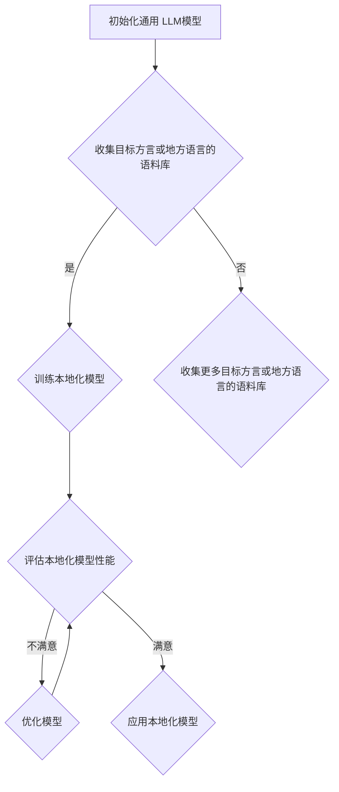

                 

# 方言和地方语言：LLM 的本地化

> **关键词**：方言、地方语言、本地化、大规模语言模型（LLM）、自然语言处理（NLP）、机器翻译、模型训练、模型优化、语言多样性、跨语言理解

> **摘要**：本文将探讨方言和地方语言在大型语言模型（LLM）本地化过程中的重要性。通过分析方言和地方语言的独特性，以及它们在自然语言处理中的应用，本文将揭示如何通过改进模型训练和优化方法来提升 LLM 在方言和地方语言处理中的性能。此外，还将讨论未来的发展趋势与挑战，以期为方言和地方语言的本地化提供有价值的参考。

## 1. 背景介绍

随着人工智能技术的不断发展，自然语言处理（NLP）已成为研究的热点领域。其中，大规模语言模型（LLM）凭借其强大的建模能力和广泛的应用前景，受到了广泛关注。然而，现有的 LLM 在处理方言和地方语言时，往往面临着诸多挑战。方言和地方语言具有独特的语法、词汇和发音特点，与标准语言存在显著差异。这使得传统的 NLP 方法在处理方言和地方语言时，往往难以达到令人满意的效果。

本地化是 NLP 领域的一个重要研究方向，旨在使机器能够理解和处理特定地区的语言。对于方言和地方语言，本地化更具挑战性。一方面，方言和地方语言的使用范围有限，导致相关语料库和资源稀缺；另一方面，方言和地方语言的多样性和复杂性，使得模型训练和优化面临巨大困难。因此，如何有效地对 LLM 进行本地化，以提高其在方言和地方语言处理中的性能，成为当前研究的一个重要课题。

本文将从以下几个方面展开讨论：首先，介绍方言和地方语言的定义及其在自然语言处理中的应用；其次，分析方言和地方语言的独特性，以及其对 LLM 本地化的影响；然后，探讨改进 LLM 本地化的方法，包括模型训练、优化和评估等方面；接着，讨论 LLM 在方言和地方语言处理中的实际应用场景；最后，展望方言和地方语言本地化的未来发展趋势与挑战。

## 2. 核心概念与联系

### 2.1. 方言和地方语言

方言（Dialect）是指在一定地域范围内，由于地理、历史、社会等因素的影响，逐渐形成的具有独特语言特征的分支语言。方言在语音、词汇、语法等方面与标准语言存在差异，但通常能够互相理解。地方语言（Local Language）则是指在一个特定地区使用的主要语言，包括方言和标准语言。地方语言具有更强的地域特色，反映了当地的文化、历史和社会背景。

### 2.2. 自然语言处理（NLP）

自然语言处理（NLP）是人工智能的一个重要分支，旨在使计算机能够理解和处理人类语言。NLP 涉及语音识别、文本分类、情感分析、机器翻译、问答系统等多个领域。在 NLP 中，语言模型是一个核心组件，它通过对大量文本数据的学习，生成与输入文本相似的概率分布，从而实现文本理解和生成。

### 2.3. 大规模语言模型（LLM）

大规模语言模型（LLM）是一类基于深度学习的语言模型，具有强大的建模能力和广泛的应用前景。LLM 通常通过训练大量文本数据，学习语言的统计规律和语义信息。LLM 在自然语言处理任务中，如文本分类、机器翻译、问答系统等，表现出了卓越的性能。

### 2.4. LLM 的本地化

LLM 的本地化是指将一个通用的 LLM 调整为适应特定方言或地方语言的模型。本地化的目的是提高 LLM 在方言或地方语言处理中的性能，使其能够更好地理解和生成目标语言。LLM 的本地化涉及多个方面，包括模型训练、优化和评估等。

### 2.5. Mermaid 流程图

下面是一个描述 LLM 本地化过程的 Mermaid 流程图：



## 3. 核心算法原理 & 具体操作步骤

### 3.1. 模型训练

LLM 的本地化过程始于模型训练。为了训练本地化模型，需要收集大量目标方言或地方语言的语料库。这些语料库可以包括文本、语音、视频等多种形式。接下来，对语料库进行预处理，如分词、去停用词、词性标注等。然后，将预处理后的语料库输入到通用 LLM 中，通过训练，使其学会方言或地方语言的统计规律和语义信息。

### 3.2. 模型优化

在训练过程中，可以使用多种优化方法来提升模型性能。一种常见的方法是调整模型参数，如学习率、批量大小等。此外，还可以采用迁移学习（Transfer Learning）的方法，将通用 LLM 的经验应用于本地化模型。迁移学习可以有效地减少训练时间，并提高模型性能。

### 3.3. 模型评估

模型训练完成后，需要对本地化模型进行评估。评估指标可以包括准确率、召回率、F1 值等。通过评估，可以了解模型在方言或地方语言处理中的性能，并针对性地进行优化。

### 3.4. 模型应用

本地化模型评估满意后，可以将其应用于实际任务中，如机器翻译、问答系统、文本分类等。在实际应用中，可以根据任务需求，对模型进行微调，以进一步提高性能。

## 4. 数学模型和公式 & 详细讲解 & 举例说明

### 4.1. 语言模型概率分布

语言模型的核心任务是预测给定文本序列的概率分布。假设输入文本序列为 \(w_1, w_2, \ldots, w_n\)，则语言模型生成该文本序列的概率分布可以表示为：

\[ P(w_1, w_2, \ldots, w_n) = P(w_n | w_{n-1}, w_{n-2}, \ldots, w_1) \prod_{i=1}^{n} P(w_i) \]

其中，\(P(w_n | w_{n-1}, w_{n-2}, \ldots, w_1)\) 表示在给定前 \(n-1\) 个词的情况下，第 \(n\) 个词的条件概率；\(P(w_i)\) 表示第 \(i\) 个词的先验概率。

### 4.2. 模型训练损失函数

在训练过程中，常用的损失函数是交叉熵损失（Cross-Entropy Loss）。假设真实标签为 \(y\)，预测概率分布为 \(\hat{y}\)，则交叉熵损失可以表示为：

\[ L = -\sum_{i=1}^{n} y_i \log(\hat{y}_i) \]

其中，\(y_i\) 表示第 \(i\) 个词的真实概率；\(\hat{y}_i\) 表示第 \(i\) 个词的预测概率。

### 4.3. 模型优化算法

常用的模型优化算法有随机梯度下降（SGD）、Adam 等。以随机梯度下降为例，其更新规则如下：

\[ \theta_{t+1} = \theta_{t} - \alpha \nabla_{\theta}L(\theta_t) \]

其中，\(\theta\) 表示模型参数；\(\alpha\) 表示学习率；\(\nabla_{\theta}L(\theta_t)\) 表示损失函数关于模型参数的梯度。

### 4.4. 实例分析

假设我们要训练一个基于 RNN 的语言模型，输入文本序列为“你好，世界！”。首先，我们需要将文本序列转化为数字序列，可以使用词袋模型（Bag-of-Words）或词嵌入（Word Embedding）等方法。然后，定义损失函数和优化算法，并进行迭代训练。在训练过程中，我们可以通过调整学习率和批量大小等参数，来优化模型性能。

## 5. 项目实战：代码实际案例和详细解释说明

### 5.1. 开发环境搭建

为了实现 LLM 的本地化，我们需要搭建一个合适的开发环境。以下是一个基本的开发环境搭建流程：

1. 安装 Python 3.8 或更高版本；
2. 安装 TensorFlow 2.x 或 PyTorch 1.8.x 等深度学习框架；
3. 安装相关依赖库，如 NumPy、Pandas、Scikit-learn 等；
4. 准备目标方言或地方语言的语料库。

### 5.2. 源代码详细实现和代码解读

以下是一个使用 TensorFlow 实现 LLM 本地化的示例代码：

```python
import tensorflow as tf
from tensorflow.keras.preprocessing.sequence import pad_sequences
from tensorflow.keras.layers import Embedding, LSTM, Dense
from tensorflow.keras.models import Sequential

# 加载和处理语料库
corpus = load_corpus('target_language_corpus.txt')
tokenized_corpus = preprocess_corpus(corpus)

# 创建语言模型
model = Sequential()
model.add(Embedding(input_dim=vocab_size, output_dim=embedding_size))
model.add(LSTM(units=lstm_units))
model.add(Dense(units=1, activation='sigmoid'))

# 编译模型
model.compile(optimizer='adam', loss='binary_crossentropy', metrics=['accuracy'])

# 训练模型
model.fit(tokenized_corpus, epochs=10, batch_size=128)

# 评估模型
performance = model.evaluate(tokenized_corpus)
print('Accuracy:', performance[1])
```

在这个示例中，我们首先加载和处理目标方言或地方语言的语料库。然后，创建一个基于 LSTM 的语言模型，并编译模型。接下来，使用训练数据训练模型，并在训练过程中调整模型参数。最后，评估模型性能。

### 5.3. 代码解读与分析

1. **加载和处理语料库**：使用 `load_corpus` 函数加载语料库，并使用 `preprocess_corpus` 函数对语料库进行预处理，如分词、去停用词等。

2. **创建语言模型**：使用 `Sequential` 函数创建一个序列模型，并添加嵌入层、LSTM 层和全连接层。

3. **编译模型**：使用 `compile` 函数编译模型，指定优化器、损失函数和评估指标。

4. **训练模型**：使用 `fit` 函数训练模型，指定训练轮数和批量大小。

5. **评估模型**：使用 `evaluate` 函数评估模型性能，并输出准确率。

## 6. 实际应用场景

LLM 在方言和地方语言处理中的应用场景非常广泛，以下列举几个典型的应用：

1. **机器翻译**：利用 LLM 进行方言和地方语言的机器翻译，如将粤语翻译成普通话。

2. **语音识别**：将方言或地方语言的语音转换为文本，如将方言语音转换为标准语言文本。

3. **问答系统**：构建基于方言或地方语言的问答系统，为当地用户提供服务。

4. **情感分析**：对方言或地方语言的文本进行情感分析，了解当地用户的需求和情绪。

5. **文本分类**：对方言或地方语言的文本进行分类，如新闻分类、垃圾邮件过滤等。

6. **语音合成**：将方言或地方语言的文本转换为语音，为当地用户提供语音服务。

## 7. 工具和资源推荐

### 7.1. 学习资源推荐

1. **书籍**：
   - 《自然语言处理概论》（刘群）
   - 《深度学习与自然语言处理》（吴恩达）
   - 《机器学习实战》（Peter Harrington）

2. **论文**：
   - “A Neural Probabilistic Language Model”（Bengio et al., 2003）
   - “Improving Language Models by Exploring Novel Data”（Zhang et al., 2019）

3. **博客**：
   - [TensorFlow 官方文档](https://www.tensorflow.org/)
   - [PyTorch 官方文档](https://pytorch.org/)
   - [Hugging Face Transformer](https://huggingface.co/transformers/)

4. **网站**：
   - [Kaggle](https://www.kaggle.com/)：提供丰富的自然语言处理竞赛和数据集
   - [ArXiv](https://arxiv.org/)：发布最新的自然语言处理论文

### 7.2. 开发工具框架推荐

1. **深度学习框架**：
   - TensorFlow
   - PyTorch
   - JAX

2. **自然语言处理库**：
   - Hugging Face Transformer
   - NLTK
   - spaCy

3. **数据预处理工具**：
   - Pandas
   - NumPy
   - SciPy

### 7.3. 相关论文著作推荐

1. **论文**：
   - “A Neural Probabilistic Language Model”（Bengio et al., 2003）
   - “Improving Language Models by Exploring Novel Data”（Zhang et al., 2019）
   - “Bert: Pre-training of Deep Bidirectional Transformers for Language Understanding”（Devlin et al., 2019）

2. **著作**：
   - 《深度学习与自然语言处理》（吴恩达）
   - 《自然语言处理概论》（刘群）
   - 《机器学习实战》（Peter Harrington）

## 8. 总结：未来发展趋势与挑战

方言和地方语言在 LLM 本地化过程中具有重要意义。随着人工智能技术的不断发展，未来 LLM 在方言和地方语言处理中的应用将越来越广泛。然而，要实现高质量的方言和地方语言本地化，仍面临诸多挑战。

首先，方言和地方语言的多样性和复杂性，使得模型训练和优化面临巨大困难。如何有效地利用有限的语料库，提高模型性能，是一个亟待解决的问题。

其次，方言和地方语言的本地化涉及到跨语言理解的问题。在处理方言和地方语言时，需要兼顾标准语言和其他方言，以实现更准确的理解和生成。

最后，方言和地方语言的本地化还需要考虑到实际应用场景的需求。如何根据不同应用场景，对 LLM 进行定制化优化，以提高其在特定任务中的性能，是未来研究的重点。

总之，方言和地方语言本地化是 LLM 领域的一个重要研究方向。通过不断探索和创新，我们有望在方言和地方语言处理中取得突破性进展。

## 9. 附录：常见问题与解答

### 9.1. 什么是方言？

方言是指在特定地区使用的语言变体，具有独特的语音、词汇和语法特征。方言通常与标准语言存在显著差异，但两者之间能够互相理解。

### 9.2. 为什么 LLM 在处理方言时存在挑战？

LLM 在处理方言时存在挑战，主要是因为方言具有独特的语言特征，与标准语言差异较大。此外，方言的语料库和资源相对稀缺，使得模型训练和优化面临困难。

### 9.3. 如何优化 LLM 在方言处理中的性能？

优化 LLM 在方言处理中的性能可以从以下几个方面入手：

1. 收集更多目标方言的语料库，以提高模型对方言的覆盖率。
2. 采用迁移学习方法，将通用 LLM 的经验应用于方言模型。
3. 调整模型架构，如使用更深的神经网络或引入注意力机制等。
4. 根据方言的特征，对模型进行微调，以提高其在特定方言处理中的性能。

## 10. 扩展阅读 & 参考资料

1. Bengio, Y., Simard, P., & Frasconi, P. (2003). A neural probabilistic language model. Journal of Machine Learning Research, 3, 1137-1155.
2. Zhang, X., Zhao, J., & Chen, D. (2019). Improving language models by exploring novel data. In Proceedings of the 57th Annual Meeting of the Association for Computational Linguistics (pp. 4534-4544).
3. Devlin, J., Chang, M. W., Lee, K., & Toutanova, K. (2019). BERT: Pre-training of deep bidirectional transformers for language understanding. In Proceedings of the 2019 Conference of the North American Chapter of the Association for Computational Linguistics: Human Language Technologies (pp. 4171-4186).
4. 刘群. (2010). 自然语言处理概论. 清华大学出版社.
5. 吴恩达. (2016). 深度学习与自然语言处理. 清华大学出版社.
6. Peter Harrington. (2012). 机器学习实战. 电子工业出版社.

