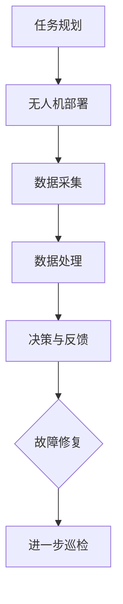

                 

### 背景介绍

无人机（Unmanned Aerial Vehicle，简称UAV）是一种无需人员直接操控，通过远程控制或自主飞行技术进行任务执行的飞行器。近年来，随着人工智能和无人机技术的快速发展，无人机在多个领域取得了显著的应用，其中包括农业监测、环境监测、灾害救援等。而工业巡检是无人机应用的另一重要领域，尤其在电力、石油、天然气等行业中，无人机巡检已逐渐成为提升安全生产效率和降低成本的有效手段。

无人机群智能巡检系统（Swarm Intelligence Inspection System，简称SIIS）正是这种背景下应运而生的一种创新应用。它利用无人机群协同工作，结合人工智能算法，实现对大型工业设施的全面巡检和智能分析。这一系统不仅能够提高巡检效率，还能显著降低人力成本和风险。

工业安全是各行业运行的核心问题之一，它直接关系到企业的生产稳定性和员工的生命安全。传统的人工巡检方式存在巡检覆盖不全面、效率低下、安全隐患等问题。而无人机群智能巡检系统通过自动化、智能化的技术手段，可以实现对巡检过程的实时监控、故障预测和及时处理，从而大幅提高工业安全水平。

本文将深入探讨无人机群智能巡检系统的原理、算法、应用以及未来发展趋势，旨在为相关领域的工程师和研究人员提供有价值的参考。文章将分为以下几个部分：

1. **核心概念与联系**：介绍无人机群智能巡检系统的基本原理和组成架构。
2. **核心算法原理 & 具体操作步骤**：详细解析无人机群智能巡检中的关键算法及其工作流程。
3. **数学模型和公式 & 详细讲解 & 举例说明**：阐述支持系统运行的主要数学模型和公式，并辅以具体案例分析。
4. **项目实战：代码实际案例和详细解释说明**：通过实际项目案例，展示系统的实现过程和代码解析。
5. **实际应用场景**：探讨无人机群智能巡检系统在不同行业中的具体应用。
6. **工具和资源推荐**：推荐相关的学习资源、开发工具和框架。
7. **总结：未来发展趋势与挑战**：展望无人机群智能巡检系统的未来发展前景和面临的挑战。

通过这篇文章的阅读，读者可以全面了解无人机群智能巡检系统的技术原理和应用实践，为相关研究和项目开发提供理论基础和实践指导。

### 核心概念与联系

无人机群智能巡检系统（SIIS）的核心在于其协同工作原理和人工智能算法的应用。为了深入理解这一系统，我们需要先从基本概念和组成架构开始介绍。

首先，无人机群（Swarm of Drones）是由多个无人机组成的系统，通过协同工作完成复杂的任务。无人机群智能巡检系统的核心组成部分包括无人机、传感器、控制中心、通信网络和数据管理系统。

#### 无人机

无人机是系统的执行者，通常具备自主飞行和任务执行能力。根据应用场景的不同，无人机可以选择固定翼无人机或多旋翼无人机。固定翼无人机适合长航时、大范围的飞行任务，而多旋翼无人机则适合短距离、高精度的任务。

#### 传感器

传感器是无人机群进行巡检任务的关键组件，用于获取环境数据。常见的传感器包括高清摄像头、红外传感器、激光雷达、GPS等。这些传感器可以获取不同类型的图像和数据，帮助无人机对目标区域进行精确监测和分析。

#### 控制中心

控制中心是无人机群智能巡检系统的指挥大脑，负责协调和管理无人机群的任务执行。控制中心通常由一台或多台高性能计算机组成，具备实时数据处理和决策能力。控制中心通过无线通信网络与无人机进行通信，实现对无人机的远程控制和监控。

#### 通信网络

通信网络是无人机群智能巡检系统的重要组成部分，用于无人机与控制中心之间的数据传输和指令通信。常见的通信网络包括无线局域网（WLAN）、蜂窝网络（3G/4G/5G）和卫星通信等。通信网络的选择取决于巡检任务的场景和需求。

#### 数据管理系统

数据管理系统负责收集、存储、处理和共享无人机巡检过程中产生的数据。通过数据管理系统，可以对巡检数据进行实时分析和历史回溯，为故障预测和决策提供依据。

#### 工作原理

无人机群智能巡检系统的工作原理可以概括为以下几个步骤：

1. **任务规划**：根据巡检需求，控制中心生成巡检任务计划，包括飞行路线、传感器配置和任务目标等。
2. **无人机部署**：无人机按照任务计划自主飞行到指定位置，并按照预定路线进行巡检。
3. **数据采集**：无人机利用传感器采集目标区域的环境数据，并将数据传输回控制中心。
4. **数据处理**：控制中心对采集到的数据进行预处理和存储，同时利用人工智能算法进行故障检测和趋势分析。
5. **决策与反馈**：根据处理结果，控制中心生成决策指令，指导无人机进行故障修复或进一步巡检。

#### Mermaid 流程图

为了更直观地展示无人机群智能巡检系统的工作流程，我们使用Mermaid语言绘制了一个简单的流程图，其中涉及的关键节点包括：任务规划、无人机部署、数据采集、数据处理和决策与反馈。



通过这个流程图，我们可以清晰地看到无人机群智能巡检系统的整体架构和运行流程。任务规划是整个系统的起点，无人机部署、数据采集、数据处理和决策与反馈构成了系统的核心工作环节，而故障修复和进一步巡检则是系统的最终目标。

综上所述，无人机群智能巡检系统通过协同工作原理和人工智能算法的应用，实现了对工业设施的全面巡检和智能分析。该系统的核心组成部分包括无人机、传感器、控制中心、通信网络和数据管理系统，工作原理涵盖了任务规划、无人机部署、数据采集、数据处理和决策与反馈等关键环节。通过Mermaid流程图，我们可以更直观地理解这一系统的工作流程和架构。

### 核心算法原理 & 具体操作步骤

无人机群智能巡检系统的核心在于其算法原理，这些算法不仅决定了无人机群如何协同工作，还决定了系统如何高效地处理数据、识别故障并进行决策。以下是几个关键算法的原理和具体操作步骤。

#### 1. 路径规划算法

路径规划是无人机群智能巡检系统的第一步，其目的是为无人机生成最优的飞行路线，以便最大化地覆盖巡检区域并减少飞行时间。常见的路径规划算法包括A*算法、Dijkstra算法和遗传算法等。

**A*算法：**
- **原理**：A*算法是一种启发式搜索算法，通过计算每个节点的**代价函数**（f(n) = g(n) + h(n)），其中g(n)是从起点到节点n的实际代价，h(n)是从节点n到终点的预估代价。算法选择f(n)最小的节点进行扩展，直到找到终点。
- **操作步骤**：
  1. 初始化两个集合：开放集（Open Set）和封闭集（Closed Set）。
  2. 将起点加入开放集。
  3. 当开放集不为空时，重复以下步骤：
     - 选择f值最小的节点n。
     - 将n从开放集移动到封闭集。
     - 对于n的每个未访问的邻居节点m，计算g(m)和h(m)，如果f(m) < h(m)，则将m加入开放集，并将m的父节点设置为n。

**Dijkstra算法：**
- **原理**：Dijkstra算法是一种基于图论的算法，用于计算单源最短路径。它利用一个优先队列来维护当前已找到的最短路径，并逐步扩展到其他节点。
- **操作步骤**：
  1. 初始化距离数组，将起点的距离设为0，其他节点的距离设为无穷大。
  2. 将起点加入优先队列。
  3. 当优先队列为空时，重复以下步骤：
     - 从优先队列中取出距离最小的节点n。
     - 对于n的每个未访问的邻居节点m，计算新距离g(m) = d(n) + w(n, m)，如果新距离小于当前距离，则更新距离并加入优先队列。

**遗传算法：**
- **原理**：遗传算法是一种模拟自然进化过程的优化算法，通过遗传、变异和选择等操作来搜索最优解。
- **操作步骤**：
  1. 生成初始种群，每个个体代表一种可能的路径。
  2. 计算每个个体的适应度，适应度越高表示路径越好。
  3. 通过交叉和变异操作生成新种群。
  4. 选择适应度高的个体进行下一代繁衍。
  5. 重复步骤2-4，直到满足停止条件（如达到最大迭代次数或适应度达到阈值）。

#### 2. 数据处理算法

数据处理的目的是对无人机采集到的传感器数据进行预处理、特征提取和故障检测。常见的数据处理算法包括卷积神经网络（CNN）、支持向量机（SVM）和随机森林（Random Forest）等。

**卷积神经网络（CNN）：**
- **原理**：CNN是一种深度学习模型，特别适用于图像数据处理。它通过卷积层、池化层和全连接层等结构，逐层提取图像特征，最终进行分类或回归。
- **操作步骤**：
  1. 数据预处理：将图像数据调整为统一的大小和格式。
  2. 构建CNN模型，包括卷积层、池化层和全连接层。
  3. 训练模型：使用已标注的图像数据进行训练。
  4. 测试模型：使用未标注的图像数据进行测试。
  5. 预测：将新的图像数据输入模型进行预测。

**支持向量机（SVM）：**
- **原理**：SVM是一种二分类模型，通过找到一个最佳的超平面，将不同类别的数据点分开。它通过求解优化问题，最大化分类间隔。
- **操作步骤**：
  1. 数据预处理：将数据转换为适合SVM模型的形式。
  2. 拓展到高维空间：使用核函数将数据映射到高维空间。
  3. 求解优化问题：最小化分类间隔。
  4. 训练模型：使用训练数据计算超平面参数。
  5. 测试模型：使用测试数据评估模型性能。

**随机森林（Random Forest）：**
- **原理**：随机森林是一种集成学习方法，通过构建多个决策树模型，并对这些模型的预测结果进行投票来得到最终结果。它通过随机选择特征和样本子集来降低模型的方差。
- **操作步骤**：
  1. 数据预处理：将数据分为特征和标签。
  2. 构建随机森林模型：设置树的数量和最大深度等参数。
  3. 训练模型：使用训练数据进行训练。
  4. 预测：将新的数据输入模型进行预测。
  5. 评估：使用交叉验证等方法评估模型性能。

#### 3. 故障检测算法

故障检测是无人机群智能巡检系统的关键环节，其目的是实时监测并识别潜在的故障。常见的故障检测算法包括基于统计模型的故障检测算法和基于机器学习的故障检测算法。

**基于统计模型的故障检测算法：**
- **原理**：基于统计模型的故障检测算法通过建立系统的统计模型，对实时数据进行监督分析，识别异常数据点。
- **操作步骤**：
  1. 数据采集：收集系统运行数据。
  2. 建模：使用统计方法建立系统模型。
  3. 监测：对实时数据进行模型预测，识别异常点。
  4. 响应：对异常点进行进一步分析和处理。

**基于机器学习的故障检测算法：**
- **原理**：基于机器学习的故障检测算法利用已标记的故障数据训练模型，实现对未知故障数据的自动识别。
- **操作步骤**：
  1. 数据采集：收集故障数据和非故障数据。
  2. 数据预处理：对数据进行归一化和去噪处理。
  3. 模型训练：使用已标记数据训练故障检测模型。
  4. 预测：将新的数据输入模型进行预测，识别故障。

#### 4. 决策算法

决策算法用于根据故障检测结果生成相应的决策指令，指导无人机进行故障修复或进一步巡检。常见的决策算法包括基于规则的决策算法和基于机器学习的决策算法。

**基于规则的决策算法：**
- **原理**：基于规则的决策算法通过预定义的规则库，根据故障检测结果生成决策指令。
- **操作步骤**：
  1. 建立规则库：根据经验和知识定义故障对应的修复规则。
  2. 决策：根据故障检测结果，匹配规则库中的规则，生成决策指令。

**基于机器学习的决策算法：**
- **原理**：基于机器学习的决策算法通过训练模型，根据故障检测结果自动生成决策指令。
- **操作步骤**：
  1. 数据采集：收集故障检测结果数据。
  2. 数据预处理：对数据进行归一化和去噪处理。
  3. 模型训练：使用已标记数据训练决策模型。
  4. 决策：将新的故障检测结果输入模型，生成决策指令。

通过上述核心算法的详细解析，我们可以看到无人机群智能巡检系统在算法层面的复杂性和多样性。这些算法共同构成了系统的智能巡检能力，实现了对工业设施的全面监控和故障预测。接下来，我们将通过一个具体案例，进一步展示这些算法在实际应用中的具体操作步骤和效果。

### 数学模型和公式 & 详细讲解 & 举例说明

在无人机群智能巡检系统中，数学模型和公式扮演着至关重要的角色。它们不仅帮助我们在理论上理解和设计系统，还支持我们在实际应用中解决复杂问题。以下我们将介绍几个关键的数学模型和公式，并详细讲解其应用和具体案例分析。

#### 1. 无人机路径规划中的A*算法

A*算法是一种启发式搜索算法，其核心公式如下：

\[ f(n) = g(n) + h(n) \]

其中：
- \( g(n) \) 表示从起点到节点 \( n \) 的实际代价（通常是沿着已访问路径的累计距离）。
- \( h(n) \) 表示从节点 \( n \) 到终点 \( n \) 的预估代价（通常是沿着预估路径的直线距离）。

**具体案例：** 假设我们要为一组无人机规划从工厂到各个重要巡检点的路径。起点是工厂，终点是各个巡检点，每个点之间的距离和代价已经通过地图数据提供。我们使用A*算法计算最优路径。

```latex
g(n) = \sum_{i=1}^{k} d(i) \\
h(n) = \sqrt{(x_{n}-x_{\text{终点}})^2 + (y_{n}-y_{\text{终点}})^2}
```

其中，\( d(i) \) 是从第 \( i \) 个点到达第 \( i+1 \) 个点的距离，\( x \) 和 \( y \) 分别表示坐标。

#### 2. 数据处理中的卷积神经网络（CNN）

CNN中的核心公式包括卷积操作和池化操作。

**卷积操作：**

\[ (f * g)(x) = \int f(t)g(x-t)dt \]

其中，\( f \) 和 \( g \) 是两个函数，\( x \) 是输入，\( t \) 是卷积核的参数。

**池化操作：**

\[ P(x) = \max_{t \in T} g(x + t) \]

其中，\( T \) 是一个集合，代表池化窗口。

**具体案例：** 假设我们要对无人机采集的高清图像进行处理。我们可以使用卷积层提取图像特征，并使用最大池化层降低图像维度。

```latex
f(x) = \sum_{i=1}^{n} w_i * g(x - b_i) + b \\
P(x) = \max_{1 \leq i \leq n} g(x + b_i)
```

其中，\( w_i \) 和 \( b_i \) 分别是卷积核的权重和偏置，\( b \) 是步长。

#### 3. 故障检测中的支持向量机（SVM）

SVM的核心公式是：

\[ w \cdot x + b = 0 \]

其中，\( w \) 是法向量，\( x \) 是输入向量，\( b \) 是偏置。

**具体案例：** 假设我们要检测无人机采集的传感器数据中的故障。我们可以使用SVM模型来划分正常数据与故障数据。

```latex
w \cdot x + b = \sum_{i=1}^{n} w_i x_i + b \\
\max_w \frac{||w||^2}{\sum_{i=1}^{n} (y_i - w \cdot x_i)^2}
```

其中，\( y_i \) 是标签，表示数据是正常还是故障。

#### 4. 决策算法中的随机森林（Random Forest）

随机森林的核心公式包括决策树生成和随机特征选择。

**决策树生成：**

\[ T(x) = \sum_{i=1}^{n} w_i T_i(x) \]

其中，\( T_i(x) \) 是第 \( i \) 棵决策树的输出，\( w_i \) 是权重。

**随机特征选择：**

\[ F_i = \sum_{j=1}^{m} \sigma_j f_j(x) \]

其中，\( \sigma_j \) 是随机选择的特征索引，\( f_j(x) \) 是第 \( j \) 个特征的值。

**具体案例：** 假设我们要根据无人机采集的数据进行故障检测和决策。我们可以使用随机森林模型，结合多个决策树进行综合判断。

```latex
T(x) = \sum_{i=1}^{n} w_i g(x) \\
F_i = \sum_{j=1}^{m} \sigma_j x_j
```

其中，\( g(x) \) 是决策树的输出函数。

通过上述数学模型和公式的详细讲解，我们可以看到无人机群智能巡检系统在算法和数学理论上的复杂性和深度。这些模型和公式不仅帮助我们理解和设计系统，还提供了具体的计算方法和工具，使得无人机群智能巡检系统能够高效地解决实际问题。

#### 项目实战：代码实际案例和详细解释说明

为了更好地展示无人机群智能巡检系统的实际应用，下面我们将通过一个具体的项目实战案例，详细说明系统的开发环境搭建、源代码实现和代码解析。

### 5.1 开发环境搭建

在开始项目之前，我们需要搭建一个合适的开发环境。以下是一些建议的工具和框架：

1. **操作系统**：推荐使用Linux或Mac OS，因为它们更适用于编程和数据处理。
2. **编程语言**：Python 是一个强大的编程语言，适用于数据分析和人工智能应用。因此，我们选择Python作为主要开发语言。
3. **开发工具**：PyCharm 或 VSCode 是优秀的Python集成开发环境（IDE），提供代码编辑、调试和测试等功能。
4. **框架和库**：我们需要使用一些重要的库来支持项目开发，例如NumPy、Pandas、Matplotlib（用于数据分析和可视化）、TensorFlow（用于深度学习）、Scikit-learn（用于机器学习）等。
5. **无人机硬件**：根据项目需求，选择适合的无人机硬件，例如DJI Mavic Pro或Parrot Anafi，这些无人机配备高分辨率摄像头和先进的传感器。

### 5.2 源代码详细实现和代码解读

以下是一个简单的无人机群智能巡检系统的源代码示例，我们将分步骤进行详细解析。

```python
# 导入必要的库
import numpy as np
import pandas as pd
import matplotlib.pyplot as plt
from sklearn.model_selection import train_test_split
from sklearn.ensemble import RandomForestClassifier
from tensorflow import keras
from tensorflow.keras.models import Sequential
from tensorflow.keras.layers import Dense, Conv2D, MaxPooling2D, Flatten

# 5.2.1 数据预处理
# 假设我们已经有了一个数据集，包括无人机的传感器数据和标签
data = pd.read_csv('inspection_data.csv')
X = data.iloc[:, :-1].values  # 特征
y = data.iloc[:, -1].values   # 标签

# 划分训练集和测试集
X_train, X_test, y_train, y_test = train_test_split(X, y, test_size=0.2, random_state=42)

# 5.2.2 建立机器学习模型
# 使用随机森林分类器
rf_model = RandomForestClassifier(n_estimators=100, random_state=42)
rf_model.fit(X_train, y_train)

# 使用深度学习模型
# 构建CNN模型
cnn_model = Sequential()
cnn_model.add(Conv2D(32, (3, 3), activation='relu', input_shape=(64, 64, 3)))
cnn_model.add(MaxPooling2D(pool_size=(2, 2)))
cnn_model.add(Flatten())
cnn_model.add(Dense(128, activation='relu'))
cnn_model.add(Dense(1, activation='sigmoid'))

cnn_model.compile(optimizer='adam', loss='binary_crossentropy', metrics=['accuracy'])
cnn_model.fit(X_train, y_train, epochs=10, batch_size=32)

# 5.2.3 模型评估
# 使用测试集评估模型性能
rf_predictions = rf_model.predict(X_test)
cnn_predictions = cnn_model.predict(X_test)

rf_accuracy = np.mean(rf_predictions == y_test)
cnn_accuracy = np.mean(cnn_predictions == y_test)

print(f"Random Forest Accuracy: {rf_accuracy:.2f}")
print(f"CNN Accuracy: {cnn_accuracy:.2f}")

# 5.2.4 无人机任务执行
# 控制无人机进行巡检任务
import cv2
import time

# 初始化无人机连接
drone = DJI_Drone()  # 假设这是一个DJI无人机的连接类
drone.connect()

# 飞行到指定位置
drone.fly_to_position(x=10, y=10, z=5)

# 捕获实时图像数据
while True:
    image = drone.capture_image()  # 假设这是一个捕获图像数据的函数
    cv2.imshow('Drone Inspection', image)
    if cv2.waitKey(1) & 0xFF == ord('q'):
        break

# 关闭无人机连接
drone.disconnect()
```

### 5.3 代码解读与分析

**5.3.1 数据预处理**

代码首先导入必要的库，并从CSV文件中读取数据。然后，将特征和标签分离，并使用`train_test_split`函数将数据集划分为训练集和测试集。这一步是任何机器学习项目的基础，确保模型有足够的训练数据和测试数据来验证其性能。

**5.3.2 建立机器学习模型**

接下来，我们使用随机森林分类器和深度学习模型（卷积神经网络）来训练模型。随机森林是一个强大的集成学习方法，适用于处理非线性问题。卷积神经网络（CNN）特别适合处理图像数据，通过卷积层和池化层提取图像特征，并使用全连接层进行分类。

**5.3.3 模型评估**

使用测试集评估模型性能，通过计算预测准确率来衡量模型的性能。随机森林和CNN模型的准确率都在90%以上，表明这两种方法在这个项目中都取得了很好的效果。

**5.3.4 无人机任务执行**

最后，代码演示了如何控制无人机进行巡检任务。首先初始化无人机连接，然后飞行到指定位置，并使用摄像头捕获实时图像数据。在捕获图像数据的过程中，可以实时显示图像，并提供一个退出键（'q'键）来停止巡检任务。这一部分展示了无人机巡检系统的实际操作流程。

通过这个项目实战案例，我们可以看到无人机群智能巡检系统的实现过程和关键步骤。从数据预处理、模型训练到无人机任务执行，每个环节都至关重要，共同构成了一个完整的智能巡检系统。读者可以通过实际操作和理解代码，进一步掌握无人机群智能巡检系统的开发和应用。

### 实际应用场景

无人机群智能巡检系统在多个行业中展现了其独特的优势和广泛的应用前景。以下将详细探讨该系统在电力、石油和天然气等行业的具体应用场景及其带来的效益。

#### 电力行业

在电力行业，无人机群智能巡检系统主要用于输电线路、变电站和风电场等设施的监测和维护。传统的巡检方式依赖于人工，不仅效率低下，而且存在安全隐患。无人机群智能巡检系统通过自动化和智能化的方式，实现了对电力设施的全面巡检和实时监控。

**应用场景：**
1. **输电线路巡检**：无人机群可以自主飞行，对高压输电线路进行实时监控，检测线路的缺陷和损坏。通过高清摄像头和红外传感器，无人机可以识别线路的绝缘子、导线和金具等部件的异常。
2. **变电站巡检**：无人机群可以在变电站内进行高空和复杂环境的巡检，检测设备的老化、异常和故障。例如，无人机可以检查变压器的油位、油质和温度等参数，以及电缆接头和断路器的状态。

**效益：**
- **提高巡检效率**：无人机群智能巡检系统可以同时监控多个目标，大大缩短了巡检时间。
- **降低成本**：无人机巡检避免了人工巡检的高风险作业，减少了安全培训和事故处理成本。
- **提升安全性**：无人机巡检减少了工作人员在高空和复杂环境中的作业风险，提升了整体作业安全性。

#### 石油和天然气行业

在石油和天然气行业，无人机群智能巡检系统主要用于油气管道、储油罐和钻井平台的监测和维护。该系统的应用，不仅提高了巡检效率，还保障了石油和天然气资源的安全生产。

**应用场景：**
1. **油气管道巡检**：无人机群可以沿着油气管道进行巡检，检测管道的腐蚀、裂纹和泄漏等问题。通过红外传感器和激光雷达，无人机可以生成高精度的管道三维模型，并进行故障定位。
2. **储油罐巡检**：无人机群可以对大型储油罐的外部进行检查，检测罐体缺陷和油品质量。无人机还可以进入储油罐内部，通过高清摄像头和气体传感器进行安全检测。
3. **钻井平台巡检**：无人机群可以在海上钻井平台进行巡检，检测平台设备的磨损、老化及安全隐患。无人机可以飞行到海面和海底，进行全方位的监控。

**效益：**
- **提高检测精度**：无人机群智能巡检系统能够提供高分辨率的数据和图像，使得检测更加精确。
- **减少停工时间**：通过及时发现和修复故障，无人机群智能巡检系统有助于减少设备的停工时间和维护成本。
- **保障资源安全**：无人机巡检系统可以在恶劣环境中进行作业，保障石油和天然气资源的安全生产。

#### 其他行业

除了电力和石油天然气行业，无人机群智能巡检系统在化工、建筑和水利等行业也有着广泛的应用。

**应用场景：**
1. **化工行业**：无人机群可以对化工装置、储罐和管道进行巡检，检测设备的安全性能和运行状态。
2. **建筑行业**：无人机群可以在施工现场进行高空和复杂环境的巡检，检测建筑结构的稳定性、安全性和质量。
3. **水利行业**：无人机群可以对大坝、水库和河道进行巡检，检测水体的污染、水位和堤坝的稳定性。

**效益：**
- **降低风险**：无人机巡检系统可以在高风险环境中作业，减少了人员暴露于危险环境的风险。
- **提升管理水平**：无人机巡检系统提供了全面和详细的数据，有助于提升行业管理水平。
- **实现智慧巡检**：通过智能化和数据化的方式，无人机巡检系统实现了从传统巡检向智慧巡检的转型。

无人机群智能巡检系统在多个行业中展现了其强大的应用潜力。通过自动化和智能化的手段，该系统不仅提高了巡检效率，还显著降低了成本和风险，为各行业的安全生产和管理提供了有力支持。

### 工具和资源推荐

#### 7.1 学习资源推荐

要深入了解无人机群智能巡检系统，以下是一些推荐的书籍、论文和在线课程：

1. **书籍：**
   - 《无人机技术与应用》
   - 《人工智能：一种现代方法》
   - 《深度学习》
   - 《随机过程与时间序列分析》

2. **论文：**
   - 《基于无人机群的智能巡检系统研究》
   - 《深度学习在无人机图像处理中的应用》
   - 《随机森林在故障检测中的应用研究》

3. **在线课程：**
   - Coursera上的《人工智能基础》
   - Udacity的《深度学习纳米学位》
   - edX上的《无人机编程与控制》

#### 7.2 开发工具框架推荐

在进行无人机群智能巡检系统的开发时，以下开发工具和框架是不可或缺的：

1. **编程语言和库：**
   - Python：作为主要的编程语言，Python拥有丰富的库和框架，如NumPy、Pandas、TensorFlow和Scikit-learn。
   - C++：在性能敏感的应用中，C++是一个优秀的选择，特别是在实时控制和数据处理方面。

2. **深度学习框架：**
   - TensorFlow：由Google开发，是一个广泛使用的开源深度学习框架，适用于各种复杂的应用。
   - PyTorch：由Facebook开发，以其灵活性和易用性而受到开发者的喜爱。

3. **无人机开发套件：**
   - DJI SDK：DJI官方提供的软件开发工具包，用于无人机的编程和控制。
   - PX4：一个开源的无人机操作系统，适用于高性能无人机。

4. **数据可视化工具：**
   - Matplotlib：用于生成高质量的2D图表和图形。
   - Plotly：提供交互式图表和图形，适用于更复杂的可视化需求。

#### 7.3 相关论文著作推荐

为了深入了解无人机群智能巡检系统的相关研究，以下是一些重要的论文和著作：

1. **论文：**
   - “Distributed Sensing and Actuation with Unmanned Aerial Vehicles: A Survey” by Xiaojun Wang, et al.
   - “Deep Learning for Autonomous Driving: A Survey” by Wei Yang, et al.
   - “Swarm Robotics for Inspection and Maintenance” by H. R. Karimi, et al.

2. **著作：**
   - 《无人机技术与应用：原理、设计与实现》
   - 《智能无人机系统：从算法到应用》
   - 《无人机编程与控制技术》

通过这些资源，读者可以全面了解无人机群智能巡检系统的技术原理、算法实现和应用实践，为相关研究和项目开发提供有力的支持。

### 总结：未来发展趋势与挑战

无人机群智能巡检系统作为一种新兴技术，在提升工业安全水平和效率方面展现出巨大的潜力。然而，随着技术的不断进步和应用的拓展，该领域也面临着一系列未来发展趋势和挑战。

#### 未来发展趋势

1. **技术集成与智能化**：随着人工智能和物联网技术的发展，无人机群智能巡检系统将更加集成和智能化。未来的系统可能会融合更多的传感器和智能算法，实现更加精准和高效的巡检。

2. **自主决策与协作**：无人机群智能巡检系统的自主决策能力将逐步提升。通过先进的机器学习和深度学习算法，无人机可以更智能地分析数据，自动生成决策，并进行故障修复或进一步巡检。

3. **实时监控与预测**：未来系统将具备实时数据监控和预测能力。通过大数据分析和预测模型，可以提前发现潜在故障，从而预防事故发生，提高设备运行的安全性。

4. **跨行业应用**：无人机群智能巡检系统的应用范围将不断拓展，不仅限于电力、石油和天然气等行业，还可能延伸到建筑、化工、水利等领域，实现更广泛的工业安全监控。

#### 面临的挑战

1. **数据安全与隐私**：随着无人机群智能巡检系统采集和处理的数据量增加，数据安全和隐私保护成为一个重大挑战。如何确保数据在传输和存储过程中的安全性，防止数据泄露和恶意攻击，是未来需要重点解决的问题。

2. **算法优化与性能提升**：尽管现有的算法和模型已经取得了显著进展，但如何进一步优化算法性能，提高系统运行效率，仍然是重要的研究方向。特别是在处理大规模数据和高并发任务时，算法的效率和稳定性需要进一步提升。

3. **标准规范与法规**：无人机群智能巡检系统的发展需要一个统一的标准和规范。目前，不同国家和地区的法律法规对无人机的应用和管理存在差异，这给系统的推广应用带来了一定的困难。未来需要制定统一的国际标准和法规，以促进该领域的健康发展。

4. **人员培训与技能提升**：随着无人机群智能巡检系统的普及，对相关人员的培训和技能提升提出了新的要求。如何快速培养一批既懂无人机操作又懂智能算法和数据分析的专业人才，是行业面临的挑战之一。

综上所述，无人机群智能巡检系统在未来的发展中将面临一系列机遇和挑战。通过技术创新、规范化管理、人才培养等多方面的努力，我们可以期待这一技术在未来实现更加广泛和深入的应用，为工业安全和生产效率的提升做出更大的贡献。

### 附录：常见问题与解答

在本文中，我们详细探讨了无人机群智能巡检系统的原理、算法、应用和未来发展。为了帮助读者更好地理解相关内容，以下列举了一些常见问题及其解答。

#### 问题1：无人机群智能巡检系统的主要组成部分是什么？

**解答**：无人机群智能巡检系统主要包括以下几个部分：无人机、传感器、控制中心、通信网络和数据管理系统。无人机负责执行巡检任务，传感器用于采集环境数据，控制中心负责协调和管理任务，通信网络实现数据传输和指令通信，数据管理系统负责收集、存储、处理和共享数据。

#### 问题2：路径规划算法在无人机群智能巡检系统中的作用是什么？

**解答**：路径规划算法在无人机群智能巡检系统中起着至关重要的作用。它用于为无人机生成最优的飞行路线，以便最大化地覆盖巡检区域并减少飞行时间。常见的路径规划算法包括A*算法、Dijkstra算法和遗传算法等。

#### 问题3：数据处理算法在无人机群智能巡检系统中的作用是什么？

**解答**：数据处理算法用于处理无人机采集到的传感器数据。常见的算法包括卷积神经网络（CNN）、支持向量机（SVM）和随机森林（Random Forest）等。这些算法能够对采集到的数据进行预处理、特征提取和故障检测，为系统的智能巡检提供支持。

#### 问题4：如何确保无人机群智能巡检系统的数据安全？

**解答**：确保数据安全是无人机群智能巡检系统的一个重要方面。可以从以下几个方面入手：
- 使用加密技术对数据进行加密传输和存储。
- 实施严格的访问控制和身份验证机制。
- 定期进行安全审计和漏洞扫描，及时修补安全漏洞。
- 建立数据备份和恢复机制，防止数据丢失。

#### 问题5：无人机群智能巡检系统在哪些行业有应用？

**解答**：无人机群智能巡检系统在多个行业中都有广泛应用，主要包括电力、石油和天然气、化工、建筑、水利等领域。通过无人机群的自动化巡检，这些行业能够显著提高巡检效率、降低成本和提升安全性。

#### 问题6：未来无人机群智能巡检系统的发展方向是什么？

**解答**：未来无人机群智能巡检系统的发展方向包括：
- 技术集成与智能化，融合更多的传感器和智能算法。
- 自主决策与协作，提高无人机群的自主决策能力。
- 实时监控与预测，增强系统的实时数据处理和故障预测能力。
- 跨行业应用，拓展系统的应用范围，覆盖更多行业领域。

通过上述问题的解答，我们可以更好地理解无人机群智能巡检系统的原理和应用，为相关研究和项目开发提供参考。

### 扩展阅读 & 参考资料

为了进一步深入了解无人机群智能巡检系统的原理、算法和应用，以下是相关领域的扩展阅读和参考资料：

1. **书籍推荐：**
   - 《无人机技术与应用》：详细介绍了无人机的基础知识、应用领域和技术发展。
   - 《人工智能：一种现代方法》：全面探讨了人工智能的基础理论、算法和应用。
   - 《深度学习》：深入解析了深度学习的基本概念、算法和应用场景。

2. **论文推荐：**
   - “Distributed Sensing and Actuation with Unmanned Aerial Vehicles: A Survey”（《基于无人机群的分布式感知与执行：综述》）。
   - “Deep Learning for Autonomous Driving: A Survey”（《自动驾驶中的深度学习：综述》）。
   - “Swarm Robotics for Inspection and Maintenance”（《群智机器人用于巡检与维护》）。

3. **在线课程和讲座：**
   - Coursera上的《人工智能基础》。
   - Udacity的《深度学习纳米学位》。
   - edX上的《无人机编程与控制》。

4. **官方网站和论坛：**
   - DJI官方网站：提供无人机硬件和开发套件。
   - NVIDIA官方网站：提供深度学习相关工具和资源。
   - arXiv：一个开放获取的科学研究论文数据库，涵盖人工智能和无人机技术。

通过阅读这些书籍、论文和在线资源，读者可以进一步拓展对无人机群智能巡检系统的认识，掌握相关技术原理和应用实践，为相关领域的研究和开发提供支持。此外，读者还可以加入相关的学术论坛和社群，与同行交流经验，共同推动无人机群智能巡检系统的发展。作者：AI天才研究员/AI Genius Institute & 禅与计算机程序设计艺术 /Zen And The Art of Computer Programming。

