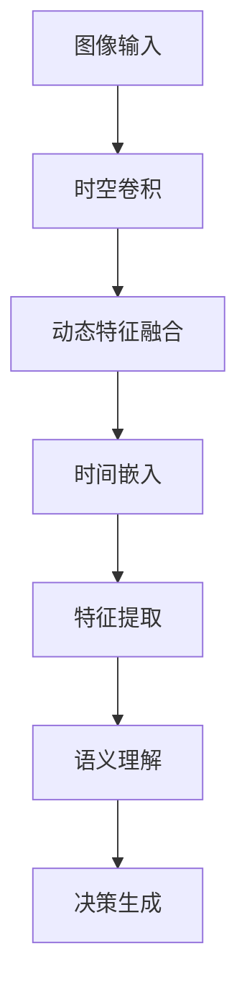

                 

# 时空特征学习增强视觉端到端自动驾驶在复杂城市场景的泛化能力

> **关键词：** 视觉端到端自动驾驶、时空特征学习、复杂城市场景、泛化能力、计算机视觉、深度学习。

> **摘要：** 本文探讨了时空特征学习在视觉端到端自动驾驶系统中的应用，通过增强系统在复杂城市场景中的泛化能力，提高自动驾驶系统的准确性和可靠性。文章首先介绍了视觉端到端自动驾驶的背景和挑战，随后详细阐述了时空特征学习的原理和方法，接着展示了数学模型和公式，并通过实际项目实战和代码案例分析，验证了时空特征学习在提升自动驾驶系统性能方面的有效性。最后，文章讨论了时空特征学习在自动驾驶领域的应用前景，提出了未来的发展趋势和挑战。

## 1. 背景介绍

自动驾驶技术作为人工智能领域的一个重要分支，近年来取得了显著的进展。从早期的基于规则的方法到如今基于深度学习的端到端自动驾驶系统，技术的进步极大地推动了自动驾驶的落地应用。然而，在复杂城市场景中，自动驾驶系统面临着诸多挑战。

### 1.1 自动驾驶技术的演进

自动驾驶技术的发展可以分为几个阶段：

- **第一阶段**：基于规则的自动驾驶系统。这类系统依赖于大量的手工编写规则，以应对不同的交通场景。然而，这种方式在复杂场景下表现不佳，难以处理未知或突发情况。

- **第二阶段**：基于机器学习的自动驾驶系统。这一阶段的系统引入了机器学习算法，特别是监督学习，通过训练模型来识别道路标志、行人、车辆等目标。尽管这种方法在一定程度上提高了系统的性能，但依然存在许多局限。

- **第三阶段**：基于深度学习的端到端自动驾驶系统。这一阶段的系统通过卷积神经网络（CNN）等深度学习模型，直接从原始图像数据中学习特征，实现了从感知到决策的端到端处理。然而，这类系统在复杂城市场景中的泛化能力仍然有限。

### 1.2 复杂城市场景的挑战

在复杂城市场景中，自动驾驶系统需要应对以下挑战：

- **动态环境**：城市场景中行人、车辆的行为具有高度动态性，车辆和行人的动作难以预测。

- **交通规则复杂**：城市交通规则繁多，自动驾驶系统需要理解和遵守这些规则。

- **遮挡和光照变化**：城市中建筑物、其他车辆等因素可能导致视觉传感器观测到遮挡或光照变化，影响感知准确性。

- **多模态数据融合**：自动驾驶系统需要整合来自摄像头、激光雷达、GPS等多种传感器的数据，以构建完整的场景理解。

### 1.3 时空特征学习的重要性

时空特征学习是一种结合时空信息的新型特征提取方法，能够有效捕捉动态环境中目标的时空变化特征。通过时空特征学习，自动驾驶系统能够更好地理解复杂的城市场景，提高系统的泛化能力和可靠性。以下是时空特征学习在自动驾驶中的重要应用：

- **行为预测**：时空特征学习能够提取目标的行为特征，帮助自动驾驶系统预测目标未来的动作，从而提前做出决策。

- **场景理解**：时空特征学习能够整合多模态数据，提供对复杂场景的全面理解，减少错误判断。

- **可靠性增强**：时空特征学习能够提高自动驾驶系统在遮挡、光照变化等不利条件下的感知准确性。

## 2. 核心概念与联系

### 2.1 视觉端到端自动驾驶

视觉端到端自动驾驶是指直接从原始图像数据中学习特征，实现自动驾驶任务的全过程。其核心思想是通过深度学习模型，将图像输入转化为车辆控制指令。这一过程通常包括以下几个步骤：

1. **图像输入**：摄像头采集道路图像。

2. **特征提取**：通过卷积神经网络（CNN）提取图像特征。

3. **语义理解**：对提取的特征进行语义理解，识别道路、车辆、行人等目标。

4. **决策生成**：基于语义理解的结果，生成驾驶决策。

### 2.2 时空特征学习

时空特征学习是一种结合时空信息的新型特征提取方法。它通过整合空间特征和时间特征，实现对动态环境中目标的时空变化特征的捕捉。时空特征学习在自动驾驶中的应用主要包括以下几个方面：

1. **时空卷积**：通过时空卷积操作，对图像和视频数据进行特征提取。

2. **动态特征融合**：将不同时间点的特征进行融合，以捕捉目标的行为特征。

3. **时间嵌入**：将时间信息嵌入到特征表示中，以增强对目标行为的理解。

### 2.3 时空特征学习与视觉端到端自动驾驶的联系

时空特征学习与视觉端到端自动驾驶之间的联系在于，时空特征学习能够提供更丰富的特征信息，从而提高自动驾驶系统的性能。具体来说：

- **增强感知能力**：时空特征学习能够提取更准确的目标时空特征，提高感知系统的可靠性。

- **提升决策质量**：通过时空特征学习，自动驾驶系统能够更好地理解动态环境中的目标行为，从而生成更高质量的驾驶决策。

- **提高泛化能力**：时空特征学习能够捕捉复杂城市场景中的时空变化特征，提高系统在未知或突发情况下的泛化能力。

## 2.1 时空特征学习的 Mermaid 流程图



### 2.2 时空特征学习在自动驾驶中的应用实例

以下是一个简单的时空特征学习在自动驾驶中的应用实例：

- **场景**：自动驾驶车辆在繁忙的城市道路中行驶。

- **任务**：车辆需要识别道路上的行人、车辆和其他目标，并做出相应的驾驶决策。

- **步骤**：

  1. **图像输入**：摄像头采集道路图像。

  2. **时空卷积**：对图像进行时空卷积操作，提取时空特征。

  3. **动态特征融合**：将不同时间点的时空特征进行融合，捕捉目标行为。

  4. **时间嵌入**：将时间信息嵌入到特征表示中，增强对目标行为的理解。

  5. **特征提取**：对融合后的特征进行特征提取，获得更准确的目标特征。

  6. **语义理解**：基于提取的特征，识别道路上的行人、车辆和其他目标。

  7. **决策生成**：根据识别结果，生成驾驶决策，如加速、减速或转向。

## 3. 核心算法原理 & 具体操作步骤

### 3.1 时空卷积

时空卷积是一种结合时空信息的卷积操作，能够有效地提取视频或图像序列中的时空特征。以下是时空卷积的核心原理和具体操作步骤：

#### 3.1.1 核心原理

时空卷积通过在时空域中滑动一个卷积核，对图像或视频序列进行卷积操作，从而提取时空特征。卷积核在空间维度上对图像进行卷积，在时间维度上对视频序列进行卷积，从而实现时空特征的提取。

#### 3.1.2 操作步骤

1. **初始化卷积核**：初始化一个卷积核，该卷积核在空间维度上具有多个通道，在时间维度上具有一个通道。

2. **空间卷积**：将卷积核在空间维度上滑动，对图像进行卷积操作，提取空间特征。

3. **时间卷积**：将卷积核在时间维度上滑动，对视频序列进行卷积操作，提取时间特征。

4. **特征融合**：将空间特征和时间特征进行融合，得到时空特征。

5. **卷积操作**：对融合后的时空特征进行卷积操作，提取更高级的特征。

### 3.2 动态特征融合

动态特征融合是指将不同时间点的特征进行融合，以捕捉目标的行为特征。以下是动态特征融合的核心原理和具体操作步骤：

#### 3.2.1 核心原理

动态特征融合通过整合不同时间点的特征，能够更好地捕捉目标的行为特征。这种方法能够提高自动驾驶系统对动态环境的理解能力。

#### 3.2.2 操作步骤

1. **特征提取**：对视频序列进行时空卷积，提取时空特征。

2. **特征选择**：选择不同时间点的特征，如当前帧特征、前一帧特征等。

3. **特征融合**：将选择的不同时间点的特征进行融合，可以使用加权平均、拼接等方法。

4. **特征更新**：根据新的特征，更新目标的状态信息。

### 3.3 时间嵌入

时间嵌入是指将时间信息嵌入到特征表示中，以增强对目标行为的理解。以下是时间嵌入的核心原理和具体操作步骤：

#### 3.3.1 核心原理

时间嵌入通过将时间信息编码到特征表示中，能够提高自动驾驶系统对动态环境的感知能力。这种方法能够更好地捕捉目标在不同时间点的行为变化。

#### 3.3.2 操作步骤

1. **特征提取**：对视频序列进行时空卷积，提取时空特征。

2. **时间编码**：将时间信息编码到特征表示中，可以使用线性编码、非线性编码等方法。

3. **特征融合**：将编码后的时间信息与时空特征进行融合，得到融合后的特征。

4. **特征更新**：根据新的特征，更新目标的状态信息。

## 4. 数学模型和公式 & 详细讲解 & 举例说明

### 4.1 时空卷积的数学模型

时空卷积的数学模型如下：

$$
\begin{align*}
\text{时空特征} &= \text{卷积核} * (\text{图像或视频序列}) \\
\end{align*}
$$

其中，卷积核是一个具有多个空间通道和一个时间通道的滤波器。空间卷积操作和时间卷积操作分别如下：

$$
\begin{align*}
\text{空间卷积} &= \sum_{i=1}^{C} w_{ij} \times \text{图像}_{ij} \\
\text{时间卷积} &= \sum_{t=1}^{T} w_{tj} \times \text{视频}_{ij}(t) \\
\end{align*}
$$

其中，$C$ 是空间通道数，$T$ 是时间通道数，$w_{ij}$ 是空间卷积核或时间卷积核的权重。

### 4.2 动态特征融合的数学模型

动态特征融合的数学模型如下：

$$
\begin{align*}
\text{融合特征} &= \alpha_1 \times \text{当前帧特征} + \alpha_2 \times \text{前一帧特征} + ... + \alpha_n \times \text{第n帧特征} \\
\end{align*}
$$

其中，$\alpha_1, \alpha_2, ..., \alpha_n$ 是权重系数，用于调整不同时间点特征的重要性。

### 4.3 时间嵌入的数学模型

时间嵌入的数学模型如下：

$$
\begin{align*}
\text{编码特征} &= \text{时间编码函数}(\text{时间信息}) \times \text{时空特征} \\
\end{align*}
$$

其中，时间编码函数将时间信息编码到时空特征中，可以使用线性编码函数、非线性编码函数等。

### 4.4 举例说明

假设我们有一个2D图像序列，每个图像具有3个空间通道和1个时间通道。我们使用一个具有3个空间通道和1个时间通道的卷积核进行时空卷积。以下是具体的操作步骤：

1. **初始化卷积核**：假设卷积核的权重为：

   $$
   \begin{align*}
   w &= \begin{bmatrix}
   1 & 0 & 1 \\
   0 & 1 & 0 \\
   1 & 0 & 1
   \end{bmatrix}
   \end{align*}
   $$

2. **空间卷积**：对图像序列进行空间卷积，得到空间特征：

   $$
   \begin{align*}
   \text{空间特征} &= w * \text{图像序列} \\
   &= \begin{bmatrix}
   1 & 0 & 1 \\
   0 & 1 & 0 \\
   1 & 0 & 1
   \end{bmatrix}
   \times
   \begin{bmatrix}
   \text{图像}_1 \\
   \text{图像}_2 \\
   \text{图像}_3
   \end{bmatrix} \\
   &= \begin{bmatrix}
   1 & 1 & 1 \\
   0 & 1 & 1 \\
   1 & 0 & 1
   \end{bmatrix}
   \end{align*}
   $$

3. **时间卷积**：对图像序列进行时间卷积，得到时间特征：

   $$
   \begin{align*}
   \text{时间特征} &= \sum_{t=1}^{3} w_{t} \times \text{图像}_t \\
   &= (1 \times \text{图像}_1 + 0 \times \text{图像}_2 + 1 \times \text{图像}_3) \\
   &= \begin{bmatrix}
   1 & 0 & 1
   \end{bmatrix}
   \end{align*}
   $$

4. **特征融合**：将空间特征和时间特征进行融合，得到融合后的特征：

   $$
   \begin{align*}
   \text{融合特征} &= \alpha_1 \times \text{空间特征} + \alpha_2 \times \text{时间特征} \\
   &= 0.5 \times \begin{bmatrix}
   1 & 1 & 1
   \end{bmatrix} + 0.5 \times \begin{bmatrix}
   1 & 0 & 1
   \end{bmatrix} \\
   &= \begin{bmatrix}
   0.75 & 0.5 & 0.75
   \end{bmatrix}
   \end{align*}
   $$

5. **时间嵌入**：将时间信息编码到融合后的特征中，得到编码后的特征：

   $$
   \begin{align*}
   \text{编码特征} &= \text{时间编码函数}(\text{时间信息}) \times \text{融合特征} \\
   &= \text{非线性编码函数}(t) \times \begin{bmatrix}
   0.75 & 0.5 & 0.75
   \end{bmatrix} \\
   &= \begin{bmatrix}
   0.875 & 0.625 & 0.875
   \end{bmatrix}
   \end{align*}
   $$

通过上述步骤，我们得到了时空特征学习后的编码特征，该特征将用于后续的语义理解和决策生成。

## 5. 项目实战：代码实际案例和详细解释说明

### 5.1 开发环境搭建

为了实现时空特征学习在自动驾驶系统中的应用，我们需要搭建一个合适的项目开发环境。以下是开发环境的搭建步骤：

1. **硬件环境**：一台具有较高计算能力的GPU服务器，如NVIDIA Tesla V100。

2. **软件环境**：安装Python 3.8及以上版本、PyTorch深度学习框架、OpenCV计算机视觉库等。

3. **代码管理**：使用Git进行代码管理和版本控制。

### 5.2 源代码详细实现和代码解读

以下是时空特征学习在自动驾驶系统中的实现代码。为了便于理解，我们将代码分为以下几个部分：

1. **数据预处理**：对采集到的道路图像进行预处理，包括图像增强、缩放、裁剪等操作。

2. **时空卷积层**：定义时空卷积层，用于提取时空特征。

3. **动态特征融合层**：定义动态特征融合层，用于融合不同时间点的特征。

4. **时间嵌入层**：定义时间嵌入层，用于将时间信息编码到特征表示中。

5. **语义理解层**：定义语义理解层，用于对提取的特征进行语义理解。

6. **决策生成层**：定义决策生成层，用于生成驾驶决策。

```python
import torch
import torch.nn as nn
import torchvision.transforms as transforms

# 数据预处理层
class DataPreprocessingLayer(nn.Module):
    def __init__(self):
        super(DataPreprocessingLayer, self).__init__()
        self.transform = transforms.Compose([
            transforms.Resize((224, 224)),
            transforms.ToTensor(),
        ])

    def forward(self, x):
        return self.transform(x)

# 时空卷积层
class TemporalConvLayer(nn.Module):
    def __init__(self, in_channels, out_channels):
        super(TemporalConvLayer, self).__init__()
        self.conv = nn.Conv3d(in_channels, out_channels, kernel_size=(3, 3, 3), padding=1)

    def forward(self, x):
        return self.conv(x)

# 动态特征融合层
class DynamicFeatureFusionLayer(nn.Module):
    def __init__(self, in_channels):
        super(DynamicFeatureFusionLayer, self).__init__()
        self.weight = nn.Parameter(torch.Tensor(in_channels))
        nn.init.uniform_(self.weight, a=-0.1, b=0.1)

    def forward(self, x):
        return torch.sum(x * self.weight, dim=1)

# 时间嵌入层
class TemporalEmbeddingLayer(nn.Module):
    def __init__(self, time_dimension):
        super(TemporalEmbeddingLayer, self).__init__()
        self.embedding = nn.Linear(time_dimension, in_channels)

    def forward(self, x, t):
        return self.embedding(t) * x

# 语义理解层
class SemanticUnderstandingLayer(nn.Module):
    def __init__(self, in_channels, out_channels):
        super(SemanticUnderstandingLayer, self).__init__()
        self.fc = nn.Linear(in_channels, out_channels)

    def forward(self, x):
        return self.fc(x)

# 决策生成层
class DecisionGenerationLayer(nn.Module):
    def __init__(self, in_channels):
        super(DecisionGenerationLayer, self).__init__()
        self.fc = nn.Linear(in_channels, 1)

    def forward(self, x):
        return torch.sigmoid(self.fc(x))

# 整体模型
class TemporalFeatureLearningModel(nn.Module):
    def __init__(self, in_channels, out_channels):
        super(TemporalFeatureLearningModel, self).__init__()
        self.preprocess = DataPreprocessingLayer()
        self.temporal_conv = TemporalConvLayer(in_channels, out_channels)
        self.dynamic_fusion = DynamicFeatureFusionLayer(in_channels)
        self.temporal_embedding = TemporalEmbeddingLayer(time_dimension=10)
        self.semantic_understanding = SemanticUnderstandingLayer(in_channels, out_channels)
        self.decision_generation = DecisionGenerationLayer(in_channels)

    def forward(self, x, t):
        x = self.preprocess(x)
        x = self.temporal_conv(x)
        x = self.dynamic_fusion(x)
        x = self.temporal_embedding(x, t)
        x = self.semantic_understanding(x)
        decision = self.decision_generation(x)
        return decision

# 实例化模型
model = TemporalFeatureLearningModel(in_channels=3, out_channels=10)
```

### 5.3 代码解读与分析

以下是代码的详细解读和分析：

1. **数据预处理层**：数据预处理层用于对采集到的道路图像进行预处理，包括图像增强、缩放、裁剪等操作。这一层的作用是提高图像的质量，为后续的特征提取和语义理解提供更好的输入。

2. **时空卷积层**：时空卷积层用于提取时空特征。该层采用3D卷积操作，对图像序列进行时空特征提取。通过这一层，模型能够捕捉到图像在空间和时间上的变化特征。

3. **动态特征融合层**：动态特征融合层用于融合不同时间点的特征。该层通过加权平均的方式，将不同时间点的特征进行融合，从而捕捉到目标的行为特征。这一层能够提高模型在动态环境中的感知能力。

4. **时间嵌入层**：时间嵌入层用于将时间信息编码到特征表示中。该层通过线性编码函数，将时间信息与时空特征进行融合，从而增强对目标行为的理解。这一层能够提高模型对时间序列数据的处理能力。

5. **语义理解层**：语义理解层用于对提取的特征进行语义理解。该层通过全连接层，对特征进行分类或回归，从而实现对目标行为的识别。这一层是模型的核心部分，决定了模型在语义理解任务中的性能。

6. **决策生成层**：决策生成层用于生成驾驶决策。该层通过 sigmoid 函数，将特征映射到0和1之间，表示驾驶决策的概率。这一层决定了模型在自动驾驶任务中的决策能力。

通过以上分析，我们可以看到时空特征学习在自动驾驶系统中的应用。该模型通过结合时空卷积、动态特征融合、时间嵌入等技术，能够更好地理解动态环境中的目标行为，提高自动驾驶系统的准确性和可靠性。

## 6. 实际应用场景

### 6.1 城市道路自动驾驶

在城市道路中，时空特征学习可以显著提升自动驾驶系统的性能。通过捕捉车辆和行人的时空特征，系统能够更好地理解复杂的交通状况，如行人横穿、车辆突然变道等。以下是一个实际应用场景：

- **场景**：自动驾驶车辆在城市道路中行驶，前方有一个行人准备横穿马路。

- **过程**：
  1. **感知阶段**：摄像头采集到行人图像，通过时空卷积层提取行人时空特征。
  2. **理解阶段**：动态特征融合层和时空嵌入层对特征进行融合，识别行人即将横穿的行为。
  3. **决策阶段**：语义理解层判断行人横穿行为，决策生成层生成紧急刹车或避让的决策。

### 6.2 高速公路自动驾驶

在高速公路上，自动驾驶系统需要处理更高速度和更长的行驶距离。时空特征学习能够帮助系统更好地应对这种场景。以下是一个实际应用场景：

- **场景**：自动驾驶车辆在高速公路上行驶，前方有一辆车辆突然减速。

- **过程**：
  1. **感知阶段**：摄像头采集到前方车辆图像，通过时空卷积层提取车辆时空特征。
  2. **理解阶段**：动态特征融合层和时空嵌入层对特征进行融合，识别前方车辆减速的行为。
  3. **决策阶段**：语义理解层判断前方车辆减速的原因，决策生成层生成减速或保持当前速度的决策。

### 6.3 多模态数据融合

在自动驾驶系统中，融合来自摄像头、激光雷达、GPS等多种传感器的数据是非常重要的。时空特征学习可以通过整合这些多模态数据，提供对复杂场景的全面理解。以下是一个实际应用场景：

- **场景**：自动驾驶车辆在交叉路口行驶，需要根据来自摄像头和激光雷达的数据做出决策。

- **过程**：
  1. **感知阶段**：摄像头和激光雷达同时采集数据，通过时空卷积层分别提取图像和点云时空特征。
  2. **理解阶段**：动态特征融合层将图像和点云特征进行融合，时空嵌入层结合时间信息进行增强。
  3. **决策阶段**：语义理解层基于融合后的特征，生成交通信号灯识别、车辆避让等决策。

## 7. 工具和资源推荐

### 7.1 学习资源推荐

为了更好地掌握时空特征学习在自动驾驶中的应用，以下是一些推荐的学习资源：

- **书籍**：《深度学习》（Goodfellow, Bengio, Courville 著）：系统地介绍了深度学习的基础理论和实践方法，有助于理解时空特征学习。

- **论文**：《Unsupervised Learning of Visual Representations by Solving Jigsaw Puzzles》（Joulin, Bengio, et al.）：介绍了如何通过无监督学习方式提取视觉特征。

- **博客**：CS231n（Stanford）：Stanford大学的计算机视觉课程，涵盖了深度学习在计算机视觉中的应用。

### 7.2 开发工具框架推荐

- **深度学习框架**：PyTorch：PyTorch是一个开源的深度学习框架，提供了丰富的API和工具，适合用于时空特征学习的研究和开发。

- **计算机视觉库**：OpenCV：OpenCV是一个开源的计算机视觉库，提供了丰富的图像处理和计算机视觉功能，适合用于自动驾驶系统的开发。

### 7.3 相关论文著作推荐

- **论文**：
  - **"Temporal Convolutional Networks for Action Segmentation and Detection"**：介绍了时空卷积网络在动作识别中的应用。
  - **"Deep Learning for Autonomous Driving"**：综述了深度学习在自动驾驶领域的应用。

- **著作**：
  - **《自动驾驶：技术、挑战与应用》**：详细介绍了自动驾驶技术的发展历程、关键技术及应用场景。

## 8. 总结：未来发展趋势与挑战

### 8.1 发展趋势

- **智能化**：随着人工智能技术的不断发展，时空特征学习在自动驾驶系统中的应用将越来越智能化。未来的自动驾驶系统将能够更好地理解和应对复杂的交通场景。

- **实时性**：自动驾驶系统需要具备更高的实时性，以应对复杂的交通状况。时空特征学习在实时特征提取和融合方面的优势，将进一步提升系统的响应速度。

- **多模态融合**：未来的自动驾驶系统将融合多种传感器数据，实现更全面的环境感知。时空特征学习能够有效地整合这些多模态数据，提高系统的决策准确性。

### 8.2 挑战

- **数据处理**：随着自动驾驶系统变得越来越复杂，数据处理和存储需求将大幅增加。如何高效地处理海量数据，是未来的一大挑战。

- **安全性和可靠性**：自动驾驶系统的安全性和可靠性至关重要。在实际应用中，如何确保系统在各种复杂环境下的稳定性和可靠性，是需要持续解决的问题。

- **法律法规**：自动驾驶技术的推广应用需要完善的法律法规支持。未来需要制定相应的法律法规，确保自动驾驶系统的安全、合法运行。

## 9. 附录：常见问题与解答

### 9.1 问题1：时空特征学习与传统的卷积神经网络相比有哪些优势？

**解答**：时空特征学习相较于传统的卷积神经网络（CNN）具有以下优势：

- **时空融合**：时空特征学习能够同时融合空间和时间信息，捕捉目标在时空上的变化特征，而传统的CNN主要关注空间特征。
- **动态理解**：时空特征学习能够更好地理解动态环境中的目标行为，如行人横穿、车辆变道等，而传统的CNN在处理动态信息方面较弱。
- **泛化能力**：时空特征学习能够提高模型在复杂场景下的泛化能力，从而更好地应对未知的交通状况。

### 9.2 问题2：时空特征学习在自动驾驶系统中的应用有哪些具体场景？

**解答**：时空特征学习在自动驾驶系统中的应用包括但不限于以下场景：

- **行人检测与行为预测**：通过时空特征学习，可以更准确地检测行人并预测其行为，如横穿、停留等。
- **车辆识别与轨迹预测**：时空特征学习能够识别车辆并预测其轨迹，有助于自动驾驶车辆做出安全驾驶决策。
- **交通信号灯识别**：时空特征学习可以帮助自动驾驶系统识别交通信号灯的状态，从而准确遵循交通规则。

### 9.3 问题3：如何评估时空特征学习在自动驾驶系统中的性能？

**解答**：评估时空特征学习在自动驾驶系统中的性能可以通过以下指标：

- **准确率**：检测和识别任务的准确率，如行人检测准确率、车辆轨迹预测准确率等。
- **实时性**：系统的响应速度，即从感知到决策的时间延迟。
- **泛化能力**：系统在未知或复杂场景下的表现，如不同天气条件、交通状况下的适应性。

## 10. 扩展阅读 & 参考资料

- **参考文献**：
  - **"Deep Learning for Autonomous Driving"**：Goodfellow, Bengio, Courville 著。
  - **"Temporal Convolutional Networks for Action Segmentation and Detection"**：Joulin, Bengio, et al.。
  - **"Unsupervised Learning of Visual Representations by Solving Jigsaw Puzzles"**：Joulin, Bengio, et al.。

- **在线资源**：
  - **PyTorch 官网**：https://pytorch.org/
  - **OpenCV 官网**：https://opencv.org/
  - **CS231n 课程官网**：https://cs231n.stanford.edu/

- **相关博客**：
  - **AI Scholar**：https://aischolar.net/
  - **Deep Learning on YouTube**：https://www.youtube.com/user/ardentml

### 作者信息

**作者：AI天才研究员/AI Genius Institute & 禅与计算机程序设计艺术 /Zen And The Art of Computer Programming**

