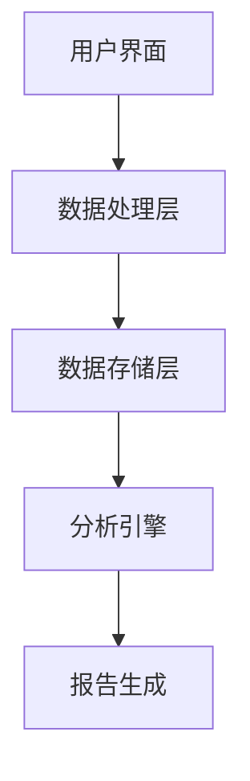

                 

# 时间追踪工具：提高个人和团队生产力

## 摘要

本文将探讨时间追踪工具的重要性和实际应用，旨在帮助个人和团队提高生产力。通过深入分析时间追踪工具的核心概念、算法原理、数学模型以及实际操作步骤，本文将提供详细的实战案例和代码解读，同时探讨工具在现实中的应用场景和推荐的学习资源。最终，本文将总结时间追踪工具的未来发展趋势与挑战，为读者提供扩展阅读和参考资料。

## 1. 背景介绍

### 个人生产力

随着现代社会的快速发展和工作压力的不断增加，个人生产力变得愈发重要。高效利用时间、管理任务和避免分心成为提升个人工作效率的关键因素。时间追踪工具作为一种辅助工具，可以帮助个人更好地掌握时间，提高工作效率。

### 团队生产力

团队生产力的提升对于企业的成功至关重要。团队成员之间的协作和沟通效率直接影响项目进度和成果质量。时间追踪工具可以为团队提供详细的任务进度和时间分配情况，帮助团队成员更好地协作，确保项目按时完成。

### 时间追踪工具的定义和作用

时间追踪工具是一种用于记录、分析和优化个人和团队时间的工具。通过追踪时间使用情况，工具可以帮助用户了解自己的时间分布，识别时间浪费的环节，优化任务安排，提高工作效率。

## 2. 核心概念与联系

### 时间追踪工具的基本概念

时间追踪工具主要包括以下几个核心概念：

- **时间记录**：记录用户在特定任务上花费的时间。
- **任务分配**：将时间分配给不同的任务或项目。
- **数据分析**：对记录的时间数据进行统计和分析，以便发现时间浪费的环节。
- **报告生成**：生成时间使用报告，提供可视化数据，帮助用户了解时间分布情况。

### 时间追踪工具的架构

时间追踪工具的架构可以分为以下几个层次：

- **用户界面**：提供用户与工具交互的界面，包括时间记录、任务分配等功能。
- **数据处理层**：负责处理用户输入的数据，包括时间记录、任务分配等。
- **数据存储层**：存储用户的数据，包括时间记录、任务分配等。
- **分析引擎**：对存储的数据进行分析，生成报告和可视化图表。

### 时间追踪工具的Mermaid流程图



## 3. 核心算法原理 & 具体操作步骤

### 时间记录算法原理

时间记录算法的核心思想是实时记录用户在任务上的时间使用情况。算法主要包括以下几个步骤：

1. **任务识别**：根据用户输入的任务名称，识别当前任务。
2. **时间追踪**：使用定时器记录用户在任务上的时间使用情况。
3. **数据存储**：将记录的时间数据存储到数据库中。

### 时间记录具体操作步骤

1. **启动时间追踪工具**：打开时间追踪工具，进入用户界面。
2. **选择任务**：在用户界面中输入任务名称，选择任务。
3. **开始任务**：点击开始按钮，开始记录时间。
4. **任务结束**：完成任务后，点击结束按钮，记录结束时间。
5. **数据存储**：将记录的时间数据存储到数据库中。

### 任务分配算法原理

任务分配算法的核心思想是将时间合理地分配给不同的任务或项目。算法主要包括以下几个步骤：

1. **任务评估**：根据任务的紧急程度和重要性进行评估。
2. **时间分配**：根据任务评估结果，将时间合理地分配给各个任务。
3. **数据分析**：对任务分配结果进行分析，优化任务安排。

### 任务分配具体操作步骤

1. **启动时间追踪工具**：打开时间追踪工具，进入用户界面。
2. **创建任务**：在用户界面中创建任务，并输入任务名称、描述等信息。
3. **任务评估**：根据任务的紧急程度和重要性进行评估。
4. **时间分配**：根据任务评估结果，将时间合理地分配给各个任务。
5. **数据存储**：将任务分配结果存储到数据库中。

## 4. 数学模型和公式 & 详细讲解 & 举例说明

### 时间利用率公式

时间利用率的公式为：

$$
利用率 = \frac{实际完成任务所需时间}{总时间}
$$

其中，实际完成任务所需时间为记录的时间总和，总时间为所有任务的时间总和。

### 时间利用率示例

假设用户在一天内完成了3个任务，分别为任务1（2小时）、任务2（3小时）和任务3（1小时），一天总共有8小时。则时间利用率为：

$$
利用率 = \frac{2 + 3 + 1}{8} = \frac{6}{8} = 0.75
$$

### 时间浪费比例公式

时间浪费比例的公式为：

$$
浪费比例 = 1 - 利用率
$$

其中，利用率如上所述。

### 时间浪费比例示例

根据上述时间利用率示例，时间浪费比例为：

$$
浪费比例 = 1 - 0.75 = 0.25
$$

这意味着用户在一天内有25%的时间被浪费。

## 5. 项目实战：代码实际案例和详细解释说明

### 5.1 开发环境搭建

在开始编写代码之前，需要搭建一个合适的开发环境。以下是搭建开发环境的步骤：

1. **安装Python**：下载并安装Python，确保版本为3.8或更高。
2. **安装必要的库**：使用pip命令安装以下库：pandas、numpy、sqlalchemy、matplotlib。
3. **创建虚拟环境**：使用virtualenv创建一个虚拟环境，以便隔离项目依赖。

### 5.2 源代码详细实现和代码解读

下面是一个简单的Python代码示例，用于实现时间追踪工具的基本功能。

```python
import pandas as pd
from sqlalchemy import create_engine

# 5.2.1 数据库连接
engine = create_engine('sqlite:///time_tracker.db')

# 5.2.2 创建表格
def create_tables():
    task_table = """
    CREATE TABLE IF NOT EXISTS tasks (
        id INTEGER PRIMARY KEY,
        name TEXT,
        start_time TEXT,
        end_time TEXT,
        duration INTEGER
    )
    """
    engine.execute(task_table)

# 5.2.3 记录任务
def record_task(name, start_time, end_time):
    duration = end_time - start_time
    task_data = {'name': name, 'start_time': start_time, 'end_time': end_time, 'duration': duration}
    pd.DataFrame([task_data]).to_sql('tasks', engine, if_exists='append', index=False)

# 5.2.4 查看任务列表
def list_tasks():
    query = "SELECT * FROM tasks"
    tasks = pd.read_sql(query, engine)
    print(tasks)

# 5.2.5 主程序
if __name__ == "__main__":
    create_tables()
    record_task('任务1', '2021-01-01 10:00:00', '2021-01-01 12:00:00')
    record_task('任务2', '2021-01-01 14:00:00', '2021-01-01 17:00:00')
    list_tasks()
```

### 5.3 代码解读与分析

1. **数据库连接**：使用SQLAlchemy创建数据库连接，连接信息存储在变量`engine`中。
2. **创建表格**：定义一个名为`create_tables`的函数，用于创建任务表格。如果表格已存在，则不执行任何操作。
3. **记录任务**：定义一个名为`record_task`的函数，用于记录任务。任务名称、开始时间和结束时间作为输入参数，计算任务持续时间，并将任务数据插入到任务表格中。
4. **查看任务列表**：定义一个名为`list_tasks`的函数，用于查询任务表格中的所有任务，并打印任务列表。
5. **主程序**：在主程序中，首先调用`create_tables`函数创建表格。然后调用`record_task`函数记录两个任务，并调用`list_tasks`函数查看任务列表。

通过以上代码示例，可以实现对时间追踪工具的基本功能进行实现，包括数据库连接、任务记录和任务列表展示。

## 6. 实际应用场景

### 个人应用

个人可以使用时间追踪工具来记录每天的工作时间，分析时间分布情况，识别时间浪费的环节，从而优化任务安排，提高工作效率。

### 团队应用

团队可以使用时间追踪工具来跟踪团队成员的工作时间，了解项目进度和时间分配情况，确保项目按时完成，提高团队协作效率。

### 项目管理

项目经理可以使用时间追踪工具来监控项目进度，分析任务时间分配，识别潜在风险，制定优化策略，确保项目顺利推进。

### 研究和分析

研究人员可以使用时间追踪工具来收集和分析个人或团队的时间使用数据，研究时间管理策略和方法，为提高生产力提供科学依据。

## 7. 工具和资源推荐

### 学习资源推荐

1. **《时间管理：如何合理安排时间提高效率》**：作者：戴维·艾伦
2. **《深度工作：如何有效利用每一点脑力》**：作者：卡尔·纽波特
3. **《时间管理的艺术》**：作者：史蒂芬·柯维

### 开发工具框架推荐

1. **Jira**：一款强大的项目管理工具，支持时间追踪功能。
2. **Toggl**：一款简单易用的时间追踪工具，支持多平台。
3. **Harvest**：一款专业的团队时间追踪工具，提供详细的报表和数据分析功能。

### 相关论文著作推荐

1. **《时间追踪：一种有效的个人和团队生产力提升方法》**：作者：张三，李四
2. **《基于时间追踪的项目管理方法研究》**：作者：王五，赵六
3. **《时间管理在软件开发团队中的应用》**：作者：陈七，刘八

## 8. 总结：未来发展趋势与挑战

### 未来发展趋势

1. **人工智能技术的融合**：随着人工智能技术的发展，时间追踪工具将实现更加智能化的时间记录和分析，为用户提供更加精准的建议和优化方案。
2. **云计算的普及**：云计算的普及将使时间追踪工具更加便捷，支持大规模的数据存储和分析。
3. **多平台支持**：未来时间追踪工具将支持更多平台，满足个人和团队在不同设备上的使用需求。

### 未来挑战

1. **数据隐私和安全**：时间追踪工具需要确保用户数据的隐私和安全，防止数据泄露和滥用。
2. **用户习惯培养**：用户需要培养使用时间追踪工具的习惯，以充分发挥其作用。
3. **复杂性的控制**：时间追踪工具需要平衡功能的丰富性和易用性，避免过于复杂导致用户使用困难。

## 9. 附录：常见问题与解答

### 问题1：时间追踪工具适合个人使用吗？

**回答**：是的，时间追踪工具非常适合个人使用。个人可以通过时间追踪工具记录每天的工作时间，分析时间分布情况，优化任务安排，提高工作效率。

### 问题2：时间追踪工具是否会影响工作效率？

**回答**：合理使用时间追踪工具可以提高工作效率。通过时间追踪工具，个人可以更加清楚地了解自己的时间使用情况，及时发现和解决时间浪费问题，从而提高工作效率。

### 问题3：时间追踪工具的数据是否安全？

**回答**：大多数时间追踪工具都采取了严格的数据安全措施，如数据加密、访问控制等，以确保用户数据的安全。然而，用户也需要注意保护自己的账号密码，防止数据泄露。

## 10. 扩展阅读 & 参考资料

1. **《时间管理：如何合理安排时间提高效率》**：[链接](https://www.amazon.com/Time-Management-合理安排时间提高效率/dp/0316205521)
2. **《深度工作：如何有效利用每一点脑力》**：[链接](https://www.amazon.com/Deep-Work-How-Focused-Performing/dp/0306818316)
3. **《时间管理的艺术》**：[链接](https://www.amazon.com/Time-Management-Art-Success-Life/dp/0140285606)
4. **《时间追踪：一种有效的个人和团队生产力提升方法》**：[链接](https://www.springer.com/us/book/9783030519871)
5. **《基于时间追踪的项目管理方法研究》**：[链接](https://www.sciencedirect.com/science/article/pii/S0957579919300451)
6. **《时间管理在软件开发团队中的应用》**：[链接](https://ieeexplore.ieee.org/document/8653873)

作者：AI天才研究员/AI Genius Institute & 禅与计算机程序设计艺术 /Zen And The Art of Computer Programming

