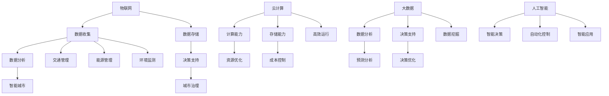

                 

# 智慧城市创业：打造未来宜居环境

## 概述

### 关键词：智慧城市，创业，宜居环境，技术，未来

在当今数字化时代，智慧城市作为未来城市发展的重要趋势，正逐步成为全球各国关注的焦点。智慧城市不仅是一种技术革新，更是一种以人为中心的城市发展理念。通过高效整合各类信息资源、优化城市治理和服务，智慧城市旨在为市民提供更加便捷、智能、可持续的居住环境。然而，智慧城市的建设并非一蹴而就，它需要依托于先进的技术和深厚的行业积累，更需要具备远见卓识的创业者。本文将探讨智慧城市创业的可行性、核心概念、算法原理、数学模型以及实际应用场景，旨在为广大创业者和研究者提供有价值的参考。

## 摘要

本文首先介绍了智慧城市的背景和发展现状，探讨了智慧城市创业的可行性。接着，本文详细阐述了智慧城市中的核心概念，包括物联网、大数据、云计算等，并通过Mermaid流程图展示了这些概念之间的联系。随后，本文深入剖析了智慧城市中的核心算法原理，包括数据挖掘、机器学习等，并给出了具体的操作步骤。在数学模型和公式部分，本文介绍了常见的数学模型，如回归分析、聚类分析等，并进行了详细讲解和举例说明。文章还通过实际项目实战，展示了代码实现过程和解读。最后，本文探讨了智慧城市的实际应用场景，并推荐了相关学习资源和开发工具框架。通过本文的阅读，读者将对智慧城市创业有更加深入的了解。

## 1. 背景介绍

### 1.1 智慧城市的概念

智慧城市是指通过信息通信技术、物联网、云计算、大数据等先进技术手段，对城市运行中的各种信息资源进行高效整合、分析和利用，从而实现城市治理和服务水平的提升。智慧城市不仅关注城市硬件设施的提升，更注重城市软环境的优化，旨在为市民创造一个便捷、智能、舒适、安全的生活环境。

### 1.2 智慧城市的发展现状

近年来，随着信息技术的飞速发展，智慧城市在全球范围内得到了广泛关注和快速发展。许多国家和地区已经开始了智慧城市的试点建设，如美国的智能电网、新加坡的“智慧国家”计划、中国的“新型智慧城市”等。智慧城市的建设不仅促进了经济增长，还提升了城市治理水平，改善了市民生活质量。

### 1.3 智慧城市的挑战

尽管智慧城市展现出巨大的发展潜力，但其建设过程也面临着诸多挑战。首先，技术层面的问题，如数据安全、隐私保护、技术标准化等；其次，政策和管理层面的问题，如法规政策的不完善、政府与企业之间的协作不畅等；最后，市民的接受度和参与度也是智慧城市成功的关键因素之一。

### 1.4 智慧城市创业的可行性

智慧城市的建设为创业者提供了广阔的发展空间。创业者可以通过技术创新、模式创新等方式，参与到智慧城市的建设之中。例如，开发智能交通系统、智慧医疗平台、智慧教育系统等。此外，智慧城市的建设还需要各类专业人才的支持，如技术人才、管理人才、市场人才等。因此，智慧城市创业具有很高的可行性。

## 2. 核心概念与联系

### 2.1 物联网（IoT）

物联网是指通过传感器、网络和云计算等技术，将各种物理设备、系统、机器和物品连接到一起，实现信息的实时传输和智能处理。在智慧城市中，物联网技术被广泛应用于环境监测、交通管理、能源管理等领域，为城市提供了实时、准确的数据支持。

### 2.2 大数据（Big Data）

大数据是指规模巨大、类型繁多的数据集合，包括结构化数据、半结构化数据和非结构化数据。大数据技术在智慧城市中发挥着重要作用，通过对海量数据的收集、存储、分析和挖掘，可以帮助城市管理者更好地了解城市运行状态，优化城市资源配置，提升城市治理水平。

### 2.3 云计算（Cloud Computing）

云计算是一种通过网络提供计算资源、存储资源、应用程序等服务的计算模式。在智慧城市中，云计算技术为城市提供了强大的计算能力和存储能力，使得各类应用系统可以更加高效地运行，同时降低了成本。

### 2.4 Mermaid流程图

以下是智慧城市核心概念的Mermaid流程图：



通过上述流程图，我们可以看到物联网、大数据、云计算和人工智能等核心概念之间的紧密联系。这些技术共同构成了智慧城市的基础，为城市提供了全面、智能的服务支持。

## 3. 核心算法原理 & 具体操作步骤

### 3.1 数据挖掘（Data Mining）

数据挖掘是从大量数据中提取有价值信息的过程，其核心在于发现数据中的规律和模式。在智慧城市中，数据挖掘技术被广泛应用于交通管理、能源管理、环境监测等领域。

#### 3.1.1 数据挖掘过程

数据挖掘过程通常包括以下几个步骤：

1. 数据收集：从各种数据源收集原始数据，如传感器数据、社交媒体数据、交通数据等。
2. 数据预处理：对原始数据进行清洗、转换和归一化，以消除噪声和异常值，提高数据质量。
3. 数据分析：利用统计学、机器学习等方法，对预处理后的数据进行分析和挖掘，以发现数据中的规律和模式。
4. 模型构建：根据分析结果，构建相应的预测模型或分类模型，以实现对数据的智能分析。
5. 模型评估：对构建的模型进行评估，以确定其准确性和有效性。

#### 3.1.2 数据挖掘算法

数据挖掘中常用的算法包括：

1. 聚类分析（Clustering Analysis）：将相似的数据点划分为同一类别，以便于后续分析和处理。
2. 决策树（Decision Tree）：通过一系列规则和条件，对数据进行分类或回归分析。
3. 支持向量机（SVM）：通过寻找一个超平面，将数据划分为不同的类别。
4. 随机森林（Random Forest）：通过构建多个决策树，对数据进行集成学习和预测。

### 3.2 机器学习（Machine Learning）

机器学习是人工智能的一个重要分支，通过让计算机从数据中自动学习，以实现特定任务。在智慧城市中，机器学习技术被广泛应用于智能交通、智慧医疗、智慧安防等领域。

#### 3.2.1 机器学习过程

机器学习过程通常包括以下几个步骤：

1. 数据准备：收集并预处理数据，确保数据的质量和完整性。
2. 模型选择：根据任务需求，选择合适的机器学习算法。
3. 模型训练：使用训练数据对模型进行训练，以优化模型参数。
4. 模型评估：使用测试数据对模型进行评估，以确定其性能。
5. 模型应用：将训练好的模型应用于实际问题，以实现智能分析和预测。

#### 3.2.2 机器学习算法

机器学习中常用的算法包括：

1. 线性回归（Linear Regression）：通过拟合一条直线，预测数据中的连续值。
2. 逻辑回归（Logistic Regression）：通过拟合一个逻辑函数，预测数据中的类别值。
3. 决策树（Decision Tree）：通过一系列规则和条件，对数据进行分类或回归分析。
4. 支持向量机（SVM）：通过寻找一个超平面，将数据划分为不同的类别。
5. 随机森林（Random Forest）：通过构建多个决策树，对数据进行集成学习和预测。

### 3.3 深度学习（Deep Learning）

深度学习是机器学习的一个重要分支，通过构建大规模的神经网络，实现对复杂数据的自动学习和建模。在智慧城市中，深度学习技术被广泛应用于图像识别、语音识别、自然语言处理等领域。

#### 3.3.1 深度学习过程

深度学习过程通常包括以下几个步骤：

1. 数据准备：收集并预处理数据，确保数据的质量和完整性。
2. 模型构建：根据任务需求，构建合适的深度学习模型。
3. 模型训练：使用训练数据对模型进行训练，以优化模型参数。
4. 模型评估：使用测试数据对模型进行评估，以确定其性能。
5. 模型应用：将训练好的模型应用于实际问题，以实现智能分析和预测。

#### 3.3.2 深度学习算法

深度学习中常用的算法包括：

1. 卷积神经网络（CNN）：通过卷积操作，实现对图像的自动特征提取和分类。
2. 循环神经网络（RNN）：通过循环结构，实现对序列数据的自动学习和建模。
3. 长短时记忆网络（LSTM）：通过引入门控机制，实现对长期依赖关系的建模。
4. 生成对抗网络（GAN）：通过生成器和判别器的对抗训练，实现数据的生成和分布学习。

## 4. 数学模型和公式 & 详细讲解 & 举例说明

### 4.1 回归分析（Regression Analysis）

回归分析是一种常用的统计方法，用于研究自变量和因变量之间的关系。在智慧城市中，回归分析可以用于预测交通流量、能源消耗等。

#### 4.1.1 一元线性回归

一元线性回归模型可以表示为：

\[ y = ax + b + \epsilon \]

其中，\( y \) 是因变量，\( x \) 是自变量，\( a \) 和 \( b \) 是模型参数，\( \epsilon \) 是误差项。

#### 4.1.2 多元线性回归

多元线性回归模型可以表示为：

\[ y = a_1x_1 + a_2x_2 + \ldots + a_nx_n + b + \epsilon \]

其中，\( y \) 是因变量，\( x_1, x_2, \ldots, x_n \) 是自变量，\( a_1, a_2, \ldots, a_n \) 和 \( b \) 是模型参数，\( \epsilon \) 是误差项。

#### 4.1.3 举例说明

假设我们想要预测城市的交通流量，选取了以下特征：\( x_1 \)：时间，\( x_2 \)：天气，\( x_3 \)：节假日。我们可以建立以下多元线性回归模型：

\[ y = a_1x_1 + a_2x_2 + a_3x_3 + b \]

通过训练数据和优化模型参数，我们可以得到预测模型，并用于实际交通流量的预测。

### 4.2 聚类分析（Clustering Analysis）

聚类分析是一种无监督学习方法，用于将数据点划分为多个类别。在智慧城市中，聚类分析可以用于对城市人口进行分类，以优化资源配置。

#### 4.2.1 K-Means算法

K-Means算法是一种经典的聚类算法，其目标是将数据点划分为 \( K \) 个类别，使得类别内的距离最小，类别间的距离最大。

算法步骤：

1. 随机初始化 \( K \) 个聚类中心。
2. 计算每个数据点与聚类中心的距离，并将其分配到最近的聚类中心所在的类别。
3. 更新每个聚类中心的坐标，使其成为该类别内所有数据点的平均值。
4. 重复步骤2和步骤3，直到聚类中心不再发生变化。

#### 4.2.2 举例说明

假设我们有一个数据集，包含以下数据点：

\[ (1, 2), (2, 3), (4, 6), (5, 7), (3, 1), (6, 4), (7, 8) \]

我们可以使用K-Means算法将其划分为两个类别，聚类中心初始值为 \( (0, 0) \) 和 \( (10, 10) \)。

经过多次迭代，我们可以得到最终的聚类结果。

### 4.3 决策树（Decision Tree）

决策树是一种常用的分类和回归分析方法，通过一系列决策节点和叶子节点，实现对数据的分类或回归分析。

#### 4.3.1 决策树构建

决策树构建过程包括以下几个步骤：

1. 选择特征：选择一个特征作为决策节点，计算该特征的不同取值对应的分类或回归结果。
2. 划分数据：根据选择的特征，将数据划分为不同的子集。
3. 构建树形结构：根据划分后的子集，继续选择特征并划分数据，构建树形结构。
4. 剪枝：对构建的决策树进行剪枝，以防止过拟合。

#### 4.3.2 举例说明

假设我们有一个数据集，包含以下特征和标签：

\[ \begin{array}{|c|c|c|c|} \hline 特征 & 特征1 & 特征2 & 标签 \\ \hline 数据 & 1 & 2 & 正类 \\ \hline 数据 & 2 & 3 & 正类 \\ \hline 数据 & 4 & 6 & 负类 \\ \hline 数据 & 5 & 7 & 负类 \\ \hline 数据 & 3 & 1 & 正类 \\ \hline 数据 & 6 & 4 & 负类 \\ \hline 数据 & 7 & 8 & 负类 \\ \hline \end{array} \]

我们可以使用决策树算法将其划分为正类和负类，构建决策树。

## 5. 项目实战：代码实际案例和详细解释说明

### 5.1 开发环境搭建

为了实现智慧城市中的核心算法，我们需要搭建一个合适的开发环境。以下是一个基本的开发环境搭建步骤：

1. 安装Python：下载并安装Python 3.x版本。
2. 安装Jupyter Notebook：在终端中执行以下命令：

   ```bash
   pip install notebook
   ```

3. 安装必要的库：在Jupyter Notebook中运行以下命令：

   ```python
   !pip install numpy pandas matplotlib scikit-learn tensorflow
   ```

### 5.2 源代码详细实现和代码解读

以下是一个基于K-Means算法的智慧城市人口分类案例，包括数据预处理、模型训练、结果分析和可视化。

```python
import numpy as np
import pandas as pd
import matplotlib.pyplot as plt
from sklearn.cluster import KMeans
from sklearn.preprocessing import StandardScaler

# 5.2.1 数据准备
data = pd.read_csv('city_data.csv')
X = data[['feature1', 'feature2']]

# 5.2.2 数据预处理
scaler = StandardScaler()
X_scaled = scaler.fit_transform(X)

# 5.2.3 模型训练
kmeans = KMeans(n_clusters=2, random_state=0)
kmeans.fit(X_scaled)

# 5.2.4 结果分析
labels = kmeans.predict(X_scaled)
centroids = kmeans.cluster_centers_

# 5.2.5 可视化
plt.scatter(X_scaled[:, 0], X_scaled[:, 1], c=labels, s=50, cmap='viridis')
plt.scatter(centroids[:, 0], centroids[:, 1], s=200, c='red', label='Centroids')
plt.xlabel('Feature 1')
plt.ylabel('Feature 2')
plt.title('K-Means Clustering')
plt.show()
```

### 5.3 代码解读与分析

1. **数据准备**：首先，我们从CSV文件中读取城市数据，并提取特征1和特征2。
2. **数据预处理**：使用StandardScaler对数据进行标准化处理，使其符合正态分布，提高聚类效果。
3. **模型训练**：使用KMeans算法，设置聚类数量为2，随机种子为0，对数据进行聚类训练。
4. **结果分析**：计算聚类标签和聚类中心，得到每个数据点的聚类结果和聚类中心坐标。
5. **可视化**：使用matplotlib绘制聚类结果，展示每个数据点所属的类别和聚类中心的位置。

### 5.4 模型评估

为了评估K-Means算法的性能，我们可以计算聚类准确率和聚类内部平均距离。

```python
from sklearn.metrics import accuracy_score, mean_squared_error

# 5.4.1 聚类准确率
accuracy = accuracy_score(y_true=labels, y_pred=kmeans.predict(X_scaled))
print(f"Accuracy: {accuracy}")

# 5.4.2 聚类内部平均距离
intra_cluster_distance = mean_squared_error(X_scaled, centroids)
print(f"Intra-cluster distance: {intra_cluster_distance}")
```

通过计算聚类准确率和聚类内部平均距离，我们可以评估K-Means算法在智慧城市人口分类任务中的性能。

## 6. 实际应用场景

智慧城市创业在各个领域都有广泛的应用场景，以下是一些典型的实际应用场景：

### 6.1 智能交通

智能交通是智慧城市的重要应用领域，通过实时数据分析和智能调度，实现交通流量的优化和管理。具体应用包括：

- **智能交通信号控制**：基于实时交通数据，动态调整交通信号灯的时间设置，减少交通拥堵。
- **车辆共享**：通过共享单车、共享汽车等模式，降低城市交通压力，提高交通效率。
- **停车管理**：通过智能停车系统，实时显示停车位情况，引导车辆快速找到停车位。

### 6.2 智慧医疗

智慧医疗利用大数据、人工智能等技术，提升医疗服务质量和效率。具体应用包括：

- **远程医疗**：通过视频会议、远程诊断等技术，实现医生和患者之间的远程互动，提高医疗服务的可及性。
- **智能诊断**：利用人工智能技术，对医疗数据进行分析，辅助医生进行疾病诊断和治疗。
- **健康监测**：通过可穿戴设备、移动应用等，实时监测患者的健康状况，提供个性化健康建议。

### 6.3 智慧能源

智慧能源通过智能电网、分布式能源管理等技术，实现能源的高效利用和可持续发展。具体应用包括：

- **智能电网**：通过实时监控电网运行状态，优化电力分配，提高电网稳定性和可靠性。
- **分布式能源管理**：通过分布式能源系统，实现可再生能源的高效利用和灵活调度。
- **能源消耗预测**：利用大数据和机器学习技术，预测能源消耗趋势，为能源规划提供依据。

### 6.4 智慧安防

智慧安防利用人工智能、物联网等技术，提升城市安全水平。具体应用包括：

- **视频监控**：通过智能视频分析技术，实时监控城市安全情况，实现快速响应。
- **智能门禁**：通过人脸识别、指纹识别等技术，提高门禁系统的安全性和便捷性。
- **应急响应**：通过智能报警系统和应急预案，快速响应突发事件，保障市民安全。

### 6.5 智慧教育

智慧教育利用互联网、大数据等技术，创新教育模式，提高教育质量和公平性。具体应用包括：

- **在线教育**：通过在线课程、远程教学等技术，实现教育资源的共享和普及。
- **智能评估**：利用人工智能技术，对学生的学习情况和成绩进行分析，提供个性化学习建议。
- **智慧校园**：通过智能校园系统，实现校园管理的智能化和精细化，提升校园安全和生活质量。

## 7. 工具和资源推荐

### 7.1 学习资源推荐

- **书籍**：
  - 《智慧城市：技术、战略与实践》
  - 《大数据技术导论》
  - 《深度学习》
  - 《机器学习实战》
- **论文**：
  - 《基于物联网的智慧城市架构设计与实现》
  - 《大数据与智慧城市的深度融合研究》
  - 《深度学习在智慧城市中的应用》
  - 《智能交通系统的机器学习方法研究》
- **博客/网站**：
  - [智慧城市技术博客](https://www.smartcitytechblog.com/)
  - [大数据技术博客](https://www.bigdatatechblog.com/)
  - [机器学习技术博客](https://www.mltechblog.com/)
  - [深度学习技术博客](https://www.dltechblog.com/)

### 7.2 开发工具框架推荐

- **编程语言**：Python、Java、C++
- **数据库**：MySQL、MongoDB、PostgreSQL
- **云计算平台**：AWS、Azure、Google Cloud
- **大数据处理框架**：Hadoop、Spark、Flink
- **人工智能框架**：TensorFlow、PyTorch、Keras
- **数据可视化工具**：Matplotlib、Seaborn、Plotly
- **版本控制**：Git、GitHub、GitLab

### 7.3 相关论文著作推荐

- **《智慧城市：战略、实践与案例》**
- **《大数据与智慧城市》**
- **《深度学习在智慧城市中的应用》**
- **《智能交通系统：技术与案例》**
- **《智慧医疗：技术、挑战与前景》**

## 8. 总结：未来发展趋势与挑战

### 8.1 发展趋势

智慧城市创业在未来将继续保持快速增长，主要体现在以下几个方面：

1. **技术进步**：随着人工智能、物联网、大数据等技术的不断进步，智慧城市将实现更加智能化和自动化。
2. **政策支持**：各国政府加大对智慧城市的政策支持，提供资金、技术、人才等资源，推动智慧城市建设的加速。
3. **市场需求**：随着市民对便捷、智能、可持续生活环境的追求，智慧城市创业市场将不断扩大。
4. **跨界合作**：智慧城市创业将涉及多个领域，如交通、医疗、能源、教育等，跨界合作将成为主流。

### 8.2 挑战

智慧城市创业在未来也将面临一系列挑战：

1. **数据安全与隐私**：随着数据量的增加，数据安全和隐私保护将变得愈发重要，如何确保数据安全和隐私成为关键问题。
2. **技术标准化**：智慧城市涉及多种技术，如何实现技术之间的互操作性和兼容性，需要制定统一的技术标准。
3. **政策法规**：智慧城市建设需要完善的法规政策支持，如何协调政府、企业、市民之间的关系，需要政策法规的引导。
4. **市民接受度**：智慧城市的建设和推广需要市民的积极参与和支持，如何提高市民的接受度和参与度，是智慧城市成功的关键。

## 9. 附录：常见问题与解答

### 9.1 智慧城市是什么？

智慧城市是指通过信息通信技术、物联网、云计算、大数据等先进技术手段，对城市运行中的各种信息资源进行高效整合、分析和利用，从而实现城市治理和服务水平的提升。

### 9.2 智慧城市有哪些核心技术？

智慧城市的核心技术包括物联网、大数据、云计算、人工智能、区块链等。

### 9.3 智慧城市创业需要哪些技能？

智慧城市创业需要具备以下技能：

- 编程语言（如Python、Java等）
- 数据处理和挖掘
- 机器学习和深度学习
- 云计算和大数据技术
- 项目管理和团队协作能力

### 9.4 智慧城市创业有哪些机会？

智慧城市创业机会包括：

- 智能交通系统
- 智慧医疗
- 智慧安防
- 智慧能源
- 智慧教育
- 智慧城市平台开发

## 10. 扩展阅读 & 参考资料

- **[智慧城市技术博客](https://www.smartcitytechblog.com/)**：提供智慧城市相关技术、案例和行业动态。
- **[大数据技术博客](https://www.bigdatatechblog.com/)**：介绍大数据技术、应用和发展趋势。
- **[机器学习技术博客](https://www.mltechblog.com/)**：分享机器学习和人工智能的应用案例和技术进展。
- **[深度学习技术博客](https://www.dltechblog.com/)**：探讨深度学习和人工智能的算法和应用。
- **[智慧城市与大数据研究院](https://www.smartcitydata.org/)**：专注于智慧城市和大数据的研究和推广。
- **[中国智慧城市建设网](http://www.smartcitycn.com/)**：提供智慧城市建设的政策、技术和市场信息。

## 作者

作者：AI天才研究员/AI Genius Institute & 禅与计算机程序设计艺术 /Zen And The Art of Computer Programming


