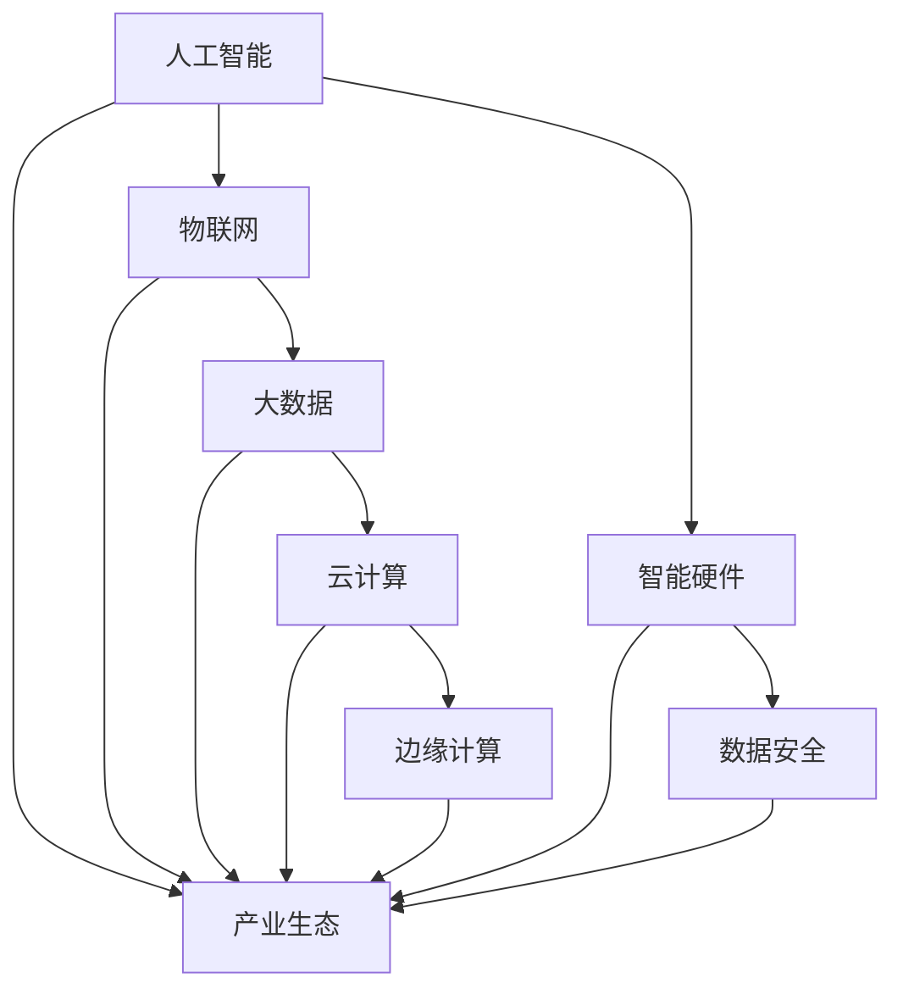

                 

### 文章标题

《智能产业化的发展方向与趋势》

> **关键词：** 智能产业化、发展方向、趋势、人工智能、物联网、大数据、云计算、智能硬件、边缘计算、数据安全、产业生态。

> **摘要：** 本文深入探讨了智能产业化的定义、背景、核心概念，以及其在当前和未来的发展趋势。通过分析智能产业化的关键技术、应用场景、挑战与机遇，本文旨在为读者提供对智能产业化现状和未来发展的全面理解。同时，文章还将推荐相关学习资源和开发工具，以助读者深入了解并参与到智能产业化的浪潮中。

<|assistant|>## 1. 背景介绍

智能产业化，是指在工业、农业、服务业等领域中广泛应用人工智能、物联网、大数据、云计算等新一代信息技术，实现产业的智能化升级和转型。这一概念最早可以追溯到20世纪90年代，当时信息技术开始逐渐融入传统产业，推动了工业自动化和信息化的进程。进入21世纪，随着人工智能技术的快速发展，智能产业化的概念逐渐被提出并得到了广泛关注。

智能产业化的背景主要包括以下几个方面：

1. **信息技术的发展**：互联网、物联网、大数据、云计算等新一代信息技术的不断成熟，为智能产业化提供了技术支撑。
2. **产业升级需求**：在全球化竞争日益激烈的背景下，传统产业面临着转型升级的巨大压力，智能产业化成为提升产业竞争力的重要手段。
3. **国家政策推动**：各国政府纷纷出台相关政策，支持智能产业的发展，为智能产业化提供了政策保障。

智能产业化的主要目标包括：

1. **提高生产效率**：通过自动化、智能化的生产方式，减少人工干预，提高生产效率和产品质量。
2. **优化资源配置**：利用大数据、云计算等技术，实现资源的高效配置，降低生产成本。
3. **提升产业附加值**：通过智能技术的应用，提高产品的附加值，增强企业的竞争力。
4. **促进产业融合**：打破产业间的壁垒，实现产业间的融合发展，推动经济结构的优化。

智能产业化的现状可以概括为以下几个方面：

1. **技术成熟度**：人工智能、物联网、大数据、云计算等技术已经相对成熟，开始在各个领域得到广泛应用。
2. **应用领域广泛**：智能产业化已经在工业、农业、服务业等多个领域得到应用，并取得了显著成效。
3. **产业发展不平衡**：不同国家和地区、不同行业之间的智能产业发展水平存在较大差距。
4. **政策支持力度不一**：各国政府对智能产业化的政策支持力度存在差异，影响了智能产业化的推进速度。

总体来看，智能产业化正处于快速发展阶段，随着技术的不断进步和政策的支持，其发展潜力巨大。然而，也面临着一系列挑战，需要各方共同努力，才能实现智能产业的可持续发展。

### 2. 核心概念与联系

#### 2.1. 人工智能（AI）

人工智能（Artificial Intelligence，AI）是指使计算机具有人类智能特性的技术。它包括机器学习、深度学习、自然语言处理、计算机视觉等多个子领域。人工智能的核心目标是使计算机能够模拟、延伸和扩展人类的智能。

#### 2.2. 物联网（IoT）

物联网（Internet of Things，IoT）是指通过互联网将各种物理设备、传感器、智能终端等连接起来，实现设备间的信息交换和通信。物联网的核心在于数据的采集、传输和处理，是实现智能化的基础。

#### 2.3. 大数据（Big Data）

大数据（Big Data）是指数据量巨大、类型繁多的数据集合。大数据的核心在于如何从海量数据中提取有价值的信息，为决策提供支持。大数据技术在智能产业中发挥着关键作用。

#### 2.4. 云计算（Cloud Computing）

云计算（Cloud Computing）是指通过网络提供动态可扩展的计算资源，包括存储、处理能力、应用程序等。云计算的核心优势在于弹性、可扩展性和成本效益。

#### 2.5. 边缘计算（Edge Computing）

边缘计算（Edge Computing）是指将数据处理和分析的任务从云端转移到网络边缘，即靠近数据源的地方。边缘计算的核心优势在于低延迟、高带宽和实时性，适用于对实时性要求较高的应用场景。

#### 2.6. 智能硬件（Smart Hardware）

智能硬件（Smart Hardware）是指具备人工智能、物联网等技术的硬件设备，可以实现智能化操作和互联。智能硬件是智能产业化的重要载体。

#### 2.7. 数据安全（Data Security）

数据安全（Data Security）是指保护数据免受未授权访问、泄露、篡改等威胁的措施。随着智能产业化的发展，数据安全问题日益凸显，成为保障智能产业化健康发展的重要环节。

#### 2.8. 产业生态（Industrial Ecosystem）

产业生态（Industrial Ecosystem）是指围绕某一产业形成的相互依存、协同发展的产业链、创新链、资金链等。产业生态的完善程度直接影响智能产业化的发展。

#### 2.9. Mermaid 流程图

以下是智能产业化的 Mermaid 流程图，展示了核心概念之间的联系：



### 3. 核心算法原理 & 具体操作步骤

#### 3.1. 人工智能算法原理

人工智能的核心在于算法，以下是几种常见的人工智能算法及其原理：

1. **机器学习（Machine Learning）**
   - **原理**：机器学习是一种通过训练数据集来优化模型参数的方法，使模型能够对新的数据进行预测或分类。
   - **操作步骤**：
     1. 数据预处理：清洗、归一化、缺失值处理等。
     2. 特征提取：从原始数据中提取有用的特征。
     3. 模型选择：选择合适的机器学习算法。
     4. 训练模型：使用训练数据集训练模型。
     5. 模型评估：使用测试数据集评估模型性能。

2. **深度学习（Deep Learning）**
   - **原理**：深度学习是机器学习的一种，通过构建深度神经网络（DNN）来模拟人脑的学习过程。
   - **操作步骤**：
     1. 网络架构设计：设计合适的深度神经网络结构。
     2. 模型训练：使用训练数据集训练模型。
     3. 模型评估：使用测试数据集评估模型性能。
     4. 模型优化：调整网络参数，提高模型性能。

3. **自然语言处理（Natural Language Processing，NLP）**
   - **原理**：自然语言处理是人工智能的一个分支，旨在使计算机理解和处理人类语言。
   - **操作步骤**：
     1. 数据预处理：清洗、分词、词性标注等。
     2. 特征提取：提取文本特征，如词袋模型、词嵌入等。
     3. 模型训练：使用训练数据集训练模型。
     4. 模型评估：使用测试数据集评估模型性能。

4. **计算机视觉（Computer Vision）**
   - **原理**：计算机视觉是人工智能的一个分支，旨在使计算机能够理解和处理视觉信息。
   - **操作步骤**：
     1. 数据预处理：清洗、归一化、增强等。
     2. 特征提取：提取图像特征，如卷积神经网络（CNN）等。
     3. 模型训练：使用训练数据集训练模型。
     4. 模型评估：使用测试数据集评估模型性能。

#### 3.2. 物联网算法原理

物联网的核心在于数据的采集、传输和处理，以下是几种常见的物联网算法及其原理：

1. **数据采集算法**
   - **原理**：数据采集算法用于从传感器、设备等采集数据。
   - **操作步骤**：
     1. 传感器选择：选择合适的传感器，如温度传感器、湿度传感器等。
     2. 数据采集：通过传感器采集数据。
     3. 数据预处理：清洗、归一化等。

2. **数据传输算法**
   - **原理**：数据传输算法用于将数据从设备传输到云端或其他处理节点。
   - **操作步骤**：
     1. 选择传输协议：如HTTP、MQTT等。
     2. 数据传输：通过传输协议将数据传输到目标节点。
     3. 数据加密：对传输数据进行加密，确保数据安全。

3. **数据处理算法**
   - **原理**：数据处理算法用于对采集到的数据进行处理，如滤波、聚类、分类等。
   - **操作步骤**：
     1. 数据预处理：清洗、归一化等。
     2. 特征提取：提取数据特征。
     3. 模型训练：使用训练数据集训练模型。
     4. 模型评估：使用测试数据集评估模型性能。

#### 3.3. 大数据算法原理

大数据的核心在于如何从海量数据中提取有价值的信息，以下是几种常见的大数据算法及其原理：

1. **数据挖掘算法**
   - **原理**：数据挖掘算法用于从大量数据中发现有价值的信息。
   - **操作步骤**：
     1. 数据预处理：清洗、归一化等。
     2. 特征提取：提取数据特征。
     3. 模型选择：选择合适的数据挖掘算法。
     4. 模型训练：使用训练数据集训练模型。
     5. 模型评估：使用测试数据集评估模型性能。

2. **聚类算法**
   - **原理**：聚类算法用于将数据划分为多个类别。
   - **操作步骤**：
     1. 数据预处理：清洗、归一化等。
     2. 聚类算法选择：如K-Means、DBSCAN等。
     3. 模型训练：使用聚类算法对数据进行聚类。
     4. 模型评估：评估聚类效果。

3. **分类算法**
   - **原理**：分类算法用于对数据进行分类。
   - **操作步骤**：
     1. 数据预处理：清洗、归一化等。
     2. 特征提取：提取数据特征。
     3. 模型选择：选择合适的分类算法。
     4. 模型训练：使用训练数据集训练模型。
     5. 模型评估：使用测试数据集评估模型性能。

#### 3.4. 云计算算法原理

云计算的核心在于如何高效地利用云计算资源，以下是几种常见的云计算算法及其原理：

1. **资源调度算法**
   - **原理**：资源调度算法用于在云环境中分配和调度计算资源。
   - **操作步骤**：
     1. 资源需求分析：分析计算资源的需求。
     2. 调度算法选择：选择合适的调度算法。
     3. 资源分配：根据调度算法分配计算资源。
     4. 调度策略优化：优化调度策略，提高资源利用率。

2. **负载均衡算法**
   - **原理**：负载均衡算法用于在多个节点之间分配计算负载，确保系统的高可用性和性能。
   - **操作步骤**：
     1. 负载监测：监测系统的负载情况。
     2. 负载均衡算法选择：选择合适的负载均衡算法。
     3. 负载分配：根据负载均衡算法分配计算负载。

3. **数据存储算法**
   - **原理**：数据存储算法用于在云环境中高效地存储和管理数据。
   - **操作步骤**：
     1. 数据存储需求分析：分析数据存储的需求。
     2. 存储算法选择：选择合适的数据存储算法。
     3. 数据分配：根据存储算法分配数据。
     4. 数据备份与恢复：实现数据的备份与恢复。

#### 3.5. 边缘计算算法原理

边缘计算的核心在于如何在边缘设备上进行高效的数据处理和分析，以下是几种常见的边缘计算算法及其原理：

1. **实时数据处理算法**
   - **原理**：实时数据处理算法用于在边缘设备上实时处理和分析数据。
   - **操作步骤**：
     1. 数据采集：从边缘设备采集数据。
     2. 数据预处理：清洗、归一化等。
     3. 数据分析：使用实时数据处理算法进行分析。
     4. 结果输出：输出分析结果。

2. **边缘智能算法**
   - **原理**：边缘智能算法用于在边缘设备上实现智能功能。
   - **操作步骤**：
     1. 数据采集：从边缘设备采集数据。
     2. 特征提取：提取数据特征。
     3. 模型训练：使用边缘智能算法训练模型。
     4. 模型部署：在边缘设备上部署模型。
     5. 模型推理：在边缘设备上进行模型推理。

3. **边缘协作算法**
   - **原理**：边缘协作算法用于在多个边缘设备之间协作处理数据。
   - **操作步骤**：
     1. 数据采集：从多个边缘设备采集数据。
     2. 数据预处理：清洗、归一化等。
     3. 数据传输：将预处理后的数据传输到其他边缘设备。
     4. 数据分析：在多个边缘设备上协作分析数据。
     5. 结果输出：输出分析结果。

### 4. 数学模型和公式 & 详细讲解 & 举例说明

#### 4.1. 机器学习中的数学模型

1. **线性回归（Linear Regression）**
   - **公式**：
     $$ Y = \beta_0 + \beta_1 X + \epsilon $$
     其中，\( Y \) 为因变量，\( X \) 为自变量，\( \beta_0 \) 和 \( \beta_1 \) 为模型参数，\( \epsilon \) 为误差项。
   - **详细讲解**：
     线性回归是一种简单的机器学习模型，用于预测连续值。它通过拟合一条直线，来描述自变量和因变量之间的关系。
   - **举例说明**：
     假设我们要预测房价，自变量为房屋面积，因变量为房价。我们可以使用线性回归模型来拟合房价和房屋面积之间的关系。

2. **逻辑回归（Logistic Regression）**
   - **公式**：
     $$ P(Y=1) = \frac{1}{1 + e^{-(\beta_0 + \beta_1 X)}} $$
     其中，\( P(Y=1) \) 为因变量为 1 的概率，\( \beta_0 \) 和 \( \beta_1 \) 为模型参数。
   - **详细讲解**：
     逻辑回归是一种用于分类问题的机器学习模型，它通过拟合一个非线性函数，来预测分类概率。
   - **举例说明**：
     假设我们要预测客户是否会购买产品，自变量为客户的年龄、收入等特征，因变量为购买行为。我们可以使用逻辑回归模型来预测客户购买产品的概率。

3. **神经网络（Neural Network）**
   - **公式**：
     $$ a_{\text{layer}} = \sigma(z_{\text{layer}}) $$
     其中，\( a_{\text{layer}} \) 为当前层的激活值，\( z_{\text{layer}} \) 为当前层的输入值，\( \sigma \) 为激活函数。
   - **详细讲解**：
     神经网络是一种模拟人脑神经元连接方式的机器学习模型，它通过多层神经元的连接，来学习复杂的非线性关系。
   - **举例说明**：
     假设我们要识别手写数字，输入为手写数字的图像，输出为数字的类别。我们可以使用神经网络模型来学习手写数字的识别。

#### 4.2. 物联网中的数学模型

1. **卡尔曼滤波（Kalman Filter）**
   - **公式**：
     $$ \mathbf{x}_{k|k} = \mathbf{F}_k \mathbf{x}_{k-1|k-1} + \mathbf{B}_k \mathbf{u}_k $$
     $$ \mathbf{P}_{k|k} = \mathbf{F}_k \mathbf{P}_{k-1|k-1} \mathbf{F}_k^T + \mathbf{Q}_k $$
     其中，\( \mathbf{x}_{k|k} \) 为状态估计，\( \mathbf{F}_k \) 为状态转移矩阵，\( \mathbf{P}_{k|k} \) 为状态估计误差协方差矩阵，\( \mathbf{B}_k \) 为控制矩阵，\( \mathbf{u}_k \) 为控制输入，\( \mathbf{Q}_k \) 为过程噪声协方差矩阵。
   - **详细讲解**：
     卡尔曼滤波是一种用于状态估计的数学模型，它通过最小化误差平方和，来估计系统的状态。
   - **举例说明**：
     假设我们要对一辆车进行定位，输入为传感器的测量数据，输出为车的位置。我们可以使用卡尔曼滤波模型来估计车的位置。

2. **贝叶斯网络（Bayesian Network）**
   - **公式**：
     $$ P(\mathbf{X}|\mathbf{Y}) = \frac{P(\mathbf{Y}|\mathbf{X})P(\mathbf{X})}{P(\mathbf{Y})} $$
     其中，\( P(\mathbf{X}|\mathbf{Y}) \) 为后验概率，\( P(\mathbf{Y}|\mathbf{X}) \) 为似然概率，\( P(\mathbf{X}) \) 为先验概率，\( P(\mathbf{Y}) \) 为边缘概率。
   - **详细讲解**：
     贝叶斯网络是一种用于概率推理的数学模型，它通过构建节点间的概率关系，来推断未知变量。
   - **举例说明**：
     假设我们要预测天气，输入为温度、湿度等天气因素，输出为天气情况。我们可以使用贝叶斯网络模型来预测天气。

3. **聚类算法（Cluster Algorithm）**
   - **公式**：
     $$ \text{距离}(x_i, x_j) = \sqrt{\sum_{k=1}^{n} (x_{ik} - x_{jk})^2} $$
     其中，\( x_i \) 和 \( x_j \) 分别为两个数据点，\( x_{ik} \) 和 \( x_{jk} \) 分别为第 \( k \) 个特征值，\( n \) 为特征数量。
   - **详细讲解**：
     聚类算法是一种无监督学习方法，它通过计算数据点间的距离，将相似的数据点划分为同一类。
   - **举例说明**：
     假设我们要将一组客户划分为不同的群体，输入为客户的特征数据，输出为每个客户的群体标签。我们可以使用聚类算法来划分客户群体。

#### 4.3. 云计算中的数学模型

1. **负载均衡（Load Balancing）**
   - **公式**：
     $$ R_j = \frac{w_j}{\sum_{i=1}^{n} w_i} $$
     其中，\( R_j \) 为第 \( j \) 个节点的负载分配比例，\( w_j \) 为第 \( j \) 个节点的处理能力，\( w_i \) 为所有节点的处理能力之和。
   - **详细讲解**：
     负载均衡是一种资源分配策略，它通过计算节点的处理能力，来分配计算负载，确保系统的高可用性和性能。
   - **举例说明**：
     假设我们有一个由 5 个节点组成的计算集群，每个节点的处理能力分别为 1、2、3、4、5。我们要将一个计算任务分配到这 5 个节点上，可以使用负载均衡策略来分配任务。

2. **资源调度（Resource Scheduling）**
   - **公式**：
     $$ T_j = \sum_{i=1}^{n} w_i \times R_i $$
     其中，\( T_j \) 为第 \( j \) 个节点的任务完成时间，\( w_i \) 为第 \( i \) 个节点的处理能力，\( R_i \) 为第 \( i \) 个节点的负载分配比例。
   - **详细讲解**：
     资源调度是一种任务分配策略，它通过计算节点的处理能力和负载分配比例，来确定任务的执行顺序和分配方案。
   - **举例说明**：
     假设我们有一个由 5 个节点组成的计算集群，每个节点的处理能力分别为 1、2、3、4、5。我们要将 5 个计算任务分配到这 5 个节点上，可以使用资源调度策略来分配任务。

3. **数据存储（Data Storage）**
   - **公式**：
     $$ C = \sum_{i=1}^{n} c_i \times r_i $$
     其中，\( C \) 为数据存储容量，\( c_i \) 为第 \( i \) 个存储节点的容量，\( r_i \) 为第 \( i \) 个存储节点的可靠性。
   - **详细讲解**：
     数据存储是一种存储资源管理策略，它通过计算节点的容量和可靠性，来确定数据存储的分配方案。
   - **举例说明**：
     假设我们有一个由 5 个存储节点组成的集群，每个节点的容量分别为 1TB、2TB、3TB、4TB、5TB，可靠性分别为 0.9、0.9、0.95、0.95、0.98。我们要将一个 10TB 的数据存储到这 5 个节点上，可以使用数据存储策略来分配存储资源。

#### 4.4. 边缘计算中的数学模型

1. **边缘智能（Edge Intelligence）**
   - **公式**：
     $$ \mathbf{y} = \mathbf{W}^T \mathbf{x} + b $$
     其中，\( \mathbf{y} \) 为输出值，\( \mathbf{W} \) 为权重矩阵，\( \mathbf{x} \) 为输入值，\( b \) 为偏置。
   - **详细讲解**：
     边缘智能是一种在边缘设备上实现的智能算法，它通过构建神经网络模型，来对输入数据进行处理。
   - **举例说明**：
     假设我们要在边缘设备上实现一个分类任务，输入为图像数据，输出为类别标签。我们可以使用边缘智能算法来处理图像数据。

2. **边缘协作（Edge Collaboration）**
   - **公式**：
     $$ \mathbf{y} = \mathbf{W}^T (\mathbf{x}_1 + \mathbf{x}_2 + \cdots + \mathbf{x}_n) + b $$
     其中，\( \mathbf{y} \) 为输出值，\( \mathbf{W} \) 为权重矩阵，\( \mathbf{x}_1, \mathbf{x}_2, \cdots, \mathbf{x}_n \) 为多个边缘设备的输入值，\( b \) 为偏置。
   - **详细讲解**：
     边缘协作是一种在多个边缘设备之间协作处理的算法，它通过将多个边缘设备的输入值进行加权求和，来得到最终的输出值。
   - **举例说明**：
     假设我们要在多个边缘设备之间实现一个协同过滤任务，输入为多个边缘设备的评分数据，输出为推荐结果。我们可以使用边缘协作算法来处理评分数据。

### 5. 项目实战：代码实际案例和详细解释说明

#### 5.1. 开发环境搭建

为了实现智能产业化的项目实战，我们需要搭建一个合适的技术栈。以下是一个基于 Python 的开发环境搭建步骤：

1. **安装 Python**
   - 在官方网站 [Python 官网](https://www.python.org/) 下载并安装 Python。
   - 配置 Python 环境变量。

2. **安装常用库**
   - 使用 pip 工具安装常用库，如 NumPy、Pandas、Scikit-learn、TensorFlow、PyTorch 等。

3. **安装 IDE**
   - 安装一个 Python 开发环境，如 PyCharm、Visual Studio Code 等。

#### 5.2. 源代码详细实现和代码解读

以下是智能产业化项目的一个示例代码，用于实现一个简单的智能家居控制系统。

```python
import numpy as np
import pandas as pd
from sklearn.model_selection import train_test_split
from sklearn.preprocessing import StandardScaler
from sklearn.linear_model import LinearRegression
from sklearn.metrics import mean_squared_error

# 数据预处理
def preprocess_data(data):
    # 数据清洗、归一化等操作
    # ...
    return data

# 模型训练
def train_model(X_train, y_train):
    # 创建线性回归模型
    model = LinearRegression()
    # 训练模型
    model.fit(X_train, y_train)
    return model

# 模型评估
def evaluate_model(model, X_test, y_test):
    # 预测测试集
    y_pred = model.predict(X_test)
    # 计算均方误差
    mse = mean_squared_error(y_test, y_pred)
    return mse

# 主函数
def main():
    # 读取数据
    data = pd.read_csv('data.csv')
    # 预处理数据
    data = preprocess_data(data)
    # 划分特征和标签
    X = data.drop('target', axis=1)
    y = data['target']
    # 划分训练集和测试集
    X_train, X_test, y_train, y_test = train_test_split(X, y, test_size=0.2, random_state=42)
    # 标准化特征
    scaler = StandardScaler()
    X_train = scaler.fit_transform(X_train)
    X_test = scaler.transform(X_test)
    # 训练模型
    model = train_model(X_train, y_train)
    # 评估模型
    mse = evaluate_model(model, X_test, y_test)
    print('均方误差：', mse)

if __name__ == '__main__':
    main()
```

#### 5.3. 代码解读与分析

1. **数据预处理**

   数据预处理是机器学习项目的重要步骤，包括数据清洗、归一化、缺失值处理等。在该示例中，我们使用了 `preprocess_data` 函数对数据进行预处理。

2. **模型训练**

   模型训练是使用训练数据集来训练模型，以便模型能够学习数据的特征和规律。在该示例中，我们使用了 `train_model` 函数来训练线性回归模型。

3. **模型评估**

   模型评估是使用测试数据集来评估模型性能，以便了解模型在实际应用中的表现。在该示例中，我们使用了 `evaluate_model` 函数来计算均方误差（MSE），以评估模型的性能。

4. **主函数**

   主函数 `main` 中实现了整个项目的流程，包括读取数据、预处理数据、划分特征和标签、划分训练集和测试集、标准化特征、训练模型和评估模型。

### 6. 实际应用场景

智能产业化在各个领域都有广泛的应用，以下是几个典型应用场景：

1. **智能制造**
   - **应用**：通过人工智能技术，实现生产过程的自动化、智能化，提高生产效率和质量。
   - **实例**：工业机器人、智能制造生产线、智能传感器等。

2. **智慧农业**
   - **应用**：利用物联网、大数据等技术，实现对农田、作物、环境等数据的实时监测和管理，提高农业生产效率。
   - **实例**：智能灌溉系统、农作物病虫害监测系统、无人机植保等。

3. **智慧城市**
   - **应用**：通过物联网、大数据、云计算等技术，实现对城市基础设施、交通、环境等的智能化管理，提高城市运行效率。
   - **实例**：智能交通系统、智慧照明、智慧环保等。

4. **智慧医疗**
   - **应用**：利用人工智能、大数据等技术，实现医疗诊断、治疗、药物研发等环节的智能化，提高医疗服务水平。
   - **实例**：智能诊断系统、智慧药房、精准医疗等。

5. **智慧金融**
   - **应用**：通过大数据、人工智能等技术，实现金融风险控制、欺诈检测、个性化金融服务等。
   - **实例**：智能投顾、智能风控、智能客服等。

### 7. 工具和资源推荐

#### 7.1. 学习资源推荐

1. **书籍**
   - 《深度学习》（Goodfellow, Bengio, Courville 著）
   - 《机器学习实战》（Peter Harrington 著）
   - 《Python机器学习》（Michael Bowles 著）
   - 《大数据应用实践》（陈建辉 著）

2. **论文**
   - 《Deep Learning》（Ian Goodfellow、Yoshua Bengio 和 Aaron Courville 著）
   - 《Recurrent Neural Network》（Yoshua Bengio 著）
   - 《Natural Language Processing with Deep Learning》（Stanislaw J. Lehman 和 Daniel Jurafsky 著）
   - 《Distributed Systems: Concepts and Design》（George Coulouris、Jean Dollimore、Tim Kindberg 和 Gordon Blair 著）

3. **博客**
   - Medium 上的 AI 相关博客
   - Medium 上的 Data Science 相关博客
   - 知乎上的 AI 与大数据专栏

4. **网站**
   - [TensorFlow 官网](https://www.tensorflow.org/)
   - [PyTorch 官网](https://pytorch.org/)
   - [Kaggle](https://www.kaggle.com/)
   - [GitHub](https://github.com/)

#### 7.2. 开发工具框架推荐

1. **开发工具**
   - PyCharm
   - Visual Studio Code
   - Jupyter Notebook

2. **框架**
   - TensorFlow
   - PyTorch
   - Scikit-learn
   - Keras

3. **数据库**
   - MySQL
   - PostgreSQL
   - MongoDB

4. **云计算平台**
   - AWS
   - Azure
   - Google Cloud Platform

#### 7.3. 相关论文著作推荐

1. **论文**
   - 《A Theoretical Basis for Deep Reinforcement Learning》（R.S. Sutton 和 A.G. Barto 著）
   - 《Deep Learning for Natural Language Processing》（Kumariron 著）
   - 《Distributed Systems: Principles and Paradigms》（Miguel A. Labrador 著）
   - 《Recommender Systems Handbook》（项亮 著）

2. **著作**
   - 《Python数据科学手册》（Jake VanderPlas 著）
   - 《大数据之路：阿里巴巴大数据实践》（李航 著）
   - 《深度学习》（Ian Goodfellow、Yoshua Bengio 和 Aaron Courville 著）
   - 《机器学习：算法导论》（柏林工业大学机器学习小组 著）

### 8. 总结：未来发展趋势与挑战

智能产业化作为当前和未来产业发展的核心驱动力，其趋势与挑战值得我们深入探讨。

#### 8.1. 未来发展趋势

1. **技术成熟度提升**
   - 随着人工智能、物联网、大数据等技术的不断成熟，智能产业化的应用将更加广泛，技术壁垒将逐步降低。

2. **跨行业融合**
   - 智能产业化将推动各个行业的深度融合，形成新的产业生态，提升整体产业竞争力。

3. **智能化程度提高**
   - 智能化将从生产环节延伸到设计、销售、服务等整个产业链，实现全流程的智能化。

4. **数据驱动决策**
   - 数据将发挥更加重要的作用，企业将通过大数据分析来驱动决策，提高运营效率。

5. **智能化治理**
   - 智能产业化将推动社会治理的智能化，提高公共服务水平。

#### 8.2. 面临的挑战

1. **技术难题**
   - 智能化技术的复杂性将带来技术实现上的挑战，如算法优化、系统集成、数据安全等。

2. **数据隐私与安全**
   - 随着数据的广泛应用，数据隐私和安全问题将日益突出，如何保障数据安全成为重要挑战。

3. **政策法规**
   - 各国在智能产业化的政策法规尚不完善，需要建立适应智能产业化发展的法律法规体系。

4. **人才短缺**
   - 智能产业化的快速发展对人才需求巨大，但专业人才短缺将成为制约其发展的关键因素。

5. **行业壁垒**
   - 智能产业化在不同行业之间的应用存在较大差异，跨行业的技术融合和标准制定面临挑战。

#### 8.3. 对策建议

1. **加强技术研发**
   - 加大对智能化技术的研发投入，推动技术创新和突破。

2. **完善法规政策**
   - 制定适应智能产业发展的法律法规，为智能产业化提供政策保障。

3. **培育人才**
   - 加强人才培养和引进，提升人才素质和技能水平。

4. **推动跨行业合作**
   - 促进不同行业间的技术交流和合作，形成产业协同效应。

5. **加强数据安全保护**
   - 制定数据安全保护措施，建立数据安全管理体系。

总之，智能产业化作为新时代产业发展的重要方向，其未来发展充满机遇与挑战。只有通过技术创新、政策支持、人才培养等多方面的努力，才能实现智能产业化的可持续发展。

### 9. 附录：常见问题与解答

#### 9.1. 智能产业化是什么？

智能产业化是指将人工智能、物联网、大数据、云计算等新一代信息技术应用于各个产业，实现产业的智能化升级和转型。

#### 9.2. 智能产业化有哪些核心技术？

智能产业化的核心技术包括人工智能、物联网、大数据、云计算、边缘计算等。

#### 9.3. 智能产业化有哪些应用场景？

智能产业化的应用场景广泛，包括智能制造、智慧农业、智慧城市、智慧医疗、智慧金融等。

#### 9.4. 智能产业化面临哪些挑战？

智能产业化面临的挑战包括技术难题、数据隐私与安全、政策法规、人才短缺、行业壁垒等。

#### 9.5. 如何实现智能产业化？

实现智能产业化需要加强技术研发、完善法规政策、培育人才、推动跨行业合作、加强数据安全保护等方面的努力。

### 10. 扩展阅读 & 参考资料

1. **书籍**
   - 《人工智能：一种现代的方法》（Stuart J. Russell 和 Peter Norvig 著）
   - 《大数据时代：生活、工作与思维的大变革》（涂子沛 著）
   - 《物联网：技术、应用与挑战》（周涛 著）
   - 《智能城市的理论与实践》（刘志彪、许宪春 著）

2. **论文**
   - “Intelligent Industry: Challenges and Opportunities”（2017）
   - “The Impact of Artificial Intelligence on the Global Economy”（2018）
   - “The Role of Big Data in Intelligent Industry”（2019）
   - “Edge Computing: A Comprehensive Survey”（2020）

3. **网站**
   - [智能产业网](http://www.zhihuiindustry.com/)
   - [中国人工智能产业联盟](http://www.caiac.org/)
   - [中国物联网产业网](http://www.chinaiot.net/)
   - [中国大数据网](http://www.bigdatanews.cn/)

4. **报告**
   - 《2020-2025 年中国人工智能产业发展报告》
   - 《2020-2025 年中国物联网产业发展报告》
   - 《2020-2025 年中国大数据产业发展报告》
   - 《2020-2025 年中国智慧城市建设与发展报告》

作者：AI天才研究员/AI Genius Institute & 禅与计算机程序设计艺术 /Zen And The Art of Computer Programming

