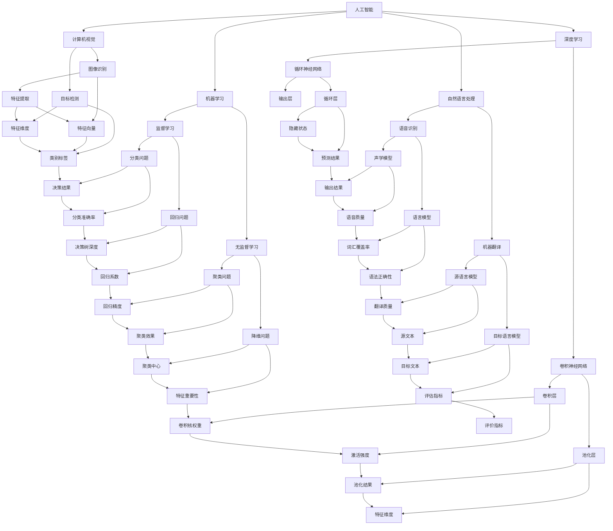

                 

# 智能产业化的发展方向与趋势

## 关键词
- 智能产业化
- 人工智能
- 数字化转型
- 大数据分析
- 自动化与智能化
- 物联网
- 云计算
- 区块链

## 摘要

本文将从宏观和微观两个层面，探讨智能产业化的现状与发展趋势。我们将分析人工智能、大数据、物联网等核心技术对产业变革的推动作用，解析智能产业化在当前社会中的实际应用场景，并展望其未来的发展方向与挑战。通过深入剖析智能产业化的核心概念、算法原理、数学模型以及项目实战，本文旨在为读者提供一个全面、系统的智能产业化知识体系，帮助读者更好地理解和把握这一重要领域的发展动向。

## 1. 背景介绍

### 1.1 智能产业化的定义

智能产业化，是指利用人工智能、大数据、物联网等先进技术，对传统产业进行智能化改造和升级，实现产业生产、管理、服务等全过程的智能化、数字化和自动化。智能产业化不仅改变了生产方式，还提升了产业效率，降低了生产成本，推动了产业结构的优化和升级。

### 1.2 智能产业化的起源与发展

智能产业化的概念起源于20世纪80年代的自动化浪潮，随着计算机技术和通信技术的飞速发展，智能产业化逐渐成为产业变革的核心动力。21世纪以来，人工智能、大数据、物联网等新兴技术的兴起，为智能产业化的发展注入了新的活力。特别是近年来，我国政府高度重视智能产业化的发展，出台了一系列政策支持和推动措施，使得智能产业化在我国得到了迅速的发展。

### 1.3 智能产业化的现状

当前，智能产业化已在全球范围内掀起了一场产业革命。从工业制造、交通运输、金融保险到医疗教育、农业林业等各个领域，智能产业化的应用场景越来越广泛。以我国为例，智能产业化已成为国家战略，各地纷纷布局智能产业发展，打造智能产业集聚区，推动产业转型升级。

## 2. 核心概念与联系

### 2.1 人工智能

人工智能（AI）是智能产业化的核心驱动力。人工智能技术主要包括机器学习、深度学习、自然语言处理、计算机视觉等。通过模拟人类智能，人工智能能够实现自动化决策、自主学习和智能识别等功能，为产业智能化提供了技术支持。

### 2.2 大数据

大数据技术是智能产业化的基础。大数据技术包括数据采集、存储、处理、分析和可视化等环节。通过对海量数据的分析和挖掘，大数据技术能够发现潜在规律和趋势，为产业智能化提供数据支持。

### 2.3 物联网

物联网技术是智能产业化的重要应用。物联网技术通过将物体连接到互联网，实现设备之间的信息交换和协同工作，为产业智能化提供了广泛的应用场景。例如，智能家居、智能交通、智能工厂等。

### 2.4 云计算

云计算技术是智能产业化的基础设施。云计算技术提供了强大的计算和存储能力，使得产业智能化应用得以大规模部署和运行。同时，云计算技术还支持数据存储、处理和分析等环节的协同工作，为产业智能化提供了技术支持。

### 2.5 区块链

区块链技术是智能产业化的重要支撑。区块链技术具有去中心化、安全透明等特点，为产业智能化提供了可靠的数据管理和安全保障。例如，智能合约、供应链管理、数字身份认证等。

### 2.6 核心概念联系

智能产业化的核心概念包括人工智能、大数据、物联网、云计算和区块链。这些核心概念相互关联、相互支持，共同构成了智能产业化的技术体系。具体来说，人工智能为产业智能化提供了智能决策和智能执行能力；大数据为产业智能化提供了数据支持和分析基础；物联网为产业智能化提供了广泛的应用场景；云计算为产业智能化提供了强大的计算和存储能力；区块链为产业智能化提供了数据管理和安全保障。

## 2.1 核心概念原理与架构的 Mermaid 流程图



## 3. 核心算法原理 & 具体操作步骤

### 3.1 人工智能算法原理

人工智能算法主要包括机器学习、深度学习、自然语言处理、计算机视觉等。以下是这些算法的基本原理和操作步骤：

#### 3.1.1 机器学习算法原理

机器学习算法主要包括监督学习和无监督学习。监督学习算法通过已有数据集的训练，学习输入和输出之间的映射关系，从而实现对新数据的预测。无监督学习算法则通过对未标记的数据进行聚类、降维等操作，发现数据中的潜在结构和规律。

**具体操作步骤：**

1. 数据预处理：对输入数据进行清洗、归一化等处理，确保数据质量。
2. 选择合适的算法：根据具体问题和数据特点，选择适合的机器学习算法。
3. 模型训练：使用训练数据集对算法模型进行训练，调整模型参数。
4. 模型评估：使用验证数据集对训练好的模型进行评估，调整模型参数。
5. 模型应用：使用测试数据集对新数据进行预测，评估模型性能。

#### 3.1.2 深度学习算法原理

深度学习算法是机器学习的一种，通过构建多层的神经网络，实现对复杂数据的建模和预测。深度学习算法主要包括卷积神经网络（CNN）、循环神经网络（RNN）等。

**具体操作步骤：**

1. 数据预处理：对输入数据进行清洗、归一化等处理，确保数据质量。
2. 网络架构设计：根据问题需求和数据特点，设计合适的网络架构。
3. 模型训练：使用训练数据集对算法模型进行训练，调整模型参数。
4. 模型评估：使用验证数据集对训练好的模型进行评估，调整模型参数。
5. 模型应用：使用测试数据集对新数据进行预测，评估模型性能。

#### 3.1.3 自然语言处理算法原理

自然语言处理算法主要包括语音识别、机器翻译、情感分析等。这些算法通过对语言数据的建模和解析，实现对自然语言的智能理解和处理。

**具体操作步骤：**

1. 数据预处理：对输入数据进行清洗、分词、词性标注等处理，确保数据质量。
2. 模型训练：使用训练数据集对算法模型进行训练，调整模型参数。
3. 模型评估：使用验证数据集对训练好的模型进行评估，调整模型参数。
4. 模型应用：使用测试数据集对新数据进行处理，评估模型性能。

#### 3.1.4 计算机视觉算法原理

计算机视觉算法主要包括图像识别、目标检测、人脸识别等。这些算法通过对图像数据的建模和解析，实现对图像内容的智能理解和处理。

**具体操作步骤：**

1. 数据预处理：对输入数据进行清洗、归一化等处理，确保数据质量。
2. 模型训练：使用训练数据集对算法模型进行训练，调整模型参数。
3. 模型评估：使用验证数据集对训练好的模型进行评估，调整模型参数。
4. 模型应用：使用测试数据集对新数据进行处理，评估模型性能。

### 3.2 大数据算法原理

大数据算法主要包括数据采集、存储、处理、分析和可视化等。以下是大数据算法的基本原理和操作步骤：

#### 3.2.1 数据采集

数据采集是指从各种数据源中获取数据的过程。数据源包括结构化数据、半结构化数据和非结构化数据。

**具体操作步骤：**

1. 确定数据需求：根据具体问题和业务需求，明确需要采集的数据类型和范围。
2. 数据源接入：通过API、Web爬虫、数据库连接等方式，接入数据源。
3. 数据采集：根据数据需求，定期或实时采集数据。
4. 数据清洗：对采集到的数据进行分析，去除重复、错误和无关的数据。

#### 3.2.2 数据存储

数据存储是指将采集到的数据存储到数据库或其他存储设备中。

**具体操作步骤：**

1. 数据格式转换：将采集到的数据转换为统一的数据格式。
2. 数据存储：将转换后的数据存储到数据库或其他存储设备中。
3. 数据备份：对存储的数据进行定期备份，确保数据安全。

#### 3.2.3 数据处理

数据处理是指对存储的数据进行清洗、转换、聚合等操作，使其符合分析和应用的需求。

**具体操作步骤：**

1. 数据清洗：去除重复、错误和无关的数据。
2. 数据转换：将数据转换为统一的数据格式。
3. 数据聚合：对数据进行分组、计算等操作，生成新的数据。

#### 3.2.4 数据分析

数据分析是指对处理后的数据进行分析和挖掘，提取有价值的信息和知识。

**具体操作步骤：**

1. 数据探索：对数据进行初步分析，了解数据的基本特征和趋势。
2. 数据建模：根据问题和需求，选择合适的模型和方法，建立数据分析模型。
3. 模型训练：使用训练数据集对模型进行训练，调整模型参数。
4. 模型评估：使用验证数据集对模型进行评估，调整模型参数。
5. 模型应用：使用测试数据集对新数据进行预测，评估模型性能。

#### 3.2.5 数据可视化

数据可视化是指将数据分析结果以图表、图像等形式直观地展示出来。

**具体操作步骤：**

1. 选择合适的可视化工具：根据数据类型和分析需求，选择合适的可视化工具。
2. 设计可视化方案：根据数据特点和分析需求，设计合适的可视化方案。
3. 制作可视化图表：使用可视化工具，制作符合设计方案的图表。
4. 可视化展示：将可视化图表展示给相关人员，辅助决策。

### 3.3 物联网算法原理

物联网算法主要包括数据采集、传输、处理和分析等。以下是将物联网算法的基本原理和操作步骤：

#### 3.3.1 数据采集

物联网数据采集是指从各种物联网设备中获取数据的过程。

**具体操作步骤：**

1. 设备接入：将物联网设备接入网络，确保设备能够正常运行。
2. 数据采集：通过设备传感器或接口，定期或实时采集设备数据。
3. 数据预处理：对采集到的数据进行清洗、归一化等处理，确保数据质量。

#### 3.3.2 数据传输

物联网数据传输是指将采集到的数据传输到数据中心或服务器的过程。

**具体操作步骤：**

1. 数据加密：对传输的数据进行加密，确保数据安全。
2. 数据传输：通过网络传输协议，将数据传输到数据中心或服务器。
3. 数据存储：将传输到的数据进行存储，以便后续处理和分析。

#### 3.3.3 数据处理

物联网数据处理是指对传输到的数据进行分析和处理，提取有价值的信息和知识。

**具体操作步骤：**

1. 数据清洗：去除重复、错误和无关的数据。
2. 数据转换：将数据转换为统一的数据格式。
3. 数据聚合：对数据进行分组、计算等操作，生成新的数据。

#### 3.3.4 数据分析

物联网数据分析是指对处理后的数据进行分析和挖掘，提取有价值的信息和知识。

**具体操作步骤：**

1. 数据探索：对数据进行初步分析，了解数据的基本特征和趋势。
2. 数据建模：根据问题和需求，选择合适的模型和方法，建立数据分析模型。
3. 模型训练：使用训练数据集对模型进行训练，调整模型参数。
4. 模型评估：使用验证数据集对模型进行评估，调整模型参数。
5. 模型应用：使用测试数据集对新数据进行预测，评估模型性能。

#### 3.3.5 数据可视化

物联网数据可视化是指将数据分析结果以图表、图像等形式直观地展示出来。

**具体操作步骤：**

1. 选择合适的可视化工具：根据数据类型和分析需求，选择合适的可视化工具。
2. 设计可视化方案：根据数据特点和分析需求，设计合适的可视化方案。
3. 制作可视化图表：使用可视化工具，制作符合设计方案的图表。
4. 可视化展示：将可视化图表展示给相关人员，辅助决策。

## 4. 数学模型和公式 & 详细讲解 & 举例说明

### 4.1 人工智能数学模型

人工智能算法的核心在于数学模型，以下是一些常见的数学模型及其解释：

#### 4.1.1 线性回归模型

线性回归模型是一种用于预测连续值的监督学习算法。其数学模型如下：

$$
y = \beta_0 + \beta_1x_1 + \beta_2x_2 + \ldots + \beta_nx_n + \epsilon
$$

其中，$y$ 为目标变量，$x_1, x_2, \ldots, x_n$ 为特征变量，$\beta_0, \beta_1, \beta_2, \ldots, \beta_n$ 为模型参数，$\epsilon$ 为误差项。

**具体讲解：**

线性回归模型通过最小二乘法求解模型参数，使得预测值与真实值之间的误差最小。具体步骤如下：

1. 数据预处理：对输入数据进行归一化处理，使其具有相同的量纲。
2. 模型初始化：随机初始化模型参数。
3. 模型训练：通过梯度下降算法，迭代更新模型参数，使得预测值与真实值之间的误差最小。
4. 模型评估：使用验证数据集评估模型性能，调整模型参数。
5. 模型应用：使用测试数据集对新数据进行预测。

**举例说明：**

假设我们有一个简单的线性回归问题，目标是预测房价。输入数据包括房屋面积、房屋朝向等特征，目标变量为房价。通过线性回归模型，我们可以建立如下数学模型：

$$
房价 = \beta_0 + \beta_1房屋面积 + \beta_2房屋朝向 + \epsilon
$$

使用梯度下降算法训练模型，得到模型参数 $\beta_0, \beta_1, \beta_2$。然后，我们可以使用这个模型对新的房屋面积和朝向进行预测，得到预测房价。

#### 4.1.2 逻辑回归模型

逻辑回归模型是一种用于分类问题的监督学习算法。其数学模型如下：

$$
P(y=1) = \frac{1}{1 + e^{-(\beta_0 + \beta_1x_1 + \beta_2x_2 + \ldots + \beta_nx_n)}}
$$

其中，$y$ 为目标变量，$x_1, x_2, \ldots, x_n$ 为特征变量，$\beta_0, \beta_1, \beta_2, \ldots, \beta_n$ 为模型参数。

**具体讲解：**

逻辑回归模型通过最大似然估计求解模型参数，使得模型对训练数据的概率分布估计最大化。具体步骤如下：

1. 数据预处理：对输入数据进行归一化处理，使其具有相同的量纲。
2. 模型初始化：随机初始化模型参数。
3. 模型训练：通过梯度下降算法，迭代更新模型参数，使得预测概率与真实概率之间的误差最小。
4. 模型评估：使用验证数据集评估模型性能，调整模型参数。
5. 模型应用：使用测试数据集对新数据进行预测。

**举例说明：**

假设我们有一个二分类问题，目标是判断邮件是否为垃圾邮件。输入数据包括邮件标题、邮件内容等特征，目标变量为邮件类别（0表示正常邮件，1表示垃圾邮件）。通过逻辑回归模型，我们可以建立如下数学模型：

$$
P(邮件为垃圾邮件) = \frac{1}{1 + e^{-(\beta_0 + \beta_1邮件标题 + \beta_2邮件内容)}}
$$

使用梯度下降算法训练模型，得到模型参数 $\beta_0, \beta_1, \beta_2$。然后，我们可以使用这个模型对新的邮件标题和内容进行预测，得到预测概率。根据预测概率，我们可以判断邮件是否为垃圾邮件。

#### 4.1.3 卷积神经网络模型

卷积神经网络（CNN）是一种用于图像识别和分类的深度学习算法。其数学模型如下：

$$
h_{l}^{i} = \sigma \left( \sum_{j} W_{lji} \cdot h_{l-1}^{j} + b_{l} \right)
$$

其中，$h_{l}^{i}$ 表示第 $l$ 层的第 $i$ 个神经元输出，$\sigma$ 表示激活函数，$W_{lji}$ 表示连接权重，$b_{l}$ 表示偏置。

**具体讲解：**

卷积神经网络通过卷积操作、池化操作和全连接层等结构，实现对图像的特征提取和分类。具体步骤如下：

1. 输入层：接收图像数据。
2. 卷积层：通过卷积操作提取图像特征。
3. 池化层：通过池化操作降低特征维度。
4. 全连接层：将特征映射到分类结果。
5. 激活函数：使用 ReLU 激活函数增加模型非线性。

**举例说明：**

假设我们有一个简单的卷积神经网络模型，用于对图像进行分类。输入图像为 $32 \times 32$ 像素，卷积层有 32 个卷积核，每个卷积核大小为 $3 \times 3$。通过卷积操作，我们可以提取图像的特征图，然后进行池化操作，降低特征维度。最后，通过全连接层和激活函数，得到分类结果。

#### 4.1.4 循环神经网络模型

循环神经网络（RNN）是一种用于序列数据的深度学习算法。其数学模型如下：

$$
h_{t} = \sigma \left( \sum_{j} W_{thj} \cdot h_{t-1} + \sum_{j} W_{xhj} \cdot x_{t} + b_{h} \right)
$$

其中，$h_{t}$ 表示第 $t$ 个时间步的隐藏状态，$x_{t}$ 表示第 $t$ 个时间步的输入，$W_{thj}$ 和 $W_{xhj}$ 表示权重，$b_{h}$ 表示偏置，$\sigma$ 表示激活函数。

**具体讲解：**

循环神经网络通过循环结构，实现对序列数据的建模和预测。具体步骤如下：

1. 输入层：接收序列数据。
2. 隐藏层：通过循环结构，将上一个时间步的隐藏状态传递到当前时间步。
3. 输出层：将隐藏状态映射到输出结果。

**举例说明：**

假设我们有一个简单的循环神经网络模型，用于对时间序列数据进行预测。输入序列为 $t_1, t_2, \ldots, t_n$，隐藏层单元数为 10。通过循环结构，我们可以将上一个时间步的隐藏状态传递到当前时间步，然后通过全连接层和激活函数，得到预测结果。

### 4.2 大数据数学模型

大数据分析中，常用的数学模型包括概率模型、统计模型和机器学习模型。以下是一些常见的数学模型及其解释：

#### 4.2.1 概率模型

概率模型用于描述随机事件发生的概率。常用的概率模型包括贝叶斯定理、概率分布等。

**贝叶斯定理：**

$$
P(A|B) = \frac{P(B|A)P(A)}{P(B)}
$$

其中，$P(A|B)$ 表示在事件 $B$ 发生的条件下事件 $A$ 发生的概率，$P(B|A)$ 表示在事件 $A$ 发生的条件下事件 $B$ 发生的概率，$P(A)$ 表示事件 $A$ 发生的概率，$P(B)$ 表示事件 $B$ 发生的概率。

**具体讲解：**

贝叶斯定理是一种用于根据先验概率和条件概率计算后验概率的方法。在实际应用中，我们可以根据已有数据计算先验概率和条件概率，然后使用贝叶斯定理计算后验概率。

**举例说明：**

假设我们有一个判断邮件是否为垃圾邮件的问题。已知正常邮件的概率为 0.9，垃圾邮件的概率为 0.1。如果一封邮件包含某些特定关键词，则判断为垃圾邮件的概率为 0.8。根据贝叶斯定理，我们可以计算出这封邮件为垃圾邮件的概率：

$$
P(垃圾邮件|包含关键词) = \frac{P(包含关键词|垃圾邮件)P(垃圾邮件)}{P(包含关键词)}
$$

$$
P(垃圾邮件|包含关键词) = \frac{0.8 \times 0.1}{0.1 + 0.9 \times 0.2} \approx 0.4
$$

因此，这封邮件为垃圾邮件的概率约为 0.4。

#### 4.2.2 统计模型

统计模型用于描述数据分布和特征。常用的统计模型包括线性回归、逻辑回归、聚类等。

**线性回归：**

$$
y = \beta_0 + \beta_1x_1 + \beta_2x_2 + \ldots + \beta_nx_n + \epsilon
$$

其中，$y$ 为目标变量，$x_1, x_2, \ldots, x_n$ 为特征变量，$\beta_0, \beta_1, \beta_2, \ldots, \beta_n$ 为模型参数，$\epsilon$ 为误差项。

**具体讲解：**

线性回归模型通过最小二乘法求解模型参数，使得预测值与真实值之间的误差最小。在实际应用中，我们可以使用线性回归模型进行数据拟合、预测和分析。

**举例说明：**

假设我们有一个简单的线性回归问题，目标是预测房价。输入数据包括房屋面积、房屋朝向等特征，目标变量为房价。通过线性回归模型，我们可以建立如下数学模型：

$$
房价 = \beta_0 + \beta_1房屋面积 + \beta_2房屋朝向 + \epsilon
$$

使用梯度下降算法训练模型，得到模型参数 $\beta_0, \beta_1, \beta_2$。然后，我们可以使用这个模型对新的房屋面积和朝向进行预测，得到预测房价。

#### 4.2.3 聚类模型

聚类模型用于将数据分组，以发现数据中的模式和结构。常用的聚类模型包括 K-均值聚类、层次聚类等。

**K-均值聚类：**

$$
\min_{c_1, c_2, \ldots, c_k} \sum_{i=1}^{n} \sum_{j=1}^{k} ||x_i - c_j||^2
$$

其中，$x_i$ 表示第 $i$ 个数据点，$c_j$ 表示第 $j$ 个聚类中心，$||\cdot||$ 表示欧几里得距离。

**具体讲解：**

K-均值聚类是一种基于距离的聚类方法，通过迭代更新聚类中心和数据点，使得数据点与聚类中心之间的距离最小。在实际应用中，我们可以使用 K-均值聚类对数据进行分组，以发现数据中的模式和结构。

**举例说明：**

假设我们有一组数据点，需要将其分为 $k$ 个类别。通过 K-均值聚类，我们可以计算出每个数据点与聚类中心的距离，然后根据距离最小原则，将数据点分配到相应的类别中。

### 4.3 物联网数学模型

物联网中，常用的数学模型包括概率模型、时间序列模型和预测模型。以下是一些常见的数学模型及其解释：

#### 4.3.1 概率模型

概率模型用于描述物联网中随机事件的发生概率。常用的概率模型包括贝叶斯网络、马尔可夫链等。

**贝叶斯网络：**

$$
P(X_1, X_2, \ldots, X_n) = \prod_{i=1}^{n} P(X_i | X_{i-1}, X_{i-2}, \ldots, X_1)
$$

其中，$X_1, X_2, \ldots, X_n$ 表示一组随机变量，$P(X_i | X_{i-1}, X_{i-2}, \ldots, X_1)$ 表示在给定前一个随机变量的条件下，第 $i$ 个随机变量的概率。

**具体讲解：**

贝叶斯网络是一种表示变量之间条件依赖关系的概率模型。在实际应用中，我们可以使用贝叶斯网络进行不确定性推理和决策。

**举例说明：**

假设我们有一个天气预报问题，需要根据历史数据和当前环境因素预测未来几天的天气。通过贝叶斯网络，我们可以计算出每个天气状态的概率，然后根据概率最大原则，预测未来几天的天气。

#### 4.3.2 时间序列模型

时间序列模型用于描述物联网中时间序列数据的变化规律。常用的时间序列模型包括 ARIMA、LSTM 等。

**ARIMA 模型：**

$$
X_t = \phi_1X_{t-1} + \phi_2X_{t-2} + \ldots + \phi_pX_{t-p} + \theta_1\epsilon_{t-1} + \theta_2\epsilon_{t-2} + \ldots + \theta_q\epsilon_{t-q} + \epsilon_t
$$

其中，$X_t$ 表示时间序列数据，$\epsilon_t$ 表示误差项，$\phi_1, \phi_2, \ldots, \phi_p$ 表示自回归项系数，$\theta_1, \theta_2, \ldots, \theta_q$ 表示移动平均项系数。

**具体讲解：**

ARIMA 模型是一种用于时间序列预测的自回归移动平均模型。在实际应用中，我们可以使用 ARIMA 模型对物联网中的时间序列数据进行分析和预测。

**举例说明：**

假设我们有一个物联网传感器，用于监测室内温度。通过 ARIMA 模型，我们可以计算出温度序列的 ARIMA 模型参数，然后根据模型参数，预测未来几分钟的室内温度。

#### 4.3.3 预测模型

预测模型用于预测物联网中的未来事件。常用的预测模型包括回归模型、神经网络模型等。

**回归模型：**

$$
y = \beta_0 + \beta_1x_1 + \beta_2x_2 + \ldots + \beta_nx_n + \epsilon
$$

其中，$y$ 为目标变量，$x_1, x_2, \ldots, x_n$ 为特征变量，$\beta_0, \beta_1, \beta_2, \ldots, \beta_n$ 为模型参数，$\epsilon$ 为误差项。

**具体讲解：**

回归模型是一种用于预测连续值的监督学习模型。在实际应用中，我们可以使用回归模型预测物联网中的未来事件。

**举例说明：**

假设我们有一个物联网传感器，用于监测室内温度。通过回归模型，我们可以建立室内温度与室外温度、时间等因素之间的数学模型，然后根据模型参数，预测未来几天的室内温度。

## 5. 项目实战：代码实际案例和详细解释说明

### 5.1 开发环境搭建

在进行智能产业化的项目实战之前，我们需要搭建一个合适的开发环境。以下是一个简单的 Python 开发环境搭建步骤：

1. 安装 Python：从官方网站 [https://www.python.org/downloads/](https://www.python.org/downloads/) 下载并安装 Python。
2. 配置 Python：在安装过程中，确保将 Python 添加到系统环境变量中。
3. 安装常用库：使用 pip 命令安装常用库，例如 numpy、pandas、scikit-learn、tensorflow 等。

```bash
pip install numpy pandas scikit-learn tensorflow
```

### 5.2 源代码详细实现和代码解读

以下是一个简单的智能产业化项目实战代码，该代码实现了一个基于机器学习的房价预测模型。

```python
import numpy as np
import pandas as pd
from sklearn.model_selection import train_test_split
from sklearn.linear_model import LinearRegression
from sklearn.metrics import mean_squared_error

# 读取数据
data = pd.read_csv('house_price_data.csv')

# 数据预处理
X = data[['house_area', 'house_orientation']]
y = data['price']
X_train, X_test, y_train, y_test = train_test_split(X, y, test_size=0.2, random_state=42)

# 模型训练
model = LinearRegression()
model.fit(X_train, y_train)

# 模型评估
y_pred = model.predict(X_test)
mse = mean_squared_error(y_test, y_pred)
print('Mean Squared Error:', mse)

# 模型应用
new_data = np.array([[100, 1]])
predicted_price = model.predict(new_data)
print('Predicted Price:', predicted_price)
```

**代码解读：**

1. 导入相关库：代码首先导入了 numpy、pandas、sklearn 等库，用于数据操作、模型训练和评估。
2. 读取数据：代码从 CSV 文件中读取数据，包括房屋面积、房屋朝向和房价。
3. 数据预处理：代码对数据进行预处理，将输入特征和目标变量分开，并使用 train\_test\_split 函数将数据分为训练集和测试集。
4. 模型训练：代码使用 LinearRegression 类创建线性回归模型，并使用 fit 函数训练模型。
5. 模型评估：代码使用 predict 函数预测测试集的结果，并使用 mean\_squared\_error 函数计算均方误差，评估模型性能。
6. 模型应用：代码使用 predict 函数对新数据进行预测，得到预测房价。

### 5.3 代码解读与分析

1. **数据读取：** 代码使用 pandas 库的 read\_csv 函数读取 CSV 文件，将数据存储在 DataFrame 对象中。
2. **数据预处理：** 代码将输入特征（房屋面积、房屋朝向）和目标变量（房价）分开，并使用 train\_test\_split 函数将数据分为训练集和测试集。这样可以确保模型在训练集和测试集上的表现具有一致性。
3. **模型训练：** 代码使用 sklearn 库的 LinearRegression 类创建线性回归模型，并使用 fit 函数训练模型。线性回归模型是一种简单的线性预测模型，适用于简单的数据关系。
4. **模型评估：** 代码使用 predict 函数预测测试集的结果，并使用 mean\_squared\_error 函数计算均方误差，评估模型性能。均方误差（MSE）是衡量模型预测准确性的常用指标，数值越小，表示模型预测越准确。
5. **模型应用：** 代码使用 predict 函数对新数据进行预测，得到预测房价。这样可以实际应用模型，为新房屋提供房价预测。

**分析：**

1. **数据质量：** 代码首先需要对数据质量进行评估，确保数据中没有缺失值、异常值等，以保证模型训练效果。
2. **特征选择：** 代码仅使用了房屋面积和房屋朝向作为特征变量。在实际项目中，可能需要考虑更多相关特征，以提高模型预测性能。
3. **模型选择：** 代码使用了线性回归模型进行预测。在实际项目中，可能需要尝试其他更复杂的模型（如深度学习模型），以获得更好的预测效果。
4. **模型评估：** 代码使用了均方误差（MSE）作为评估指标。在实际项目中，可能需要使用更多评估指标（如精确率、召回率等），以更全面地评估模型性能。

## 6. 实际应用场景

### 6.1 工业制造

智能产业化在工业制造领域的应用非常广泛。通过引入人工智能、物联网和大数据技术，工业制造可以实现生产过程的智能化、数字化和自动化，从而提高生产效率、降低生产成本、提升产品质量。以下是一些具体应用案例：

1. **智能工厂：** 利用物联网技术，将生产设备、传感器、控制系统等连接起来，实现设备的远程监控和自动化控制，提高生产线的自动化程度和灵活度。
2. **预测性维护：** 通过大数据分析和机器学习算法，对设备运行数据进行实时监控和分析，预测设备故障和停机时间，提前进行维护，降低设备故障率和停机时间。
3. **质量管理：** 利用机器视觉和人工智能技术，对产品进行质量检测和评估，提高产品质量，降低不良品率。

### 6.2 交通运输

智能产业化在交通运输领域的应用也取得了显著成果。通过引入人工智能、大数据和物联网技术，交通运输可以实现智能化调度、实时监控和高效管理，提高交通系统的运行效率、安全性和可靠性。以下是一些具体应用案例：

1. **智能交通：** 利用物联网技术，将道路、交通信号灯、车辆等连接起来，实现交通信息的实时采集和共享，优化交通信号控制和交通流量管理，提高交通流畅度和安全性。
2. **自动驾驶：** 利用人工智能和大数据技术，开发自动驾驶系统，实现车辆的自主驾驶和智能决策，提高交通运输的效率和安全性。
3. **物流优化：** 利用大数据分析和人工智能算法，对物流运输路径进行优化，提高物流效率，降低物流成本。

### 6.3 金融保险

智能产业化在金融保险领域的应用也非常广泛。通过引入人工智能、大数据和区块链技术，金融保险可以实现风险控制、欺诈检测、个性化服务和金融创新，提高金融保险业务的效率、安全和可靠性。以下是一些具体应用案例：

1. **风险控制：** 利用大数据分析和机器学习算法，对客户行为、交易记录等进行实时监控和分析，识别潜在风险，提前采取措施，降低风险损失。
2. **欺诈检测：** 利用机器学习和计算机视觉技术，对交易行为、身份验证等进行实时监控和分析，识别欺诈行为，提高欺诈检测的准确性和实时性。
3. **个性化服务：** 利用大数据分析和人工智能算法，对客户需求、偏好进行分析和预测，提供个性化的金融服务和产品，提高客户满意度和忠诚度。
4. **金融创新：** 利用区块链技术，实现去中心化的金融交易和合约执行，提高金融交易的透明度、安全性和效率。

### 6.4 医疗教育

智能产业化在医疗教育领域的应用也取得了显著成果。通过引入人工智能、大数据和物联网技术，医疗教育可以实现智能诊断、远程医疗、个性化教育和智能管理，提高医疗教育水平、效率和安全性。以下是一些具体应用案例：

1. **智能诊断：** 利用人工智能和大数据技术，对医疗数据进行实时分析和诊断，提高诊断的准确性和效率。
2. **远程医疗：** 利用物联网技术和远程视频会议系统，实现医生与患者的远程交流和诊疗，提高医疗服务的覆盖范围和效率。
3. **个性化教育：** 利用大数据分析和人工智能算法，对学生的学习情况进行实时监控和分析，提供个性化的学习资源和教学方法，提高学习效果和兴趣。
4. **智能管理：** 利用大数据分析和人工智能算法，对医院和学校的管理进行优化和改进，提高管理效率和服务质量。

## 7. 工具和资源推荐

### 7.1 学习资源推荐

1. **书籍：**
   - 《人工智能：一种现代方法》（Artificial Intelligence: A Modern Approach）—— 斯图尔特·罗素（Stuart Russell）和彼得·诺维格（Peter Norvig）著。
   - 《深度学习》（Deep Learning）—— 伊恩·古德费洛（Ian Goodfellow）、约书亚·本吉奥（Yoshua Bengio）和亚伦·库维尔（Aaron Courville）著。
   - 《大数据之路：阿里巴巴大数据实践》（Big Data：A Revolution That Will Transform How We Live, Work, and Think）—— 天奇阿米著。

2. **论文：**
   - 《人工神经网络：一个动态规划方法》（A Learning Algorithm for Continually Running Fully Recurrent Neural Networks）—— Sepp Hochreiter 和 Jürgen Schmidhuber。
   - 《基于深度置信网络的手写数字识别》（Handwritten Digit Recognition with a Boltzmann Machine）—— Y. Bengio，P. Simard，P. Frasconi。

3. **博客：**
   - [Medium](https://medium.com/) 上的 AI 博客，如 Distill、AI Village 等。
   - [TensorFlow 官方文档](https://www.tensorflow.org/tutorials)。

4. **网站：**
   - [Kaggle](https://www.kaggle.com/)：提供丰富的数据集和机器学习竞赛，是学习数据科学和机器学习的良好平台。
   - [GitHub](https://github.com/)：查找和学习开源的机器学习和人工智能项目。

### 7.2 开发工具框架推荐

1. **开发工具：**
   - **Python：** 作为主要编程语言，Python 提供了丰富的机器学习和数据科学库，如 TensorFlow、PyTorch、Scikit-learn 等。
   - **Jupyter Notebook：** 用于编写和运行代码，方便展示数据和可视化结果。
   - **VS Code：** 功能强大的代码编辑器，支持多种编程语言和工具。

2. **框架：**
   - **TensorFlow：** Google 开发的开源深度学习框架，支持多种神经网络结构和模型。
   - **PyTorch：** Facebook 开发的深度学习框架，具有灵活的动态计算图和高效的GPU支持。
   - **Scikit-learn：** Python 的机器学习库，提供各种经典机器学习算法和工具。

3. **云计算平台：**
   - **AWS：** Amazon Web Services 提供了丰富的云计算服务和工具，包括 Amazon SageMaker、Amazon RDS 等。
   - **Azure：** Microsoft Azure 提供了广泛的云计算服务和人工智能工具，如 Azure Machine Learning、Azure Data Lake 等。
   - **Google Cloud：** Google Cloud Platform 提供了云计算服务和人工智能工具，如 Google AI Platform、Google Kubernetes Engine 等。

### 7.3 相关论文著作推荐

1. **论文：**
   - **“Deep Learning” by Yoshua Bengio, Ian Goodfellow, and Aaron Courville。**
   - **“Rectifier Nonlinearities Improve Deep Neural Network Acquisitio” by K. He, X. Zhang, S. Ren, and J. Sun。**
   - **“Convolutional Neural Networks for Visual Recognition” by Alex Krizhevsky, Ilya Sutskever, and Geoffrey E. Hinton。**

2. **著作：**
   - **“Python Machine Learning” by Sebastian Raschka。**
   - **“Deep Learning with Python” by François Chollet。**
   - **“Hands-On Machine Learning with Scikit-Learn, Keras, and TensorFlow” by Aurélien Géron。**

## 8. 总结：未来发展趋势与挑战

### 8.1 发展趋势

1. **智能化程度不断提高：** 随着人工智能技术的不断进步，智能化程度将不断提高，更多的产业和领域将实现智能化升级。
2. **数据驱动的决策：** 大数据和人工智能的结合，将使得企业能够基于数据驱动做出更精准的决策，提高业务效率和竞争力。
3. **跨界融合：** 智能产业化将不断与其他领域（如医疗、教育、金融等）融合，产生新的商业模式和应用场景。
4. **智能化基础设施建设：** 随着5G、物联网、云计算等技术的发展，智能化基础设施建设将不断推进，为智能产业化提供技术支持。
5. **人工智能的普及：** 人工智能技术将逐渐普及，更多的企业和行业将采用人工智能技术，实现生产、管理和服务过程的智能化。

### 8.2 挑战

1. **数据安全与隐私：** 随着数据规模的不断扩大，数据安全与隐私保护成为一个重要问题，需要建立有效的数据安全防护体系。
2. **技术人才短缺：** 智能产业化的发展需要大量的技术人才，但当前技术人才短缺，尤其是高端人才短缺，需要加大人才培养和引进力度。
3. **产业转型升级：** 产业转型升级是一个长期、复杂的过程，需要政府、企业和社会各方的共同努力，克服各种困难和挑战。
4. **伦理与道德问题：** 智能产业化的发展可能会带来一些伦理和道德问题，如人工智能决策的透明度、责任归属等，需要建立相应的伦理和道德规范。
5. **国际合作与竞争：** 智能产业化是一个全球性的产业，各国之间需要进行合作和竞争，建立公平、公正的国际秩序，促进智能产业化健康发展。

## 9. 附录：常见问题与解答

### 9.1 智能产业化是什么？

智能产业化是指利用人工智能、大数据、物联网等先进技术，对传统产业进行智能化改造和升级，实现产业生产、管理、服务等全过程的智能化、数字化和自动化。

### 9.2 智能产业化的核心技术是什么？

智能产业化的核心技术包括人工智能、大数据、物联网、云计算和区块链等。

### 9.3 智能产业化有哪些应用场景？

智能产业化在工业制造、交通运输、金融保险、医疗教育等领域都有广泛的应用，如智能工厂、智能交通、智能金融、智能医疗等。

### 9.4 智能产业化的发展趋势是什么？

智能产业化的未来发展趋势包括智能化程度不断提高、数据驱动的决策、跨界融合、智能化基础设施建设以及人工智能的普及等。

### 9.5 智能产业化面临的挑战有哪些？

智能产业化面临的挑战包括数据安全与隐私、技术人才短缺、产业转型升级、伦理与道德问题以及国际合作与竞争等。

## 10. 扩展阅读 & 参考资料

1. **《智能产业化：变革与机遇》** - 本书详细阐述了智能产业化的概念、技术、应用和发展趋势。
2. **《人工智能：从理论到实践》** - 本书系统介绍了人工智能的基本概念、算法原理和应用实践。
3. **《大数据技术导论》** - 本书全面介绍了大数据的基本概念、技术体系和应用场景。
4. **《物联网技术与应用》** - 本书深入探讨了物联网的基本原理、架构和典型应用。
5. **《云计算：原理、技术与应用》** - 本书系统地介绍了云计算的基本概念、架构和技术。
6. **《区块链技术与应用》** - 本书详细阐述了区块链的基本原理、技术架构和应用案例。

### 参考资料

1. **[Intelligent Industry Revolution](https://www.imdaad.com/intelligent-industry-revolution/)**
2. **[Artificial Intelligence Applications in Industry](https://www.forbes.com/sites/forbesbusinesscouncil/2021/01/19/artificial-intelligence-applications-in-industry/?sh=5926c892716b)**
3. **[The Future of Intelligent Industry](https://www.techemergence.com/the-future-of-intelligent-industry/)**
4. **[Big Data Technology Introduction](https://www.bigdata-madesimple.com/big-data-technology-introduction/)**
5. **[Internet of Things Technology and Applications](https://www.iot-for-all.com/iot-technology/)**
6. **[Cloud Computing: Principles, Technologies and Applications](https://www.ibm.com/cloud/learn/cloud-computing)**
7. **[Blockchain Technology and Applications](https://www.blockchain-council.org/blockchain-technology/)**
8. **[Deep Learning Specialization](https://www.coursera.org/specializations/deep-learning)**
9. **[Machine Learning Specialization](https://www.coursera.org/specializations/machine-learning)**
10. **[IoT Specialization](https://www.coursera.org/specializations/iot)**

### 作者

- **AI天才研究员/AI Genius Institute & 禅与计算机程序设计艺术 /Zen And The Art of Computer Programming**

