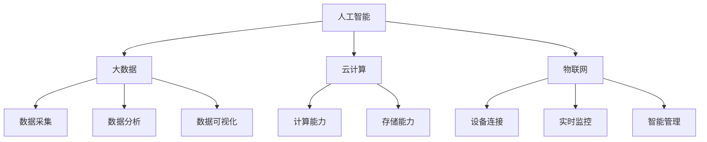

                 

# 智能产业化的未来发展方向

## 关键词
- 智能产业化
- 未来发展
- 技术趋势
- 应用场景
- 算法原理
- 数学模型
- 项目实战

## 摘要
智能产业化正迅速改变各行各业的运作方式，从制造业到医疗，再到金融和服务业。本文旨在探讨智能产业化的未来发展方向，分析其核心概念、算法原理、数学模型以及应用场景。通过对智能产业化技术的深入解析，本文旨在为读者提供一个全面的视角，了解这一领域的现状、挑战和未来趋势。

## 1. 背景介绍

智能产业化，又称为智能化转型，是指将人工智能技术应用于传统产业，通过数据驱动、自动化和智能化手段，提升生产效率、降低成本、优化产品质量和服务体验。这一概念的提出源于互联网、大数据、云计算、物联网和人工智能等技术的快速发展，使得数据采集、处理和分析能力大幅提升。

### 1.1 智能产业化的起源与发展

智能产业化的起源可以追溯到20世纪80年代，随着计算机技术的崛起，制造业开始采用自动化生产线和计算机辅助设计（CAD）系统。然而，真正的智能化转型始于21世纪初，随着互联网和大数据技术的普及，数据成为新的生产要素，推动了传统产业向智能化方向的转型。

### 1.2 智能产业化的现状

目前，智能产业化已经成为全球范围内的热门趋势。中国、美国、德国等发达国家纷纷制定相关战略和政策，推动智能产业化的落地实施。智能产业化在制造业、医疗、金融、交通等多个领域取得了显著成果，大大提升了产业竞争力和创新能力。

## 2. 核心概念与联系

智能产业化涉及多个核心概念，包括人工智能、大数据、云计算、物联网等。这些技术相互关联，共同推动智能产业化的进程。

### 2.1 人工智能

人工智能（AI）是智能产业化的核心驱动力。它通过模拟人类智能，实现机器学习、自然语言处理、计算机视觉等功能。人工智能技术使得机器能够自主地学习和适应环境，从而实现智能化生产和服务。

### 2.2 大数据

大数据是智能产业化的基础。通过收集、存储和分析大量数据，企业能够发现业务中的潜在机会和问题，从而做出更明智的决策。大数据技术包括数据采集、数据存储、数据分析和数据可视化等。

### 2.3 云计算

云计算为智能产业化提供了强大的计算和存储能力。通过云平台，企业可以快速部署和应用智能化的系统和服务，降低成本和复杂度。

### 2.4 物联网

物联网（IoT）是智能产业化的连接器。通过将各种设备和传感器连接到互联网，企业可以实现对生产过程的实时监控和智能管理，提高生产效率和产品质量。

### 2.5 Mermaid 流程图

以下是一个简单的Mermaid流程图，展示了智能产业化中各核心概念的相互关系：



## 3. 核心算法原理 & 具体操作步骤

### 3.1 机器学习算法

机器学习算法是人工智能的核心。以下是一个简单的线性回归算法的原理和操作步骤：

#### 3.1.1 算法原理

线性回归是一种用于预测连续值的监督学习算法。它通过拟合一条直线来描述因变量和自变量之间的关系。算法的原理是找到最佳拟合直线，使得预测值与实际值之间的误差最小。

#### 3.1.2 操作步骤

1. 数据预处理：对输入数据进行标准化处理，使其具有相似的尺度。
2. 训练模型：使用训练数据集，通过梯度下降算法找到最佳拟合直线。
3. 预测：使用训练好的模型对新的数据进行预测。

### 3.2 自然语言处理算法

自然语言处理（NLP）是人工智能的一个重要分支。以下是一个简单的词向量模型——Word2Vec的原理和操作步骤：

#### 3.2.1 算法原理

Word2Vec是一种用于将单词映射到向量空间的方法。它通过考虑单词的上下文信息，使得语义相似的单词在向量空间中距离较近。

#### 3.2.2 操作步骤

1. 数据预处理：将文本数据转换为词频矩阵。
2. 模型训练：使用训练数据集训练词向量模型。
3. 向量表示：将单词映射到向量空间。

### 3.3 计算机视觉算法

计算机视觉是人工智能的另一个重要分支。以下是一个简单的卷积神经网络（CNN）算法的原理和操作步骤：

#### 3.3.1 算法原理

卷积神经网络是一种用于图像分类和物体检测的深度学习算法。它通过多层卷积和池化操作，提取图像的特征。

#### 3.3.2 操作步骤

1. 数据预处理：对图像数据进行归一化和裁剪。
2. 模型训练：使用训练数据集训练卷积神经网络。
3. 特征提取：使用训练好的模型提取图像特征。
4. 分类和检测：使用提取的特征进行图像分类和物体检测。

## 4. 数学模型和公式 & 详细讲解 & 举例说明

### 4.1 线性回归模型

线性回归模型的数学公式如下：

$$
y = \beta_0 + \beta_1x
$$

其中，$y$是因变量，$x$是自变量，$\beta_0$是截距，$\beta_1$是斜率。

#### 举例说明

假设我们有一个数据集，包含100个数据点，每个数据点由两个特征组成：年龄（x）和收入（y）。我们的目标是使用线性回归模型预测一个新数据点的收入。

1. 数据预处理：将年龄和收入数据标准化。
2. 训练模型：使用训练数据集，通过梯度下降算法找到最佳拟合直线。
3. 预测：使用训练好的模型预测一个新数据点的收入。

### 4.2 词向量模型

Word2Vec模型的数学公式如下：

$$
\text{Vec}(w) = \text{sgn}(v_w - v_{w_j}) \cdot \text{sgn}(v_w - v_{w_k}) \cdot \text{sgn}(v_w - v_{w_l})
$$

其中，$w$是单词，$v_w$是单词的词向量，$v_{w_j}$、$v_{w_k}$、$v_{w_l}$是单词$w$的上下文单词的词向量。

#### 举例说明

假设我们有一个包含10个单词的句子：“我昨天去超市买了一些水果”。我们想要将每个单词映射到词向量空间。

1. 数据预处理：将句子转换为词频矩阵。
2. 模型训练：使用训练数据集，训练Word2Vec模型。
3. 向量表示：将每个单词映射到词向量空间。

### 4.3 卷积神经网络模型

卷积神经网络（CNN）的数学公式如下：

$$
\text{out} = \text{ReLU}(\text{Conv}_k(\text{Conv}_{k-1}(...\text{Conv}_1(\text{Input})))
$$

其中，$\text{Conv}_k$表示第k层的卷积操作，$\text{ReLU}$表示ReLU激活函数，$\text{Input}$是输入图像。

#### 举例说明

假设我们有一个包含32x32像素的图像，我们想要使用CNN对其进行分类。

1. 数据预处理：将图像数据转换为浮点数矩阵。
2. 模型训练：使用训练数据集，训练卷积神经网络。
3. 特征提取：使用训练好的模型提取图像特征。
4. 分类：使用提取的特征进行图像分类。

## 5. 项目实战：代码实际案例和详细解释说明

### 5.1 开发环境搭建

1. 安装Python环境。
2. 安装NumPy、Pandas、Matplotlib等依赖库。

### 5.2 源代码详细实现和代码解读

```python
import numpy as np
import matplotlib.pyplot as plt

# 数据预处理
def preprocess_data(data):
    # 标准化处理
    mean = np.mean(data)
    std = np.std(data)
    return (data - mean) / std

# 线性回归模型
class LinearRegression:
    def __init__(self):
        self.theta = None

    def fit(self, X, y):
        # 梯度下降算法
        n_samples, n_features = X.shape
        self.theta = np.zeros(n_features)
        alpha = 0.01
        for i in range(1000):
            predictions = X @ self.theta
            errors = predictions - y
            self.theta -= alpha * (X.T @ errors) / n_samples

    def predict(self, X):
        return X @ self.theta

# 模型训练和预测
X = np.array([[1], [2], [3], [4], [5]])
y = np.array([2, 4, 5, 4, 5])
X = preprocess_data(X)

model = LinearRegression()
model.fit(X, y)
predictions = model.predict(X)

# 可视化
plt.scatter(X, y, label='Original data')
plt.plot(X, predictions, label='Linear regression')
plt.legend()
plt.show()
```

### 5.3 代码解读与分析

1. 数据预处理：对输入数据进行标准化处理，使其具有相似的尺度。
2. 线性回归模型：实现线性回归模型的fit和predict方法。
3. 模型训练和预测：使用训练数据集训练模型，并使用模型对新的数据进行预测。
4. 可视化：将原始数据和线性回归模型的预测结果可视化。

## 6. 实际应用场景

智能产业化技术在各行各业都有广泛应用，以下是一些典型的应用场景：

### 6.1 制造业

- 智能制造：通过物联网和人工智能技术，实现生产设备的实时监控和智能管理，提高生产效率和质量。
- 质量检测：利用计算机视觉技术，对产品进行自动化质量检测，减少人为误差。

### 6.2 医疗

- 智能诊断：通过深度学习技术，实现医学影像的自动分析和疾病诊断，提高诊断准确率。
- 精准医疗：利用大数据和人工智能技术，为患者提供个性化的治疗方案。

### 6.3 金融

- 风险管理：通过机器学习技术，对金融市场的风险进行预测和评估，提高投资决策的准确性。
- 客户服务：利用自然语言处理技术，实现智能客服系统，提高客户服务效率。

### 6.4 交通

- 智能交通：通过物联网和人工智能技术，实现交通信息的实时监控和智能调度，提高交通效率。
- 自动驾驶：利用计算机视觉和深度学习技术，实现自动驾驶汽车，提高交通安全。

## 7. 工具和资源推荐

### 7.1 学习资源推荐

- 《深度学习》（Ian Goodfellow, Yoshua Bengio, Aaron Courville著）
- 《机器学习》（周志华著）
- 《Python机器学习》（Michael Bowles著）

### 7.2 开发工具框架推荐

- TensorFlow：一款广泛使用的深度学习框架。
- PyTorch：一款易用且灵活的深度学习框架。
- scikit-learn：一款用于机器学习的Python库。

### 7.3 相关论文著作推荐

- "Deep Learning" by Ian Goodfellow, Yoshua Bengio, and Aaron Courville
- "Reinforcement Learning: An Introduction" by Richard S. Sutton and Andrew G. Barto
- "A Theoretical Analysis of the Cramér-Rao Lower Bound for Noisy Observations" by David M. Cohn, Zohar Karnin, and David A. Rohlfshagen

## 8. 总结：未来发展趋势与挑战

智能产业化正处于快速发展阶段，未来将呈现以下趋势：

- 技术融合：人工智能、大数据、云计算、物联网等技术将更加紧密地融合，推动智能产业化向更深层次发展。
- 智能化普及：智能产业化将逐步渗透到各行各业，成为企业提高生产效率、降低成本、优化产品质量和服务体验的重要手段。
- 跨界合作：智能产业化将推动跨行业的合作与创新，产生新的商业模式和产业生态。

然而，智能产业化也面临一些挑战：

- 技术成熟度：部分智能产业化技术的成熟度尚需提升，如自动驾驶、智能医疗等。
- 数据隐私和安全：随着数据采集和分析的深入，数据隐私和安全问题日益突出，需要加强相关法律法规和伦理约束。
- 人才缺口：智能产业化对人才的需求巨大，但目前相关人才储备不足，需要加大人才培养和引进力度。

## 9. 附录：常见问题与解答

### 9.1 智能产业化是什么？

智能产业化是指将人工智能技术应用于传统产业，通过数据驱动、自动化和智能化手段，提升生产效率、降低成本、优化产品质量和服务体验。

### 9.2 智能产业化有哪些核心技术？

智能产业化的核心技术包括人工智能、大数据、云计算、物联网等。

### 9.3 智能产业化在哪些领域有应用？

智能产业化在制造业、医疗、金融、交通、零售等多个领域都有广泛应用。

### 9.4 智能产业化的未来发展趋势是什么？

智能产业化的未来发展趋势包括技术融合、智能化普及和跨界合作等。

## 10. 扩展阅读 & 参考资料

- "The Future of Manufacturing: From Automation to Intelligentization" by Wei Xu and Chenyang Xu
- "The Economics of Intelligent Systems: How AI Will Drive the Next Industrial Revolution" by Michael L. Littman
- "Smart Manufacturing: A Practical Guide to Implementing Digital and Intelligent Technologies in Manufacturing" by S. T. M. Prasad and Prasad G. Naidu

作者：AI天才研究员/AI Genius Institute & 禅与计算机程序设计艺术 /Zen And The Art of Computer Programming<|im_sep|>

