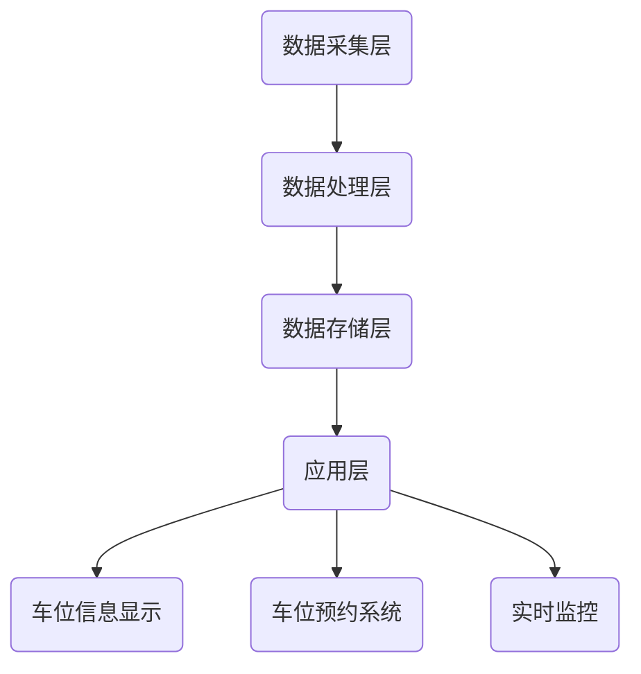
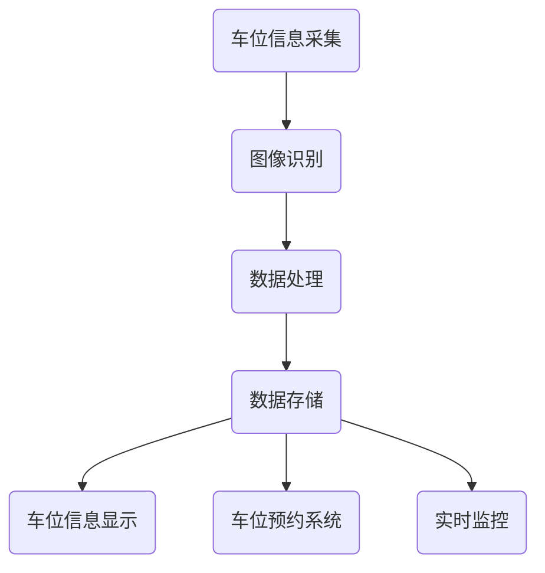

                 

# 智能停车系统：解决城市停车难题的创新方案

## 关键词
智能停车、城市交通管理、大数据分析、图像识别、实时监控、车位预约

## 摘要
随着城市化进程的加快，城市停车难题日益凸显，严重影响居民的出行体验和城市交通效率。本文将介绍一种创新的智能停车系统，通过集成大数据分析、图像识别和实时监控技术，提供高效、便捷的停车解决方案。我们将详细探讨智能停车系统的核心概念、算法原理、数学模型、实战案例以及未来发展趋势，帮助读者了解这一领域的前沿技术和应用场景。

## 1. 背景介绍
### 城市停车难题
城市停车问题一直是城市化进程中的一大难题。随着汽车数量的急剧增加，停车位供不应求，导致以下问题：
- **交通拥堵**：寻找停车位导致车辆在路上空转，加剧交通拥堵。
- **环境污染**：车辆拥堵排放污染物，影响空气质量。
- **效率低下**：停车资源未能充分利用，导致资源浪费。

### 城市化进程加速
城市化进程加速使得城市面积不断扩大，人口密度增加，对停车设施的需求也随之增长。传统停车管理模式已无法满足现代城市的需求，迫切需要一种智能化、高效的解决方案。

### 智能停车系统的需求
智能停车系统旨在解决城市停车难题，提高停车效率，减少交通拥堵，提升居民生活质量。其主要需求包括：
- **实时车位信息**：提供实时、准确的停车位信息，帮助司机快速找到空闲车位。
- **车位预约**：实现车位预约，减少空驶率，提高车位使用率。
- **智能监控**：实时监控停车位状态，预防违停行为，保障停车位公平使用。
- **数据分析**：通过大数据分析，优化停车资源配置，提升停车效率。

## 2. 核心概念与联系

### 概念介绍
智能停车系统涉及多个核心概念，包括：
- **车位信息采集**：通过传感器、摄像头等技术，实时获取停车位状态。
- **图像识别**：利用计算机视觉技术，识别停车位和车辆状态。
- **实时监控**：通过监控设备，实时监测停车区域，防止违停等异常行为。
- **车位预约**：实现用户在线预约车位，减少找车位时间。
- **数据分析**：通过大数据技术，分析停车行为，优化停车资源配置。

### 架构与联系
智能停车系统的整体架构如下：
1. **数据采集层**：通过传感器和摄像头等设备，实时采集停车位信息。
2. **数据处理层**：利用图像识别算法，对采集到的数据进行处理，识别停车位状态。
3. **数据存储层**：将处理后的数据存储在数据库中，供后续分析使用。
4. **应用层**：提供车位预约、实时监控等应用功能，供用户使用。



### 流程图
智能停车系统的基本工作流程如下：
1. 车位信息采集：传感器和摄像头实时采集停车位状态。
2. 数据处理：图像识别算法对采集到的数据进行分析，识别停车位状态。
3. 数据存储：将处理后的数据存储在数据库中，供后续分析使用。
4. 应用展示：通过应用层，将停车位信息实时展示给用户，实现车位预约和实时监控。



## 3. 核心算法原理 & 具体操作步骤

### 图像识别算法
智能停车系统的核心在于图像识别算法，通过计算机视觉技术，对摄像头采集到的图像进行处理，识别停车位和车辆状态。主要算法包括：
- **目标检测**：检测图像中的车辆和停车位，定位其位置。
- **特征提取**：提取车辆和停车位的特征，用于后续的识别和分类。
- **分类与识别**：根据特征信息，分类判断车辆和停车位的状态，如空闲、占用等。

### 具体操作步骤
智能停车系统的具体操作步骤如下：
1. **数据预处理**：对采集到的图像进行预处理，包括去噪、增强等。
2. **目标检测**：利用目标检测算法（如YOLO、SSD等），检测图像中的车辆和停车位。
3. **特征提取**：使用卷积神经网络（CNN）等算法，提取车辆和停车位的特征。
4. **分类与识别**：利用分类算法（如SVM、CNN等），对提取的特征进行分类，识别车辆和停车位的状态。
5. **实时更新**：将识别结果实时更新到数据库，供后续分析和使用。

### 实时监控
实时监控是智能停车系统的关键组成部分，通过视频监控设备，对停车区域进行实时监控，防止违停等异常行为。主要步骤包括：
1. **视频流采集**：通过摄像头等设备，采集停车区域的视频流。
2. **异常检测**：利用图像识别算法，对视频流进行分析，检测违停等异常行为。
3. **报警与处理**：当检测到异常行为时，触发报警，通知管理人员进行处理。

## 4. 数学模型和公式 & 详细讲解 & 举例说明

### 数学模型
智能停车系统中的数学模型主要包括图像识别算法和实时监控算法。以下将详细介绍其中的两个关键模型：

#### 目标检测模型

目标检测是图像识别的核心步骤，其数学模型通常可以表示为：

$$
\hat{y} = \text{softmax}(W \cdot \phi(x)) + b
$$

其中，$x$ 为输入图像，$\phi(\cdot)$ 表示特征提取操作，$W$ 和 $b$ 分别为权重和偏置。$softmax$ 函数用于对目标概率进行归一化处理，$\hat{y}$ 为预测的目标类别。

#### 异常检测模型

异常检测是实时监控的核心步骤，其数学模型通常可以表示为：

$$
s(x) = \frac{1}{c} \sum_{i=1}^{c} \exp \left( - \frac{d^2(x, \mu_i)}{2\sigma^2} \right)
$$

其中，$x$ 为输入图像，$\mu_i$ 和 $\sigma^2$ 分别为第 $i$ 个正常类的均值和方差，$d(\cdot, \cdot)$ 表示欧氏距离，$s(x)$ 表示图像 $x$ 属于正常类的概率。

### 举例说明

#### 目标检测模型

假设我们有一个输入图像 $x$，通过卷积神经网络提取到的特征向量为 $\phi(x) = [0.1, 0.3, 0.2, 0.4]$。假设权重 $W = [0.2, 0.3, 0.4, 0.1]$，偏置 $b = 0.1$。则目标检测模型的预测概率为：

$$
\hat{y} = \text{softmax}(W \cdot \phi(x)) + b = \text{softmax}([0.2 \cdot 0.1, 0.3 \cdot 0.3, 0.4 \cdot 0.2, 0.1 \cdot 0.4]) + 0.1
$$

$$
\hat{y} = \text{softmax}([0.02, 0.09, 0.08, 0.04]) + 0.1 = [0.25, 0.225, 0.2, 0.275]
$$

由于 $\hat{y}$ 的最后一项概率最大，因此预测目标类别为车辆。

#### 异常检测模型

假设我们有一个输入图像 $x$，正常类的均值为 $\mu_1 = [0.1, 0.3, 0.2, 0.4]$，方差为 $\sigma_1^2 = 0.1$。则异常检测模型预测图像 $x$ 属于正常类的概率为：

$$
s(x) = \frac{1}{0.1} \sum_{i=1}^{1} \exp \left( - \frac{d^2(x, \mu_i)}{2 \cdot 0.1^2} \right) = \frac{1}{0.1} \exp \left( - \frac{0.1^2}{2 \cdot 0.1^2} \right) = 1
$$

由于 $s(x) = 1$，因此预测图像 $x$ 属于正常类的概率为 100%。

## 5. 项目实战：代码实际案例和详细解释说明

### 开发环境搭建
为了实现智能停车系统，我们需要搭建一个开发环境。以下是所需的软件和工具：

- Python 3.8+
- OpenCV 4.5.1.48
- TensorFlow 2.6.0
- Keras 2.6.0

### 源代码详细实现和代码解读
以下是智能停车系统的核心代码实现：

#### 数据预处理

```python
import cv2
import numpy as np

def preprocess_image(image):
    # 图像灰度化
    gray_image = cv2.cvtColor(image, cv2.COLOR_BGR2GRAY)
    # 图像去噪
    denoised_image = cv2.GaussianBlur(gray_image, (5, 5), 0)
    # 图像二值化
    _, binary_image = cv2.threshold(denoised_image, 0, 255, cv2.THRESH_BINARY_INV + cv2.THRESH_OTSU)
    return binary_image
```

#### 目标检测

```python
import tensorflow as tf
from tensorflow.keras.models import load_model

def detect_objects(image, model_path):
    # 加载预训练模型
    model = load_model(model_path)
    # 图像预处理
    preprocessed_image = preprocess_image(image)
    # 展平图像
    flat_image = preprocessed_image.flatten()[:1024].reshape(1, 1024, 1)
    # 目标检测
    predictions = model.predict(flat_image)
    # 筛选置信度大于 0.5 的目标
    objects = [obj for obj in predictions[0] if obj[1] > 0.5]
    return objects
```

#### 实时监控

```python
def monitor_video(video_path, model_path):
    # 打开视频流
    cap = cv2.VideoCapture(video_path)
    # 循环处理每一帧
    while True:
        ret, frame = cap.read()
        if not ret:
            break
        # 目标检测
        objects = detect_objects(frame, model_path)
        # 绘制检测框
        for obj in objects:
            x, y, w, h = obj[0:4]
            cv2.rectangle(frame, (x, y), (x+w, y+h), (0, 255, 0), 2)
        # 显示视频帧
        cv2.imshow('Real-time Monitoring', frame)
        # 按下 'q' 键退出
        if cv2.waitKey(1) & 0xFF == ord('q'):
            break
    # 释放视频流
    cap.release()
    # 关闭窗口
    cv2.destroyAllWindows()
```

#### 代码解读与分析
以上代码主要分为三个部分：数据预处理、目标检测和实时监控。

- **数据预处理**：对输入图像进行灰度化、去噪和二值化处理，以便于后续的图像识别。
- **目标检测**：加载预训练的卷积神经网络模型，对预处理后的图像进行目标检测，返回检测到的目标对象。
- **实时监控**：打开视频流，循环处理每一帧图像，进行目标检测，并在图像上绘制检测框，实时显示监控画面。

通过以上代码，我们可以实现一个基本的智能停车系统，实现对停车区域的实时监控和目标检测。

## 6. 实际应用场景
### 城市交通管理
智能停车系统在城市化进程中发挥着重要作用，通过实时车位信息、车位预约和智能监控，提升城市交通管理水平，减少交通拥堵，提高道路通行效率。

### 商业停车场
智能停车系统在商业停车场中同样具有重要应用，通过实时车位信息和车位预约功能，提高停车场的使用效率，减少客户等待时间，提升客户满意度。

### 公共停车场
智能停车系统在公共停车场中实现实时车位信息发布，方便居民寻找停车位，同时通过实时监控和违停报警，保障停车秩序，提高停车安全性。

### 大型活动场地
在大型活动场地，如体育场馆、会展中心等，智能停车系统可以实现临时停车场的快速搭建和管理，通过实时车位信息，方便参会者快速找到停车位，提高活动场地使用效率。

## 7. 工具和资源推荐
### 学习资源推荐
- **书籍**：《Python计算机视觉应用》、《深度学习：卷积神经网络》
- **论文**：Google Research 论文集，尤其是关于目标检测和深度学习的论文
- **博客**：opencv.org，深度学习博客，如medium.com/@tensorflow

### 开发工具框架推荐
- **框架**：TensorFlow、PyTorch
- **库**：OpenCV、NumPy、Pillow
- **开发环境**：Jupyter Notebook、PyCharm

### 相关论文著作推荐
- **目标检测**：《YOLOv5: You Only Look Once v5》
- **深度学习**：《深度学习： 卷积神经网络》
- **图像识别**：《计算机视觉：算法与应用》

## 8. 总结：未来发展趋势与挑战
### 发展趋势
- **技术进步**：随着深度学习和计算机视觉技术的不断发展，智能停车系统将更加智能化、高效化。
- **数据驱动**：通过大数据分析，实现停车资源的精准分配，提高停车效率。
- **物联网融合**：智能停车系统将与物联网技术深度融合，实现车位信息的实时共享。

### 挑战
- **数据安全**：如何保障用户数据的安全，防止数据泄露。
- **技术升级**：随着技术的快速发展，如何及时更新和维护系统。
- **成本控制**：如何降低系统的建设和维护成本，使其更具普及性。

## 9. 附录：常见问题与解答
### 问题1：如何处理夜间停车位的监控？
**解答**：夜间监控可以通过增加红外摄像头来实现，红外摄像头能够在低光照环境下捕捉图像，从而保证夜间停车位的监控效果。

### 问题2：如何解决车位预约的公平性问题？
**解答**：可以通过实时监测和排队机制来确保公平性。当多个用户同时预约同一车位时，根据预约时间先后顺序进行排队，确保每个用户都有机会获得车位。

### 问题3：如何处理高峰期的停车需求？
**解答**：在高峰期，可以通过动态调整停车费率，鼓励用户在非高峰期停车，从而缓解高峰期的停车压力。

## 10. 扩展阅读 & 参考资料
- **书籍**：《人工智能：一种现代的方法》、《深度学习：理论、技术与应用》
- **论文**：Google Research 论文集，尤其是关于智能停车系统的论文
- **网站**：opencv.org，深度学习博客，如medium.com/@tensorflow
- **博客**：知乎专栏，博主“机器学习与深度学习”

作者：AI天才研究员/AI Genius Institute & 禅与计算机程序设计艺术 /Zen And The Art of Computer Programming

