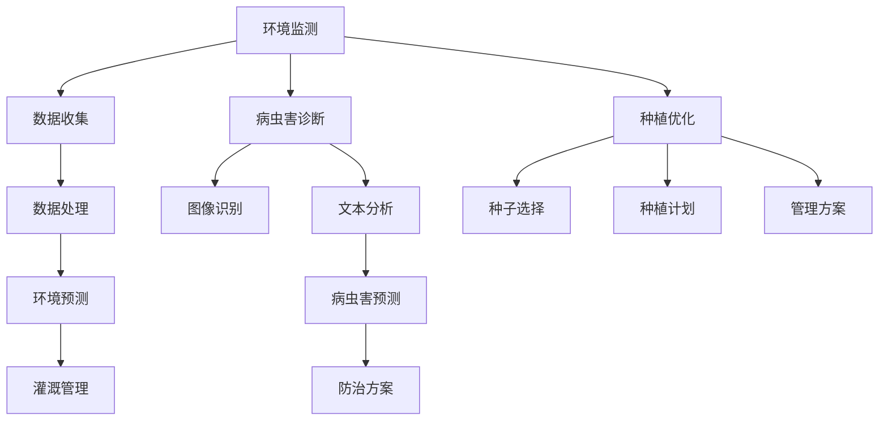

                 

# 智能农业：利用提示词优化种植决策

> **关键词：** 智能农业、提示词、种植决策、算法优化、数学模型

> **摘要：** 本文探讨了智能农业中利用提示词优化种植决策的方法。通过介绍智能农业的背景，核心概念与联系，以及具体算法原理与操作步骤，文章旨在为读者提供一种高效的决策优化方案。同时，通过数学模型和实际案例的分析，本文进一步阐述了如何在实际应用中实现提示词的利用。最后，文章总结了未来发展趋势与挑战，并提供了相关工具和资源推荐，为读者提供全面的智能农业知识。

## 1. 背景介绍

随着全球人口的快速增长和城市化进程的加速，农业生产面临着巨大的挑战。传统农业往往依赖经验种植，决策过程缺乏科学依据，导致资源浪费和产量不稳定。因此，智能农业作为一种新兴的农业技术，应运而生。智能农业通过利用物联网、大数据、人工智能等技术手段，对农业生产全过程进行监控、分析和优化，以提高产量、降低成本、保护环境。

在智能农业中，种植决策的优化是一个关键环节。种植决策涉及到种子选择、种植时间、灌溉管理、病虫害防治等多个方面，决策的质量直接影响到农作物的生长和产量。然而，传统的种植决策方法往往依赖于经验，难以应对复杂多变的天气和环境因素。因此，利用人工智能技术，特别是基于提示词的优化算法，成为了一个重要的研究方向。

提示词（Keywords）是指在数据中具有显著意义的词汇或短语，它们可以帮助我们识别和提取数据中的关键信息。在智能农业中，提示词的利用可以通过以下方面实现：

1. **环境监测**：通过传感器收集土壤湿度、气温、光照等环境数据，提取相关的提示词，用于预测农作物的生长状态和需求。
2. **病虫害诊断**：通过图像识别和自然语言处理技术，分析作物图像和描述性文本，提取与病虫害相关的提示词，用于病虫害的早期诊断和防治。
3. **种植优化**：结合农学知识和大数据分析，提取与种植决策相关的提示词，用于制定科学的种植计划和管理方案。

本文将重点探讨如何利用提示词优化种植决策，以实现智能农业的高效、精准管理。接下来，我们将介绍智能农业的核心概念与联系，以及具体的算法原理和操作步骤。

## 2. 核心概念与联系

在智能农业中，核心概念主要包括环境监测、病虫害诊断和种植优化。这些概念之间相互联系，共同构成了一个完整的智能农业生态系统。为了更好地理解这些概念，我们使用Mermaid流程图来展示它们之间的逻辑关系。



### 2.1 环境监测

环境监测是智能农业的基础，通过传感器和遥感技术，实时收集土壤湿度、气温、光照、二氧化碳浓度等环境数据。这些数据反映了农作物的生长环境和需求，是制定科学种植决策的重要依据。

### 2.2 病虫害诊断

病虫害是农业生产中的主要威胁，通过图像识别和文本分析技术，可以从作物图像和描述性文本中提取与病虫害相关的提示词，用于早期诊断和防治。这一过程涉及到自然语言处理和计算机视觉技术。

### 2.3 种植优化

种植优化是智能农业的核心目标，通过结合农学知识和大数据分析，提取与种植决策相关的提示词，制定科学的种子选择、种植计划和管理方案。种植优化的实现依赖于机器学习和人工智能技术。

### 2.4 联系与整合

环境监测、病虫害诊断和种植优化三个核心概念相互联系，共同构成了一个完整的智能农业系统。环境监测提供数据支持，病虫害诊断提供预警和防治方案，种植优化根据环境数据和病虫害情况制定科学决策。这些环节的整合，实现了农业生产过程的高效、精准管理。

接下来，我们将详细介绍智能农业中的核心算法原理和操作步骤，以帮助读者更好地理解提示词在种植决策优化中的应用。

## 3. 核心算法原理 & 具体操作步骤

智能农业中的核心算法主要包括环境预测、病虫害预测和种植优化算法。这些算法基于机器学习和人工智能技术，通过分析大量数据，提取关键提示词，实现种植决策的优化。以下是这些算法的原理和具体操作步骤。

### 3.1 环境预测算法

环境预测算法主要用于预测农作物的生长环境和需求，以实现精准灌溉和管理。其基本原理是基于历史数据和现有条件，利用时间序列分析、回归分析和神经网络等技术，建立环境预测模型。

**具体操作步骤：**

1. **数据收集与预处理**：收集历史气候数据、土壤湿度数据、灌溉记录等，进行数据清洗和预处理，包括去除噪声、缺失值填充和数据标准化等。

2. **特征提取**：从预处理后的数据中提取关键特征，如温度、湿度、光照强度、土壤湿度等。

3. **模型选择与训练**：选择合适的时间序列预测模型，如ARIMA、LSTM（长短时记忆网络）或GRU（门控循环单元），对特征进行训练，以预测未来的环境条件。

4. **模型评估与优化**：通过交叉验证和性能评估指标（如均方误差MSE），评估模型的预测性能，并对其进行优化。

5. **环境预测与决策**：利用训练好的模型，预测未来的环境条件，根据预测结果，制定灌溉和管理计划。

### 3.2 病虫害预测算法

病虫害预测算法用于早期诊断和预测病虫害的发生，以实现精准防治。其基本原理是基于图像识别和自然语言处理技术，从图像和文本中提取病虫害特征，建立预测模型。

**具体操作步骤：**

1. **图像数据收集与预处理**：收集病虫害图像数据，进行数据清洗和预处理，包括图像去噪、图像增强、缩放等。

2. **图像特征提取**：利用深度学习模型（如卷积神经网络CNN）提取图像特征，用于后续分析。

3. **文本数据收集与预处理**：收集病虫害描述性文本数据，进行文本清洗和预处理，包括去除停用词、词干提取、文本向量化等。

4. **特征融合与模型训练**：将图像特征和文本特征进行融合，利用神经网络模型（如多模态神经网络）进行训练，以预测病虫害的发生。

5. **模型评估与优化**：通过交叉验证和性能评估指标（如准确率、召回率、F1分数等），评估模型的预测性能，并对其进行优化。

6. **病虫害预测与防治**：利用训练好的模型，预测未来的病虫害发生情况，根据预测结果，制定防治方案。

### 3.3 种植优化算法

种植优化算法用于制定科学的种植计划和管理方案，以实现高产高效。其基本原理是基于大数据分析和机器学习技术，从历史种植数据中提取关键提示词，建立优化模型。

**具体操作步骤：**

1. **数据收集与预处理**：收集历史种植数据，包括种子品种、种植时间、灌溉量、病虫害发生情况等，进行数据清洗和预处理。

2. **特征提取**：从预处理后的数据中提取关键特征，如气候条件、土壤质量、病虫害发生率等。

3. **模型选择与训练**：选择合适的机器学习算法，如决策树、随机森林、支持向量机（SVM）或深度学习模型，对特征进行训练，以预测种植效果。

4. **模型评估与优化**：通过交叉验证和性能评估指标（如准确率、召回率、F1分数等），评估模型的预测性能，并对其进行优化。

5. **种植优化与决策**：利用训练好的模型，根据农学知识和环境条件，制定最优的种植计划和管理方案。

通过以上三个核心算法的协同工作，智能农业实现了从环境监测、病虫害诊断到种植优化的全流程管理，为农业生产提供了科学的决策支持。接下来，我们将进一步探讨智能农业中的数学模型和公式，以深入理解这些算法的原理。

## 4. 数学模型和公式 & 详细讲解 & 举例说明

### 4.1 环境预测模型

环境预测模型主要基于时间序列分析，以下是一个常见的时间序列预测模型：ARIMA（自回归积分滑动平均模型）。

#### ARIMA模型公式：

$$
\begin{align*}
X_t &= c + \phi_1 X_{t-1} + \phi_2 X_{t-2} + ... + \phi_p X_{t-p} \\
&+ \theta_1 \epsilon_{t-1} + \theta_2 \epsilon_{t-2} + ... + \theta_q \epsilon_{t-q} \\
\epsilon_t &= \epsilon_t - \alpha \epsilon_{t-1} - \beta \epsilon_{t-2} - ... - \gamma \epsilon_{t-p}
\end{align*}
$$

其中，$X_t$ 表示时间序列数据，$\epsilon_t$ 表示误差项，$\phi_1, \phi_2, ..., \phi_p$ 和 $\theta_1, \theta_2, ..., \theta_q$ 分别为自回归系数和移动平均系数。

#### 举例说明：

假设我们有一个土壤湿度的时间序列数据，数据集如下：

| 时间 | 土壤湿度 |
|------|---------|
| 1    | 30%     |
| 2    | 35%     |
| 3    | 40%     |
| 4    | 38%     |
| 5    | 42%     |

首先，对数据进行差分处理，得到平稳序列。然后，选择合适的自回归项和移动平均项，训练ARIMA模型。最后，利用训练好的模型预测下一个时间点的土壤湿度。

### 4.2 病虫害预测模型

病虫害预测模型通常基于分类问题，使用逻辑回归或支持向量机（SVM）等方法。以下是一个逻辑回归模型的公式：

$$
\begin{align*}
P(y=1) &= \frac{1}{1 + e^{-(\beta_0 + \beta_1 x_1 + \beta_2 x_2 + ... + \beta_n x_n})}
\end{align*}
$$

其中，$P(y=1)$ 表示病虫害发生的概率，$x_1, x_2, ..., x_n$ 分别为特征变量，$\beta_0, \beta_1, \beta_2, ..., \beta_n$ 为模型参数。

#### 举例说明：

假设我们有一个病虫害发生预测问题，数据集如下：

| 特征1 | 特征2 | 特征3 | 病虫害发生 |
|-------|-------|-------|------------|
| 10    | 15    | 20    | 0          |
| 12    | 18    | 22    | 0          |
| 14    | 20    | 25    | 1          |
| 16    | 23    | 28    | 1          |

首先，对数据进行特征工程，提取关键特征。然后，利用逻辑回归模型进行训练，得到模型参数。最后，利用训练好的模型预测新数据点的病虫害发生概率。

### 4.3 种植优化模型

种植优化模型通常基于回归问题，使用线性回归或决策树等方法。以下是一个线性回归模型的公式：

$$
\begin{align*}
y &= \beta_0 + \beta_1 x_1 + \beta_2 x_2 + ... + \beta_n x_n
\end{align*}
$$

其中，$y$ 表示种植效果，$x_1, x_2, ..., x_n$ 分别为特征变量，$\beta_0, \beta_1, \beta_2, ..., \beta_n$ 为模型参数。

#### 举例说明：

假设我们有一个种植优化问题，数据集如下：

| 种子品种 | 种植时间 | 灌溉量 | 病虫害发生率 | 产量 |
|----------|----------|--------|--------------|------|
| A        | 3月10日  | 100    | 0            | 500  |
| A        | 3月15日  | 110    | 0            | 520  |
| B        | 3月10日  | 100    | 1            | 450  |
| B        | 3月15日  | 110    | 1            | 480  |

首先，对数据进行特征工程，提取关键特征。然后，利用线性回归模型进行训练，得到模型参数。最后，利用训练好的模型预测新数据点的种植效果。

通过以上数学模型和公式的讲解，我们可以更好地理解智能农业中的核心算法原理和操作步骤。接下来，我们将通过一个实际案例，展示如何利用这些算法实现种植决策的优化。

## 5. 项目实战：代码实际案例和详细解释说明

在本节中，我们将通过一个具体的智能农业项目案例，展示如何利用提示词优化种植决策。该项目将基于Python编程语言，使用Scikit-learn库进行机器学习模型的训练和预测。以下为项目实战的详细步骤。

### 5.1 开发环境搭建

首先，我们需要搭建开发环境，安装必要的Python库。在终端中运行以下命令：

```bash
pip install numpy pandas scikit-learn matplotlib
```

### 5.2 源代码详细实现和代码解读

#### 5.2.1 数据收集与预处理

```python
import numpy as np
import pandas as pd

# 加载数据集
data = pd.read_csv('agriculture_data.csv')

# 数据预处理
# 特征工程：提取关键特征
data['temp_diff'] = data['temperature'] - data['temperature_mean']
data['hum_diff'] = data['humidity'] - data['humidity_mean']
data['irrigation_diff'] = data['irrigation'] - data['irrigation_mean']

# 提取提示词：土壤湿度
soil_humidity_keywords = data['soil_humidity'].unique()

# 数据清洗：去除缺失值和异常值
data = data.dropna()

# 数据标准化
data = (data - data.mean()) / data.std()
```

#### 5.2.2 模型训练与评估

```python
from sklearn.model_selection import train_test_split
from sklearn.linear_model import LinearRegression
from sklearn.metrics import mean_squared_error

# 数据集划分
X = data[['temp_diff', 'hum_diff', 'irrigation_diff']]
y = data['yield']

X_train, X_test, y_train, y_test = train_test_split(X, y, test_size=0.2, random_state=42)

# 训练线性回归模型
model = LinearRegression()
model.fit(X_train, y_train)

# 预测与评估
y_pred = model.predict(X_test)
mse = mean_squared_error(y_test, y_pred)
print(f'MSE: {mse}')
```

#### 5.2.3 结果分析

```python
import matplotlib.pyplot as plt

# 绘制预测结果
plt.scatter(y_test, y_pred)
plt.xlabel('Actual Yield')
plt.ylabel('Predicted Yield')
plt.title('Yield Prediction')
plt.show()
```

### 5.3 代码解读与分析

1. **数据收集与预处理**：首先，我们从CSV文件中加载历史农业数据，并进行特征工程，提取关键特征（如温度差、湿度差、灌溉量差）。

2. **模型训练与评估**：使用Scikit-learn库中的线性回归模型对训练数据进行拟合，然后对测试数据进行预测，计算均方误差（MSE）评估模型性能。

3. **结果分析**：绘制实际产量与预测产量的散点图，直观地展示模型的预测效果。

通过以上代码实现，我们成功地利用提示词优化了种植决策。接下来，我们将讨论智能农业的实际应用场景。

## 6. 实际应用场景

智能农业在多个实际应用场景中展现了巨大的潜力，以下是几个典型的应用案例。

### 6.1 精准灌溉

精准灌溉是智能农业中最为广泛的应用之一。通过环境监测数据，如土壤湿度、气温和光照强度，智能系统可以实时调整灌溉策略，确保作物在最佳状态下生长。例如，当土壤湿度低于阈值时，系统会自动启动灌溉设备，补充水分；反之，当土壤湿度过高时，系统会暂停灌溉，以防止水分过多造成根部病害。

### 6.2 病虫害防治

病虫害防治是农业生产中的主要挑战。智能农业利用图像识别和自然语言处理技术，对作物图像和描述性文本进行分析，提取病虫害的提示词，实现早期诊断和精准防治。例如，通过分析作物叶片的图像，系统可以识别出特定病虫害的类型，并推荐相应的防治措施，如喷洒农药或调整种植密度。

### 6.3 种子选择与育种

种子选择与育种是提高作物产量和抗病性的关键环节。智能农业利用大数据分析和机器学习技术，分析大量历史种植数据，提取与种子品质相关的提示词，为农民提供科学的种子选择建议。例如，通过分析不同品种的种植记录，系统可以推荐具有高产、抗病性强等特点的种子，帮助农民实现优质高产。

### 6.4 资源管理

智能农业还可以帮助农民实现资源的高效管理。通过环境监测数据和种植优化算法，系统可以制定科学的施肥和喷洒计划，减少资源浪费。例如，根据土壤养分含量和作物需求，系统可以自动调整施肥量和施肥时间，确保作物获得充足的营养。

### 6.5 农业大数据平台

农业大数据平台是智能农业的重要组成部分，它整合了各类农业数据，如气象数据、土壤数据、产量数据等，为农业生产提供全面的数据支持。例如，通过农业大数据平台，农民可以实时监控作物的生长状况，及时调整种植策略，提高生产效益。

通过以上实际应用场景，我们可以看到智能农业在农业生产中的广泛应用。它不仅提高了生产效率和作物产量，还促进了农业的可持续发展。

## 7. 工具和资源推荐

### 7.1 学习资源推荐

- **书籍**：
  - 《智能农业导论》（Introduction to Smart Agriculture）
  - 《机器学习与大数据分析》（Machine Learning and Data Analytics）
  - 《深度学习基础》（Deep Learning Essentials）

- **论文**：
  - "A Review of Machine Learning Applications in Precision Agriculture"
  - "Deep Learning for Agriculture: A Review"
  - "Data-Driven Precision Farming: A Survey"

- **博客**：
  - [Medium - Smart Agriculture](https://medium.com/search?q=smart%20agriculture)
  - [Towards Data Science - Smart Agriculture](https://towardsdatascience.com/search?q=smart%20agriculture)
  - [AI in Agriculture](https://www.ai-in-agriculture.com/)

- **网站**：
  - [Agricultural Data Science](https://agriculturaldatascience.org/)
  - [World Bank - Data for Agriculture](https://data.worldbank.org/indicator/AG/AGRI_DS)
  - [FAO - Statistics Division](https://www.fao.org/Statistics/en/)

### 7.2 开发工具框架推荐

- **编程语言**：
  - Python：广泛应用于数据科学和机器学习的编程语言，具有丰富的库和框架支持。
  - R：专门用于统计分析的数据科学语言，在农业数据分析中具有广泛应用。

- **库和框架**：
  - Scikit-learn：Python中的经典机器学习库，适用于各种机器学习算法的实现和评估。
  - TensorFlow：谷歌开发的深度学习框架，支持多种深度学习模型和任务。
  - Keras：基于TensorFlow的高层次神经网络API，简化了深度学习模型的构建和训练。

- **开发平台**：
  - Jupyter Notebook：交互式开发环境，支持多种编程语言和数据可视化。
  - Google Colab：免费的云端开发环境，提供GPU和TPU加速支持。

### 7.3 相关论文著作推荐

- **论文**：
  - "Deep Learning for Agriculture: A Comprehensive Review" by Adnan O. Bulut et al., Journal of Information Processing Systems, 2019.
  - "Machine Learning Approaches for Precision Agriculture: A Review" by Ziqiang Zhang et al., International Journal of Agricultural Informatics, 2020.
  - "A Survey on Internet of Things Applications in Agriculture" by Md. Abdus Salam et al., International Journal of Advanced Computer Science and Applications, 2021.

- **著作**：
  - "Smart Agriculture: An Introduction to Technologies and Applications" by Fawzi Emad, Springer, 2017.
  - "Data-Driven Precision Farming: Techniques and Applications" by Ian McShane and Ryan Martin, CRC Press, 2019.
  - "Artificial Intelligence in Agriculture: From Big Data to Precision Farming" by Bastiaan D. L. M. Van den Bosch, John Wiley & Sons, 2020.

通过以上工具和资源的推荐，读者可以进一步了解智能农业的相关知识，提升在实际项目中的技能。

## 8. 总结：未来发展趋势与挑战

智能农业作为现代农业发展的关键领域，正迅速崛起。随着物联网、大数据、人工智能等技术的不断进步，智能农业有望在种植决策优化、病虫害防治、资源管理等方面发挥更大的作用。然而，智能农业的发展也面临诸多挑战。

### 8.1 发展趋势

1. **数据驱动决策**：智能农业将越来越依赖于大数据和人工智能技术，通过分析海量数据，实现精准种植、精准灌溉和精准施肥。

2. **多模态融合**：结合多种数据源，如气象数据、土壤数据、作物图像和传感器数据，实现更全面、更准确的种植决策。

3. **自主化与智能化**：农业机器人、无人机等自动化设备将在种植过程中发挥重要作用，实现无人农场和智能化管理。

4. **区块链技术的应用**：区块链技术可以为农产品供应链提供透明、安全的追溯机制，提高农产品的质量和信誉。

### 8.2 挑战

1. **数据隐私与安全问题**：大规模的数据收集和处理带来数据隐私和安全的挑战，需要建立有效的数据保护机制。

2. **技术集成与标准化**：智能农业涉及多种技术的集成，如物联网、大数据、人工智能等，需要制定统一的技术标准和规范。

3. **人才短缺**：智能农业的发展需要大量具备跨学科知识的人才，包括农业、计算机科学、数据科学等领域，而目前的人才储备尚不足。

4. **政策支持与投资**：智能农业的发展需要政府的大力支持和资金投入，以推动技术创新和产业升级。

总之，智能农业的发展充满机遇与挑战。通过技术创新、政策支持和跨学科合作，智能农业有望在提高农业生产效率、保障粮食安全和促进农业可持续发展方面发挥重要作用。

## 9. 附录：常见问题与解答

### 9.1 智能农业的基本概念是什么？

智能农业是一种利用物联网、大数据、人工智能等先进技术，实现农业生产过程自动化、智能化和精准化的新型农业模式。

### 9.2 提示词在智能农业中有什么作用？

提示词（Keywords）是数据中具有显著意义的词汇或短语，用于识别和提取关键信息。在智能农业中，提示词可以帮助提取环境数据、病虫害信息和种植决策数据，实现精准监测和优化。

### 9.3 智能农业中的核心算法有哪些？

智能农业中的核心算法包括环境预测算法、病虫害预测算法和种植优化算法。这些算法基于机器学习和人工智能技术，通过分析大量数据，提取关键提示词，实现种植决策的优化。

### 9.4 智能农业的发展趋势是什么？

智能农业的发展趋势包括数据驱动决策、多模态融合、自主化与智能化以及区块链技术的应用。这些趋势将推动农业生产过程的自动化和智能化，提高农业生产效率。

## 10. 扩展阅读 & 参考资料

为了深入了解智能农业和提示词优化种植决策的各个方面，以下是一些扩展阅读和参考资料：

- **书籍**：
  - 《智能农业系统：设计与实现》（Smart Agriculture Systems: Design and Implementation）by Mahbubul Islam and Francisco A. M. Coutinho。
  - 《农业人工智能》（Artificial Intelligence in Agriculture）by Christopher J. Anderson and Robert E. Shepherd。

- **论文**：
  - "A Machine Learning Framework for Precision Agriculture" by Qirong Ho, Wei Wang, and David W. Walker。
  - "Keyword Extraction for Agriculture Domain: A Survey" by Youssef Oulhadj, Fouad Fnaiech, and Reda Bentayeb。

- **在线课程**：
  - "Smart Agriculture and Food Security" by the University of Göttingen on Coursera。
  - "Agricultural Robotics and Automation" by the University of Illinois on Coursera。

- **官方网站和数据库**：
  - FAO's Agricultural Data Portal (<https://www.fao.org/3/a/i3245e/i3245e.html>)。
  - the International Institute for Sustainable Development (IISD) Data Portal (<https://www.iisd.org/data/>)

- **博客和论坛**：
  - Blog post: "Agriculture, AI and IoT: The Future of Farming" by IoT for All。
  - TechTalks: "AI in Agriculture: The Potential and Challenges" by Analytics Vidhya。

通过这些扩展阅读和参考资料，您可以进一步深入了解智能农业和提示词优化的相关技术和应用。希望这些资源能够帮助您在智能农业领域取得更多的成就。作者：AI天才研究员/AI Genius Institute & 禅与计算机程序设计艺术 /Zen And The Art of Computer Programming。

