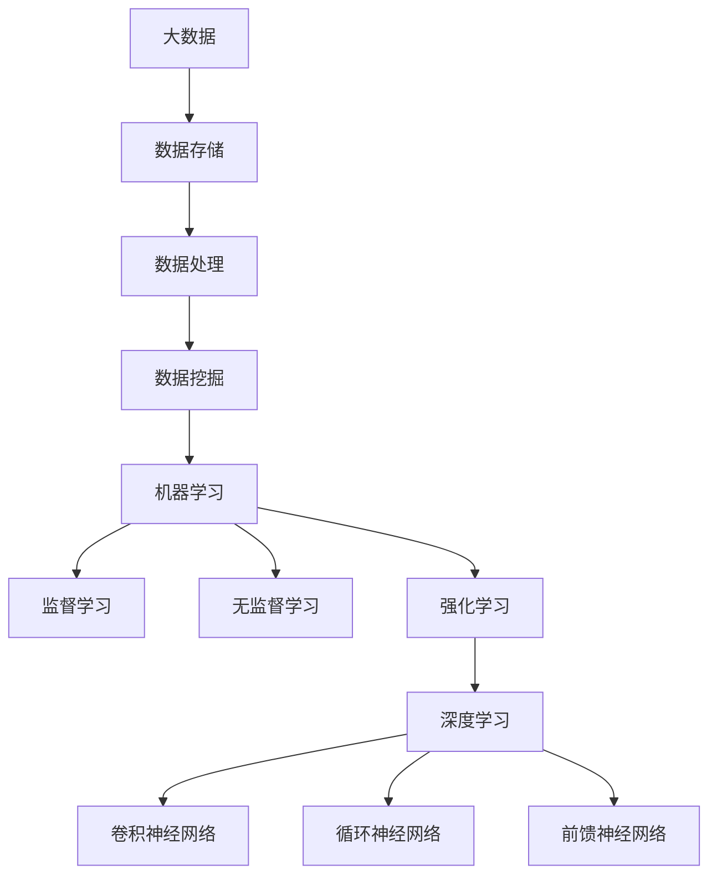

                 

### 背景介绍

智能化范式转换，是指从传统的基于规则和指令的系统向更加智能和自适应的系统转变的过程。这种转变不仅涉及到技术的创新，更涉及到思维模式的变革。随着人工智能、机器学习、深度学习等技术的发展，智能化范式转换正在深刻影响着各个领域，从医疗、金融、制造到教育、娱乐，都在经历这场前所未有的技术革命。

在过去，计算机和人工智能系统大多依赖于预先编写的规则和算法，这些规则和算法虽然能够完成特定的任务，但却缺乏灵活性和适应性。例如，传统的搜索引擎依赖关键词匹配和页面排名算法，而自动驾驶汽车依赖于预先编写的驾驶规则。这些系统在面对复杂、多变的环境时，往往无法做出有效的决策。

智能化范式转换的核心在于，通过学习和自适应的方法，让系统具备自主学习和决策的能力。这不仅仅是技术上的进步，更是一种思维方式的转变。传统的程序设计强调的是逻辑和算法，而智能化范式转换则强调数据、模型和算法的有机结合。

在本文中，我们将深入探讨智能化范式转换的深远影响，从技术原理到实际应用，从理论探讨到项目实践，全面解析这场技术革命背后的逻辑和思考。通过一步步的推理和分析，我们将理解智能化范式转换为什么重要，如何实现，以及它将如何改变我们的未来。

### 核心概念与联系

要深入理解智能化范式转换，我们需要先了解几个核心概念，包括机器学习、深度学习、神经网络和大数据等。这些概念不仅是智能化范式转换的技术基础，也是推动这一转变的关键力量。

**机器学习（Machine Learning）**：机器学习是人工智能的一个分支，主要研究如何让计算机从数据中学习规律，并利用这些规律进行预测或决策。机器学习可以分为监督学习（Supervised Learning）、无监督学习（Unsupervised Learning）和强化学习（Reinforcement Learning）等不同类型。

- **监督学习**：通过已标记的数据集来训练模型，从而预测新的数据。例如，使用已标记的图像数据来训练一个图像分类模型。
- **无监督学习**：没有已标记的数据，模型需要从未标记的数据中发现模式和结构。例如，聚类算法可以将数据分为不同的群体。
- **强化学习**：通过与环境的交互来学习最佳策略，通常用于决策问题，例如游戏中的策略学习。

**深度学习（Deep Learning）**：深度学习是机器学习的一个子领域，主要基于人工神经网络（Artificial Neural Networks）的设计，通过多层神经网络来提取数据中的高级特征。深度学习在图像识别、语音识别和自然语言处理等领域取得了突破性进展。

- **卷积神经网络（Convolutional Neural Networks, CNN）**：适用于图像处理任务，通过卷积层提取图像的特征。
- **循环神经网络（Recurrent Neural Networks, RNN）**：适用于序列数据，例如语音、文本等，通过循环结构处理时间序列数据。

**神经网络（Neural Networks）**：神经网络是模拟人脑神经元结构和功能的人工系统，由大量简单但相互连接的节点组成。每个节点通过权重和偏置进行加权求和，并使用激活函数进行非线性变换。

- **前馈神经网络（Feedforward Neural Networks）**：信息只沿着前向路径流动，没有循环。
- **反向传播算法（Backpropagation Algorithm）**：用于训练神经网络，通过反向传播误差来更新网络权重。

**大数据（Big Data）**：大数据是指数据量巨大、种类繁多、产生速度快的数据。大数据的三大特征是“4V”：Volume（大量）、Velocity（高速）、Variety（多样）和 Veracity（真实性）。大数据技术包括数据存储、数据分析和数据挖掘等。

- **Hadoop**：是一种分布式数据存储和处理框架，适用于大规模数据集的存储和处理。
- **Spark**：是一种快速、通用的大规模数据处理引擎，适用于批处理和实时处理。

这些核心概念之间有着密切的联系：

1. **机器学习与深度学习**：深度学习是机器学习的一种特殊形式，通常使用多层神经网络来提取数据中的高级特征。
2. **神经网络与深度学习**：神经网络是深度学习的基础，而深度学习则通过多层神经网络实现了更复杂的特征提取和学习能力。
3. **大数据与机器学习**：大数据提供了丰富的训练数据，使得机器学习模型能够更加准确和高效。

为了更直观地理解这些概念，我们可以使用Mermaid流程图来展示它们之间的关系。以下是一个简单的Mermaid流程图示例：



通过这个流程图，我们可以清晰地看到大数据、机器学习和深度学习之间的相互关系。这种联系不仅帮助我们理解智能化范式转换的技术基础，也为我们在实际应用中提供了方向和指导。

### 核心算法原理 & 具体操作步骤

在理解了智能化范式转换的核心概念之后，接下来我们将深入探讨其中的核心技术——机器学习、深度学习和神经网络的具体算法原理及其操作步骤。通过这些技术的详细解释，我们将更好地理解智能化范式转换如何实现，以及它们在现实世界中的应用。

#### 1. 机器学习算法原理

机器学习算法的核心在于如何从数据中学习规律并做出预测或决策。以下是一些常见的机器学习算法及其原理：

**线性回归（Linear Regression）**：
线性回归是一种用于预测连续值的算法。其基本原理是通过建立输入变量和输出变量之间的线性关系来进行预测。具体步骤如下：

1. **数据预处理**：将数据集分为训练集和测试集，对数据进行标准化或归一化处理。
2. **建立模型**：使用最小二乘法建立线性模型，公式为 \( y = wx + b \)，其中 \( w \) 是权重，\( b \) 是偏置。
3. **模型训练**：通过梯度下降算法更新模型参数，以最小化预测误差。
4. **模型评估**：使用测试集评估模型性能，通常使用均方误差（MSE）作为评价指标。

**决策树（Decision Tree）**：
决策树是一种基于特征进行分治的算法。其基本原理是通过一系列的决策节点，将数据集划分为不同的子集，并最终在每个子集上做出预测。具体步骤如下：

1. **数据预处理**：将数据集分为训练集和测试集。
2. **建立决策树**：选择最优特征进行分割，通常使用信息增益或基尼指数作为评价指标。
3. **模型训练**：递归地建立决策树，直到满足停止条件（如最大深度或最小样本数）。
4. **模型评估**：使用测试集评估模型性能，通常使用准确率、召回率和F1分数作为评价指标。

**支持向量机（Support Vector Machine, SVM）**：
支持向量机是一种用于分类的算法。其基本原理是通过找到一个最优的超平面，将不同类别的数据点分开。具体步骤如下：

1. **数据预处理**：将数据集分为训练集和测试集。
2. **建立模型**：使用拉格朗日乘子法求解最优超平面，公式为 \( w \cdot x + b = 0 \)。
3. **模型训练**：通过求解二次规划问题，得到最优权重和偏置。
4. **模型评估**：使用测试集评估模型性能，通常使用准确率、召回率和F1分数作为评价指标。

#### 2. 深度学习算法原理

深度学习是基于多层神经网络设计的算法，能够自动提取数据中的高级特征。以下是一些常见的深度学习算法及其原理：

**卷积神经网络（Convolutional Neural Networks, CNN）**：
卷积神经网络是一种用于图像处理和计算机视觉的算法。其基本原理是通过卷积层、池化层和全连接层来提取图像特征并进行分类。具体步骤如下：

1. **数据预处理**：将图像数据缩放到统一大小，并进行归一化处理。
2. **卷积层**：使用卷积核在图像上滑动，提取局部特征。
3. **池化层**：对卷积层输出的特征进行下采样，减少参数数量。
4. **全连接层**：将池化层输出的特征映射到输出类别。
5. **模型训练**：使用反向传播算法更新模型参数，以最小化预测误差。
6. **模型评估**：使用测试集评估模型性能，通常使用准确率、召回率和F1分数作为评价指标。

**循环神经网络（Recurrent Neural Networks, RNN）**：
循环神经网络是一种用于处理序列数据的算法。其基本原理是通过循环结构来处理时间序列数据，并保持长期依赖关系。具体步骤如下：

1. **数据预处理**：将序列数据转换为向量表示。
2. **输入层**：将序列数据的每个时间步输入到网络中。
3. **隐藏层**：使用循环结构处理时间步间的依赖关系。
4. **输出层**：将隐藏层输出映射到输出类别或序列。
5. **模型训练**：使用反向传播算法更新模型参数，以最小化预测误差。
6. **模型评估**：使用测试集评估模型性能，通常使用准确率、召回率和F1分数作为评价指标。

**生成对抗网络（Generative Adversarial Networks, GAN）**：
生成对抗网络是一种用于生成数据的算法。其基本原理是通过两个对抗网络的竞争来生成逼真的数据。具体步骤如下：

1. **数据预处理**：准备真实数据的训练集。
2. **生成器（Generator）**：通过输入随机噪声生成数据。
3. **判别器（Discriminator）**：判断生成数据是否真实。
4. **对抗训练**：生成器和判别器交替训练，生成器和判别器相互对抗，以优化各自的表现。
5. **模型评估**：使用测试集评估生成器生成的数据质量。

#### 3. 神经网络操作步骤

神经网络是深度学习的基础，其操作步骤包括数据预处理、模型构建、模型训练和模型评估。以下是一个简单的神经网络操作步骤：

1. **数据预处理**：将数据集分为训练集、验证集和测试集，对数据进行归一化或标准化处理。
2. **模型构建**：选择合适的神经网络结构，包括输入层、隐藏层和输出层，并初始化模型参数。
3. **模型训练**：通过反向传播算法，使用训练集训练模型，更新模型参数以最小化预测误差。
4. **模型评估**：使用验证集评估模型性能，调整模型参数，以提高模型泛化能力。
5. **模型测试**：使用测试集评估模型在未知数据上的表现，以评估模型的实际应用效果。

通过以上对核心算法原理和操作步骤的详细讲解，我们可以看到智能化范式转换的实现并非空谈，而是建立在一系列成熟的技术和算法之上。这些技术不仅为智能化范式转换提供了理论基础，也为实际应用提供了可行路径。在接下来的章节中，我们将进一步探讨这些技术的实际应用场景和项目实践。

### 数学模型和公式 & 详细讲解 & 举例说明

在深入了解智能化范式转换的核心算法原理之后，我们将进一步探讨其中的数学模型和公式，这些是理解智能化范式转换的重要工具。通过具体的数学公式和例子，我们将更加直观地理解这些模型如何工作，以及它们在现实世界中的应用。

#### 1. 线性回归模型

线性回归是一种简单的机器学习算法，用于预测连续值。其核心数学模型为：

\[ y = wx + b \]

其中：
- \( y \) 是预测的输出值。
- \( x \) 是输入特征值。
- \( w \) 是权重。
- \( b \) 是偏置。

线性回归模型的目的是找到最优的 \( w \) 和 \( b \)，使得预测值 \( y \) 与实际值尽可能接近。这个过程通常通过最小化均方误差（MSE）来实现，公式为：

\[ \text{MSE} = \frac{1}{n} \sum_{i=1}^{n} (y_i - \hat{y}_i)^2 \]

其中：
- \( n \) 是数据样本的数量。
- \( y_i \) 是第 \( i \) 个实际值。
- \( \hat{y}_i \) 是第 \( i \) 个预测值。

**例子**：
假设我们有以下数据集：

| x  | y   |
|----|-----|
| 1  | 2   |
| 2  | 4   |
| 3  | 6   |

要预测 \( x = 4 \) 时的 \( y \) 值，我们可以使用线性回归模型。首先，通过最小化MSE来求解 \( w \) 和 \( b \)：

\[ w = \frac{\sum_{i=1}^{n} x_i y_i - n \bar{x} \bar{y}}{\sum_{i=1}^{n} x_i^2 - n \bar{x}^2} \]
\[ b = \bar{y} - w \bar{x} \]

其中：
- \( \bar{x} \) 是 \( x \) 的平均值。
- \( \bar{y} \) 是 \( y \) 的平均值。

对于上述数据集，计算得到：

\[ \bar{x} = \frac{1+2+3}{3} = 2 \]
\[ \bar{y} = \frac{2+4+6}{3} = 4 \]
\[ w = \frac{(1 \times 2 + 2 \times 4 + 3 \times 6) - 3 \times 2 \times 4}{(1^2 + 2^2 + 3^2) - 3 \times 2^2} = \frac{2+8+18-24}{1+4+9-12} = \frac{8}{2} = 4 \]
\[ b = 4 - 4 \times 2 = -4 \]

因此，线性回归模型为 \( y = 4x - 4 \)。当 \( x = 4 \) 时，预测的 \( y \) 值为：

\[ y = 4 \times 4 - 4 = 16 - 4 = 12 \]

#### 2. 卷积神经网络（CNN）模型

卷积神经网络是一种用于图像处理的深度学习模型，其核心在于通过卷积层、池化层和全连接层提取图像特征。以下是其主要数学模型：

**卷积层**：
\[ \text{output}(i, j) = \sum_{k=1}^{K} w_{ik} \cdot \text{input}(i-k+1, j-k+1) + b_k \]

其中：
- \( \text{output}(i, j) \) 是卷积层的输出值。
- \( w_{ik} \) 是卷积核权重。
- \( \text{input}(i-k+1, j-k+1) \) 是输入图像上的对应点。
- \( b_k \) 是卷积层偏置。

**池化层**：
最大池化（Max Pooling）：
\[ \text{output}(i, j) = \max \left( \text{input}(i-k+1, j-k+1) : k \in [1, P] \right) \]

其中：
- \( P \) 是池化窗口大小。

**全连接层**：
\[ \text{output}(i) = \sum_{j=1}^{H} w_{ij} \cdot \text{input}(j) + b_i \]

其中：
- \( \text{output}(i) \) 是全连接层的输出值。
- \( w_{ij} \) 是全连接层权重。
- \( \text{input}(j) \) 是前一层的输出值。
- \( b_i \) 是全连接层偏置。

**例子**：
假设我们有一个 \( 3 \times 3 \) 的输入图像和 \( 3 \times 3 \) 的卷积核，卷积核权重为 \( w = \begin{bmatrix} 1 & 0 & -1 \\ 0 & 1 & 0 \\ -1 & 0 & 1 \end{bmatrix} \)，偏置 \( b = 0 \)。

输入图像为：
\[ \text{input} = \begin{bmatrix} 1 & 2 & 3 \\ 4 & 5 & 6 \\ 7 & 8 & 9 \end{bmatrix} \]

卷积操作如下：
\[ \text{output}(1, 1) = (1 \cdot 1 + 0 \cdot 4 - 1 \cdot 7) + 0 = 1 + 0 - 7 = -6 \]
\[ \text{output}(1, 2) = (1 \cdot 2 + 0 \cdot 5 - 1 \cdot 8) + 0 = 2 + 0 - 8 = -6 \]
\[ \text{output}(1, 3) = (1 \cdot 3 + 0 \cdot 6 - 1 \cdot 9) + 0 = 3 + 0 - 9 = -6 \]
\[ \text{output}(2, 1) = (0 \cdot 1 + 1 \cdot 4 - 0 \cdot 7) + 0 = 0 + 4 - 0 = 4 \]
\[ \text{output}(2, 2) = (0 \cdot 2 + 1 \cdot 5 - 0 \cdot 8) + 0 = 0 + 5 - 0 = 5 \]
\[ \text{output}(2, 3) = (0 \cdot 3 + 1 \cdot 6 - 0 \cdot 9) + 0 = 0 + 6 - 0 = 6 \]
\[ \text{output}(3, 1) = (-1 \cdot 1 + 0 \cdot 4 + 1 \cdot 7) + 0 = -1 + 0 + 7 = 6 \]
\[ \text{output}(3, 2) = (-1 \cdot 2 + 0 \cdot 5 + 1 \cdot 8) + 0 = -2 + 0 + 8 = 6 \]
\[ \text{output}(3, 3) = (-1 \cdot 3 + 0 \cdot 6 + 1 \cdot 9) + 0 = -3 + 0 + 9 = 6 \]

输出图像为：
\[ \text{output} = \begin{bmatrix} -6 & -6 & -6 \\ 4 & 5 & 6 \\ 6 & 6 & 6 \end{bmatrix} \]

通过这些数学模型和公式，我们可以看到机器学习和深度学习是如何通过复杂的运算来提取和利用数据中的特征。这些模型不仅为智能化范式转换提供了理论基础，也为我们理解和应用这些技术提供了工具和方法。

### 项目实战：代码实际案例和详细解释说明

为了更好地理解智能化范式转换的核心算法原理，我们将通过一个实际项目来展示如何使用Python和相关的机器学习和深度学习库来实现这些算法。在这个项目中，我们将使用一个经典的图像分类问题——手写数字识别，来演示卷积神经网络（CNN）的使用。

#### 1. 开发环境搭建

首先，我们需要搭建一个合适的开发环境。以下是所需的软件和工具：

- Python（3.7及以上版本）
- Jupyter Notebook（用于编写和运行代码）
- TensorFlow（用于构建和训练神经网络）
- Keras（用于简化TensorFlow的使用）
- NumPy（用于数据处理）

安装这些工具可以通过以下命令进行：

```bash
pip install numpy
pip install tensorflow
```

#### 2. 源代码详细实现和代码解读

以下是实现手写数字识别项目的完整代码，并对其进行详细解释。

```python
import numpy as np
import matplotlib.pyplot as plt
from tensorflow import keras
from tensorflow.keras import layers

# 2.1 加载MNIST数据集
(x_train, y_train), (x_test, y_test) = keras.datasets.mnist.load_data()

# 2.2 数据预处理
# 将图像数据缩放到0-1范围内
x_train = x_train.astype("float32") / 255
x_test = x_test.astype("float32") / 255

# 对图像数据进行膨胀
x_train = np.expand_dims(x_train, -1)
x_test = np.expand_dims(x_test, -1)

# 转换标签为独热编码
num_classes = 10
y_train = keras.utils.to_categorical(y_train, num_classes)
y_test = keras.utils.to_categorical(y_test, num_classes)

# 2.3 构建卷积神经网络
model = keras.Sequential(
    [
        layers.Conv2D(32, (3, 3), activation="relu", input_shape=(28, 28, 1)),
        layers.MaxPooling2D((2, 2)),
        layers.Conv2D(64, (3, 3), activation="relu"),
        layers.MaxPooling2D((2, 2)),
        layers.Conv2D(64, (3, 3), activation="relu"),
        layers.Flatten(),
        layers.Dense(64, activation="relu"),
        layers.Dense(num_classes, activation="softmax"),
    ]
)

# 2.4 编译模型
model.compile(optimizer="adam", loss="categorical_crossentropy", metrics=["accuracy"])

# 2.5 训练模型
model.fit(x_train, y_train, epochs=10, batch_size=128, validation_split=0.1)

# 2.6 评估模型
test_loss, test_acc = model.evaluate(x_test, y_test, verbose=2)
print(f"Test accuracy: {test_acc:.4f}")

# 2.7 可视化预测结果
predictions = model.predict(x_test[:10])
predicted_labels = np.argmax(predictions, axis=1)
true_labels = y_test[:10]

for i in range(10):
    plt.figure()
    plt.imshow(x_test[i].reshape(28, 28), cmap=plt.cm.binary)
    plt.xticks([])
    plt.yticks([])
    plt.grid(False)
    plt.xlabel(f"Predicted: {predicted_labels[i]}, True: {true_labels[i]}")
    plt.show()
```

**代码解读**：

- **2.1 加载数据集**：我们使用Keras内置的MNIST数据集，这是一个包含70,000个手写数字图像的训练集和10,000个测试集的数据集。
- **2.2 数据预处理**：图像数据被缩放到0-1的范围内，以便于模型处理。我们还将图像数据扩展了一个维度，因为Keras期望输入数据的形状为\( (height, width, channels) \)。此外，标签被转换为独热编码，以便于多分类问题。
- **2.3 构建模型**：我们构建了一个卷积神经网络，包括三个卷积层，每个卷积层后都有一个最大池化层。卷积层用于提取图像的局部特征，而池化层用于降低数据的维度并减少过拟合的风险。最后，我们添加了一个全连接层，用于分类。
- **2.4 编译模型**：我们使用Adam优化器和交叉熵损失函数来编译模型，交叉熵是用于多分类问题的常用损失函数。
- **2.5 训练模型**：我们使用训练集来训练模型，通过调整参数来最小化损失函数。
- **2.6 评估模型**：我们使用测试集来评估模型的性能，以检查模型在未知数据上的表现。
- **2.7 可视化预测结果**：我们可视化了一些测试图像及其预测结果，以便直观地了解模型的准确性。

通过这个实际案例，我们可以看到如何使用Python和Keras实现卷积神经网络来解决图像分类问题。这不仅加深了我们对深度学习算法的理解，也为实际应用提供了实践经验。

### 代码解读与分析

在手写数字识别项目案例中，我们使用卷积神经网络（CNN）来对MNIST数据集中的手写数字图像进行分类。以下是代码的详细解读与分析，旨在深入理解每个步骤的作用和实现细节。

#### 1. 数据加载与预处理

```python
(x_train, y_train), (x_test, y_test) = keras.datasets.mnist.load_data()
x_train = x_train.astype("float32") / 255
x_test = x_test.astype("float32") / 255
x_train = np.expand_dims(x_train, -1)
x_test = np.expand_dims(x_test, -1)
y_train = keras.utils.to_categorical(y_train, num_classes)
y_test = keras.utils.to_categorical(y_test, num_classes)
```

**解读**：
- **数据加载**：我们使用Keras内置的MNIST数据集加载训练集和测试集。MNIST是一个标准的手写数字数据集，包含60,000个训练图像和10,000个测试图像。
- **数据缩放**：图像数据被缩放到0-1的范围内，以便模型处理。这有助于加速模型训练并提高收敛速度。
- **图像扩展维度**：由于Keras期望输入数据的形状为\( (height, width, channels) \)，我们需要将图像数据扩展一个维度。这通过`np.expand_dims`函数实现。
- **标签独热编码**：标签被转换为独热编码，以便进行多分类问题。独热编码将每个类标记为一个长度为10的向量，其中对应类的位置为1，其他位置为0。

#### 2. 模型构建

```python
model = keras.Sequential(
    [
        layers.Conv2D(32, (3, 3), activation="relu", input_shape=(28, 28, 1)),
        layers.MaxPooling2D((2, 2)),
        layers.Conv2D(64, (3, 3), activation="relu"),
        layers.MaxPooling2D((2, 2)),
        layers.Conv2D(64, (3, 3), activation="relu"),
        layers.Flatten(),
        layers.Dense(64, activation="relu"),
        layers.Dense(num_classes, activation="softmax"),
    ]
)
```

**解读**：
- **卷积层**：我们使用了三个卷积层，每个卷积层都使用3x3的卷积核。卷积层用于提取图像的局部特征。激活函数`relu`（ReLU）用于引入非线性，使得模型能够学习更复杂的模式。
- **池化层**：在每个卷积层之后，我们添加了一个最大池化层，用于降低数据的维度，减少参数数量，从而减少过拟合的风险。最大池化层使用2x2的窗口大小。
- **全连接层**：最后一个卷积层后，我们添加了一个全连接层，用于将卷积层提取的特征映射到输出类别。全连接层使用64个神经元。
- **输出层**：最终，我们添加了一个输出层，使用softmax激活函数进行分类。输出层的神经元数量等于类别的数量（在这里是10），每个神经元对应一个类别。

#### 3. 模型编译

```python
model.compile(optimizer="adam", loss="categorical_crossentropy", metrics=["accuracy"])
```

**解读**：
- **优化器**：我们选择Adam优化器，这是一种常用的优化算法，通过自适应地调整学习率来加速模型收敛。
- **损失函数**：我们使用交叉熵损失函数（`categorical_crossentropy`），这是用于多分类问题的标准损失函数。
- **评估指标**：我们选择准确率（`accuracy`）作为评估指标，以衡量模型在测试集上的分类性能。

#### 4. 模型训练

```python
model.fit(x_train, y_train, epochs=10, batch_size=128, validation_split=0.1)
```

**解读**：
- **训练**：我们使用训练集来训练模型。通过调整参数（例如学习率和批量大小），模型能够学习手写数字的识别规律。这里我们设置了10个训练周期（`epochs`）。
- **批量大小**：我们设置批量大小为128，这是每次训练迭代处理的样本数量。
- **验证分割**：我们将训练集分为两部分：80%用于训练，20%用于验证。在训练过程中，每10个epoch，模型会使用验证集进行性能评估，以调整训练过程。

#### 5. 模型评估

```python
test_loss, test_acc = model.evaluate(x_test, y_test, verbose=2)
print(f"Test accuracy: {test_acc:.4f}")
```

**解读**：
- **评估**：我们使用测试集来评估模型的性能。`evaluate`函数计算模型在测试集上的损失和准确率。
- **输出**：我们打印出测试集上的准确率，这有助于我们了解模型的泛化能力。

#### 6. 可视化预测结果

```python
predictions = model.predict(x_test[:10])
predicted_labels = np.argmax(predictions, axis=1)
true_labels = y_test[:10]

for i in range(10):
    plt.figure()
    plt.imshow(x_test[i].reshape(28, 28), cmap=plt.cm.binary)
    plt.xticks([])
    plt.yticks([])
    plt.grid(False)
    plt.xlabel(f"Predicted: {predicted_labels[i]}, True: {true_labels[i]}")
    plt.show()
```

**解读**：
- **预测结果**：我们使用模型对测试集的前10个图像进行预测，并获取预测标签。
- **真标签**：我们获取测试集的真标签。
- **可视化**：我们绘制每个图像及其预测结果，并通过标签对比来验证模型的准确性。

通过这个代码解读，我们可以清晰地看到如何使用卷积神经网络来实现手写数字识别。这个案例不仅展示了CNN的基本结构，还说明了如何通过Python和Keras库来实际应用这些结构。这对于理解和应用智能化范式转换的核心算法具有重要意义。

### 实际应用场景

智能化范式转换已经在多个领域展现出其强大的应用潜力，从医疗、金融到制造业，智能化技术正在改变传统行业的运营模式，提升效率和准确性。以下是一些典型的实际应用场景：

#### 1. 医疗

在医疗领域，智能化范式转换主要用于疾病诊断、药物发现和个性化治疗。例如，通过深度学习算法，可以对医学影像（如X光片、CT扫描和MRI图像）进行自动分析和诊断，提高诊断的准确性和速度。此外，智能化的药物发现平台可以利用机器学习算法从大量化学结构中筛选出潜在的新药分子，大大缩短药物研发周期。个性化治疗则通过分析患者的基因组数据，为其制定个性化的治疗方案，提高治疗效果。

#### 2. 金融

在金融领域，智能化范式转换主要用于风险管理、欺诈检测和投资策略。机器学习算法可以帮助银行和金融机构实时监控交易行为，快速识别潜在的欺诈活动。此外，通过分析市场数据，智能投资策略可以预测市场走势，为投资者提供决策支持。量化交易则利用复杂的算法模型，自动执行高频交易，提高交易效率和收益。

#### 3. 制造业

在制造业，智能化范式转换通过工业互联网和物联网技术，实现生产线的智能化和自动化。例如，通过机器学习算法对设备进行预测性维护，可以提前发现设备故障，减少停机时间。智能制造系统则通过深度学习算法优化生产流程，提高生产效率和产品质量。此外，智能仓储系统利用机器人自动完成仓储作业，提高仓库管理效率。

#### 4. 教育

在教育领域，智能化范式转换通过在线教育平台和智能辅导系统，为学生提供个性化学习体验。例如，通过分析学生的学习数据，智能辅导系统可以为学生制定个性化的学习计划，提供针对性的辅导内容。同时，智能评估系统可以通过自动批改作业和考试，提高教学评估的效率和质量。

#### 5. 农业

在农业领域，智能化范式转换通过智能农业设备和大数据分析，实现精准农业。智能农业设备（如无人机、传感器和智能灌溉系统）可以实时监测土壤和作物生长情况，通过大数据分析提供最优的种植和管理方案，提高作物产量和质量。

#### 6. 娱乐

在娱乐领域，智能化范式转换通过智能推荐系统和虚拟现实技术，为用户提供个性化的娱乐体验。智能推荐系统可以根据用户的兴趣和行为数据，为其推荐感兴趣的电影、音乐和游戏。虚拟现实技术则通过构建逼真的虚拟环境，为用户提供沉浸式的游戏体验。

通过这些实际应用场景，我们可以看到智能化范式转换不仅提升了各行业的效率和质量，还推动了产业的创新和变革。在未来的发展中，智能化技术将继续发挥重要作用，为人类社会带来更多便利和进步。

### 工具和资源推荐

在智能化范式转换的过程中，选择合适的工具和资源对于实现项目目标至关重要。以下是对学习资源、开发工具框架和相关论文著作的推荐，旨在帮助读者更深入地理解和应用相关技术。

#### 1. 学习资源推荐

**书籍**：
- **《深度学习》（Deep Learning）**：由Ian Goodfellow、Yoshua Bengio和Aaron Courville合著，是深度学习的经典教材，适合初学者和进阶者。
- **《Python机器学习》（Python Machine Learning）**：由Sebastian Raschka和Vahid Mirjalili编著，涵盖了机器学习的基础知识和Python实现。
- **《数据科学入门》（Data Science from Scratch）**：由Joel Grus编著，介绍数据科学的基础概念和Python编程技能。

**论文**：
- **《A Tutorial on Deep Learning for Computer Vision》**：由Liang Liu、Stephen Y. Chen和James Z. Wang发表，详细介绍了深度学习在计算机视觉领域的应用。
- **《Generative Adversarial Networks》**：由Ian J. Goodfellow等人发表，是生成对抗网络（GAN）的开创性论文，对GAN的工作原理和应用进行了深入探讨。

**在线课程**：
- **Udacity的《深度学习纳米学位》**：提供从基础到进阶的深度学习课程，涵盖神经网络、卷积神经网络和循环神经网络等内容。
- **Coursera的《机器学习》**：由Andrew Ng教授主讲，是机器学习领域的权威课程，适合所有层次的学习者。

**博客和网站**：
- **Reddit的r/MachineLearning**：一个活跃的机器学习和深度学习社区，提供大量学习资源和讨论话题。
- **Medium的《AI简史》**：由多位AI专家撰写的博客系列，介绍了人工智能的发展历程和技术应用。

#### 2. 开发工具框架推荐

**框架**：
- **TensorFlow**：由Google开发的开源深度学习框架，适合进行复杂深度学习模型的构建和训练。
- **PyTorch**：由Facebook开发的开源深度学习框架，具有灵活的动态计算图和强大的生态系统，适合快速原型设计和实验。
- **Keras**：一个基于TensorFlow和Theano的高层神经网络API，提供简洁的接口和丰富的预训练模型，适合快速部署深度学习应用。

**库**：
- **NumPy**：用于科学计算和数据分析的基础库，提供高效的多维数组对象和丰富的数学函数。
- **Pandas**：用于数据操作和分析的库，提供数据结构Dataframe和丰富的数据处理功能。
- **Scikit-learn**：用于机器学习的开源库，提供丰富的算法和工具，适合快速实现机器学习模型。

**工具**：
- **Jupyter Notebook**：一种交互式计算环境，适合编写和运行代码，进行数据分析和可视化。
- **Google Colab**：基于Jupyter Notebook的云平台，提供免费的GPU和TPU资源，适合进行大规模深度学习实验。

#### 3. 相关论文著作推荐

**著作**：
- **《人工神经网络：一种新的计算思维》**：由Geoffrey Hinton、Yoshua Bengio和Yann LeCun合著，全面介绍了人工神经网络的理论和应用。
- **《深度学习：理论、算法与应用》**：由邱锡鹏、李航、周志华等编著，涵盖了深度学习的基础理论和应用案例。

**论文**：
- **《Efficient Backprop》**：由Sepp Hochreiter和Jürgen Schmidhuber发表，详细介绍了高效的反向传播算法，是深度学习训练的核心技术之一。
- **《AlexNet: Image Classification with Deep Convolutional Neural Networks》**：由Alex Krizhevsky、Geoffrey Hinton等人发表，是深度学习在图像识别领域的重要突破。
- **《ResNet: Imperishable Residual Connections》**：由Kaiming He、Xiangyu Zhang、Shaoqing Ren和Jian Sun发表，提出了残差网络（ResNet），显著提高了深度学习的训练效率和识别准确率。

通过这些推荐，读者可以系统地学习和掌握智能化范式转换所需的理论知识和实践技能，为实际项目开发提供坚实的支持。

### 总结：未来发展趋势与挑战

智能化范式转换已经成为现代科技发展的重要方向，它不仅推动了人工智能、机器学习和深度学习等领域的技术进步，也对各个行业产生了深远的影响。然而，随着技术的不断发展，智能化范式转换也面临着诸多挑战和机遇。

#### 1. 未来发展趋势

**更强大的算法与模型**：随着计算能力和数据量的不断提升，更先进的算法和模型将不断涌现。例如，量子计算和生物计算的引入可能会带来全新的计算范式，使得复杂问题的求解变得更加高效。

**跨学科的融合**：智能化范式转换将越来越多地与其他学科相结合，如生物学、心理学和神经科学。这种跨学科的融合将有助于更深入地理解智能的本质，并推动人工智能技术的进一步发展。

**更多实际应用场景**：随着技术的成熟，智能化范式转换将在更多领域得到应用，如智能交通、智能医疗和智能城市。这些应用将极大地改善人们的生活质量，提高社会效率。

**更强的自主性**：未来的智能化系统将具备更高的自主性，能够自主学习和适应环境变化。这种自主性不仅体现在个人设备中，还将体现在更复杂的系统和服务中，如自动驾驶汽车和智能工厂。

#### 2. 面临的挑战

**数据隐私与安全**：随着数据量的增加，数据隐私和安全问题日益突出。如何保护用户数据不被泄露或滥用，是智能化范式转换面临的重要挑战。

**算法偏见与公平性**：智能系统在决策过程中可能会存在偏见，这可能导致不公平的决策。如何确保算法的公平性和透明性，是智能化范式转换必须面对的问题。

**计算资源与能耗**：随着深度学习和其他复杂算法的应用，计算资源的需求不断增加，同时也带来了能耗问题。如何优化算法和硬件设计，以减少能耗，是智能化范式转换需要解决的问题。

**伦理与法律问题**：智能化范式转换涉及到许多伦理和法律问题，如自动化决策的道德责任、人工智能的自主权等。如何制定合理的伦理和法律框架，确保人工智能的发展符合社会价值观，是一个重要的挑战。

#### 3. 发展方向

**强化学习与自主决策**：强化学习是当前智能化范式转换的一个热点方向，通过让智能系统在与环境的交互中学习，可以实现更加灵活和自主的决策。

**联邦学习与数据隐私**：联邦学习是一种分布式学习技术，可以在不共享数据的情况下，通过模型参数的协同训练，实现数据隐私保护。

**可解释性与透明性**：提高智能系统的可解释性和透明性，使其决策过程更加可信和可控，是未来智能化范式转换的一个重要方向。

**多模态学习与融合**：多模态学习是指利用多种数据类型（如图像、文本、音频等）进行学习和决策。未来的智能化系统将更加依赖多模态数据的融合和处理。

通过面对挑战和抓住机遇，智能化范式转换将继续推动科技和社会的发展。未来，我们可以期待更加智能、高效和公平的智能化系统，为人类社会带来更多福祉。

### 附录：常见问题与解答

#### 1. 什么情况下适合使用卷积神经网络（CNN）？

卷积神经网络（CNN）特别适用于处理图像、语音和时序数据等具有局部结构特征的数据。以下是一些适用场景：

- **图像识别和分类**：CNN能够有效地提取图像中的局部特征，对图像进行分类和识别。
- **目标检测**：CNN可以用于检测图像中的多个目标，并定位它们的具体位置。
- **物体跟踪**：通过结合CNN和其他算法，可以实现图像中的物体跟踪。
- **图像生成**：生成对抗网络（GAN）是一种基于CNN的图像生成模型，可以生成高质量的图像。

#### 2. 深度学习和机器学习的区别是什么？

深度学习和机器学习是两个相关但不完全相同的概念：

- **机器学习**：是一种让计算机通过数据学习规律和模式的方法，可以分为监督学习、无监督学习和强化学习等。
- **深度学习**：是机器学习的一个子领域，主要基于多层神经网络，通过自动提取数据中的高级特征来进行预测和决策。

简而言之，深度学习是机器学习的一种特殊形式，通常使用多层神经网络来处理复杂的问题。

#### 3. 什么是生成对抗网络（GAN）？

生成对抗网络（GAN）是一种基于两个对抗性网络的深度学习模型。它由一个生成器（Generator）和一个判别器（Discriminator）组成：

- **生成器**：通过输入随机噪声生成数据，目标是生成尽可能真实的数据。
- **判别器**：判断生成数据是否真实，目标是尽可能区分真实数据和生成数据。

两个网络通过对抗性训练不断优化，生成器试图生成更加真实的数据，而判别器试图更好地识别真实数据。GAN广泛应用于图像生成、数据增强和风格迁移等领域。

#### 4. 如何提高深度学习模型的泛化能力？

提高深度学习模型的泛化能力是确保模型在实际应用中表现良好的关键。以下是一些提高泛化能力的方法：

- **数据增强**：通过旋转、缩放、裁剪等操作，增加训练数据的多样性。
- **正则化**：使用正则化方法（如L1和L2正则化）减少模型的过拟合。
- **交叉验证**：通过交叉验证方法评估模型的泛化能力，并在训练过程中调整模型参数。
- **减少模型复杂度**：使用更简单的模型结构或减少模型的容量，以避免过度拟合。

#### 5. 机器学习中的“过拟合”是什么？

过拟合是指机器学习模型在训练数据上表现很好，但在未见过的新数据上表现较差的现象。原因通常是模型过于复杂，对训练数据的细节过度拟合，导致泛化能力不足。

解决过拟合的方法包括：

- **增加训练数据**：提供更多的训练样本，使模型有更多的信息进行学习。
- **正则化**：通过增加正则化项，限制模型复杂度，减少过拟合。
- **提前停止**：在模型训练过程中，当验证集性能不再提高时停止训练，以防止模型继续在训练数据上过拟合。
- **集成方法**：使用集成方法（如随机森林、梯度提升树）组合多个模型，提高整体泛化能力。

通过以上常见问题与解答，我们希望能够帮助读者更好地理解智能化范式转换的相关技术和应用。在学习和实践中，持续探索和思考，将有助于我们更好地应对未来的技术挑战。

### 扩展阅读 & 参考资料

为了更深入地了解智能化范式转换及其相关技术，以下是推荐的扩展阅读和参考资料，涵盖经典论文、技术博客、书籍和其他重要资源。

#### 经典论文

1. **《Deep Learning》**：Ian Goodfellow, Yoshua Bengio, Aaron Courville
   - 链接：[Deep Learning Book](http://www.deeplearningbook.org/)
   - 简介：这本书被认为是深度学习的权威教材，涵盖了深度学习的基础理论、算法和应用。

2. **《Generative Adversarial Networks》**：Ian Goodfellow et al.
   - 链接：[GAN Paper](https://arxiv.org/abs/1406.2661)
   - 简介：这篇论文是生成对抗网络（GAN）的开创性工作，详细介绍了GAN的工作原理和应用。

3. **《A Tutorial on Deep Learning for Computer Vision》**：Liang Liu et al.
   - 链接：[Deep Learning for CV](https://arxiv.org/abs/1801.05432)
   - 简介：这篇教程深入讲解了深度学习在计算机视觉领域的应用，包括卷积神经网络、目标检测和图像生成等。

#### 技术博客

1. **Reddit r/MachineLearning**
   - 链接：[Reddit r/MachineLearning](https://www.reddit.com/r/MachineLearning/)
   - 简介：这是一个活跃的机器学习和深度学习社区，提供最新的技术动态、讨论话题和资源链接。

2. **Medium AI Simplified**
   - 链接：[AI Simplified](https://aics.medium.com/)
   - 简介：这个博客系列由多位AI专家撰写，以简洁易懂的方式介绍深度学习和人工智能的基本概念。

3. **Google AI Blog**
   - 链接：[Google AI Blog](https://ai.googleblog.com/)
   - 简介：Google AI官方博客，发布最新的AI研究成果、技术突破和应用案例。

#### 书籍

1. **《Python Machine Learning》**：Sebastian Raschka, Vahid Mirjalili
   - 链接：[Python Machine Learning](https://www.springer.com/gp/book/9783319694695)
   - 简介：这本书详细介绍了Python在机器学习中的应用，适合初学者和进阶者。

2. **《Reinforcement Learning: An Introduction》**：Richard S. Sutton, Andrew G. Barto
   - 链接：[Reinforcement Learning Book](http://incompleteideas.net/book/)
   - 简介：这本书是强化学习的经典教材，全面介绍了强化学习的理论基础和算法。

3. **《Artificial Intelligence: A Modern Approach》**：Stuart J. Russell, Peter Norvig
   - 链接：[AI: A Modern Approach](https://www.aima.org/)
   - 简介：这本书是人工智能领域的权威教材，涵盖了人工智能的基本概念、算法和应用。

#### 其他资源

1. **Coursera《深度学习》课程**
   - 链接：[Deep Learning Specialization](https://www.coursera.org/specializations/deeplearning)
   - 简介：由Andrew Ng教授主讲的深度学习课程，适合初学者和进阶者。

2. **Udacity《深度学习纳米学位》**
   - 链接：[Deep Learning Nanodegree](https://www.udacity.com/course/deep-learning-nanodegree--nd131)
   - 简介：这是一个从基础到进阶的深度学习课程，提供丰富的实践项目和指导。

通过这些扩展阅读和参考资料，读者可以更全面地了解智能化范式转换的相关技术，并在实践中不断提升自己的技术水平。

