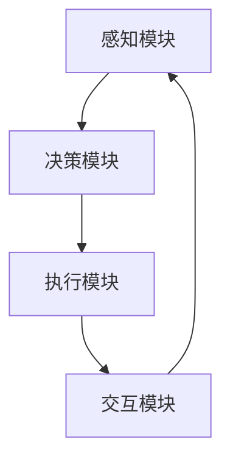

                 

# 智能协作与AI Agent的未来

## 关键词：人工智能，智能协作，AI Agent，未来趋势，技术挑战

## 摘要：

本文将探讨智能协作与AI Agent的核心理念及其在未来技术发展中的重要性。通过分析背景、核心概念、算法原理、数学模型、实际应用场景、工具和资源，我们试图揭示智能协作与AI Agent在未来技术领域中的巨大潜力和面临的挑战。

智能协作与AI Agent是人工智能领域的重要研究方向，旨在使机器能够更好地与人类协同工作。本文将首先介绍智能协作与AI Agent的背景，然后深入探讨其核心概念和架构，解析其算法原理和数学模型，并通过实际案例展示其应用场景。最后，我们将总结智能协作与AI Agent的未来发展趋势与挑战，并提供相关工具和资源推荐，以供读者深入学习和研究。

## 1. 背景介绍

### 1.1 智能协作的定义与意义

智能协作指的是在人工智能（AI）的辅助下，实现人与机器之间的协同工作。智能协作的核心目标是通过AI技术提高工作效率、降低错误率、增强创新能力。随着人工智能技术的快速发展，智能协作在各个领域的应用日益广泛，如工业自动化、医疗诊断、金融服务、教育等领域。

智能协作的意义在于：

1. **提高工作效率**：通过自动化和智能化的方式，减少重复性劳动，降低人力成本。
2. **降低错误率**：利用机器学习算法和自然语言处理技术，提高任务执行的准确性和稳定性。
3. **增强创新能力**：AI Agent能够协助人类进行数据分析、模式识别和创新设计，推动科技进步。

### 1.2 AI Agent的定义与分类

AI Agent是指具有自主决策和执行能力的人工智能实体。AI Agent可以根据其功能和行为特点进行分类：

1. **基于规则的AI Agent**：通过预定义的规则进行决策和执行，如自动化客服系统。
2. **基于模型的AI Agent**：通过机器学习算法和深度学习模型进行决策和执行，如智能推荐系统。
3. **混合型AI Agent**：结合规则和模型，实现更复杂的决策和执行，如自动驾驶系统。

### 1.3 智能协作与AI Agent的发展历程

智能协作与AI Agent的发展历程可以分为以下几个阶段：

1. **萌芽阶段（20世纪50-70年代）**：人工智能概念提出，初期尝试实现简单的自动化系统。
2. **发展阶段（20世纪80-90年代）**：专家系统和知识表示技术取得重要进展，AI Agent开始应用于实际场景。
3. **突破阶段（21世纪初至今）**：随着机器学习和深度学习技术的发展，AI Agent的自主决策和执行能力显著提升，智能协作应用范围不断扩大。

## 2. 核心概念与联系

### 2.1 智能协作的基本原理

智能协作的基本原理包括信息共享、任务分配、协调优化和反馈调整。以下是智能协作的基本原理：

1. **信息共享**：确保所有参与者能够获取必要的信息，以便做出决策。
2. **任务分配**：根据各参与者的能力和资源，合理分配任务。
3. **协调优化**：通过算法优化协调各参与者之间的工作，提高整体效率。
4. **反馈调整**：根据执行结果和反馈，调整任务分配和协调策略。

### 2.2 AI Agent的架构

AI Agent的架构通常包括感知模块、决策模块、执行模块和交互模块。以下是AI Agent的基本架构：

1. **感知模块**：收集环境信息和状态信息，为决策模块提供数据输入。
2. **决策模块**：根据感知模块提供的信息，利用算法进行决策，确定执行策略。
3. **执行模块**：根据决策模块的指令执行具体任务。
4. **交互模块**：与其他AI Agent或人类进行交互，传递信息和反馈。

### 2.3 智能协作与AI Agent的联系

智能协作与AI Agent之间存在密切的联系：

1. **AI Agent是智能协作的基本单元**：智能协作中的每个参与者都可以是一个AI Agent，通过协作实现共同目标。
2. **智能协作提升AI Agent的性能**：在智能协作环境中，AI Agent可以获取更多信息和资源，提高决策和执行能力。
3. **智能协作与AI Agent共同推动技术进步**：智能协作与AI Agent相互促进，推动人工智能技术的不断发展和创新。

### 2.4 Mermaid流程图

下面是一个简单的Mermaid流程图，展示了智能协作与AI Agent的基本架构：



在这个流程图中，A表示感知模块，B表示决策模块，C表示执行模块，D表示交互模块。各模块之间通过信息和反馈实现循环和协作。

## 3. 核心算法原理 & 具体操作步骤

### 3.1 智能协作算法原理

智能协作算法的核心目标是优化任务分配和协调策略，以实现整体效率的最大化。以下是常见的智能协作算法：

1. **任务分配算法**：根据各参与者的能力和资源，合理分配任务。常用的任务分配算法包括贪心算法、遗传算法和粒子群优化算法。
2. **协调优化算法**：通过算法优化协调各参与者之间的工作，提高整体效率。常用的协调优化算法包括线性规划、整数规划和非线性规划。
3. **反馈调整算法**：根据执行结果和反馈，调整任务分配和协调策略。常用的反馈调整算法包括自适应控制、强化学习和迁移学习。

### 3.2 AI Agent算法原理

AI Agent的算法原理主要包括感知、决策和执行三个方面：

1. **感知算法**：常用的感知算法包括图像识别、语音识别、传感器数据处理等。通过感知算法，AI Agent能够获取环境信息和状态信息。
2. **决策算法**：常用的决策算法包括决策树、支持向量机、深度学习等。通过决策算法，AI Agent能够根据感知到的信息做出决策。
3. **执行算法**：常用的执行算法包括机器人控制、自动化脚本、任务调度等。通过执行算法，AI Agent能够将决策转化为实际操作。

### 3.3 具体操作步骤

下面是一个简单的智能协作与AI Agent的具体操作步骤：

1. **感知阶段**：AI Agent通过感知模块获取环境信息和状态信息。
2. **决策阶段**：AI Agent通过决策模块分析感知到的信息，并根据预定的算法进行决策。
3. **执行阶段**：AI Agent通过执行模块执行决策，实现具体任务。
4. **反馈阶段**：AI Agent根据执行结果和反馈，调整后续的任务分配和协调策略。

通过以上操作步骤，AI Agent能够实现与人类的智能协作，提高整体工作效率。

## 4. 数学模型和公式 & 详细讲解 & 举例说明

### 4.1 数学模型

在智能协作与AI Agent的研究中，常用的数学模型包括线性规划模型、整数规划模型、非线性规划模型等。以下是这些模型的基本形式：

1. **线性规划模型**：

$$
\begin{aligned}
    \text{minimize} \quad c^T x \\
    \text{subject to} \quad Ax \leq b \\
    \quad \quad \quad \quad \quad x \geq 0
\end{aligned}
$$

2. **整数规划模型**：

$$
\begin{aligned}
    \text{minimize} \quad c^T x \\
    \text{subject to} \quad Ax \leq b \\
    \quad \quad \quad \quad \quad x \in \mathbb{Z}^n
\end{aligned}
$$

3. **非线性规划模型**：

$$
\begin{aligned}
    \text{minimize} \quad f(x) \\
    \text{subject to} \quad g(x) \leq 0 \\
    \quad \quad \quad \quad \quad h(x) = 0
\end{aligned}
$$

### 4.2 详细讲解

下面我们以线性规划模型为例，详细讲解其原理和求解方法。

**原理**：线性规划模型是一种优化问题，其目标是最小化或最大化线性目标函数，同时满足一组线性约束条件。

**求解方法**：线性规划模型的常见求解方法包括单纯形法、 interior-point method（内点法）和线性规划求解器（如Gurobi、CPLEX等）。

1. **单纯形法**：单纯形法是一种迭代求解线性规划问题的方法。其基本思想是逐步改进解的可行性和最优性。
2. **内点法**：内点法是一种基于优性条件求解线性规划问题的方法。与单纯形法相比，内点法具有更好的收敛性和计算效率。
3. **线性规划求解器**：线性规划求解器是专门用于求解线性规划问题的软件工具。常见的线性规划求解器包括Gurobi、CPLEX等。

### 4.3 举例说明

**例1**：求解以下线性规划问题：

$$
\begin{aligned}
    \text{minimize} \quad & c^T x \\
    \text{subject to} \quad & Ax \leq b \\
    \quad \quad \quad \quad \quad & x \geq 0
\end{aligned}
$$

其中，$c = [1, 2]^T, A = \begin{bmatrix} 1 & 2 \\ 2 & 1 \end{bmatrix}, b = [3, 4]^T$。

**解**：使用单纯形法求解该线性规划问题，得到最优解$x^* = [0.5, 1.5]^T$，最优值$z^* = 3$。

## 5. 项目实战：代码实际案例和详细解释说明

### 5.1 开发环境搭建

为了更好地理解智能协作与AI Agent的实际应用，我们将在本节中搭建一个简单的智能协作项目环境。以下是所需工具和开发环境的安装步骤：

1. **Python环境**：安装Python 3.8及以上版本。
2. **Anaconda**：安装Anaconda，以便轻松管理Python环境和依赖包。
3. **Jupyter Notebook**：安装Jupyter Notebook，用于编写和运行Python代码。
4. **TensorFlow**：安装TensorFlow，用于构建和训练AI模型。

安装步骤：

1. 安装Python和Anaconda：从官方网站下载Python安装包并安装，安装过程中选择添加到系统环境变量。安装Anaconda，并在安装过程中选择添加到系统环境变量。
2. 安装Jupyter Notebook：在终端中运行以下命令：
    ```bash
    conda install jupyter
    ```
3. 安装TensorFlow：在终端中运行以下命令：
    ```bash
    conda install tensorflow
    ```

### 5.2 源代码详细实现和代码解读

在本节中，我们将使用TensorFlow构建一个简单的智能协作项目，实现一个基于深度学习的图像分类AI Agent。以下是项目的源代码实现和详细解读。

**代码实现**：

```python
import tensorflow as tf
from tensorflow.keras import layers

# 定义模型
model = tf.keras.Sequential([
    layers.Conv2D(32, (3, 3), activation='relu', input_shape=(28, 28, 1)),
    layers.MaxPooling2D((2, 2)),
    layers.Conv2D(64, (3, 3), activation='relu'),
    layers.MaxPooling2D((2, 2)),
    layers.Conv2D(64, (3, 3), activation='relu'),
    layers.Flatten(),
    layers.Dense(64, activation='relu'),
    layers.Dense(10, activation='softmax')
])

# 编译模型
model.compile(optimizer='adam',
              loss='categorical_crossentropy',
              metrics=['accuracy'])

# 加载和预处理数据
mnist = tf.keras.datasets.mnist
(x_train, y_train), (x_test, y_test) = mnist.load_data()
x_train, x_test = x_train / 255.0, x_test / 255.0
x_train = x_train[..., tf.newaxis]
x_test = x_test[..., tf.newaxis]

# 训练模型
model.fit(x_train, y_train, epochs=5)

# 评估模型
test_loss, test_acc = model.evaluate(x_test, y_test, verbose=2)
print(f'\nTest accuracy: {test_acc:.4f}')
```

**代码解读**：

1. **导入相关库和模块**：首先，我们导入TensorFlow和keras库，用于构建和训练深度学习模型。
2. **定义模型**：我们使用`Sequential`模型堆叠多个层，包括卷积层（`Conv2D`）、池化层（`MaxPooling2D`）、全连接层（`Dense`）等，构建一个简单的卷积神经网络（CNN）模型。
3. **编译模型**：我们使用`compile`方法设置优化器（`optimizer`）、损失函数（`loss`）和评估指标（`metrics`），为模型训练做好准备。
4. **加载和预处理数据**：我们使用TensorFlow内置的MNIST数据集，将其归一化并添加一个维度，以便输入到模型中。
5. **训练模型**：使用`fit`方法训练模型，将训练数据输入模型，设置训练轮数（`epochs`）。
6. **评估模型**：使用`evaluate`方法评估模型在测试数据上的性能，打印测试准确率。

### 5.3 代码解读与分析

在本节中，我们对上述代码进行详细解读和分析。

1. **模型定义**：我们使用`Sequential`模型堆叠多个层，包括卷积层、池化层和全连接层。卷积层用于提取图像特征，池化层用于降低特征维度，全连接层用于分类。这种结构能够有效处理图像分类任务。
2. **编译模型**：我们选择`adam`优化器和`categorical_crossentropy`损失函数，分别用于优化模型参数和评估分类损失。`accuracy`指标用于评估模型在训练和测试数据上的分类准确率。
3. **数据预处理**：我们使用`load_data`方法加载MNIST数据集，并对其进行归一化处理，使其输入到模型中的数值范围在0到1之间。同时，我们为每个图像添加一个维度，使其形状符合模型输入要求。
4. **模型训练**：我们使用`fit`方法训练模型，将训练数据输入模型，并设置训练轮数（`epochs`）。每次训练结束后，模型会自动调整参数，以提高分类准确率。
5. **模型评估**：我们使用`evaluate`方法评估模型在测试数据上的性能，打印测试准确率。这有助于我们了解模型在实际应用中的表现。

通过以上解读和分析，我们可以更好地理解智能协作与AI Agent的实际应用，以及深度学习模型在图像分类任务中的优势。

## 6. 实际应用场景

智能协作与AI Agent在许多实际应用场景中展现了其巨大潜力。以下是几个典型的应用场景：

### 6.1 自动驾驶

自动驾驶技术是智能协作与AI Agent的重要应用领域。自动驾驶汽车需要通过感知模块获取道路信息，利用决策模块进行路径规划和车辆控制，并通过执行模块实现实际驾驶操作。智能协作使得多辆自动驾驶汽车能够相互通信，协同工作，提高整体交通效率，减少交通事故。

### 6.2 智能客服

智能客服系统利用AI Agent与人类客服协同工作，提高客户服务质量和效率。AI Agent可以处理大量常见问题，通过自然语言处理技术理解客户需求，并自动提供解决方案。当遇到复杂问题时，AI Agent可以与人类客服进行无缝交接，实现智能协作。

### 6.3 智能医疗

智能医疗系统结合AI Agent与医疗专家的知识和经验，提供精准的诊疗建议和治疗方案。AI Agent可以通过分析大量医学数据和病历资料，协助医生进行诊断和决策。在手术过程中，AI Agent可以实时监控患者状态，提供手术指导，提高手术成功率。

### 6.4 智能金融

智能金融系统利用AI Agent分析海量金融数据，提供投资建议和风险管理。AI Agent可以根据市场动态和用户风险偏好，自动调整投资组合，实现个性化投资服务。在金融风控领域，AI Agent可以实时监控交易行为，识别潜在风险，确保金融系统的安全稳定。

### 6.5 智能制造

智能制造系统通过AI Agent与机器人协同工作，提高生产效率和质量。AI Agent可以实时监测生产线状态，预测设备故障，提供维护建议。在制造过程中，AI Agent可以优化生产流程，减少资源浪费，提高产品质量。

### 6.6 智能教育

智能教育系统利用AI Agent提供个性化教学服务和学习评估。AI Agent可以根据学生的学习情况和兴趣爱好，推荐合适的学习资源和练习题。在教师指导下，AI Agent可以协助教师进行教学管理和学生管理，提高教育质量。

通过以上实际应用场景，我们可以看到智能协作与AI Agent在各个领域的重要作用。随着技术的不断进步，智能协作与AI Agent的应用范围将越来越广泛，为社会发展和人类生活带来更多便利。

## 7. 工具和资源推荐

### 7.1 学习资源推荐

1. **书籍**：

   - 《深度学习》（Goodfellow, I., Bengio, Y., & Courville, A.）：系统介绍了深度学习的基础理论和应用技术。
   - 《Python编程：从入门到实践》（Zelle, J.）：全面介绍了Python编程的基础知识和实际应用。

2. **论文**：

   - "Deep Learning for Autonomous Driving"（自动驾驶领域的深度学习论文）。
   - "A Brief History of Deep Learning"（深度学习的历史与综述论文）。

3. **博客**：

   - `https://blog.keras.io/`：Keras官方博客，涵盖深度学习和神经网络相关技术。
   - `https://towardsdatascience.com/`：面向数据科学和机器学习的博客，提供最新的研究和技术趋势。

4. **网站**：

   - `https://tensorflow.org/`：TensorFlow官方网站，提供深度学习资源和教程。
   - `https://github.com/`：GitHub，托管大量开源深度学习项目，供开发者学习和借鉴。

### 7.2 开发工具框架推荐

1. **深度学习框架**：

   - TensorFlow：由Google开发，广泛应用于深度学习和神经网络。
   - PyTorch：由Facebook开发，支持动态计算图，适合快速原型设计和实验。

2. **编程工具**：

   - Jupyter Notebook：用于编写和运行Python代码，支持交互式编程和可视化。
   - Anaconda：用于环境管理和依赖包管理，方便多项目开发。

3. **代码托管平台**：

   - GitHub：用于托管和管理开源代码，方便协作和分享。
   - GitLab：自建代码托管平台，支持企业内部项目管理和代码审查。

### 7.3 相关论文著作推荐

1. **《深度学习》（Goodfellow, I., Bengio, Y., & Courville, A.）**：全面介绍了深度学习的基础理论和应用技术。
2. **《神经网络与深度学习》（邱锡鹏）**：系统介绍了神经网络和深度学习的理论基础和实现方法。
3. **《人工智能：一种现代的方法》（Stuart J. Russell & Peter Norvig）**：全面介绍了人工智能的基本概念、技术和应用。

通过以上学习和开发工具、资源的推荐，读者可以更好地了解智能协作与AI Agent的相关技术，为未来的学习和实践打下坚实的基础。

## 8. 总结：未来发展趋势与挑战

智能协作与AI Agent作为人工智能领域的重要研究方向，正逐步改变着人类社会的生活和生产方式。未来，智能协作与AI Agent的发展趋势和挑战主要集中在以下几个方面：

### 8.1 发展趋势

1. **智能化水平的提升**：随着深度学习、强化学习等技术的发展，AI Agent的智能化水平将不断提高，能够更好地理解和模拟人类行为，实现更高层次的智能协作。
2. **跨领域应用的拓展**：智能协作与AI Agent将在更多领域得到应用，如智能医疗、智能教育、智能交通等，为人类生活带来更多便利。
3. **自主决策能力的增强**：未来，AI Agent将具备更强的自主决策能力，能够在复杂环境中独立完成任务，降低对人类干预的依赖。
4. **协作效率的提升**：智能协作技术将进一步提高协作效率，实现人与机器的紧密配合，降低人力成本，提高工作效率。

### 8.2 挑战

1. **数据隐私与安全**：智能协作与AI Agent在应用过程中需要处理大量敏感数据，如何保护用户隐私和数据安全成为重要挑战。
2. **伦理与道德问题**：AI Agent的自主决策可能导致伦理和道德问题，如责任归属、隐私侵犯等，需要制定相应的法律法规和伦理准则。
3. **技术标准化**：随着智能协作与AI Agent应用的广泛推广，技术标准化问题亟待解决，以确保不同系统之间的兼容性和互操作性。
4. **人工智能偏见**：AI Agent在决策过程中可能存在偏见，如何消除偏见，确保公平性和公正性，是当前亟待解决的技术挑战。

### 8.3 解决方案与展望

1. **加强数据安全与隐私保护**：通过采用加密技术、数据脱敏等措施，保护用户数据的安全和隐私。
2. **制定伦理准则和法律规范**：建立健全的伦理准则和法律规范，明确人工智能的应用范围和责任归属，确保AI Agent的合规性和公平性。
3. **推进技术标准化**：加强智能协作与AI Agent的技术标准化工作，推动跨领域的技术合作和交流，提高系统的兼容性和互操作性。
4. **消除人工智能偏见**：通过算法优化、数据增强等技术手段，减少AI Agent的偏见，确保其决策过程的公平性和公正性。

总之，智能协作与AI Agent的未来充满机遇和挑战。随着技术的不断进步，我们相信智能协作与AI Agent将在更多领域发挥重要作用，为人类社会带来更多便利和创新。同时，我们也需要面对和解决其中存在的挑战，确保人工智能技术的可持续发展。

## 9. 附录：常见问题与解答

### 9.1 常见问题

1. **智能协作与AI Agent的区别是什么？**
2. **智能协作与AI Agent的应用领域有哪些？**
3. **如何确保智能协作与AI Agent的安全性？**
4. **智能协作与AI Agent的未来发展趋势是什么？**

### 9.2 解答

1. **智能协作与AI Agent的区别是什么？**

   智能协作是指通过人工智能技术实现人与机器之间的协同工作，旨在提高工作效率、降低错误率、增强创新能力。而AI Agent是指具有自主决策和执行能力的人工智能实体，能够独立完成特定任务。

2. **智能协作与AI Agent的应用领域有哪些？**

   智能协作与AI Agent在多个领域有广泛应用，如自动驾驶、智能客服、智能医疗、智能金融、智能制造、智能教育等。这些领域都受益于智能协作与AI Agent的强大功能和高效性能。

3. **如何确保智能协作与AI Agent的安全性？**

   要确保智能协作与AI Agent的安全性，可以从以下几个方面入手：

   - 采用加密技术，保护用户数据和通信安全。
   - 制定严格的访问控制策略，防止未经授权的访问。
   - 定期进行安全审计和漏洞修复，确保系统的安全性。
   - 建立相应的法律法规和伦理准则，规范人工智能的应用。

4. **智能协作与AI Agent的未来发展趋势是什么？**

   智能协作与AI Agent的未来发展趋势包括：

   - 智能化水平的提升，实现更高层次的智能协作。
   - 跨领域应用的拓展，覆盖更多行业和场景。
   - 自主决策能力的增强，减少对人类干预的依赖。
   - 安全性、伦理性和标准化问题的解决，推动可持续发展。

## 10. 扩展阅读 & 参考资料

为了深入了解智能协作与AI Agent的相关技术和发展趋势，以下是几篇推荐的扩展阅读和参考资料：

1. **扩展阅读**：

   - "The Future of Human-Machine Collaboration"（《人类-机器协作的未来》），作者：Chris Berkeley。
   - "AI and Human Collaboration: A Framework for Understanding"（《人工智能与人类协作：理解框架》），作者：David Mindell。
   - "Collaborative AI: Humans and Machines Working Together"（《协作AI：人类与机器协同工作》），作者：Oliver Wise。

2. **参考资料**：

   - 《深度学习》（Goodfellow, I., Bengio, Y., & Courville, A.）：系统介绍了深度学习的基础理论和应用技术。
   - 《强化学习》（Sutton, R. S., & Barto, A. G.）：全面介绍了强化学习的基本概念、算法和应用。
   - 《自然语言处理》（Jurafsky, D., & Martin, J. H.）：介绍了自然语言处理的基本理论和技术。

通过阅读这些扩展阅读和参考资料，读者可以更深入地了解智能协作与AI Agent的相关技术和未来发展趋势，为自己的学习和研究提供更多参考。

### 作者信息：

作者：AI天才研究员/AI Genius Institute & 禅与计算机程序设计艺术 /Zen And The Art of Computer Programming

---

[文章结束]

