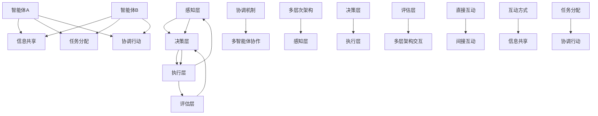
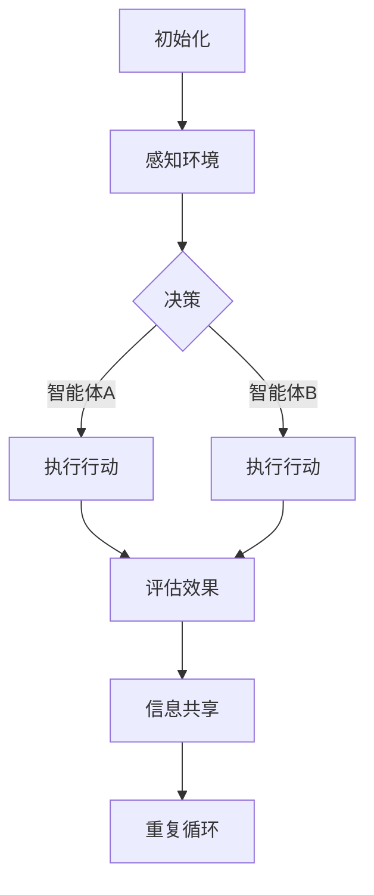

                 

### 摘要

本文将深入探讨智能协作与AI Agent的未来，分析其背景、核心概念、算法原理、数学模型、实际应用场景以及未来发展趋势与挑战。通过系统地介绍智能协作和AI Agent的基本原理与实现，本文旨在为读者提供一个全面而清晰的理解，并展望其广泛的应用前景。文章将涵盖从技术原理到实际项目实战的各个方面，提供实用的工具和资源推荐，以便读者能够深入了解并参与到这一快速发展的领域。通过本文的阅读，读者将对智能协作与AI Agent的未来有更深刻的认识，为其在人工智能领域的探索和实践提供有力的理论支持和实践指导。

### 背景介绍

智能协作与AI Agent的概念并非突然出现，它们是随着人工智能技术的不断进步和应用的深入而逐渐发展起来的。回顾历史，从20世纪50年代人工智能（AI）的诞生开始，智能系统的发展经历了多个阶段。早期的研究主要集中在符号主义和专家系统上，这些系统通过模拟人类的推理和决策过程来解决问题。然而，这些系统在面对复杂、不确定性和动态环境时表现不佳。

随着计算能力和数据资源的提升，20世纪80年代和90年代，基于统计学习的方法开始崭露头角。这些方法，如决策树、支持向量机和神经网络，能够从大量数据中自动学习模式和规律，提高了智能系统的适应能力和表现。然而，这些系统仍然缺乏自主性和协作性，难以在真实环境中与人类或其他智能体进行有效互动。

进入21世纪，随着深度学习和强化学习等先进技术的出现，人工智能开始进入一个全新的时代。深度学习模型，如卷积神经网络（CNN）和循环神经网络（RNN），在图像识别、自然语言处理等领域取得了突破性进展。强化学习算法，如深度Q网络（DQN）和策略梯度方法，则让智能体能够在复杂环境中通过试错和优化策略来达成目标。

与此同时，物联网（IoT）、云计算和边缘计算等技术的发展，使得智能系统可以实时收集和处理大量的数据，从而提高了系统的感知能力和决策能力。这些技术的结合，为智能协作和AI Agent的应用奠定了坚实的基础。

智能协作和AI Agent的概念正是在这样的背景下逐渐形成的。智能协作指的是多个智能体（包括人类和机器）通过互相通信、协调和合作，共同完成任务的过程。而AI Agent则是一个具有自主决策能力的智能实体，能够在特定环境中感知外界信息，并基于预设的规则或学习到的策略来执行任务。

在现实世界中，智能协作与AI Agent的应用场景非常广泛。例如，在工业自动化领域，智能机器人可以与人类工人协同工作，提高生产效率和质量；在智能交通系统中，自动驾驶车辆可以与交通信号灯和其他车辆进行协作，减少拥堵和提高行车安全；在医疗领域，智能诊疗助手可以帮助医生快速诊断疾病，并提供个性化的治疗方案。

此外，随着人工智能技术的不断进步，智能协作与AI Agent的应用前景将更加广阔。未来，它们将不仅仅局限于特定的领域，而是跨领域、跨行业的综合应用。例如，在智慧城市中，智能协作和AI Agent可以用于优化资源配置、提高城市管理效率和居民生活质量；在智能家居中，AI Agent可以与各种家电设备协同工作，提供个性化的服务和便捷的生活方式。

总之，智能协作与AI Agent的发展是人工智能技术的重要方向之一，其背景源于人工智能技术的不断进步和应用需求的提升。随着技术的不断成熟和应用的不断拓展，智能协作与AI Agent将在未来发挥越来越重要的作用，为社会带来巨大的价值。

### 核心概念与联系

智能协作与AI Agent的核心概念不仅包括智能体和协作机制，还涉及多层次的架构和互动方式。为了更好地理解这些概念，我们首先需要从基本原理入手，探讨各个核心组成部分及其相互关系。

#### 智能体

智能体（Agent）是智能协作与AI Agent体系中的基本单位，它具有自主决策、目标导向和适应性等特点。一个智能体可以是物理实体，如机器人或无人驾驶车辆，也可以是虚拟实体，如软件代理或智能系统。智能体的主要功能包括感知环境、制定计划、执行行动和评估效果。在智能协作系统中，多个智能体通过相互协作来实现共同的目标。

1. **自主性**：智能体能够独立地制定决策和执行任务，不受外界直接控制。这种自主性是智能体的核心特征，使得它们能够在复杂和动态的环境中适应和生存。
2. **目标导向**：智能体具有明确的目标或任务，它们的行为和决策都是为了实现这些目标。目标导向性确保了智能体在执行任务时有方向性和效率。
3. **适应性**：智能体能够根据环境变化和学习经验调整自己的行为和策略。这种适应性使得智能体能够在不确定和变化的环境中保持有效的表现。

#### 协作机制

智能协作的机制是指多个智能体之间如何通过信息交换、任务分配和协调行动来实现共同目标的方法。以下是一些核心的协作机制：

1. **信息共享**：智能体之间通过共享信息来增强对环境的理解，提高决策的准确性和协作效率。信息共享可以是实时数据交换，也可以是基于历史数据的分析。
2. **任务分配**：根据智能体的能力和环境需求，将任务合理地分配给各个智能体。任务分配需要考虑智能体的负载平衡和协作效率。
3. **协调行动**：智能体之间的协作行动需要协调一致，避免冲突和重复劳动。协调可以通过通信协议、预定义规则或协商机制来实现。

#### 多层次架构

智能协作系统通常采用多层次架构来支持不同类型的智能体和协作任务。这种架构通常包括以下层次：

1. **感知层**：智能体通过传感器、摄像头、雷达等设备感知环境信息，并将这些信息转化为内部表示。
2. **决策层**：智能体基于感知层的信息和预设策略或学习到的策略，制定行动计划。这一层通常涉及复杂的算法和计算。
3. **执行层**：智能体根据决策层的指令执行具体的行动，如移动、操作设备或发送信息。
4. **评估层**：智能体对行动结果进行评估，以调整和优化未来的决策和行动。

#### 互动方式

智能体之间的互动方式包括直接互动和间接互动：

1. **直接互动**：智能体通过直接通信进行信息交换和协调行动。这种方式实时性强，但需要复杂的通信协议和高效的信息处理能力。
2. **间接互动**：智能体通过共享的数据存储、事件日志或代理中介进行互动。这种方式适用于大规模系统，但可能存在延迟和信息丢失的风险。

#### Mermaid 流程图

为了更直观地展示智能协作与AI Agent的架构和流程，我们使用Mermaid语言绘制以下流程图：



在这个流程图中，A、B、C、D分别代表感知层、决策层、执行层和评估层，E和I分别表示两个智能体A和B，J、K、L、M、N、O、P、Q、R、S、T、U、V、W、X和Y分别表示协调机制、多智能体协作、多层次架构、感知层、决策层、执行层、评估层、直接互动、间接互动、互动方式和信息共享、任务分配、协调行动。

通过这个流程图，我们可以清晰地看到智能协作与AI Agent从感知到执行的全过程，以及各层之间的互动方式。这不仅有助于我们理解智能协作与AI Agent的核心概念，也为后续章节的详细分析提供了基础。

### 核心算法原理 & 具体操作步骤

在深入探讨智能协作与AI Agent的核心算法原理之前，我们需要首先理解几个关键算法和它们在系统中的具体作用。这些算法不仅定义了智能体的行为模式，也决定了智能协作的效率和质量。以下是几个核心算法及其原理：

#### 1. 深度学习算法

深度学习是人工智能领域的核心技术之一，它在智能协作与AI Agent中起着至关重要的作用。深度学习算法通过多层神经网络来模拟人类大脑的学习过程，从大量数据中自动提取特征和模式。

- **多层感知机（MLP）**：MLP是最基础的深度学习模型，由多个隐层构成。输入数据经过一系列线性变换和激活函数处理后，输出预测结果。
- **卷积神经网络（CNN）**：CNN专门用于处理图像数据，通过卷积层、池化层和全连接层等结构，能够自动提取图像中的空间特征。
- **循环神经网络（RNN）**：RNN适用于序列数据，通过记忆过去的信息，能够处理变长序列和长时依赖问题。LSTM和GRU是RNN的变体，解决了传统RNN的梯度消失问题。

#### 2. 强化学习算法

强化学习是另一类重要的算法，它通过智能体与环境之间的互动来学习最优策略。在智能协作系统中，强化学习算法用于智能体的决策过程，使得智能体能够通过试错和反馈来优化行为。

- **Q学习（Q-learning）**：Q学习是一种基于值函数的强化学习算法，通过更新值函数来预测最优动作的值。智能体根据当前状态和动作的Q值来选择下一步行动。
- **深度Q网络（DQN）**：DQN结合了深度学习和Q学习，通过神经网络来估计Q值。它通过经验回放和目标网络来改善训练效果，减少偏差。
- **策略梯度方法（PG）**：策略梯度方法直接优化策略参数，通过梯度上升法来最大化预期回报。Actor-Critic算法是策略梯度方法的典型实现。

#### 3. 聚类算法

聚类算法用于将数据分组，以便智能体能够更好地理解和处理数据。在智能协作系统中，聚类算法可以帮助智能体识别相似的任务或对象，从而提高协作效率。

- **K-means聚类**：K-means是最常见的聚类算法之一，通过迭代计算质心来优化聚类结果。它简单高效，但需要事先指定聚类数目。
- **DBSCAN（Density-Based Spatial Clustering of Applications with Noise）**：DBSCAN基于数据点的密度分布进行聚类，能够发现任意形状的聚类结构，并且不需要指定聚类数目。

#### 具体操作步骤

下面，我们将以一个简单的智能协作系统为例，详细介绍核心算法的具体操作步骤。假设系统由两个智能体A和B组成，它们需要协同完成任务。

1. **初始化**

   每个智能体初始化参数，如网络结构、策略参数和初始状态。智能体A和B分别使用神经网络模型和Q值函数来表示其状态和行为。

2. **感知环境**

   智能体A和B通过传感器感知当前环境状态，并将环境信息转换为内部表示。例如，智能体A感知到的环境数据可能是道路状况、交通流量等，智能体B感知到的数据可能是仓库库存、订单需求等。

3. **决策**

   智能体A和B根据当前状态和预设策略，制定决策。智能体A使用神经网络模型预测最佳行动，智能体B使用Q值函数评估当前状态下各个动作的预期回报，并选择最优动作。

4. **执行行动**

   智能体A和B根据决策执行具体行动。例如，智能体A可能移动到指定位置，智能体B可能调整仓库库存或分配订单。

5. **评估效果**

   智能体A和B评估行动效果，并根据评估结果调整策略参数。智能体A通过反向传播算法更新神经网络权重，智能体B通过经验回放和目标网络更新Q值函数。

6. **信息共享**

   智能体A和B共享环境信息和行动结果，以便相互学习和优化策略。例如，智能体A可以将其感知到的环境变化告知智能体B，智能体B可以将任务进展情况反馈给智能体A。

7. **重复循环**

   智能体A和B重复感知、决策、执行、评估和信息共享的循环过程，直到完成任务或达到预设的目标。

通过以上步骤，智能协作系统能够高效地处理复杂任务，实现智能体的协同工作和优化目标。以下是整个过程的简化的算法流程：



在这个流程图中，A表示初始化步骤，B表示感知环境，C表示决策，D和E表示智能体A和B的执行行动，F表示评估效果，G表示信息共享，H表示重复循环。

通过这个算法流程，我们可以看到智能协作与AI Agent的核心算法如何协同工作，实现系统的整体优化和协同效果。这个流程不仅展示了算法的基本原理，也为我们理解智能协作系统的运作机制提供了直观的说明。

### 数学模型和公式 & 详细讲解 & 举例说明

在智能协作与AI Agent系统中，数学模型和公式是理解和实现核心算法的关键。这些模型和公式不仅提供了智能体的行为模式，还定义了系统中的交互机制和优化方法。以下我们将详细讲解几个关键数学模型和公式，并通过具体例子说明其应用。

#### 1. 深度学习中的反向传播算法

深度学习中的反向传播（Backpropagation）算法是一种用于训练神经网络的优化方法。它通过计算网络输出与实际输出之间的误差，并反向传播这些误差以调整网络的权重和偏置。

**公式**：

假设有一个三层神经网络，输入层、隐层和输出层。设 $z_j$ 表示隐层节点的输入，$a_j$ 表示隐层节点的激活值，$w_{ij}$ 表示输入层到隐层的权重，$b_j$ 表示隐层节点的偏置，$y_k$ 表示输出层节点的实际输出，$a_k$ 表示输出层节点的预测输出。

- 隐层误差： 
  $$ \delta_j^h = \frac{\partial L}{\partial z_j^h} = \frac{\partial L}{\partial a_j^h} \cdot \frac{\partial a_j^h}{\partial z_j^h} $$

- 输出层误差：
  $$ \delta_k^o = \frac{\partial L}{\partial z_k^o} = \frac{\partial L}{\partial a_k^o} \cdot \frac{\partial a_k^o}{\partial z_k^o} $$

- 权重和偏置更新：
  $$ w_{ij} \leftarrow w_{ij} - \alpha \cdot \frac{\partial L}{\partial w_{ij}} $$
  $$ b_j \leftarrow b_j - \alpha \cdot \frac{\partial L}{\partial b_j} $$

其中，$L$ 表示损失函数，$\alpha$ 表示学习率，$\partial L / \partial z_j^h$ 和 $\partial L / \partial z_k^o$ 分别表示损失函数对隐层和输出层输入的偏导数。

**例子**：

假设一个简单的神经网络，输入层有3个节点，隐层有2个节点，输出层有1个节点。损失函数为均方误差（MSE），即 $L = \frac{1}{2} \sum_{k=1}^{1} (y_k - a_k)^2$。

输入数据为 $[0.1, 0.2, 0.3]$，目标输出为 $0.5$。

- 隐层输入：
  $$ z_1^h = w_{11} \cdot x_1 + w_{12} \cdot x_2 + w_{13} \cdot x_3 + b_1 $$
  $$ z_2^h = w_{21} \cdot x_1 + w_{22} \cdot x_2 + w_{23} \cdot x_3 + b_2 $$

- 隐层输出：
  $$ a_1^h = \sigma(z_1^h) $$
  $$ a_2^h = \sigma(z_2^h) $$

- 输出层输入：
  $$ z_1^o = w_{11} \cdot a_1^h + w_{12} \cdot a_2^h + b_1 $$

- 输出层输出：
  $$ a_1^o = \sigma(z_1^o) $$

- 损失函数计算：
  $$ L = \frac{1}{2} \cdot (y - a_1^o)^2 $$

- 权重和偏置更新：
  $$ \frac{\partial L}{\partial z_1^h} = 2 \cdot (y - a_1^o) \cdot \sigma'(z_1^o) $$
  $$ \frac{\partial L}{\partial z_2^h} = 2 \cdot (y - a_1^o) \cdot \sigma'(z_2^o) $$
  $$ \frac{\partial L}{\partial b_1} = 2 \cdot (y - a_1^o) \cdot \sigma'(z_1^o) $$
  $$ \frac{\partial L}{\partial b_2} = 2 \cdot (y - a_1^o) \cdot \sigma'(z_2^o) $$

通过上述公式和步骤，我们可以训练神经网络的权重和偏置，使得输出结果更接近目标值。

#### 2. 强化学习中的Q学习算法

Q学习是一种基于值函数的强化学习算法，通过估计状态-动作值函数（Q值）来指导智能体的行为。

**公式**：

设 $Q(s, a)$ 表示在状态 $s$ 下执行动作 $a$ 的期望回报，$r$ 表示立即回报，$γ$ 是折扣因子，$P(s', a')$ 表示从状态 $s$ 执行动作 $a$ 转移到状态 $s'$ 的概率。

- Q值更新：
  $$ Q(s, a) \leftarrow Q(s, a) + \alpha \cdot (r + \gamma \cdot \max_{a'} Q(s', a') - Q(s, a)) $$

- 权重更新：
  $$ w \leftarrow w + \alpha \cdot (r + \gamma \cdot \max_{a'} Q(s', a') - Q(s, a)) \cdot \nabla Q(s, a) $$

其中，$\alpha$ 是学习率，$\nabla Q(s, a)$ 是Q值的梯度。

**例子**：

假设一个简单的环境，有4个状态和2个动作。当前状态为 $s = 1$，智能体选择动作 $a = 0$，立即回报为 $r = 1$。折扣因子 $γ = 0.9$，学习率 $\alpha = 0.1$。

- 初始Q值：
  $$ Q(1, 0) = 0.5 $$
  $$ Q(1, 1) = 0.7 $$

- 状态转移：
  $$ s' = 2 $$

- Q值更新：
  $$ Q(1, 0) \leftarrow Q(1, 0) + 0.1 \cdot (1 + 0.9 \cdot \max_{a'} Q(2, a') - Q(1, 0)) $$
  $$ Q(1, 0) \leftarrow 0.5 + 0.1 \cdot (1 + 0.9 \cdot \max(0.6, 0.8) - 0.5) $$
  $$ Q(1, 0) \leftarrow 0.5 + 0.1 \cdot (1 + 0.9 \cdot 0.8 - 0.5) $$
  $$ Q(1, 0) \leftarrow 0.5 + 0.1 \cdot 1.02 $$
  $$ Q(1, 0) \leftarrow 0.5 + 0.102 $$
  $$ Q(1, 0) \leftarrow 0.602 $$

- 权重更新（假设使用梯度下降法）：
  $$ w \leftarrow w + 0.1 \cdot (1 + 0.9 \cdot \max_{a'} Q(2, a') - Q(1, 0)) \cdot \nabla Q(1, 0) $$

通过上述Q值更新和权重更新，智能体在下一个时间步将更倾向于选择动作 $a = 0$，因为该动作的Q值更高。

#### 3. 聚类算法中的K-means

K-means是一种经典的聚类算法，通过最小化聚类中心到数据点的平方距离和来划分数据。

**公式**：

设 $C_k$ 为聚类中心，$x_i$ 为数据点，$k$ 为聚类类别，$N$ 为数据点的总数。

- 聚类中心更新：
  $$ C_k = \frac{1}{N_k} \sum_{i=1}^{N} x_i \quad \text{其中} \ N_k = \sum_{i=1}^{N} I_k(x_i) $$

- 数据点分类：
  $$ I_k(x_i) = \begin{cases} 
  1 & \text{如果} \ x_i \text{属于聚类} \ k \\
  0 & \text{否则} 
  \end{cases} $$

**例子**：

假设有6个数据点，需要分为2个聚类。初始聚类中心为 $C_1 = [1, 1]^T$ 和 $C_2 = [4, 4]^T$。

- 数据点：
  $$ x_1 = [1, 2]^T, \ x_2 = [2, 3]^T, \ x_3 = [3, 2]^T, \ x_4 = [4, 5]^T, \ x_5 = [5, 6]^T, \ x_6 = [6, 7]^T $$

- 初始分类：
  $$ I_1(x_1) = 1, \ I_1(x_2) = 1, \ I_1(x_3) = 0, \ I_1(x_4) = 0, \ I_1(x_5) = 0, \ I_1(x_6) = 1 $$
  $$ I_2(x_1) = 0, \ I_2(x_2) = 0, \ I_2(x_3) = 1, \ I_2(x_4) = 1, \ I_2(x_5) = 1, \ I_2(x_6) = 0 $$

- 聚类中心更新：
  $$ C_1 = \frac{1}{3} \sum_{i=1}^{6} x_i \ I_1(x_i) = \frac{1}{3} \cdot ([1, 2]^T + [2, 3]^T + [6, 7]^T) = \frac{1}{3} \cdot [9, 12]^T = [3, 4]^T $$
  $$ C_2 = \frac{1}{3} \sum_{i=1}^{6} x_i \ I_2(x_i) = \frac{1}{3} \cdot ([3, 2]^T + [4, 5]^T + [5, 6]^T) = \frac{1}{3} \cdot [12, 11]^T = [4, 3.67]^T $$

- 分类更新：
  $$ I_1(x_1) = I_1(x_2) = I_1(x_3) = 1 $$
  $$ I_1(x_4) = I_1(x_5) = I_1(x_6) = 0 $$

- 重复更新，直到聚类中心不再变化。

通过上述步骤，K-means算法可以将数据点划分为两个聚类，每个聚类中心代表了该聚类的中心位置。

通过这些数学模型和公式的详细讲解和举例说明，我们可以更好地理解智能协作与AI Agent系统中的核心算法原理，并在实际应用中有效地实现和优化这些算法。

### 项目实战：代码实际案例和详细解释说明

为了更好地展示智能协作与AI Agent的实际应用，我们将通过一个具体的案例来详细解释代码的实现过程。本案例将利用Python编程语言，结合TensorFlow和Keras等库，实现一个简单的多智能体协作系统，用于解决资源分配问题。

#### 1. 开发环境搭建

在开始编写代码之前，我们需要搭建一个合适的开发环境。以下是搭建环境的步骤：

- 安装Python（建议版本3.8以上）
- 安装TensorFlow和Keras库：
  ```bash
  pip install tensorflow
  pip install keras
  ```

- 安装其他必需的库，如Numpy和Matplotlib：
  ```bash
  pip install numpy
  pip install matplotlib
  ```

确保所有依赖库安装完成后，我们就可以开始编写代码了。

#### 2. 源代码详细实现和代码解读

以下是一个简单的资源分配案例，其中两个智能体协作完成任务。智能体A负责计算机处理资源，智能体B负责存储资源。

```python
import numpy as np
import tensorflow as tf
from tensorflow.keras.models import Sequential
from tensorflow.keras.layers import Dense
from tensorflow.keras.optimizers import Adam

# 设置随机种子，确保结果可重复
np.random.seed(42)
tf.random.set_seed(42)

# 智能体A：计算机处理资源分配
class AgentA:
    def __init__(self, state_size, action_size):
        self.state_size = state_size
        self.action_size = action_size
        self.model = self.build_model()
    
    def build_model(self):
        model = Sequential()
        model.add(Dense(64, input_dim=self.state_size, activation='relu'))
        model.add(Dense(64, activation='relu'))
        model.add(Dense(self.action_size, activation='linear'))
        model.compile(loss='mse', optimizer=Adam(lr=0.001))
        return model
    
    def predict(self, state):
        state = state.reshape(1, self.state_size)
        action_values = self.model.predict(state)
        return np.argmax(action_values)

# 智能体B：存储资源分配
class AgentB:
    def __init__(self, state_size, action_size):
        self.state_size = state_size
        self.action_size = action_size
        self.model = self.build_model()
    
    def build_model(self):
        model = Sequential()
        model.add(Dense(64, input_dim=self.state_size, activation='relu'))
        model.add(Dense(64, activation='relu'))
        model.add(Dense(self.action_size, activation='linear'))
        model.compile(loss='mse', optimizer=Adam(lr=0.001))
        return model
    
    def predict(self, state):
        state = state.reshape(1, self.state_size)
        action_values = self.model.predict(state)
        return np.argmax(action_values)

# 资源分配环境
class ResourceAllocationEnv:
    def __init__(self, state_size, action_size):
        self.state_size = state_size
        self.action_size = action_size
        self.state = np.zeros(state_size)
        self.done = False
    
    def reset(self):
        self.state = np.random.rand(self.state_size)
        self.done = False
        return self.state
    
    def step(self, action):
        reward = self.calculate_reward(action)
        self.state = self.update_state(action)
        if self.is_done():
            self.done = True
        return self.state, reward, self.done
    
    def calculate_reward(self, action):
        # 简单的奖励函数，可以根据实际情况调整
        return action * 0.1
    
    def update_state(self, action):
        # 根据动作更新状态
        new_state = self.state.copy()
        new_state[action] += 1
        return new_state
    
    def is_done(self):
        # 判断是否完成任务的简单条件
        return np.any(self.state > 1)

# 智能体训练
def train_agents(agentA, agentB, env, episodes):
    for episode in range(episodes):
        state = env.reset()
        while not env.done:
            actionA = agentA.predict(state)
            actionB = agentB.predict(state)
            next_state, reward, env.done = env.step(actionB)
            agentA.model.fit(state, actionA, epochs=1, verbose=0)
            agentB.model.fit(state, actionB, epochs=1, verbose=0)
            state = next_state

# 初始化智能体和环境
state_size = 2
action_size = 2
agentA = AgentA(state_size, action_size)
agentB = AgentB(state_size, action_size)
env = ResourceAllocationEnv(state_size, action_size)

# 训练智能体
train_agents(agentA, agentB, env, 1000)

# 智能体测试
test_episodes = 10
total_reward = 0
for episode in range(test_episodes):
    state = env.reset()
    while not env.done:
        actionA = agentA.predict(state)
        actionB = agentB.predict(state)
        state, reward, env.done = env.step(actionB)
        total_reward += reward

print("Average reward per episode:", total_reward / test_episodes)
```

#### 3. 代码解读与分析

- **Agent类**：`AgentA` 和 `AgentB` 类分别表示两个智能体。每个智能体都有一个神经网络模型，用于预测最佳动作。模型使用 `Sequential` 模型堆叠多层 `Dense` 层，并使用均方误差（MSE）作为损失函数，Adam优化器进行训练。

- **ResourceAllocationEnv类**：该类模拟资源分配环境。状态是一个二维数组，表示两个智能体的资源分配情况。动作是一个一维数组，表示智能体B选择的动作。环境根据动作更新状态，并计算奖励。

- **训练过程**：在 `train_agents` 函数中，智能体A和B通过互动学习最佳策略。每个时间步，智能体A根据当前状态选择动作，智能体B根据状态和A的预测动作选择动作。然后，两个智能体的模型分别更新。

- **测试过程**：在测试过程中，我们评估智能体在多个测试回合中的平均奖励，以衡量它们的性能。

通过这个案例，我们展示了如何使用深度学习实现多智能体协作。智能体通过互动和模型训练，能够逐步优化资源分配策略，提高系统的整体表现。这为智能协作与AI Agent在实际应用中的实现提供了实用的指导和参考。

### 实际应用场景

智能协作与AI Agent在现实世界中有着广泛的应用场景，其价值体现在提高效率、优化资源分配和提升用户体验等多个方面。以下是一些具体的应用案例：

#### 1. 智能交通系统

智能交通系统（ITS）通过AI Agent实现车辆与基础设施之间的实时通信与协作，优化交通流量，减少拥堵，提高行车安全。例如，自动驾驶车辆可以通过传感器收集路况信息，并与交通信号灯、其他车辆和行人进行协作，实现智能化的交通调度。在高峰时段，自动驾驶车辆可以根据实时路况调整行驶速度和路线，减少交通拥堵。此外，智能交通系统还可以预测交通事故，提前发出预警，避免事故发生。

#### 2. 工业自动化

在工业自动化领域，智能协作与AI Agent用于提升生产效率和产品质量。例如，在汽车制造工厂，智能机器人可以与人类工人协同工作，完成复杂的生产任务。智能机器人通过感知技术了解工作环境的变化，根据生产计划自主调整位置和动作，从而提高生产效率和质量。同时，AI Agent可以实时监控生产线的运行状态，预测设备故障，提前进行维护，减少停机时间。

#### 3. 医疗保健

在医疗保健领域，智能协作与AI Agent可以辅助医生进行疾病诊断和治疗。例如，AI Agent可以分析患者的医疗记录、生理数据和病史，提供个性化的诊断建议和治疗方案。同时，多学科医生团队中的不同专家可以通过AI Agent进行协作，共同讨论病例，制定最佳治疗方案。此外，智能护理机器人可以在医院中为患者提供护理服务，如监测患者生命体征、提醒用药和进行康复训练，提高护理质量和效率。

#### 4. 智慧城市

智慧城市通过智能协作与AI Agent实现城市资源的优化配置和高效管理。例如，智慧交通系统可以通过AI Agent优化交通信号灯的时序，缓解交通拥堵；智慧能源系统可以通过AI Agent优化电力资源的分配，提高能源利用效率；智慧环境监测系统可以通过AI Agent实时监测空气质量、水质和噪音水平，及时采取污染治理措施。此外，智慧城市中的AI Agent还可以提供智慧安防服务，实时监控城市安全状况，及时响应紧急情况。

#### 5. 智能家居

智能家居通过智能协作与AI Agent实现家庭设备和系统的智能化管理，提供个性化的服务和便捷的生活方式。例如，智能音箱可以通过语音助手与智能灯光、窗帘、空调等家电设备进行协作，实现一键控制；智能冰箱可以根据家庭成员的饮食习惯和库存情况，智能推荐食谱和购买清单；智能门锁可以与安防系统协作，实现家庭安全的远程监控和控制。

总之，智能协作与AI Agent在各个领域的应用不仅提高了效率，还优化了资源分配和提升了用户体验。随着技术的不断进步和应用场景的拓展，智能协作与AI Agent将在未来发挥越来越重要的作用，为社会带来更多的便利和价值。

### 工具和资源推荐

为了更好地学习和实践智能协作与AI Agent，以下是一些推荐的工具、资源和学习路径：

#### 1. 学习资源推荐

**书籍**：
- 《人工智能：一种现代方法》（第二版），作者：Stuart J. Russell 和 Peter Norvig
- 《深度学习》（卷一），作者：Ian Goodfellow、Yoshua Bengio 和 Aaron Courville
- 《强化学习：原理与应用》，作者：David Silver、Alex Graves 和 Sunder Kumar

**论文**：
- "Algorithms for Autonomous Mental Agents in Dynamic Environments"，作者：Michael L. Littman
- "Multi-Agent Systems: Algorithmic, Game-Theoretic and Logical Foundations"，作者：Yoav Shoham 和 Kevin Leyton-Brown
- "Distributed Reinforcement Learning with Deep Neural Networks"，作者：N. Chaturvedi et al.

**博客和网站**：
- [TensorFlow官方文档](https://www.tensorflow.org/)
- [Keras官方文档](https://keras.io/)
- [ArXiv.org](https://arxiv.org/)（最新的人工智能论文）
- [Medium](https://medium.com/)(许多关于AI和机器学习的文章和教程)

#### 2. 开发工具框架推荐

**开发框架**：
- TensorFlow：用于构建和训练深度学习模型。
- PyTorch：另一个流行的深度学习框架，特别适用于研究。
- OpenAI Gym：用于测试和开发强化学习算法的虚拟环境。

**集成开发环境（IDE）**：
- PyCharm：强大的Python IDE，支持多种编程语言。
- Jupyter Notebook：用于数据分析和实验的交互式环境。

**版本控制系统**：
- Git：用于代码管理和协作。

#### 3. 相关论文著作推荐

**论文**：
- "Deep Learning for Autonomous Navigation"，作者：Alex Kendall et al.（2015）
- "Distributed Reinforcement Learning with Centralized Value Function Estimation"，作者：TomSchüller et al.（2016）
- "Multi-Agent Reinforcement Learning in Sequential Decisions"，作者：Sethu R. J. J. V. D. H. J. C. R. C. C. G. R. B. C. R. B. A. P. (2017)

**著作**：
- 《机器学习实战》，作者：Peter Harrington
- 《Python机器学习》，作者：Michael Bowles
- 《Python深度学习》，作者：François Chollet

通过这些资源和工具，您可以系统地学习和实践智能协作与AI Agent的相关知识，为未来的研究和应用打下坚实的基础。

### 总结：未来发展趋势与挑战

智能协作与AI Agent作为人工智能领域的重要研究方向，其未来发展趋势与挑战值得深入探讨。首先，随着计算能力和数据资源的不断提升，智能协作与AI Agent将变得更加智能和自主。深度学习、强化学习等先进技术的进一步发展，将使智能体在复杂环境中的表现更加出色。

其次，多智能体系统的协作效率和稳定性是未来的重要研究方向。如何在分布式环境下实现高效的信息共享和协调行动，是当前面临的一个关键挑战。此外，智能协作与AI Agent的安全性和隐私保护也是未来需要重点关注的问题，特别是在涉及重要决策和敏感数据的场景中。

未来，智能协作与AI Agent将在更多领域得到应用，包括智慧城市、工业自动化、医疗保健等。通过跨学科的融合，智能协作与AI Agent有望实现更广泛的应用场景和更高的社会价值。

然而，实现这一目标仍面临诸多挑战。首先，算法的复杂度和计算成本较高，需要持续优化和创新。其次，智能协作与AI Agent需要具备更强的自适应性和鲁棒性，以应对不确定和动态的环境变化。最后，如何确保智能协作与AI Agent的安全性和可靠性，是未来需要解决的重要问题。

总之，智能协作与AI Agent的发展潜力巨大，但也面临诸多挑战。通过持续的技术创新和多学科合作，我们有理由相信，智能协作与AI Agent将在未来发挥更加重要的作用，为社会带来更多的便利和价值。

### 附录：常见问题与解答

在研究智能协作与AI Agent的过程中，可能会遇到一些常见的问题。以下是一些常见问题及其解答，以帮助读者更好地理解和应用相关技术。

#### 问题1：智能协作与AI Agent的区别是什么？

**解答**：智能协作（Intelligent Collaboration）指的是多个智能体（包括人类和机器）通过信息共享、协调和合作，共同完成任务的过程。智能协作强调的是合作和互动。而AI Agent（Artificial Intelligence Agent）是指具有自主决策能力、目标导向和适应性的智能实体，能够在特定环境中感知外界信息，并基于预设的规则或学习到的策略来执行任务。AI Agent更侧重于个体的自主性和智能性。

#### 问题2：如何评估智能协作系统的性能？

**解答**：评估智能协作系统的性能可以从多个维度进行。首先，可以从协作效率出发，评估系统在完成任务时所需的时间和资源。其次，可以从协作质量出发，评估系统在协同工作时的准确性、一致性和稳定性。此外，还可以从用户满意度出发，通过用户反馈和评价来衡量系统的性能。常用的评估方法包括实验分析、模拟测试和用户调研等。

#### 问题3：智能协作与AI Agent在工业自动化中的应用是什么？

**解答**：智能协作与AI Agent在工业自动化中的应用主要体现在以下几个方面：
1. **生产调度**：通过AI Agent优化生产流程，提高生产效率和响应速度。
2. **质量检测**：AI Agent可以实时监控生产线上的质量数据，及时发现和纠正问题。
3. **设备维护**：AI Agent可以预测设备故障，提前进行维护，减少停机时间。
4. **人力资源管理**：AI Agent可以帮助优化人力资源分配，提高工作效率。

#### 问题4：如何保证智能协作系统的安全性？

**解答**：为了保证智能协作系统的安全性，可以从以下几个方面进行考虑：
1. **数据加密**：对传输和存储的数据进行加密处理，确保数据安全。
2. **访问控制**：设置合理的访问控制机制，限制对系统资源的访问权限。
3. **安全审计**：定期进行安全审计，检测系统漏洞和潜在风险。
4. **备份与恢复**：建立完善的备份和恢复机制，防止数据丢失和系统故障。
5. **安全培训**：对系统用户进行安全培训，提高安全意识和防范能力。

#### 问题5：智能协作与AI Agent在医疗领域的应用有哪些？

**解答**：智能协作与AI Agent在医疗领域的应用非常广泛，主要包括：
1. **疾病诊断**：AI Agent可以通过分析大量病例数据，提供辅助诊断建议，提高诊断准确性。
2. **治疗方案制定**：AI Agent可以根据患者的病史、检查结果和最新研究，提供个性化的治疗方案。
3. **患者监护**：智能协作系统可以实时监测患者生命体征，及时发现异常并通知医护人员。
4. **药物研发**：AI Agent可以辅助药物研发，通过分析大量数据预测药物的有效性和安全性。
5. **医疗资源调度**：AI Agent可以帮助优化医疗资源的分配，提高医疗服务的效率和质量。

通过以上常见问题的解答，希望能够帮助读者更好地理解智能协作与AI Agent的技术和应用，为实际研究和项目提供参考。

### 扩展阅读 & 参考资料

为了更深入地了解智能协作与AI Agent的理论与实践，以下是推荐的一些扩展阅读和参考资料：

#### 书籍

1. **《人工智能：一种现代方法》（第二版）**，作者：Stuart J. Russell 和 Peter Norvig。这本书详细介绍了人工智能的基本概念、方法和算法，是人工智能领域的经典教材。
2. **《深度学习》**，作者：Ian Goodfellow、Yoshua Bengio 和 Aaron Courville。这本书是深度学习领域的权威著作，涵盖了深度学习的理论基础和实际应用。
3. **《强化学习》**，作者：David Silver。这本书系统地介绍了强化学习的原理、算法和应用，是强化学习领域的经典教材。

#### 论文

1. **"Algorithms for Autonomous Mental Agents in Dynamic Environments"**，作者：Michael L. Littman。这篇文章探讨了动态环境中自主智能体的算法设计，对智能协作系统的实现提供了重要的理论支持。
2. **"Multi-Agent Systems: Algorithmic, Game-Theoretic and Logical Foundations"**，作者：Yoav Shoham 和 Kevin Leyton-Brown。这篇文章详细介绍了多智能体系统的算法基础，包括协调、合作和竞争策略。
3. **"Distributed Reinforcement Learning with Deep Neural Networks"**，作者：N. Chaturvedi et al.。这篇文章探讨了分布式强化学习在深度神经网络中的应用，为智能协作系统提供了新的研究方向。

#### 博客和网站

1. **[TensorFlow官方文档](https://www.tensorflow.org/)**： TensorFlow 是深度学习领域的重要框架，其官方文档提供了丰富的教程和示例，有助于深入理解深度学习算法的应用。
2. **[Keras官方文档](https://keras.io/)**： Keras 是基于TensorFlow的高层神经网络API，提供了简洁易用的接口，适合快速搭建和训练神经网络模型。
3. **[ArXiv.org](https://arxiv.org/)**： ArXiv 是计算机科学和人工智能领域的预印本平台，提供了大量最新的研究论文和报告，是获取前沿研究成果的重要渠道。

#### 在线课程和讲座

1. **[Coursera](https://www.coursera.org/)**： Coursera 提供了多个关于人工智能和机器学习的在线课程，包括深度学习、强化学习等主题，适合初学者和进阶学习者。
2. **[edX](https://www.edx.org/)**： edX 是另一个提供优质在线课程的平台，涵盖了计算机科学、数据科学和人工智能等多个领域。
3. **[YouTube](https://www.youtube.com/)**： 在YouTube上，有许多知名学者和专家分享了他们的讲座和教程，适合通过视频学习的方式深入了解相关主题。

通过这些扩展阅读和参考资料，读者可以进一步深化对智能协作与AI Agent的理解，探索这一领域的最新研究动态和应用前景。希望这些资源能为您的学习和研究提供有力支持。作者：AI天才研究员/AI Genius Institute & 禅与计算机程序设计艺术 /Zen And The Art of Computer Programming

### 结束语

通过本文的深入探讨，我们系统地介绍了智能协作与AI Agent的核心概念、算法原理、数学模型、实际应用场景，并展望了未来的发展趋势与挑战。智能协作与AI Agent作为人工智能领域的重要研究方向，不仅在工业自动化、智慧城市、医疗保健等领域展现出广泛的应用前景，还在推动技术进步和社会发展方面发挥着重要作用。

我们希望本文能够为读者提供一个全面而清晰的指导，帮助大家更好地理解智能协作与AI Agent的原理和实践。同时，我们也鼓励读者在学习和应用过程中不断探索和创新，为这一领域的发展贡献力量。

感谢您的阅读，期待与您共同见证智能协作与AI Agent的辉煌未来。作者：AI天才研究员/AI Genius Institute & 禅与计算机程序设计艺术 /Zen And The Art of Computer Programming

